# AI智能体系统

<cite>
**本文档引用的文件**
- [agents/agent_manager.py](file://agents/agent_manager.py)
- [agents/crew_manager.py](file://agents/crew_manager.py)
- [agents/crew_manager_enhanced_example.py](file://agents/crew_manager_enhanced_example.py)
- [agents/specific_agents.py](file://agents/specific_agents.py)
- [agents/agent_dispatcher.py](file://agents/agent_dispatcher.py)
- [agents/agent_scheduler.py](file://agents/agent_scheduler.py)
- [agents/agent_communicator.py](file://agents/agent_communicator.py)
- [agents/base/review_loop_base.py](file://agents/base/review_loop_base.py)
- [agents/team_context.py](file://agents/team_context.py)
- [agents/chapter_outline_mapper.py](file://agents/chapter_outline_mapper.py)
- [agents/review_loop.py](file://agents/review_loop.py)
- [agents/world_review_loop.py](file://agents/world_review_loop.py)
- [agents/quality_evaluator.py](file://agents/quality_evaluator.py)
- [agents/iteration_controller.py](file://agents/iteration_controller.py)
- [agents/base/quality_report.py](file://agents/base/quality_report.py)
- [agents/base/review_result.py](file://agents/base/review_result.py)
- [agents/outline_iteration_controller.py](file://agents/outline_iteration_controller.py)
- [agents/outline_quality_evaluator.py](file://agents/outline_quality_evaluator.py)
- [agents/continuity_integration_module.py](file://agents/continuity_integration_module.py)
- [agents/enhanced_context_manager.py](file://agents/enhanced_context_manager.py)
- [agents/theme_guardian.py](file://agents/theme_guardian.py)
- [llm/qwen_client.py](file://llm/qwen_client.py)
- [llm/cost_tracker.py](file://llm/cost_tracker.py)
- [backend/config.py](file://backend/config.py)
- [core/logging_config.py](file://core/logging_config.py)
- [scripts/start_agents.py](file://scripts/start_agents.py)
</cite>

## 更新摘要
**所做更改**
- 新增多阶段质量评估系统，包括ReviewLoopBase、QualityReport、ReviewResult等核心组件
- 新增团队协作机制，通过TeamContext实现Agent间的上下文共享和状态追踪
- 新增章节大纲映射功能，提供章节级任务分解和进度追踪
- 增强Agent通信和任务管理能力，支持动态迭代策略和成本控制
- 新增OutlineIterationController和OutlineQualityEvaluator，提供大纲级别的迭代优化和质量评估
- 新增增强的CrewManager综合优化功能，集成连贯性保障系统
- 更新架构图以反映新的质量评估、协作机制和连贯性保障功能
- 新增质量级别分类、问题追踪和进度摘要功能

## 目录
1. [引言](#引言)
2. [项目结构](#项目结构)
3. [核心组件](#核心组件)
4. [架构总览](#架构总览)
5. [详细组件分析](#详细组件分析)
6. [多阶段质量评估系统](#多阶段质量评估系统)
7. [团队协作机制](#团队协作机制)
8. [章节大纲映射功能](#章节大纲映射功能)
9. [大纲迭代优化系统](#大纲迭代优化系统)
10. [增强的CrewManager综合优化](#增强的crewmanager综合优化)
11. [连贯性保障系统](#连贯性保障系统)
12. [依赖关系分析](#依赖关系分析)
13. [性能考量](#性能考量)
14. [故障排查指南](#故障排查指南)
15. [结论](#结论)
16. [附录](#附录)

## 引言
本文件面向"AI智能体系统"的全面技术文档，重点阐述该系统如何在小说生成场景中应用智能体协作与任务编排。系统采用增强的多阶段质量评估架构，集成了智能体类型设计、团队协作机制、章节大纲映射、大纲迭代优化和连贯性保障等功能。文档将深入解析：
- 多阶段质量评估系统的设计与实现
- 智能体类型设计与职责分工
- 团队协作机制与上下文共享
- 章节大纲映射与进度追踪
- 大纲迭代优化与质量评估
- 增强的CrewManager综合优化功能
- 连贯性保障系统的设计与实现
- 任务编排系统（类型、流程、状态跟踪）
- 智能体通信协议与消息传递机制
- 错误处理与可观测性
- 性能监控、负载均衡与扩展性设计

## 项目结构
系统采用模块化的分层架构，包含智能体核心、质量评估、团队协作、章节管理、大纲优化和连贯性保障等多个子系统：
- agents：智能体与通信相关的核心实现
- agents/base：质量评估和审查循环的基础组件
- agents/outline_*：大纲级别的质量评估和迭代优化组件
- agents/continuity_*：连贯性保障相关组件
- llm：大模型客户端与成本追踪
- backend：后端服务与配置
- core：通用日志与基础设施
- scripts：启动脚本与运维工具

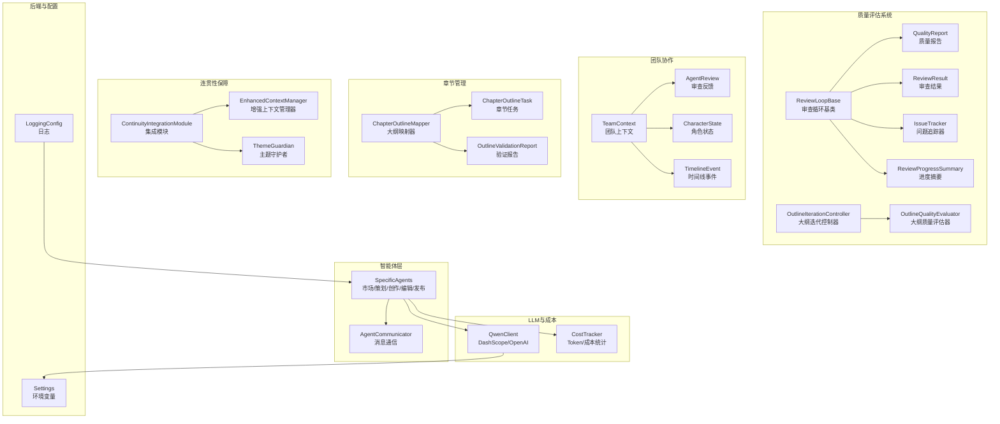
```mermaid
graph TB
subgraph "智能体层"
AC["AgentCommunicator<br/>消息通信"]
SA["SpecificAgents<br/>市场/策划/创作/编辑/发布"]
end
subgraph "质量评估系统"
RLB["ReviewLoopBase<br/>审查循环基类"]
QR["QualityReport<br/>质量报告"]
RR["ReviewResult<br/>审查结果"]
IE["IssueTracker<br/>问题追踪器"]
RS["ReviewProgressSummary<br/>进度摘要"]
OIC["OutlineIterationController<br/>大纲迭代控制器"]
OQE["OutlineQualityEvaluator<br/>大纲质量评估器"]
end
subgraph "团队协作"
TC["TeamContext<br/>团队上下文"]
AR["AgentReview<br/>审查反馈"]
CS["CharacterState<br/>角色状态"]
TL["TimelineEvent<br/>时间线事件"]
end
subgraph "章节管理"
COM["ChapterOutlineMapper<br/>大纲映射器"]
COT["ChapterOutlineTask<br/>章节任务"]
OVR["OutlineValidationReport<br/>验证报告"]
end
subgraph "连贯性保障"
CIM["ContinuityIntegrationModule<br/>集成模块"]
ECM["EnhancedContextManager<br/>增强上下文管理器"]
TG["ThemeGuardian<br/>主题守护者"]
end
subgraph "LLM与成本"
QC["QwenClient<br/>DashScope/OpenAI"]
CT["CostTracker<br/>Token/成本统计"]
end
subgraph "后端与配置"
CFG["Settings<br/>环境变量"]
LOG["LoggingConfig<br/>日志"]
end
SA --> AC
SA --> QC
SA --> CT
RLB --> QR
RLB --> RR
RLB --> IE
RLB --> RS
OIC --> OQE
TC --> AR
TC --> CS
TC --> TL
COM --> COT
COM --> OVR
CIM --> ECM
CIM --> TG
QC --> CFG
LOG --> SA
```

**图表来源**
- [agents/agent_communicator.py:72-180](file://agents/agent_communicator.py#L72-L180)
- [agents/specific_agents.py:15-505](file://agents/specific_agents.py#L15-L505)
- [agents/base/review_loop_base.py:598-800](file://agents/base/review_loop_base.py#L598-L800)
- [agents/team_context.py:162-591](file://agents/team_context.py#L162-L591)
- [agents/chapter_outline_mapper.py:187-800](file://agents/chapter_outline_mapper.py#L187-L800)
- [agents/outline_iteration_controller.py:39-404](file://agents/outline_iteration_controller.py#L39-L404)
- [agents/outline_quality_evaluator.py:93-440](file://agents/outline_quality_evaluator.py#L93-L440)
- [agents/continuity_integration_module.py:74-483](file://agents/continuity_integration_module.py#L74-L483)
- [agents/enhanced_context_manager.py:196-536](file://agents/enhanced_context_manager.py#L196-L536)
- [agents/theme_guardian.py:159-625](file://agents/theme_guardian.py#L159-L625)
- [llm/qwen_client.py:16-232](file://llm/qwen_client.py#L16-L232)
- [llm/cost_tracker.py:16-74](file://llm/cost_tracker.py#L16-L74)
- [backend/config.py:5-59](file://backend/config.py#L5-L59)
- [core/logging_config.py:20-55](file://core/logging_config.py#L20-L55)

**章节来源**
- [agents/agent_communicator.py:1-180](file://agents/agent_communicator.py#L1-L180)
- [agents/specific_agents.py:1-505](file://agents/specific_agents.py#L1-L505)
- [agents/base/review_loop_base.py:1-800](file://agents/base/review_loop_base.py#L1-L800)
- [agents/team_context.py:1-591](file://agents/team_context.py#L1-L591)
- [agents/chapter_outline_mapper.py:1-1109](file://agents/chapter_outline_mapper.py#L1-L1109)
- [agents/outline_iteration_controller.py:1-404](file://agents/outline_iteration_controller.py#L1-L404)
- [agents/outline_quality_evaluator.py:1-440](file://agents/outline_quality_evaluator.py#L1-L440)
- [agents/continuity_integration_module.py:1-483](file://agents/continuity_integration_module.py#L1-L483)
- [agents/enhanced_context_manager.py:1-536](file://agents/enhanced_context_manager.py#L1-L536)
- [agents/theme_guardian.py:1-625](file://agents/theme_guardian.py#L1-L625)
- [llm/qwen_client.py:1-232](file://llm/qwen_client.py#L1-L232)
- [llm/cost_tracker.py:1-74](file://llm/cost_tracker.py#L1-L74)
- [backend/config.py:1-59](file://backend/config.py#L1-L59)
- [core/logging_config.py:1-55](file://core/logging_config.py#L1-L55)

## 核心组件
- AgentCommunicator：消息通信中枢，提供注册、发送、接收、广播与历史记录能力。
- SpecificAgents：五类智能体，分别承担市场分析、内容策划、创作、编辑、发布职责。
- ReviewLoopBase：审查循环基类，提供多阶段质量评估的模板方法模式实现。
- QualityReport：质量评估报告基类，支持不同领域的质量分析和降级处理。
- ReviewResult：审查结果基类，支持不同类型的最终输出和迭代历史记录。
- TeamContext：团队上下文管理器，实现Agent间的共享状态和协作机制。
- ChapterOutlineMapper：章节大纲映射器，提供章节级任务分解和进度追踪功能。
- OutlineIterationController：大纲迭代优化控制器，管理大纲完善过程中的迭代优化。
- OutlineQualityEvaluator：大纲质量评估器，扩展现有的质量评估维度。
- ContinuityIntegrationModule：连贯性保障集成模块，整合所有连贯性保障组件。
- EnhancedContextManager：增强型上下文管理器，采用四层记忆架构确保关键信息不丢失。
- ThemeGuardian：主题守护者，负责定义小说核心主题并审查内容一致性。
- QwenClient：DashScope/OpenAI兼容的大模型客户端，支持重试与流式输出。
- CostTracker：Token用量与成本统计，按模型定价计算累计成本。
- Settings与LoggingConfig：配置与日志基础设施。

**章节来源**
- [agents/agent_communicator.py:72-180](file://agents/agent_communicator.py#L72-L180)
- [agents/specific_agents.py:15-505](file://agents/specific_agents.py#L15-L505)
- [agents/base/review_loop_base.py:598-800](file://agents/base/review_loop_base.py#L598-L800)
- [agents/team_context.py:162-591](file://agents/team_context.py#L162-L591)
- [agents/chapter_outline_mapper.py:187-800](file://agents/chapter_outline_mapper.py#L187-L800)
- [agents/outline_iteration_controller.py:39-404](file://agents/outline_iteration_controller.py#L39-L404)
- [agents/outline_quality_evaluator.py:93-440](file://agents/outline_quality_evaluator.py#L93-L440)
- [agents/continuity_integration_module.py:74-483](file://agents/continuity_integration_module.py#L74-L483)
- [agents/enhanced_context_manager.py:196-536](file://agents/enhanced_context_manager.py#L196-L536)
- [agents/theme_guardian.py:159-625](file://agents/theme_guardian.py#L159-L625)
- [llm/qwen_client.py:16-232](file://llm/qwen_client.py#L16-L232)
- [llm/cost_tracker.py:16-74](file://llm/cost_tracker.py#L16-L74)
- [backend/config.py:5-59](file://backend/config.py#L5-L59)
- [core/logging_config.py:20-55](file://core/logging_config.py#L20-L55)

## 架构总览
系统采用增强的多阶段质量评估架构，集成了智能体协作、质量控制、进度追踪和连贯性保障：
- 通过AgentCommunicator实现智能体间的异步消息传递
- 通过ReviewLoopBase实现多阶段质量评估循环
- 通过TeamContext实现团队协作和上下文共享
- 通过ChapterOutlineMapper实现章节级任务管理和进度追踪
- 通过OutlineIterationController和OutlineQualityEvaluator实现大纲级别的迭代优化
- 通过ContinuityIntegrationModule实现连贯性保障系统
- 通过SpecificAgents实现小说生成的各个阶段
- 通过QwenClient和CostTracker实现大模型调用与成本追踪

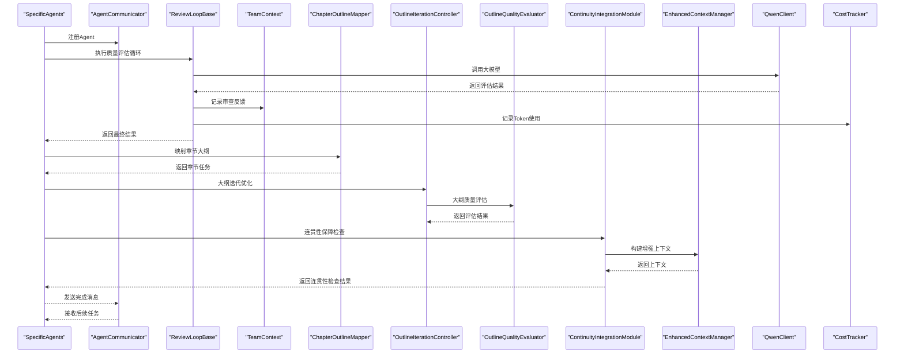
```mermaid
sequenceDiagram
participant Agent as "SpecificAgents"
participant Comm as "AgentCommunicator"
participant RL as "ReviewLoopBase"
participant TC as "TeamContext"
participant COM as "ChapterOutlineMapper"
participant OIC as "OutlineIterationController"
participant OQE as "OutlineQualityEvaluator"
participant CIM as "ContinuityIntegrationModule"
participant ECM as "EnhancedContextManager"
participant Qwen as "QwenClient"
participant Tracker as "CostTracker"
Agent->>Comm : 注册Agent
Agent->>RL : 执行质量评估循环
RL->>Qwen : 调用大模型
Qwen-->>RL : 返回评估结果
RL->>TC : 记录审查反馈
RL->>Tracker : 记录Token使用
RL-->>Agent : 返回最终结果
Agent->>COM : 映射章节大纲
COM-->>Agent : 返回章节任务
Agent->>OIC : 大纲迭代优化
OIC->>OQE : 大纲质量评估
OQE-->>OIC : 返回评估结果
Agent->>CIM : 连贯性保障检查
CIM->>ECM : 构建增强上下文
ECM-->>CIM : 返回上下文
CIM-->>Agent : 返回连贯性检查结果
Agent-->>Comm : 发送完成消息
Comm-->>Agent : 接收后续任务
```

**图表来源**
- [agents/specific_agents.py:37-505](file://agents/specific_agents.py#L37-L505)
- [agents/agent_communicator.py:91-135](file://agents/agent_communicator.py#L91-L135)
- [agents/base/review_loop_base.py:659-800](file://agents/base/review_loop_base.py#L659-L800)
- [agents/team_context.py:443-459](file://agents/team_context.py#L443-L459)
- [agents/chapter_outline_mapper.py:246-305](file://agents/chapter_outline_mapper.py#L246-L305)
- [agents/outline_iteration_controller.py:197-290](file://agents/outline_iteration_controller.py#L197-L290)
- [agents/outline_quality_evaluator.py:105-142](file://agents/outline_quality_evaluator.py#L105-L142)
- [agents/continuity_integration_module.py:176-249](file://agents/continuity_integration_module.py#L176-L249)
- [agents/enhanced_context_manager.py:211-279](file://agents/enhanced_context_manager.py#L211-L279)
- [llm/qwen_client.py:46-161](file://llm/qwen_client.py#L46-L161)
- [llm/cost_tracker.py:26-56](file://llm/cost_tracker.py#L26-L56)

## 详细组件分析

### 智能体类型与职责分工
- 市场分析Agent：基于PromptManager与QwenClient分析市场趋势、热门题材与标签，产出洞察供内容策划参考。
- 内容策划Agent：整合市场分析与用户偏好，生成小说标题、类型、标签、简介与内容计划。
- 创作Agent：根据内容计划与世界设定、角色信息生成章节初稿。
- 编辑Agent：对初稿进行润色与优化，提升可读性与一致性，支持Editor自动润色验证。
- 发布Agent：模拟发布流程，记录平台书号与章节号等元数据。

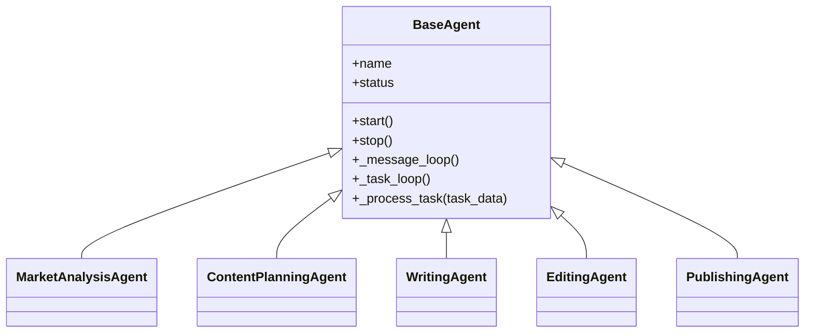
```mermaid
classDiagram
class BaseAgent {
+name
+status
+start()
+stop()
+_message_loop()
+_task_loop()
+_process_task(task_data)
}
class MarketAnalysisAgent
class ContentPlanningAgent
class WritingAgent
class EditingAgent
class PublishingAgent
BaseAgent <|-- MarketAnalysisAgent
BaseAgent <|-- ContentPlanningAgent
BaseAgent <|-- WritingAgent
BaseAgent <|-- EditingAgent
BaseAgent <|-- PublishingAgent
```

**图表来源**
- [agents/specific_agents.py:15-505](file://agents/specific_agents.py#L15-L505)

**章节来源**
- [agents/specific_agents.py:15-505](file://agents/specific_agents.py#L15-L505)

### 任务编排与执行流程（CrewAI风格）
- 企划阶段：主题分析师→世界观架构师→角色设计师→情节架构师，按顺序串联，每步均调用QwenClient并记录成本。
- 写作阶段：章节策划师→作家→编辑→连续性审查员，支持传入前几章摘要与角色状态，确保连贯性与质量评分。
- NovelCrewManager提供JSON提取与错误处理，保障跨Agent数据交换的稳定性。
- 增强的CrewManager集成连贯性保障系统，提供更全面的质量控制。

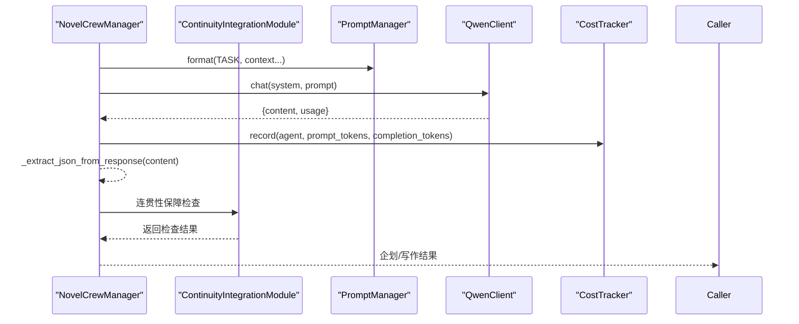
```mermaid
sequenceDiagram
participant CM as "NovelCrewManager"
participant CIM as "ContinuityIntegrationModule"
participant PM as "PromptManager"
participant Qwen as "QwenClient"
participant CT as "CostTracker"
CM->>PM : format(TASK, context...)
CM->>Qwen : chat(system, prompt)
Qwen-->>CM : {content, usage}
CM->>CT : record(agent, prompt_tokens, completion_tokens)
CM-->>CM : _extract_json_from_response(content)
CM->>CIM : 连贯性保障检查
CIM-->>CM : 返回检查结果
CM-->>Caller : 企划/写作结果
```

**图表来源**
- [agents/crew_manager.py:104-480](file://agents/crew_manager.py#L104-L480)
- [agents/continuity_integration_module.py:251-352](file://agents/continuity_integration_module.py#L251-L352)
- [llm/qwen_client.py:46-161](file://llm/qwen_client.py#L46-L161)
- [llm/cost_tracker.py:26-56](file://llm/cost_tracker.py#L26-L56)

**章节来源**
- [agents/crew_manager.py:19-480](file://agents/crew_manager.py#L19-L480)
- [agents/crew_manager_enhanced_example.py:18-424](file://agents/crew_manager_enhanced_example.py#L18-L424)

### Agent通信协议与消息传递机制
- 注册：Agent通过AgentCommunicator.register_agent注册到消息队列。
- 发送/接收：send_message与receive_message基于asyncio.Queue实现异步消息传递；支持超时与状态追踪。
- 广播：broadcast_message向所有已注册Agent广播消息。
- 历史：消息历史记录便于审计与调试。

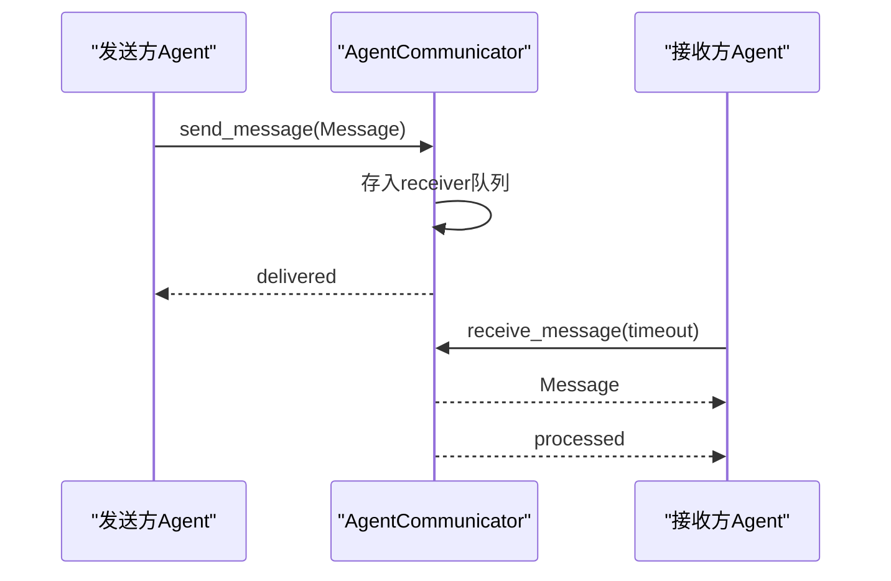
```mermaid
sequenceDiagram
participant Sender as "发送方Agent"
participant Comm as "AgentCommunicator"
participant Receiver as "接收方Agent"
Sender->>Comm : send_message(Message)
Comm->>Comm : 存入receiver队列
Comm-->>Sender : delivered
Receiver->>Comm : receive_message(timeout)
Comm-->>Receiver : Message
Comm-->>Receiver : processed
```

**图表来源**
- [agents/agent_communicator.py:91-135](file://agents/agent_communicator.py#L91-L135)

**章节来源**
- [agents/agent_communicator.py:72-180](file://agents/agent_communicator.py#L72-L180)

### 错误处理策略
- LLM调用：QwenClient在OpenAI与DashScope模式下均实现指数退避重试；异常统一抛出，便于上层捕获。
- 任务处理：Agent基类在任务处理异常时设置状态为ERROR，并记录日志；调度器在任务完成消息缺失或UUID解析失败时进行保护性处理。
- Crew阶段：NovelCrewManager对JSON提取失败与异常进行捕获并记录，必要时回退至CrewAI风格执行路径。
- 大纲优化：OutlineIterationController提供成本控制和迭代终止机制，防止无限循环。

**章节来源**
- [llm/qwen_client.py:65-161](file://llm/qwen_client.py#L65-L161)
- [agents/agent_scheduler.py:191-220](file://agents/agent_scheduler.py#L191-L220)
- [agents/crew_manager.py:37-102](file://agents/crew_manager.py#L37-L102)
- [agents/outline_iteration_controller.py:68-123](file://agents/outline_iteration_controller.py#L68-L123)

## 多阶段质量评估系统

### ReviewLoopBase架构设计
ReviewLoopBase采用模板方法模式，将共同的迭代控制逻辑封装在基类中，子类只需实现特定领域的抽象方法。系统支持多种质量评估场景，包括章节审查、世界观设计、角色评估等。

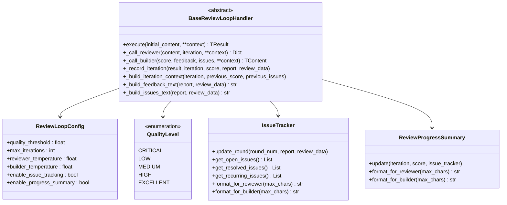
```mermaid
classDiagram
class BaseReviewLoopHandler {
<<abstract>>
+execute(initial_content, **context) TResult
+_call_reviewer(content, iteration, **context) Dict
+_call_builder(score, feedback, issues, **context) TContent
+_record_iteration(result, iteration, score, report, review_data)
+_build_iteration_context(iteration, previous_score, previous_issues)
+_build_feedback_text(report, review_data) str
+_build_issues_text(report, review_data) str
}
class ReviewLoopConfig {
+quality_threshold : float
+max_iterations : int
+reviewer_temperature : float
+builder_temperature : float
+enable_issue_tracking : bool
+enable_progress_summary : bool
}
class QualityLevel {
<<enumeration>>
CRITICAL
LOW
MEDIUM
HIGH
EXCELLENT
}
class IssueTracker {
+update_round(round_num, report, review_data)
+get_open_issues() List
+get_resolved_issues() List
+get_recurring_issues() List
+format_for_reviewer(max_chars) str
+format_for_builder(max_chars) str
}
class ReviewProgressSummary {
+update(iteration, score, issue_tracker)
+format_for_reviewer(max_chars) str
+format_for_builder(max_chars) str
}
BaseReviewLoopHandler --> ReviewLoopConfig
BaseReviewLoopHandler --> QualityLevel
BaseReviewLoopHandler --> IssueTracker
BaseReviewLoopHandler --> ReviewProgressSummary
```

**图表来源**
- [agents/base/review_loop_base.py:598-800](file://agents/base/review_loop_base.py#L598-L800)
- [agents/base/review_loop_base.py:178-490](file://agents/base/review_loop_base.py#L178-L490)
- [agents/base/review_loop_base.py:492-596](file://agents/base/review_loop_base.py#L492-L596)

### 质量级别分类与评估策略
系统提供五个质量级别，每个级别对应不同的修订策略和反馈指导：
- CRITICAL（< 5.0）：严重不合格，需要结构性重写
- LOW（5.0 - 6.0）：质量偏低，需要大幅修订
- MEDIUM（6.0 - 7.0）：基本合格，需要针对性修改
- HIGH（7.0 - 8.0）：质量良好，需要细节优化
- EXCELLENT（>= 8.0）：质量优秀，仅需微调润色

**章节来源**
- [agents/base/review_loop_base.py:79-161](file://agents/base/review_loop_base.py#L79-L161)

### 问题追踪与进度管理
IssueTracker提供跨轮次问题追踪功能，使用字符bigram Jaccard相似度进行问题匹配，追踪每个问题在多轮审查中的生命周期。ReviewProgressSummary提供审查进度摘要，包括评分趋势和各轮概况。

**章节来源**
- [agents/base/review_loop_base.py:178-596](file://agents/base/review_loop_base.py#L178-L596)

## 团队协作机制

### TeamContext设计与实现
TeamContext借鉴AgentMesh的TeamContext设计，实现Agent之间的信息共享和状态追踪。系统提供线程安全的数据结构，支持异步操作和同步操作。

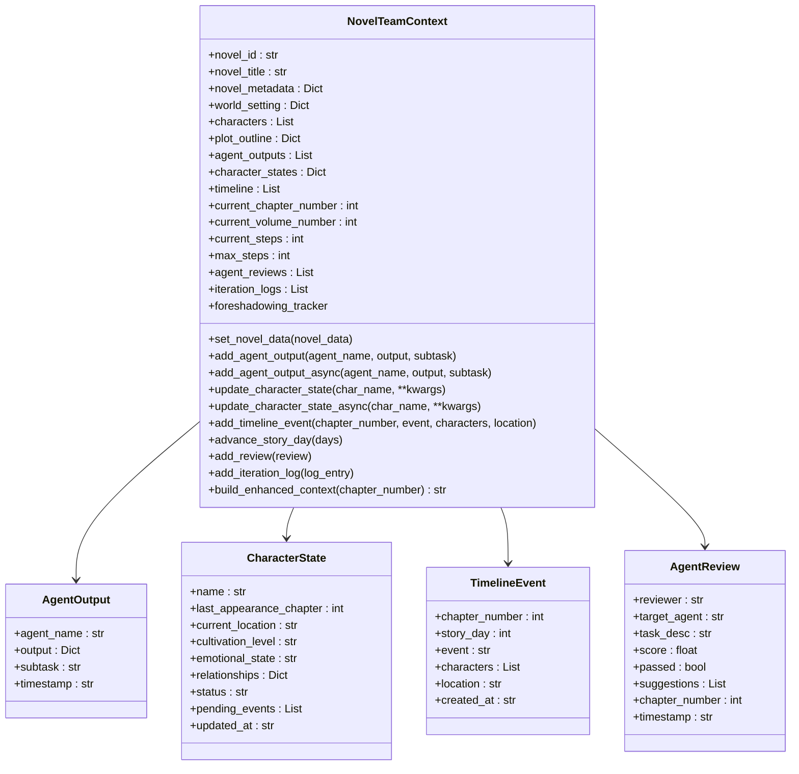
```mermaid
classDiagram
class NovelTeamContext {
+novel_id : str
+novel_title : str
+novel_metadata : Dict
+world_setting : Dict
+characters : List
+plot_outline : Dict
+agent_outputs : List
+character_states : Dict
+timeline : List
+current_chapter_number : int
+current_volume_number : int
+current_steps : int
+max_steps : int
+agent_reviews : List
+iteration_logs : List
+foreshadowing_tracker
+set_novel_data(novel_data)
+add_agent_output(agent_name, output, subtask)
+add_agent_output_async(agent_name, output, subtask)
+update_character_state(char_name, **kwargs)
+update_character_state_async(char_name, **kwargs)
+add_timeline_event(chapter_number, event, characters, location)
+advance_story_day(days)
+add_review(review)
+add_iteration_log(log_entry)
+build_enhanced_context(chapter_number) str
}
class AgentOutput {
+agent_name : str
+output : Dict
+subtask : str
+timestamp : str
}
class CharacterState {
+name : str
+last_appearance_chapter : int
+current_location : str
+cultivation_level : str
+emotional_state : str
+relationships : Dict
+status : str
+pending_events : List
+updated_at : str
}
class TimelineEvent {
+chapter_number : int
+story_day : int
+event : str
+characters : List
+location : str
+created_at : str
}
class AgentReview {
+reviewer : str
+target_agent : str
+task_desc : str
+score : float
+passed : bool
+suggestions : List
+chapter_number : int
+timestamp : str
}
NovelTeamContext --> AgentOutput
NovelTeamContext --> CharacterState
NovelTeamContext --> TimelineEvent
NovelTeamContext --> AgentReview
```

**图表来源**
- [agents/team_context.py:162-591](file://agents/team_context.py#L162-L591)
- [agents/team_context.py:21-160](file://agents/team_context.py#L21-L160)

### 上下文共享与状态追踪
TeamContext提供多种上下文共享机制：
- Agent输出历史：记录所有Agent的输出，支持异步和同步两种模式
- 角色状态管理：追踪角色的当前位置、修为、情感状态等
- 时间线追踪：记录故事进展和关键事件
- 审查反馈记录：记录每次Agent审查的详细信息
- 迭代日志：记录Writer-Editor等循环的每轮信息

**章节来源**
- [agents/team_context.py:162-591](file://agents/team_context.py#L162-L591)

## 章节大纲映射功能

### ChapterOutlineMapper架构设计
ChapterOutlineMapper将卷级大纲分解为章节级任务，为每章分配"必须完成的大纲事件"并追踪大纲完成进度。系统支持张力循环分析和智能伏笔分配。

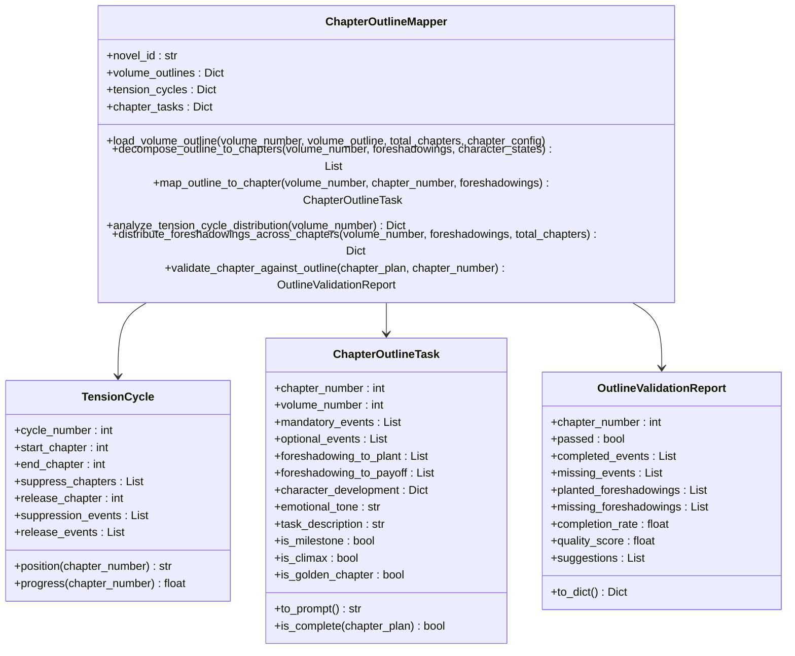
```mermaid
classDiagram
class ChapterOutlineMapper {
+novel_id : str
+volume_outlines : Dict
+tension_cycles : Dict
+chapter_tasks : Dict
+load_volume_outline(volume_number, volume_outline, total_chapters, chapter_config)
+decompose_outline_to_chapters(volume_number, foreshadowings, character_states) List
+map_outline_to_chapter(volume_number, chapter_number, foreshadowings) ChapterOutlineTask
+analyze_tension_cycle_distribution(volume_number) Dict
+distribute_foreshadowings_across_chapters(volume_number, foreshadowings, total_chapters) Dict
+validate_chapter_against_outline(chapter_plan, chapter_number) OutlineValidationReport
}
class TensionCycle {
+cycle_number : int
+start_chapter : int
+end_chapter : int
+suppress_chapters : List
+release_chapter : int
+suppression_events : List
+release_events : List
+position(chapter_number) str
+progress(chapter_number) float
}
class ChapterOutlineTask {
+chapter_number : int
+volume_number : int
+mandatory_events : List
+optional_events : List
+foreshadowing_to_plant : List
+foreshadowing_to_payoff : List
+character_development : Dict
+emotional_tone : str
+task_description : str
+is_milestone : bool
+is_climax : bool
+is_golden_chapter : bool
+to_prompt() str
+is_complete(chapter_plan) bool
}
class OutlineValidationReport {
+chapter_number : int
+passed : bool
+completed_events : List
+missing_events : List
+planted_foreshadowings : List
+missing_foreshadowings : List
+completion_rate : float
+quality_score : float
+suggestions : List
+to_dict() Dict
}
ChapterOutlineMapper --> TensionCycle
ChapterOutlineMapper --> ChapterOutlineTask
ChapterOutlineMapper --> OutlineValidationReport
```

**图表来源**
- [agents/chapter_outline_mapper.py:187-800](file://agents/chapter_outline_mapper.py#L187-L800)
- [agents/chapter_outline_mapper.py:19-143](file://agents/chapter_outline_mapper.py#L19-L143)
- [agents/chapter_outline_mapper.py:145-186](file://agents/chapter_outline_mapper.py#L145-L186)

### 张力循环分析与智能分配
系统支持张力循环分析，包括：
- 自动解析卷大纲中的张力循环
- 智能分配章节任务到合适的张力周期
- 伏笔的智能埋设和回收提醒
- 基于章节类型的动态迭代策略

**章节来源**
- [agents/chapter_outline_mapper.py:331-461](file://agents/chapter_outline_mapper.py#L331-L461)

### 章节验证与进度追踪
OutlineValidationReport提供章节完成度验证功能：
- 检查强制性事件的完成情况
- 验证伏笔的埋设和回收
- 计算完成率和质量评分
- 生成改进建议和通过判定

**章节来源**
- [agents/chapter_outline_mapper.py:898-977](file://agents/chapter_outline_mapper.py#L898-L977)

## 大纲迭代优化系统

### OutlineIterationController架构设计
OutlineIterationController专门负责大纲级别的迭代优化，提供质量评分和一致性评分的双重阈值控制，支持成本限制和迭代历史记录。

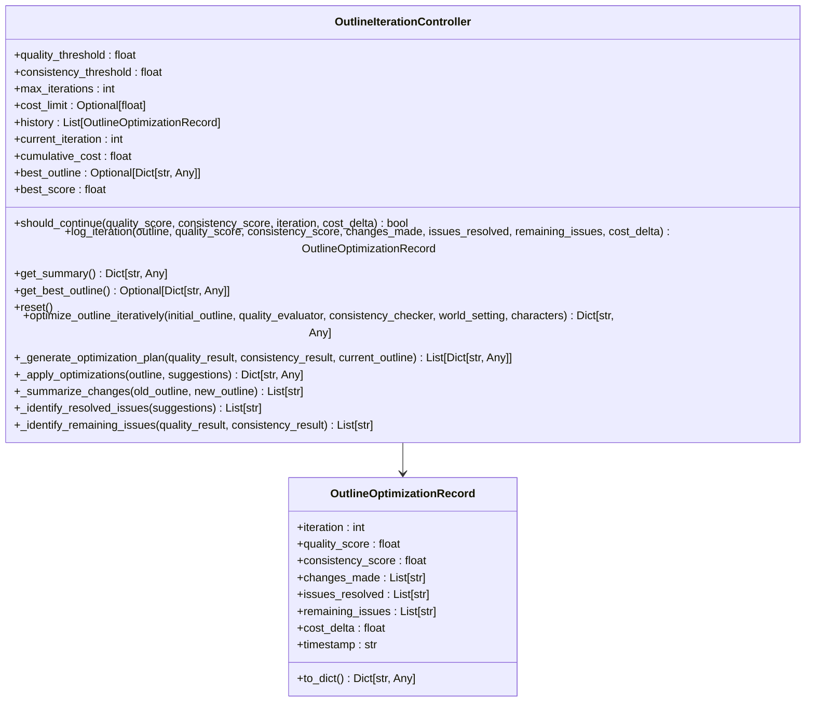
```mermaid
classDiagram
class OutlineOptimizationRecord {
+iteration : int
+quality_score : float
+consistency_score : float
+changes_made : List[str]
+issues_resolved : List[str]
+remaining_issues : List[str]
+cost_delta : float
+timestamp : str
+to_dict() Dict[str, Any]
}
class OutlineIterationController {
+quality_threshold : float
+consistency_threshold : float
+max_iterations : int
+cost_limit : Optional[float]
+history : List[OutlineOptimizationRecord]
+current_iteration : int
+cumulative_cost : float
+best_outline : Optional[Dict[str, Any]]
+best_score : float
+should_continue(quality_score, consistency_score, iteration, cost_delta) bool
+log_iteration(outline, quality_score, consistency_score, changes_made, issues_resolved, remaining_issues, cost_delta) OutlineOptimizationRecord
+get_summary() Dict[str, Any]
+get_best_outline() Optional[Dict[str, Any]]
+reset()
+optimize_outline_iteratively(initial_outline, quality_evaluator, consistency_checker, world_setting, characters) Dict[str, Any]
+_generate_optimization_plan(quality_result, consistency_result, current_outline) List[Dict[str, Any]]
+_apply_optimizations(outline, suggestions) Dict[str, Any]
+_summarize_changes(old_outline, new_outline) List[str]
+_identify_resolved_issues(suggestions) List[str]
+_identify_remaining_issues(quality_result, consistency_result) List[str]
}
OutlineIterationController --> OutlineOptimizationRecord
```

**图表来源**
- [agents/outline_iteration_controller.py:10-404](file://agents/outline_iteration_controller.py#L10-L404)

### OutlineQualityEvaluator扩展评估维度
OutlineQualityEvaluator扩展了传统的质量评估维度，提供更全面的大纲质量分析：

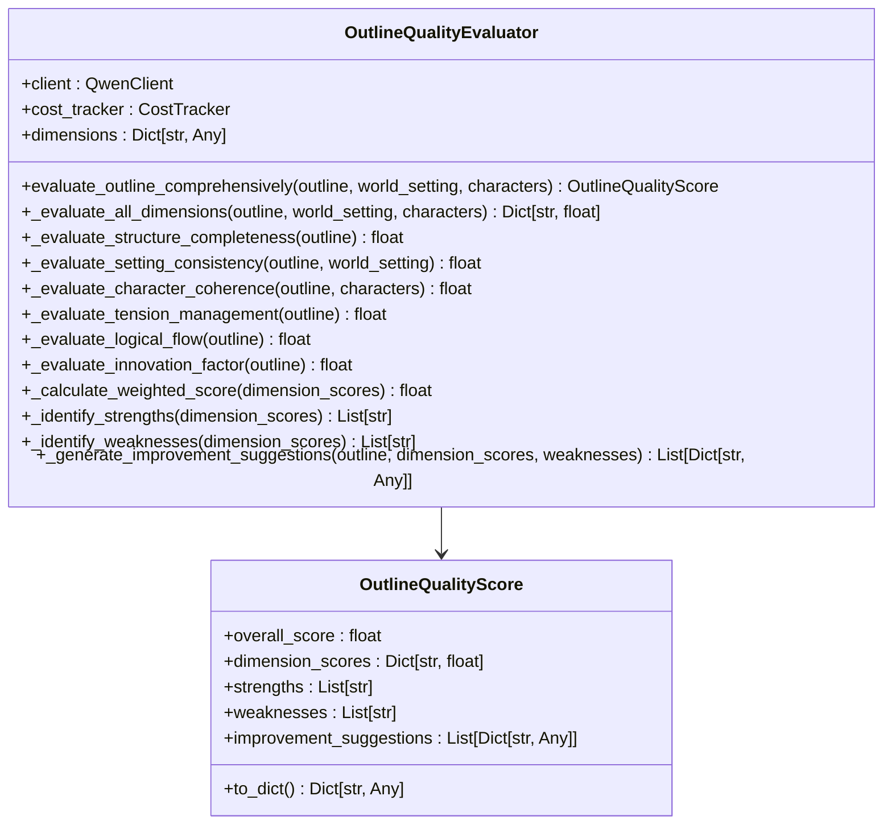
```mermaid
classDiagram
class OutlineQualityScore {
+overall_score : float
+dimension_scores : Dict[str, float]
+strengths : List[str]
+weaknesses : List[str]
+improvement_suggestions : List[Dict[str, Any]]
+to_dict() Dict[str, Any]
}
class OutlineQualityEvaluator {
+client : QwenClient
+cost_tracker : CostTracker
+dimensions : Dict[str, Any]
+evaluate_outline_comprehensively(outline, world_setting, characters) OutlineQualityScore
+_evaluate_all_dimensions(outline, world_setting, characters) Dict[str, float]
+_evaluate_structure_completeness(outline) float
+_evaluate_setting_consistency(outline, world_setting) float
+_evaluate_character_coherence(outline, characters) float
+_evaluate_tension_management(outline) float
+_evaluate_logical_flow(outline) float
+_evaluate_innovation_factor(outline) float
+_calculate_weighted_score(dimension_scores) float
+_identify_strengths(dimension_scores) List[str]
+_identify_weaknesses(dimension_scores) List[str]
+_generate_improvement_suggestions(outline, dimension_scores, weaknesses) List[Dict[str, Any]]
}
OutlineQualityEvaluator --> OutlineQualityScore
```

**图表来源**
- [agents/outline_quality_evaluator.py:75-440](file://agents/outline_quality_evaluator.py#L75-L440)

### 大纲优化策略与实现
系统提供六个扩展的评估维度：
- 结构完整性：检查三幕结构、转折点分布、结局完整性和卷级结构
- 世界观一致性：评估力量体系使用、地理环境描述、势力关系和历史文化背景
- 角色连贯性：分析角色动机、成长轨迹、关系变化和主要角色戏份
- 张力节奏控制：评估冲突层次、高潮安排、节奏变化和张力循环
- 逻辑连贯性：检查因果关系、时间线合理性和事件衔接
- 创意新颖性：评估独特设定、情节设计新意、角色塑造立体性和主题深度

**章节来源**
- [agents/outline_iteration_controller.py:39-404](file://agents/outline_iteration_controller.py#L39-L404)
- [agents/outline_quality_evaluator.py:11-73](file://agents/outline_quality_evaluator.py#L11-L73)

## 增强的CrewManager综合优化

### 综合大纲完善功能
增强的CrewManager提供了综合的大纲完善功能，支持多轮迭代优化和质量评估：

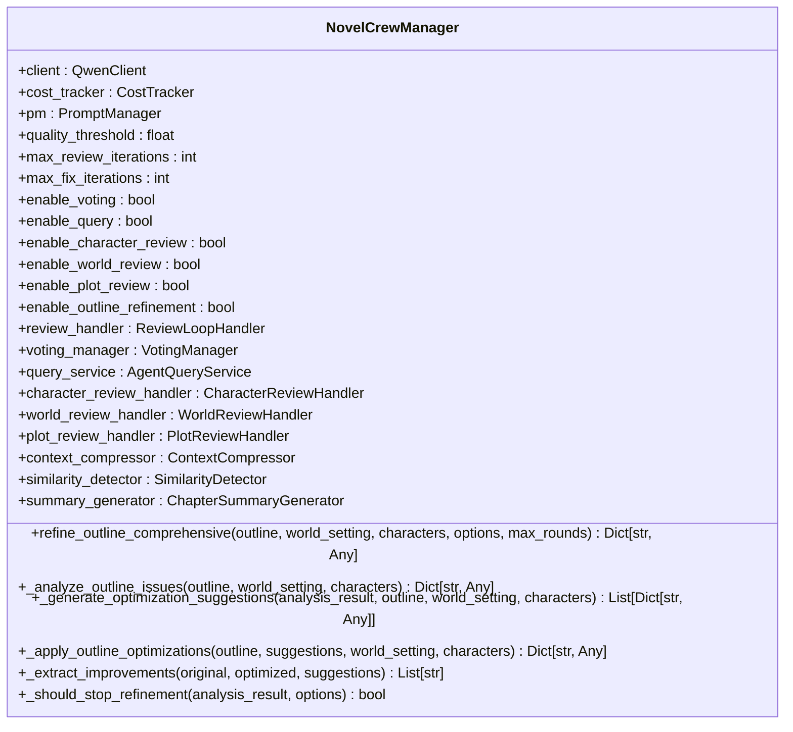
```mermaid
classDiagram
class NovelCrewManager {
+client : QwenClient
+cost_tracker : CostTracker
+pm : PromptManager
+quality_threshold : float
+max_review_iterations : int
+max_fix_iterations : int
+enable_voting : bool
+enable_query : bool
+enable_character_review : bool
+enable_world_review : bool
+enable_plot_review : bool
+enable_outline_refinement : bool
+review_handler : ReviewLoopHandler
+voting_manager : VotingManager
+query_service : AgentQueryService
+character_review_handler : CharacterReviewHandler
+world_review_handler : WorldReviewHandler
+plot_review_handler : PlotReviewHandler
+context_compressor : ContextCompressor
+similarity_detector : SimilarityDetector
+summary_generator : ChapterSummaryGenerator
+refine_outline_comprehensive(outline, world_setting, characters, options, max_rounds) Dict[str, Any]
+_analyze_outline_issues(outline, world_setting, characters) Dict[str, Any]
+_generate_optimization_suggestions(analysis_result, outline, world_setting, characters) List[Dict[str, Any]]
+_apply_outline_optimizations(outline, suggestions, world_setting, characters) Dict[str, Any]
+_extract_improvements(original, optimized, suggestions) List[str]
+_should_stop_refinement(analysis_result, options) bool
}
```

**图表来源**
- [agents/crew_manager.py:38-1592](file://agents/crew_manager.py#L38-L1592)

### 连贯性保障集成示例
EnhancedCrewManager展示了如何将连贯性保障组件集成到CrewManager中：

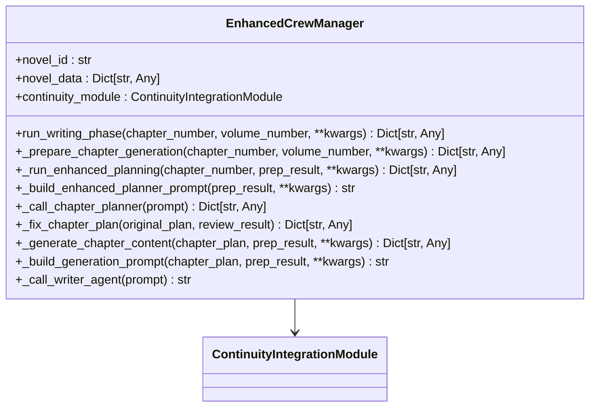
```mermaid
classDiagram
class EnhancedCrewManager {
+novel_id : str
+novel_data : Dict[str, Any]
+continuity_module : ContinuityIntegrationModule
+run_writing_phase(chapter_number, volume_number, **kwargs) Dict[str, Any]
+_prepare_chapter_generation(chapter_number, volume_number, **kwargs) Dict[str, Any]
+_run_enhanced_planning(chapter_number, prep_result, **kwargs) Dict[str, Any]
+_build_enhanced_planner_prompt(prep_result, **kwargs) str
+_call_chapter_planner(prompt) Dict[str, Any]
+_fix_chapter_plan(original_plan, review_result) Dict[str, Any]
+_generate_chapter_content(chapter_plan, prep_result, **kwargs) Dict[str, Any]
+_build_generation_prompt(chapter_plan, prep_result, **kwargs) str
+_call_writer_agent(prompt) str
}
EnhancedCrewManager --> ContinuityIntegrationModule
```

**图表来源**
- [agents/crew_manager_enhanced_example.py:18-424](file://agents/crew_manager_enhanced_example.py#L18-L424)

**章节来源**
- [agents/crew_manager.py:1346-1592](file://agents/crew_manager.py#L1346-L1592)
- [agents/crew_manager_enhanced_example.py:18-424](file://agents/crew_manager_enhanced_example.py#L18-L424)

## 连贯性保障系统

### ContinuityIntegrationModule架构设计
ContinuityIntegrationModule将所有连贯性保障组件集成到一个统一的接口中，提供完整的连贯性检查流程。

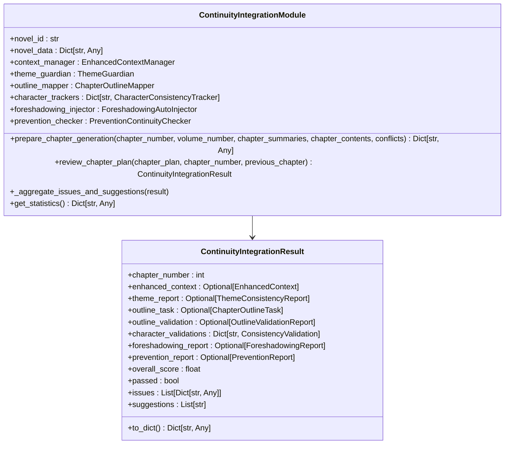
```mermaid
classDiagram
class ContinuityIntegrationResult {
+chapter_number : int
+enhanced_context : Optional[EnhancedContext]
+theme_report : Optional[ThemeConsistencyReport]
+outline_task : Optional[ChapterOutlineTask]
+outline_validation : Optional[OutlineValidationReport]
+character_validations : Dict[str, ConsistencyValidation]
+foreshadowing_report : Optional[ForeshadowingReport]
+prevention_report : Optional[PreventionReport]
+overall_score : float
+passed : bool
+issues : List[Dict[str, Any]]
+suggestions : List[str]
+to_dict() Dict[str, Any]
}
class ContinuityIntegrationModule {
+novel_id : str
+novel_data : Dict[str, Any]
+context_manager : EnhancedContextManager
+theme_guardian : ThemeGuardian
+outline_mapper : ChapterOutlineMapper
+character_trackers : Dict[str, CharacterConsistencyTracker]
+foreshadowing_injector : ForeshadowingAutoInjector
+prevention_checker : PreventionContinuityChecker
+prepare_chapter_generation(chapter_number, volume_number, chapter_summaries, chapter_contents, conflicts) Dict[str, Any]
+review_chapter_plan(chapter_plan, chapter_number, previous_chapter) ContinuityIntegrationResult
+_aggregate_issues_and_suggestions(result)
+get_statistics() Dict[str, Any]
}
ContinuityIntegrationModule --> ContinuityIntegrationResult
```

**图表来源**
- [agents/continuity_integration_module.py:30-483](file://agents/continuity_integration_module.py#L30-L483)

### EnhancedContextManager四层记忆架构
EnhancedContextManager采用四层记忆架构，确保关键信息不会丢失：

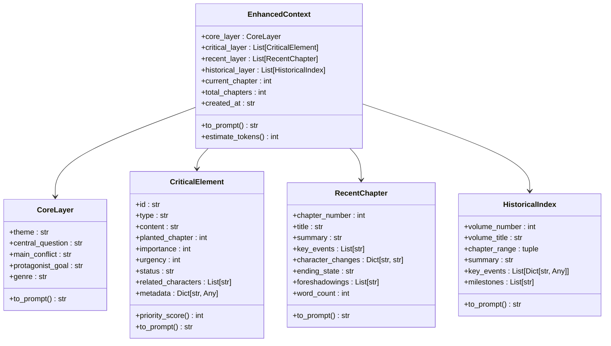
```mermaid
classDiagram
class CoreLayer {
+theme : str
+central_question : str
+main_conflict : str
+protagonist_goal : str
+genre : str
+to_prompt() str
}
class CriticalElement {
+id : str
+type : str
+content : str
+planted_chapter : int
+importance : int
+urgency : int
+status : str
+related_characters : List[str]
+metadata : Dict[str, Any]
+priority_score() int
+to_prompt() str
}
class RecentChapter {
+chapter_number : int
+title : str
+summary : str
+key_events : List[str]
+character_changes : Dict[str, str]
+ending_state : str
+foreshadowings : List[str]
+word_count : int
+to_prompt() str
}
class HistoricalIndex {
+volume_number : int
+volume_title : str
+chapter_range : tuple
+summary : str
+key_events : List[Dict[str, Any]]
+milestones : List[str]
+to_prompt() str
}
class EnhancedContext {
+core_layer : CoreLayer
+critical_layer : List[CriticalElement]
+recent_layer : List[RecentChapter]
+historical_layer : List[HistoricalIndex]
+current_chapter : int
+total_chapters : int
+created_at : str
+to_prompt() str
+estimate_tokens() int
}
EnhancedContext --> CoreLayer
EnhancedContext --> CriticalElement
EnhancedContext --> RecentChapter
EnhancedContext --> HistoricalIndex
```

**图表来源**
- [agents/enhanced_context_manager.py:20-536](file://agents/enhanced_context_manager.py#L20-L536)

### ThemeGuardian主题一致性检查
ThemeGuardian负责定义小说核心主题并审查内容一致性，提供四个维度的评估：

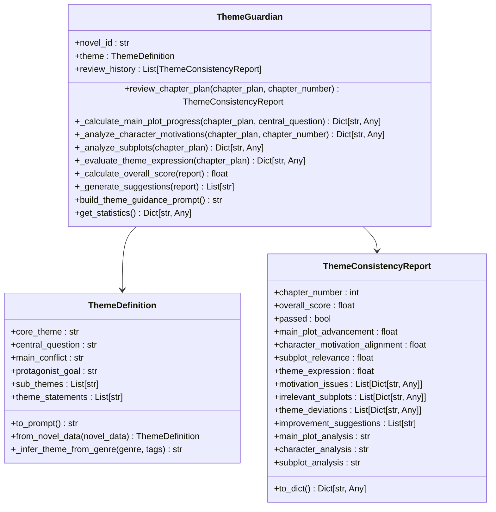
```mermaid
classDiagram
class ThemeDefinition {
+core_theme : str
+central_question : str
+main_conflict : str
+protagonist_goal : str
+sub_themes : List[str]
+theme_statements : List[str]
+to_prompt() str
+from_novel_data(novel_data) ThemeDefinition
+_infer_theme_from_genre(genre, tags) str
}
class ThemeConsistencyReport {
+chapter_number : int
+overall_score : float
+passed : bool
+main_plot_advancement : float
+character_motivation_alignment : float
+subplot_relevance : float
+theme_expression : float
+motivation_issues : List[Dict[str, Any]]
+irrelevant_subplots : List[Dict[str, Any]]
+theme_deviations : List[Dict[str, Any]]
+improvement_suggestions : List[str]
+main_plot_analysis : str
+character_analysis : str
+subplot_analysis : str
+to_dict() Dict[str, Any]
}
class ThemeGuardian {
+novel_id : str
+theme : ThemeDefinition
+review_history : List[ThemeConsistencyReport]
+review_chapter_plan(chapter_plan, chapter_number) ThemeConsistencyReport
+_calculate_main_plot_progress(chapter_plan, central_question) Dict[str, Any]
+_analyze_character_motivations(chapter_plan, chapter_number) Dict[str, Any]
+_analyze_subplots(chapter_plan) Dict[str, Any]
+_evaluate_theme_expression(chapter_plan) Dict[str, Any]
+_calculate_overall_score(report) float
+_generate_suggestions(report) List[str]
+build_theme_guidance_prompt() str
+get_statistics() Dict[str, Any]
}
ThemeGuardian --> ThemeDefinition
ThemeGuardian --> ThemeConsistencyReport
```

**图表来源**
- [agents/theme_guardian.py:19-625](file://agents/theme_guardian.py#L19-L625)

**章节来源**
- [agents/continuity_integration_module.py:74-483](file://agents/continuity_integration_module.py#L74-L483)
- [agents/enhanced_context_manager.py:196-536](file://agents/enhanced_context_manager.py#L196-L536)
- [agents/theme_guardian.py:159-625](file://agents/theme_guardian.py#L159-L625)

## 依赖关系分析
- 组件耦合：
  - SpecificAgents依赖AgentCommunicator与QwenClient/CostTracker/PromptManager。
  - ReviewLoopBase依赖QualityReport、ReviewResult、IssueTracker等基础组件。
  - TeamContext提供跨Agent的状态共享和协作机制。
  - ChapterOutlineMapper依赖TeamContext进行上下文构建。
  - OutlineIterationController和OutlineQualityEvaluator提供大纲级别的质量控制。
  - ContinuityIntegrationModule整合所有连贯性保障组件。
- 外部依赖：
  - DashScope/OpenAI SDK用于大模型推理。
  - Settings提供配置注入，LoggingConfig提供统一日志。
- 潜在风险：
  - 并发环境下消息队列与任务状态更新需保持原子性，已在关键路径加锁。
  - 大纲优化过程中的成本控制和迭代终止机制需要合理配置阈值。

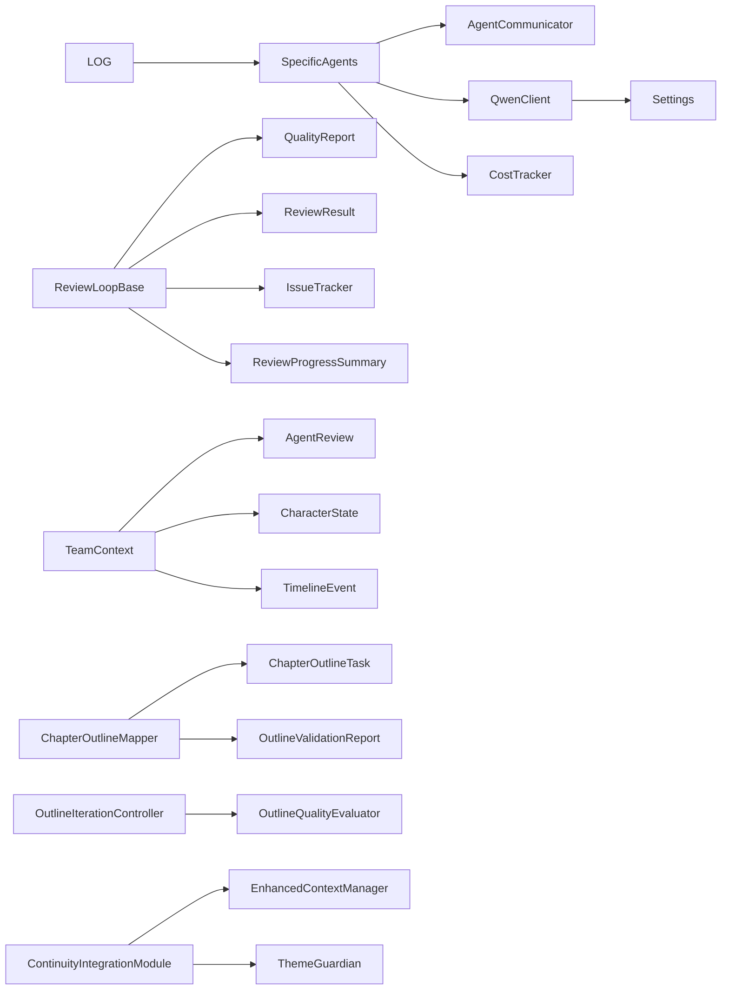
```mermaid
graph LR
SA["SpecificAgents"] --> AC["AgentCommunicator"]
SA --> QC["QwenClient"]
SA --> CT["CostTracker"]
RLB["ReviewLoopBase"] --> QR["QualityReport"]
RLB --> RR["ReviewResult"]
RLB --> IE["IssueTracker"]
RLB --> RS["ReviewProgressSummary"]
TC["TeamContext"] --> AR["AgentReview"]
TC --> CS["CharacterState"]
TC --> TL["TimelineEvent"]
COM["ChapterOutlineMapper"] --> COT["ChapterOutlineTask"]
COM --> OVR["OutlineValidationReport"]
OIC["OutlineIterationController"] --> OQE["OutlineQualityEvaluator"]
CIM["ContinuityIntegrationModule"] --> ECM["EnhancedContextManager"]
CIM --> TG["ThemeGuardian"]
QC --> CFG["Settings"]
LOG --> SA
```

**图表来源**
- [agents/specific_agents.py:15-505](file://agents/specific_agents.py#L15-L505)
- [agents/base/review_loop_base.py:598-800](file://agents/base/review_loop_base.py#L598-L800)
- [agents/team_context.py:162-591](file://agents/team_context.py#L162-L591)
- [agents/chapter_outline_mapper.py:187-800](file://agents/chapter_outline_mapper.py#L187-L800)
- [agents/outline_iteration_controller.py:39-404](file://agents/outline_iteration_controller.py#L39-L404)
- [agents/outline_quality_evaluator.py:93-440](file://agents/outline_quality_evaluator.py#L93-L440)
- [agents/continuity_integration_module.py:74-483](file://agents/continuity_integration_module.py#L74-L483)
- [agents/enhanced_context_manager.py:196-536](file://agents/enhanced_context_manager.py#L196-L536)
- [agents/theme_guardian.py:159-625](file://agents/theme_guardian.py#L159-L625)
- [agents/agent_communicator.py:72-180](file://agents/agent_communicator.py#L72-L180)
- [llm/qwen_client.py:16-232](file://llm/qwen_client.py#L16-L232)
- [llm/cost_tracker.py:16-74](file://llm/cost_tracker.py#L16-L74)
- [backend/config.py:5-59](file://backend/config.py#L5-L59)
- [core/logging_config.py:20-55](file://core/logging_config.py#L20-L55)

**章节来源**
- [agents/specific_agents.py:1-505](file://agents/specific_agents.py#L1-L505)
- [agents/base/review_loop_base.py:1-800](file://agents/base/review_loop_base.py#L1-L800)
- [agents/team_context.py:1-591](file://agents/team_context.py#L1-L591)
- [agents/chapter_outline_mapper.py:1-1109](file://agents/chapter_outline_mapper.py#L1-L1109)
- [agents/outline_iteration_controller.py:1-404](file://agents/outline_iteration_controller.py#L1-L404)
- [agents/outline_quality_evaluator.py:1-440](file://agents/outline_quality_evaluator.py#L1-L440)
- [agents/continuity_integration_module.py:1-483](file://agents/continuity_integration_module.py#L1-L483)
- [agents/enhanced_context_manager.py:1-536](file://agents/enhanced_context_manager.py#L1-L536)
- [agents/theme_guardian.py:1-625](file://agents/theme_guardian.py#L1-L625)
- [agents/agent_communicator.py:1-180](file://agents/agent_communicator.py#L1-L180)
- [llm/qwen_client.py:1-232](file://llm/qwen_client.py#L1-L232)
- [llm/cost_tracker.py:1-74](file://llm/cost_tracker.py#L1-L74)
- [backend/config.py:1-59](file://backend/config.py#L1-L59)
- [core/logging_config.py:1-55](file://core/logging_config.py#L1-L55)

## 性能考量
- 并发与异步：基于asyncio的队列与任务循环，避免阻塞；QwenClient在DashScope模式下通过线程池执行同步调用，防止阻塞事件循环。
- 重试与退避：QwenClient支持指数退避重试，降低瞬时错误影响。
- 成本控制：CostTracker按模型定价实时统计，便于预算控制与成本优化。
- 质量评估优化：ReviewLoopBase支持动态迭代策略，根据章节类型调整迭代次数和质量阈值。
- 上下文管理：TeamContext使用异步锁保护写操作，读操作返回数据快照，避免并发修改问题。
- 大纲优化控制：OutlineIterationController提供成本限制和迭代次数限制，防止无限循环。
- 连贯性检查：ContinuityIntegrationModule采用分层检查策略，先进行快速筛选再进行深度分析。
- 可观测性：统一日志与消息历史，便于定位瓶颈与异常。
- 扩展性建议：
  - 引入限流与熔断（如令牌桶/滑动窗口），防止LLM调用峰值冲击。
  - 任务队列持久化与重试策略，增强可靠性。
  - 负载均衡：按Agent类型与资源占用动态分配任务，避免热点。

## 故障排查指南
- Agent未启动/状态异常
  - 检查AgentCommunicator.register_agent是否成功注册。
- LLM调用失败
  - 查看QwenClient的重试日志与最终异常信息。
  - 核对Settings中的API Key与Base URL配置。
- 成本统计异常
  - 确认CostTracker的record调用是否覆盖所有Agent调用路径。
  - 检查模型定价表与Token统计是否一致。
- 质量评估循环异常
  - 检查ReviewLoopBase的配置参数和迭代次数限制。
  - 验证QualityReport的降级处理逻辑。
- 团队协作问题
  - 检查TeamContext的异步锁是否正确使用。
  - 确认AgentReview和CharacterState的序列化/反序列化。
- 章节大纲映射错误
  - 验证ChapterOutlineMapper的卷大纲数据格式。
  - 检查张力循环解析和任务分配逻辑。
- 大纲优化失败
  - 检查OutlineIterationController的成本阈值和迭代次数配置。
  - 验证OutlineQualityEvaluator的评估维度权重设置。
- 连贯性保障异常
  - 检查ContinuityIntegrationModule的组件初始化顺序。
  - 确认EnhancedContextManager的上下文构建逻辑。
  - 验证ThemeGuardian的主题定义提取是否正确。

**章节来源**
- [agents/agent_communicator.py:80-135](file://agents/agent_communicator.py#L80-L135)
- [llm/qwen_client.py:65-161](file://llm/qwen_client.py#L65-L161)
- [llm/cost_tracker.py:26-56](file://llm/cost_tracker.py#L26-L56)
- [agents/base/review_loop_base.py:659-800](file://agents/base/review_loop_base.py#L659-L800)
- [agents/team_context.py:232-254](file://agents/team_context.py#L232-L254)
- [agents/chapter_outline_mapper.py:463-566](file://agents/chapter_outline_mapper.py#L463-L566)
- [agents/outline_iteration_controller.py:68-123](file://agents/outline_iteration_controller.py#L68-L123)
- [agents/outline_quality_evaluator.py:143-157](file://agents/outline_quality_evaluator.py#L143-L157)
- [agents/continuity_integration_module.py:98-123](file://agents/continuity_integration_module.py#L98-L123)
- [agents/enhanced_context_manager.py:236-279](file://agents/enhanced_context_manager.py#L236-L279)
- [agents/theme_guardian.py:248-294](file://agents/theme_guardian.py#L248-294)
- [backend/config.py:5-59](file://backend/config.py#L5-L59)

## 结论
该系统采用增强的多阶段质量评估架构，集成了智能体协作、质量控制、进度追踪、大纲优化和连贯性保障功能。通过ReviewLoopBase提供的模板方法模式、TeamContext实现的团队协作机制、ChapterOutlineMapper的章节级任务管理、OutlineIterationController和OutlineQualityEvaluator的大纲优化能力、ContinuityIntegrationModule的连贯性保障系统，系统具备了强大的质量保障能力和团队协作能力。新增的增强CrewManager综合优化功能进一步提升了系统的智能化水平。未来可在限流熔断、任务持久化与负载均衡方面进一步增强，以应对更高并发与更复杂业务场景。

## 附录
- 启动方式：可通过scripts/start_agents.py启动Agent系统，自动注册并运行五类Agent，支持信号处理与成本统计。
- 配置项：Settings提供DashScope API Key、模型、数据库、Redis、Celery等配置；LoggingConfig统一日志级别与输出。
- 质量评估：ReviewLoopBase支持多种质量评估场景，提供统一的迭代控制和结果管理。
- 团队协作：TeamContext提供线程安全的上下文共享，支持异步和同步操作模式。
- 章节管理：ChapterOutlineMapper支持张力循环分析和智能任务分配，提供完整的进度追踪功能。
- 大纲优化：OutlineIterationController和OutlineQualityEvaluator提供全面的大纲质量控制和优化能力。
- 连贯性保障：ContinuityIntegrationModule整合所有连贯性保障组件，提供统一的检查和优化接口。
- 增强CrewManager：提供综合的大纲完善功能和连贯性保障集成，提升整体质量控制水平。

**章节来源**
- [scripts/start_agents.py:37-204](file://scripts/start_agents.py#L37-L204)
- [backend/config.py:5-59](file://backend/config.py#L5-L59)
- [core/logging_config.py:20-55](file://core/logging_config.py#L20-L55)
- [agents/base/review_loop_base.py:598-800](file://agents/base/review_loop_base.py#L598-L800)
- [agents/team_context.py:162-591](file://agents/team_context.py#L162-L591)
- [agents/chapter_outline_mapper.py:187-800](file://agents/chapter_outline_mapper.py#L187-L800)
- [agents/outline_iteration_controller.py:39-404](file://agents/outline_iteration_controller.py#L39-L404)
- [agents/outline_quality_evaluator.py:93-440](file://agents/outline_quality_evaluator.py#L93-L440)
- [agents/continuity_integration_module.py:74-483](file://agents/continuity_integration_module.py#L74-L483)
- [agents/enhanced_context_manager.py:196-536](file://agents/enhanced_context_manager.py#L196-L536)
- [agents/theme_guardian.py:159-625](file://agents/theme_guardian.py#L159-L625)
- [agents/crew_manager.py:1346-1592](file://agents/crew_manager.py#L1346-L1592)
- [agents/crew_manager_enhanced_example.py:18-424](file://agents/crew_manager_enhanced_example.py#L18-L424)