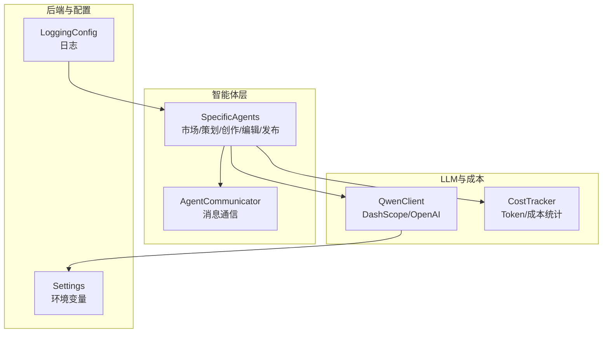
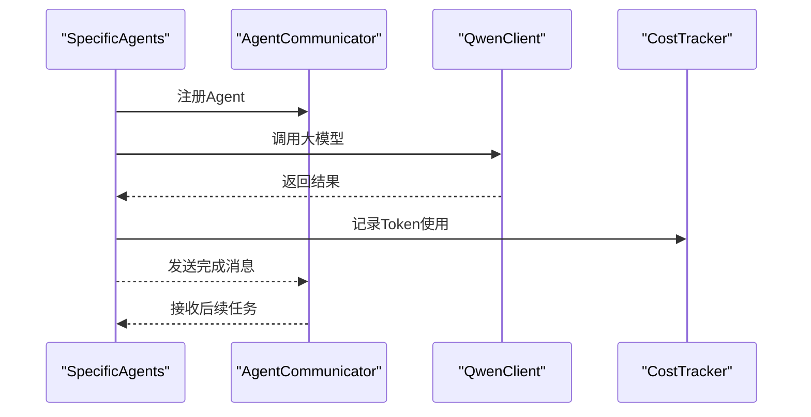
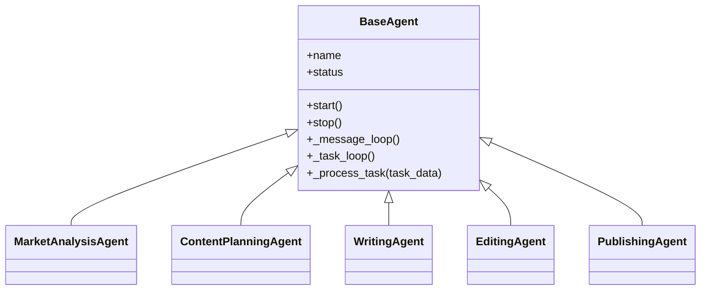
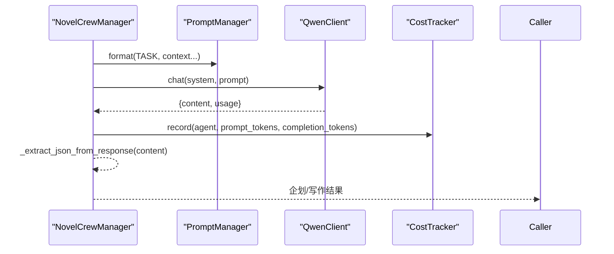
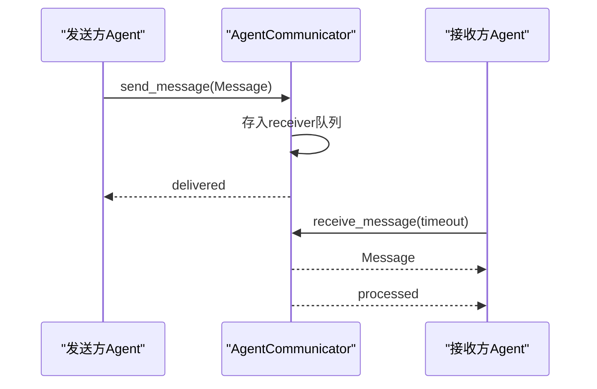
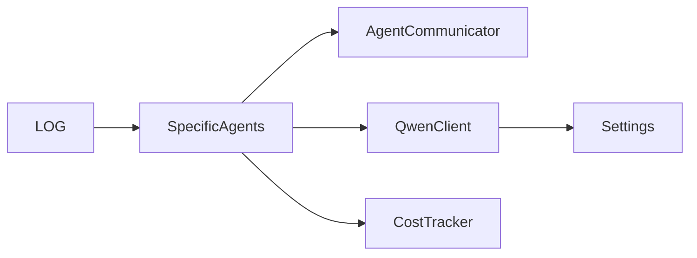

# AI智能体系统

<cite>
**本文档引用的文件**
- [agents/agent_manager.py](file://agents/agent_manager.py)
- [agents/crew_manager.py](file://agents/crew_manager.py)
- [agents/specific_agents.py](file://agents/specific_agents.py)
- [agents/agent_dispatcher.py](file://agents/agent_dispatcher.py)
- [agents/agent_scheduler.py](file://agents/agent_scheduler.py)
- [agents/agent_communicator.py](file://agents/agent_communicator.py)
- [llm/qwen_client.py](file://llm/qwen_client.py)
- [llm/cost_tracker.py](file://llm/cost_tracker.py)
- [backend/config.py](file://backend/config.py)
- [core/logging_config.py](file://core/logging_config.py)
- [scripts/start_agents.py](file://scripts/start_agents.py)
</cite>

## 更新摘要
**所做更改**
- 移除了多智能体协作系统的相关组件和架构说明
- 更新了系统架构图以反映简化的单Agent模式
- 删除了AgentManager、AgentDispatcher、AgentScheduler、CrewManager等核心组件的详细说明
- 简化了智能体类型和职责分工的描述
- 更新了任务编排和执行流程的说明

## 目录
1. [引言](#引言)
2. [项目结构](#项目结构)
3. [核心组件](#核心组件)
4. [架构总览](#架构总览)
5. [详细组件分析](#详细组件分析)
6. [依赖关系分析](#依赖关系分析)
7. [性能考量](#性能考量)
8. [故障排查指南](#故障排查指南)
9. [结论](#结论)
10. [附录](#附录)

## 引言
本文件面向"AI智能体系统"的全面技术文档，重点阐述该系统如何在小说生成场景中应用智能体协作与任务编排。系统采用简化的单智能体架构，专注于CrewAI风格的端到端小说生成流程。文档将深入解析：
- 智能体类型设计与职责分工
- 任务编排系统（类型、流程、状态跟踪）
- 智能体通信协议与消息传递机制
- 错误处理与可观测性
- 性能监控、负载均衡与扩展性设计

## 项目结构
系统采用简化的分层模块化组织：
- agents：智能体与通信相关的核心实现
- llm：大模型客户端与成本追踪
- backend：后端服务与配置
- core：通用日志与基础设施
- scripts：启动脚本与运维工具

**图表来源**
- [agents/agent_communicator.py](file://agents/agent_communicator.py#L72-L180)
- [agents/specific_agents.py](file://agents/specific_agents.py#L15-L505)
- [llm/qwen_client.py](file://llm/qwen_client.py#L16-L232)
- [llm/cost_tracker.py](file://llm/cost_tracker.py#L16-L74)
- [backend/config.py](file://backend/config.py#L5-L59)
- [core/logging_config.py](file://core/logging_config.py#L20-L55)

**章节来源**
- [agents/agent_communicator.py](file://agents/agent_communicator.py#L1-L180)
- [agents/specific_agents.py](file://agents/specific_agents.py#L1-L505)
- [llm/qwen_client.py](file://llm/qwen_client.py#L1-L232)
- [llm/cost_tracker.py](file://llm/cost_tracker.py#L1-L74)
- [backend/config.py](file://backend/config.py#L1-L59)
- [core/logging_config.py](file://core/logging_config.py#L1-L55)

## 核心组件
- AgentCommunicator：消息通信中枢，提供注册、发送、接收、广播与历史记录能力。
- SpecificAgents：五类智能体，分别承担市场分析、内容策划、创作、编辑、发布职责。
- QwenClient：DashScope/OpenAI兼容的大模型客户端，支持重试与流式输出。
- CostTracker：Token用量与成本统计，按模型定价计算累计成本。
- Settings与LoggingConfig：配置与日志基础设施。

**章节来源**
- [agents/agent_communicator.py](file://agents/agent_communicator.py#L72-L180)
- [agents/specific_agents.py](file://agents/specific_agents.py#L15-L505)
- [llm/qwen_client.py](file://llm/qwen_client.py#L16-L232)
- [llm/cost_tracker.py](file://llm/cost_tracker.py#L16-L74)
- [backend/config.py](file://backend/config.py#L5-L59)
- [core/logging_config.py](file://core/logging_config.py#L20-L55)

## 架构总览
系统采用简化的CrewAI风格架构，专注于端到端的小说生成流程：
- 通过AgentCommunicator实现智能体间的异步消息传递
- 通过SpecificAgents实现小说生成的各个阶段
- 通过QwenClient和CostTracker实现大模型调用与成本追踪
- 支持从市场分析到内容策划、从创作到编辑的完整工作流

**图表来源**
- [agents/specific_agents.py](file://agents/specific_agents.py#L37-L505)
- [agents/agent_communicator.py](file://agents/agent_communicator.py#L91-L135)
- [llm/qwen_client.py](file://llm/qwen_client.py#L46-L161)
- [llm/cost_tracker.py](file://llm/cost_tracker.py#L26-L56)

## 详细组件分析

### 智能体类型与职责分工
- 市场分析Agent：基于PromptManager与QwenClient分析市场趋势、热门题材与标签，产出洞察供内容策划参考。
- 内容策划Agent：整合市场分析与用户偏好，生成小说标题、类型、标签、简介与内容计划。
- 创作Agent：根据内容计划与世界设定、角色信息生成章节初稿。
- 编辑Agent：对初稿进行润色与优化，提升可读性与一致性。
- 发布Agent：模拟发布流程，记录平台书号与章节号等元数据。

**图表来源**
- [agents/specific_agents.py](file://agents/specific_agents.py#L15-L505)

**章节来源**
- [agents/specific_agents.py](file://agents/specific_agents.py#L15-L505)

### 任务编排与执行流程（CrewAI风格）
- 企划阶段：主题分析师→世界观架构师→角色设计师→情节架构师，按顺序串联，每步均调用QwenClient并记录成本。
- 写作阶段：章节策划师→作家→编辑→连续性审查员，支持传入前几章摘要与角色状态，确保连贯性与质量评分。
- NovelCrewManager提供JSON提取与错误处理，保障跨Agent数据交换的稳定性。

**图表来源**
- [agents/crew_manager.py](file://agents/crew_manager.py#L104-L480)
- [llm/qwen_client.py](file://llm/qwen_client.py#L46-L161)
- [llm/cost_tracker.py](file://llm/cost_tracker.py#L26-L56)

**章节来源**
- [agents/crew_manager.py](file://agents/crew_manager.py#L19-L480)

### Agent通信协议与消息传递机制
- 注册：Agent通过AgentCommunicator.register_agent注册到消息队列。
- 发送/接收：send_message与receive_message基于asyncio.Queue实现异步消息传递；支持超时与状态追踪。
- 广播：broadcast_message向所有已注册Agent广播消息。
- 历史：消息历史记录便于审计与调试。

**图表来源**
- [agents/agent_communicator.py](file://agents/agent_communicator.py#L91-L135)

**章节来源**
- [agents/agent_communicator.py](file://agents/agent_communicator.py#L72-L180)

### 错误处理策略
- LLM调用：QwenClient在OpenAI与DashScope模式下均实现指数退避重试；异常统一抛出，便于上层捕获。
- 任务处理：Agent基类在任务处理异常时设置状态为ERROR，并记录日志；调度器在任务完成消息缺失或UUID解析失败时进行保护性处理。
- Crew阶段：NovelCrewManager对JSON提取失败与异常进行捕获并记录，必要时回退至CrewAI风格执行路径。

**章节来源**
- [llm/qwen_client.py](file://llm/qwen_client.py#L65-L161)
- [agents/agent_scheduler.py](file://agents/agent_scheduler.py#L191-L220)
- [agents/crew_manager.py](file://agents/crew_manager.py#L37-L102)

## 依赖关系分析
- 组件耦合：
  - SpecificAgents依赖AgentCommunicator与QwenClient/CostTracker/PromptManager。
- 外部依赖：
  - DashScope/OpenAI SDK用于大模型推理。
  - Settings提供配置注入，LoggingConfig提供统一日志。
- 潜在风险：
  - 并发环境下消息队列与任务状态更新需保持原子性，已在关键路径加锁。

**图表来源**
- [agents/specific_agents.py](file://agents/specific_agents.py#L15-L505)
- [agents/agent_communicator.py](file://agents/agent_communicator.py#L72-L180)
- [llm/qwen_client.py](file://llm/qwen_client.py#L16-L232)
- [llm/cost_tracker.py](file://llm/cost_tracker.py#L16-L74)
- [backend/config.py](file://backend/config.py#L5-L59)
- [core/logging_config.py](file://core/logging_config.py#L20-L55)

**章节来源**
- [agents/specific_agents.py](file://agents/specific_agents.py#L1-L505)
- [agents/agent_communicator.py](file://agents/agent_communicator.py#L1-L180)
- [llm/qwen_client.py](file://llm/qwen_client.py#L1-L232)
- [llm/cost_tracker.py](file://llm/cost_tracker.py#L1-L74)
- [backend/config.py](file://backend/config.py#L1-L59)
- [core/logging_config.py](file://core/logging_config.py#L1-L55)

## 性能考量
- 并发与异步：基于asyncio的队列与任务循环，避免阻塞；QwenClient在DashScope模式下通过线程池执行同步调用，防止阻塞事件循环。
- 重试与退避：QwenClient支持指数退避重试，降低瞬时错误影响。
- 成本控制：CostTracker按模型定价实时统计，便于预算控制与成本优化。
- 可观测性：统一日志与消息历史，便于定位瓶颈与异常。
- 扩展性建议：
  - 引入限流与熔断（如令牌桶/滑动窗口），防止LLM调用峰值冲击。
  - 任务队列持久化与重试策略，增强可靠性。
  - 负载均衡：按Agent类型与资源占用动态分配任务，避免热点。

## 故障排查指南
- Agent未启动/状态异常
  - 检查AgentCommunicator.register_agent是否成功注册。
- LLM调用失败
  - 查看QwenClient的重试日志与最终异常信息。
  - 核对Settings中的API Key与Base URL配置。
- 成本统计异常
  - 确认CostTracker的record调用是否覆盖所有Agent调用路径。
  - 检查模型定价表与Token统计是否一致。

**章节来源**
- [agents/agent_communicator.py](file://agents/agent_communicator.py#L80-L135)
- [llm/qwen_client.py](file://llm/qwen_client.py#L65-L161)
- [llm/cost_tracker.py](file://llm/cost_tracker.py#L26-L56)
- [backend/config.py](file://backend/config.py#L5-L59)

## 结论
该系统采用简化的CrewAI风格架构，专注于端到端的小说生成流程。通过智能体间的异步消息通信、完善的任务处理机制与成本追踪，系统具备良好的可维护性与扩展性。未来可在限流熔断、任务持久化与负载均衡方面进一步增强，以应对更高并发与更复杂业务场景。

## 附录
- 启动方式：可通过scripts/start_agents.py启动Agent系统，自动注册并运行五类Agent，支持信号处理与成本统计。
- 配置项：Settings提供DashScope API Key、模型、数据库、Redis、Celery等配置；LoggingConfig统一日志级别与输出。

**章节来源**
- [scripts/start_agents.py](file://scripts/start_agents.py#L37-L204)
- [backend/config.py](file://backend/config.py#L5-L59)
- [core/logging_config.py](file://core/logging_config.py#L20-L55)