# AI智能体系统

<cite>
**本文档引用的文件**
- [agents/agent_manager.py](file://agents/agent_manager.py)
- [agents/crew_manager.py](file://agents/crew_manager.py)
- [agents/specific_agents.py](file://agents/specific_agents.py)
- [agents/agent_dispatcher.py](file://agents/agent_dispatcher.py)
- [agents/agent_scheduler.py](file://agents/agent_scheduler.py)
- [agents/agent_communicator.py](file://agents/agent_communicator.py)
- [agents/base/review_loop_base.py](file://agents/base/review_loop_base.py)
- [agents/base/quality_report.py](file://agents/base/quality_report.py)
- [agents/base/json_extractor.py](file://agents/base/json_extractor.py)
- [agents/base/review_result.py](file://agents/base/review_result.py)
- [agents/world_review_loop.py](file://agents/world_review_loop.py)
- [agents/review_loop.py](file://agents/review_loop.py)
- [agents/character_review_loop.py](file://agents/character_review_loop.py)
- [agents/plot_review_loop.py](file://agents/plot_review_loop.py)
- [agents/quality_evaluator.py](file://agents/quality_evaluator.py)
- [agents/iteration_controller.py](file://agents/iteration_controller.py)
- [agents/team_context.py](file://agents/team_context.py)
- [agents/enhanced_context_manager.py](file://agents/enhanced_context_manager.py)
- [agents/chapter_outline_mapper.py](file://agents/chapter_outline_mapper.py)
- [agents/outline_refiner.py](file://agents/outline_refiner.py)
- [agents/outline_validator.py](file://agents/outline_validator.py)
- [backend/services/cache_service.py](file://backend/services/cache_service.py)
- [backend/config.py](file://backend/config.py)
- [core/logging_config.py](file://core/logging_config.py)
- [scripts/start_agents.py](file://scripts/start_agents.py)
- [alembic/versions/add_outline_enhancements_to_chapters.py](file://alembic/versions/add_outline_enhancements_to_chapters.py)
- [alembic/versions/002_add_novel_creation_flow_table.py](file://alembic/versions/002_add_novel_creation_flow_table.py)
</cite>

## 更新摘要
**所做更改**
- 新增智能收敛检测机制章节，详细介绍基于章节类型的动态迭代策略
- 新增团队上下文管理系统章节，涵盖增强型上下文管理器和四层记忆架构
- 新增大纲管理组件章节，包含ChapterOutlineMapper、OutlineRefiner、OutlineValidator的完整实现
- 新增Redis缓存服务章节，介绍通用缓存功能和性能优化策略
- 更新任务编排系统，增加大纲细化和验证流程
- 增强审查循环系统，支持章节类型自动识别和动态策略调整
- 新增数据库迁移说明，包含大纲增强字段的添加

## 目录
1. [引言](#引言)
2. [项目结构](#项目结构)
3. [核心组件](#核心组件)
4. [架构总览](#架构总览)
5. [基础框架模块](#基础框架模块)
6. [智能收敛检测机制](#智能收敛检测机制)
7. [团队上下文管理系统](#团队上下文管理系统)
8. [大纲管理组件](#大纲管理组件)
9. [Redis缓存服务](#redis缓存服务)
10. [详细组件分析](#详细组件分析)
11. [依赖关系分析](#依赖关系分析)
12. [性能考量](#性能考量)
13. [故障排查指南](#故障排查指南)
14. [结论](#结论)
15. [附录](#附录)

## 引言
本文件面向"AI智能体系统"的全面技术文档，重点阐述该系统如何在小说生成场景中应用智能体协作与任务编排。系统采用简化的单智能体架构，专注于CrewAI风格的端到端小说生成流程。文档将深入解析：
- 智能体类型设计与职责分工
- 基础框架模块的标准化实现
- 智能收敛检测与动态迭代策略
- 团队上下文管理与四层记忆架构
- 大纲管理组件的完整实现
- Redis缓存服务的性能优化
- 审查循环系统的模板方法模式
- 任务编排系统（类型、流程、状态跟踪）
- 智能体通信协议与消息传递机制
- 错误处理与可观测性
- 性能监控、负载均衡与扩展性设计

## 项目结构
系统采用简化的分层模块化组织，新增agents/base基础框架模块和多个增强组件：
- agents：智能体与通信相关的核心实现
- agents/base：审查循环基础框架模块
- agents/crew_manager.py：统一的审查循环管理器
- agents/iteration_controller.py：基于章节类型的智能收敛检测
- agents/team_context.py：团队上下文与状态管理
- agents/enhanced_context_manager.py：增强型四层记忆架构
- agents/chapter_outline_mapper.py：章节大纲映射器
- agents/outline_refiner.py：大纲细化与完善
- agents/outline_validator.py：大纲一致性验证
- backend/services/cache_service.py：Redis缓存服务
- llm：大模型客户端与成本追踪
- backend：后端服务与配置
- core：通用日志与基础设施
- scripts：启动脚本与运维工具
- alembic：数据库迁移脚本

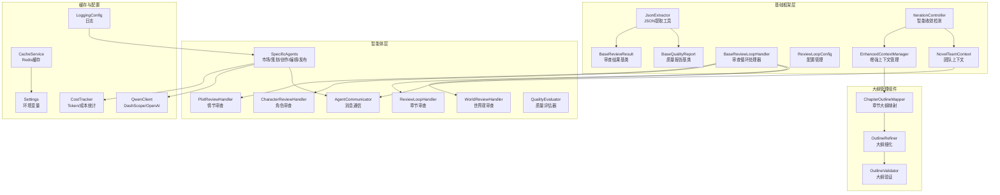

**图表来源**
- [agents/base/review_loop_base.py:64-726](file://agents/base/review_loop_base.py#L64-L726)
- [agents/base/quality_report.py:44-318](file://agents/base/quality_report.py#L44-L318)
- [agents/base/json_extractor.py:16-235](file://agents/base/json_extractor.py#L16-L235)
- [agents/base/review_result.py:23-232](file://agents/base/review_result.py#L23-L232)
- [agents/world_review_loop.py:171-371](file://agents/world_review_loop.py#L171-L371)
- [agents/review_loop.py:76-510](file://agents/review_loop.py#L76-L510)
- [agents/character_review_loop.py](file://agents/character_review_loop.py)
- [agents/plot_review_loop.py](file://agents/plot_review_loop.py)
- [agents/quality_evaluator.py:1-173](file://agents/quality_evaluator.py#L1-L173)
- [agents/iteration_controller.py:41-308](file://agents/iteration_controller.py#L41-L308)
- [agents/team_context.py:162-591](file://agents/team_context.py#L162-L591)
- [agents/enhanced_context_manager.py:196-536](file://agents/enhanced_context_manager.py#L196-L536)
- [agents/chapter_outline_mapper.py:187-1109](file://agents/chapter_outline_mapper.py#L187-L1109)
- [agents/outline_refiner.py:18-705](file://agents/outline_refiner.py#L18-705)
- [agents/outline_validator.py:19-832](file://agents/outline_validator.py#L19-832)
- [backend/services/cache_service.py:14-280](file://backend/services/cache_service.py#L14-280)
- [llm/qwen_client.py:1-232](file://llm/qwen_client.py#L1-L232)
- [llm/cost_tracker.py:1-74](file://llm/cost_tracker.py#L1-L74)
- [backend/config.py:1-132](file://backend/config.py#L1-L132)
- [core/logging_config.py:1-55](file://core/logging_config.py#L1-L55)

**章节来源**
- [agents/agent_communicator.py:1-180](file://agents/agent_communicator.py#L1-L180)
- [agents/specific_agents.py:1-505](file://agents/specific_agents.py#L1-L505)
- [agents/base/review_loop_base.py:1-726](file://agents/base/review_loop_base.py#L1-L726)
- [agents/base/quality_report.py:1-318](file://agents/base/quality_report.py#L1-L318)
- [agents/base/json_extractor.py:1-235](file://agents/base/json_extractor.py#L1-L235)
- [agents/base/review_result.py:1-232](file://agents/base/review_result.py#L1-L232)
- [llm/qwen_client.py:1-232](file://llm/qwen_client.py#L1-L232)
- [llm/cost_tracker.py:1-74](file://llm/cost_tracker.py#L1-L74)
- [backend/config.py:1-132](file://backend/config.py#L1-L132)
- [core/logging_config.py:1-55](file://core/logging_config.py#L1-L55)

## 核心组件
- AgentCommunicator：消息通信中枢，提供注册、发送、接收、广播与历史记录能力。
- SpecificAgents：五类智能体，分别承担市场分析、内容策划、创作、编辑、发布职责。
- BaseReviewLoopHandler：审查循环处理器基类，采用模板方法模式封装Designer-Reviewer循环。
- BaseQualityReport：质量评估报告基类，提供统一的质量评估数据结构。
- BaseReviewResult：审查结果基类，提供统一的结果数据结构和统计分析功能。
- JsonExtractor：JSON提取工具，支持多种格式的JSON解析策略。
- QwenClient：DashScope/OpenAI兼容的大模型客户端，支持重试与流式输出。
- CostTracker：Token用量与成本统计，按模型定价计算累计成本。
- **新增**：IterationController：基于章节类型的智能收敛检测，支持动态迭代策略。
- **新增**：NovelTeamContext：团队上下文管理，实现四层记忆架构和状态共享。
- **新增**：EnhancedContextManager：增强型上下文管理器，提供智能信息提取和动态调整。
- **新增**：ChapterOutlineMapper：章节大纲映射器，将卷级大纲分解为章节级任务。
- **新增**：OutlineRefiner：大纲细化Agent，生成详细主线剧情和卷大纲。
- **新增**：OutlineValidator：大纲验证Agent，检查章节与大纲一致性。
- **新增**：CacheService：Redis缓存服务，提供通用缓存功能和性能优化。
- Settings与LoggingConfig：配置与日志基础设施。

**章节来源**
- [agents/agent_communicator.py:72-180](file://agents/agent_communicator.py#L72-L180)
- [agents/specific_agents.py:15-505](file://agents/specific_agents.py#L15-L505)
- [agents/base/review_loop_base.py:64-726](file://agents/base/review_loop_base.py#L64-L726)
- [agents/base/quality_report.py:44-318](file://agents/base/quality_report.py#L44-L318)
- [agents/base/json_extractor.py:16-235](file://agents/base/json_extractor.py#L16-L235)
- [agents/base/review_result.py:23-232](file://agents/base/review_result.py#L23-L232)
- [agents/iteration_controller.py:41-308](file://agents/iteration_controller.py#L41-L308)
- [agents/team_context.py:162-591](file://agents/team_context.py#L162-L591)
- [agents/enhanced_context_manager.py:196-536](file://agents/enhanced_context_manager.py#L196-L536)
- [agents/chapter_outline_mapper.py:187-1109](file://agents/chapter_outline_mapper.py#L187-L1109)
- [agents/outline_refiner.py:18-705](file://agents/outline_refiner.py#L18-705)
- [agents/outline_validator.py:19-832](file://agents/outline_validator.py#L19-832)
- [backend/services/cache_service.py:14-280](file://backend/services/cache_service.py#L14-280)
- [llm/qwen_client.py:16-232](file://llm/qwen_client.py#L16-L232)
- [llm/cost_tracker.py:16-74](file://llm/cost_tracker.py#L16-L74)
- [backend/config.py:5-132](file://backend/config.py#L5-L132)
- [core/logging_config.py:20-55](file://core/logging_config.py#L20-L55)

## 架构总览
系统采用简化的CrewAI风格架构，专注于端到端的小说生成流程，新增智能收敛检测、团队上下文管理和大纲管理组件：
- 通过AgentCommunicator实现智能体间的异步消息传递
- 通过SpecificAgents实现小说生成的各个阶段
- 通过BaseReviewLoopHandler实现标准化的审查循环
- 通过IterationController实现基于章节类型的智能收敛检测
- 通过NovelTeamContext和EnhancedContextManager实现四层记忆架构
- 通过ChapterOutlineMapper、OutlineRefiner、OutlineValidator实现完整的大纲管理
- 通过CacheService提供Redis缓存服务，优化系统性能
- 通过QwenClient和CostTracker实现大模型调用与成本追踪
- 支持从市场分析到内容策划、从创作到编辑的完整工作流

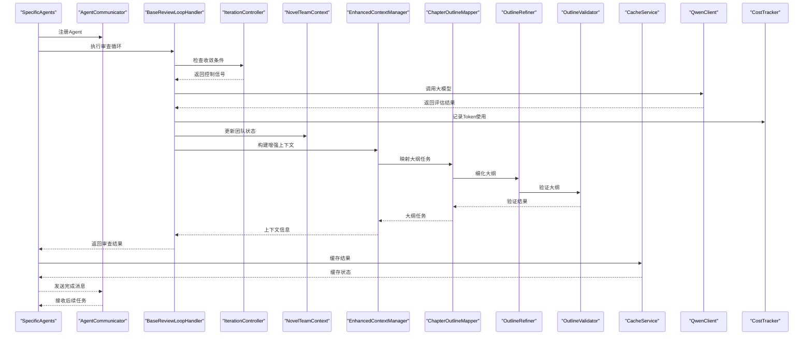

**图表来源**
- [agents/specific_agents.py:37-505](file://agents/specific_agents.py#L37-L505)
- [agents/agent_communicator.py:91-135](file://agents/agent_communicator.py#L91-L135)
- [agents/base/review_loop_base.py:120-262](file://agents/base/review_loop_base.py#L120-L262)
- [agents/iteration_controller.py:70-115](file://agents/iteration_controller.py#L70-L115)
- [agents/team_context.py:443-474](file://agents/team_context.py#L443-L474)
- [agents/enhanced_context_manager.py:211-279](file://agents/enhanced_context_manager.py#L211-L279)
- [agents/chapter_outline_mapper.py:463-566](file://agents/chapter_outline_mapper.py#L463-L566)
- [agents/outline_refiner.py:31-84](file://agents/outline_refiner.py#L31-L84)
- [agents/outline_validator.py:32-77](file://agents/outline_validator.py#L32-L77)
- [backend/services/cache_service.py:98-136](file://backend/services/cache_service.py#L98-136)
- [llm/qwen_client.py:46-161](file://llm/qwen_client.py#L46-L161)
- [llm/cost_tracker.py:26-56](file://llm/cost_tracker.py#L26-L56)

## 基础框架模块

### 审查循环处理器基类
BaseReviewLoopHandler采用模板方法模式，封装Designer-Reviewer审查循环的核心迭代逻辑：
- 模板方法execute定义完整的审查流程
- 抽象方法定义特定领域的实现接口
- 配置管理ReviewLoopConfig提供灵活的参数控制
- 支持最佳记录追踪和停滞检测机制
- 集成智能收敛检测与迭代控制

```mermaid
classDiagram
class BaseReviewLoopHandler {
+execute(initial_content, **context) TResult
+_call_reviewer() Dict
+_call_builder() TContent
+_create_quality_report() TReport
+_validate_revision() bool
+_finalize_result() void
+to_json(obj, indent, max_length) str
}
class ReviewLoopConfig {
+quality_threshold : float
+max_iterations : int
+reviewer_temperature : float
+builder_temperature : float
+reviewer_max_tokens : int
+builder_max_tokens : int
+enable_issue_tracking : bool
+enable_progress_summary : bool
+max_context_chars : int
+issue_match_threshold : float
}
class IterationController {
+should_continue(score, iteration, cost_delta) bool
+log_iteration(score, action, agent, passed, cost_delta, details) IterationRecord
+get_summary() Dict
+reset() void
+identify_chapter_type(chapter_content, chapter_title, context) ChapterType
}
class NovelTeamContext {
+add_review(review) void
+add_iteration_log(log_entry) void
+build_enhanced_context(chapter_number) str
+to_dict() Dict
}
class WorldReviewHandler {
+_get_loop_name() str
+_create_result() WorldReviewResult
+_create_quality_report() WorldQualityReport
+_build_reviewer_task_prompt() str
+_build_revision_prompt() str
+_validate_revision() bool
+_finalize_result() void
}
class ReviewLoopHandler {
+_get_loop_name() str
+_create_result() ReviewLoopResult
+_create_quality_report() ChapterQualityReport
+_build_reviewer_task_prompt() str
+_build_revision_prompt() str
+_validate_revision() bool
+_finalize_result() void
}
class CharacterReviewHandler {
+_get_loop_name() str
+_create_result() CharacterReviewResult
+_create_quality_report() CharacterQualityReport
+_build_reviewer_task_prompt() str
+_build_revision_prompt() str
+_validate_revision() bool
+_finalize_result() void
}
class PlotReviewHandler {
+_get_loop_name() str
+_create_result() PlotReviewResult
+_create_quality_report() PlotQualityReport
+_build_reviewer_task_prompt() str
+_build_revision_prompt() str
+_validate_revision() bool
+_finalize_result() void
}
BaseReviewLoopHandler <|-- WorldReviewHandler
BaseReviewLoopHandler <|-- ReviewLoopHandler
BaseReviewLoopHandler <|-- CharacterReviewHandler
BaseReviewLoopHandler <|-- PlotReviewHandler
BaseReviewLoopHandler --> ReviewLoopConfig
BaseReviewLoopHandler --> IterationController
BaseReviewLoopHandler --> NovelTeamContext
```

**图表来源**
- [agents/base/review_loop_base.py:64-726](file://agents/base/review_loop_base.py#L64-L726)
- [agents/world_review_loop.py:171-371](file://agents/world_review_loop.py#L171-L371)
- [agents/review_loop.py:76-510](file://agents/review_loop.py#L76-L510)
- [agents/character_review_loop.py](file://agents/character_review_loop.py)
- [agents/plot_review_loop.py](file://agents/plot_review_loop.py)
- [agents/iteration_controller.py:41-308](file://agents/iteration_controller.py#L41-L308)
- [agents/team_context.py:162-591](file://agents/team_context.py#L162-L591)

**章节来源**
- [agents/base/review_loop_base.py:64-726](file://agents/base/review_loop_base.py#L64-L726)
- [agents/base/review_loop_base.py:38-62](file://agents/base/review_loop_base.py#L38-L62)

### 质量报告基类体系
BaseQualityReport提供统一的质量评估数据结构，支持多维度评分和问题追踪：
- 统一的评估字段：overall_score、dimension_scores、issues、summary
- 安全的分数提取机制，支持降级处理
- 支持不同领域的质量报告扩展
- 提供问题合并和统计分析功能

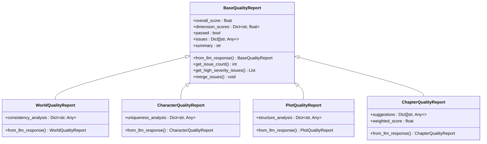

**图表来源**
- [agents/base/quality_report.py:44-318](file://agents/base/quality_report.py#L44-L318)

**章节来源**
- [agents/base/quality_report.py:44-318](file://agents/base/quality_report.py#L44-L318)

### 审查结果数据结构体系
BaseReviewResult提供统一的结果数据结构，支持不同类型的输出：
- 统一的属性：final_output、final_score、total_iterations、converged、iterations、quality_report
- 统计分析功能：评分趋势、改进幅度、收敛判断
- 向后兼容别名：章节内容、世界观设定、角色列表、情节大纲
- 不同领域结果的特定功能

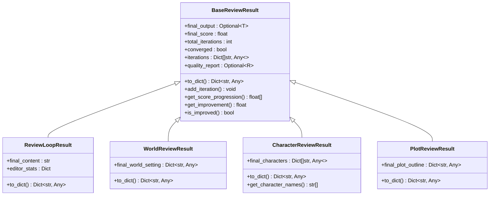

**图表来源**
- [agents/base/review_result.py:23-232](file://agents/base/review_result.py#L23-L232)

**章节来源**
- [agents/base/review_result.py:23-232](file://agents/base/review_result.py#L23-L232)

### JSON提取工具
JsonExtractor提供多种策略从LLM响应中提取JSON：
- 直接解析、代码块提取、边界查找等多种策略
- 自动修复常见的JSON格式问题
- 支持对象、数组、单值的提取
- 提供安全提取和默认值处理

**章节来源**
- [agents/base/json_extractor.py:16-235](file://agents/base/json_extractor.py#L16-L235)

## 智能收敛检测机制

### 基于章节类型的动态迭代策略
系统实现了基于章节类型的智能收敛检测机制，通过IterationController管理不同类型的审查循环：
- **章节类型枚举**：climax（高潮）、transition（过渡）、setup（铺垫）、character（人物）、world_building（世界观）、normal（普通）
- **动态策略配置**：每种章节类型都有对应的迭代次数、质量阈值和成本权重
- **成本敏感度**：通过cost_weight参数控制质量与成本的平衡
- **自动类型识别**：支持基于内容的章节类型自动识别

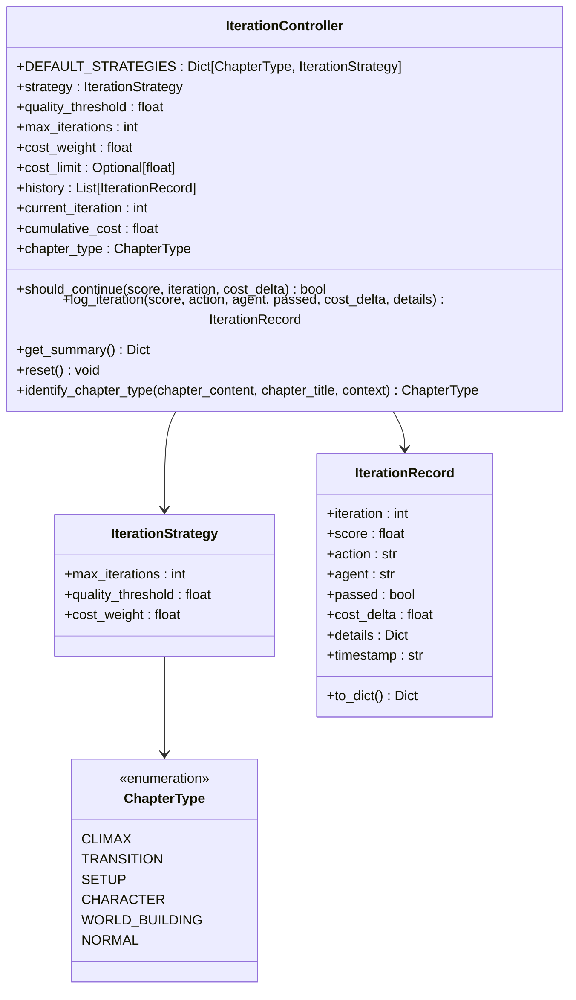

**图表来源**
- [agents/iteration_controller.py:15-308](file://agents/iteration_controller.py#L15-L308)

**章节来源**
- [agents/iteration_controller.py:41-308](file://agents/iteration_controller.py#L41-L308)

### 章节类型默认策略配置
系统为不同章节类型预设了优化的迭代策略：

| 章节类型 | 最大迭代次数 | 质量阈值 | 成本权重 | 适用场景 |
|---------|-------------|---------|---------|----------|
| climax | 5 | 8.5 | 0.3 | 高质量优先，成本敏感度低 |
| transition | 2 | 7.0 | 0.8 | 高效率优先，成本敏感度高 |
| character | 4 | 8.0 | 0.4 | 人物塑造型，平衡质量与成本 |
| setup | 4 | 8.0 | 0.5 | 世界观构建，平衡质量与成本 |
| world_building | 3 | 7.5 | 0.6 | 世界观构建，成本敏感度中等 |
| normal | 3 | 7.5 | 0.5 | 普通章节，标准配置 |

**章节来源**
- [agents/iteration_controller.py:79-111](file://agents/iteration_controller.py#L79-L111)

### 章节类型自动识别算法
系统实现了轻量级的章节类型识别机制：
- **内容预览**：仅使用前500字符进行类型识别，降低成本
- **低温度调用**：temperature=0.1确保识别稳定性
- **类型映射**：将识别结果映射到ChapterType枚举
- **降级处理**：识别失败时自动降级到NORMAL类型

**章节来源**
- [agents/iteration_controller.py:237-308](file://agents/iteration_controller.py#L237-L308)

## 团队上下文管理系统

### 四层记忆架构设计
EnhancedContextManager实现了创新的四层记忆架构，确保关键信息在不同阶段的有效保留：
- **核心层（CoreLayer）**：始终携带的主题、核心冲突、主角目标
- **关键层（CriticalLayer）**：动态保留的伏笔、未解决冲突、重大决策
- **近期层（RecentLayer）**：最近3章的详细摘要和结尾原文
- **历史层（HistoricalLayer）**：更早章节的卷级摘要和关键事件索引

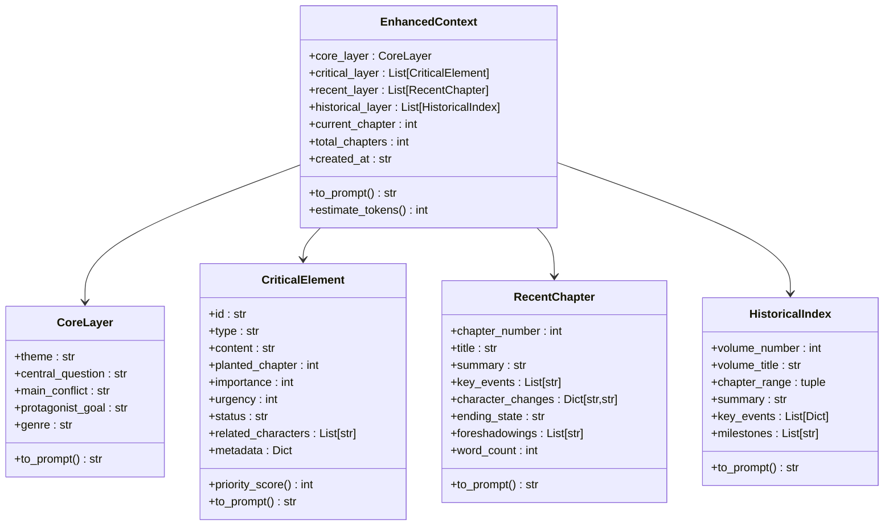

**图表来源**
- [agents/enhanced_context_manager.py:20-536](file://agents/enhanced_context_manager.py#L20-L536)

**章节来源**
- [agents/enhanced_context_manager.py:196-536](file://agents/enhanced_context_manager.py#L196-L536)

### 增强上下文构建流程
系统通过智能算法动态构建增强上下文，确保信息的有效提取和组织：

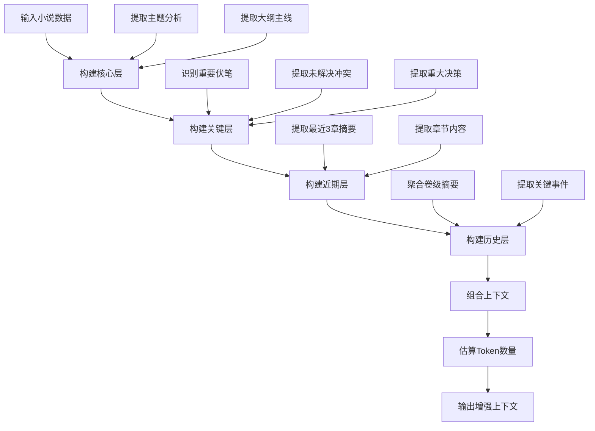

**图表来源**
- [agents/enhanced_context_manager.py:211-279](file://agents/enhanced_context_manager.py#L211-L279)

**章节来源**
- [agents/enhanced_context_manager.py:211-279](file://agents/enhanced_context_manager.py#L211-L279)

### 线程安全与异步支持
系统实现了线程安全的上下文管理：
- 使用asyncio.Lock保护所有写操作
- 提供同步和异步两种操作模式
- 读操作返回数据快照，避免并发修改问题
- 支持高并发场景下的数据一致性

**章节来源**
- [agents/team_context.py:232-254](file://agents/team_context.py#L232-L254)

## 大纲管理组件

### 章节大纲映射器
ChapterOutlineMapper实现了从卷级大纲到章节级任务的智能映射：
- **张力循环解析**：自动解析和创建张力循环，支持压制期和释放期
- **事件分配**：将关键事件智能分配到具体章节
- **伏笔管理**：智能分配和追踪伏笔的埋设与回收
- **角色发展**：根据角色状态生成个性化发展任务
- **黄金三章识别**：自动识别并标记重要的开篇章节

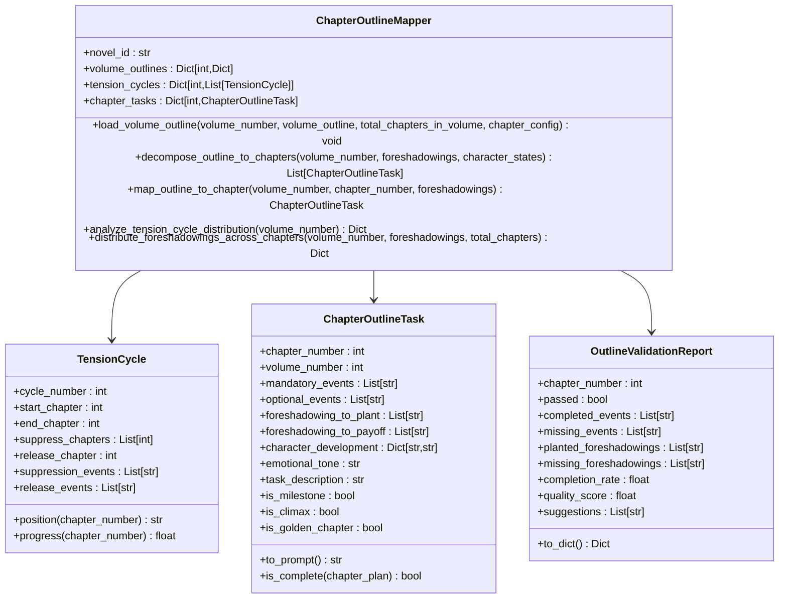

**图表来源**
- [agents/chapter_outline_mapper.py:19-1109](file://agents/chapter_outline_mapper.py#L19-L1109)

**章节来源**
- [agents/chapter_outline_mapper.py:187-1109](file://agents/chapter_outline_mapper.py#L187-L1109)

### 大纲细化Agent
OutlineRefiner提供了专业的大纲细化和完善功能：
- **完整大纲生成**：基于世界观设定生成包含主线、支线、卷大纲的完整结构
- **详细主线剧情**：生成包含起承转合的详细主线发展
- **卷大纲设计**：生成带张力循环的卷级大纲，符合"欲扬先抑"原则
- **结局连贯性检查**：确保主线剧情和卷大纲的逻辑一致性

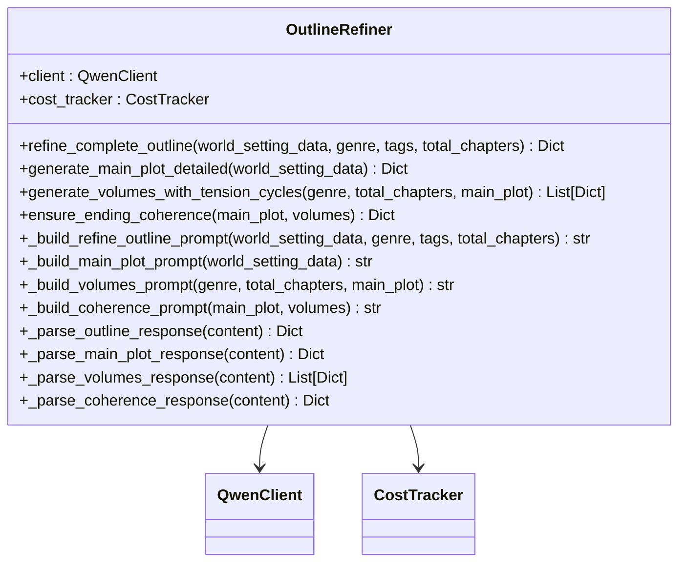

**图表来源**
- [agents/outline_refiner.py:18-705](file://agents/outline_refiner.py#L18-L705)

**章节来源**
- [agents/outline_refiner.py:18-705](file://agents/outline_refiner.py#L18-L705)

### 大纲验证Agent
OutlineValidator实现了全面的大纲一致性检查：
- **章节一致性验证**：检查章节计划与大纲任务的匹配度
- **角色一致性检查**：验证章节中的角色行为、性格、能力一致性
- **剧情连贯性检查**：确保章节与之前章节的逻辑连贯性
- **世界观一致性检查**：验证内容符合设定的世界观体系
- **改进建议生成**：基于验证发现问题提供具体改进建议

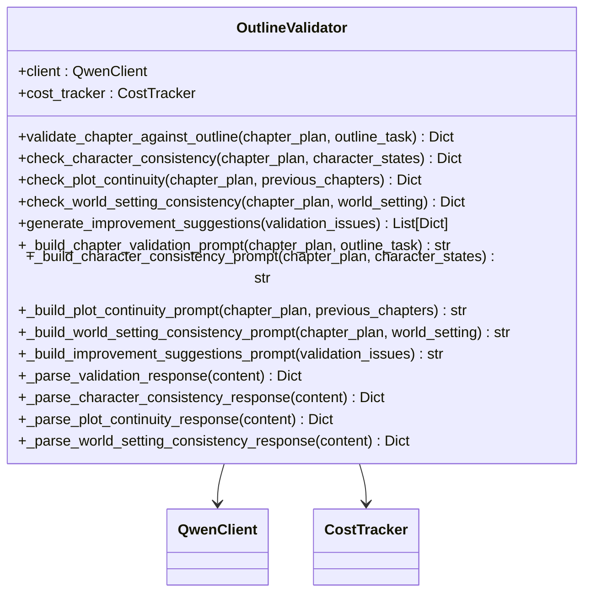

**图表来源**
- [agents/outline_validator.py:19-832](file://agents/outline_validator.py#L19-L832)

**章节来源**
- [agents/outline_validator.py:19-832](file://agents/outline_validator.py#L19-L832)

## Redis缓存服务

### 缓存架构设计
CacheService提供了完整的Redis缓存解决方案，支持多种缓存场景：
- **通用键值操作**：基础的get、set、delete、exists操作
- **生成结果缓存**：缓存AI生成的文本结果，支持TTL控制
- **Agent输出缓存**：缓存各智能体的输出结果，支持版本管理
- **章节内容缓存**：缓存已生成的章节内容，提高访问速度
- **仪表盘数据缓存**：缓存用户界面统计数据，减少数据库压力

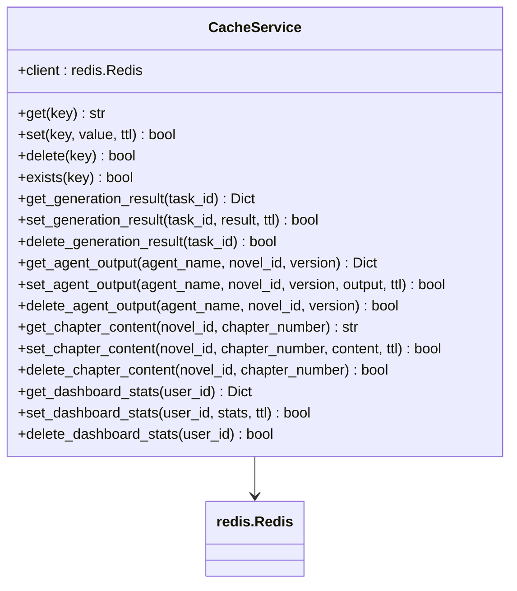

**图表来源**
- [backend/services/cache_service.py:14-280](file://backend/services/cache_service.py#L14-L280)

**章节来源**
- [backend/services/cache_service.py:14-280](file://backend/services/cache_service.py#L14-L280)

### 缓存策略与性能优化
系统采用了多层次的缓存策略来优化性能：
- **TTL配置**：根据不同数据的重要性设置合适的过期时间
- **分布式支持**：自动检测Docker环境，使用正确的Redis地址
- **异常处理**：缓存操作失败不影响主流程，确保系统稳定性
- **内存优化**：通过合理的TTL和键命名规范控制内存使用

**章节来源**
- [backend/services/cache_service.py:25-44](file://backend/services/cache_service.py#L25-L44)
- [backend/config.py:42-62](file://backend/config.py#L42-L62)

## 详细组件分析

### 智能体类型与职责分工
- 市场分析Agent：基于PromptManager与QwenClient分析市场趋势、热门题材与标签，产出洞察供内容策划参考。
- 内容策划Agent：整合市场分析与用户偏好，生成小说标题、类型、标签、简介与内容计划。
- 创作Agent：根据内容计划与世界设定、角色信息生成章节初稿。
- 编辑Agent：对初稿进行润色与优化，提升可读性与一致性。
- 发布Agent：模拟发布流程，记录平台书号与章节号等元数据。
- **新增审查循环智能体**：专门负责质量控制和迭代优化，包括世界观审查、章节审查、角色审查、情节审查。
- **新增大纲管理智能体**：负责大纲的细化、验证和一致性检查，确保故事结构的完整性。

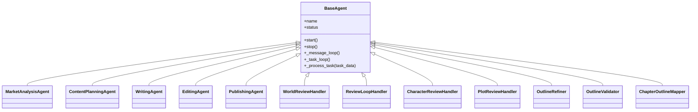

**图表来源**
- [agents/specific_agents.py:15-505](file://agents/specific_agents.py#L15-L505)
- [agents/world_review_loop.py:171-371](file://agents/world_review_loop.py#L171-L371)
- [agents/review_loop.py:76-510](file://agents/review_loop.py#L76-L510)
- [agents/character_review_loop.py](file://agents/character_review_loop.py)
- [agents/plot_review_loop.py](file://agents/plot_review_loop.py)
- [agents/outline_refiner.py:18-705](file://agents/outline_refiner.py#L18-L705)
- [agents/outline_validator.py:19-832](file://agents/outline_validator.py#L19-L832)
- [agents/chapter_outline_mapper.py:187-1109](file://agents/chapter_outline_mapper.py#L187-L1109)

**章节来源**
- [agents/specific_agents.py:15-505](file://agents/specific_agents.py#L15-L505)

### 任务编排与执行流程（CrewAI风格）
- 企划阶段：主题分析师→世界观架构师→角色设计师→情节架构师，按顺序串联，每步均调用QwenClient并记录成本。
- 写作阶段：章节策划师→大纲细化师→作家→编辑→连续性审查员，支持传入前几章摘要与角色状态，确保连贯性与质量评分。
- **新增审查阶段**：通过审查循环处理器实现自动化质量控制，支持多轮迭代优化。
- **新增智能收敛检测**：通过IterationController实现智能停止条件，防止无效迭代。
- **新增团队上下文管理**：通过NovelTeamContext和EnhancedContextManager实现智能体间的状态共享与追踪。
- **新增大纲管理流程**：ChapterOutlineMapper→OutlineRefiner→OutlineValidator形成完整的大纲管理体系。
- **新增缓存优化**：通过CacheService缓存中间结果，提高系统整体性能。
- NovelCrewManager提供JSON提取与错误处理，保障跨Agent数据交换的稳定性。

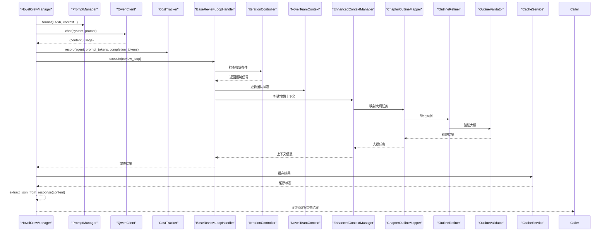

**图表来源**
- [agents/crew_manager.py:104-480](file://agents/crew_manager.py#L104-L480)
- [agents/base/review_loop_base.py:120-262](file://agents/base/review_loop_base.py#L120-L262)
- [agents/iteration_controller.py:70-115](file://agents/iteration_controller.py#L70-L115)
- [agents/team_context.py:443-474](file://agents/team_context.py#L443-L474)
- [agents/enhanced_context_manager.py:211-279](file://agents/enhanced_context_manager.py#L211-L279)
- [agents/chapter_outline_mapper.py:463-566](file://agents/chapter_outline_mapper.py#L463-L566)
- [agents/outline_refiner.py:31-84](file://agents/outline_refiner.py#L31-L84)
- [agents/outline_validator.py:32-77](file://agents/outline_validator.py#L32-L77)
- [backend/services/cache_service.py:98-136](file://backend/services/cache_service.py#L98-136)
- [llm/qwen_client.py:46-161](file://llm/qwen_client.py#L46-L161)
- [llm/cost_tracker.py:26-56](file://llm/cost_tracker.py#L26-L56)

**章节来源**
- [agents/crew_manager.py:19-480](file://agents/crew_manager.py#L19-L480)

### Agent通信协议与消息传递机制
- 注册：Agent通过AgentCommunicator.register_agent注册到消息队列。
- 发送/接收：send_message与receive_message基于asyncio.Queue实现异步消息传递；支持超时与状态追踪。
- 广播：broadcast_message向所有已注册Agent广播消息。
- 历史：消息历史记录便于审计与调试。
- **新增审查循环通信**：通过审查循环处理器实现智能体间的标准化质量评估通信。
- **新增团队上下文通信**：通过NovelTeamContext和EnhancedContextManager实现智能体间的状态共享与上下文传递。
- **新增大纲管理通信**：通过ChapterOutlineMapper、OutlineRefiner、OutlineValidator形成完整的通信链路。

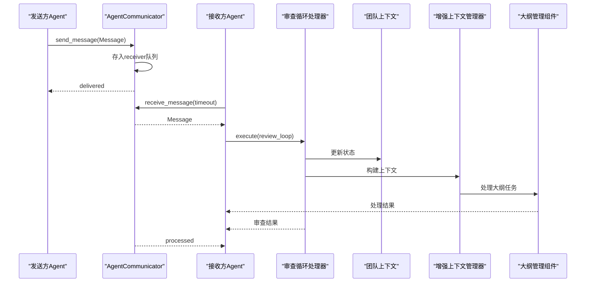

**图表来源**
- [agents/agent_communicator.py:91-135](file://agents/agent_communicator.py#L91-L135)
- [agents/base/review_loop_base.py:120-262](file://agents/base/review_loop_base.py#L120-L262)
- [agents/team_context.py:443-474](file://agents/team_context.py#L443-L474)
- [agents/enhanced_context_manager.py:211-279](file://agents/enhanced_context_manager.py#L211-L279)
- [agents/chapter_outline_mapper.py:463-566](file://agents/chapter_outline_mapper.py#L463-L566)

**章节来源**
- [agents/agent_communicator.py:72-180](file://agents/agent_communicator.py#L72-L180)

### 错误处理策略
- LLM调用：QwenClient在OpenAI与DashScope模式下均实现指数退避重试；异常统一抛出，便于上层捕获。
- 任务处理：Agent基类在任务处理异常时设置状态为ERROR，并记录日志；调度器在任务完成消息缺失或UUID解析失败时进行保护性处理。
- **新增审查循环错误处理**：审查循环处理器提供默认值回退机制，确保系统稳定性。
- **新增智能收敛检测错误处理**：迭代控制器在成本超限时提供保护性停止机制。
- **新增团队上下文错误处理**：上下文管理器提供线程安全的数据访问，防止并发修改问题。
- **新增大纲管理错误处理**：大纲组件提供结构化错误处理和回退机制。
- **新增缓存服务错误处理**：CacheService在Redis连接失败时提供降级处理。
- Crew阶段：NovelCrewManager对JSON提取失败与异常进行捕获并记录，必要时回退至CrewAI风格执行路径。

**章节来源**
- [llm/qwen_client.py:65-161](file://llm/qwen_client.py#L65-L161)
- [agents/agent_scheduler.py:191-220](file://agents/agent_scheduler.py#L191-L220)
- [agents/crew_manager.py:37-102](file://agents/crew_manager.py#L37-L102)
- [agents/base/review_loop_base.py:623-626](file://agents/base/review_loop_base.py#L623-L626)
- [agents/iteration_controller.py:103-109](file://agents/iteration_controller.py#L103-L109)
- [agents/team_context.py:238-254](file://agents/team_context.py#L238-L254)
- [agents/enhanced_context_manager.py:517-525](file://agents/enhanced_context_manager.py#L517-L525)
- [agents/chapter_outline_mapper.py:187-203](file://agents/chapter_outline_mapper.py#L187-L203)
- [agents/outline_refiner.py:81-84](file://agents/outline_refiner.py#L81-L84)
- [agents/outline_validator.py:74-77](file://agents/outline_validator.py#L74-L77)
- [backend/services/cache_service.py:42-44](file://backend/services/cache_service.py#L42-L44)

## 依赖关系分析
- 组件耦合：
  - SpecificAgents依赖AgentCommunicator与QwenClient/CostTracker/PromptManager。
  - **新增**：审查循环处理器依赖基础框架模块、LLM客户端、迭代控制器、团队上下文。
  - **新增**：迭代控制器独立于其他组件，提供通用的收敛检测功能。
  - **新增**：团队上下文提供全局状态管理，被多个组件共享使用。
  - **新增**：增强上下文管理器依赖团队上下文和大纲管理组件。
  - **新增**：大纲管理组件形成独立的处理链，支持并行扩展。
  - **新增**：缓存服务提供通用的性能优化支持。
- 外部依赖：
  - DashScope/OpenAI SDK用于大模型推理。
  - Redis用于缓存和分布式协调。
  - PostgreSQL用于持久化存储。
  - Settings提供配置注入，LoggingConfig提供统一日志。
- 潜在风险：
  - 并发环境下消息队列与任务状态更新需保持原子性，已在关键路径加锁。
  - **新增**：审查循环的配置管理和结果数据结构需要统一的版本控制。
  - **新增**：团队上下文的线程安全保证需要持续验证，特别是在高并发场景下。
  - **新增**：大纲管理组件的复杂性增加了系统的维护难度，需要完善的测试覆盖。

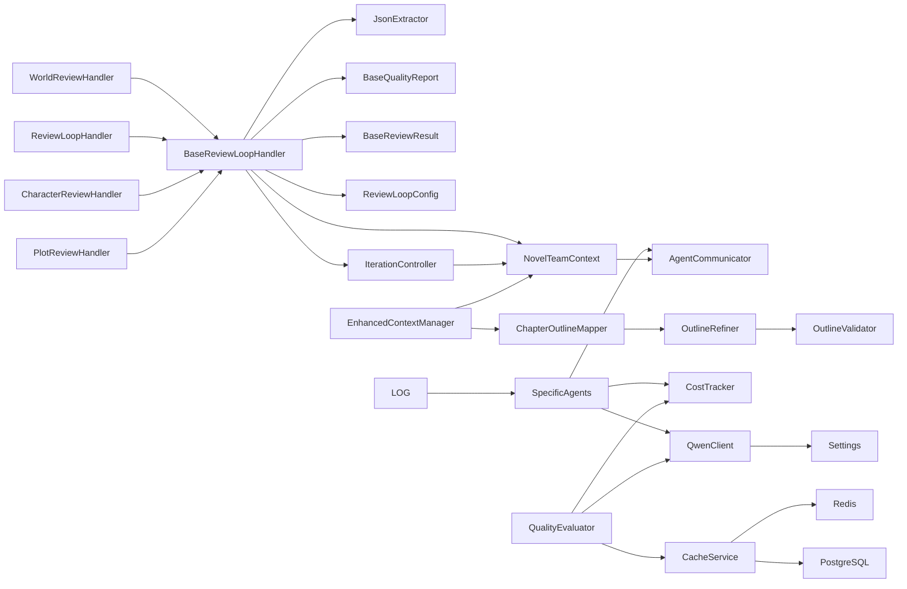

**图表来源**
- [agents/specific_agents.py:15-505](file://agents/specific_agents.py#L15-L505)
- [agents/agent_communicator.py:72-180](file://agents/agent_communicator.py#L72-L180)
- [agents/base/review_loop_base.py:64-726](file://agents/base/review_loop_base.py#L64-L726)
- [agents/world_review_loop.py:171-371](file://agents/world_review_loop.py#L171-L371)
- [agents/review_loop.py:76-510](file://agents/review_loop.py#L76-L510)
- [agents/character_review_loop.py](file://agents/character_review_loop.py)
- [agents/plot_review_loop.py](file://agents/plot_review_loop.py)
- [agents/quality_evaluator.py:1-173](file://agents/quality_evaluator.py#L1-L173)
- [agents/iteration_controller.py:41-308](file://agents/iteration_controller.py#L41-L308)
- [agents/team_context.py:162-591](file://agents/team_context.py#L162-L591)
- [agents/enhanced_context_manager.py:196-536](file://agents/enhanced_context_manager.py#L196-L536)
- [agents/chapter_outline_mapper.py:187-1109](file://agents/chapter_outline_mapper.py#L187-L1109)
- [agents/outline_refiner.py:18-705](file://agents/outline_refiner.py#L18-L705)
- [agents/outline_validator.py:19-832](file://agents/outline_validator.py#L19-L832)
- [backend/services/cache_service.py:14-280](file://backend/services/cache_service.py#L14-L280)
- [llm/qwen_client.py:16-232](file://llm/qwen_client.py#L16-L232)
- [llm/cost_tracker.py:16-74](file://llm/cost_tracker.py#L16-L74)
- [backend/config.py:5-132](file://backend/config.py#L5-L132)
- [core/logging_config.py:20-55](file://core/logging_config.py#L20-L55)

**章节来源**
- [agents/specific_agents.py:1-505](file://agents/specific_agents.py#L1-L505)
- [agents/agent_communicator.py:1-180](file://agents/agent_communicator.py#L1-L180)
- [agents/base/review_loop_base.py:1-726](file://agents/base/review_loop_base.py#L1-L726)
- [agents/world_review_loop.py:1-371](file://agents/world_review_loop.py#L1-L371)
- [agents/review_loop.py:1-510](file://agents/review_loop.py#L1-L510)
- [agents/character_review_loop.py](file://agents/character_review_loop.py)
- [agents/plot_review_loop.py](file://agents/plot_review_loop.py)
- [agents/quality_evaluator.py:1-173](file://agents/quality_evaluator.py#L1-L173)
- [agents/iteration_controller.py:1-308](file://agents/iteration_controller.py#L1-L308)
- [agents/team_context.py:1-591](file://agents/team_context.py#L1-L591)
- [agents/enhanced_context_manager.py:1-536](file://agents/enhanced_context_manager.py#L1-L536)
- [agents/chapter_outline_mapper.py:1-1109](file://agents/chapter_outline_mapper.py#L1-L1109)
- [agents/outline_refiner.py:1-705](file://agents/outline_refiner.py#L1-L705)
- [agents/outline_validator.py:1-832](file://agents/outline_validator.py#L1-L832)
- [backend/services/cache_service.py:1-280](file://backend/services/cache_service.py#L1-L280)
- [llm/qwen_client.py:1-232](file://llm/qwen_client.py#L1-L232)
- [llm/cost_tracker.py:1-74](file://llm/cost_tracker.py#L1-L74)
- [backend/config.py:1-132](file://backend/config.py#L1-L132)
- [core/logging_config.py:1-55](file://core/logging_config.py#L1-L55)

## 性能考量
- 并发与异步：基于asyncio的队列与任务循环，避免阻塞；QwenClient在DashScope模式下通过线程池执行同步调用，防止阻塞事件循环。
- 重试与退避：QwenClient支持指数退避重试，降低瞬时错误影响。
- 成本控制：CostTracker按模型定价实时统计，便于预算控制与成本优化。
- **新增审查循环性能**：审查循环处理器内置最佳记录追踪和停滞检测，避免无效迭代。
- **新增智能收敛检测性能**：迭代控制器提供快速的收敛判断，减少不必要的LLM调用。
- **新增团队上下文性能**：线程安全的上下文管理避免了数据竞争，提高了并发性能。
- **新增大纲管理性能**：通过ChapterOutlineMapper的智能映射和OutlineRefiner的并行处理，提高大纲生成效率。
- **新增缓存服务性能**：Redis缓存减少数据库查询压力，通过合理的TTL控制内存使用。
- 可观测性：统一日志与消息历史，便于定位瓶颈与异常。
- 扩展性建议：
  - 引入限流与熔断（如令牌桶/滑动窗口），防止LLM调用峰值冲击。
  - 任务队列持久化与重试策略，增强可靠性。
  - 负载均衡：按Agent类型与资源占用动态分配任务，避免热点。
  - 大纲管理组件的微服务化，支持独立扩展和部署。

## 故障排查指南
- Agent未启动/状态异常
  - 检查AgentCommunicator.register_agent是否成功注册。
- LLM调用失败
  - 查看QwenClient的重试日志与最终异常信息。
  - 核对Settings中的API Key与Base URL配置。
- **新增审查循环问题**
  - 检查审查循环配置参数是否合理。
  - 验证质量报告数据结构是否符合预期。
  - 确认JSON提取工具是否正确解析LLM响应。
  - 检查智能收敛检测日志，确认迭代控制是否正常工作。
- **新增团队上下文问题**
  - 检查NovelTeamContext的线程安全机制是否正常工作。
  - 验证异步操作是否正确使用了上下文管理器。
  - 确认数据序列化和反序列化过程是否正确。
- **新增大纲管理问题**
  - 检查ChapterOutlineMapper的张力循环解析是否正确。
  - 验证OutlineRefiner的大纲细化结果是否符合预期。
  - 确认OutlineValidator的验证逻辑是否准确。
- **新增缓存服务问题**
  - 检查Redis连接是否正常。
  - 验证缓存键的命名规范和TTL设置。
  - 确认缓存数据的序列化和反序列化过程。
- 成本统计异常
  - 确认CostTracker的record调用是否覆盖所有Agent调用路径。
  - 检查模型定价表与Token统计是否一致。

**章节来源**
- [agents/agent_communicator.py:80-135](file://agents/agent_communicator.py#L80-L135)
- [llm/qwen_client.py:65-161](file://llm/qwen_client.py#L65-L161)
- [llm/cost_tracker.py:26-56](file://llm/cost_tracker.py#L26-L56)
- [backend/config.py:5-132](file://backend/config.py#L5-L132)
- [agents/base/review_loop_base.py:623-626](file://agents/base/review_loop_base.py#L623-L626)
- [agents/iteration_controller.py:103-109](file://agents/iteration_controller.py#L103-L109)
- [agents/team_context.py:238-254](file://agents/team_context.py#L238-L254)
- [agents/enhanced_context_manager.py:517-525](file://agents/enhanced_context_manager.py#L517-L525)
- [agents/chapter_outline_mapper.py:187-203](file://agents/chapter_outline_mapper.py#L187-L203)
- [agents/outline_refiner.py:81-84](file://agents/outline_refiner.py#L81-L84)
- [agents/outline_validator.py:74-77](file://agents/outline_validator.py#L74-L77)
- [backend/services/cache_service.py:42-44](file://backend/services/cache_service.py#L42-L44)

## 结论
该系统采用简化的CrewAI风格架构，专注于端到端的小说生成流程。通过智能体间的异步消息通信、完善的任务处理机制与成本追踪，系统具备良好的可维护性与扩展性。新增的智能收敛检测机制、团队上下文管理系统、大纲管理组件和Redis缓存服务进一步增强了系统的智能化水平、协作能力和性能表现。这些改进使得系统能够更好地处理复杂的审查循环任务，实现更高质量的内容生成和更高效的生产流程。未来可在限流熔断、任务持久化与负载均衡方面进一步增强，以应对更高并发与更复杂业务场景。

## 附录
- 启动方式：可通过scripts/start_agents.py启动Agent系统，自动注册并运行五类Agent，支持信号处理与成本统计。
- 配置项：Settings提供DashScope API Key、模型、数据库、Redis、Celery等配置；LoggingConfig统一日志级别与输出。
- **新增基础框架模块**：agents/base目录提供了标准化的审查循环基础设施，支持快速扩展新的审查领域。
- **新增智能收敛检测**：IterationController提供基于章节类型的动态迭代策略，可应用于各种审查场景。
- **新增团队上下文管理**：NovelTeamContext和EnhancedContextManager实现四层记忆架构，支持复杂的协作场景。
- **新增大纲管理组件**：ChapterOutlineMapper、OutlineRefiner、OutlineValidator形成完整的大纲管理体系。
- **新增缓存服务**：CacheService提供Redis缓存功能，支持多种缓存场景和性能优化。
- **新增数据库迁移**：alembic脚本支持大纲增强字段的添加，确保数据结构的演进。

**章节来源**
- [scripts/start_agents.py:37-204](file://scripts/start_agents.py#L37-L204)
- [backend/config.py:5-132](file://backend/config.py#L5-L132)
- [core/logging_config.py:20-55](file://core/logging_config.py#L20-L55)
- [agents/base/__init__.py:1-48](file://agents/base/__init__.py#L1-L48)
- [agents/iteration_controller.py:1-308](file://agents/iteration_controller.py#L1-L308)
- [agents/team_context.py:1-591](file://agents/team_context.py#L1-L591)
- [agents/enhanced_context_manager.py:1-536](file://agents/enhanced_context_manager.py#L1-L536)
- [agents/chapter_outline_mapper.py:1-1109](file://agents/chapter_outline_mapper.py#L1-L1109)
- [agents/outline_refiner.py:1-705](file://agents/outline_refiner.py#L1-L705)
- [agents/outline_validator.py:1-832](file://agents/outline_validator.py#L1-L832)
- [backend/services/cache_service.py:1-280](file://backend/services/cache_service.py#L1-L280)
- [alembic/versions/add_outline_enhancements_to_chapters.py:1-43](file://alembic/versions/add_outline_enhancements_to_chapters.py#L1-L43)
- [alembic/versions/002_add_novel_creation_flow_table.py:1-62](file://alembic/versions/002_add_novel_creation_flow_table.py#L1-L62)