# AI智能体系统

<cite>
**本文档引用的文件**
- [agents/agent_manager.py](file://agents/agent_manager.py)
- [agents/continuity_integration_module.py](file://agents/continuity_integration_module.py)
- [agents/specific_agents.py](file://agents/specific_agents.py)
- [agents/agent_dispatcher.py](file://agents/agent_dispatcher.py)
- [agents/agent_scheduler.py](file://agents/agent_scheduler.py)
- [agents/agent_communicator.py](file://agents/agent_communicator.py)
- [agents/base/review_loop_base.py](file://agents/base/review_loop_base.py)
- [agents/team_context.py](file://agents/team_context.py)
- [agents/chapter_outline_mapper.py](file://agents/chapter_outline_mapper.py)
- [agents/review_loop.py](file://agents/review_loop.py)
- [agents/world_review_loop.py](file://agents/world_review_loop.py)
- [agents/quality_evaluator.py](file://agents/quality_evaluator.py)
- [agents/iteration_controller.py](file://agents/iteration_controller.py)
- [agents/base/quality_report.py](file://agents/base/quality_report.py)
- [agents/base/review_result.py](file://agents/base/review_result.py)
- [agents/outline_iteration_controller.py](file://agents/outline_iteration_controller.py)
- [agents/outline_quality_evaluator.py](file://agents/outline_quality_evaluator.py)
- [agents/enhanced_context_manager.py](file://agents/enhanced_context_manager.py)
- [agents/theme_guardian.py](file://agents/theme_guardian.py)
- [agents/continuity_integration.py](file://agents/continuity_integration.py)
- [agents/outline_dynamic_updater.py](file://agents/outline_dynamic_updater.py)
- [agents/character_consistency_tracker.py](file://agents/character_consistency_tracker.py)
- [agents/foreshadowing_auto_injector.py](file://agents/foreshadowing_auto_injector.py)
- [agents/foreshadowing_tracker.py](file://agents/foreshadowing_tracker.py)
- [agents/prevention_continuity_checker.py](file://agents/prevention_continuity_checker.py)
- [agents/similarity_detector.py](file://agents/similarity_detector.py)
- [agents/voting_manager.py](file://agents/voting_manager.py)
- [agents/world_review_loop.py](file://agents/world_review_loop.py)
- [agents/reflection_agent.py](file://agents/reflection_agent.py)
- [agents/crew_manager.py](file://agents/crew_manager.py)
- [backend/services/character_auto_detector.py](file://backend/services/character_auto_detector.py)
- [backend/services/outline_service.py](file://backend/services/outline_service.py)
- [backend/services/generation_service.py](file://backend/services/generation_service.py)
- [backend/services/agentmesh_memory_adapter.py](file://backend/services/agentmesh_memory_adapter.py)
- [backend/services/agent_activity_recorder.py](file://backend/services/agent_activity_recorder.py)
- [backend/routes/agent_activities.py](file://backend/routes/agent_activities.py)
- [core/models/plot_outline.py](file://core/models/plot_outline.py)
- [backend/config.py](file://backend/config.py)
- [core/logging_config.py](file://core/logging_config.py)
- [scripts/start_agents.py](file://scripts/start_agents.py)
</cite>

## 更新摘要
**所做更改**
- 新增反思机制（Reflection Mechanism），包括ReflectionAgent组件和AgentMesh记忆适配器
- 增强Agent管理器功能，支持反思代理的集成和管理
- 新增短期和长期反思功能，支持纯Python统计分析和跨章节模式分析
- 新增反思记录、模式识别和经验规则持久化机制
- 集成反思机制到审查循环和生成流程中
- 新增Agent活动记录和监控功能

## 目录
1. [引言](#引言)
2. [项目结构](#项目结构)
3. [核心组件](#核心组件)
4. [架构总览](#架构总览)
5. [详细组件分析](#详细组件分析)
6. [动态大纲更新系统](#动态大纲更新系统)
7. [角色自动检测系统](#角色自动检测系统)
8. [反思机制（Reflection Mechanism）](#反思机制reflection-mechanism)
9. [连贯性保障系统](#连贯性保障系统)
10. [约束推断引擎](#约束推断引擎)
11. [验证引擎](#验证引擎)
12. [数据模型](#数据模型)
13. [智能体通信协议](#智能体通信协议)
14. [错误处理策略](#错误处理策略)
15. [依赖关系分析](#依赖关系分析)
16. [性能考量](#性能考量)
17. [故障排查指南](#故障排查指南)
18. [结论](#结论)
19. [附录](#附录)

## 引言
本文件面向"AI智能体系统"的全面技术文档，重点阐述该系统如何在小说生成场景中应用智能体协作与任务编排。系统采用全新的连贯性保障架构，集成了智能体类型设计、约束推断、验证引擎、统一的连贯性保障模块、动态大纲更新系统、角色自动检测系统和反思机制。文档将深入解析：
- 反思机制的设计与实现，包括短期和长期反思功能
- AgentMesh记忆适配器的持久化存储机制
- 增强的Agent管理器功能，支持反思代理的集成
- 动态大纲更新系统的设计与实现
- 角色自动检测系统的设计与实现
- 连贯性保障系统的设计与实现
- 智能体类型设计与职责分工
- 基于 LLM 的约束推断和验证机制
- 统一的连贯性保障模块集成
- 智能体通信协议与消息传递机制
- 错误处理与可观测性
- 性能监控、负载均衡与扩展性设计

## 项目结构
系统采用模块化的分层架构，包含智能体核心、连贯性保障、质量评估、团队协作、章节管理、大纲优化、动态更新、角色检测、反思机制等多个子系统：
- agents：智能体与通信相关的核心实现
- agents/base：质量评估和审查循环的基础组件
- agents/continuity_*：连贯性保障相关组件
- agents/outline_*：大纲级别的质量评估和迭代优化组件
- agents/reflection_agent.py：反思代理组件
- agents/crew_manager.py：增强的Crew管理器，集成反思机制
- agents/character_consistency_tracker.py：角色一致性追踪器
- agents/foreshadowing_*：伏笔管理和追踪组件
- backend/services：后端服务与业务逻辑
- backend/services/character_auto_detector.py：角色自动检测服务
- backend/services/outline_service.py：大纲服务
- backend/services/generation_service.py：生成服务
- backend/services/agentmesh_memory_adapter.py：AgentMesh记忆适配器
- backend/services/agent_activity_recorder.py：Agent活动记录器
- backend/routes/agent_activities.py：Agent活动路由
- core/models：数据库模型定义
- core/models/plot_outline.py：大纲模型（新增版本管理字段）
- llm：大模型客户端与成本追踪
- backend：后端服务与配置
- core：通用日志与基础设施
- scripts：启动脚本与运维工具

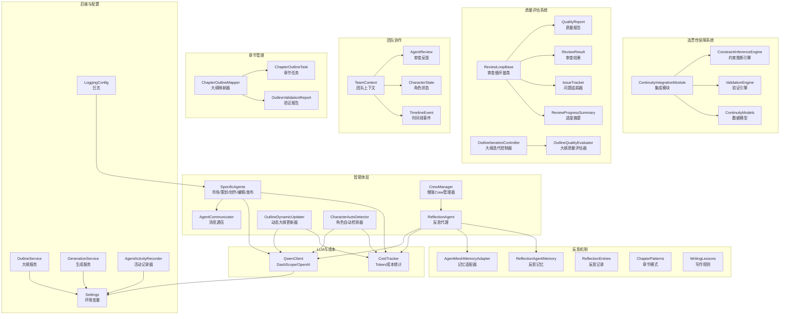
```mermaid
graph TB
subgraph "智能体层"
AC["AgentCommunicator<br/>消息通信"]
SA["SpecificAgents<br/>市场/策划/创作/编辑/发布"]
RA["ReflectionAgent<br/>反思代理"]
ODU["OutlineDynamicUpdater<br/>动态大纲更新器"]
CAD["CharacterAutoDetector<br/>角色自动检测器"]
CM["CrewManager<br/>增强Crew管理器"]
end
subgraph "反思机制"
RAM["ReflectionAgentMemory<br/>反思记忆"]
AMMA["AgentMeshMemoryAdapter<br/>记忆适配器"]
RE["ReflectionEntries<br/>反思记录"]
CP["ChapterPatterns<br/>章节模式"]
WL["WritingLessons<br/>写作规则"]
end
subgraph "连贯性保障系统"
CIM["ContinuityIntegrationModule<br/>集成模块"]
CIE["ConstraintInferenceEngine<br/>约束推断引擎"]
VE["ValidationEngine<br/>验证引擎"]
CM2["ContinuityModels<br/>数据模型"]
end
subgraph "质量评估系统"
RLB["ReviewLoopBase<br/>审查循环基类"]
QR["QualityReport<br/>质量报告"]
RR["ReviewResult<br/>审查结果"]
IE["IssueTracker<br/>问题追踪器"]
RS["ReviewProgressSummary<br/>进度摘要"]
OIC["OutlineIterationController<br/>大纲迭代控制器"]
OQE["OutlineQualityEvaluator<br/>大纲质量评估器"]
end
subgraph "团队协作"
TC["TeamContext<br/>团队上下文"]
AR["AgentReview<br/>审查反馈"]
CS["CharacterState<br/>角色状态"]
TL["TimelineEvent<br/>时间线事件"]
end
subgraph "章节管理"
COM["ChapterOutlineMapper<br/>大纲映射器"]
COT["ChapterOutlineTask<br/>章节任务"]
OVR["OutlineValidationReport<br/>验证报告"]
end
subgraph "LLM与成本"
QC["QwenClient<br/>DashScope/OpenAI"]
CT["CostTracker<br/>Token/成本统计"]
end
subgraph "后端与配置"
CFG["Settings<br/>环境变量"]
LOG["LoggingConfig<br/>日志"]
OS["OutlineService<br/>大纲服务"]
GS["GenerationService<br/>生成服务"]
AAR["AgentActivityRecorder<br/>活动记录器"]
end
SA --> AC
SA --> QC
SA --> CT
RA --> QC
RA --> CT
RA --> AMMA
RA --> RAM
ODU --> QC
ODU --> CT
CAD --> QC
CAD --> CT
CM --> RA
CIM --> CIE
CIM --> VE
CIM --> CM2
RLB --> QR
RLB --> RR
RLB --> IE
RLB --> RS
OIC --> OQE
TC --> AR
TC --> CS
TC --> TL
COM --> COT
COM --> OVR
OS --> CFG
GS --> CFG
AAR --> CFG
QC --> CFG
LOG --> SA
```

**图表来源**
- [agents/agent_communicator.py:72-180](file://agents/agent_communicator.py#L72-L180)
- [agents/specific_agents.py:15-505](file://agents/specific_agents.py#L15-L505)
- [agents/reflection_agent.py:147-841](file://agents/reflection_agent.py#L147-L841)
- [agents/crew_manager.py:1680-1757](file://agents/crew_manager.py#L1680-L1757)
- [agents/outline_dynamic_updater.py:62-745](file://agents/outline_dynamic_updater.py#L62-L745)
- [backend/services/character_auto_detector.py:24-422](file://backend/services/character_auto_detector.py#L24-L422)
- [agents/continuity_integration_module.py:74-483](file://agents/continuity_integration_module.py#L74-L483)
- [agents/continuity_inference.py:16-270](file://agents/continuity_inference.py#L16-L270)
- [agents/continuity_validation.py:16-363](file://agents/continuity_validation.py#L16-L363)
- [agents/continuity_models.py:11-201](file://agents/continuity_models.py#L11-L201)
- [agents/base/review_loop_base.py:598-800](file://agents/base/review_loop_base.py#L598-L800)
- [agents/team_context.py:162-591](file://agents/team_context.py#L162-L591)
- [agents/chapter_outline_mapper.py:187-800](file://agents/chapter_outline_mapper.py#L187-L800)
- [agents/outline_iteration_controller.py:39-404](file://agents/outline_iteration_controller.py#L39-L404)
- [agents/outline_quality_evaluator.py:93-440](file://agents/outline_quality_evaluator.py#L93-L440)
- [backend/services/agentmesh_memory_adapter.py:20-1500](file://backend/services/agentmesh_memory_adapter.py#L20-L1500)
- [backend/services/agent_activity_recorder.py:14-315](file://backend/services/agent_activity_recorder.py#L14-L315)
- [backend/routes/agent_activities.py:50-90](file://backend/routes/agent_activities.py#L50-L90)
- [backend/services/outline_service.py:28-932](file://backend/services/outline_service.py#L28-L932)
- [backend/services/generation_service.py:34-1707](file://backend/services/generation_service.py#L34-L1707)
- [core/models/plot_outline.py:11-114](file://core/models/plot_outline.py#L11-L114)
- [llm/qwen_client.py:16-232](file://llm/qwen_client.py#L16-L232)
- [llm/cost_tracker.py:16-74](file://llm/cost_tracker.py#L16-L74)
- [backend/config.py:5-156](file://backend/config.py#L5-L156)
- [core/logging_config.py:20-55](file://core/logging_config.py#L20-L55)

**章节来源**
- [agents/agent_communicator.py:1-180](file://agents/agent_communicator.py#L1-L180)
- [agents/specific_agents.py:1-505](file://agents/specific_agents.py#L1-L505)
- [agents/reflection_agent.py:1-841](file://agents/reflection_agent.py#L1-L841)
- [agents/crew_manager.py:1-1757](file://agents/crew_manager.py#L1-L1757)
- [agents/outline_dynamic_updater.py:1-745](file://agents/outline_dynamic_updater.py#L1-L745)
- [backend/services/character_auto_detector.py:1-422](file://backend/services/character_auto_detector.py#L1-L422)
- [agents/continuity_integration_module.py:1-483](file://agents/continuity_integration_module.py#L1-L483)
- [agents/continuity_inference.py:1-270](file://agents/continuity_inference.py#L1-L270)
- [agents/continuity_validation.py:1-363](file://agents/continuity_validation.py#L1-L363)
- [agents/continuity_models.py:1-201](file://agents/continuity_models.py#L1-L201)
- [agents/base/review_loop_base.py:1-800](file://agents/base/review_loop_base.py#L1-L800)
- [agents/team_context.py:1-591](file://agents/team_context.py#L1-L591)
- [agents/chapter_outline_mapper.py:1-1109](file://agents/chapter_outline_mapper.py#L1-L1109)
- [agents/outline_iteration_controller.py:1-404](file://agents/outline_iteration_controller.py#L1-L404)
- [agents/outline_quality_evaluator.py:1-440](file://agents/outline_quality_evaluator.py#L1-L440)
- [backend/services/agentmesh_memory_adapter.py:1-1500](file://backend/services/agentmesh_memory_adapter.py#L1-L1500)
- [backend/services/agent_activity_recorder.py:1-315](file://backend/services/agent_activity_recorder.py#L1-L315)
- [backend/routes/agent_activities.py:1-90](file://backend/routes/agent_activities.py#L1-L90)
- [backend/services/outline_service.py:1-932](file://backend/services/outline_service.py#L1-L932)
- [backend/services/generation_service.py:1-1707](file://backend/services/generation_service.py#L1-L1707)
- [core/models/plot_outline.py:1-114](file://core/models/plot_outline.py#L1-L114)
- [llm/qwen_client.py:1-232](file://llm/qwen_client.py#L1-L232)
- [llm/cost_tracker.py:1-74](file://llm/cost_tracker.py#L1-L74)
- [backend/config.py:1-156](file://backend/config.py#L1-L156)
- [core/logging_config.py:1-55](file://core/logging_config.py#L1-L55)

## 核心组件
- AgentCommunicator：消息通信中枢，提供注册、发送、接收、广播与历史记录能力。
- SpecificAgents：五类智能体，分别承担市场分析、内容策划、创作、编辑、发布职责。
- ReflectionAgent：反思代理，提供短期和长期反思功能，支持纯Python统计分析和跨章节模式分析。
- AgentMeshMemoryAdapter：AgentMesh记忆适配器，提供反思记录、模式识别和经验规则的持久化存储。
- CrewManager：增强的Crew管理器，集成反思机制到大纲优化和审查循环中。
- OutlineDynamicUpdater：动态大纲更新器，基于章节内容偏差分析自动调整未来章节大纲。
- CharacterAutoDetector：角色自动检测器，从章节内容中自动识别并注册新角色。
- ContinuityIntegrationModule：连贯性保障集成模块，将所有连贯性保障组件集成到统一接口中。
- ConstraintInferenceEngine：约束推断引擎，从上一章内容中自动推断读者期待和连贯性约束。
- ValidationEngine：验证引擎，使用 LLM 验证新章节是否满足连贯性约束。
- ContinuityModels：连贯性保障系统的数据模型，定义约束、验证报告和章节过渡记录的数据结构。
- ReviewLoopBase：审查循环基类，提供多阶段质量评估的模板方法模式实现。
- QualityReport：质量评估报告基类，支持不同领域的质量分析和降级处理。
- ReviewResult：审查结果基类，支持不同类型的最终输出和迭代历史记录。
- TeamContext：团队上下文管理器，实现Agent间的共享状态和协作机制。
- ChapterOutlineMapper：章节大纲映射器，提供章节级任务分解和进度追踪功能。
- OutlineIterationController：大纲迭代优化控制器，管理大纲完善过程中的迭代优化。
- OutlineQualityEvaluator：大纲质量评估器，扩展现有的质量评估维度。
- EnhancedContextManager：增强型上下文管理器，采用四层记忆架构确保关键信息不丢失。
- ThemeGuardian：主题守护者，负责定义小说核心主题并审查内容一致性。
- OutlineService：大纲服务，提供大纲生成、分解、验证和版本管理功能。
- GenerationService：生成服务，编排整个小说生成流程，集成动态更新、角色检测和反思机制。
- QwenClient：DashScope/OpenAI兼容的大模型客户端，支持重试与流式输出。
- CostTracker：Token用量与成本统计，按模型定价计算累计成本。
- AgentActivityRecorder：Agent活动记录器，记录Agent执行过程中的详细活动信息。
- Settings与LoggingConfig：配置与日志基础设施。

**章节来源**
- [agents/agent_communicator.py:72-180](file://agents/agent_communicator.py#L72-L180)
- [agents/specific_agents.py:15-505](file://agents/specific_agents.py#L15-L505)
- [agents/reflection_agent.py:147-841](file://agents/reflection_agent.py#L147-L841)
- [agents/crew_manager.py:1680-1757](file://agents/crew_manager.py#L1680-L1757)
- [agents/outline_dynamic_updater.py:62-745](file://agents/outline_dynamic_updater.py#L62-L745)
- [backend/services/character_auto_detector.py:24-422](file://backend/services/character_auto_detector.py#L24-L422)
- [agents/continuity_integration_module.py:74-483](file://agents/continuity_integration_module.py#L74-L483)
- [agents/continuity_inference.py:16-270](file://agents/continuity_inference.py#L16-L270)
- [agents/continuity_validation.py:16-363](file://agents/continuity_validation.py#L16-L363)
- [agents/continuity_models.py:11-201](file://agents/continuity_models.py#L11-L201)
- [agents/base/review_loop_base.py:598-800](file://agents/base/review_loop_base.py#L598-L800)
- [agents/team_context.py:162-591](file://agents/team_context.py#L162-L591)
- [agents/chapter_outline_mapper.py:187-800](file://agents/chapter_outline_mapper.py#L187-L800)
- [agents/outline_iteration_controller.py:39-404](file://agents/outline_iteration_controller.py#L39-L404)
- [agents/outline_quality_evaluator.py:93-440](file://agents/outline_quality_evaluator.py#L93-L440)
- [agents/enhanced_context_manager.py:196-536](file://agents/enhanced_context_manager.py#L196-L536)
- [agents/theme_guardian.py:159-625](file://agents/theme_guardian.py#L159-L625)
- [backend/services/agentmesh_memory_adapter.py:20-1500](file://backend/services/agentmesh_memory_adapter.py#L20-L1500)
- [backend/services/agent_activity_recorder.py:14-315](file://backend/services/agent_activity_recorder.py#L14-L315)
- [backend/services/outline_service.py:28-932](file://backend/services/outline_service.py#L28-L932)
- [backend/services/generation_service.py:34-1707](file://backend/services/generation_service.py#L34-L1707)
- [llm/qwen_client.py:16-232](file://llm/qwen_client.py#L16-L232)
- [llm/cost_tracker.py:16-74](file://llm/cost_tracker.py#L16-L74)
- [backend/config.py:5-156](file://backend/config.py#L5-L156)
- [core/logging_config.py:20-55](file://core/logging_config.py#L20-L55)

## 架构总览
系统采用全新的连贯性保障架构，集成了智能体协作、约束推断、验证引擎、统一的连贯性保障模块、动态大纲更新系统、角色自动检测系统和反思机制：
- 通过AgentCommunicator实现智能体间的异步消息传递
- 通过ContinuityIntegrationModule实现统一的连贯性保障接口
- 通过ConstraintInferenceEngine实现基于 LLM 的约束推断
- 通过ValidationEngine实现章节过渡的验证机制
- 通过ReviewLoopBase实现多阶段质量评估循环
- 通过TeamContext实现团队协作和上下文共享
- 通过ChapterOutlineMapper实现章节级任务管理和进度追踪
- 通过OutlineIterationController和OutlineQualityEvaluator实现大纲级别的迭代优化
- 通过OutlineDynamicUpdater实现动态大纲更新功能
- 通过CharacterAutoDetector实现角色自动检测功能
- 通过ReflectionAgent实现短期和长期反思功能
- 通过AgentMeshMemoryAdapter实现反思机制的持久化存储
- 通过CrewManager集成反思机制到审查循环和大纲优化中
- 通过GenerationService集成所有功能到统一的生成流程
- 通过OutlineService提供大纲管理服务
- 通过SpecificAgents实现小说生成的各个阶段
- 通过QwenClient和CostTracker实现大模型调用与成本追踪
- 通过AgentActivityRecorder实现Agent活动的详细记录和监控

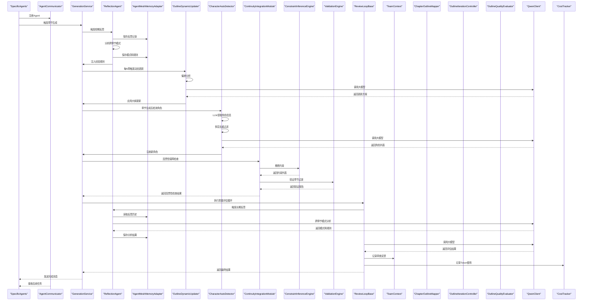
```mermaid
sequenceDiagram
participant Agent as "SpecificAgents"
participant Comm as "AgentCommunicator"
participant GS as "GenerationService"
participant RA as "ReflectionAgent"
participant AMMA as "AgentMeshMemoryAdapter"
participant ODUE as "OutlineDynamicUpdater"
participant CAD as "CharacterAutoDetector"
participant CIM as "ContinuityIntegrationModule"
participant CIE as "ConstraintInferenceEngine"
participant VE as "ValidationEngine"
participant RL as "ReviewLoopBase"
participant TC as "TeamContext"
participant COM as "ChapterOutlineMapper"
participant OIC as "OutlineIterationController"
participant OQE as "OutlineQualityEvaluator"
participant Qwen as "QwenClient"
participant Tracker as "CostTracker"
Agent->>Comm : 注册Agent
Agent->>GS : 触发章节生成
GS->>RA : 触发短期反思
RA->>AMMA : 保存反思记录
RA->>RA : 分析跨章节模式
RA->>AMMA : 保存模式和规则
RA->>GS : 注入经验规则
GS->>ODUE : 每N章触发动态更新
ODUE->>ODUE : 偏差分析
ODUE->>Qwen : 调用大模型
Qwen-->>ODUE : 返回更新方案
ODUE->>GS : 应用大纲更新
GS->>CAD : 章节生成后检测角色
CAD->>CAD : LLM提取角色信息
CAD->>CAD : 多层去重过滤
CAD->>Qwen : 调用大模型
Qwen-->>CAD : 返回角色列表
CAD->>GS : 注册新角色
GS->>CIM : 连贯性保障检查
CIM->>CIE : 推断约束
CIE-->>CIM : 返回约束列表
CIM->>VE : 验证章节过渡
VE-->>CIM : 返回验证报告
CIM-->>GS : 返回连贯性检查结果
GS->>RL : 执行质量评估循环
RL->>RA : 触发长期反思
RA->>AMMA : 读取反思历史
RA->>Qwen : 跨章节模式分析
Qwen-->>RA : 返回模式和规则
RA->>AMMA : 保存分析结果
RL->>Qwen : 调用大模型
Qwen-->>RL : 返回评估结果
RL->>TC : 记录审查反馈
RL->>Tracker : 记录Token使用
RL-->>GS : 返回最终结果
GS-->>Agent : 发送完成消息
Comm-->>Agent : 接收后续任务
```

**图表来源**
- [agents/specific_agents.py:37-505](file://agents/specific_agents.py#L37-L505)
- [agents/agent_communicator.py:91-135](file://agents/agent_communicator.py#L91-L135)
- [agents/reflection_agent.py:175-841](file://agents/reflection_agent.py#L175-L841)
- [backend/services/agentmesh_memory_adapter.py:1000-1199](file://backend/services/agentmesh_memory_adapter.py#L1000-L1199)
- [backend/services/generation_service.py:1227-1332](file://backend/services/generation_service.py#L1227-L1332)
- [agents/outline_dynamic_updater.py:82-195](file://agents/outline_dynamic_updater.py#L82-L195)
- [backend/services/character_auto_detector.py:44-105](file://backend/services/character_auto_detector.py#L44-L105)
- [agents/continuity_integration_module.py:176-352](file://agents/continuity_integration_module.py#L176-L352)
- [agents/continuity_inference.py:72-144](file://agents/continuity_inference.py#L72-L144)
- [agents/continuity_validation.py:86-145](file://agents/continuity_validation.py#L86-L145)
- [agents/base/review_loop_base.py:659-800](file://agents/base/review_loop_base.py#L659-L800)
- [agents/team_context.py:443-459](file://agents/team_context.py#L443-L459)
- [agents/chapter_outline_mapper.py:246-305](file://agents/chapter_outline_mapper.py#L246-L305)
- [agents/outline_iteration_controller.py:197-290](file://agents/outline_iteration_controller.py#L197-L290)
- [agents/outline_quality_evaluator.py:105-142](file://agents/outline_quality_evaluator.py#L105-L142)
- [llm/qwen_client.py:46-161](file://llm/qwen_client.py#L46-L161)
- [llm/cost_tracker.py:26-56](file://llm/cost_tracker.py#L26-L56)

## 详细组件分析

### 智能体类型与职责分工
- 市场分析Agent：基于PromptManager与QwenClient分析市场趋势、热门题材与标签，产出洞察供内容策划参考。
- 内容策划Agent：整合市场分析与用户偏好，生成小说标题、类型、标签、简介与内容计划。
- 创作Agent：根据内容计划与世界设定、角色信息生成章节初稿。
- 编辑Agent：对初稿进行润色与优化，提升可读性与一致性，支持Editor自动润色验证。
- 发布Agent：模拟发布流程，记录平台书号与章节号等元数据。

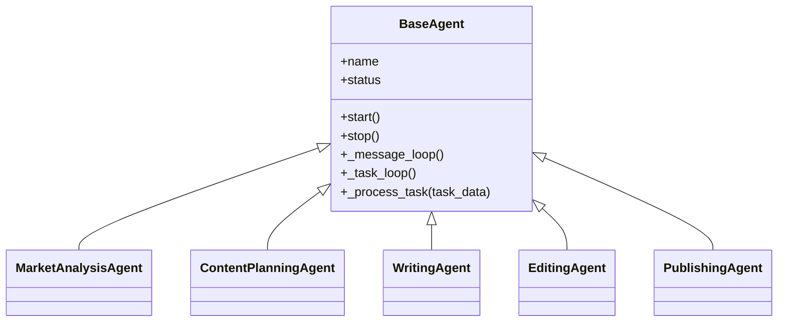
```mermaid
classDiagram
class BaseAgent {
+name
+status
+start()
+stop()
+_message_loop()
+_task_loop()
+_process_task(task_data)
}
class MarketAnalysisAgent
class ContentPlanningAgent
class WritingAgent
class EditingAgent
class PublishingAgent
BaseAgent <|-- MarketAnalysisAgent
BaseAgent <|-- ContentPlanningAgent
BaseAgent <|-- WritingAgent
BaseAgent <|-- EditingAgent
BaseAgent <|-- PublishingAgent
```

**图表来源**
- [agents/specific_agents.py:15-505](file://agents/specific_agents.py#L15-L505)

**章节来源**
- [agents/specific_agents.py:15-505](file://agents/specific_agents.py#L15-L505)

### 智能体通信协议与消息传递机制
- 注册：Agent通过AgentCommunicator.register_agent注册到消息队列。
- 发送/接收：send_message与receive_message基于asyncio.Queue实现异步消息传递；支持超时与状态追踪。
- 广播：broadcast_message向所有已注册Agent广播消息。
- 历史：消息历史记录便于审计与调试。

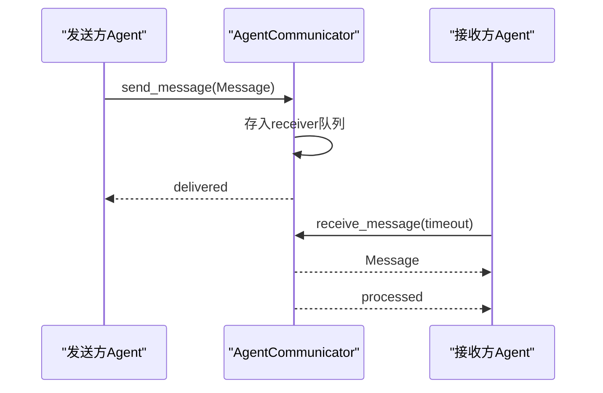
```mermaid
sequenceDiagram
participant Sender as "发送方Agent"
participant Comm as "AgentCommunicator"
participant Receiver as "接收方Agent"
Sender->>Comm : send_message(Message)
Comm->>Comm : 存入receiver队列
Comm-->>Sender : delivered
Receiver->>Comm : receive_message(timeout)
Comm-->>Receiver : Message
Comm-->>Receiver : processed
```

**图表来源**
- [agents/agent_communicator.py:91-135](file://agents/agent_communicator.py#L91-L135)

**章节来源**
- [agents/agent_communicator.py:72-180](file://agents/agent_communicator.py#L72-L180)

### 错误处理策略
- LLM调用：QwenClient在OpenAI与DashScope模式下均实现指数退避重试；异常统一抛出，便于上层捕获。
- 任务处理：Agent基类在任务处理异常时设置状态为ERROR，并记录日志；调度器在任务完成消息缺失或UUID解析失败时进行保护性处理。
- 连贯性保障：ContinuityIntegrationModule对约束推断和验证失败进行保护性处理，返回默认结果而非中断流程。
- 大纲优化：OutlineIterationController提供成本控制和迭代终止机制，防止无限循环。
- 动态更新：OutlineDynamicUpdater对LLM调用失败进行保护性处理，返回空报告而非中断流程。
- 角色检测：CharacterAutoDetector对LLM调用失败进行保护性处理，返回空列表而非中断流程。
- 反思机制：ReflectionAgent对LLM调用失败进行保护性处理，记录警告而非中断流程。
- Agent活动：AgentActivityRecorder对数据库操作异常进行保护性处理，记录错误日志。

**章节来源**
- [llm/qwen_client.py:65-161](file://llm/qwen_client.py#L65-L161)
- [agents/agent_scheduler.py:191-220](file://agents/agent_scheduler.py#L191-L220)
- [agents/continuity_integration_module.py:141-144](file://agents/continuity_integration_module.py#L141-L144)
- [agents/outline_iteration_controller.py:68-123](file://agents/outline_iteration_controller.py#L68-L123)
- [agents/outline_dynamic_updater.py:263-265](file://agents/outline_dynamic_updater.py#L263-L265)
- [backend/services/character_auto_detector.py:155-157](file://backend/services/character_auto_detector.py#L155-L157)
- [agents/reflection_agent.py:382-398](file://agents/reflection_agent.py#L382-L398)
- [backend/services/agent_activity_recorder.py:50-51](file://backend/services/agent_activity_recorder.py#L50-L51)

## 动态大纲更新系统

### OutlineDynamicUpdater架构设计
OutlineDynamicUpdater是一个独立的智能体组件，专门负责基于章节内容偏差分析来动态调整未来章节的大纲。系统采用三层处理流程：偏差分析、更新决策、方案应用。

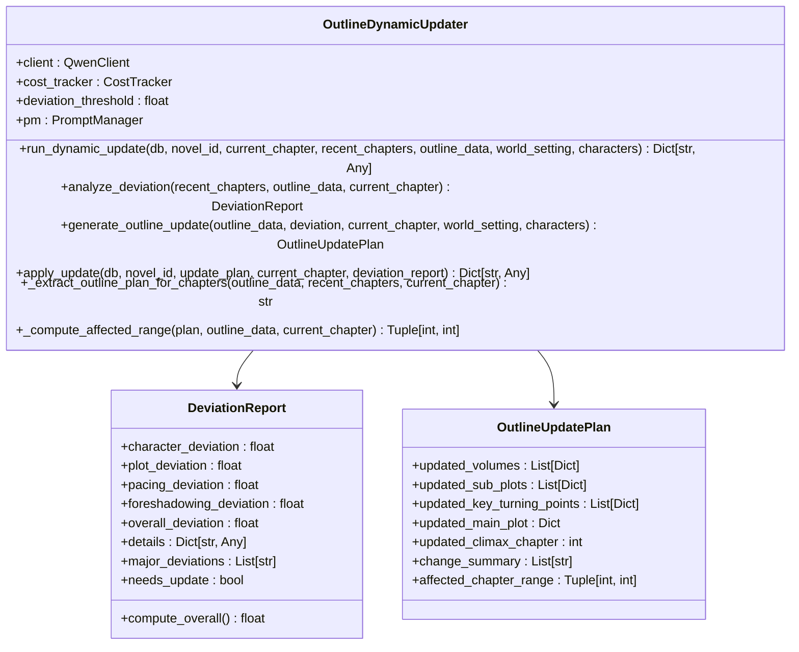
```mermaid
classDiagram
class DeviationReport {
+character_deviation : float
+plot_deviation : float
+pacing_deviation : float
+foreshadowing_deviation : float
+overall_deviation : float
+details : Dict[str, Any]
+major_deviations : List[str]
+needs_update : bool
+compute_overall() float
}
class OutlineUpdatePlan {
+updated_volumes : List[Dict]
+updated_sub_plots : List[Dict]
+updated_key_turning_points : List[Dict]
+updated_main_plot : Dict
+updated_climax_chapter : int
+change_summary : List[str]
+affected_chapter_range : Tuple[int, int]
}
class OutlineDynamicUpdater {
+client : QwenClient
+cost_tracker : CostTracker
+deviation_threshold : float
+pm : PromptManager
+run_dynamic_update(db, novel_id, current_chapter, recent_chapters, outline_data, world_setting, characters) Dict[str, Any]
+analyze_deviation(recent_chapters, outline_data, current_chapter) DeviationReport
+generate_outline_update(outline_data, deviation, current_chapter, world_setting, characters) OutlineUpdatePlan
+apply_update(db, novel_id, update_plan, current_chapter, deviation_report) Dict[str, Any]
+_extract_outline_plan_for_chapters(outline_data, recent_chapters, current_chapter) str
+_compute_affected_range(plan, outline_data, current_chapter) Tuple[int, int]
}
OutlineDynamicUpdater --> DeviationReport
OutlineDynamicUpdater --> OutlineUpdatePlan
```

**图表来源**
- [agents/outline_dynamic_updater.py:25-745](file://agents/outline_dynamic_updater.py#L25-L745)

### 偏差分析与评估机制
系统通过多维度偏差分析来评估实际章节内容与大纲计划的偏离程度，采用加权平均算法计算综合偏差分：

- 角色偏差（权重30%）：评估角色发展、出场频率、角色关系等与大纲计划的偏离
- 情节偏差（权重35%）：评估主线剧情推进、转折点发生、情节逻辑等与大纲计划的偏离  
- 节奏偏差（权重20%）：评估张力循环、高潮安排、节奏变化等与大纲计划的偏离
- 伏笔偏差（权重15%）：评估伏笔埋设、发展、回收等与大纲计划的偏离

**章节来源**
- [agents/outline_dynamic_updater.py:25-745](file://agents/outline_dynamic_updater.py#L25-L745)

### 更新决策与应用流程
系统采用阈值驱动的更新决策机制，只有当综合偏差分超过预设阈值时才会执行大纲更新。更新应用采用增量更新策略，仅修改未来章节的大纲内容，确保已完成章节不受影响。

**章节来源**
- [agents/outline_dynamic_updater.py:82-195](file://agents/outline_dynamic_updater.py#L82-L195)
- [agents/outline_dynamic_updater.py:360-474](file://agents/outline_dynamic_updater.py#L360-L474)

## 角色自动检测系统

### CharacterAutoDetector架构设计
CharacterAutoDetector是一个独立的服务组件，专门负责从章节内容中自动识别并注册新角色。系统采用多层去重过滤策略，确保只注册真正的新角色。

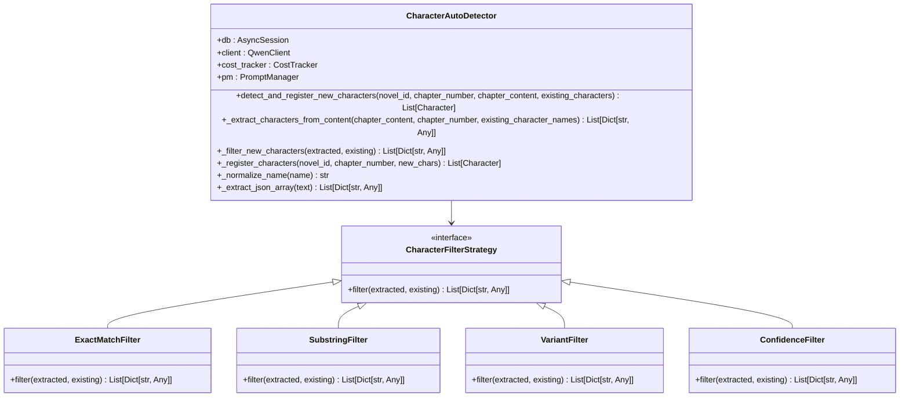
```mermaid
classDiagram
class CharacterAutoDetector {
+db : AsyncSession
+client : QwenClient
+cost_tracker : CostTracker
+pm : PromptManager
+detect_and_register_new_characters(novel_id, chapter_number, chapter_content, existing_characters) List[Character]
+_extract_characters_from_content(chapter_content, chapter_number, existing_character_names) List[Dict[str, Any]]
+_filter_new_characters(extracted, existing) List[Dict[str, Any]]
+_register_characters(novel_id, chapter_number, new_chars) List[Character]
+_normalize_name(name) str
+_extract_json_array(text) List[Dict[str, Any]]
}
class CharacterFilterStrategy {
<<interface>>
+filter(extracted, existing) List[Dict[str, Any]]
}
class ExactMatchFilter {
+filter(extracted, existing) List[Dict[str, Any]]
}
class SubstringFilter {
+filter(extracted, existing) List[Dict[str, Any]]
}
class VariantFilter {
+filter(extracted, existing) List[Dict[str, Any]]
}
class ConfidenceFilter {
+filter(extracted, existing) List[Dict[str, Any]]
}
CharacterAutoDetector --> CharacterFilterStrategy
CharacterFilterStrategy <|-- ExactMatchFilter
CharacterFilterStrategy <|-- SubstringFilter
CharacterFilterStrategy <|-- VariantFilter
CharacterFilterStrategy <|-- ConfidenceFilter
```

**图表来源**
- [backend/services/character_auto_detector.py:24-422](file://backend/services/character_auto_detector.py#L24-L422)

### 多层去重过滤策略
系统采用四层去重过滤策略，确保只返回真正的新角色：

1. **精确名字匹配**：使用标准化后的姓名进行精确匹配，避免重复注册
2. **子串包含检查**：检查新角色名与现有角色名的子串关系，处理简称与全名的情况
3. **别名交叉检查**：检查角色别名与现有角色的匹配关系
4. **置信度阈值过滤**：基于LLM输出的置信度进行过滤，低于阈值的角色不注册

**章节来源**
- [backend/services/character_auto_detector.py:159-257](file://backend/services/character_auto_detector.py#L159-L257)

### 角色注册与回填机制
系统提供完整的角色注册流程，包括角色信息提取、去重过滤、数据库注册和章节关联回填。注册的角色具有标准的角色属性，包括角色类型、性别、首次出现章节等。

**章节来源**
- [backend/services/character_auto_detector.py:259-330](file://backend/services/character_auto_detector.py#L259-L330)

## 反思机制（Reflection Mechanism）

### ReflectionAgent架构设计
ReflectionAgent是系统新增的核心反思组件，提供短期和长期反思功能，支持纯Python统计分析和跨章节模式分析。系统采用双层反思机制：短期反思（零LLM开销）和长期反思（跨章节模式分析）。

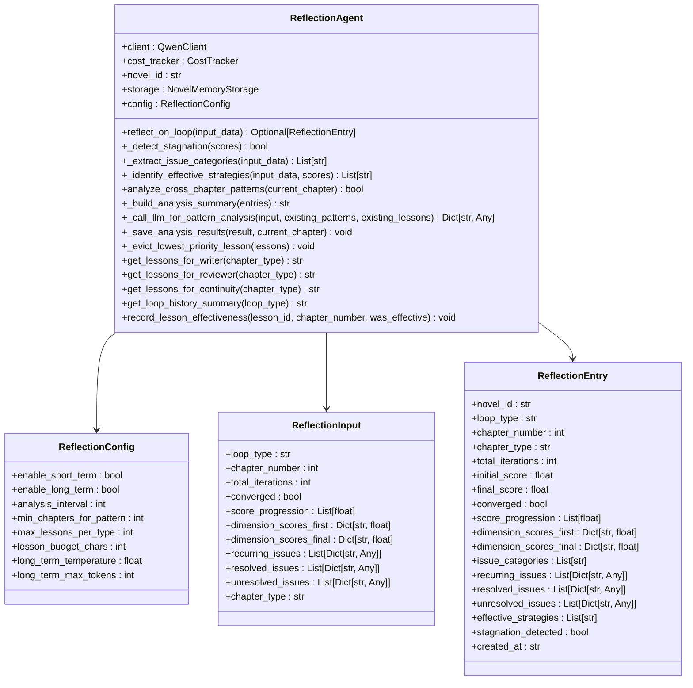
```mermaid
classDiagram
class ReflectionConfig {
+enable_short_term : bool
+enable_long_term : bool
+analysis_interval : int
+min_chapters_for_pattern : int
+max_lessons_per_type : int
+lesson_budget_chars : int
+long_term_temperature : float
+long_term_max_tokens : int
}
class ReflectionInput {
+loop_type : str
+chapter_number : int
+total_iterations : int
+converged : bool
+score_progression : List[float]
+dimension_scores_first : Dict[str, float]
+dimension_scores_final : Dict[str, float]
+recurring_issues : List[Dict[str, Any]]
+resolved_issues : List[Dict[str, Any]]
+unresolved_issues : List[Dict[str, Any]]
+chapter_type : str
}
class ReflectionEntry {
+novel_id : str
+loop_type : str
+chapter_number : int
+chapter_type : str
+total_iterations : int
+initial_score : float
+final_score : float
+converged : bool
+score_progression : List[float]
+dimension_scores_first : Dict[str, float]
+dimension_scores_final : Dict[str, float]
+issue_categories : List[str]
+recurring_issues : List[Dict[str, Any]]
+resolved_issues : List[Dict[str, Any]]
+unresolved_issues : List[Dict[str, Any]]
+effective_strategies : List[str]
+stagnation_detected : bool
+created_at : str
}
class ReflectionAgent {
+client : QwenClient
+cost_tracker : CostTracker
+novel_id : str
+storage : NovelMemoryStorage
+config : ReflectionConfig
+reflect_on_loop(input_data) Optional[ReflectionEntry]
+_detect_stagnation(scores) bool
+_extract_issue_categories(input_data) List[str]
+_identify_effective_strategies(input_data, scores) List[str]
+analyze_cross_chapter_patterns(current_chapter) bool
+_build_analysis_summary(entries) str
+_call_llm_for_pattern_analysis(input, existing_patterns, existing_lessons) Dict[str, Any]
+_save_analysis_results(result, current_chapter) void
+_evict_lowest_priority_lesson(lessons) void
+get_lessons_for_writer(chapter_type) str
+get_lessons_for_reviewer(chapter_type) str
+get_lessons_for_continuity(chapter_type) str
+get_loop_history_summary(loop_type) str
+record_lesson_effectiveness(lesson_id, chapter_number, was_effective) void
}
ReflectionAgent --> ReflectionConfig
ReflectionAgent --> ReflectionInput
ReflectionAgent --> ReflectionEntry
```

**图表来源**
- [agents/reflection_agent.py:29-841](file://agents/reflection_agent.py#L29-L841)

### 短期反思机制
短期反思在每次审查循环结束后即时执行，采用纯Python统计分析，零LLM开销：

- **停滞检测**：检测评分连续改善小于0.3分的停滞状态
- **问题分类统计**：从反复出现的问题中提取问题分类
- **有效策略识别**：分析维度分数变化，识别改善最大的方面
- **收敛速度评估**：评估快速收敛（≤2轮）的能力

**章节来源**
- [agents/reflection_agent.py:175-318](file://agents/reflection_agent.py#L175-L318)

### 长期反思机制
长期反思每N章触发一次（由配置决定），调用1次LLM进行跨章节模式分析：

- **历史数据分析**：聚合最近10章的反思记录，构建统计摘要
- **模式识别**：识别反复出现的问题模式（weakness/strength/trend）
- **经验规则生成**：生成简洁可操作的写作建议
- **智能淘汰**：淘汰效果最差的lesson，保持知识库质量

**章节来源**
- [agents/reflection_agent.py:323-680](file://agents/reflection_agent.py#L323-L680)

### AgentMesh记忆适配器
AgentMeshMemoryAdapter提供反思机制的持久化存储，包含三个核心表：

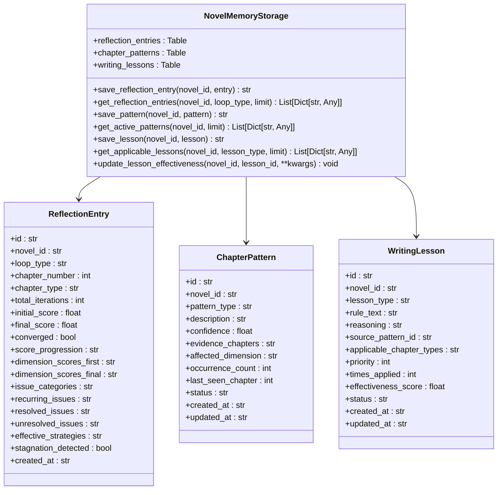
```mermaid
classDiagram
class NovelMemoryStorage {
+reflection_entries : Table
+chapter_patterns : Table
+writing_lessons : Table
+save_reflection_entry(novel_id, entry) str
+get_reflection_entries(novel_id, loop_type, limit) List[Dict[str, Any]]
+save_pattern(novel_id, pattern) str
+get_active_patterns(novel_id, limit) List[Dict[str, Any]]
+save_lesson(novel_id, lesson) str
+get_applicable_lessons(novel_id, lesson_type, limit) List[Dict[str, Any]]
+update_lesson_effectiveness(novel_id, lesson_id, **kwargs) void
}
class ReflectionEntry {
+id : str
+novel_id : str
+loop_type : str
+chapter_number : int
+chapter_type : str
+total_iterations : int
+initial_score : float
+final_score : float
+converged : bool
+score_progression : str
+dimension_scores_first : str
+dimension_scores_final : str
+issue_categories : str
+recurring_issues : str
+resolved_issues : str
+unresolved_issues : str
+effective_strategies : str
+stagnation_detected : bool
+created_at : str
}
class ChapterPattern {
+id : str
+novel_id : str
+pattern_type : str
+description : str
+confidence : float
+evidence_chapters : str
+affected_dimension : str
+occurrence_count : int
+last_seen_chapter : int
+status : str
+created_at : str
+updated_at : str
}
class WritingLesson {
+id : str
+novel_id : str
+lesson_type : str
+rule_text : str
+reasoning : str
+source_pattern_id : str
+applicable_chapter_types : str
+priority : int
+times_applied : int
+effectiveness_score : float
+status : str
+created_at : str
+updated_at : str
}
NovelMemoryStorage --> ReflectionEntry
NovelMemoryStorage --> ChapterPattern
NovelMemoryStorage --> WritingLesson
```

**图表来源**
- [backend/services/agentmesh_memory_adapter.py:20-1500](file://backend/services/agentmesh_memory_adapter.py#L20-L1500)

### 经验注入机制
反思机制通过经验注入将学习到的知识应用到后续的写作和审查过程中：

- **写作经验注入**：为Writer提供具体的写作建议
- **审查经验注入**：为Reviewer提供审查指导
- **连贯性检查注入**：为Continuity Checker提供检查要点
- **字符预算控制**：确保注入的建议不超过配置的字符限制

**章节来源**
- [agents/reflection_agent.py:685-753](file://agents/reflection_agent.py#L685-L753)

### 效果追踪与学习
系统提供完整的反思效果追踪机制：

- **效果记录**：记录lesson的实际应用效果
- **指数移动平均**：使用α=0.3的指数移动平均更新效果分数
- **自动淘汰**：连续3次应用且效果分数<0.3的lesson自动标记为deprecated
- **优先级管理**：按效果分数和优先级排序，淘汰低效规则

**章节来源**
- [agents/reflection_agent.py:783-841](file://agents/reflection_agent.py#L783-L841)

## 连贯性保障系统

### ContinuityIntegrationModule架构设计
ContinuityIntegrationModule将所有连贯性保障组件集成到一个统一的接口中，提供完整的连贯性检查流程。

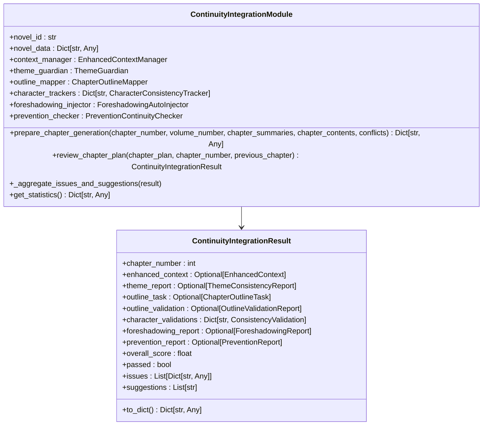
```mermaid
classDiagram
class ContinuityIntegrationResult {
+chapter_number : int
+enhanced_context : Optional[EnhancedContext]
+theme_report : Optional[ThemeConsistencyReport]
+outline_task : Optional[ChapterOutlineTask]
+outline_validation : Optional[OutlineValidationReport]
+character_validations : Dict[str, ConsistencyValidation]
+foreshadowing_report : Optional[ForeshadowingReport]
+prevention_report : Optional[PreventionReport]
+overall_score : float
+passed : bool
+issues : List[Dict[str, Any]]
+suggestions : List[str]
+to_dict() Dict[str, Any]
}
class ContinuityIntegrationModule {
+novel_id : str
+novel_data : Dict[str, Any]
+context_manager : EnhancedContextManager
+theme_guardian : ThemeGuardian
+outline_mapper : ChapterOutlineMapper
+character_trackers : Dict[str, CharacterConsistencyTracker]
+foreshadowing_injector : ForeshadowingAutoInjector
+prevention_checker : PreventionContinuityChecker
+prepare_chapter_generation(chapter_number, volume_number, chapter_summaries, chapter_contents, conflicts) Dict[str, Any]
+review_chapter_plan(chapter_plan, chapter_number, previous_chapter) ContinuityIntegrationResult
+_aggregate_issues_and_suggestions(result)
+get_statistics() Dict[str, Any]
}
ContinuityIntegrationModule --> ContinuityIntegrationResult
```

**图表来源**
- [agents/continuity_integration_module.py:30-483](file://agents/continuity_integration_module.py#L30-L483)

### 增强上下文管理器四层记忆架构
EnhancedContextManager采用四层记忆架构，确保关键信息不会丢失：

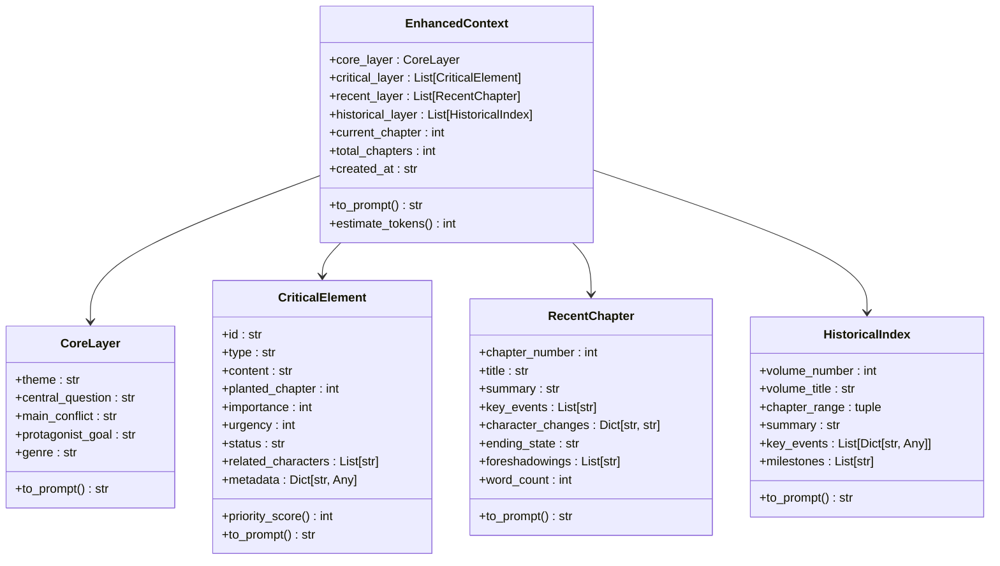
```mermaid
classDiagram
class CoreLayer {
+theme : str
+central_question : str
+main_conflict : str
+protagonist_goal : str
+genre : str
+to_prompt() str
}
class CriticalElement {
+id : str
+type : str
+content : str
+planted_chapter : int
+importance : int
+urgency : int
+status : str
+related_characters : List[str]
+metadata : Dict[str, Any]
+priority_score() int
+to_prompt() str
}
class RecentChapter {
+chapter_number : int
+title : str
+summary : str
+key_events : List[str]
+character_changes : Dict[str, str]
+ending_state : str
+foreshadowings : List[str]
+word_count : int
+to_prompt() str
}
class HistoricalIndex {
+volume_number : int
+volume_title : str
+chapter_range : tuple
+summary : str
+key_events : List[Dict[str, Any]]
+milestones : List[str]
+to_prompt() str
}
class EnhancedContext {
+core_layer : CoreLayer
+critical_layer : List[CriticalElement]
+recent_layer : List[RecentChapter]
+historical_layer : List[HistoricalIndex]
+current_chapter : int
+total_chapters : int
+created_at : str
+to_prompt() str
+estimate_tokens() int
}
EnhancedContext --> CoreLayer
EnhancedContext --> CriticalElement
EnhancedContext --> RecentChapter
EnhancedContext --> HistoricalIndex
```

**图表来源**
- [agents/enhanced_context_manager.py:20-536](file://agents/enhanced_context_manager.py#L20-L536)

### 主题守护者主题一致性检查
ThemeGuardian负责定义小说核心主题并审查内容一致性，提供四个维度的评估：

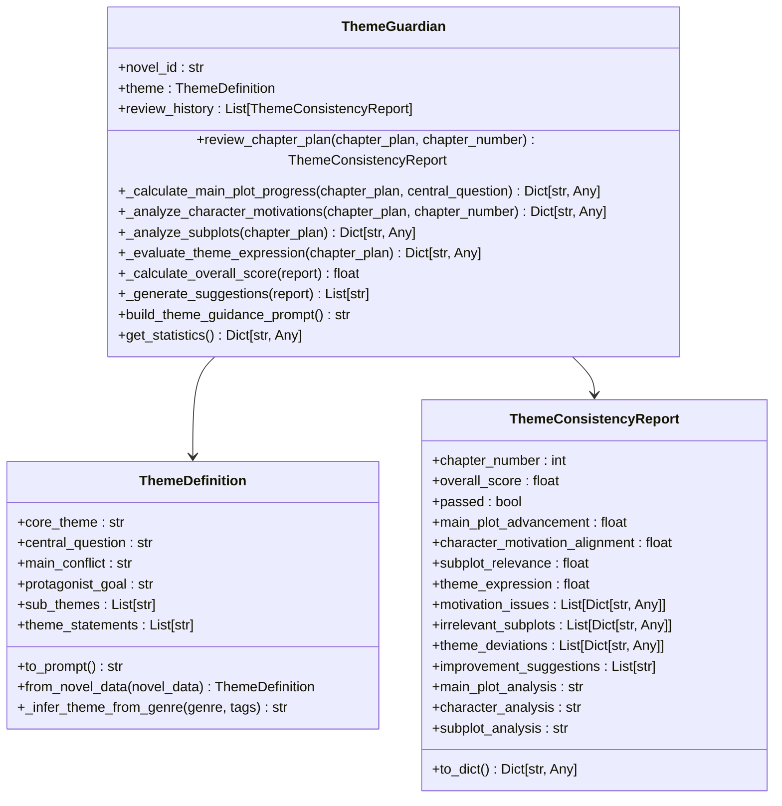
```mermaid
classDiagram
class ThemeDefinition {
+core_theme : str
+central_question : str
+main_conflict : str
+protagonist_goal : str
+sub_themes : List[str]
+theme_statements : List[str]
+to_prompt() str
+from_novel_data(novel_data) ThemeDefinition
+_infer_theme_from_genre(genre, tags) str
}
class ThemeConsistencyReport {
+chapter_number : int
+overall_score : float
+passed : bool
+main_plot_advancement : float
+character_motivation_alignment : float
+subplot_relevance : float
+theme_expression : float
+motivation_issues : List[Dict[str, Any]]
+irrelevant_subplots : List[Dict[str, Any]]
+theme_deviations : List[Dict[str, Any]]
+improvement_suggestions : List[str]
+main_plot_analysis : str
+character_analysis : str
+subplot_analysis : str
+to_dict() Dict[str, Any]
}
class ThemeGuardian {
+novel_id : str
+theme : ThemeDefinition
+review_history : List[ThemeConsistencyReport]
+review_chapter_plan(chapter_plan, chapter_number) ThemeConsistencyReport
+_calculate_main_plot_progress(chapter_plan, central_question) Dict[str, Any]
+_analyze_character_motivations(chapter_plan, chapter_number) Dict[str, Any]
+_analyze_subplots(chapter_plan) Dict[str, Any]
+_evaluate_theme_expression(chapter_plan) Dict[str, Any]
+_calculate_overall_score(report) float
+_generate_suggestions(report) List[str]
+build_theme_guidance_prompt() str
+get_statistics() Dict[str, Any]
}
ThemeGuardian --> ThemeDefinition
ThemeGuardian --> ThemeConsistencyReport
```

**图表来源**
- [agents/theme_guardian.py:19-625](file://agents/theme_guardian.py#L19-L625)

**章节来源**
- [agents/continuity_integration_module.py:74-483](file://agents/continuity_integration_module.py#L74-L483)
- [agents/enhanced_context_manager.py:196-536](file://agents/enhanced_context_manager.py#L196-L536)
- [agents/theme_guardian.py:159-625](file://agents/theme_guardian.py#L159-L625)

## 约束推断引擎

### ConstraintInferenceEngine架构设计
ConstraintInferenceEngine从上一章内容中自动推断读者期待和连贯性约束，完全基于 LLM 自适应推断。

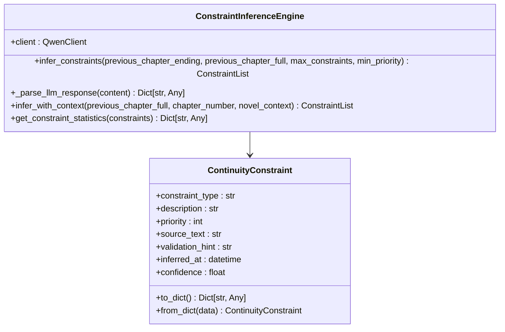
```mermaid
classDiagram
class ConstraintInferenceEngine {
+client : QwenClient
+infer_constraints(previous_chapter_ending, previous_chapter_full, max_constraints, min_priority) ConstraintList
+_parse_llm_response(content) Dict[str, Any]
+infer_with_context(previous_chapter_full, chapter_number, novel_context) ConstraintList
+get_constraint_statistics(constraints) Dict[str, Any]
}
class ContinuityConstraint {
+constraint_type : str
+description : str
+priority : int
+source_text : str
+validation_hint : str
+inferred_at : datetime
+confidence : float
+to_dict() Dict[str, Any]
+from_dict(data) ContinuityConstraint
}
ConstraintInferenceEngine --> ContinuityConstraint
```

**图表来源**
- [agents/continuity_inference.py:16-270](file://agents/continuity_inference.py#L16-L270)
- [agents/continuity_models.py:11-72](file://agents/continuity_models.py#L11-L72)

### 约束推断流程
系统采用多策略解析 LLM 响应，确保约束推断的稳定性：
- 直接解析 JSON 格式的响应
- 提取代码块中的 JSON 内容
- 提取花括号内的 JSON 结构
- 提供默认解析策略，确保流程不会因解析失败而中断

**章节来源**
- [agents/continuity_inference.py:72-144](file://agents/continuity_inference.py#L72-L144)
- [agents/continuity_inference.py:146-190](file://agents/continuity_inference.py#L146-L190)

## 验证引擎

### ValidationEngine架构设计
ValidationEngine使用 LLM 验证新章节是否满足连贯性约束，区分"连贯性问题"和"艺术性打破期待"。

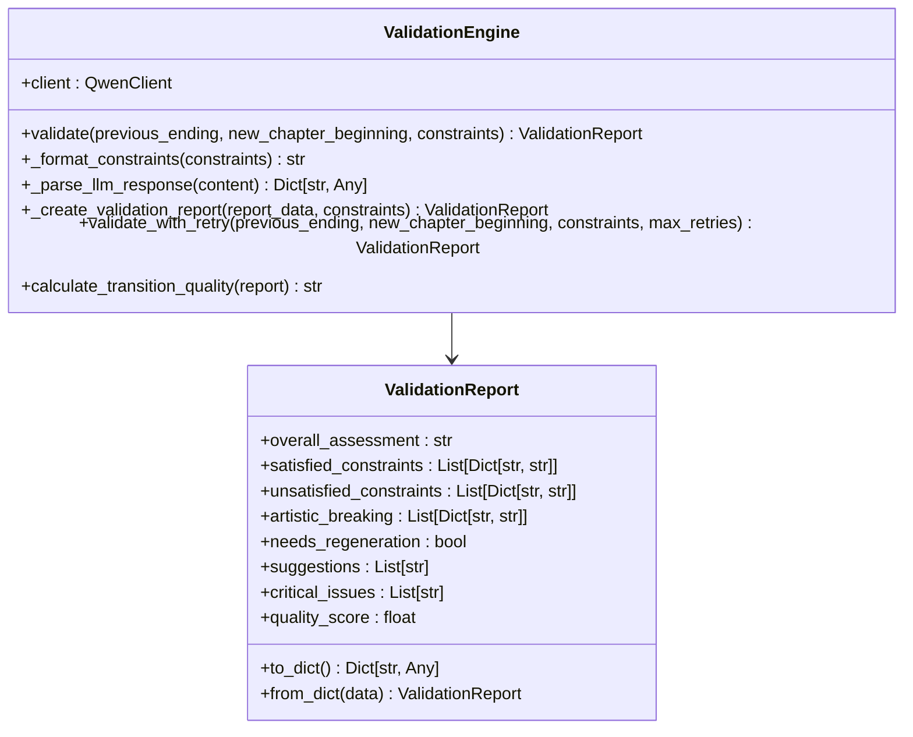
```mermaid
classDiagram
class ValidationEngine {
+client : QwenClient
+validate(previous_ending, new_chapter_beginning, constraints) ValidationReport
+_format_constraints(constraints) str
+_parse_llm_response(content) Dict[str, Any]
+_create_validation_report(report_data, constraints) ValidationReport
+validate_with_retry(previous_ending, new_chapter_beginning, constraints, max_retries) ValidationReport
+calculate_transition_quality(report) str
}
class ValidationReport {
+overall_assessment : str
+satisfied_constraints : List[Dict[str, str]]
+unsatisfied_constraints : List[Dict[str, str]]
+artistic_breaking : List[Dict[str, str]]
+needs_regeneration : bool
+suggestions : List[str]
+critical_issues : List[str]
+quality_score : float
+to_dict() Dict[str, Any]
+from_dict(data) ValidationReport
}
ValidationEngine --> ValidationReport
```

**图表来源**
- [agents/continuity_validation.py:16-363](file://agents/continuity_validation.py#L16-L363)
- [agents/continuity_models.py:74-134](file://agents/continuity_models.py#L74-L134)

### 验证流程与质量评估
系统提供三种质量等级评估：
- 优秀：质量评分 ≥ 90
- 良好：质量评分 80-89
- 合格：质量评分 70-79
- 需改进：质量评分 60-69
- 差：质量评分 < 60

**章节来源**
- [agents/continuity_validation.py:275-314](file://agents/continuity_validation.py#L275-L314)
- [agents/continuity_validation.py:315-340](file://agents/continuity_validation.py#L315-L340)

## 数据模型

### ContinuityModels数据结构
ContinuityModels定义了连贯性保障系统的核心数据结构，包括约束、验证报告和章节过渡记录。

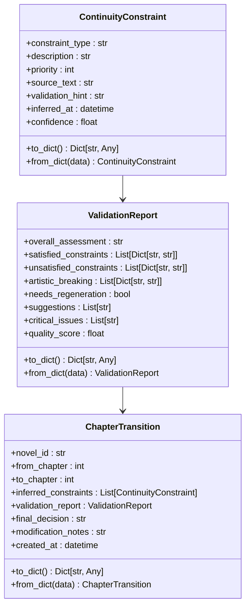
```mermaid
classDiagram
class ContinuityConstraint {
+constraint_type : str
+description : str
+priority : int
+source_text : str
+validation_hint : str
+inferred_at : datetime
+confidence : float
+to_dict() Dict[str, Any]
+from_dict(data) ContinuityConstraint
}
class ValidationReport {
+overall_assessment : str
+satisfied_constraints : List[Dict[str, str]]
+unsatisfied_constraints : List[Dict[str, str]]
+artistic_breaking : List[Dict[str, str]]
+needs_regeneration : bool
+suggestions : List[str]
+critical_issues : List[str]
+quality_score : float
+to_dict() Dict[str, Any]
+from_dict(data) ValidationReport
}
class ChapterTransition {
+novel_id : str
+from_chapter : int
+to_chapter : int
+inferred_constraints : List[ContinuityConstraint]
+validation_report : ValidationReport
+final_decision : str
+modification_notes : str
+created_at : datetime
+to_dict() Dict[str, Any]
+from_dict(data) ChapterTransition
}
ContinuityConstraint --> ValidationReport
ValidationReport --> ChapterTransition
```

**图表来源**
- [agents/continuity_models.py:11-201](file://agents/continuity_models.py#L11-L201)

### PlotOutline模型增强
PlotOutline模型新增了动态更新相关字段，支持大纲版本管理和更新历史追踪：

- **version**：大纲版本号，每次动态更新自动+1
- **update_history**：动态更新历史记录，包含更新时间、触发章节、偏差分数、变更摘要等信息

**章节来源**
- [core/models/plot_outline.py:95-114](file://core/models/plot_outline.py#L95-L114)

### AgentActivity数据模型
AgentActivity数据模型记录Agent执行过程中的详细活动信息：

- **novel_id**：小说ID
- **task_id**：任务ID
- **agent_name**：Agent名称
- **activity_type**：活动类型
- **input_data**：输入数据
- **output_data**：输出数据
- **raw_output**：原始输出
- **agent_role**：Agent角色
- **phase**：执行阶段
- **step_number**：步骤编号
- **iteration_number**：迭代次数
- **metadata**：元数据
- **prompt_tokens**：提示词Token数
- **completion_tokens**：完成Token数
- **total_tokens**：总Token数
- **cost**：成本
- **status**：状态
- **error_message**：错误信息
- **retry_count**：重试次数

**章节来源**
- [backend/services/agent_activity_recorder.py:30-51](file://backend/services/agent_activity_recorder.py#L30-L51)

## 多阶段质量评估系统

### ReviewLoopBase架构设计
ReviewLoopBase采用模板方法模式，将共同的迭代控制逻辑封装在基类中，子类只需实现特定领域的抽象方法。系统支持多种质量评估场景，包括章节审查、世界观设计、角色评估等。

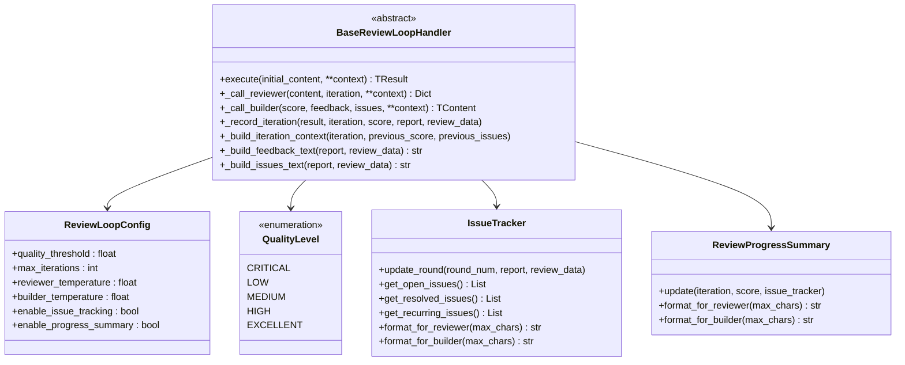
```mermaid
classDiagram
class BaseReviewLoopHandler {
<<abstract>>
+execute(initial_content, **context) TResult
+_call_reviewer(content, iteration, **context) Dict
+_call_builder(score, feedback, issues, **context) TContent
+_record_iteration(result, iteration, score, report, review_data)
+_build_iteration_context(iteration, previous_score, previous_issues)
+_build_feedback_text(report, review_data) str
+_build_issues_text(report, review_data) str
}
class ReviewLoopConfig {
+quality_threshold : float
+max_iterations : int
+reviewer_temperature : float
+builder_temperature : float
+enable_issue_tracking : bool
+enable_progress_summary : bool
}
class QualityLevel {
<<enumeration>>
CRITICAL
LOW
MEDIUM
HIGH
EXCELLENT
}
class IssueTracker {
+update_round(round_num, report, review_data)
+get_open_issues() List
+get_resolved_issues() List
+get_recurring_issues() List
+format_for_reviewer(max_chars) str
+format_for_builder(max_chars) str
}
class ReviewProgressSummary {
+update(iteration, score, issue_tracker)
+format_for_reviewer(max_chars) str
+format_for_builder(max_chars) str
}
BaseReviewLoopHandler --> ReviewLoopConfig
BaseReviewLoopHandler --> QualityLevel
BaseReviewLoopHandler --> IssueTracker
BaseReviewLoopHandler --> ReviewProgressSummary
```

**图表来源**
- [agents/base/review_loop_base.py:598-800](file://agents/base/review_loop_base.py#L598-L800)
- [agents/base/review_loop_base.py:178-490](file://agents/base/review_loop_base.py#L178-L490)
- [agents/base/review_loop_base.py:492-596](file://agents/base/review_loop_base.py#L492-L596)

### 质量级别分类与评估策略
系统提供五个质量级别，每个级别对应不同的修订策略和反馈指导：
- CRITICAL（< 5.0）：严重不合格，需要结构性重写
- LOW（5.0 - 6.0）：质量偏低，需要大幅修订
- MEDIUM（6.0 - 7.0）：基本合格，需要针对性修改
- HIGH（7.0 - 8.0）：质量良好，需要细节优化
- EXCELLENT（>= 8.0）：质量优秀，仅需微调润色

**章节来源**
- [agents/base/review_loop_base.py:79-161](file://agents/base/review_loop_base.py#L79-L161)

### 问题追踪与进度管理
IssueTracker提供跨轮次问题追踪功能，使用字符bigram Jaccard相似度进行问题匹配，追踪每个问题在多轮审查中的生命周期。ReviewProgressSummary提供审查进度摘要，包括评分趋势和各轮概况。

**章节来源**
- [agents/base/review_loop_base.py:178-596](file://agents/base/review_loop_base.py#L178-L596)

## 团队协作机制

### TeamContext设计与实现
TeamContext借鉴AgentMesh的TeamContext设计，实现Agent之间的信息共享和状态追踪。系统提供线程安全的数据结构，支持异步操作和同步操作。

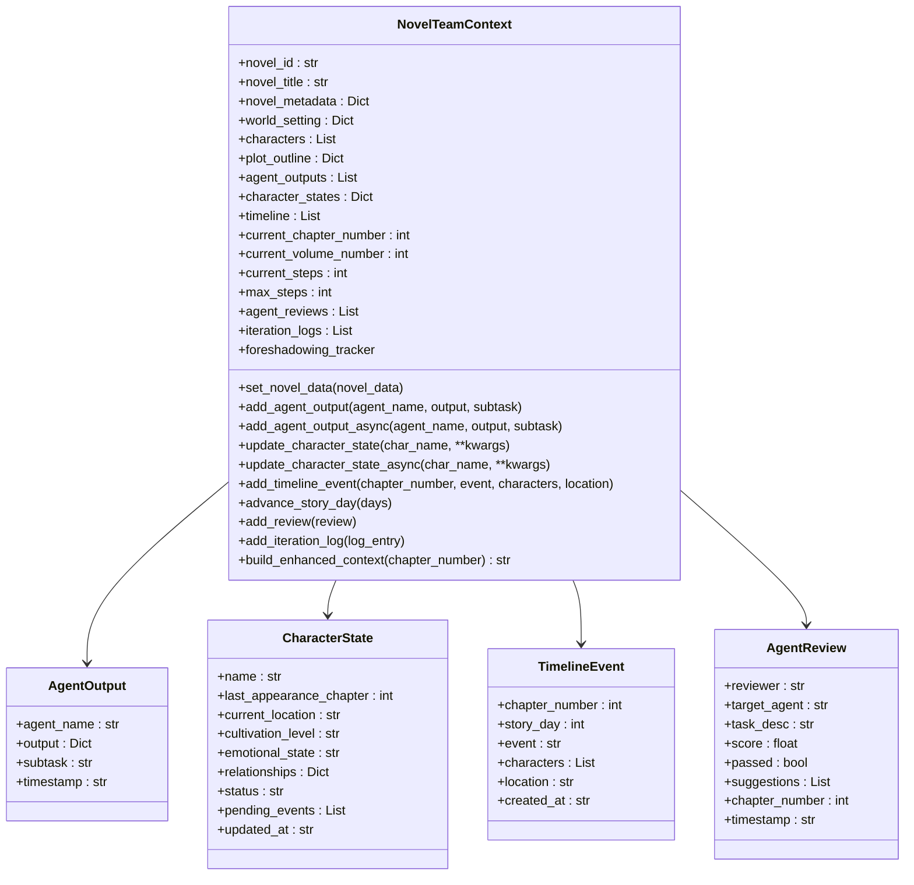
```mermaid
classDiagram
class NovelTeamContext {
+novel_id : str
+novel_title : str
+novel_metadata : Dict
+world_setting : Dict
+characters : List
+plot_outline : Dict
+agent_outputs : List
+character_states : Dict
+timeline : List
+current_chapter_number : int
+current_volume_number : int
+current_steps : int
+max_steps : int
+agent_reviews : List
+iteration_logs : List
+foreshadowing_tracker
+set_novel_data(novel_data)
+add_agent_output(agent_name, output, subtask)
+add_agent_output_async(agent_name, output, subtask)
+update_character_state(char_name, **kwargs)
+update_character_state_async(char_name, **kwargs)
+add_timeline_event(chapter_number, event, characters, location)
+advance_story_day(days)
+add_review(review)
+add_iteration_log(log_entry)
+build_enhanced_context(chapter_number) str
}
class AgentOutput {
+agent_name : str
+output : Dict
+subtask : str
+timestamp : str
}
class CharacterState {
+name : str
+last_appearance_chapter : int
+current_location : str
+cultivation_level : str
+emotional_state : str
+relationships : Dict
+status : str
+pending_events : List
+updated_at : str
}
class TimelineEvent {
+chapter_number : int
+story_day : int
+event : str
+characters : List
+location : str
+created_at : str
}
class AgentReview {
+reviewer : str
+target_agent : str
+task_desc : str
+score : float
+passed : bool
+suggestions : List
+chapter_number : int
+timestamp : str
}
NovelTeamContext --> AgentOutput
NovelTeamContext --> CharacterState
NovelTeamContext --> TimelineEvent
NovelTeamContext --> AgentReview
```

**图表来源**
- [agents/team_context.py:162-591](file://agents/team_context.py#L162-L591)
- [agents/team_context.py:21-160](file://agents/team_context.py#L21-L160)

### 上下文共享与状态追踪
TeamContext提供多种上下文共享机制：
- Agent输出历史：记录所有Agent的输出，支持异步和同步两种模式
- 角色状态管理：追踪角色的当前位置、修为、情感状态等
- 时间线追踪：记录故事进展和关键事件
- 审查反馈记录：记录每次Agent审查的详细信息
- 迭代日志：记录Writer-Editor等循环的每轮信息

**章节来源**
- [agents/team_context.py:162-591](file://agents/team_context.py#L162-L591)

## 章节大纲映射功能

### ChapterOutlineMapper架构设计
ChapterOutlineMapper将卷级大纲分解为章节级任务，为每章分配"必须完成的大纲事件"并追踪大纲完成进度。系统支持张力循环分析和智能伏笔分配。

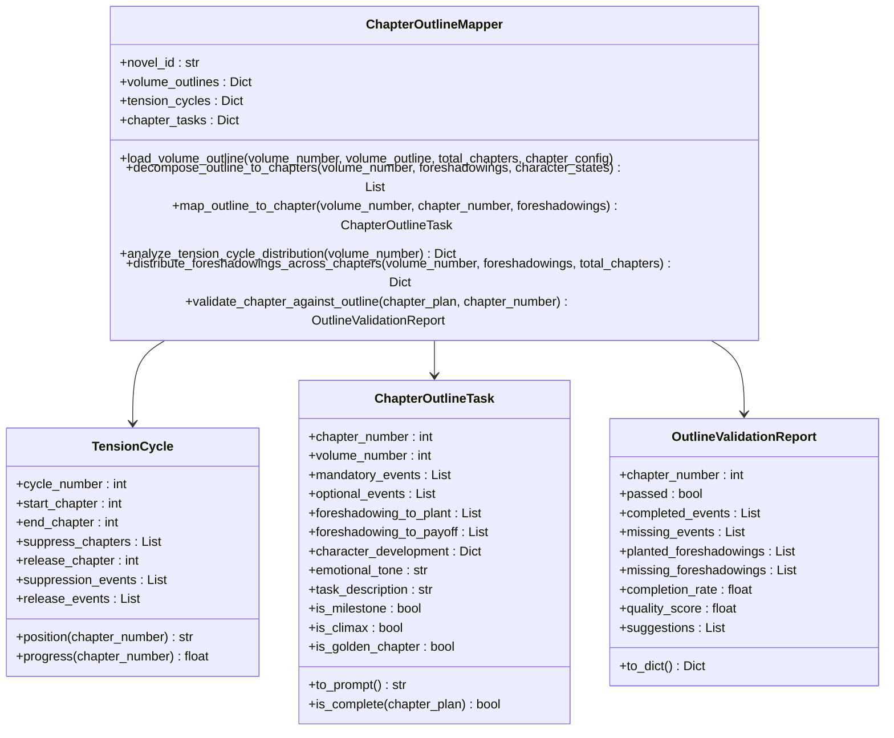
```mermaid
classDiagram
class ChapterOutlineMapper {
+novel_id : str
+volume_outlines : Dict
+tension_cycles : Dict
+chapter_tasks : Dict
+load_volume_outline(volume_number, volume_outline, total_chapters, chapter_config)
+decompose_outline_to_chapters(volume_number, foreshadowings, character_states) List
+map_outline_to_chapter(volume_number, chapter_number, foreshadowings) ChapterOutlineTask
+analyze_tension_cycle_distribution(volume_number) Dict
+distribute_foreshadowings_across_chapters(volume_number, foreshadowings, total_chapters) Dict
+validate_chapter_against_outline(chapter_plan, chapter_number) OutlineValidationReport
}
class TensionCycle {
+cycle_number : int
+start_chapter : int
+end_chapter : int
+suppress_chapters : List
+release_chapter : int
+suppression_events : List
+release_events : List
+position(chapter_number) str
+progress(chapter_number) float
}
class ChapterOutlineTask {
+chapter_number : int
+volume_number : int
+mandatory_events : List
+optional_events : List
+foreshadowing_to_plant : List
+foreshadowing_to_payoff : List
+character_development : Dict
+emotional_tone : str
+task_description : str
+is_milestone : bool
+is_climax : bool
+is_golden_chapter : bool
+to_prompt() str
+is_complete(chapter_plan) bool
}
class OutlineValidationReport {
+chapter_number : int
+passed : bool
+completed_events : List
+missing_events : List
+planted_foreshadowings : List
+missing_foreshadowings : List
+completion_rate : float
+quality_score : float
+suggestions : List
+to_dict() Dict
}
ChapterOutlineMapper --> TensionCycle
ChapterOutlineMapper --> ChapterOutlineTask
ChapterOutlineMapper --> OutlineValidationReport
```

**图表来源**
- [agents/chapter_outline_mapper.py:187-800](file://agents/chapter_outline_mapper.py#L187-L800)
- [agents/chapter_outline_mapper.py:19-143](file://agents/chapter_outline_mapper.py#L19-L143)
- [agents/chapter_outline_mapper.py:145-186](file://agents/chapter_outline_mapper.py#L145-L186)

### 张力循环分析与智能分配
系统支持张力循环分析，包括：
- 自动解析卷大纲中的张力循环
- 智能分配章节任务到合适的张力周期
- 伏笔的智能埋设和回收提醒
- 基于章节类型的动态迭代策略

**章节来源**
- [agents/chapter_outline_mapper.py:331-461](file://agents/chapter_outline_mapper.py#L331-L461)

### 章节验证与进度追踪
OutlineValidationReport提供章节完成度验证功能：
- 检查强制性事件的完成情况
- 验证伏笔的埋设和回收
- 计算完成率和质量评分
- 生成改进建议和通过判定

**章节来源**
- [agents/chapter_outline_mapper.py:898-977](file://agents/chapter_outline_mapper.py#L898-L977)

## 大纲迭代优化系统

### OutlineIterationController架构设计
OutlineIterationController专门负责大纲级别的迭代优化，提供质量评分和一致性评分的双重阈值控制，支持成本限制和迭代历史记录。

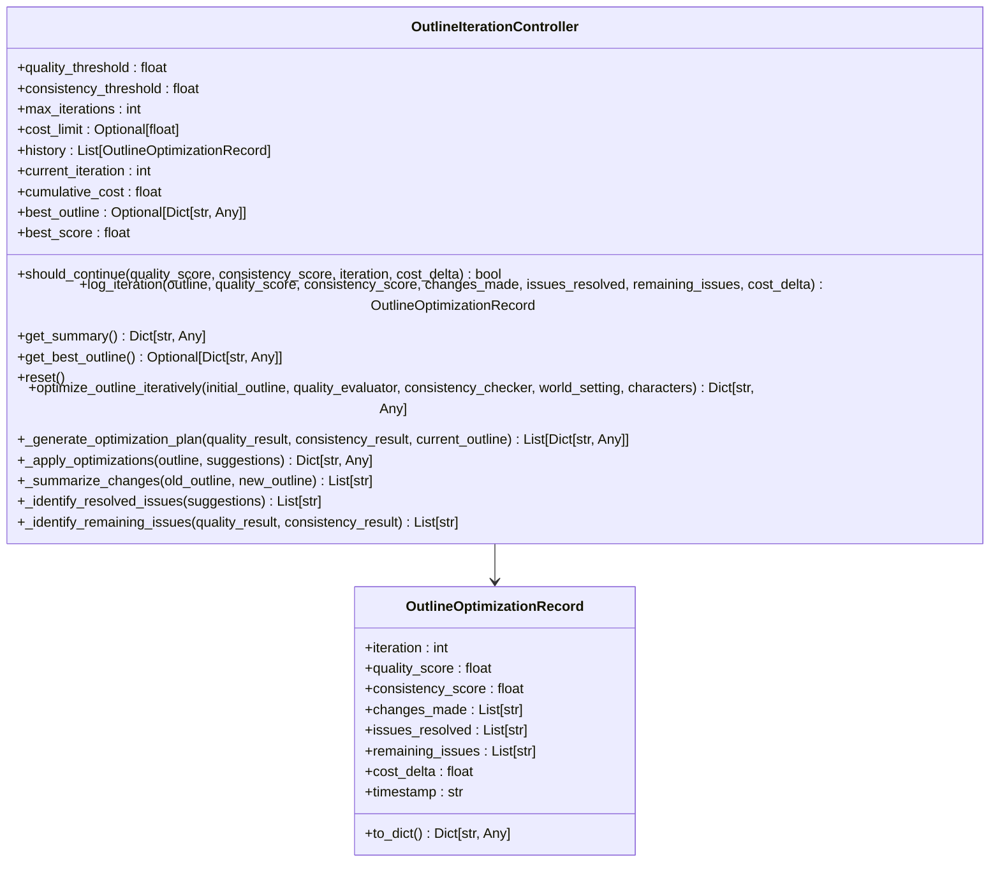
```mermaid
classDiagram
class OutlineOptimizationRecord {
+iteration : int
+quality_score : float
+consistency_score : float
+changes_made : List[str]
+issues_resolved : List[str]
+remaining_issues : List[str]
+cost_delta : float
+timestamp : str
+to_dict() Dict[str, Any]
}
class OutlineIterationController {
+quality_threshold : float
+consistency_threshold : float
+max_iterations : int
+cost_limit : Optional[float]
+history : List[OutlineOptimizationRecord]
+current_iteration : int
+cumulative_cost : float
+best_outline : Optional[Dict[str, Any]]
+best_score : float
+should_continue(quality_score, consistency_score, iteration, cost_delta) bool
+log_iteration(outline, quality_score, consistency_score, changes_made, issues_resolved, remaining_issues, cost_delta) OutlineOptimizationRecord
+get_summary() Dict[str, Any]
+get_best_outline() Optional[Dict[str, Any]]
+reset()
+optimize_outline_iteratively(initial_outline, quality_evaluator, consistency_checker, world_setting, characters) Dict[str, Any]
+_generate_optimization_plan(quality_result, consistency_result, current_outline) List[Dict[str, Any]]
+_apply_optimizations(outline, suggestions) Dict[str, Any]
+_summarize_changes(old_outline, new_outline) List[str]
+_identify_resolved_issues(suggestions) List[str]
+_identify_remaining_issues(quality_result, consistency_result) List[str]
}
OutlineIterationController --> OutlineOptimizationRecord
```

**图表来源**
- [agents/outline_iteration_controller.py:10-404](file://agents/outline_iteration_controller.py#L10-L404)

### OutlineQualityEvaluator扩展评估维度
OutlineQualityEvaluator扩展了传统的质量评估维度，提供更全面的大纲质量分析：

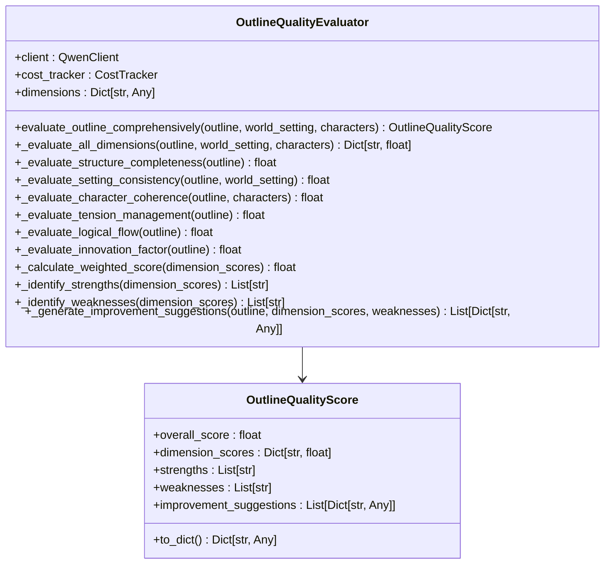
```mermaid
classDiagram
class OutlineQualityScore {
+overall_score : float
+dimension_scores : Dict[str, float]
+strengths : List[str]
+weaknesses : List[str]
+improvement_suggestions : List[Dict[str, Any]]
+to_dict() Dict[str, Any]
}
class OutlineQualityEvaluator {
+client : QwenClient
+cost_tracker : CostTracker
+dimensions : Dict[str, Any]
+evaluate_outline_comprehensively(outline, world_setting, characters) OutlineQualityScore
+_evaluate_all_dimensions(outline, world_setting, characters) Dict[str, float]
+_evaluate_structure_completeness(outline) float
+_evaluate_setting_consistency(outline, world_setting) float
+_evaluate_character_coherence(outline, characters) float
+_evaluate_tension_management(outline) float
+_evaluate_logical_flow(outline) float
+_evaluate_innovation_factor(outline) float
+_calculate_weighted_score(dimension_scores) float
+_identify_strengths(dimension_scores) List[str]
+_identify_weaknesses(dimension_scores) List[str]
+_generate_improvement_suggestions(outline, dimension_scores, weaknesses) List[Dict[str, Any]]
}
OutlineQualityEvaluator --> OutlineQualityScore
```

**图表来源**
- [agents/outline_quality_evaluator.py:75-440](file://agents/outline_quality_evaluator.py#L75-L440)

### 大纲优化策略与实现
系统提供六个扩展的评估维度：
- 结构完整性：检查三幕结构、转折点分布、结局完整性和卷级结构
- 世界观一致性：评估力量体系使用、地理环境描述、势力关系和历史文化背景
- 角色连贯性：分析角色动机、成长轨迹、关系变化和主要角色戏份
- 张力节奏控制：评估冲突层次、高潮安排、节奏变化和张力循环
- 逻辑连贯性：检查因果关系、时间线合理性和事件衔接
- 创意新颖性：评估独特设定、情节设计新意、角色塑造立体性和主题深度

**章节来源**
- [agents/outline_iteration_controller.py:39-404](file://agents/outline_iteration_controller.py#L39-L404)
- [agents/outline_quality_evaluator.py:11-73](file://agents/outline_quality_evaluator.py#L11-L73)

## 依赖关系分析
- 组件耦合：
  - SpecificAgents依赖AgentCommunicator与QwenClient/CostTracker/PromptManager。
  - ReflectionAgent依赖QwenClient、CostTracker和AgentMeshMemoryAdapter。
  - CrewManager依赖ReflectionAgent进行反思机制集成。
  - OutlineDynamicUpdater依赖QwenClient、CostTracker和PromptManager。
  - CharacterAutoDetector依赖QwenClient、CostTracker和PromptManager。
  - ContinuityIntegrationModule依赖EnhancedContextManager、ThemeGuardian、ChapterOutlineMapper、CharacterConsistencyTracker、ForeshadowingAutoInjector、PreventionContinuityChecker。
  - ConstraintInferenceEngine和ValidationEngine依赖ContinuityModels。
  - ReviewLoopBase依赖QualityReport、ReviewResult、IssueTracker等基础组件。
  - TeamContext提供跨Agent的状态共享和协作机制。
  - ChapterOutlineMapper依赖TeamContext进行上下文构建。
  - OutlineIterationController和OutlineQualityEvaluator提供大纲级别的质量控制。
  - GenerationService集成所有功能到统一的生成流程。
  - OutlineService提供大纲管理服务。
  - AgentActivityRecorder提供Agent活动的详细记录和监控。
  - AgentMeshMemoryAdapter提供反思机制的持久化存储。
- 外部依赖：
  - DashScope/OpenAI SDK用于大模型推理。
  - Settings提供配置注入，LoggingConfig提供统一日志。
- 潜在风险：
  - 并发环境下消息队列与任务状态更新需保持原子性，已在关键路径加锁。
  - 连贯性保障过程中的约束推断和验证需要合理配置阈值。
  - 大纲优化过程中的成本控制和迭代终止机制需要合理配置阈值。
  - 动态更新和角色检测的LLM调用需要合理的重试和降级策略。
  - 反思机制的存储操作需要考虑SQLite并发访问的线程安全性。
  - Agent活动记录的数据库操作需要考虑事务的一致性。

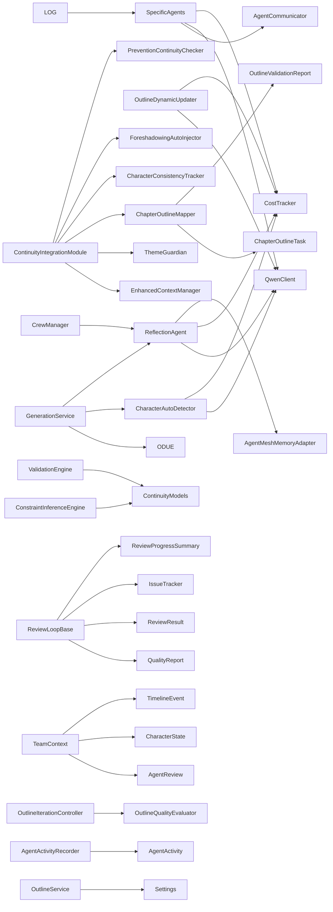
```mermaid
graph LR
SA["SpecificAgents"] --> AC["AgentCommunicator"]
SA --> QC["QwenClient"]
SA --> CT["CostTracker"]
RA["ReflectionAgent"] --> QC
RA --> CT
RA --> AMMA["AgentMeshMemoryAdapter"]
CM["CrewManager"] --> RA
ODU["OutlineDynamicUpdater"] --> QC
ODU --> CT
CAD["CharacterAutoDetector"] --> QC
CAD --> CT
CIM["ContinuityIntegrationModule"] --> ECM["EnhancedContextManager"]
CIM --> TG["ThemeGuardian"]
CIM --> COM["ChapterOutlineMapper"]
CIM --> CCT["CharacterConsistencyTracker"]
CIM --> FAI["ForeshadowingAutoInjector"]
CIM --> PCC["PreventionContinuityChecker"]
CIE["ConstraintInferenceEngine"] --> CM2["ContinuityModels"]
VE["ValidationEngine"] --> CM2
RLB["ReviewLoopBase"] --> QR["QualityReport"]
RLB --> RR["ReviewResult"]
RLB --> IE["IssueTracker"]
RLB --> RS["ReviewProgressSummary"]
TC["TeamContext"] --> AR["AgentReview"]
TC --> CS["CharacterState"]
TC --> TL["TimelineEvent"]
COM --> COT["ChapterOutlineTask"]
COM --> OVR["OutlineValidationReport"]
OIC["OutlineIterationController"] --> OQE["OutlineQualityEvaluator"]
GS["GenerationService"] --> ODUE
GS --> CAD
GS --> RA
AAR["AgentActivityRecorder"] --> AA["AgentActivity"]
OS["OutlineService"] --> CFG["Settings"]
LOG --> SA
```

**图表来源**
- [agents/specific_agents.py:15-505](file://agents/specific_agents.py#L15-L505)
- [agents/reflection_agent.py:147-841](file://agents/reflection_agent.py#L147-L841)
- [agents/crew_manager.py:1680-1757](file://agents/crew_manager.py#L1680-L1757)
- [agents/outline_dynamic_updater.py:62-745](file://agents/outline_dynamic_updater.py#L62-L745)
- [backend/services/character_auto_detector.py:24-422](file://backend/services/character_auto_detector.py#L24-L422)
- [agents/continuity_integration_module.py:74-483](file://agents/continuity_integration_module.py#L74-L483)
- [agents/continuity_inference.py:16-270](file://agents/continuity_inference.py#L16-L270)
- [agents/continuity_validation.py:16-363](file://agents/continuity_validation.py#L16-L363)
- [agents/continuity_models.py:11-201](file://agents/continuity_models.py#L11-L201)
- [agents/base/review_loop_base.py:598-800](file://agents/base/review_loop_base.py#L598-L800)
- [agents/team_context.py:162-591](file://agents/team_context.py#L162-L591)
- [agents/chapter_outline_mapper.py:187-800](file://agents/chapter_outline_mapper.py#L187-L800)
- [agents/outline_iteration_controller.py:39-404](file://agents/outline_iteration_controller.py#L39-L404)
- [agents/outline_quality_evaluator.py:93-440](file://agents/outline_quality_evaluator.py#L93-L440)
- [backend/services/generation_service.py:1227-1332](file://backend/services/generation_service.py#L1227-L1332)
- [backend/services/outline_service.py:28-932](file://backend/services/outline_service.py#L28-L932)
- [backend/services/agentmesh_memory_adapter.py:20-1500](file://backend/services/agentmesh_memory_adapter.py#L20-L1500)
- [backend/services/agent_activity_recorder.py:14-315](file://backend/services/agent_activity_recorder.py#L14-L315)
- [agents/agent_communicator.py:72-180](file://agents/agent_communicator.py#L72-L180)
- [llm/qwen_client.py:16-232](file://llm/qwen_client.py#L16-L232)
- [llm/cost_tracker.py:16-74](file://llm/cost_tracker.py#L16-L74)
- [backend/config.py:5-156](file://backend/config.py#L5-L156)
- [core/logging_config.py:20-55](file://core/logging_config.py#L20-L55)

**章节来源**
- [agents/specific_agents.py:1-505](file://agents/specific_agents.py#L1-L505)
- [agents/reflection_agent.py:1-841](file://agents/reflection_agent.py#L1-L841)
- [agents/crew_manager.py:1-1757](file://agents/crew_manager.py#L1-L1757)
- [agents/outline_dynamic_updater.py:1-745](file://agents/outline_dynamic_updater.py#L1-L745)
- [backend/services/character_auto_detector.py:1-422](file://backend/services/character_auto_detector.py#L1-L422)
- [agents/continuity_integration_module.py:1-483](file://agents/continuity_integration_module.py#L1-L483)
- [agents/continuity_inference.py:1-270](file://agents/continuity_inference.py#L1-L270)
- [agents/continuity_validation.py:1-363](file://agents/continuity_validation.py#L1-L363)
- [agents/continuity_models.py:1-201](file://agents/continuity_models.py#L1-L201)
- [agents/base/review_loop_base.py:1-800](file://agents/base/review_loop_base.py#L1-L800)
- [agents/team_context.py:1-591](file://agents/team_context.py#L1-L591)
- [agents/chapter_outline_mapper.py:1-1109](file://agents/chapter_outline_mapper.py#L1-L1109)
- [agents/outline_iteration_controller.py:1-404](file://agents/outline_iteration_controller.py#L1-L404)
- [agents/outline_quality_evaluator.py:1-440](file://agents/outline_quality_evaluator.py#L1-L440)
- [backend/services/generation_service.py:1-1707](file://backend/services/generation_service.py#L1-L1707)
- [backend/services/outline_service.py:1-932](file://backend/services/outline_service.py#L1-L932)
- [backend/services/agentmesh_memory_adapter.py:1-1500](file://backend/services/agentmesh_memory_adapter.py#L1-L1500)
- [backend/services/agent_activity_recorder.py:1-315](file://backend/services/agent_activity_recorder.py#L1-L315)
- [agents/agent_communicator.py:1-180](file://agents/agent_communicator.py#L1-L180)
- [llm/qwen_client.py:1-232](file://llm/qwen_client.py#L1-L232)
- [llm/cost_tracker.py:1-74](file://llm/cost_tracker.py#L1-L74)
- [backend/config.py:1-156](file://backend/config.py#L1-L156)
- [core/logging_config.py:1-55](file://core/logging_config.py#L1-L55)

## 性能考量
- 并发与异步：基于asyncio的队列与任务循环，避免阻塞；QwenClient在DashScope模式下通过线程池执行同步调用，防止阻塞事件循环。
- 重试与退避：QwenClient支持指数退避重试，降低瞬时错误影响。
- 成本控制：CostTracker按模型定价实时统计，便于预算控制与成本优化。
- 质量评估优化：ReviewLoopBase支持动态迭代策略，根据章节类型调整迭代次数和质量阈值。
- 上下文管理：TeamContext使用异步锁保护写操作，读操作返回数据快照，避免并发修改问题。
- 大纲优化控制：OutlineIterationController提供成本限制和迭代次数限制，防止无限循环。
- 连贯性检查：ContinuityIntegrationModule采用分层检查策略，先进行快速筛选再进行深度分析。
- 约束推断优化：ConstraintInferenceEngine提供多策略解析，确保约束推断的稳定性。
- 验证引擎优化：ValidationEngine区分连贯性问题和艺术性打破期待，避免过度严格的标准。
- 动态更新优化：OutlineDynamicUpdater采用阈值驱动的更新策略，避免频繁更新造成性能问题。
- 角色检测优化：CharacterAutoDetector采用多层去重策略，减少重复处理和数据库操作。
- 反思机制优化：ReflectionAgent采用短期反思零LLM开销，长期反思按配置间隔执行，平衡性能与效果。
- Agent活动记录优化：AgentActivityRecorder提供批量记录和查询优化，支持分页和索引。
- 存储优化：AgentMeshMemoryAdapter使用SQLite WAL模式和索引优化，提升并发性能。
- 可观测性：统一日志与消息历史，便于定位瓶颈与异常。
- 扩展性建议：
  - 引入限流与熔断（如令牌桶/滑动窗口），防止LLM调用峰值冲击。
  - 任务队列持久化与重试策略，增强可靠性。
  - 负载均衡：按Agent类型与资源占用动态分配任务，避免热点。
  - 缓存策略：对常用的大纲数据和角色信息进行缓存，提高访问速度。
  - 反思机制：考虑引入分布式缓存存储反思历史，提升大规模并发下的性能。

## 故障排查指南
- Agent未启动/状态异常
  - 检查AgentCommunicator.register_agent是否成功注册。
- LLM调用失败
  - 查看QwenClient的重试日志与最终异常信息。
  - 核对Settings中的API Key与Base URL配置。
- 成本统计异常
  - 确认CostTracker的record调用是否覆盖所有Agent调用路径。
  - 检查模型定价表与Token统计是否一致。
- 动态更新异常
  - 检查OutlineDynamicUpdater的偏差分析是否成功。
  - 确认LLM调用的JSON解析是否正确。
  - 验证数据库更新操作是否成功提交。
- 角色检测异常
  - 检查CharacterAutoDetector的LLM调用是否成功。
  - 确认多层去重过滤逻辑是否正确执行。
  - 验证角色注册和章节回填操作是否成功。
- 连贯性保障异常
  - 检查ContinuityIntegrationModule的组件初始化顺序。
  - 确认EnhancedContextManager的上下文构建逻辑。
  - 验证ThemeGuardian的主题定义提取是否正确。
  - 检查ConstraintInferenceEngine的约束推断是否成功。
  - 验证ValidationEngine的验证报告是否正常。
- 质量评估循环异常
  - 检查ReviewLoopBase的配置参数和迭代次数限制。
  - 验证QualityReport的降级处理逻辑。
- 团队协作问题
  - 检查TeamContext的异步锁是否正确使用。
  - 确认AgentReview和CharacterState的序列化/反序列化。
- 章节大纲映射错误
  - 验证ChapterOutlineMapper的卷大纲数据格式。
  - 检查张力循环解析和任务分配逻辑。
- 大纲优化失败
  - 检查OutlineIterationController的成本阈值和迭代次数配置。
  - 验证OutlineQualityEvaluator的评估维度权重设置。
- 反思机制异常
  - 检查ReflectionAgent的配置参数和触发条件。
  - 确认AgentMeshMemoryAdapter的数据库连接和表结构。
  - 验证反思记录的保存和读取操作。
- Agent活动记录异常
  - 检查AgentActivityRecorder的数据库连接和表结构。
  - 确认AgentActivity模型的字段映射。
  - 验证活动记录的批量插入和查询功能。
- 生成服务集成问题
  - 检查GenerationService的动态更新触发逻辑。
  - 确认角色检测的集成是否正确执行。
  - 验证反思机制的集成是否正确执行。

**章节来源**
- [agents/agent_communicator.py:80-135](file://agents/agent_communicator.py#L80-L135)
- [llm/qwen_client.py:65-161](file://llm/qwen_client.py#L65-L161)
- [llm/cost_tracker.py:26-56](file://llm/cost_tracker.py#L26-L56)
- [agents/outline_dynamic_updater.py:263-265](file://agents/outline_dynamic_updater.py#L263-L265)
- [backend/services/character_auto_detector.py:155-157](file://backend/services/character_auto_detector.py#L155-L157)
- [agents/continuity_integration_module.py:98-123](file://agents/continuity_integration_module.py#L98-L123)
- [agents/continuity_inference.py:141-144](file://agents/continuity_inference.py#L141-L144)
- [agents/continuity_validation.py:138-145](file://agents/continuity_validation.py#L138-L145)
- [agents/base/review_loop_base.py:659-800](file://agents/base/review_loop_base.py#L659-L800)
- [agents/team_context.py:232-254](file://agents/team_context.py#L232-L254)
- [agents/chapter_outline_mapper.py:463-566](file://agents/chapter_outline_mapper.py#L463-L566)
- [agents/outline_iteration_controller.py:68-123](file://agents/outline_iteration_controller.py#L68-L123)
- [agents/outline_quality_evaluator.py:143-157](file://agents/outline_quality_evaluator.py#L143-L157)
- [agents/reflection_agent.py:382-398](file://agents/reflection_agent.py#L382-L398)
- [backend/services/agentmesh_memory_adapter.py:1000-1199](file://backend/services/agentmesh_memory_adapter.py#L1000-L1199)
- [backend/services/agent_activity_recorder.py:50-51](file://backend/services/agent_activity_recorder.py#L50-L51)
- [backend/services/generation_service.py:1227-1332](file://backend/services/generation_service.py#L1227-L1332)

## 结论
该系统采用全新的连贯性保障架构，集成了智能体协作、约束推断、验证引擎、统一的连贯性保障模块、动态大纲更新系统、角色自动检测系统和反思机制。通过ReflectionAgent提供的短期和长期反思能力、AgentMeshMemoryAdapter提供的持久化存储机制、CrewManager集成的反思机制、OutlineDynamicUpdater提供的动态大纲更新能力、CharacterAutoDetector提供的角色自动检测能力、ContinuityIntegrationModule提供的统一接口、ConstraintInferenceEngine提供的基于 LLM 的约束推断、ValidationEngine提供的章节过渡验证、ReviewLoopBase提供的模板方法模式、TeamContext实现的团队协作机制、ChapterOutlineMapper的章节级任务管理、OutlineIterationController和OutlineQualityEvaluator的大纲优化能力、EnhancedContextManager的四层记忆架构、ThemeGuardian的主题一致性检查，系统具备了强大的连贯性保障能力和团队协作能力。

新增的反思机制（Reflection Mechanism）进一步增强了系统的智能化水平和自动化程度，通过短期反思实现零LLM开销的即时学习，通过长期反思实现跨章节的模式识别和经验积累，通过AgentMesh记忆适配器实现反思知识的持久化存储，通过经验注入机制将学习到的知识应用到后续的写作和审查过程中。这一机制不仅提升了小说生成的质量和效率，还为系统的持续改进提供了强大的动力。

未来可在限流熔断、任务持久化与负载均衡、分布式缓存、反思知识的可视化管理等方面进一步增强，以应对更高并发与更复杂业务场景，同时可以考虑引入更多的机器学习算法来优化反思机制的效果。

## 附录
- 启动方式：可通过scripts/start_agents.py启动Agent系统，自动注册并运行五类Agent，支持信号处理与成本统计。
- 配置项：Settings提供DashScope API Key、模型、数据库、Redis、Celery等配置；LoggingConfig统一日志级别与输出。
- 动态更新配置：ENABLE_DYNAMIC_OUTLINE_UPDATE、OUTLINE_UPDATE_INTERVAL、OUTLINE_DEVIATION_THRESHOLD等配置项控制动态更新行为。
- 角色检测配置：ENABLE_CHARACTER_AUTO_DETECTION、CHARACTER_DETECTION_CONFIDENCE_THRESHOLD、CHARACTER_DETECTION_MAX_CONTENT_LENGTH等配置项控制角色检测行为。
- 反思机制配置：ReflectionConfig提供短期和长期反思的详细配置选项，包括触发间隔、字符预算、LLM参数等。
- 连贯性保障：ContinuityIntegrationModule提供统一的连贯性检查和优化接口。
- 约束推断：ConstraintInferenceEngine支持多策略解析，确保约束推断的稳定性。
- 验证引擎：ValidationEngine区分连贯性问题和艺术性打破期待，避免过度严格的标准。
- 质量评估：ReviewLoopBase支持多种质量评估场景，提供统一的迭代控制和结果管理。
- 团队协作：TeamContext提供线程安全的上下文共享，支持异步和同步操作模式。
- 章节管理：ChapterOutlineMapper支持张力循环分析和智能任务分配，提供完整的进度追踪功能。
- 大纲优化：OutlineIterationController和OutlineQualityEvaluator提供全面的大纲质量控制和优化能力。
- 增强上下文管理：EnhancedContextManager提供四层记忆架构，确保关键信息不丢失。
- 主题守护者：ThemeGuardian提供主题一致性检查和评估功能。
- 大纲服务：OutlineService提供大纲生成、分解、验证和版本管理功能。
- 生成服务：GenerationService集成所有功能到统一的生成流程，支持动态更新、角色检测和反思机制。
- Agent活动记录：AgentActivityRecorder提供详细的Agent活动记录和监控功能。
- Agent活动路由：AgentActivities路由提供Agent活动的查询和管理接口。

**章节来源**
- [scripts/start_agents.py:37-204](file://scripts/start_agents.py#L37-L204)
- [backend/config.py:5-156](file://backend/config.py#L5-L156)
- [core/logging_config.py:20-55](file://core/logging_config.py#L20-L55)
- [agents/reflection_agent.py:29-56](file://agents/reflection_agent.py#L29-L56)
- [agents/outline_dynamic_updater.py:62-745](file://agents/outline_dynamic_updater.py#L62-L745)
- [backend/services/character_auto_detector.py:24-422](file://backend/services/character_auto_detector.py#L24-L422)
- [agents/continuity_integration_module.py:74-483](file://agents/continuity_integration_module.py#L74-L483)
- [agents/continuity_inference.py:16-270](file://agents/continuity_inference.py#L16-L270)
- [agents/continuity_validation.py:16-363](file://agents/continuity_validation.py#L16-L363)
- [agents/continuity_models.py:11-201](file://agents/continuity_models.py#L11-L201)
- [agents/base/review_loop_base.py:598-800](file://agents/base/review_loop_base.py#L598-L800)
- [agents/team_context.py:162-591](file://agents/team_context.py#L162-L591)
- [agents/chapter_outline_mapper.py:187-800](file://agents/chapter_outline_mapper.py#L187-L800)
- [agents/outline_iteration_controller.py:39-404](file://agents/outline_iteration_controller.py#L39-L404)
- [agents/outline_quality_evaluator.py:93-440](file://agents/outline_quality_evaluator.py#L93-L440)
- [agents/enhanced_context_manager.py:196-536](file://agents/enhanced_context_manager.py#L196-L536)
- [agents/theme_guardian.py:159-625](file://agents/theme_guardian.py#L159-L625)
- [backend/services/agentmesh_memory_adapter.py:20-1500](file://backend/services/agentmesh_memory_adapter.py#L20-L1500)
- [backend/services/agent_activity_recorder.py:14-315](file://backend/services/agent_activity_recorder.py#L14-L315)
- [backend/routes/agent_activities.py:50-90](file://backend/routes/agent_activities.py#L50-L90)
- [backend/services/outline_service.py:28-932](file://backend/services/outline_service.py#L28-L932)
- [backend/services/generation_service.py:34-1707](file://backend/services/generation_service.py#L34-L1707)