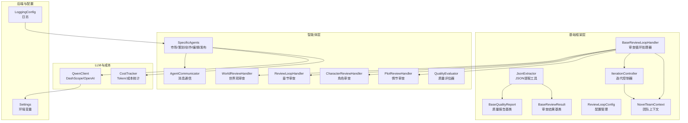
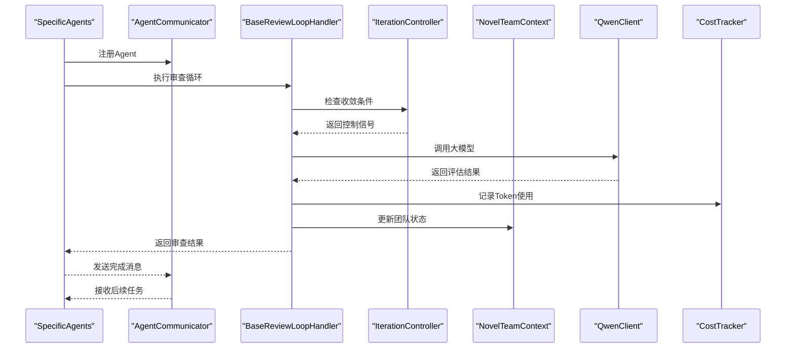
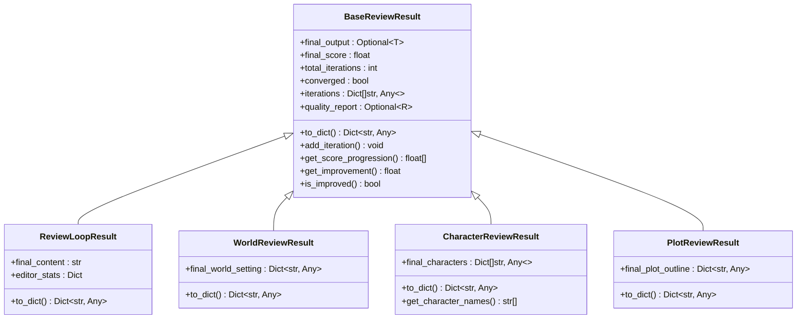
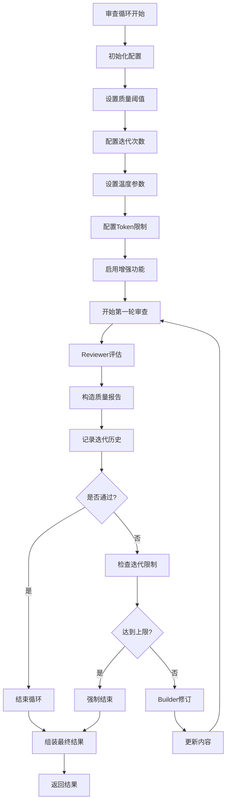
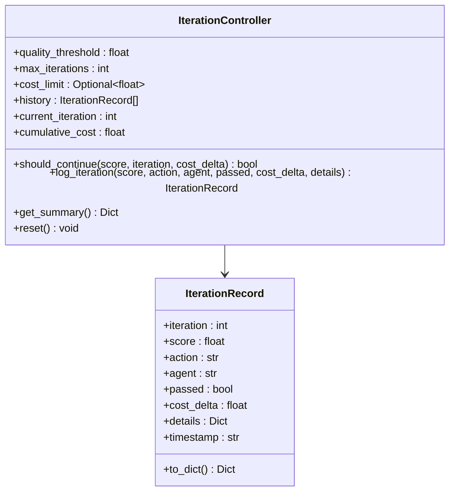
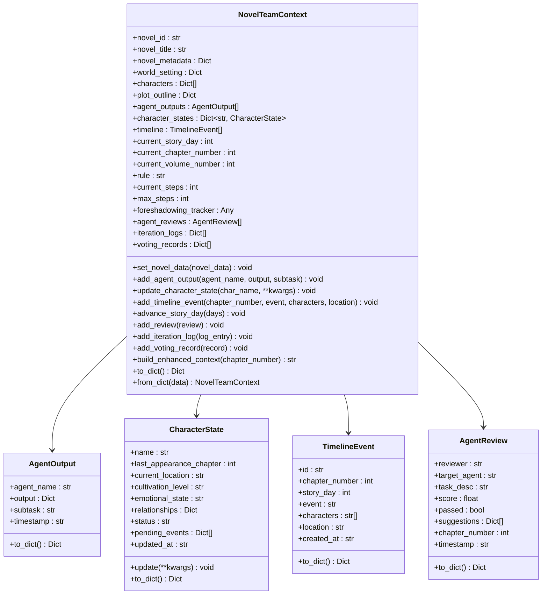
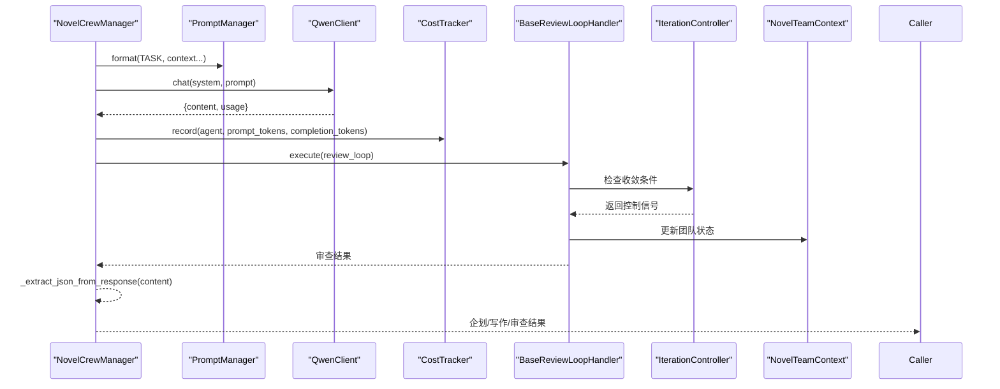
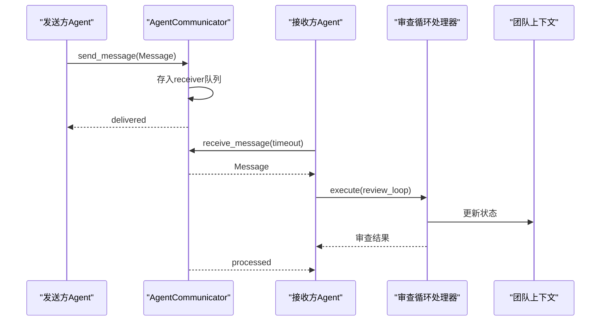
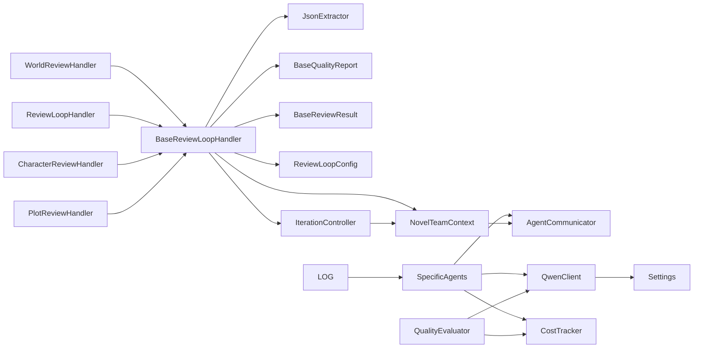

# AI智能体系统

<cite>
**本文档引用的文件**
- [agents/agent_manager.py](file://agents/agent_manager.py)
- [agents/crew_manager.py](file://agents/crew_manager.py)
- [agents/specific_agents.py](file://agents/specific_agents.py)
- [agents/agent_dispatcher.py](file://agents/agent_dispatcher.py)
- [agents/agent_scheduler.py](file://agents/agent_scheduler.py)
- [agents/agent_communicator.py](file://agents/agent_communicator.py)
- [agents/base/review_loop_base.py](file://agents/base/review_loop_base.py)
- [agents/base/quality_report.py](file://agents/base/quality_report.py)
- [agents/base/json_extractor.py](file://agents/base/json_extractor.py)
- [agents/base/review_result.py](file://agents/base/review_result.py)
- [agents/world_review_loop.py](file://agents/world_review_loop.py)
- [agents/review_loop.py](file://agents/review_loop.py)
- [agents/character_review_loop.py](file://agents/character_review_loop.py)
- [agents/plot_review_loop.py](file://agents/plot_review_loop.py)
- [agents/quality_evaluator.py](file://agents/quality_evaluator.py)
- [agents/iteration_controller.py](file://agents/iteration_controller.py)
- [agents/team_context.py](file://agents/team_context.py)
- [llm/qwen_client.py](file://llm/qwen_client.py)
- [llm/cost_tracker.py](file://llm/cost_tracker.py)
- [backend/config.py](file://backend/config.py)
- [core/logging_config.py](file://core/logging_config.py)
- [scripts/start_agents.py](file://scripts/start_agents.py)
</cite>

## 更新摘要
**所做更改**
- 新增统一的基础框架架构说明，详细介绍agents/base目录下的核心组件
- 更新审查循环系统架构，展示新的模板方法模式实现
- 增强质量评估报告和JSON提取工具的详细说明
- 更新智能体类型和职责分工，增加审查循环智能体
- 完善任务编排系统，包含审查循环的执行流程
- 新增审查循环配置管理和结果数据结构说明
- 新增多种审查循环处理器的具体实现
- 新增智能收敛检测和迭代控制机制
- 新增团队上下文管理系统

## 目录
1. [引言](#引言)
2. [项目结构](#项目结构)
3. [核心组件](#核心组件)
4. [架构总览](#架构总览)
5. [基础框架模块](#基础框架模块)
6. [审查循环系统](#审查循环系统)
7. [智能收敛检测机制](#智能收敛检测机制)
8. [团队上下文管理系统](#团队上下文管理系统)
9. [详细组件分析](#详细组件分析)
10. [依赖关系分析](#依赖关系分析)
11. [性能考量](#性能考量)
12. [故障排查指南](#故障排查指南)
13. [结论](#结论)
14. [附录](#附录)

## 引言
本文件面向"AI智能体系统"的全面技术文档，重点阐述该系统如何在小说生成场景中应用智能体协作与任务编排。系统采用简化的单智能体架构，专注于CrewAI风格的端到端小说生成流程。文档将深入解析：
- 智能体类型设计与职责分工
- 基础框架模块的标准化实现
- 审查循环系统的模板方法模式
- 智能收敛检测与迭代控制机制
- 团队上下文管理与状态同步
- 任务编排系统（类型、流程、状态跟踪）
- 智能体通信协议与消息传递机制
- 错误处理与可观测性
- 性能监控、负载均衡与扩展性设计

## 项目结构
系统采用简化的分层模块化组织，新增agents/base基础框架模块：
- agents：智能体与通信相关的核心实现
- agents/base：审查循环基础框架模块
- agents/crew_manager.py：统一的审查循环管理器
- agents/iteration_controller.py：迭代控制与收敛检测
- agents/team_context.py：团队上下文与状态管理
- llm：大模型客户端与成本追踪
- backend：后端服务与配置
- core：通用日志与基础设施
- scripts：启动脚本与运维工具

**图表来源**
- [agents/base/review_loop_base.py:64-726](file://agents/base/review_loop_base.py#L64-L726)
- [agents/base/quality_report.py:44-318](file://agents/base/quality_report.py#L44-L318)
- [agents/base/json_extractor.py:16-235](file://agents/base/json_extractor.py#L16-L235)
- [agents/base/review_result.py:23-232](file://agents/base/review_result.py#L23-L232)
- [agents/world_review_loop.py:171-371](file://agents/world_review_loop.py#L171-L371)
- [agents/review_loop.py:76-510](file://agents/review_loop.py#L76-L510)
- [agents/character_review_loop.py](file://agents/character_review_loop.py)
- [agents/plot_review_loop.py](file://agents/plot_review_loop.py)
- [agents/quality_evaluator.py:1-173](file://agents/quality_evaluator.py#L1-L173)
- [agents/iteration_controller.py:41-159](file://agents/iteration_controller.py#L41-L159)
- [agents/team_context.py:162-591](file://agents/team_context.py#L162-L591)

**章节来源**
- [agents/agent_communicator.py:1-180](file://agents/agent_communicator.py#L1-L180)
- [agents/specific_agents.py:1-505](file://agents/specific_agents.py#L1-L505)
- [agents/base/review_loop_base.py:1-726](file://agents/base/review_loop_base.py#L1-L726)
- [agents/base/quality_report.py:1-318](file://agents/base/quality_report.py#L1-L318)
- [agents/base/json_extractor.py:1-235](file://agents/base/json_extractor.py#L1-L235)
- [agents/base/review_result.py:1-232](file://agents/base/review_result.py#L1-L232)
- [llm/qwen_client.py:1-232](file://llm/qwen_client.py#L1-L232)
- [llm/cost_tracker.py:1-74](file://llm/cost_tracker.py#L1-L74)
- [backend/config.py:1-59](file://backend/config.py#L1-L59)
- [core/logging_config.py:1-55](file://core/logging_config.py#L1-L55)

## 核心组件
- AgentCommunicator：消息通信中枢，提供注册、发送、接收、广播与历史记录能力。
- SpecificAgents：五类智能体，分别承担市场分析、内容策划、创作、编辑、发布职责。
- BaseReviewLoopHandler：审查循环处理器基类，采用模板方法模式封装Designer-Reviewer循环。
- BaseQualityReport：质量评估报告基类，提供统一的质量评估数据结构。
- BaseReviewResult：审查结果基类，提供统一的结果数据结构和统计分析功能。
- JsonExtractor：JSON提取工具，支持多种格式的JSON解析策略。
- QwenClient：DashScope/OpenAI兼容的大模型客户端，支持重试与流式输出。
- CostTracker：Token用量与成本统计，按模型定价计算累计成本。
- IterationController：迭代控制与收敛检测，管理审查循环的退出条件。
- NovelTeamContext：团队上下文管理，实现智能体间的状态共享与追踪。
- Settings与LoggingConfig：配置与日志基础设施。

**章节来源**
- [agents/agent_communicator.py:72-180](file://agents/agent_communicator.py#L72-L180)
- [agents/specific_agents.py:15-505](file://agents/specific_agents.py#L15-L505)
- [agents/base/review_loop_base.py:64-726](file://agents/base/review_loop_base.py#L64-L726)
- [agents/base/quality_report.py:44-318](file://agents/base/quality_report.py#L44-L318)
- [agents/base/json_extractor.py:16-235](file://agents/base/json_extractor.py#L16-L235)
- [agents/base/review_result.py:23-232](file://agents/base/review_result.py#L23-L232)
- [agents/iteration_controller.py:41-159](file://agents/iteration_controller.py#L41-L159)
- [agents/team_context.py:162-591](file://agents/team_context.py#L162-L591)
- [llm/qwen_client.py:16-232](file://llm/qwen_client.py#L16-L232)
- [llm/cost_tracker.py:16-74](file://llm/cost_tracker.py#L16-L74)
- [backend/config.py:5-59](file://backend/config.py#L5-L59)
- [core/logging_config.py:20-55](file://core/logging_config.py#L20-L55)

## 架构总览
系统采用简化的CrewAI风格架构，专注于端到端的小说生成流程，新增审查循环基础框架：
- 通过AgentCommunicator实现智能体间的异步消息传递
- 通过SpecificAgents实现小说生成的各个阶段
- 通过BaseReviewLoopHandler实现标准化的审查循环
- 通过BaseQualityReport和JsonExtractor提供统一的质量评估
- 通过QwenClient和CostTracker实现大模型调用与成本追踪
- 通过IterationController实现智能收敛检测与迭代控制
- 通过NovelTeamContext实现团队状态共享与上下文管理
- 支持从市场分析到内容策划、从创作到编辑的完整工作流

**图表来源**
- [agents/specific_agents.py:37-505](file://agents/specific_agents.py#L37-L505)
- [agents/agent_communicator.py:91-135](file://agents/agent_communicator.py#L91-L135)
- [agents/base/review_loop_base.py:120-262](file://agents/base/review_loop_base.py#L120-L262)
- [agents/iteration_controller.py:70-115](file://agents/iteration_controller.py#L70-L115)
- [agents/team_context.py:443-474](file://agents/team_context.py#L443-L474)
- [llm/qwen_client.py:46-161](file://llm/qwen_client.py#L46-L161)
- [llm/cost_tracker.py:26-56](file://llm/cost_tracker.py#L26-L56)

## 基础框架模块

### 审查循环处理器基类
BaseReviewLoopHandler采用模板方法模式，封装Designer-Reviewer审查循环的核心迭代逻辑：
- 模板方法execute定义完整的审查流程
- 抽象方法定义特定领域的实现接口
- 配置管理ReviewLoopConfig提供灵活的参数控制
- 支持最佳记录追踪和停滞检测机制
- 集成智能收敛检测与迭代控制

```mermaid
classDiagram
class BaseReviewLoopHandler {
+execute(initial_content, **context) TResult
+_call_reviewer() Dict
+_call_builder() TContent
+_create_quality_report() TReport
+_validate_revision() bool
+_finalize_result() void
+to_json(obj, indent, max_length) str
}
class ReviewLoopConfig {
+quality_threshold : float
+max_iterations : int
+reviewer_temperature : float
+builder_temperature : float
+reviewer_max_tokens : int
+builder_max_tokens : int
+enable_issue_tracking : bool
+enable_progress_summary : bool
+max_context_chars : int
+issue_match_threshold : float
}
class IterationController {
+should_continue(score, iteration, cost_delta) bool
+log_iteration(score, action, agent, passed, cost_delta, details) IterationRecord
+get_summary() Dict
}
class NovelTeamContext {
+add_review(review) void
+add_iteration_log(log_entry) void
+build_enhanced_context(chapter_number) str
+to_dict() Dict
}
class WorldReviewHandler {
+_get_loop_name() str
+_create_result() WorldReviewResult
+_create_quality_report() WorldQualityReport
+_build_reviewer_task_prompt() str
+_build_revision_prompt() str
+_validate_revision() bool
+_finalize_result() void
}
class ReviewLoopHandler {
+_get_loop_name() str
+_create_result() ReviewLoopResult
+_create_quality_report() ChapterQualityReport
+_build_reviewer_task_prompt() str
+_build_revision_prompt() str
+_validate_revision() bool
+_finalize_result() void
}
class CharacterReviewHandler {
+_get_loop_name() str
+_create_result() CharacterReviewResult
+_create_quality_report() CharacterQualityReport
+_build_reviewer_task_prompt() str
+_build_revision_prompt() str
+_validate_revision() bool
+_finalize_result() void
}
class PlotReviewHandler {
+_get_loop_name() str
+_create_result() PlotReviewResult
+_create_quality_report() PlotQualityReport
+_build_reviewer_task_prompt() str
+_build_revision_prompt() str
+_validate_revision() bool
+_finalize_result() void
}
BaseReviewLoopHandler <|-- WorldReviewHandler
BaseReviewLoopHandler <|-- ReviewLoopHandler
BaseReviewLoopHandler <|-- CharacterReviewHandler
BaseReviewLoopHandler <|-- PlotReviewHandler
BaseReviewLoopHandler --> ReviewLoopConfig
BaseReviewLoopHandler --> IterationController
BaseReviewLoopHandler --> NovelTeamContext
```

**图表来源**
- [agents/base/review_loop_base.py:64-726](file://agents/base/review_loop_base.py#L64-L726)
- [agents/world_review_loop.py:171-371](file://agents/world_review_loop.py#L171-L371)
- [agents/review_loop.py:76-510](file://agents/review_loop.py#L76-L510)
- [agents/character_review_loop.py](file://agents/character_review_loop.py)
- [agents/plot_review_loop.py](file://agents/plot_review_loop.py)
- [agents/iteration_controller.py:41-159](file://agents/iteration_controller.py#L41-L159)
- [agents/team_context.py:162-591](file://agents/team_context.py#L162-L591)

**章节来源**
- [agents/base/review_loop_base.py:64-726](file://agents/base/review_loop_base.py#L64-L726)
- [agents/base/review_loop_base.py:38-62](file://agents/base/review_loop_base.py#L38-L62)

### 质量报告基类体系
BaseQualityReport提供统一的质量评估数据结构，支持多维度评分和问题追踪：
- 统一的评估字段：overall_score、dimension_scores、issues、summary
- 安全的分数提取机制，支持降级处理
- 支持不同领域的质量报告扩展
- 提供问题合并和统计分析功能

**图表来源**
- [agents/base/quality_report.py:44-318](file://agents/base/quality_report.py#L44-L318)

**章节来源**
- [agents/base/quality_report.py:44-318](file://agents/base/quality_report.py#L44-L318)

### 审查结果数据结构体系
BaseReviewResult提供统一的结果数据结构，支持不同类型的输出：
- 统一的属性：final_output、final_score、total_iterations、converged、iterations、quality_report
- 统计分析功能：评分趋势、改进幅度、收敛判断
- 向后兼容别名：章节内容、世界观设定、角色列表、情节大纲
- 不同领域结果的特定功能

**图表来源**
- [agents/base/review_result.py:23-232](file://agents/base/review_result.py#L23-L232)

**章节来源**
- [agents/base/review_result.py:23-232](file://agents/base/review_result.py#L23-L232)

### JSON提取工具
JsonExtractor提供多种策略从LLM响应中提取JSON：
- 直接解析、代码块提取、边界查找等多种策略
- 自动修复常见的JSON格式问题
- 支持对象、数组、单值的提取
- 提供安全提取和默认值处理

**章节来源**
- [agents/base/json_extractor.py:16-235](file://agents/base/json_extractor.py#L16-L235)

## 审查循环系统

### 审查循环配置管理
ReviewLoopConfig提供灵活的审查循环参数控制：
- quality_threshold：质量阈值，默认7.0，章节审查可用7.5
- max_iterations：最大迭代次数，默认2次
- 温度参数：Reviewer和Builder的不同温度设置
- Token限制：针对不同角色的max_tokens配置
- 增强功能：问题跟踪、进度摘要、上下文预算、相似度阈值

**图表来源**
- [agents/base/review_loop_base.py:120-262](file://agents/base/review_loop_base.py#L120-L262)

### 具体审查处理器实现
系统提供四种专门的审查循环处理器：

#### 世界观审查处理器
- WorldReviewHandler：专注于内在一致性、深度广度、独特性、可扩展性、力量体系完整性
- 评分维度：consistency、depth_breadth、uniqueness、expandability、power_system
- 输出：完整的世界观设定字典

#### 章节审查处理器  
- ReviewLoopHandler：专注于语言流畅度、情节逻辑、角色一致性、节奏把控、爽感设计
- 评分维度：fluency、plot_logic、character_consistency、pacing、satisfaction_design
- 输出：润色后的章节内容字符串

#### 角色审查处理器
- CharacterReviewHandler：专注于角色独特性、背景深度、动机合理性
- 评分维度：uniqueness、background_depth、motivation_consistency
- 输出：角色列表，包含角色名称、背景、动机等信息

#### 情节审查处理器
- PlotReviewHandler：专注于情节结构、冲突发展、高潮安排
- 评分维度：structure、conflict_development、climax_arrangement
- 输出：情节大纲，包含章节分布、关键事件、转折点

**章节来源**
- [agents/world_review_loop.py:171-371](file://agents/world_review_loop.py#L171-L371)
- [agents/review_loop.py:76-510](file://agents/review_loop.py#L76-L510)
- [agents/character_review_loop.py](file://agents/character_review_loop.py)
- [agents/plot_review_loop.py](file://agents/plot_review_loop.py)

## 智能收敛检测机制

### 迭代控制与收敛检测
系统实现了智能的迭代控制机制，通过IterationController管理审查循环的退出条件：
- 质量达标检测：当score >= quality_threshold时停止迭代
- 最大迭代次数限制：防止无限循环
- 成本超限保护：控制LLM调用成本
- 评分停滞检测：连续多轮无明显改进时提前终止

**图表来源**
- [agents/iteration_controller.py:41-159](file://agents/iteration_controller.py#L41-L159)

**章节来源**
- [agents/iteration_controller.py:41-159](file://agents/iteration_controller.py#L41-L159)

### 智能停滞检测算法
系统实现了智能的停滞检测算法，通过以下机制防止无效迭代：
- 连续两轮评分改善小于0.3分时触发停滞检测
- 记录最佳内容与评分，确保最终输出质量最优
- 提供详细的日志记录，便于问题诊断

**章节来源**
- [agents/base/review_loop_base.py:208-222](file://agents/base/review_loop_base.py#L208-L222)
- [agents/review_loop.py:466-480](file://agents/review_loop.py#L466-L480)

## 团队上下文管理系统

### 团队状态共享与追踪
NovelTeamContext实现了智能体间的上下文共享与状态追踪：
- Agent输出历史记录与追踪
- 角色状态管理与更新
- 时间线事件追踪
- 伏笔系统集成
- 团队规则管理

**图表来源**
- [agents/team_context.py:162-591](file://agents/team_context.py#L162-L591)

**章节来源**
- [agents/team_context.py:162-591](file://agents/team_context.py#L162-L591)

### 线程安全与异步支持
系统实现了线程安全的上下文管理：
- 使用asyncio.Lock保护所有写操作
- 提供同步和异步两种操作模式
- 读操作返回数据快照，避免并发修改问题
- 支持高并发场景下的数据一致性

**章节来源**
- [agents/team_context.py:232-254](file://agents/team_context.py#L232-L254)

## 详细组件分析

### 智能体类型与职责分工
- 市场分析Agent：基于PromptManager与QwenClient分析市场趋势、热门题材与标签，产出洞察供内容策划参考。
- 内容策划Agent：整合市场分析与用户偏好，生成小说标题、类型、标签、简介与内容计划。
- 创作Agent：根据内容计划与世界设定、角色信息生成章节初稿。
- 编辑Agent：对初稿进行润色与优化，提升可读性与一致性。
- 发布Agent：模拟发布流程，记录平台书号与章节号等元数据。
- **新增审查循环智能体**：专门负责质量控制和迭代优化，包括世界观审查、章节审查、角色审查、情节审查。

**图表来源**
- [agents/specific_agents.py:15-505](file://agents/specific_agents.py#L15-L505)
- [agents/world_review_loop.py:171-371](file://agents/world_review_loop.py#L171-L371)
- [agents/review_loop.py:76-510](file://agents/review_loop.py#L76-L510)
- [agents/character_review_loop.py](file://agents/character_review_loop.py)
- [agents/plot_review_loop.py](file://agents/plot_review_loop.py)

**章节来源**
- [agents/specific_agents.py:15-505](file://agents/specific_agents.py#L15-L505)

### 任务编排与执行流程（CrewAI风格）
- 企划阶段：主题分析师→世界观架构师→角色设计师→情节架构师，按顺序串联，每步均调用QwenClient并记录成本。
- 写作阶段：章节策划师→作家→编辑→连续性审查员，支持传入前几章摘要与角色状态，确保连贯性与质量评分。
- **新增审查阶段**：通过审查循环处理器实现自动化质量控制，支持多轮迭代优化。
- **新增智能收敛检测**：通过IterationController实现智能停止条件，防止无效迭代。
- **新增团队上下文管理**：通过NovelTeamContext实现智能体间的状态共享与追踪。
- NovelCrewManager提供JSON提取与错误处理，保障跨Agent数据交换的稳定性。

**图表来源**
- [agents/crew_manager.py:104-480](file://agents/crew_manager.py#L104-L480)
- [agents/base/review_loop_base.py:120-262](file://agents/base/review_loop_base.py#L120-L262)
- [agents/iteration_controller.py:70-115](file://agents/iteration_controller.py#L70-L115)
- [agents/team_context.py:443-474](file://agents/team_context.py#L443-L474)
- [llm/qwen_client.py:46-161](file://llm/qwen_client.py#L46-L161)
- [llm/cost_tracker.py:26-56](file://llm/cost_tracker.py#L26-L56)

**章节来源**
- [agents/crew_manager.py:19-480](file://agents/crew_manager.py#L19-L480)

### Agent通信协议与消息传递机制
- 注册：Agent通过AgentCommunicator.register_agent注册到消息队列。
- 发送/接收：send_message与receive_message基于asyncio.Queue实现异步消息传递；支持超时与状态追踪。
- 广播：broadcast_message向所有已注册Agent广播消息。
- 历史：消息历史记录便于审计与调试。
- **新增审查循环通信**：通过审查循环处理器实现智能体间的标准化质量评估通信。
- **新增团队上下文通信**：通过NovelTeamContext实现智能体间的状态共享与上下文传递。

**图表来源**
- [agents/agent_communicator.py:91-135](file://agents/agent_communicator.py#L91-L135)
- [agents/base/review_loop_base.py:120-262](file://agents/base/review_loop_base.py#L120-L262)
- [agents/team_context.py:443-474](file://agents/team_context.py#L443-L474)

**章节来源**
- [agents/agent_communicator.py:72-180](file://agents/agent_communicator.py#L72-L180)

### 错误处理策略
- LLM调用：QwenClient在OpenAI与DashScope模式下均实现指数退避重试；异常统一抛出，便于上层捕获。
- 任务处理：Agent基类在任务处理异常时设置状态为ERROR，并记录日志；调度器在任务完成消息缺失或UUID解析失败时进行保护性处理。
- **新增审查循环错误处理**：审查循环处理器提供默认值回退机制，确保系统稳定性。
- **新增智能收敛检测错误处理**：迭代控制器在成本超限时提供保护性停止机制。
- **新增团队上下文错误处理**：上下文管理器提供线程安全的数据访问，防止并发修改问题。
- Crew阶段：NovelCrewManager对JSON提取失败与异常进行捕获并记录，必要时回退至CrewAI风格执行路径。

**章节来源**
- [llm/qwen_client.py:65-161](file://llm/qwen_client.py#L65-L161)
- [agents/agent_scheduler.py:191-220](file://agents/agent_scheduler.py#L191-L220)
- [agents/crew_manager.py:37-102](file://agents/crew_manager.py#L37-L102)
- [agents/base/review_loop_base.py:623-626](file://agents/base/review_loop_base.py#L623-L626)
- [agents/iteration_controller.py:103-109](file://agents/iteration_controller.py#L103-L109)
- [agents/team_context.py:238-254](file://agents/team_context.py#L238-L254)

## 依赖关系分析
- 组件耦合：
  - SpecificAgents依赖AgentCommunicator与QwenClient/CostTracker/PromptManager。
  - **新增**：审查循环处理器依赖基础框架模块、LLM客户端、迭代控制器、团队上下文。
  - **新增**：迭代控制器独立于其他组件，提供通用的收敛检测功能。
  - **新增**：团队上下文提供全局状态管理，被多个组件共享使用。
- 外部依赖：
  - DashScope/OpenAI SDK用于大模型推理。
  - Settings提供配置注入，LoggingConfig提供统一日志。
- 潜在风险：
  - 并发环境下消息队列与任务状态更新需保持原子性，已在关键路径加锁。
  - **新增**：审查循环的配置管理和结果数据结构需要统一的版本控制。
  - **新增**：团队上下文的线程安全保证需要持续验证，特别是在高并发场景下。

**图表来源**
- [agents/specific_agents.py:15-505](file://agents/specific_agents.py#L15-L505)
- [agents/agent_communicator.py:72-180](file://agents/agent_communicator.py#L72-L180)
- [agents/base/review_loop_base.py:64-726](file://agents/base/review_loop_base.py#L64-L726)
- [agents/world_review_loop.py:171-371](file://agents/world_review_loop.py#L171-L371)
- [agents/review_loop.py:76-510](file://agents/review_loop.py#L76-L510)
- [agents/character_review_loop.py](file://agents/character_review_loop.py)
- [agents/plot_review_loop.py](file://agents/plot_review_loop.py)
- [agents/quality_evaluator.py:1-173](file://agents/quality_evaluator.py#L1-L173)
- [agents/iteration_controller.py:41-159](file://agents/iteration_controller.py#L41-L159)
- [agents/team_context.py:162-591](file://agents/team_context.py#L162-L591)
- [llm/qwen_client.py:16-232](file://llm/qwen_client.py#L16-L232)
- [llm/cost_tracker.py:16-74](file://llm/cost_tracker.py#L16-L74)
- [backend/config.py:5-59](file://backend/config.py#L5-L59)
- [core/logging_config.py:20-55](file://core/logging_config.py#L20-L55)

**章节来源**
- [agents/specific_agents.py:1-505](file://agents/specific_agents.py#L1-L505)
- [agents/agent_communicator.py:1-180](file://agents/agent_communicator.py#L1-L180)
- [agents/base/review_loop_base.py:1-726](file://agents/base/review_loop_base.py#L1-L726)
- [agents/world_review_loop.py:1-371](file://agents/world_review_loop.py#L1-L371)
- [agents/review_loop.py:1-510](file://agents/review_loop.py#L1-L510)
- [agents/character_review_loop.py](file://agents/character_review_loop.py)
- [agents/plot_review_loop.py](file://agents/plot_review_loop.py)
- [agents/quality_evaluator.py:1-173](file://agents/quality_evaluator.py#L1-L173)
- [agents/iteration_controller.py:1-159](file://agents/iteration_controller.py#L1-L159)
- [agents/team_context.py:1-591](file://agents/team_context.py#L1-L591)
- [llm/qwen_client.py:1-232](file://llm/qwen_client.py#L1-L232)
- [llm/cost_tracker.py:1-74](file://llm/cost_tracker.py#L1-L74)
- [backend/config.py:1-59](file://backend/config.py#L1-L59)
- [core/logging_config.py:1-55](file://core/logging_config.py#L1-L55)

## 性能考量
- 并发与异步：基于asyncio的队列与任务循环，避免阻塞；QwenClient在DashScope模式下通过线程池执行同步调用，防止阻塞事件循环。
- 重试与退避：QwenClient支持指数退避重试，降低瞬时错误影响。
- 成本控制：CostTracker按模型定价实时统计，便于预算控制与成本优化。
- **新增审查循环性能**：审查循环处理器内置最佳记录追踪和停滞检测，避免无效迭代。
- **新增智能收敛检测性能**：迭代控制器提供快速的收敛判断，减少不必要的LLM调用。
- **新增团队上下文性能**：线程安全的上下文管理避免了数据竞争，提高了并发性能。
- 可观测性：统一日志与消息历史，便于定位瓶颈与异常。
- 扩展性建议：
  - 引入限流与熔断（如令牌桶/滑动窗口），防止LLM调用峰值冲击。
  - 任务队列持久化与重试策略，增强可靠性。
  - 负载均衡：按Agent类型与资源占用动态分配任务，避免热点。

## 故障排查指南
- Agent未启动/状态异常
  - 检查AgentCommunicator.register_agent是否成功注册。
- LLM调用失败
  - 查看QwenClient的重试日志与最终异常信息。
  - 核对Settings中的API Key与Base URL配置。
- **新增审查循环问题**
  - 检查审查循环配置参数是否合理。
  - 验证质量报告数据结构是否符合预期。
  - 确认JSON提取工具是否正确解析LLM响应。
  - 检查智能收敛检测日志，确认迭代控制是否正常工作。
- **新增团队上下文问题**
  - 检查NovelTeamContext的线程安全机制是否正常工作。
  - 验证异步操作是否正确使用了上下文管理器。
  - 确认数据序列化和反序列化过程是否正确。
- 成本统计异常
  - 确认CostTracker的record调用是否覆盖所有Agent调用路径。
  - 检查模型定价表与Token统计是否一致。

**章节来源**
- [agents/agent_communicator.py:80-135](file://agents/agent_communicator.py#L80-L135)
- [llm/qwen_client.py:65-161](file://llm/qwen_client.py#L65-L161)
- [llm/cost_tracker.py:26-56](file://llm/cost_tracker.py#L26-L56)
- [backend/config.py:5-59](file://backend/config.py#L5-L59)
- [agents/base/review_loop_base.py:623-626](file://agents/base/review_loop_base.py#L623-L626)
- [agents/iteration_controller.py:103-109](file://agents/iteration_controller.py#L103-L109)
- [agents/team_context.py:238-254](file://agents/team_context.py#L238-L254)

## 结论
该系统采用简化的CrewAI风格架构，专注于端到端的小说生成流程。通过智能体间的异步消息通信、完善的任务处理机制与成本追踪，系统具备良好的可维护性与扩展性。新增的基础框架模块、智能收敛检测机制和团队上下文管理系统进一步增强了系统的标准化程度、自动化水平和协作能力。这些改进使得系统能够更好地处理复杂的审查循环任务，实现更高质量的内容生成。未来可在限流熔断、任务持久化与负载均衡方面进一步增强，以应对更高并发与更复杂业务场景。

## 附录
- 启动方式：可通过scripts/start_agents.py启动Agent系统，自动注册并运行五类Agent，支持信号处理与成本统计。
- 配置项：Settings提供DashScope API Key、模型、数据库、Redis、Celery等配置；LoggingConfig统一日志级别与输出。
- **新增基础框架模块**：agents/base目录提供了标准化的审查循环基础设施，支持快速扩展新的审查领域。
- **新增智能收敛检测**：IterationController提供通用的迭代控制与收敛检测功能，可应用于各种审查场景。
- **新增团队上下文管理**：NovelTeamContext实现智能体间的状态共享与追踪，支持复杂的协作场景。

**章节来源**
- [scripts/start_agents.py:37-204](file://scripts/start_agents.py#L37-L204)
- [backend/config.py:5-59](file://backend/config.py#L5-L59)
- [core/logging_config.py:20-55](file://core/logging_config.py#L20-L55)
- [agents/base/__init__.py:1-48](file://agents/base/__init__.py#L1-L48)
- [agents/iteration_controller.py:1-159](file://agents/iteration_controller.py#L1-L159)
- [agents/team_context.py:1-591](file://agents/team_context.py#L1-L591)