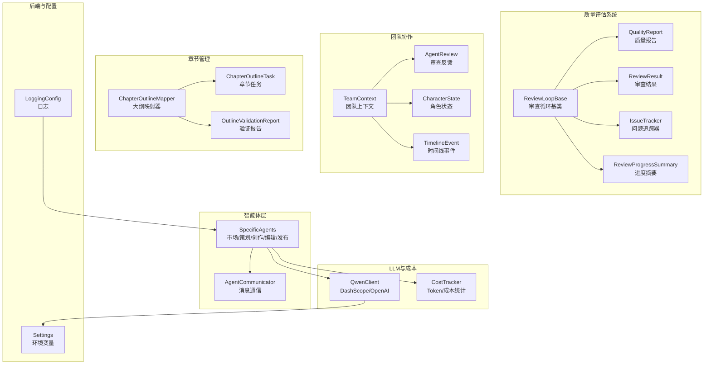
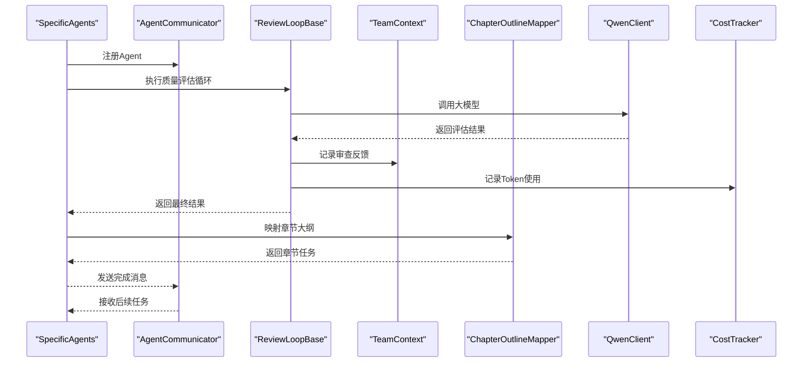
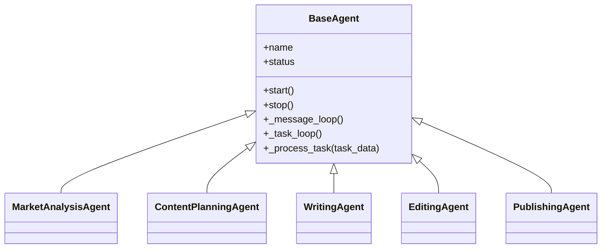
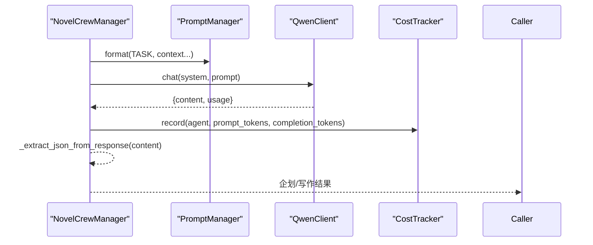
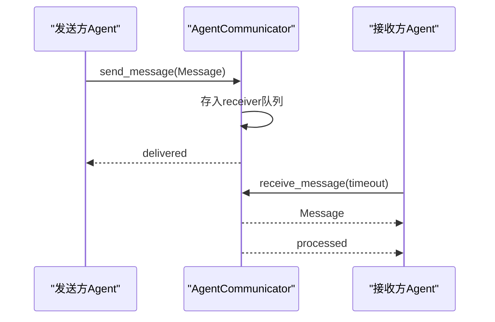
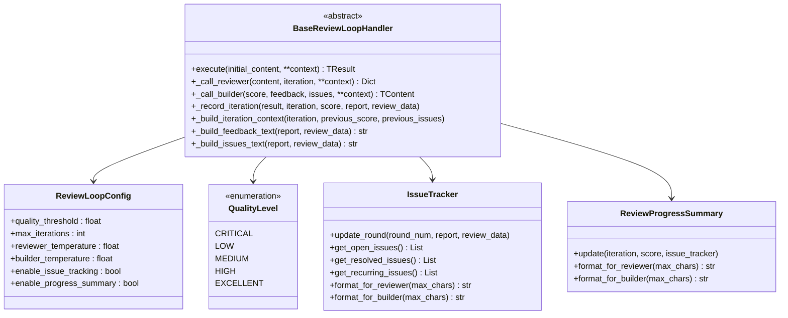
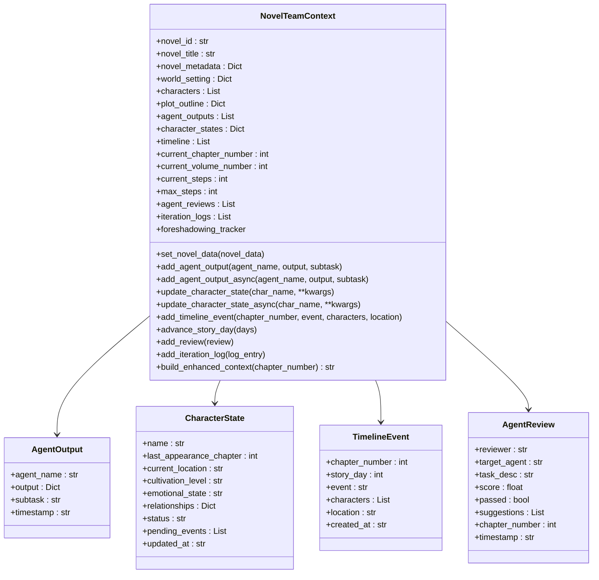
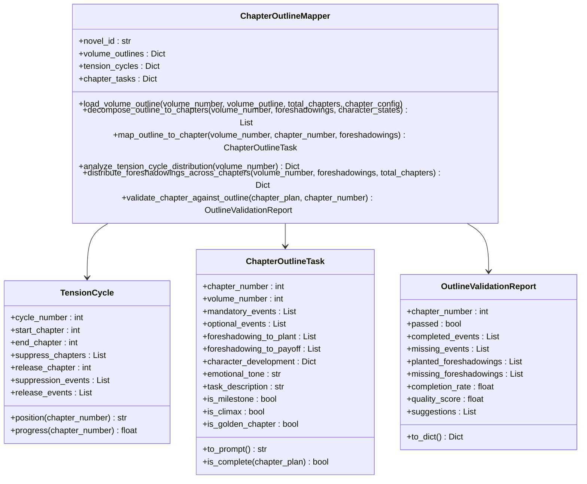
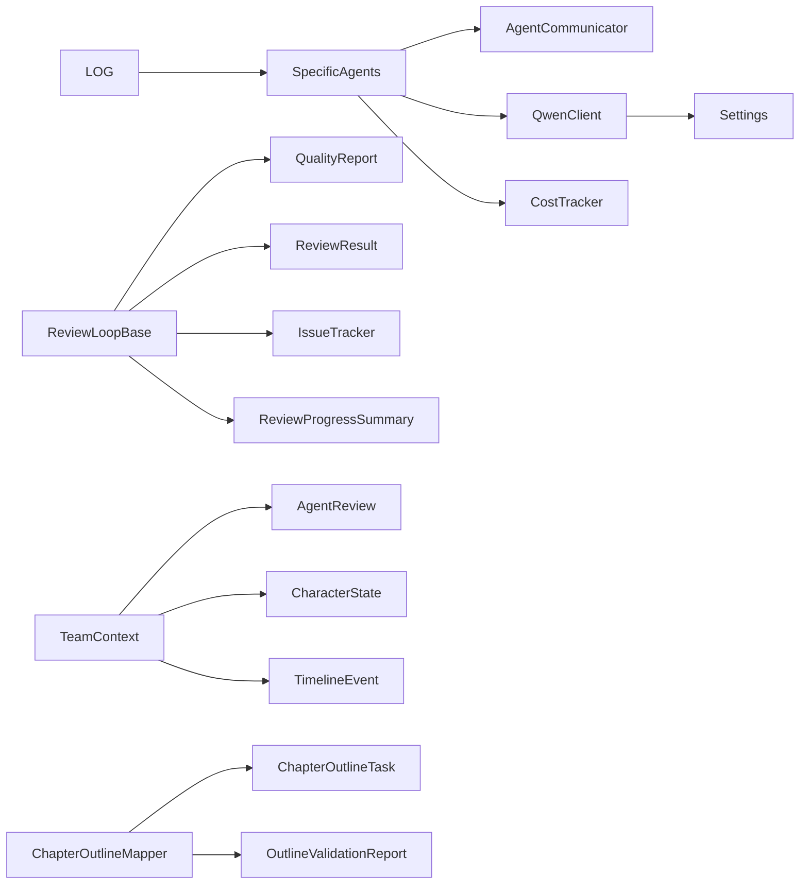

# AI智能体系统

<cite>
**本文档引用的文件**
- [agents/agent_manager.py](file://agents/agent_manager.py)
- [agents/crew_manager.py](file://agents/crew_manager.py)
- [agents/specific_agents.py](file://agents/specific_agents.py)
- [agents/agent_dispatcher.py](file://agents/agent_dispatcher.py)
- [agents/agent_scheduler.py](file://agents/agent_scheduler.py)
- [agents/agent_communicator.py](file://agents/agent_communicator.py)
- [agents/base/review_loop_base.py](file://agents/base/review_loop_base.py)
- [agents/team_context.py](file://agents/team_context.py)
- [agents/chapter_outline_mapper.py](file://agents/chapter_outline_mapper.py)
- [agents/review_loop.py](file://agents/review_loop.py)
- [agents/world_review_loop.py](file://agents/world_review_loop.py)
- [agents/quality_evaluator.py](file://agents/quality_evaluator.py)
- [agents/iteration_controller.py](file://agents/iteration_controller.py)
- [agents/base/quality_report.py](file://agents/base/quality_report.py)
- [agents/base/review_result.py](file://agents/base/review_result.py)
- [llm/qwen_client.py](file://llm/qwen_client.py)
- [llm/cost_tracker.py](file://llm/cost_tracker.py)
- [backend/config.py](file://backend/config.py)
- [core/logging_config.py](file://core/logging_config.py)
- [scripts/start_agents.py](file://scripts/start_agents.py)
</cite>

## 更新摘要
**所做更改**
- 新增多阶段质量评估系统，包括ReviewLoopBase、QualityReport、ReviewResult等核心组件
- 新增团队协作机制，通过TeamContext实现Agent间的上下文共享和状态追踪
- 新增章节大纲映射功能，提供章节级任务分解和进度追踪
- 增强Agent通信和任务管理能力，支持动态迭代策略和成本控制
- 更新架构图以反映新的质量评估和协作机制
- 新增质量级别分类、问题追踪和进度摘要功能

## 目录
1. [引言](#引言)
2. [项目结构](#项目结构)
3. [核心组件](#核心组件)
4. [架构总览](#架构总览)
5. [详细组件分析](#详细组件分析)
6. [多阶段质量评估系统](#多阶段质量评估系统)
7. [团队协作机制](#团队协作机制)
8. [章节大纲映射功能](#章节大纲映射功能)
9. [依赖关系分析](#依赖关系分析)
10. [性能考量](#性能考量)
11. [故障排查指南](#故障排查指南)
12. [结论](#结论)
13. [附录](#附录)

## 引言
本文件面向"AI智能体系统"的全面技术文档，重点阐述该系统如何在小说生成场景中应用智能体协作与任务编排。系统采用增强的多阶段质量评估架构，集成了智能体类型设计、团队协作机制、章节大纲映射等功能。文档将深入解析：
- 多阶段质量评估系统的设计与实现
- 智能体类型设计与职责分工
- 团队协作机制与上下文共享
- 章节大纲映射与进度追踪
- 任务编排系统（类型、流程、状态跟踪）
- 智能体通信协议与消息传递机制
- 错误处理与可观测性
- 性能监控、负载均衡与扩展性设计

## 项目结构
系统采用模块化的分层架构，包含智能体核心、质量评估、团队协作和章节管理等多个子系统：
- agents：智能体与通信相关的核心实现
- agents/base：质量评估和审查循环的基础组件
- llm：大模型客户端与成本追踪
- backend：后端服务与配置
- core：通用日志与基础设施
- scripts：启动脚本与运维工具

**图表来源**
- [agents/agent_communicator.py:72-180](file://agents/agent_communicator.py#L72-L180)
- [agents/specific_agents.py:15-505](file://agents/specific_agents.py#L15-L505)
- [agents/base/review_loop_base.py:598-800](file://agents/base/review_loop_base.py#L598-L800)
- [agents/team_context.py:162-591](file://agents/team_context.py#L162-L591)
- [agents/chapter_outline_mapper.py:187-800](file://agents/chapter_outline_mapper.py#L187-L800)
- [llm/qwen_client.py:16-232](file://llm/qwen_client.py#L16-L232)
- [llm/cost_tracker.py:16-74](file://llm/cost_tracker.py#L16-L74)
- [backend/config.py:5-59](file://backend/config.py#L5-L59)
- [core/logging_config.py:20-55](file://core/logging_config.py#L20-L55)

**章节来源**
- [agents/agent_communicator.py:1-180](file://agents/agent_communicator.py#L1-L180)
- [agents/specific_agents.py:1-505](file://agents/specific_agents.py#L1-L505)
- [agents/base/review_loop_base.py:1-800](file://agents/base/review_loop_base.py#L1-L800)
- [agents/team_context.py:1-591](file://agents/team_context.py#L1-L591)
- [agents/chapter_outline_mapper.py:1-1109](file://agents/chapter_outline_mapper.py#L1-L1109)
- [llm/qwen_client.py:1-232](file://llm/qwen_client.py#L1-L232)
- [llm/cost_tracker.py:1-74](file://llm/cost_tracker.py#L1-L74)
- [backend/config.py:1-59](file://backend/config.py#L1-L59)
- [core/logging_config.py:1-55](file://core/logging_config.py#L1-L55)

## 核心组件
- AgentCommunicator：消息通信中枢，提供注册、发送、接收、广播与历史记录能力。
- SpecificAgents：五类智能体，分别承担市场分析、内容策划、创作、编辑、发布职责。
- ReviewLoopBase：审查循环基类，提供多阶段质量评估的模板方法模式实现。
- QualityReport：质量评估报告基类，支持不同领域的质量分析和降级处理。
- ReviewResult：审查结果基类，支持不同类型的最终输出和迭代历史记录。
- TeamContext：团队上下文管理器，实现Agent间的共享状态和协作机制。
- ChapterOutlineMapper：章节大纲映射器，提供章节级任务分解和进度追踪功能。
- QwenClient：DashScope/OpenAI兼容的大模型客户端，支持重试与流式输出。
- CostTracker：Token用量与成本统计，按模型定价计算累计成本。
- Settings与LoggingConfig：配置与日志基础设施。

**章节来源**
- [agents/agent_communicator.py:72-180](file://agents/agent_communicator.py#L72-L180)
- [agents/specific_agents.py:15-505](file://agents/specific_agents.py#L15-L505)
- [agents/base/review_loop_base.py:598-800](file://agents/base/review_loop_base.py#L598-L800)
- [agents/team_context.py:162-591](file://agents/team_context.py#L162-L591)
- [agents/chapter_outline_mapper.py:187-800](file://agents/chapter_outline_mapper.py#L187-L800)
- [llm/qwen_client.py:16-232](file://llm/qwen_client.py#L16-L232)
- [llm/cost_tracker.py:16-74](file://llm/cost_tracker.py#L16-L74)
- [backend/config.py:5-59](file://backend/config.py#L5-L59)
- [core/logging_config.py:20-55](file://core/logging_config.py#L20-L55)

## 架构总览
系统采用增强的多阶段质量评估架构，集成了智能体协作、质量控制和进度追踪：
- 通过AgentCommunicator实现智能体间的异步消息传递
- 通过ReviewLoopBase实现多阶段质量评估循环
- 通过TeamContext实现团队协作和上下文共享
- 通过ChapterOutlineMapper实现章节级任务管理和进度追踪
- 通过SpecificAgents实现小说生成的各个阶段
- 通过QwenClient和CostTracker实现大模型调用与成本追踪

**图表来源**
- [agents/specific_agents.py:37-505](file://agents/specific_agents.py#L37-L505)
- [agents/agent_communicator.py:91-135](file://agents/agent_communicator.py#L91-L135)
- [agents/base/review_loop_base.py:659-800](file://agents/base/review_loop_base.py#L659-L800)
- [agents/team_context.py:443-459](file://agents/team_context.py#L443-L459)
- [agents/chapter_outline_mapper.py:246-305](file://agents/chapter_outline_mapper.py#L246-L305)
- [llm/qwen_client.py:46-161](file://llm/qwen_client.py#L46-L161)
- [llm/cost_tracker.py:26-56](file://llm/cost_tracker.py#L26-L56)

## 详细组件分析

### 智能体类型与职责分工
- 市场分析Agent：基于PromptManager与QwenClient分析市场趋势、热门题材与标签，产出洞察供内容策划参考。
- 内容策划Agent：整合市场分析与用户偏好，生成小说标题、类型、标签、简介与内容计划。
- 创作Agent：根据内容计划与世界设定、角色信息生成章节初稿。
- 编辑Agent：对初稿进行润色与优化，提升可读性与一致性，支持Editor自动润色验证。
- 发布Agent：模拟发布流程，记录平台书号与章节号等元数据。

**图表来源**
- [agents/specific_agents.py:15-505](file://agents/specific_agents.py#L15-L505)

**章节来源**
- [agents/specific_agents.py:15-505](file://agents/specific_agents.py#L15-L505)

### 任务编排与执行流程（CrewAI风格）
- 企划阶段：主题分析师→世界观架构师→角色设计师→情节架构师，按顺序串联，每步均调用QwenClient并记录成本。
- 写作阶段：章节策划师→作家→编辑→连续性审查员，支持传入前几章摘要与角色状态，确保连贯性与质量评分。
- NovelCrewManager提供JSON提取与错误处理，保障跨Agent数据交换的稳定性。

**图表来源**
- [agents/crew_manager.py:104-480](file://agents/crew_manager.py#L104-L480)
- [llm/qwen_client.py:46-161](file://llm/qwen_client.py#L46-L161)
- [llm/cost_tracker.py:26-56](file://llm/cost_tracker.py#L26-L56)

**章节来源**
- [agents/crew_manager.py:19-480](file://agents/crew_manager.py#L19-L480)

### Agent通信协议与消息传递机制
- 注册：Agent通过AgentCommunicator.register_agent注册到消息队列。
- 发送/接收：send_message与receive_message基于asyncio.Queue实现异步消息传递；支持超时与状态追踪。
- 广播：broadcast_message向所有已注册Agent广播消息。
- 历史：消息历史记录便于审计与调试。

**图表来源**
- [agents/agent_communicator.py:91-135](file://agents/agent_communicator.py#L91-L135)

**章节来源**
- [agents/agent_communicator.py:72-180](file://agents/agent_communicator.py#L72-L180)

### 错误处理策略
- LLM调用：QwenClient在OpenAI与DashScope模式下均实现指数退避重试；异常统一抛出，便于上层捕获。
- 任务处理：Agent基类在任务处理异常时设置状态为ERROR，并记录日志；调度器在任务完成消息缺失或UUID解析失败时进行保护性处理。
- Crew阶段：NovelCrewManager对JSON提取失败与异常进行捕获并记录，必要时回退至CrewAI风格执行路径。

**章节来源**
- [llm/qwen_client.py:65-161](file://llm/qwen_client.py#L65-L161)
- [agents/agent_scheduler.py:191-220](file://agents/agent_scheduler.py#L191-L220)
- [agents/crew_manager.py:37-102](file://agents/crew_manager.py#L37-L102)

## 多阶段质量评估系统

### ReviewLoopBase架构设计
ReviewLoopBase采用模板方法模式，将共同的迭代控制逻辑封装在基类中，子类只需实现特定领域的抽象方法。系统支持多种质量评估场景，包括章节审查、世界观设计、角色评估等。

**图表来源**
- [agents/base/review_loop_base.py:598-800](file://agents/base/review_loop_base.py#L598-L800)
- [agents/base/review_loop_base.py:178-490](file://agents/base/review_loop_base.py#L178-L490)
- [agents/base/review_loop_base.py:492-596](file://agents/base/review_loop_base.py#L492-L596)

### 质量级别分类与评估策略
系统提供五个质量级别，每个级别对应不同的修订策略和反馈指导：
- CRITICAL（< 5.0）：严重不合格，需要结构性重写
- LOW（5.0 - 6.0）：质量偏低，需要大幅修订
- MEDIUM（6.0 - 7.0）：基本合格，需要针对性修改
- HIGH（7.0 - 8.0）：质量良好，需要细节优化
- EXCELLENT（>= 8.0）：质量优秀，仅需微调润色

**章节来源**
- [agents/base/review_loop_base.py:79-161](file://agents/base/review_loop_base.py#L79-L161)

### 问题追踪与进度管理
IssueTracker提供跨轮次问题追踪功能，使用字符bigram Jaccard相似度进行问题匹配，追踪每个问题在多轮审查中的生命周期。ReviewProgressSummary提供审查进度摘要，包括评分趋势和各轮概况。

**章节来源**
- [agents/base/review_loop_base.py:178-596](file://agents/base/review_loop_base.py#L178-L596)

## 团队协作机制

### TeamContext设计与实现
TeamContext借鉴AgentMesh的TeamContext设计，实现Agent之间的信息共享和状态追踪。系统提供线程安全的数据结构，支持异步操作和同步操作。

**图表来源**
- [agents/team_context.py:162-591](file://agents/team_context.py#L162-L591)
- [agents/team_context.py:21-160](file://agents/team_context.py#L21-L160)

### 上下文共享与状态追踪
TeamContext提供多种上下文共享机制：
- Agent输出历史：记录所有Agent的输出，支持异步和同步两种模式
- 角色状态管理：追踪角色的当前位置、修为、情感状态等
- 时间线追踪：记录故事进展和关键事件
- 审查反馈记录：记录每次Agent审查的详细信息
- 迭代日志：记录Writer-Editor等循环的每轮信息

**章节来源**
- [agents/team_context.py:162-591](file://agents/team_context.py#L162-L591)

## 章节大纲映射功能

### ChapterOutlineMapper架构设计
ChapterOutlineMapper将卷级大纲分解为章节级任务，为每章分配"必须完成的大纲事件"并追踪大纲完成进度。系统支持张力循环分析和智能伏笔分配。

**图表来源**
- [agents/chapter_outline_mapper.py:187-800](file://agents/chapter_outline_mapper.py#L187-L800)
- [agents/chapter_outline_mapper.py:19-143](file://agents/chapter_outline_mapper.py#L19-L143)
- [agents/chapter_outline_mapper.py:145-186](file://agents/chapter_outline_mapper.py#L145-L186)

### 张力循环分析与智能分配
系统支持张力循环分析，包括：
- 自动解析卷大纲中的张力循环
- 智能分配章节任务到合适的张力周期
- 伏笔的智能埋设和回收提醒
- 基于章节类型的动态迭代策略

**章节来源**
- [agents/chapter_outline_mapper.py:331-461](file://agents/chapter_outline_mapper.py#L331-L461)

### 章节验证与进度追踪
OutlineValidationReport提供章节完成度验证功能：
- 检查强制性事件的完成情况
- 验证伏笔的埋设和回收
- 计算完成率和质量评分
- 生成改进建议和通过判定

**章节来源**
- [agents/chapter_outline_mapper.py:898-977](file://agents/chapter_outline_mapper.py#L898-L977)

## 依赖关系分析
- 组件耦合：
  - SpecificAgents依赖AgentCommunicator与QwenClient/CostTracker/PromptManager。
  - ReviewLoopBase依赖QualityReport、ReviewResult、IssueTracker等基础组件。
  - TeamContext提供跨Agent的状态共享和协作机制。
  - ChapterOutlineMapper依赖TeamContext进行上下文构建。
- 外部依赖：
  - DashScope/OpenAI SDK用于大模型推理。
  - Settings提供配置注入，LoggingConfig提供统一日志。
- 潜在风险：
  - 并发环境下消息队列与任务状态更新需保持原子性，已在关键路径加锁。

**图表来源**
- [agents/specific_agents.py:15-505](file://agents/specific_agents.py#L15-L505)
- [agents/base/review_loop_base.py:598-800](file://agents/base/review_loop_base.py#L598-L800)
- [agents/team_context.py:162-591](file://agents/team_context.py#L162-L591)
- [agents/chapter_outline_mapper.py:187-800](file://agents/chapter_outline_mapper.py#L187-L800)
- [agents/agent_communicator.py:72-180](file://agents/agent_communicator.py#L72-L180)
- [llm/qwen_client.py:16-232](file://llm/qwen_client.py#L16-L232)
- [llm/cost_tracker.py:16-74](file://llm/cost_tracker.py#L16-L74)
- [backend/config.py:5-59](file://backend/config.py#L5-L59)
- [core/logging_config.py:20-55](file://core/logging_config.py#L20-L55)

**章节来源**
- [agents/specific_agents.py:1-505](file://agents/specific_agents.py#L1-L505)
- [agents/base/review_loop_base.py:1-800](file://agents/base/review_loop_base.py#L1-L800)
- [agents/team_context.py:1-591](file://agents/team_context.py#L1-L591)
- [agents/chapter_outline_mapper.py:1-1109](file://agents/chapter_outline_mapper.py#L1-L1109)
- [agents/agent_communicator.py:1-180](file://agents/agent_communicator.py#L1-L180)
- [llm/qwen_client.py:1-232](file://llm/qwen_client.py#L1-L232)
- [llm/cost_tracker.py:1-74](file://llm/cost_tracker.py#L1-L74)
- [backend/config.py:1-59](file://backend/config.py#L1-L59)
- [core/logging_config.py:1-55](file://core/logging_config.py#L1-L55)

## 性能考量
- 并发与异步：基于asyncio的队列与任务循环，避免阻塞；QwenClient在DashScope模式下通过线程池执行同步调用，防止阻塞事件循环。
- 重试与退避：QwenClient支持指数退避重试，降低瞬时错误影响。
- 成本控制：CostTracker按模型定价实时统计，便于预算控制与成本优化。
- 质量评估优化：ReviewLoopBase支持动态迭代策略，根据章节类型调整迭代次数和质量阈值。
- 上下文管理：TeamContext使用异步锁保护写操作，读操作返回数据快照，避免并发修改问题。
- 可观测性：统一日志与消息历史，便于定位瓶颈与异常。
- 扩展性建议：
  - 引入限流与熔断（如令牌桶/滑动窗口），防止LLM调用峰值冲击。
  - 任务队列持久化与重试策略，增强可靠性。
  - 负载均衡：按Agent类型与资源占用动态分配任务，避免热点。

## 故障排查指南
- Agent未启动/状态异常
  - 检查AgentCommunicator.register_agent是否成功注册。
- LLM调用失败
  - 查看QwenClient的重试日志与最终异常信息。
  - 核对Settings中的API Key与Base URL配置。
- 成本统计异常
  - 确认CostTracker的record调用是否覆盖所有Agent调用路径。
  - 检查模型定价表与Token统计是否一致。
- 质量评估循环异常
  - 检查ReviewLoopBase的配置参数和迭代次数限制。
  - 验证QualityReport的降级处理逻辑。
- 团队协作问题
  - 检查TeamContext的异步锁是否正确使用。
  - 确认AgentReview和CharacterState的序列化/反序列化。
- 章节大纲映射错误
  - 验证ChapterOutlineMapper的卷大纲数据格式。
  - 检查张力循环解析和任务分配逻辑。

**章节来源**
- [agents/agent_communicator.py:80-135](file://agents/agent_communicator.py#L80-L135)
- [llm/qwen_client.py:65-161](file://llm/qwen_client.py#L65-L161)
- [llm/cost_tracker.py:26-56](file://llm/cost_tracker.py#L26-L56)
- [agents/base/review_loop_base.py:659-800](file://agents/base/review_loop_base.py#L659-L800)
- [agents/team_context.py:232-254](file://agents/team_context.py#L232-L254)
- [agents/chapter_outline_mapper.py:463-566](file://agents/chapter_outline_mapper.py#L463-L566)
- [backend/config.py:5-59](file://backend/config.py#L5-L59)

## 结论
该系统采用增强的多阶段质量评估架构，集成了智能体协作、质量控制和进度追踪功能。通过ReviewLoopBase提供的模板方法模式、TeamContext实现的团队协作机制、ChapterOutlineMapper的章节级任务管理，系统具备了强大的质量保障能力和团队协作能力。未来可在限流熔断、任务持久化与负载均衡方面进一步增强，以应对更高并发与更复杂业务场景。

## 附录
- 启动方式：可通过scripts/start_agents.py启动Agent系统，自动注册并运行五类Agent，支持信号处理与成本统计。
- 配置项：Settings提供DashScope API Key、模型、数据库、Redis、Celery等配置；LoggingConfig统一日志级别与输出。
- 质量评估：ReviewLoopBase支持多种质量评估场景，提供统一的迭代控制和结果管理。
- 团队协作：TeamContext提供线程安全的上下文共享，支持异步和同步操作模式。
- 章节管理：ChapterOutlineMapper支持张力循环分析和智能任务分配，提供完整的进度追踪功能。

**章节来源**
- [scripts/start_agents.py:37-204](file://scripts/start_agents.py#L37-L204)
- [backend/config.py:5-59](file://backend/config.py#L5-L59)
- [core/logging_config.py:20-55](file://core/logging_config.py#L20-L55)
- [agents/base/review_loop_base.py:598-800](file://agents/base/review_loop_base.py#L598-L800)
- [agents/team_context.py:162-591](file://agents/team_context.py#L162-L591)
- [agents/chapter_outline_mapper.py:187-800](file://agents/chapter_outline_mapper.py#L187-L800)