# Agent协作框架

<cite>
**本文档引用的文件**
- [agents/__init__.py](file://agents/__init__.py)
- [agents/agent_manager.py](file://agents/agent_manager.py)
- [agents/agent_dispatcher.py](file://agents/agent_dispatcher.py)
- [agents/crew_manager.py](file://agents/crew_manager.py)
- [agents/team_context.py](file://agents/team_context.py)
- [agents/specific_agents.py](file://agents/specific_agents.py)
- [agents/agent_scheduler.py](file://agents/agent_scheduler.py)
- [agents/agent_communicator.py](file://agents/agent_communicator.py)
- [agents/review_loop.py](file://agents/review_loop.py)
- [agents/voting_manager.py](file://agents/voting_manager.py)
- [agents/agent_query_service.py](file://agents/agent_query_service.py)
- [agents/base/__init__.py](file://agents/base/__init__.py)
- [agents/base/json_extractor.py](file://agents/base/json_extractor.py)
- [agents/base/review_loop_base.py](file://agents/base/review_loop_base.py)
- [agents/base/quality_report.py](file://agents/base/quality_report.py)
- [agents/base/review_result.py](file://agents/base/review_result.py)
- [agents/world_review_loop.py](file://agents/world_review_loop.py)
- [llm/qwen_client.py](file://llm/qwen_client.py)
- [llm/cost_tracker.py](file://llm/cost_tracker.py)
- [scripts/start_agents.py](file://scripts/start_agents.py)
- [pyproject.toml](file://pyproject.toml)
</cite>

## 更新摘要
**变更内容**
- 重构任务调度系统依赖检查逻辑，提供更详细的错误报告和依赖状态监控
- 新增团队上下文系统异步线程安全支持，包括写锁机制和异步方法
- 增强任务调度系统的依赖验证和错误处理能力
- 完善团队上下文的并发安全性和异步操作支持

## 目录
1. [简介](#简介)
2. [项目结构](#项目结构)
3. [核心组件](#核心组件)
4. [架构概览](#架构概览)
5. [详细组件分析](#详细组件分析)
6. [统一基础框架架构](#统一基础框架架构)
7. [线程安全改进](#线程安全改进)
8. [JSON解析错误处理增强](#json解析错误处理增强)
9. [依赖关系分析](#依赖关系分析)
10. [性能考虑](#性能考虑)
11. [故障排除指南](#故障排除指南)
12. [结论](#结论)

## 简介

Agent协作框架是一个基于CrewAI风格的小说生成系统，通过多个智能体（Agent）的协作来实现从企划到发布的完整小说创作流程。该框架采用模块化设计，支持灵活的任务调度和智能体间的通信协作。

系统的核心特点包括：
- **多智能体协作**：市场分析、内容策划、创作、编辑、发布等多个专业智能体
- **任务调度系统**：支持基于优先级的任务分配和依赖关系管理
- **成本追踪**：实时监控和统计LLM API调用的成本
- **审查反馈循环**：Writer-Editor质量驱动的迭代改进机制
- **投票共识机制**：多智能体视角的关键决策投票系统
- **设定查询服务**：智能体间的实时设定确认和协商
- **线程安全保障**：异步上下文管理和写锁机制确保并发安全性
- **JSON解析增强**：统一的JSON提取工具和错误处理机制
- **统一基础框架**：标准化的审查循环处理机制和质量评估体系

## 项目结构

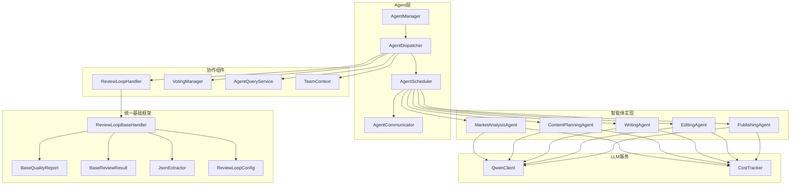
```mermaid
graph TB
subgraph "Agent层"
AM[AgentManager]
AD[AgentDispatcher]
CS[AgentScheduler]
AC[AgentCommunicator]
end
subgraph "智能体实现"
MA[MarketAnalysisAgent]
CPA[ContentPlanningAgent]
WA[WritingAgent]
EA[EditingAgent]
PA[PublishingAgent]
end
subgraph "协作组件"
RC[ReviewLoopHandler]
VM[VotingManager]
QS[AgentQueryService]
TC[TeamContext]
end
subgraph "统一基础框架"
RLH[ReviewLoopBaseHandler]
BQR[BaseQualityReport]
BRQ[BaseReviewResult]
JE[JsonExtractor]
RLC[ReviewLoopConfig]
end
subgraph "LLM服务"
QC[QwenClient]
CT[CostTracker]
end
AM --> AD
AD --> CS
CS --> AC
CS --> MA
CS --> CPA
CS --> WA
CS --> EA
CS --> PA
AD --> RC
AD --> VM
AD --> QS
AD --> TC
RC --> RLH
RLH --> BQR
RLH --> BRQ
RLH --> JE
RLH --> RLC
MA --> QC
CPA --> QC
WA --> QC
EA --> QC
PA --> QC
MA --> CT
CPA --> CT
WA --> CT
EA --> CT
PA --> CT
```

**图表来源**
- [agents/agent_manager.py](file://agents/agent_manager.py#L22-L227)
- [agents/agent_dispatcher.py](file://agents/agent_dispatcher.py#L17-L52)
- [agents/agent_scheduler.py](file://agents/agent_scheduler.py#L222-L240)
- [agents/base/__init__.py](file://agents/base/__init__.py#L1-L48)

**章节来源**
- [agents/__init__.py](file://agents/__init__.py#L1-L6)
- [pyproject.toml](file://pyproject.toml#L8-L37)

## 核心组件

### AgentManager - 智能体管理器

AgentManager是整个系统的中枢控制器，负责智能体的初始化、注册和生命周期管理。

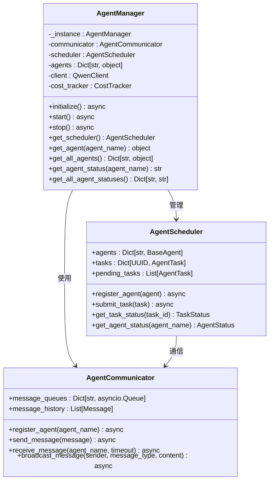
```mermaid
classDiagram
class AgentManager {
-_instance : AgentManager
-communicator : AgentCommunicator
-scheduler : AgentScheduler
-agents : Dict[str, object]
-client : QwenClient
-cost_tracker : CostTracker
+initialize() async
+start() async
+stop() async
+get_scheduler() AgentScheduler
+get_agent(agent_name) object
+get_all_agents() Dict[str, object]
+get_agent_status(agent_name) str
+get_all_agent_statuses() Dict[str, str]
}
class AgentCommunicator {
+message_queues : Dict[str, asyncio.Queue]
+message_history : List[Message]
+register_agent(agent_name) async
+send_message(message) async
+receive_message(agent_name, timeout) async
+broadcast_message(sender, message_type, content) async
}
class AgentScheduler {
+agents : Dict[str, BaseAgent]
+tasks : Dict[UUID, AgentTask]
+pending_tasks : List[AgentTask]
+register_agent(agent) async
+submit_task(task) async
+get_task_status(task_id) TaskStatus
+get_agent_status(agent_name) AgentStatus
}
AgentManager --> AgentCommunicator : 使用
AgentManager --> AgentScheduler : 管理
AgentScheduler --> AgentCommunicator : 通信
```

**图表来源**
- [agents/agent_manager.py](file://agents/agent_manager.py#L22-L227)
- [agents/agent_communicator.py](file://agents/agent_communicator.py#L100-L110)
- [agents/agent_scheduler.py](file://agents/agent_scheduler.py#L222-L240)

**章节来源**
- [agents/agent_manager.py](file://agents/agent_manager.py#L22-L227)
- [agents/agent_dispatcher.py](file://agents/agent_dispatcher.py#L17-L456)

## 架构概览

### 整体架构设计

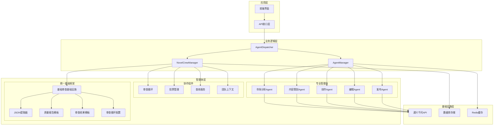
```mermaid
graph TB
subgraph "应用层"
API[API接口层]
Frontend[前端界面]
end
subgraph "业务逻辑层"
Crew[NovelCrewManager]
Dispatcher[AgentDispatcher]
Manager[AgentManager]
end
subgraph "智能体层"
subgraph "专业智能体"
Market[市场分析Agent]
Content[内容策划Agent]
Write[创作Agent]
Edit[编辑Agent]
Publish[发布Agent]
end
subgraph "协作组件"
Review[审查循环]
Vote[投票管理]
Query[查询服务]
Context[团队上下文]
end
subgraph "统一基础框架"
BaseInfra[基础审查基础设施]
JsonExt[JSON提取器]
QualityRep[质量报告模板]
ReviewRes[审查结果模板]
LoopCfg[审查循环配置]
end
end
subgraph "基础设施层"
LLM[通义千问API]
Storage[数据库存储]
Redis[Redis缓存]
end
API --> Dispatcher
Frontend --> API
Dispatcher --> Crew
Crew --> Review
Crew --> Vote
Crew --> Query
Crew --> Context
Crew --> BaseInfra
BaseInfra --> JsonExt
BaseInfra --> QualityRep
BaseInfra --> ReviewRes
BaseInfra --> LoopCfg
Dispatcher --> Manager
Manager --> Market
Manager --> Content
Manager --> Write
Manager --> Edit
Manager --> Publish
Market --> LLM
Content --> LLM
Write --> LLM
Edit --> LLM
Publish --> LLM
Crew --> Storage
Manager --> Redis
```

**图表来源**
- [agents/crew_manager.py](file://agents/crew_manager.py#L38-L154)
- [agents/agent_dispatcher.py](file://agents/agent_dispatcher.py#L17-L52)
- [agents/base/review_loop_base.py](file://agents/base/review_loop_base.py#L64-L115)

### 数据流架构

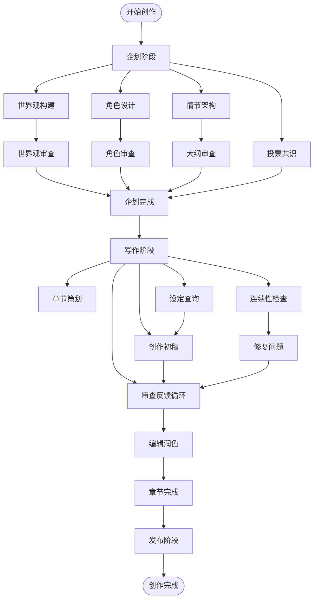
```mermaid
flowchart TD
Start([开始创作]) --> Planning[企划阶段]
Planning --> World[世界观构建]
Planning --> Characters[角色设计]
Planning --> Plot[情节架构]
Planning --> Voting[投票共识]
World --> ReviewWorld[世界观审查]
Characters --> ReviewChar[角色审查]
Plot --> ReviewPlot[大纲审查]
ReviewWorld --> PlanReady[企划完成]
ReviewChar --> PlanReady
ReviewPlot --> PlanReady
Voting --> PlanReady
PlanReady --> Writing[写作阶段]
Writing --> ChapterPlan[章节策划]
Writing --> Draft[创作初稿]
Writing --> Query[设定查询]
Writing --> ReviewLoop[审查反馈循环]
Writing --> Continuity[连续性检查]
Draft --> ReviewLoop
Query --> Draft
ReviewLoop --> EditContent[编辑润色]
Continuity --> FixIssues[修复问题]
EditContent --> WritingComplete[章节完成]
FixIssues --> ReviewLoop
WritingComplete --> Publish[发布阶段]
Publish --> End([创作完成])
```

**图表来源**
- [agents/crew_manager.py](file://agents/crew_manager.py#L286-L547)
- [agents/crew_manager.py](file://agents/crew_manager.py#L553-L800)

## 详细组件分析

### 智能体通信机制

Agent间的通信通过AgentCommunicator实现，支持多种消息类型和请求-响应模式。

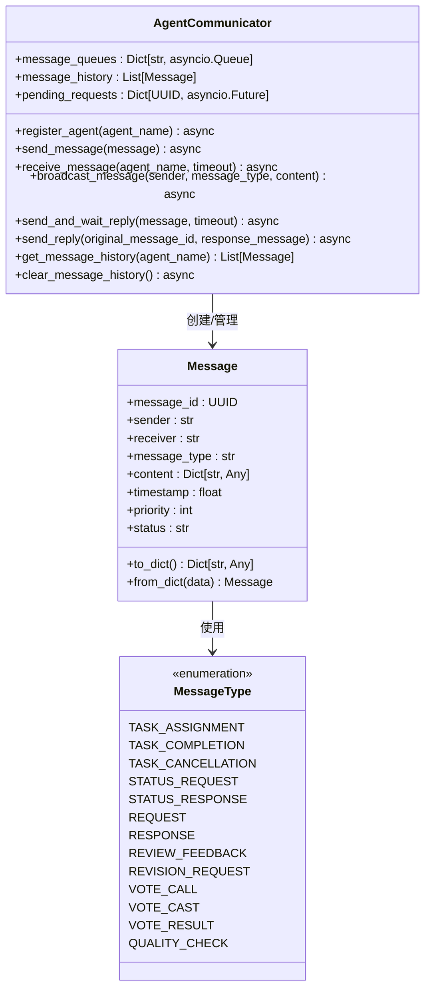
```mermaid
classDiagram
class Message {
+message_id : UUID
+sender : str
+receiver : str
+message_type : str
+content : Dict[str, Any]
+timestamp : float
+priority : int
+status : str
+to_dict() Dict[str, Any]
+from_dict(data) Message
}
class AgentCommunicator {
+message_queues : Dict[str, asyncio.Queue]
+message_history : List[Message]
+pending_requests : Dict[UUID, asyncio.Future]
+register_agent(agent_name) async
+send_message(message) async
+receive_message(agent_name, timeout) async
+broadcast_message(sender, message_type, content) async
+send_and_wait_reply(message, timeout) async
+send_reply(original_message_id, response_message) async
+get_message_history(agent_name) List[Message]
+clear_message_history() async
}
class MessageType {
<<enumeration>>
TASK_ASSIGNMENT
TASK_COMPLETION
TASK_CANCELLATION
STATUS_REQUEST
STATUS_RESPONSE
REQUEST
RESPONSE
REVIEW_FEEDBACK
REVISION_REQUEST
VOTE_CALL
VOTE_CAST
VOTE_RESULT
QUALITY_CHECK
}
AgentCommunicator --> Message : 创建/管理
Message --> MessageType : 使用
```

**图表来源**
- [agents/agent_communicator.py](file://agents/agent_communicator.py#L39-L98)
- [agents/agent_communicator.py](file://agents/agent_communicator.py#L13-L34)

**章节来源**
- [agents/agent_communicator.py](file://agents/agent_communicator.py#L100-L266)

### 任务调度系统

AgentScheduler实现了基于优先级的任务分配和依赖关系管理。

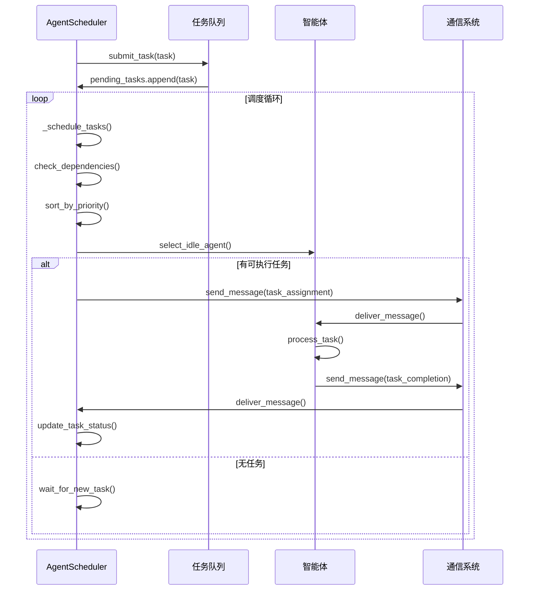
```mermaid
sequenceDiagram
participant Scheduler as AgentScheduler
participant Queue as 任务队列
participant Agent as 智能体
participant Comm as 通信系统
Scheduler->>Queue : submit_task(task)
Queue->>Scheduler : pending_tasks.append(task)
loop 调度循环
Scheduler->>Scheduler : _schedule_tasks()
Scheduler->>Scheduler : check_dependencies()
Scheduler->>Scheduler : sort_by_priority()
Scheduler->>Agent : select_idle_agent()
alt 有可执行任务
Scheduler->>Comm : send_message(task_assignment)
Comm->>Agent : deliver_message()
Agent->>Agent : process_task()
Agent->>Comm : send_message(task_completion)
Comm->>Scheduler : deliver_message()
Scheduler->>Scheduler : update_task_status()
else 无任务
Scheduler->>Scheduler : wait_for_new_task()
end
end
```

**图表来源**
- [agents/agent_scheduler.py](file://agents/agent_scheduler.py#L324-L379)
- [agents/agent_scheduler.py](file://agents/agent_scheduler.py#L284-L323)

**章节来源**
- [agents/agent_scheduler.py](file://agents/agent_scheduler.py#L222-L488)

### 审查反馈循环

ReviewLoopHandler实现了Writer-Editor的质量驱动迭代机制。

```mermaid
flowchart TD
Start([开始审查循环]) --> InitialDraft[获取初始草稿]
InitialDraft --> EditorReview[编辑审查评分]
EditorReview --> ScoreCheck{分数达标?}
ScoreCheck --> |否| WriterRevision[作家修订]
ScoreCheck --> |是| FinalContent[最终内容]
WriterRevision --> RevisionCheck{达到最大迭代?}
WriterRevision --> EditorReview
RevisionCheck --> |是| FinalContent
RevisionCheck --> |否| EditorReview
FinalContent --> ReviewComplete[审查循环完成]
```

**图表来源**
- [agents/review_loop.py](file://agents/review_loop.py#L113-L263)

**章节来源**
- [agents/review_loop.py](file://agents/review_loop.py#L91-L322)

### 投票共识机制

VotingManager支持多智能体视角的关键决策投票。

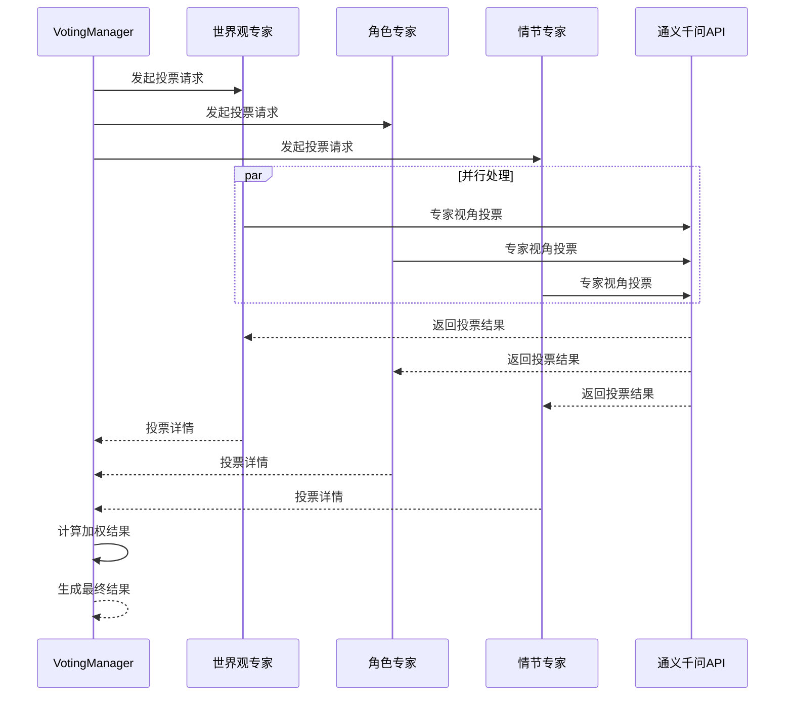
```mermaid
sequenceDiagram
participant Manager as VotingManager
participant World as 世界观专家
participant Char as 角色专家
participant Plot as 情节专家
participant LLM as 通义千问API
Manager->>World : 发起投票请求
Manager->>Char : 发起投票请求
Manager->>Plot : 发起投票请求
par 并行处理
World->>LLM : 专家视角投票
Char->>LLM : 专家视角投票
Plot->>LLM : 专家视角投票
end
LLM-->>World : 返回投票结果
LLM-->>Char : 返回投票结果
LLM-->>Plot : 返回投票结果
World-->>Manager : 投票详情
Char-->>Manager : 投票详情
Plot-->>Manager : 投票详情
Manager->>Manager : 计算加权结果
Manager-->>Manager : 生成最终结果
```

**图表来源**
- [agents/voting_manager.py](file://agents/voting_manager.py#L85-L140)
- [agents/voting_manager.py](file://agents/voting_manager.py#L142-L211)

**章节来源**
- [agents/voting_manager.py](file://agents/voting_manager.py#L74-L236)

### 设定查询服务

AgentQueryService实现智能体间的实时设定确认。

```mermaid
flowchart TD
QueryStart[作家遇到设定疑问] --> ParseTags[解析[QUERY]标记]
ParseTags --> ExtractQuestion[提取问题类型和内容]
ExtractQuestion --> GetRoleInfo[获取目标角色信息]
GetRoleInfo --> BuildPrompt[构建查询提示词]
BuildPrompt --> CallLLM[调用LLM回答]
CallLLM --> FormatAnswer[格式化回答]
FormatAnswer --> ReplaceText[替换原文中的标记]
ReplaceText --> ContinueWriting[继续创作]
QueryStart --> |无标记| ContinueWriting
```

**图表来源**
- [agents/agent_query_service.py](file://agents/agent_query_service.py#L100-L122)

**章节来源**
- [agents/agent_query_service.py](file://agents/agent_query_service.py#L23-L122)

### 团队上下文管理

TeamContext提供智能体间的共享状态和历史记录，现已具备完整的异步线程安全保障。

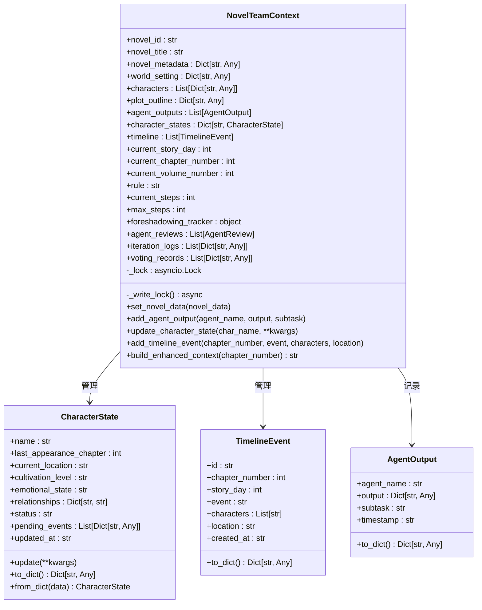
```mermaid
classDiagram
class NovelTeamContext {
+novel_id : str
+novel_title : str
+novel_metadata : Dict[str, Any]
+world_setting : Dict[str, Any]
+characters : List[Dict[str, Any]]
+plot_outline : Dict[str, Any]
+agent_outputs : List[AgentOutput]
+character_states : Dict[str, CharacterState]
+timeline : List[TimelineEvent]
+current_story_day : int
+current_chapter_number : int
+current_volume_number : int
+rule : str
+current_steps : int
+max_steps : int
+foreshadowing_tracker : object
+agent_reviews : List[AgentReview]
+iteration_logs : List[Dict[str, Any]]
+voting_records : List[Dict[str, Any]]
-_lock : asyncio.Lock
-_write_lock() async
+set_novel_data(novel_data)
+add_agent_output(agent_name, output, subtask)
+update_character_state(char_name, **kwargs)
+add_timeline_event(chapter_number, event, characters, location)
+build_enhanced_context(chapter_number) str
}
class CharacterState {
+name : str
+last_appearance_chapter : int
+current_location : str
+cultivation_level : str
+emotional_state : str
+relationships : Dict[str, str]
+status : str
+pending_events : List[Dict[str, Any]]
+updated_at : str
+update(**kwargs)
+to_dict() Dict[str, Any]
+from_dict(data) CharacterState
}
class TimelineEvent {
+id : str
+chapter_number : int
+story_day : int
+event : str
+characters : List[str]
+location : str
+created_at : str
+to_dict() Dict[str, Any]
}
class AgentOutput {
+agent_name : str
+output : Dict[str, Any]
+subtask : str
+timestamp : str
+to_dict() Dict[str, Any]
}
NovelTeamContext --> CharacterState : 管理
NovelTeamContext --> TimelineEvent : 管理
NovelTeamContext --> AgentOutput : 记录
```

**图表来源**
- [agents/team_context.py](file://agents/team_context.py#L155-L216)
- [agents/team_context.py](file://agents/team_context.py#L32-L79)

**章节来源**
- [agents/team_context.py](file://agents/team_context.py#L14-L493)

## 统一基础框架架构

### ReviewLoopBaseHandler - 审查循环处理器基类

ReviewLoopBaseHandler是统一的审查循环处理机制核心，采用模板方法模式封装Designer-Reviewer循环的通用逻辑。

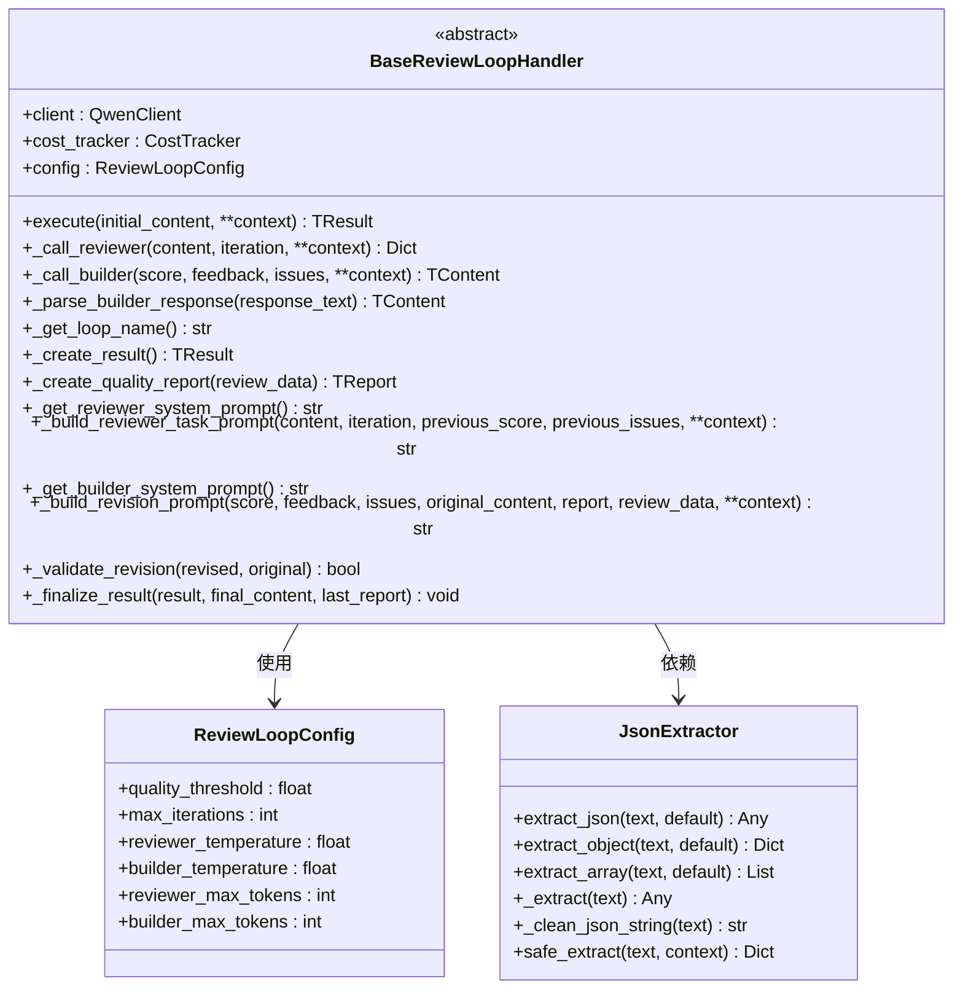
```mermaid
classDiagram
class BaseReviewLoopHandler {
<<abstract>>
+client : QwenClient
+cost_tracker : CostTracker
+config : ReviewLoopConfig
+execute(initial_content, **context) TResult
+_call_reviewer(content, iteration, **context) Dict
+_call_builder(score, feedback, issues, **context) TContent
+_parse_builder_response(response_text) TContent
+_get_loop_name() str
+_create_result() TResult
+_create_quality_report(review_data) TReport
+_get_reviewer_system_prompt() str
+_build_reviewer_task_prompt(content, iteration, previous_score, previous_issues, **context) str
+_get_builder_system_prompt() str
+_build_revision_prompt(score, feedback, issues, original_content, report, review_data, **context) str
+_validate_revision(revised, original) bool
+_finalize_result(result, final_content, last_report) void
}
class ReviewLoopConfig {
+quality_threshold : float
+max_iterations : int
+reviewer_temperature : float
+builder_temperature : float
+reviewer_max_tokens : int
+builder_max_tokens : int
}
class JsonExtractor {
+extract_json(text, default) Any
+extract_object(text, default) Dict
+extract_array(text, default) List
+_extract(text) Any
+_clean_json_string(text) str
+safe_extract(text, context) Dict
}
BaseReviewLoopHandler --> ReviewLoopConfig : 使用
BaseReviewLoopHandler --> JsonExtractor : 依赖
```

**图表来源**
- [agents/base/review_loop_base.py](file://agents/base/review_loop_base.py#L64-L115)
- [agents/base/review_loop_base.py](file://agents/base/review_loop_base.py#L38-L62)

### BaseQualityReport - 质量报告基类

BaseQualityReport提供所有审查循环共享的质量评估报告基础结构，支持多维度评分和问题追踪。

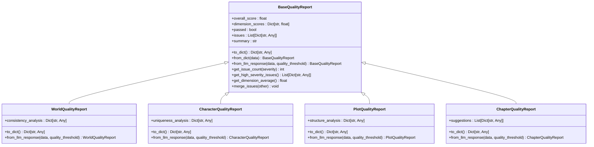
```mermaid
classDiagram
class BaseQualityReport {
+overall_score : float
+dimension_scores : Dict[str, float]
+passed : bool
+issues : List[Dict[str, Any]]
+summary : str
+to_dict() Dict[str, Any]
+from_dict(data) BaseQualityReport
+from_llm_response(data, quality_threshold) BaseQualityReport
+get_issue_count(severity) int
+get_high_severity_issues() List[Dict[str, Any]]
+get_dimension_average() float
+merge_issues(other) void
}
class WorldQualityReport {
+consistency_analysis : Dict[str, Any]
+to_dict() Dict[str, Any]
+from_llm_response(data, quality_threshold) WorldQualityReport
}
class CharacterQualityReport {
+uniqueness_analysis : Dict[str, Any]
+to_dict() Dict[str, Any]
+from_llm_response(data, quality_threshold) CharacterQualityReport
}
class PlotQualityReport {
+structure_analysis : Dict[str, Any]
+to_dict() Dict[str, Any]
+from_llm_response(data, quality_threshold) PlotQualityReport
}
class ChapterQualityReport {
+suggestions : List[Dict[str, Any]]
+to_dict() Dict[str, Any]
+from_llm_response(data, quality_threshold) ChapterQualityReport
}
BaseQualityReport <|-- WorldQualityReport
BaseQualityReport <|-- CharacterQualityReport
BaseQualityReport <|-- PlotQualityReport
BaseQualityReport <|-- ChapterQualityReport
```

**图表来源**
- [agents/base/quality_report.py](file://agents/base/quality_report.py#L44-L100)
- [agents/base/quality_report.py](file://agents/base/quality_report.py#L192-L222)

### BaseReviewResult - 审查结果基类

BaseReviewResult提供统一的审查结果数据结构，支持不同类型的最终输出（字符串/字典/列表）。

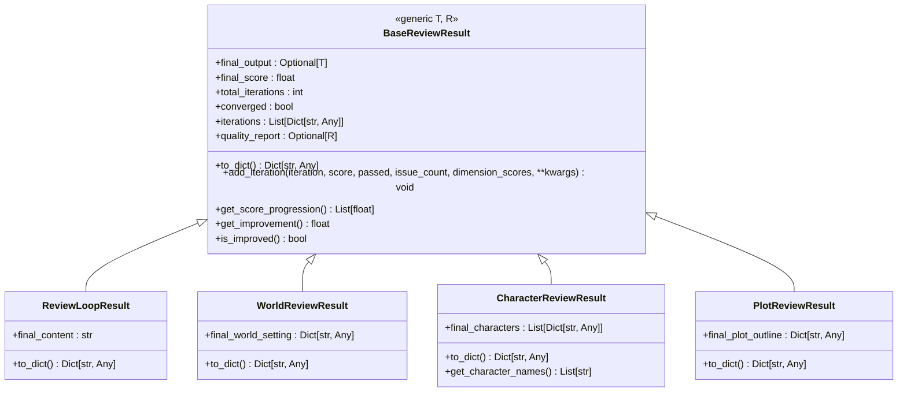
```mermaid
classDiagram
class BaseReviewResult {
<<generic T, R>>
+final_output : Optional[T]
+final_score : float
+total_iterations : int
+converged : bool
+iterations : List[Dict[str, Any]]
+quality_report : Optional[R]
+to_dict() Dict[str, Any]
+add_iteration(iteration, score, passed, issue_count, dimension_scores, **kwargs) void
+get_score_progression() List[float]
+get_improvement() float
+is_improved() bool
}
class ReviewLoopResult {
+final_content : str
+to_dict() Dict[str, Any]
}
class WorldReviewResult {
+final_world_setting : Dict[str, Any]
+to_dict() Dict[str, Any]
}
class CharacterReviewResult {
+final_characters : List[Dict[str, Any]]
+to_dict() Dict[str, Any]
+get_character_names() List[str]
}
class PlotReviewResult {
+final_plot_outline : Dict[str, Any]
+to_dict() Dict[str, Any]
}
BaseReviewResult <|-- ReviewLoopResult
BaseReviewResult <|-- WorldReviewResult
BaseReviewResult <|-- CharacterReviewResult
BaseReviewResult <|-- PlotReviewResult
```

**图表来源**
- [agents/base/review_result.py](file://agents/base/review_result.py#L23-L58)
- [agents/base/review_result.py](file://agents/base/review_result.py#L129-L151)

### 具体审查循环实现

#### 世界审查循环

WorldReviewHandler实现世界观设计的深度和一致性审查，支持内在一致性、深度广度、独特性、可扩展性、力量体系完整性等维度评估。

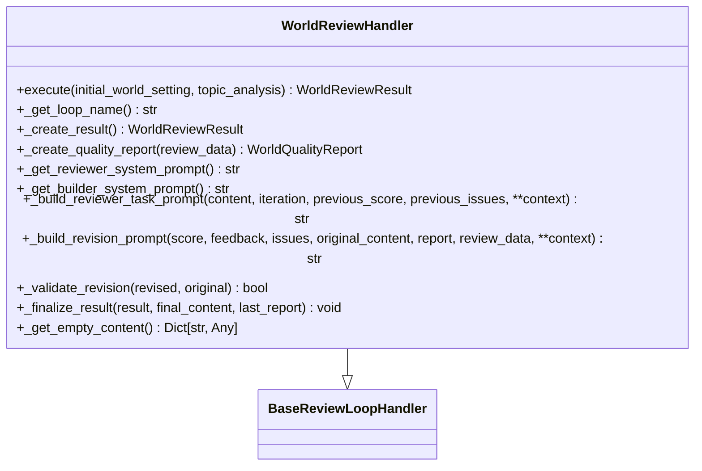
```mermaid
classDiagram
class WorldReviewHandler {
+execute(initial_world_setting, topic_analysis) WorldReviewResult
+_get_loop_name() str
+_create_result() WorldReviewResult
+_create_quality_report(review_data) WorldQualityReport
+_get_reviewer_system_prompt() str
+_get_builder_system_prompt() str
+_build_reviewer_task_prompt(content, iteration, previous_score, previous_issues, **context) str
+_build_revision_prompt(score, feedback, issues, original_content, report, review_data, **context) str
+_validate_revision(revised, original) bool
+_finalize_result(result, final_content, last_report) void
+_get_empty_content() Dict[str, Any]
}
WorldReviewHandler --|> BaseReviewLoopHandler
```

**图表来源**
- [agents/world_review_loop.py](file://agents/world_review_loop.py#L171-L204)

**章节来源**
- [agents/base/review_loop_base.py](file://agents/base/review_loop_base.py#L64-L115)
- [agents/base/quality_report.py](file://agents/base/quality_report.py#L44-L100)
- [agents/base/review_result.py](file://agents/base/review_result.py#L23-L58)
- [agents/world_review_loop.py](file://agents/world_review_loop.py#L171-L204)

## 线程安全改进

### 异步上下文管理器

团队上下文管理器现已集成完整的异步线程安全保障机制：

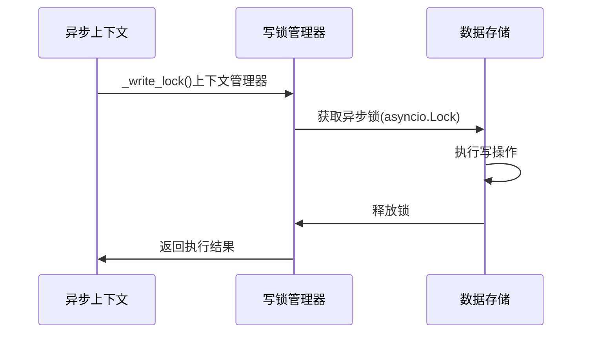
```mermaid
sequenceDiagram
participant AsyncContext as 异步上下文
participant LockManager as 写锁管理器
participant DataStore as 数据存储
AsyncContext->>LockManager : _write_lock()上下文管理器
LockManager->>DataStore : 获取异步锁(asyncio.Lock)
DataStore->>DataStore : 执行写操作
DataStore->>LockManager : 释放锁
LockManager->>AsyncContext : 返回执行结果
```

**图表来源**
- [agents/team_context.py](file://agents/team_context.py#L232-L236)

### 写锁机制

所有写操作现在都通过异步锁保护，确保并发安全性：

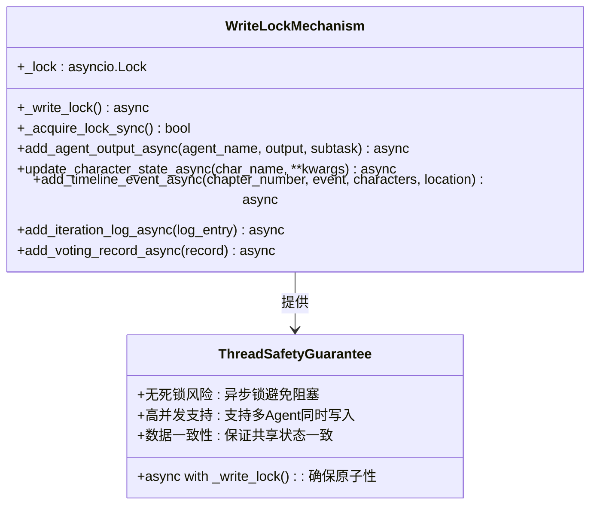
```mermaid
classDiagram
class WriteLockMechanism {
+_lock : asyncio.Lock
+_write_lock() async
+_acquire_lock_sync() bool
+add_agent_output_async(agent_name, output, subtask) async
+update_character_state_async(char_name, **kwargs) async
+add_timeline_event_async(chapter_number, event, characters, location) async
+add_iteration_log_async(log_entry) async
+add_voting_record_async(record) async
}
class ThreadSafetyGuarantee {
+async with _write_lock() : 确保原子性
+无死锁风险 : 异步锁避免阻塞
+高并发支持 : 支持多Agent同时写入
+数据一致性 : 保证共享状态一致
}
WriteLockMechanism --> ThreadSafetyGuarantee : 提供
```

**图表来源**
- [agents/team_context.py](file://agents/team_context.py#L232-L236)
- [agents/team_context.py](file://agents/team_context.py#L299-L305)

**章节来源**
- [agents/team_context.py](file://agents/team_context.py#L232-L305)
- [agents/team_context.py](file://agents/team_context.py#L332-L339)
- [agents/team_context.py](file://agents/team_context.py#L391-L402)

### 任务调度系统依赖检查重构

任务调度系统的依赖检查逻辑已重构，提供更详细的错误报告和依赖状态监控：

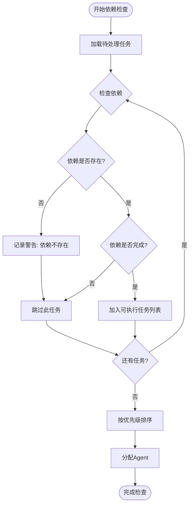
```mermaid
flowchart TD
Start([开始依赖检查]) --> LoadTask[加载待处理任务]
LoadTask --> CheckDeps{检查依赖}
CheckDeps --> DepExists{依赖是否存在?}
DepExists --> |否| LogWarning[记录警告: 依赖不存在]
DepExists --> |是| DepCompleted{依赖是否完成?}
DepCompleted --> |否| SkipTask[跳过此任务]
DepCompleted --> |是| AddToExecutable[加入可执行任务列表]
LogWarning --> SkipTask
SkipTask --> NextTask{还有任务?}
AddToExecutable --> NextTask
NextTask --> |是| CheckDeps
NextTask --> |否| SortByPriority[按优先级排序]
SortByPriority --> AssignAgents[分配Agent]
AssignAgents --> End([完成检查])
```

**图表来源**
- [agents/agent_scheduler.py](file://agents/agent_scheduler.py#L335-L350)

**章节来源**
- [agents/agent_scheduler.py](file://agents/agent_scheduler.py#L335-L350)

## JSON解析错误处理增强

### JsonExtractor统一工具

新增的JsonExtractor类提供了统一的JSON提取和错误处理机制：

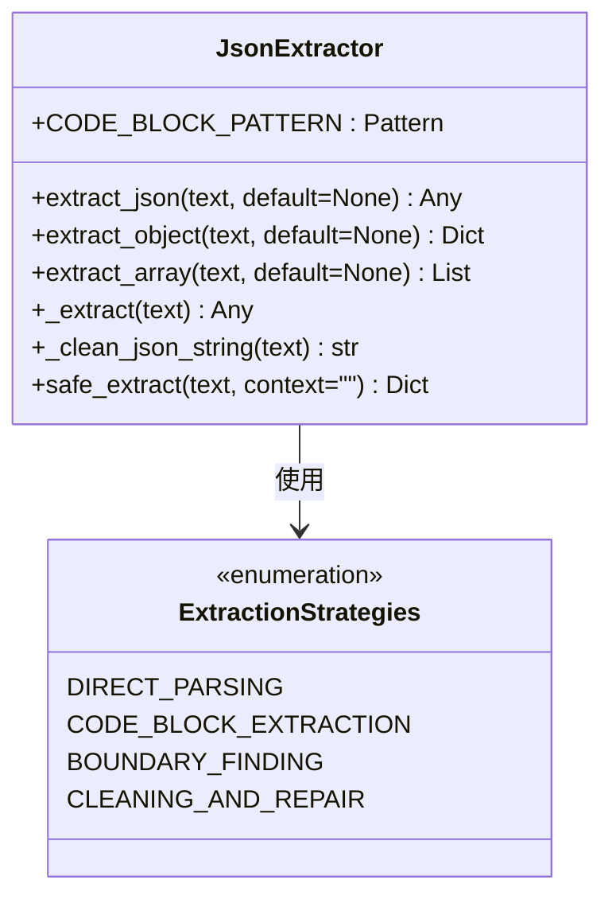
```mermaid
classDiagram
class JsonExtractor {
+CODE_BLOCK_PATTERN : Pattern
+extract_json(text, default=None) Any
+extract_object(text, default=None) Dict
+extract_array(text, default=None) List
+_extract(text) Any
+_clean_json_string(text) str
+safe_extract(text, context="") Dict
}
class ExtractionStrategies {
<<enumeration>>
DIRECT_PARSING
CODE_BLOCK_EXTRACTION
BOUNDARY_FINDING
CLEANING_AND_REPAIR
}
JsonExtractor --> ExtractionStrategies : 使用
```

**图表来源**
- [agents/base/json_extractor.py](file://agents/base/json_extractor.py#L16-L30)

### 增强的crew管理器JSON处理

NovelCrewManager现在集成了多层JSON解析保护机制：

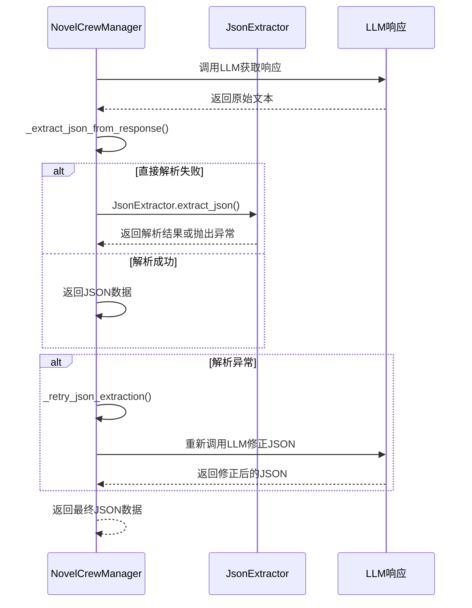
```mermaid
sequenceDiagram
participant CrewManager as NovelCrewManager
participant JsonExtractor as JsonExtractor
participant LLMResponse as LLM响应
CrewManager->>LLMResponse : 调用LLM获取响应
LLMResponse-->>CrewManager : 返回原始文本
CrewManager->>CrewManager : _extract_json_from_response()
alt 直接解析失败
CrewManager->>JsonExtractor : JsonExtractor.extract_json()
JsonExtractor-->>CrewManager : 返回解析结果或抛出异常
else 解析成功
CrewManager->>CrewManager : 返回JSON数据
end
alt 解析异常
CrewManager->>CrewManager : _retry_json_extraction()
CrewManager->>LLMResponse : 重新调用LLM修正JSON
LLMResponse-->>CrewManager : 返回修正后的JSON
end
CrewManager-->>CrewManager : 返回最终JSON数据
```

**图表来源**
- [agents/crew_manager.py](file://agents/crew_manager.py#L155-L221)
- [agents/crew_manager.py](file://agents/crew_manager.py#L292-L337)

**章节来源**
- [agents/base/json_extractor.py](file://agents/base/json_extractor.py#L36-L157)
- [agents/crew_manager.py](file://agents/crew_manager.py#L155-L221)
- [agents/crew_manager.py](file://agents/crew_manager.py#L292-L337)

## 依赖关系分析

### 外部依赖关系

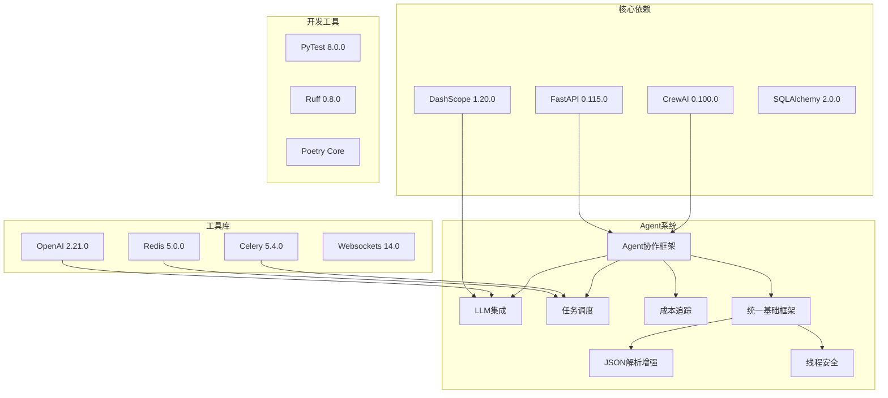
```mermaid
graph TB
subgraph "核心依赖"
FastAPI[FastAPI 0.115.0]
CrewAI[CrewAI 0.100.0]
DashScope[DashScope 1.20.0]
SQLAlchemy[SQLAlchemy 2.0.0]
end
subgraph "工具库"
Redis[Redis 5.0.0]
Celery[Celery 5.4.0]
OpenAI[OpenAI 2.21.0]
Websockets[Websockets 14.0]
end
subgraph "开发工具"
PyTest[PyTest 8.0.0]
Ruff[Ruff 0.8.0]
Poetry[Poetry Core]
end
subgraph "Agent系统"
AgentSystem[Agent协作框架]
LLMIntegration[LLM集成]
TaskScheduler[任务调度]
CostTracking[成本追踪]
BaseFramework[统一基础框架]
JsonParsing[JSON解析增强]
ThreadSafety[线程安全]
end
FastAPI --> AgentSystem
CrewAI --> AgentSystem
DashScope --> LLMIntegration
Redis --> TaskScheduler
Celery --> TaskScheduler
OpenAI --> LLMIntegration
AgentSystem --> CostTracking
AgentSystem --> TaskScheduler
AgentSystem --> LLMIntegration
AgentSystem --> BaseFramework
BaseFramework --> JsonParsing
BaseFramework --> ThreadSafety
```

**图表来源**
- [pyproject.toml](file://pyproject.toml#L8-L37)

**章节来源**
- [pyproject.toml](file://pyproject.toml#L1-L64)

### 内部模块依赖

```mermaid
graph LR
subgraph "Agent层"
AgentManager[agent_manager.py]
AgentDispatcher[agent_dispatcher.py]
AgentScheduler[agent_scheduler.py]
AgentCommunicator[agent_communicator.py]
end
subgraph "智能体实现"
SpecificAgents[specific_agents.py]
CrewManager[crew_manager.py]
end
subgraph "协作组件"
ReviewLoop[review_loop.py]
VotingManager[voting_manager.py]
AgentQuery[agent_query_service.py]
TeamContext[team_context.py]
end
subgraph "统一基础框架"
BaseFramework[agents/base/]
JsonExtractor[json_extractor.py]
ReviewLoopBase[review_loop_base.py]
QualityReport[quality_report.py]
ReviewResult[review_result.py]
WorldReview[world_review_loop.py]
end
subgraph "LLM服务"
QwenClient[qwen_client.py]
CostTracker[cost_tracker.py]
end
AgentManager --> AgentDispatcher
AgentDispatcher --> AgentScheduler
AgentScheduler --> AgentCommunicator
AgentScheduler --> SpecificAgents
AgentDispatcher --> CrewManager
CrewManager --> ReviewLoop
CrewManager --> VotingManager
CrewManager --> AgentQuery
CrewManager --> TeamContext
CrewManager --> BaseFramework
BaseFramework --> JsonExtractor
BaseFramework --> ReviewLoopBase
BaseFramework --> QualityReport
BaseFramework --> ReviewResult
BaseFramework --> WorldReview
CrewManager --> QwenClient
CrewManager --> CostTracker
SpecificAgents --> QwenClient
SpecificAgents --> CostTracker
```

**图表来源**
- [agents/agent_manager.py](file://agents/agent_manager.py#L6-L19)
- [agents/crew_manager.py](file://agents/crew_manager.py#L14-L28)

## 性能考虑

### 成本优化策略

1. **智能体复用**：AgentManager使用单例模式避免重复创建
2. **批量处理**：支持批量写作和任务提交减少通信开销
3. **成本追踪**：实时监控和统计LLM API调用成本
4. **缓存机制**：TeamContext缓存章节摘要和内容
5. **异步优化**：异步上下文管理器减少锁竞争
6. **统一框架复用**：基础框架组件支持多类型审查循环复用

### 并发处理

1. **异步编程**：所有LLM调用和任务处理都是异步的
2. **消息队列**：使用asyncio.Queue实现高效的异步通信
3. **并行投票**：投票管理器支持多智能体并行投票
4. **流式输出**：支持LLM流式响应减少延迟
5. **线程安全**：异步锁确保多Agent并发写入的安全性
6. **审查循环并发**：多个审查循环可并行执行互不影响

### 资源管理

1. **连接池**：DashScope API使用连接池优化性能
2. **重试机制**：自动重试失败的API调用
3. **超时控制**：合理的超时设置避免资源泄露
4. **内存管理**：定期清理消息历史和临时数据
5. **锁管理**：异步锁避免死锁和阻塞问题
6. **成本追踪**：统一的成本追踪机制监控资源消耗

## 故障排除指南

### 常见问题及解决方案

#### LLM API调用失败

**问题症状**：智能体执行过程中出现API调用异常

**排查步骤**：
1. 检查API密钥配置
2. 验证网络连接状态
3. 查看重试日志和错误信息
4. 检查配额限制

**解决方案**：
- 配置正确的API密钥和基础URL
- 实现指数退避重试策略
- 监控API使用量和配额

#### 智能体通信异常

**问题症状**：智能体间消息传递失败或超时

**排查步骤**：
1. 检查AgentCommunicator状态
2. 验证消息队列是否正常
3. 查看消息历史记录
4. 检查异步事件循环状态

**解决方案**：
- 确保所有智能体正确注册到通信系统
- 实现消息确认机制
- 添加超时处理和重试逻辑

#### 任务调度问题

**问题症状**：任务无法按时执行或死锁

**排查步骤**：
1. 检查任务依赖关系
2. 验证智能体状态
3. 查看任务队列状态
4. 检查锁竞争情况

**解决方案**：
- 简化任务依赖关系
- 实现任务超时机制
- 优化智能体状态管理

#### JSON解析失败

**问题症状**：审查循环或写作阶段出现JSON解析错误

**排查步骤**：
1. 检查LLM响应格式
2. 验证JsonExtractor配置
3. 查看重试机制日志
4. 检查提示词格式

**解决方案**：
- 使用JsonExtractor的多策略解析
- 实现重试和修正机制
- 确保提示词输出规范JSON格式

#### 线程安全问题

**问题症状**：并发环境下数据不一致或竞态条件

**排查步骤**：
1. 检查异步锁使用
2. 验证写操作保护
3. 查看并发访问日志
4. 检查上下文管理器

**解决方案**：
- 确保所有写操作使用_async方法
- 使用_write_lock()上下文管理器
- 避免在异步上下文中使用同步方法
- 实现适当的错误处理和恢复机制

#### 任务依赖检查异常

**问题症状**：任务调度器无法正确识别依赖状态

**排查步骤**：
1. 检查依赖任务ID格式
2. 验证依赖任务状态
3. 查看依赖检查日志
4. 检查任务存储状态

**解决方案**：
- 确保依赖任务ID格式正确
- 验证依赖任务已完成状态
- 使用增强的日志记录机制
- 实现依赖状态监控和报告

#### 审查循环异常

**问题症状**：审查循环无法正常结束或陷入死循环

**排查步骤**：
1. 检查质量阈值设置
2. 验证迭代次数限制
3. 查看评分变化趋势
4. 检查问题收集逻辑

**解决方案**：
- 调整质量阈值和迭代次数
- 实现评分停滞检测
- 优化问题收集和反馈机制
- 添加循环超时保护

**章节来源**
- [agents/agent_communicator.py](file://agents/agent_communicator.py#L141-L165)
- [agents/agent_scheduler.py](file://agents/agent_scheduler.py#L380-L404)
- [agents/base/json_extractor.py](file://agents/base/json_extractor.py#L100-L157)
- [agents/team_context.py](file://agents/team_context.py#L232-L236)
- [agents/base/review_loop_base.py](file://agents/base/review_loop_base.py#L145-L262)

## 结论

Agent协作框架提供了一个完整的小说生成解决方案，通过模块化的智能体设计和强大的协作机制，实现了从创意到发布的全流程自动化。系统的主要优势包括：

1. **高度模块化**：每个智能体职责明确，便于维护和扩展
2. **灵活的协作模式**：支持多种智能体协作方式和执行策略
3. **完善的监控机制**：实时的成本追踪和性能监控
4. **强大的扩展性**：易于添加新的智能体和功能模块
5. **线程安全保障**：异步上下文管理和写锁机制确保并发安全性
6. **统一的JSON处理**：JsonExtractor提供可靠的JSON解析和错误处理
7. **标准化的审查循环**：统一的基础框架模块提供可复用的审查基础设施

**重大改进总结**：
- **统一基础框架**：新增ReviewLoopBaseHandler、BaseQualityReport、JsonExtractor等核心组件，形成标准化的审查循环处理机制
- **模板方法模式**：采用模板方法模式封装通用的审查循环逻辑，子类只需实现特定领域的方法
- **泛型设计**：支持不同类型的内容、结果和报告，提高代码复用性
- **多维度质量评估**：提供标准化的质量报告模板，支持不同领域的审查需求
- **增强的JSON解析**：JsonExtractor提供多种策略的JSON提取和错误处理机制
- **重构的任务调度**：依赖检查逻辑重构，提供更详细的错误报告和依赖状态监控
- **异步线程安全**：团队上下文系统新增异步线程安全支持，包括写锁机制和异步方法

未来可以考虑的改进方向：
- 增强智能体间的上下文共享能力
- 优化大规模并发场景下的性能
- 添加更多的创作风格和模板支持
- 实现更智能的任务路由和负载均衡
- 扩展基础框架模块以支持更多类型的审查循环
- 集成机器学习模型进行智能的审查循环参数调优
- 增强任务依赖的动态调整和优化能力

该框架为AI驱动的内容创作提供了坚实的技术基础，适合进一步开发和定制化应用。