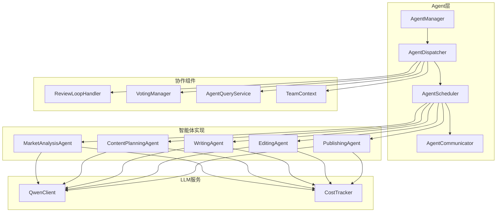
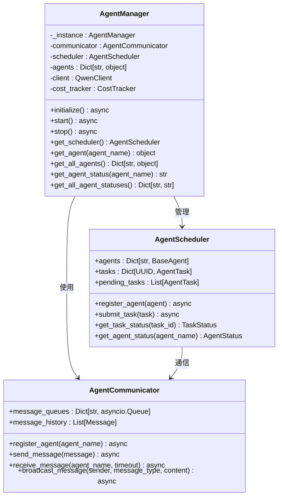
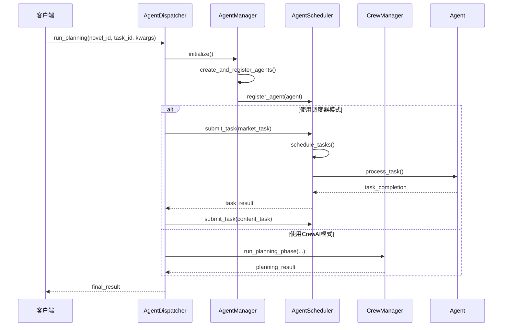
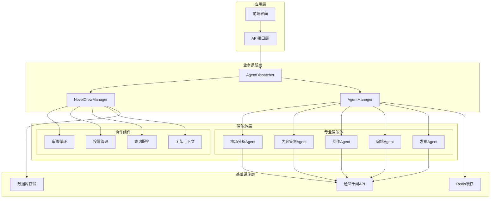
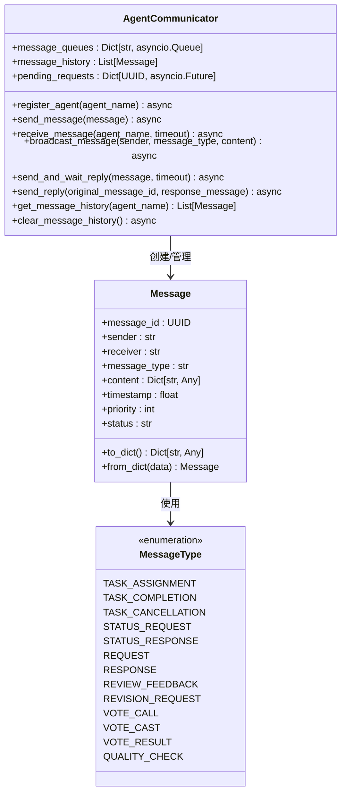
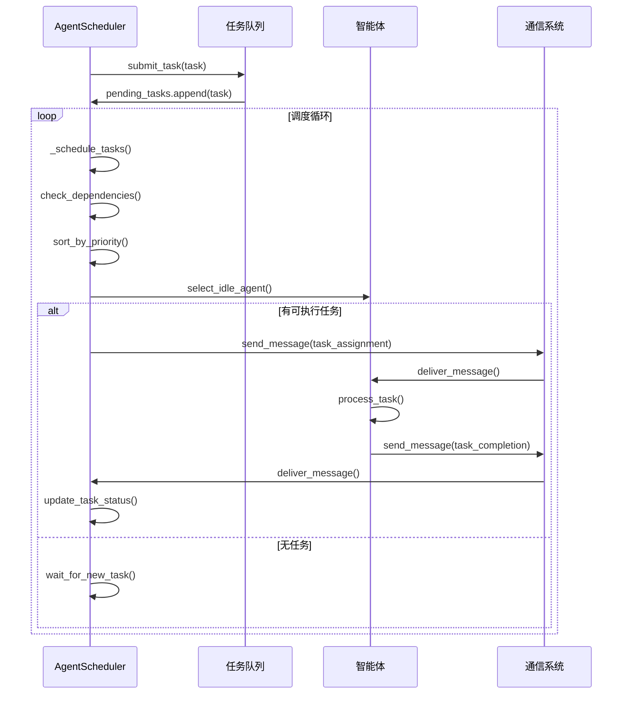
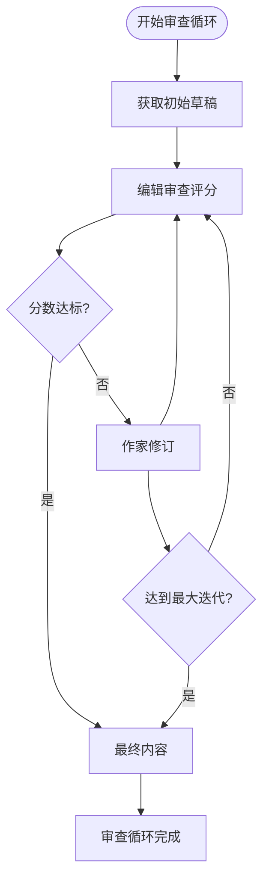
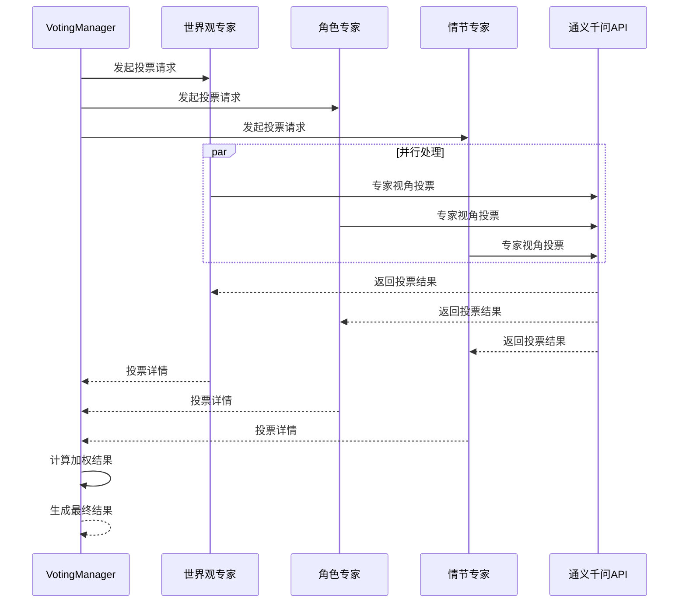
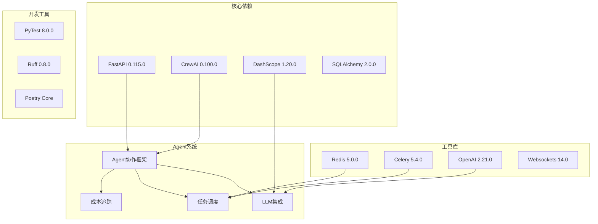
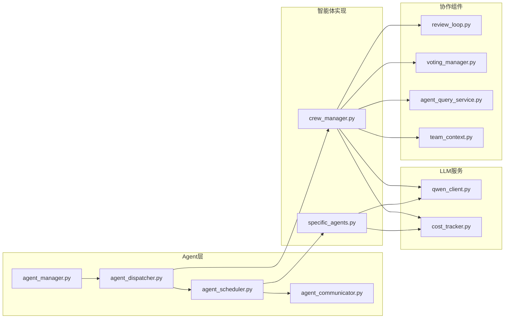

# Agent协作框架

<cite>
**本文档引用的文件**
- [agents/__init__.py](file://agents/__init__.py)
- [agents/agent_manager.py](file://agents/agent_manager.py)
- [agents/agent_dispatcher.py](file://agents/agent_dispatcher.py)
- [agents/crew_manager.py](file://agents/crew_manager.py)
- [agents/team_context.py](file://agents/team_context.py)
- [agents/specific_agents.py](file://agents/specific_agents.py)
- [agents/agent_scheduler.py](file://agents/agent_scheduler.py)
- [agents/agent_communicator.py](file://agents/agent_communicator.py)
- [agents/review_loop.py](file://agents/review_loop.py)
- [agents/voting_manager.py](file://agents/voting_manager.py)
- [agents/agent_query_service.py](file://agents/agent_query_service.py)
- [llm/qwen_client.py](file://llm/qwen_client.py)
- [llm/cost_tracker.py](file://llm/cost_tracker.py)
- [scripts/start_agents.py](file://scripts/start_agents.py)
- [pyproject.toml](file://pyproject.toml)
</cite>

## 目录
1. [简介](#简介)
2. [项目结构](#项目结构)
3. [核心组件](#核心组件)
4. [架构概览](#架构概览)
5. [详细组件分析](#详细组件分析)
6. [依赖关系分析](#依赖关系分析)
7. [性能考虑](#性能考虑)
8. [故障排除指南](#故障排除指南)
9. [结论](#结论)

## 简介

Agent协作框架是一个基于 CrewAI 风格的小说生成系统，通过多个智能体（Agent）的协作来实现从企划到发布的完整小说创作流程。该框架采用模块化设计，支持灵活的任务调度和智能体间的通信协作。

系统的核心特点包括：
- **多智能体协作**：市场分析、内容策划、创作、编辑、发布等多个专业智能体
- **任务调度系统**：支持基于优先级的任务分配和依赖关系管理
- **成本追踪**：实时监控和统计 LLM API 调用的成本
- **审查反馈循环**：Writer-Editor 质量驱动的迭代改进机制
- **投票共识机制**：多智能体视角的关键决策投票系统
- **设定查询服务**：智能体间的实时设定确认和协商

## 项目结构



**图表来源**
- [agents/agent_manager.py](file://agents/agent_manager.py#L22-L227)
- [agents/agent_dispatcher.py](file://agents/agent_dispatcher.py#L17-L52)
- [agents/agent_scheduler.py](file://agents/agent_scheduler.py#L222-L240)

**章节来源**
- [agents/__init__.py](file://agents/__init__.py#L1-L6)
- [pyproject.toml](file://pyproject.toml#L8-L37)

## 核心组件

### AgentManager - 智能体管理器

AgentManager 是整个系统的中枢控制器，负责智能体的初始化、注册和生命周期管理。



**图表来源**
- [agents/agent_manager.py](file://agents/agent_manager.py#L22-L227)
- [agents/agent_communicator.py](file://agents/agent_communicator.py#L100-L110)
- [agents/agent_scheduler.py](file://agents/agent_scheduler.py#L222-L240)

### AgentDispatcher - 智能体调度器

AgentDispatcher 提供统一的接口来协调不同类型的智能体执行流程，支持 CrewAI 风格和基于调度器的两种执行模式。



**图表来源**
- [agents/agent_dispatcher.py](file://agents/agent_dispatcher.py#L74-L89)
- [agents/agent_dispatcher.py](file://agents/agent_dispatcher.py#L90-L184)

**章节来源**
- [agents/agent_manager.py](file://agents/agent_manager.py#L22-L227)
- [agents/agent_dispatcher.py](file://agents/agent_dispatcher.py#L17-L456)

## 架构概览

### 整体架构设计



**图表来源**
- [agents/crew_manager.py](file://agents/crew_manager.py#L38-L154)
- [agents/agent_dispatcher.py](file://agents/agent_dispatcher.py#L17-L52)

### 数据流架构


**图表来源**
- [agents/crew_manager.py](file://agents/crew_manager.py#L286-L547)
- [agents/crew_manager.py](file://agents/crew_manager.py#L553-L800)

## 详细组件分析

### 智能体通信机制

Agent 间的通信通过 AgentCommunicator 实现，支持多种消息类型和请求-响应模式。



**图表来源**
- [agents/agent_communicator.py](file://agents/agent_communicator.py#L39-L98)
- [agents/agent_communicator.py](file://agents/agent_communicator.py#L13-L34)

**章节来源**
- [agents/agent_communicator.py](file://agents/agent_communicator.py#L100-L266)

### 任务调度系统

AgentScheduler 实现了基于优先级的任务分配和依赖关系管理。



**图表来源**
- [agents/agent_scheduler.py](file://agents/agent_scheduler.py#L324-L379)
- [agents/agent_scheduler.py](file://agents/agent_scheduler.py#L284-L323)

**章节来源**
- [agents/agent_scheduler.py](file://agents/agent_scheduler.py#L222-L488)

### 审查反馈循环

ReviewLoopHandler 实现了 Writer-Editor 的质量驱动迭代机制。



**图表来源**
- [agents/review_loop.py](file://agents/review_loop.py#L113-L263)

**章节来源**
- [agents/review_loop.py](file://agents/review_loop.py#L91-L322)

### 投票共识机制

VotingManager 支持多智能体视角的关键决策投票。



**图表来源**
- [agents/voting_manager.py](file://agents/voting_manager.py#L85-L140)
- [agents/voting_manager.py](file://agents/voting_manager.py#L142-L211)

**章节来源**
- [agents/voting_manager.py](file://agents/voting_manager.py#L74-L236)

### 设定查询服务

AgentQueryService 实现智能体间的实时设定确认。

```mermaid
flowchart TD
QueryStart[作家遇到设定疑问] --> ParseTags[解析[QUERY]标记]
ParseTags --> ExtractQuestion[提取问题类型和内容]
ExtractQuestion --> GetRoleInfo[获取目标角色信息]
GetRoleInfo --> BuildPrompt[构建查询提示词]
BuildPrompt --> CallLLM[调用LLM回答]
CallLLM --> FormatAnswer[格式化回答]
FormatAnswer --> ReplaceText[替换原文中的标记]
ReplaceText --> ContinueWriting[继续创作]
QueryStart --> |无标记| ContinueWriting
```

**图表来源**
- [agents/agent_query_service.py](file://agents/agent_query_service.py#L100-L122)

**章节来源**
- [agents/agent_query_service.py](file://agents/agent_query_service.py#L23-L122)

### 团队上下文管理

TeamContext 提供智能体间的共享状态和历史记录。


**图表来源**
- [agents/team_context.py](file://agents/team_context.py#L155-L216)
- [agents/team_context.py](file://agents/team_context.py#L32-L79)

**章节来源**
- [agents/team_context.py](file://agents/team_context.py#L14-L493)

## 依赖关系分析

### 外部依赖关系



**图表来源**
- [pyproject.toml](file://pyproject.toml#L8-L37)

**章节来源**
- [pyproject.toml](file://pyproject.toml#L1-L64)

### 内部模块依赖



**图表来源**
- [agents/agent_manager.py](file://agents/agent_manager.py#L6-L19)
- [agents/crew_manager.py](file://agents/crew_manager.py#L14-L28)

## 性能考虑

### 成本优化策略

1. **智能体复用**：AgentManager 使用单例模式避免重复创建
2. **批量处理**：支持批量写作和任务提交减少通信开销
3. **成本追踪**：实时监控和统计 LLM API 调用成本
4. **缓存机制**：TeamContext 缓存章节摘要和内容

### 并发处理

1. **异步编程**：所有 LLM 调用和任务处理都是异步的
2. **消息队列**：使用 asyncio.Queue 实现高效的异步通信
3. **并行投票**：投票管理器支持多智能体并行投票
4. **流式输出**：支持 LLM 流式响应减少延迟

### 资源管理

1. **连接池**：DashScope API 使用连接池优化性能
2. **重试机制**：自动重试失败的 API 调用
3. **超时控制**：合理的超时设置避免资源泄露
4. **内存管理**：定期清理消息历史和临时数据

## 故障排除指南

### 常见问题及解决方案

#### LLM API 调用失败

**问题症状**：智能体执行过程中出现 API 调用异常

**排查步骤**：
1. 检查 API 密钥配置
2. 验证网络连接状态
3. 查看重试日志和错误信息
4. 检查配额限制

**解决方案**：
- 配置正确的 API 密钥和基础 URL
- 实现指数退避重试策略
- 监控 API 使用量和配额

#### 智能体通信异常

**问题症状**：智能体间消息传递失败或超时

**排查步骤**：
1. 检查 AgentCommunicator 状态
2. 验证消息队列是否正常
3. 查看消息历史记录
4. 检查异步事件循环状态

**解决方案**：
- 确保所有智能体正确注册到通信系统
- 实现消息确认机制
- 添加超时处理和重试逻辑

#### 任务调度问题

**问题症状**：任务无法按时执行或死锁

**排查步骤**：
1. 检查任务依赖关系
2. 验证智能体状态
3. 查看任务队列状态
4. 检查锁竞争情况

**解决方案**：
- 简化任务依赖关系
- 实现任务超时机制
- 优化智能体状态管理

**章节来源**
- [agents/agent_communicator.py](file://agents/agent_communicator.py#L141-L165)
- [agents/agent_scheduler.py](file://agents/agent_scheduler.py#L380-L404)

## 结论

Agent协作框架提供了一个完整的小说生成解决方案，通过模块化的智能体设计和强大的协作机制，实现了从创意到发布的全流程自动化。系统的主要优势包括：

1. **高度模块化**：每个智能体职责明确，便于维护和扩展
2. **灵活的协作模式**：支持多种智能体协作方式和执行策略
3. **完善的监控机制**：实时的成本追踪和性能监控
4. **强大的扩展性**：易于添加新的智能体和功能模块

未来可以考虑的改进方向：
- 增强智能体间的上下文共享能力
- 优化大规模并发场景下的性能
- 添加更多的创作风格和模板支持
- 实现更智能的任务路由和负载均衡

该框架为 AI 驱动的内容创作提供了坚实的技术基础，适合进一步开发和定制化应用。