# Agent管理器核心

<cite>
**本文引用的文件**
- [agent_manager.py](file://agents/agent_manager.py)
- [agent_communicator.py](file://agents/agent_communicator.py)
- [agent_scheduler.py](file://agents/agent_scheduler.py)
- [specific_agents.py](file://agents/specific_agents.py)
- [agent_dispatcher.py](file://agents/agent_dispatcher.py)
- [cost_tracker.py](file://llm/cost_tracker.py)
- [qwen_client.py](file://llm/qwen_client.py)
- [logging_config.py](file://core/logging_config.py)
- [config.py](file://backend/config.py)
- [crew_manager.py](file://agents/crew_manager.py)
- [reflection_agent.py](file://agents/reflection_agent.py)
- [start_agents.py](file://scripts/start_agents.py)
- [test_multi_agent.py](file://agents/test_multi_agent.py)
</cite>

## 更新摘要
**变更内容**
- 新增反思机制集成章节，包括setup_reflection方法、反思代理初始化
- 更新连续性检查系统，展示反思经验在提示词中的注入
- 增加反思代理的短期和长期反思功能说明
- 补充反思机制的成本控制和存储管理

## 目录
1. [简介](#简介)
2. [项目结构](#项目结构)
3. [核心组件](#核心组件)
4. [架构总览](#架构总览)
5. [详细组件分析](#详细组件分析)
6. [反思机制集成](#反思机制集成)
7. [依赖关系分析](#依赖关系分析)
8. [性能考虑](#性能考虑)
9. [故障排查指南](#故障排查指南)
10. [结论](#结论)
11. [附录](#附录)

## 简介
本文件面向"Agent管理器核心"组件，系统性阐述其单例模式实现、线程安全与实例化控制、内存管理策略；详解初始化流程（通信管理器创建、调度器配置、LLM客户端集成、成本跟踪器设置）、智能体注册机制（注册流程、状态管理、生命周期控制）；提供完整的API参考（initialize、start、stop方法的参数与返回值说明），并覆盖错误处理策略、日志记录机制、性能监控指标。特别新增反思机制集成章节，展示反思代理的初始化、短期/长期反思功能，以及反思经验在连续性检查系统中的注入。最后给出实际使用示例与最佳实践建议，帮助开发者快速上手并稳定运行该Agent系统。

## 项目结构
Agent管理器位于agents子模块，围绕AgentManager单例、AgentCommunicator通信、AgentScheduler调度、具体Agent实现、反思代理以及LLM客户端与成本跟踪器协同工作。核心文件如下：
- agents/agent_manager.py：AgentManager单例与生命周期管理
- agents/agent_communicator.py：消息模型与Agent间通信
- agents/agent_scheduler.py：任务模型、Agent基类、调度器
- agents/specific_agents.py：市场分析、内容策划、创作、编辑、发布Agent
- agents/agent_dispatcher.py：调度器风格与CrewAI风格的统一入口
- agents/reflection_agent.py：反思代理，提供短期和长期反思功能
- agents/crew_manager.py：CrewAI风格的小说生成编排器，集成反思机制
- llm/qwen_client.py：通义千问客户端封装（OpenAI兼容与DashScope两种模式）
- llm/cost_tracker.py：Token用量与成本统计
- core/logging_config.py：全局日志配置
- backend/config.py：应用配置（LLM密钥、模型、基础URL等）
- scripts/start_agents.py：独立Agent系统启动脚本
- agents/test_multi_agent.py：多Agent协作系统测试脚本

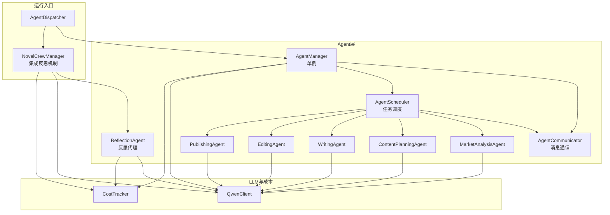

**图表来源**
- [agent_manager.py:22-227](file://agents/agent_manager.py#L22-L227)
- [agent_scheduler.py:103-488](file://agents/agent_scheduler.py#L103-L488)
- [agent_communicator.py:72-180](file://agents/agent_communicator.py#L72-L180)
- [specific_agents.py:15-505](file://agents/specific_agents.py#L15-L505)
- [agent_dispatcher.py:17-440](file://agents/agent_dispatcher.py#L17-L440)
- [crew_manager.py:162-163](file://agents/crew_manager.py#L162-L163)
- [reflection_agent.py:147-170](file://agents/reflection_agent.py#L147-L170)
- [qwen_client.py:16-232](file://llm/qwen_client.py#L16-L232)
- [cost_tracker.py:16-74](file://llm/cost_tracker.py#L16-L74)

**章节来源**
- [agent_manager.py:1-227](file://agents/agent_manager.py#L1-L227)
- [agent_scheduler.py:1-488](file://agents/agent_scheduler.py#L1-L488)
- [agent_communicator.py:1-180](file://agents/agent_communicator.py#L1-L180)
- [specific_agents.py:1-505](file://agents/specific_agents.py#L1-L505)
- [agent_dispatcher.py:1-440](file://agents/agent_dispatcher.py#L1-L440)
- [crew_manager.py:1-1757](file://agents/crew_manager.py#L1-L1757)
- [reflection_agent.py:1-841](file://agents/reflection_agent.py#L1-L841)
- [qwen_client.py:1-232](file://llm/qwen_client.py#L1-L232)
- [cost_tracker.py:1-74](file://llm/cost_tracker.py#L1-L74)
- [logging_config.py:1-55](file://core/logging_config.py#L1-L55)
- [config.py:1-59](file://backend/config.py#L1-L59)

## 核心组件
- AgentManager（单例）：负责初始化Agent系统、注册Agent、提供查询接口、统一生命周期管理
- AgentCommunicator：消息模型与Agent间通信，支持注册、发送、接收、广播、历史记录
- AgentScheduler：任务模型、Agent基类、任务队列与调度逻辑
- 具体Agent：市场分析、内容策划、创作、编辑、发布Agent，继承BaseAgent并实现任务处理
- ReflectionAgent：反思代理，提供短期和长期反思功能，支持经验注入到各个Agent
- NovelCrewManager：CrewAI风格的小说生成编排器，集成反思机制，支持反思经验在连续性检查中的注入
- AgentDispatcher：统一入口，支持"基于调度器的Agent系统"与"CrewAI风格系统"
- QwenClient：通义千问客户端封装，支持OpenAI兼容与DashScope两种模式
- CostTracker：Token用量与成本统计
- 日志与配置：core.logging_config与backend.config

**章节来源**
- [agent_manager.py:22-227](file://agents/agent_manager.py#L22-L227)
- [agent_communicator.py:72-180](file://agents/agent_communicator.py#L72-L180)
- [agent_scheduler.py:103-488](file://agents/agent_scheduler.py#L103-L488)
- [specific_agents.py:15-505](file://agents/specific_agents.py#L15-L505)
- [reflection_agent.py:147-170](file://agents/reflection_agent.py#L147-L170)
- [crew_manager.py:41-51](file://agents/crew_manager.py#L41-L51)
- [agent_dispatcher.py:17-440](file://agents/agent_dispatcher.py#L17-L440)
- [qwen_client.py:16-232](file://llm/qwen_client.py#L16-L232)
- [cost_tracker.py:16-74](file://llm/cost_tracker.py#L16-L74)
- [logging_config.py:1-55](file://core/logging_config.py#L1-L55)
- [config.py:1-59](file://backend/config.py#L1-L59)

## 架构总览
AgentManager作为单例，串联通信、调度、LLM与成本模块，并在初始化时创建AgentCommunicator、AgentScheduler、QwenClient、CostTracker，随后批量注册五类Agent。ReflectionAgent作为独立组件，通过CrewManager的setup_reflection方法初始化，为整个系统提供学习和经验积累能力。AgentDispatcher提供两种执行模式：基于调度器的Agent系统（逐步提交任务、依赖链、状态流转）与CrewAI风格系统（一次性编排各Agent，集成反思机制）。日志系统统一输出，配置来自环境变量。

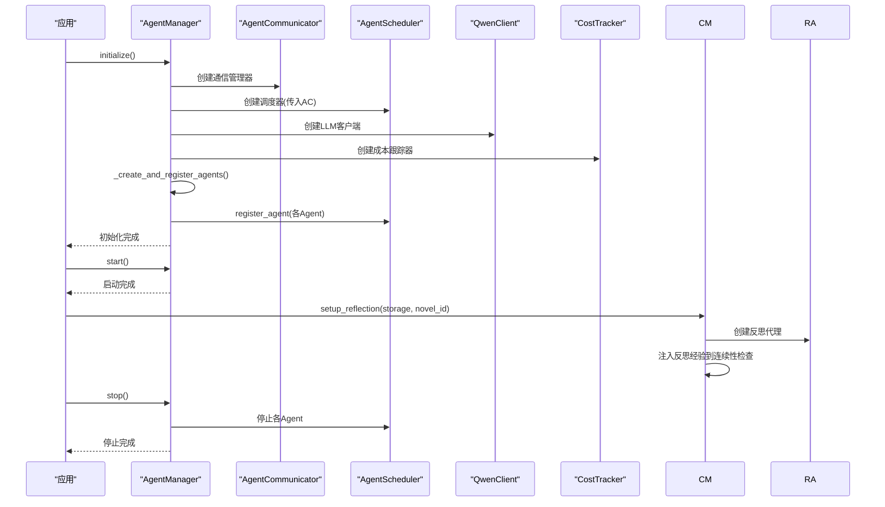

**图表来源**
- [agent_manager.py:43-156](file://agents/agent_manager.py#L43-L156)
- [agent_scheduler.py:241-251](file://agents/agent_scheduler.py#L241-L251)
- [agent_communicator.py:80-90](file://agents/agent_communicator.py#L80-L90)
- [qwen_client.py:19-45](file://llm/qwen_client.py#L19-L45)
- [cost_tracker.py:19-25](file://llm/cost_tracker.py#L19-L25)
- [crew_manager.py:1680-1696](file://agents/crew_manager.py#L1680-L1696)
- [reflection_agent.py:147-170](file://agents/reflection_agent.py#L147-L170)

## 详细组件分析

### AgentManager（单例模式与生命周期）
- 单例实现：通过类变量保存唯一实例，__new__返回同一实例；__init__中使用hasattr判断防止重复初始化
- 初始化流程：创建通信管理器、调度器、LLM客户端、成本跟踪器；批量创建并注册Agent；标记initialized为True
- 生命周期管理：start()确保初始化后启动；stop()遍历Agent调用stop并重置initialized
- 查询接口：get_scheduler、get_agent、get_all_agents、get_agent_status、get_all_agent_statuses

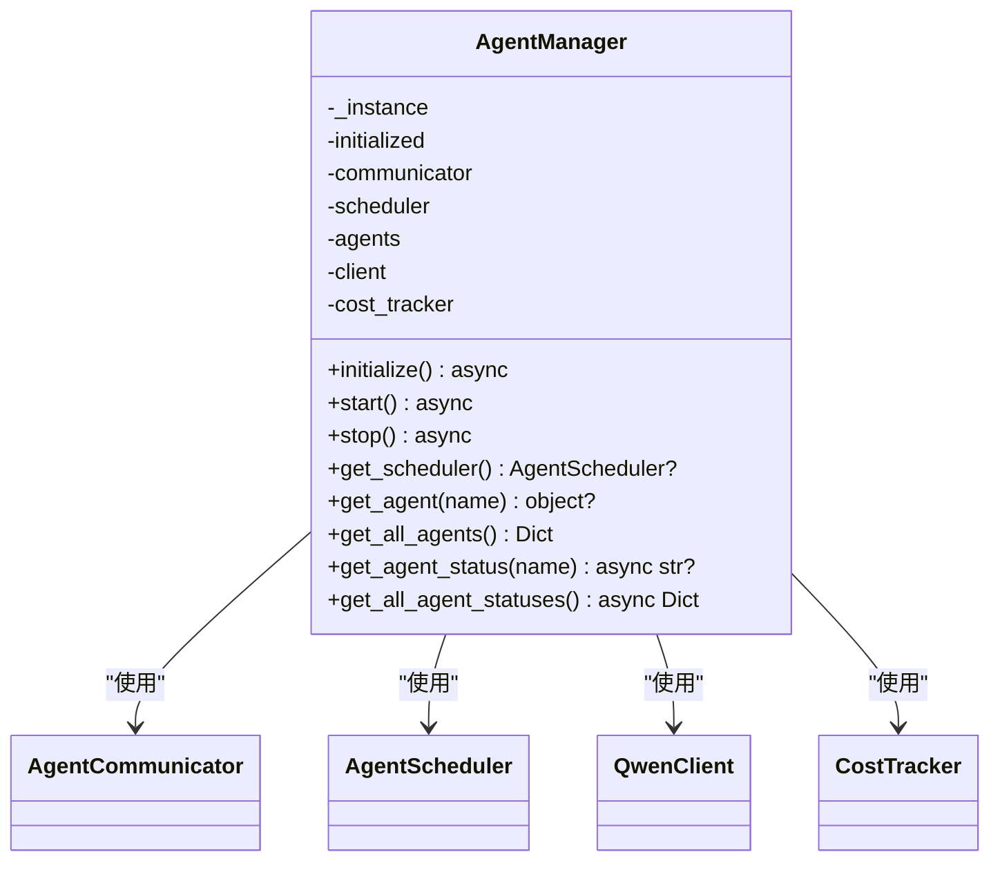

**图表来源**
- [agent_manager.py:22-227](file://agents/agent_manager.py#L22-L227)

**章节来源**
- [agent_manager.py:22-227](file://agents/agent_manager.py#L22-L227)

### AgentCommunicator（消息与通信）
- Message：消息模型，包含发送者、接收者、类型、内容、时间戳、优先级、状态
- AgentCommunicator：维护每个Agent的消息队列、消息历史、并发锁；提供注册、发送、接收、广播、历史查询与清理

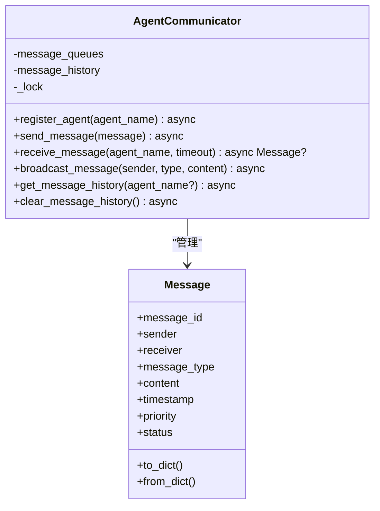

**图表来源**
- [agent_communicator.py:11-180](file://agents/agent_communicator.py#L11-L180)

**章节来源**
- [agent_communicator.py:1-180](file://agents/agent_communicator.py#L1-L180)

### AgentScheduler（任务与调度）
- AgentTask：任务模型，包含任务ID、名称、类型、优先级、依赖、输入、期望输出、超时、回调、状态、分配Agent、时间戳、结果、错误信息
- BaseAgent：抽象Agent基类，维护状态、当前任务、运行标志、任务队列；提供start/stop、消息循环、任务循环、任务处理占位
- AgentScheduler：注册Agent、提交任务、消息循环、任务调度（依赖满足、按优先级分配、空闲Agent选择）、任务状态更新、取消任务

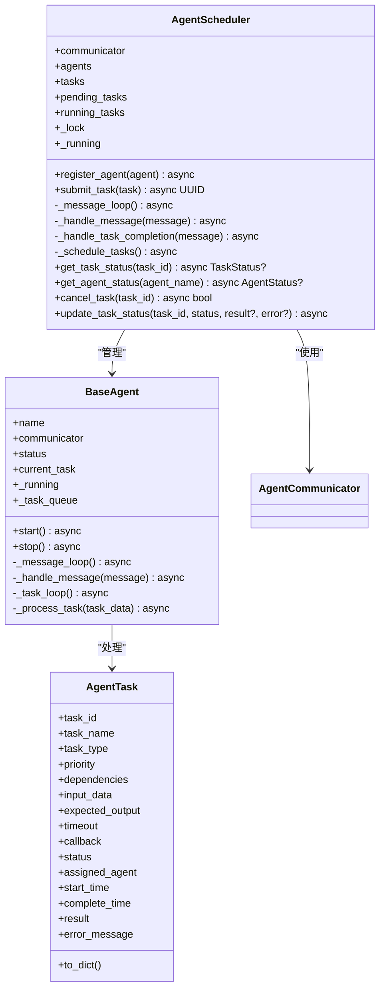

**图表来源**
- [agent_scheduler.py:13-488](file://agents/agent_scheduler.py#L13-L488)

**章节来源**
- [agent_scheduler.py:1-488](file://agents/agent_scheduler.py#L1-L488)

### 具体Agent实现（市场分析、内容策划、创作、编辑、发布）
- MarketAnalysisAgent：调用QwenClient进行市场分析，记录成本，发送任务完成消息
- ContentPlanningAgent：基于市场分析与用户偏好生成内容策划，记录成本
- WritingAgent：根据内容计划与世界设定、角色信息创作章节内容
- EditingAgent：对草稿进行编辑润色
- PublishingAgent：模拟发布流程（实际可接入发布服务）

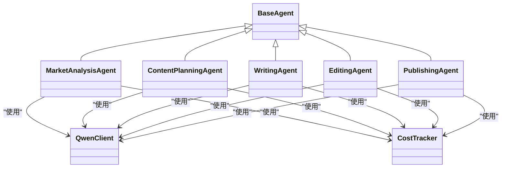

**图表来源**
- [specific_agents.py:15-505](file://agents/specific_agents.py#L15-L505)
- [agent_scheduler.py:103-129](file://agents/agent_scheduler.py#L103-L129)

**章节来源**
- [specific_agents.py:1-505](file://agents/specific_agents.py#L1-L505)

### AgentDispatcher（统一入口与模式切换）
- 支持两种模式：use_scheduled_agents为True时使用基于调度器的Agent系统；否则使用CrewAI风格系统
- initialize：初始化AgentManager并启动Agent
- run_planning/run_chapter_writing/run_batch_writing：分别执行企划、单章写作、批量写作
- get_agent_statuses：查询Agent状态
- shutdown：关闭Agent系统

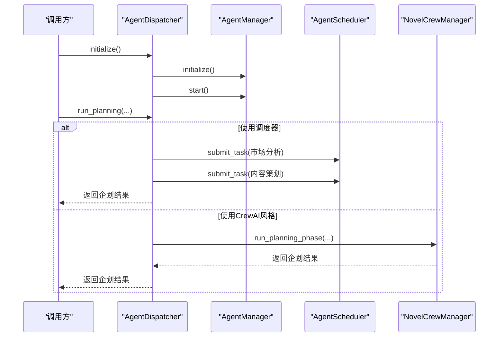

**图表来源**
- [agent_dispatcher.py:33-440](file://agents/agent_dispatcher.py#L33-L440)
- [agent_manager.py:43-156](file://agents/agent_manager.py#L43-L156)
- [crew_manager.py:168-302](file://agents/crew_manager.py#L168-L302)

**章节来源**
- [agent_dispatcher.py:1-440](file://agents/agent_dispatcher.py#L1-L440)

### LLM客户端与成本跟踪
- QwenClient：支持OpenAI兼容模式与DashScope模式；提供chat与stream_chat；带指数退避重试
- CostTracker：记录prompt/completion token与累计成本，支持汇总与重置

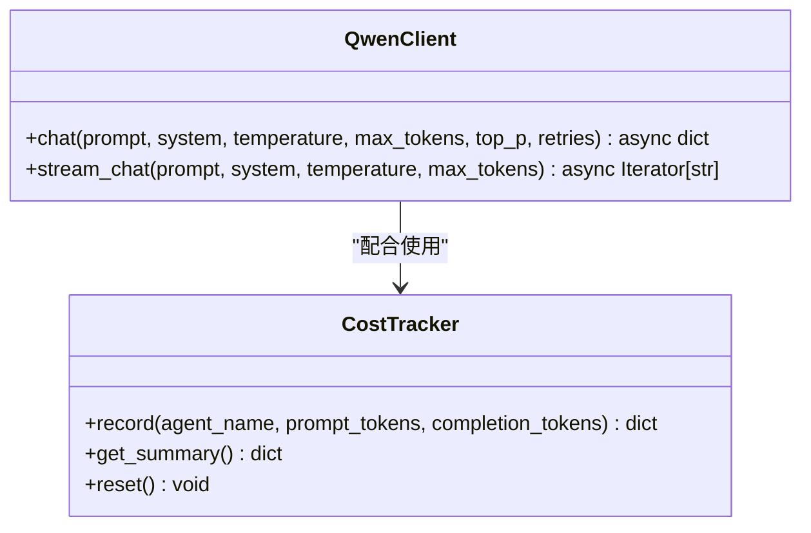

**图表来源**
- [qwen_client.py:16-232](file://llm/qwen_client.py#L16-L232)
- [cost_tracker.py:16-74](file://llm/cost_tracker.py#L16-L74)

**章节来源**
- [qwen_client.py:1-232](file://llm/qwen_client.py#L1-L232)
- [cost_tracker.py:1-74](file://llm/cost_tracker.py#L1-L74)

### 日志与配置
- core.logging_config：统一日志配置，支持控制台与文件输出、滚动日志、级别控制
- backend.config：读取.env配置，提供LLM密钥、模型、基础URL、数据库、Redis、Celery、应用参数等

**章节来源**
- [logging_config.py:1-55](file://core/logging_config.py#L1-L55)
- [config.py:1-59](file://backend/config.py#L1-L59)

## 反思机制集成

### ReflectionAgent（反思代理）
ReflectionAgent是独立的反思模块，从审查循环的迭代历史中提取经验教训，分为短期反思（纯Python规则/统计，零LLM开销）和长期反思（跨章节模式分析，1次LLM调用）。

- **短期反思**：每次审查循环结束后即时提取统计特征（评分趋势、停滞检测、问题分布）
- **长期反思**：每N章做一次跨章节模式分析，识别反复出现的问题模式，生成写作建议
- **经验注入**：将学到的lessons注入到Writer/Reviewer/Continuity的prompt中

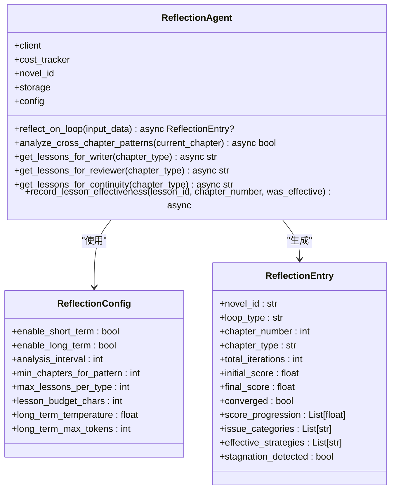

**图表来源**
- [reflection_agent.py:147-170](file://agents/reflection_agent.py#L147-L170)
- [reflection_agent.py:29-56](file://agents/reflection_agent.py#L29-L56)
- [reflection_agent.py:96-140](file://agents/reflection_agent.py#L96-L140)

**章节来源**
- [reflection_agent.py:1-841](file://agents/reflection_agent.py#L1-L841)

### CrewManager中的反思机制集成
NovelCrewManager通过setup_reflection方法集成反思机制，为整个写作流程提供智能化的学习和优化能力。

- **setup_reflection方法**：初始化ReflectionAgent，接受storage、novel_id和config参数
- **反思经验注入**：在连续性检查系统提示词中动态注入反思经验
- **成本控制**：反思机制使用独立的成本跟踪，不影响主流程的费用统计

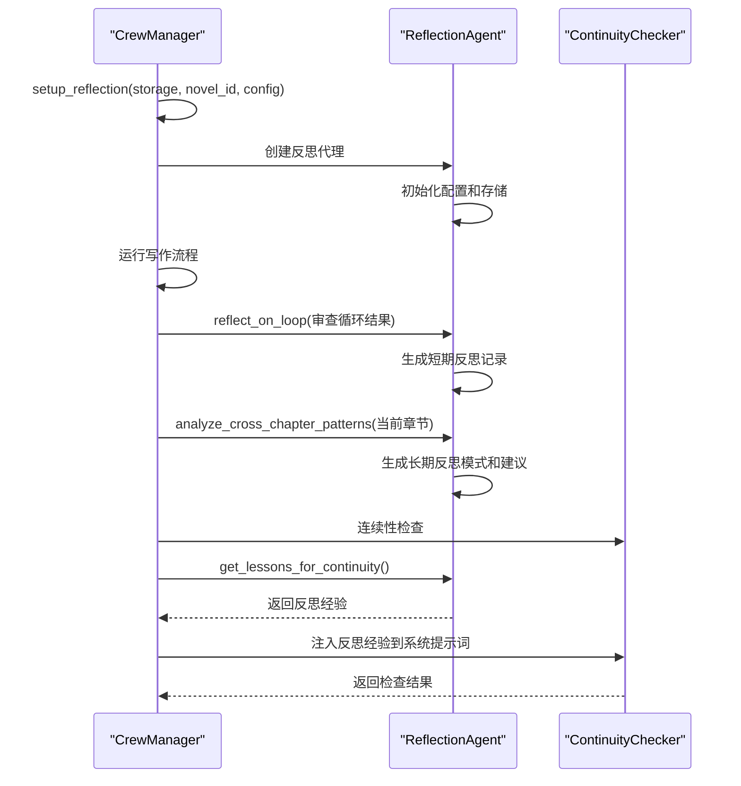

**图表来源**
- [crew_manager.py:1680-1696](file://agents/crew_manager.py#L1680-L1696)
- [crew_manager.py:1072-1078](file://agents/crew_manager.py#L1072-L1078)
- [reflection_agent.py:685-752](file://agents/reflection_agent.py#L685-L752)

**章节来源**
- [crew_manager.py:162-163](file://agents/crew_manager.py#L162-L163)
- [crew_manager.py:1680-1696](file://agents/crew_manager.py#L1680-L1696)
- [crew_manager.py:1072-1078](file://agents/crew_manager.py#L1072-L1078)

### 反思机制配置
ReflectionConfig提供了灵活的配置选项，支持短期和长期反思的开关控制、分析间隔设置、经验注入的字符预算等。

- **enable_short_term**：短期反思开关，默认开启
- **enable_long_term**：长期反思开关，默认开启  
- **analysis_interval**：长期反思触发间隔，默认3章
- **min_chapters_for_pattern**：最少需要多少章才能启动长期模式分析，默认3章
- **max_lessons_per_type**：每种类型最多保留多少条活跃lesson，默认5条
- **lesson_budget_chars**：注入prompt时的字符预算，默认600字符
- **long_term_temperature**：长期反思LLM调用温度，默认0.3
- **long_term_max_tokens**：长期反思LLM最大token数，默认2048

**章节来源**
- [reflection_agent.py:29-56](file://agents/reflection_agent.py#L29-L56)

## 依赖关系分析
- AgentManager依赖AgentCommunicator、AgentScheduler、QwenClient、CostTracker
- AgentScheduler依赖AgentCommunicator与BaseAgent
- 具体Agent依赖QwenClient与CostTracker
- ReflectionAgent依赖QwenClient、CostTracker和存储实例
- NovelCrewManager依赖QwenClient、CostTracker、ReflectionAgent和各种审查组件
- AgentDispatcher依赖AgentManager与CrewManager
- 日志与配置贯穿全局

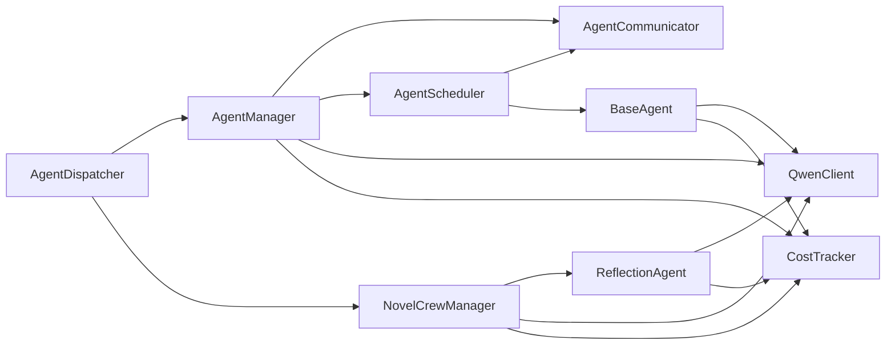

**图表来源**
- [agent_manager.py:6-19](file://agents/agent_manager.py#L6-L19)
- [agent_scheduler.py:7-10](file://agents/agent_scheduler.py#L7-L10)
- [specific_agents.py:5-9](file://agents/specific_agents.py#L5-L9)
- [reflection_agent.py:18-19](file://agents/reflection_agent.py#L18-L19)
- [crew_manager.py:32-33](file://agents/crew_manager.py#L32-L33)
- [agent_dispatcher.py:7-11](file://agents/agent_dispatcher.py#L7-L11)

**章节来源**
- [agent_manager.py:1-227](file://agents/agent_manager.py#L1-L227)
- [agent_scheduler.py:1-488](file://agents/agent_scheduler.py#L1-L488)
- [specific_agents.py:1-505](file://agents/specific_agents.py#L1-L505)
- [reflection_agent.py:1-841](file://agents/reflection_agent.py#L1-L841)
- [crew_manager.py:1-1757](file://agents/crew_manager.py#L1-L1757)
- [agent_dispatcher.py:1-440](file://agents/agent_dispatcher.py#L1-L440)

## 性能考虑
- 异步与并发：通信与调度均采用asyncio，消息队列与锁保护共享状态，避免竞态
- 任务调度：按优先级与依赖关系调度，减少Agent空闲等待
- LLM调用：使用线程池执行同步调用以避免阻塞事件循环；支持指数退避重试
- 成本控制：CostTracker记录token与成本，便于成本预算与优化
- 反思机制成本：ReflectionAgent的短期反思为纯Python计算，零LLM开销；长期反思仅在配置的间隔触发，避免频繁调用
- 日志级别：生产环境建议INFO以上，避免过多DEBUG日志影响性能

## 故障排查指南
- 初始化失败：检查AgentManager初始化流程，确认通信、调度、LLM、成本组件创建成功
- Agent未启动：确认AgentScheduler.register_agent调用与BaseAgent.start执行
- 任务无进展：检查依赖是否满足、Agent是否空闲、消息队列是否正常
- LLM调用异常：查看QwenClient重试日志与错误信息，核对配置（密钥、模型、基础URL）
- 成本统计异常：确认CostTracker.record调用与日志输出
- 反思机制异常：检查ReflectionAgent初始化参数、存储连接、LLM调用权限
- 反思经验注入失败：确认CrewManager.setup_reflection调用、反思代理状态、经验格式化
- 日志定位：统一使用core.logging_config，关注INFO/ERROR级别输出

**章节来源**
- [agent_manager.py:43-156](file://agents/agent_manager.py#L43-L156)
- [agent_scheduler.py:241-488](file://agents/agent_scheduler.py#L241-L488)
- [qwen_client.py:65-161](file://llm/qwen_client.py#L65-L161)
- [cost_tracker.py:26-56](file://llm/cost_tracker.py#L26-L56)
- [reflection_agent.py:175-245](file://agents/reflection_agent.py#L175-L245)
- [crew_manager.py:1680-1696](file://agents/crew_manager.py#L1680-L1696)
- [logging_config.py:20-50](file://core/logging_config.py#L20-L50)

## 结论
Agent管理器核心通过单例模式统一管理Agent系统的初始化、注册与生命周期，结合消息通信与任务调度，实现了可扩展、可观测、可成本控制的多Agent协作框架。新增的反思机制进一步增强了系统的智能化水平，通过短期和长期反思功能，为写作流程提供持续的学习和优化能力。同时提供两种执行模式（调度器风格与CrewAI风格），满足不同场景需求。配合完善的日志与配置体系，能够稳定支撑小说生成流水线。

## 附录

### API参考（AgentManager）
- initialize()：初始化Agent系统，创建通信、调度、LLM、成本组件并注册Agent
  - 参数：无
  - 返回：无
  - 异常：无（内部日志记录）
- start()：启动Agent系统（若未初始化则先初始化）
  - 参数：无
  - 返回：无
- stop()：停止Agent系统并重置状态
  - 参数：无
  - 返回：无
- get_scheduler()：获取调度器实例
  - 参数：无
  - 返回：AgentScheduler或None
- get_agent(agent_name)：获取指定Agent
  - 参数：agent_name: str
  - 返回：Agent实例或None
- get_all_agents()：获取所有Agent映射
  - 参数：无
  - 返回：Dict[str, object]
- get_agent_status(agent_name)：获取Agent状态
  - 参数：agent_name: str
  - 返回：状态字符串或None
- get_all_agent_statuses()：获取所有Agent状态映射
  - 参数：无
  - 返回：Dict[str, str]

**章节来源**
- [agent_manager.py:128-214](file://agents/agent_manager.py#L128-L214)

### API参考（AgentDispatcher）
- initialize()：初始化AgentManager并启动Agent
  - 参数：无
  - 返回：无
- set_use_scheduled_agents(use_scheduled)：设置是否使用调度器风格
  - 参数：use_scheduled: bool
  - 返回：无
- run_planning(novel_id, task_id, **kwargs)：执行企划阶段
  - 参数：novel_id: UUID, task_id: UUID, **kwargs
  - 返回：Dict[str, Any]
- run_chapter_writing(novel_id, task_id, chapter_number, volume_number, **kwargs)：执行单章写作
  - 参数：novel_id: UUID, task_id: UUID, chapter_number: int, volume_number: int, **kwargs
  - 返回：Dict[str, Any]
- run_batch_writing(novel_id, task_id, from_chapter, to_chapter, volume_number, **kwargs)：执行批量写作
  - 参数：novel_id: UUID, task_id: UUID, from_chapter: int, to_chapter: int, volume_number: int, **kwargs
  - 返回：Dict[str, Any]
- get_agent_statuses()：获取所有Agent状态
  - 参数：无
  - 返回：Dict[str, str]
- shutdown()：关闭Agent系统
  - 参数：无
  - 返回：无

**章节来源**
- [agent_dispatcher.py:33-440](file://agents/agent_dispatcher.py#L33-L440)

### API参考（ReflectionAgent）
- reflect_on_loop(input_data)：短期反思，提取统计特征
  - 参数：input_data: ReflectionInput
  - 返回：ReflectionEntry或None
- analyze_cross_chapter_patterns(current_chapter)：长期反思，跨章节模式分析
  - 参数：current_chapter: int
  - 返回：bool（是否成功执行）
- get_lessons_for_writer(chapter_type)：获取给Writer的经验建议
  - 参数：chapter_type: str（默认"normal"）
  - 返回：格式化的建议文本
- get_lessons_for_reviewer(chapter_type)：获取给Reviewer的经验建议
  - 参数：chapter_type: str（默认"normal"）
  - 返回：格式化的建议文本
- get_lessons_for_continuity(chapter_type)：获取给Continuity Checker的经验建议
  - 参数：chapter_type: str（默认"normal"）
  - 返回：格式化的建议文本
- record_lesson_effectiveness(lesson_id, chapter_number, was_effective)：记录lesson的实际应用效果
  - 参数：lesson_id: str, chapter_number: int, was_effective: bool
  - 返回：无

**章节来源**
- [reflection_agent.py:175-245](file://agents/reflection_agent.py#L175-L245)
- [reflection_agent.py:323-398](file://agents/reflection_agent.py#L323-L398)
- [reflection_agent.py:685-752](file://agents/reflection_agent.py#L685-L752)
- [reflection_agent.py:783-841](file://agents/reflection_agent.py#L783-L841)

### API参考（CrewManager）
- setup_reflection(storage, novel_id, config)：设置反思代理
  - 参数：storage: 存储实例, novel_id: str（默认"unknown"）, config: ReflectionConfig（默认None）
  - 返回：ReflectionAgent实例
- 连续性检查中的反思经验注入：在CONTINUITY_CHECKER_SYSTEM提示词中动态注入反思经验
  - 参数：无（通过self.reflection_agent.get_lessons_for_continuity()获取）
  - 返回：注入反思经验后的系统提示词

**章节来源**
- [crew_manager.py:1680-1696](file://agents/crew_manager.py#L1680-L1696)
- [crew_manager.py:1072-1078](file://agents/crew_manager.py#L1072-L1078)

### 使用示例与最佳实践
- 示例一：独立Agent系统启动
  - 参考脚本：scripts/start_agents.py
  - 步骤：初始化QwenClient与CostTracker，创建AgentScheduler，注册五类Agent，等待启动，周期打印状态，优雅关闭
- 示例二：多Agent协作测试
  - 参考脚本：agents/test_multi_agent.py
  - 步骤：创建AgentScheduler，注册Agent，提交市场分析、内容策划、创作、编辑、发布任务，等待完成，打印成本
- 示例三：反思机制集成
  - 步骤：初始化CrewManager，调用setup_reflection设置反思代理，运行写作流程，观察反思经验在连续性检查中的注入效果
- 最佳实践
  - 使用AgentManager单例，避免重复初始化
  - 在生产环境设置合适的日志级别与输出
  - 合理设置任务优先级与依赖，避免死锁
  - 使用CostTracker监控成本，定期重置统计
  - 在Agent中实现具体的任务处理逻辑，确保任务完成后发送完成消息
  - 合理配置ReflectionConfig，平衡反思成本与收益
  - 定期清理过时的反思经验，保持经验库的有效性

**章节来源**
- [start_agents.py:47-177](file://scripts/start_agents.py#L47-L177)
- [test_multi_agent.py:27-194](file://agents/test_multi_agent.py#L27-L194)
- [crew_manager.py:1680-1696](file://agents/crew_manager.py#L1680-L1696)
- [reflection_agent.py:29-56](file://agents/reflection_agent.py#L29-L56)