# Agent管理器核心

<cite>
**本文引用的文件**
- [agent_manager.py](file://agents/agent_manager.py)
- [agent_communicator.py](file://agents/agent_communicator.py)
- [agent_scheduler.py](file://agents/agent_scheduler.py)
- [specific_agents.py](file://agents/specific_agents.py)
- [agent_dispatcher.py](file://agents/agent_dispatcher.py)
- [crew_manager.py](file://agents/crew_manager.py)
- [voting_manager.py](file://agents/voting_manager.py)
- [review_loop.py](file://agents/review_loop.py)
- [character_review_loop.py](file://agents/character_review_loop.py)
- [world_review_loop.py](file://agents/world_review_loop.py)
- [plot_review_loop.py](file://agents/plot_review_loop.py)
- [agent_query_service.py](file://agents/agent_query_service.py)
- [team_context.py](file://agents/team_context.py)
- [cost_tracker.py](file://llm/cost_tracker.py)
- [qwen_client.py](file://llm/qwen_client.py)
- [logging_config.py](file://core/logging_config.py)
- [config.py](file://backend/config.py)
- [start_agents.py](file://scripts/start_agents.py)
- [test_multi_agent.py](file://agents/test_multi_agent.py)
</cite>

## 目录
1. [简介](#简介)
2. [项目结构](#项目结构)
3. [核心组件](#核心组件)
4. [架构总览](#架构总览)
5. [详细组件分析](#详细组件分析)
6. [依赖关系分析](#依赖关系分析)
7. [性能考虑](#性能考虑)
8. [故障排查指南](#故障排查指南)
9. [结论](#结论)
10. [附录](#附录)

## 简介
本文件面向"Agent管理器核心"组件，系统性阐述其单例模式实现、线程安全与实例化控制、内存管理策略；详解初始化流程（通信管理器创建、调度器配置、LLM客户端集成、成本跟踪器设置）、智能体注册机制（注册流程、状态管理、生命周期控制）；提供完整的API参考（initialize、start、stop方法的参数与返回值说明），并覆盖错误处理策略、日志记录机制、性能监控指标。特别关注NovelCrewManager新增的400+行高级协调机制，包括投票共识、请求-响应协商、质量评估等。最后给出实际使用示例与最佳实践建议，帮助开发者快速上手并稳定运行该Agent系统。

## 项目结构
Agent管理器位于agents子模块，围绕AgentManager单例、AgentCommunicator通信、AgentScheduler调度、具体Agent实现、以及LLM客户端与成本跟踪器协同工作。核心文件如下：
- agents/agent_manager.py：AgentManager单例与生命周期管理
- agents/agent_communicator.py：消息模型与Agent间通信
- agents/agent_scheduler.py：任务模型、Agent基类、调度器
- agents/specific_agents.py：市场分析、内容策划、创作、编辑、发布Agent
- agents/agent_dispatcher.py：调度器风格与CrewAI风格的统一入口
- agents/crew_manager.py：NovelCrewManager小说生成编排器，支持投票共识、审查循环、查询协商等高级协调机制
- agents/voting_manager.py：投票共识管理器，支持多Agent视角投票
- agents/review_loop.py：Writer-Editor审查反馈循环
- agents/character_review_loop.py：角色设计审查循环
- agents/world_review_loop.py：世界观设计审查循环
- agents/plot_review_loop.py：情节大纲审查循环
- agents/agent_query_service.py：Agent间请求-响应协商服务
- agents/team_context.py：小说生成团队共享上下文
- llm/qwen_client.py：通义千问客户端封装（OpenAI兼容与DashScope两种模式）
- llm/cost_tracker.py：Token用量与成本统计
- core/logging_config.py：全局日志配置
- backend/config.py：应用配置（LLM密钥、模型、基础URL等）

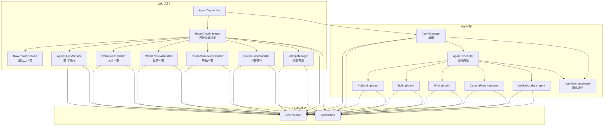

**图表来源**
- [agent_manager.py](file://agents/agent_manager.py#L22-L227)
- [agent_scheduler.py](file://agents/agent_scheduler.py#L103-L488)
- [agent_communicator.py](file://agents/agent_communicator.py#L72-L180)
- [specific_agents.py](file://agents/specific_agents.py#L15-L505)
- [agent_dispatcher.py](file://agents/agent_dispatcher.py#L17-L440)
- [crew_manager.py](file://agents/crew_manager.py#L38-L154)
- [voting_manager.py](file://agents/voting_manager.py#L74-L140)
- [review_loop.py](file://agents/review_loop.py#L91-L132)
- [character_review_loop.py](file://agents/character_review_loop.py#L188-L216)
- [world_review_loop.py](file://agents/world_review_loop.py#L191-L211)
- [plot_review_loop.py](file://agents/plot_review_loop.py#L214-L234)
- [agent_query_service.py](file://agents/agent_query_service.py#L23-L40)
- [team_context.py](file://agents/team_context.py#L155-L216)

**章节来源**
- [agent_manager.py](file://agents/agent_manager.py#L1-L227)
- [agent_scheduler.py](file://agents/agent_scheduler.py#L1-L488)
- [agent_communicator.py](file://agents/agent_communicator.py#L1-L180)
- [specific_agents.py](file://agents/specific_agents.py#L1-L505)
- [agent_dispatcher.py](file://agents/agent_dispatcher.py#L1-L440)
- [crew_manager.py](file://agents/crew_manager.py#L1-L1038)
- [voting_manager.py](file://agents/voting_manager.py#L1-L236)
- [review_loop.py](file://agents/review_loop.py#L1-L322)
- [character_review_loop.py](file://agents/character_review_loop.py#L1-L462)
- [world_review_loop.py](file://agents/world_review_loop.py#L1-L424)
- [plot_review_loop.py](file://agents/plot_review_loop.py#L1-L480)
- [agent_query_service.py](file://agents/agent_query_service.py#L1-L122)
- [team_context.py](file://agents/team_context.py#L1-L493)
- [qwen_client.py](file://llm/qwen_client.py#L1-L232)
- [cost_tracker.py](file://llm/cost_tracker.py#L1-L74)
- [logging_config.py](file://core/logging_config.py#L1-L55)
- [config.py](file://backend/config.py#L1-L59)

## 核心组件
- AgentManager（单例）：负责初始化Agent系统、注册Agent、提供查询接口、统一生命周期管理
- AgentCommunicator：消息模型与Agent间通信，支持注册、发送、接收、广播、历史记录
- AgentScheduler：任务模型、Agent基类、任务队列与调度逻辑，**增强的依赖检查与错误处理**
- 具体Agent：市场分析、内容策划、创作、编辑、发布Agent，继承BaseAgent并实现任务处理
- AgentDispatcher：统一入口，支持"基于调度器的Agent系统"与"CrewAI风格系统"
- NovelCrewManager：小说生成编排器，集成投票共识、审查反馈循环、请求-响应协商、质量评估等高级协调机制
- VotingManager：投票共识管理器，支持多Agent视角投票，通过加权置信度计算获胜方案
- ReviewLoopHandler：Writer-Editor审查反馈循环，实现质量驱动的迭代优化
- CharacterReviewHandler：角色设计审查循环，确保角色设计的深度和质量
- WorldReviewHandler：世界观设计审查循环，确保设定的一致性和完整性
- PlotReviewHandler：情节大纲审查循环，确保结构的完整性和吸引力
- AgentQueryService：Agent间请求-响应协商服务，支持写作过程中的设定查询
- NovelTeamContext：小说生成团队共享上下文，实现信息共享和状态追踪
- QwenClient：通义千问客户端封装，支持OpenAI兼容与DashScope两种模式
- CostTracker：Token用量与成本统计
- 日志与配置：core.logging_config与backend.config

**章节来源**
- [agent_manager.py](file://agents/agent_manager.py#L22-L227)
- [agent_communicator.py](file://agents/agent_communicator.py#L72-L180)
- [agent_scheduler.py](file://agents/agent_scheduler.py#L103-L488)
- [specific_agents.py](file://agents/specific_agents.py#L15-L505)
- [agent_dispatcher.py](file://agents/agent_dispatcher.py#L17-L440)
- [crew_manager.py](file://agents/crew_manager.py#L38-L154)
- [voting_manager.py](file://agents/voting_manager.py#L74-L140)
- [review_loop.py](file://agents/review_loop.py#L91-L132)
- [character_review_loop.py](file://agents/character_review_loop.py#L188-L216)
- [world_review_loop.py](file://agents/world_review_loop.py#L191-L211)
- [plot_review_loop.py](file://agents/plot_review_loop.py#L214-L234)
- [agent_query_service.py](file://agents/agent_query_service.py#L23-L40)
- [team_context.py](file://agents/team_context.py#L155-L216)
- [qwen_client.py](file://llm/qwen_client.py#L16-L232)
- [cost_tracker.py](file://llm/cost_tracker.py#L16-L74)
- [logging_config.py](file://core/logging_config.py#L1-L55)
- [config.py](file://backend/config.py#L1-L59)

## 架构总览
AgentManager作为单例，串联通信、调度、LLM与成本模块，并在初始化时创建AgentCommunicator、AgentScheduler、QwenClient、CostTracker，随后批量注册五类Agent。AgentDispatcher提供两种执行模式：基于调度器的Agent系统（逐步提交任务、依赖链、状态流转）与CrewAI风格系统（一次性编排各Agent）。NovelCrewManager作为CrewAI风格系统的核心，集成了400+行的高级协调机制，包括投票共识、审查反馈循环、请求-响应协商、质量评估等，形成完整的智能体协作体系。日志系统统一输出，配置来自环境变量。

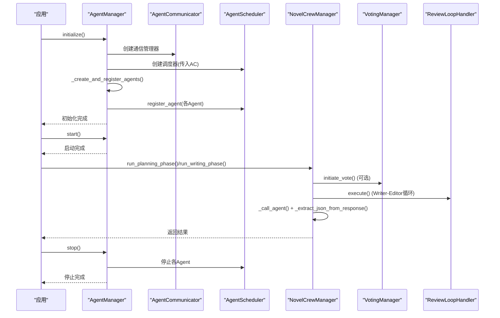

**图表来源**
- [agent_manager.py](file://agents/agent_manager.py#L43-L156)
- [agent_scheduler.py](file://agents/agent_scheduler.py#L241-L251)
- [agent_communicator.py](file://agents/agent_communicator.py#L80-L90)
- [crew_manager.py](file://agents/crew_manager.py#L286-L547)
- [voting_manager.py](file://agents/voting_manager.py#L85-L140)
- [review_loop.py](file://agents/review_loop.py#L113-L263)

## 详细组件分析

### AgentManager（单例模式与生命周期）
- 单例实现：通过类变量保存唯一实例，__new__返回同一实例；__init__中使用hasattr判断防止重复初始化
- 初始化流程：创建通信管理器、调度器、LLM客户端、成本跟踪器；批量创建并注册Agent；标记initialized为True
- 生命周期管理：start()确保初始化后启动；stop()遍历Agent调用stop并重置initialized
- 查询接口：get_scheduler、get_agent、get_all_agents、get_agent_status、get_all_agent_statuses

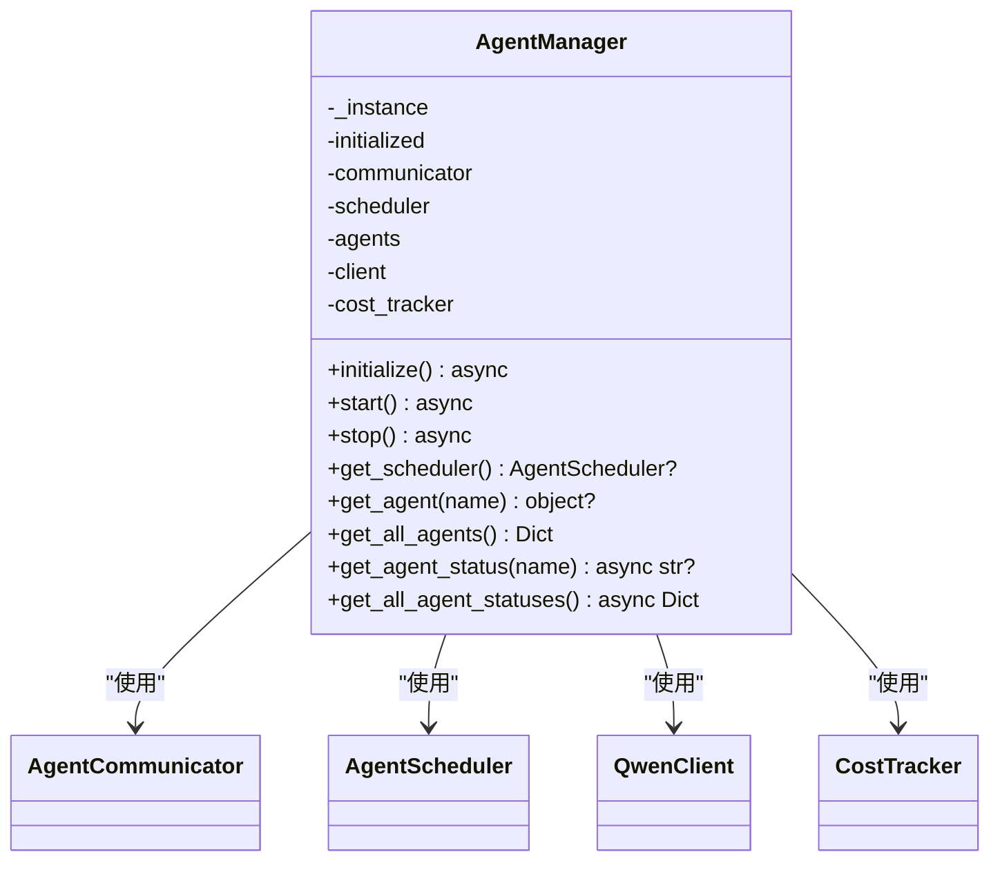

**图表来源**
- [agent_manager.py](file://agents/agent_manager.py#L22-L227)

**章节来源**
- [agent_manager.py](file://agents/agent_manager.py#L22-L227)

### AgentCommunicator（消息与通信）
- Message：消息模型，包含发送者、接收者、类型、内容、时间戳、优先级、状态
- AgentCommunicator：维护每个Agent的消息队列、消息历史、并发锁；提供注册、发送、接收、广播、历史查询与清理

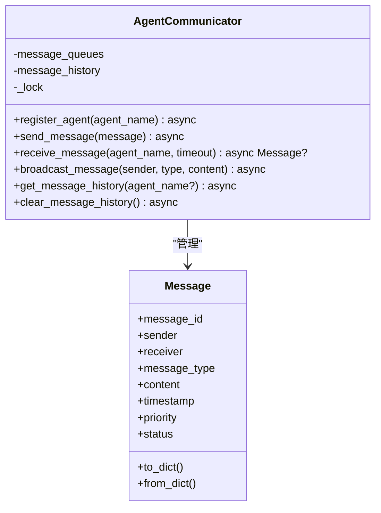

**图表来源**
- [agent_communicator.py](file://agents/agent_communicator.py#L11-L180)

**章节来源**
- [agent_communicator.py](file://agents/agent_communicator.py#L1-L180)

### AgentScheduler（任务与调度）
- AgentTask：任务模型，包含任务ID、名称、类型、优先级、依赖、输入、期望输出、超时、回调、状态、分配Agent、时间戳、结果、错误信息
- BaseAgent：抽象Agent基类，维护状态、当前任务、运行标志、任务队列；提供start/stop、消息循环、任务循环、任务处理占位
- AgentScheduler：注册Agent、提交任务、消息循环、任务调度（依赖满足、按优先级分配、空闲Agent选择）、任务状态更新、取消任务

**更新** 增强的依赖检查逻辑与错误处理机制

- **依赖检查增强**：
  - 详细的依赖验证：检查所有依赖任务是否存在且已完成
  - 依赖不存在时的警告日志：记录具体的依赖任务ID和任务名称
  - 依赖未完成时的处理：跳过当前任务，继续检查其他任务
  - 类型安全的依赖处理：支持UUID和字符串形式的依赖ID

- **错误处理改进**：
  - 任务完成消息的健壮性检查：验证task_id的存在性
  - 异常捕获与日志记录：捕获所有异常并记录详细错误信息
  - 任务状态更新的安全性：确保任务存在后再更新状态
  - 回调函数执行的异常处理：捕获回调执行中的异常

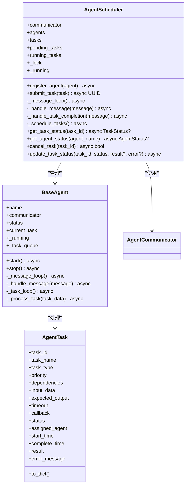

**图表来源**
- [agent_scheduler.py](file://agents/agent_scheduler.py#L13-L488)

**章节来源**
- [agent_scheduler.py](file://agents/agent_scheduler.py#L1-L488)

### 具体Agent实现（市场分析、内容策划、创作、编辑、发布）
- MarketAnalysisAgent：调用QwenClient进行市场分析，记录成本，发送任务完成消息
- ContentPlanningAgent：基于市场分析与用户偏好生成内容策划，记录成本
- WritingAgent：根据内容计划与世界设定、角色信息创作章节内容
- EditingAgent：对草稿进行编辑润色
- PublishingAgent：模拟发布流程（实际可接入发布服务）

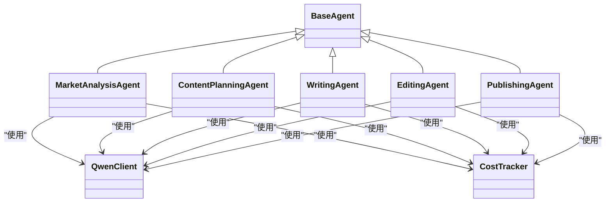

**图表来源**
- [specific_agents.py](file://agents/specific_agents.py#L15-L505)
- [agent_scheduler.py](file://agents/agent_scheduler.py#L103-L129)

**章节来源**
- [specific_agents.py](file://agents/specific_agents.py#L1-L505)

### AgentDispatcher（统一入口与模式切换）
- 支持两种模式：use_scheduled_agents为True时使用基于调度器的Agent系统；否则使用CrewAI风格系统
- initialize：初始化AgentManager并启动Agent
- run_planning/run_chapter_writing/run_batch_writing：分别执行企划、单章写作、批量写作
- get_agent_statuses：查询Agent状态
- shutdown：关闭Agent系统

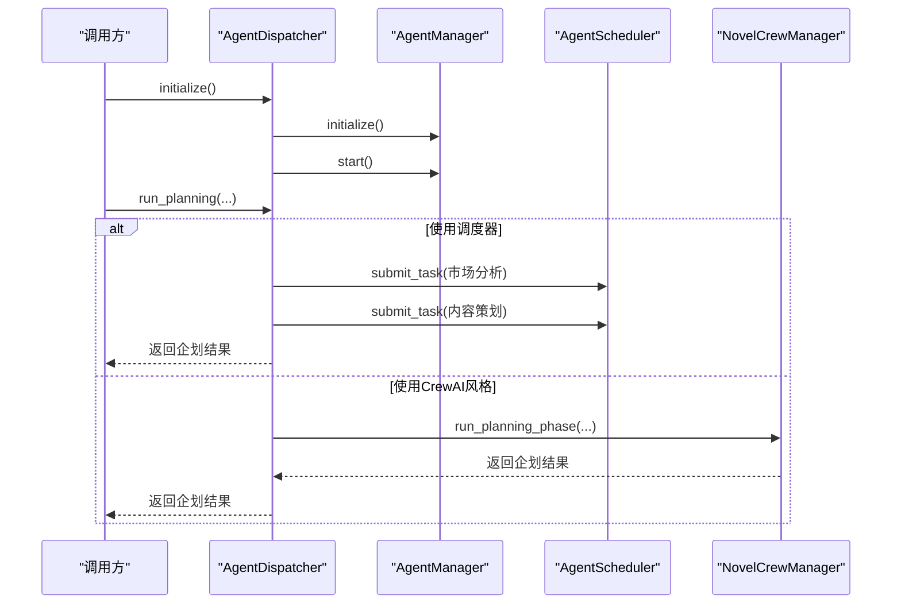

**图表来源**
- [agent_dispatcher.py](file://agents/agent_dispatcher.py#L33-L440)
- [agent_manager.py](file://agents/agent_manager.py#L43-L156)
- [crew_manager.py](file://agents/crew_manager.py#L168-L302)

**章节来源**
- [agent_dispatcher.py](file://agents/agent_dispatcher.py#L1-L440)

### NovelCrewManager（高级协调机制）
**更新** NovelCrewManager新增了400+行代码，集成了完整的高级协调机制，包括投票共识、审查反馈循环、请求-响应协商、质量评估等。

- **核心功能**：
  - 投票共识：支持多Agent视角对关键决策进行投票，通过加权置信度计算获胜方案
  - 审查反馈循环：Writer-Editor质量驱动迭代，实现内容的持续优化
  - 请求-响应协商：写作过程中的设定查询，支持world、character、plot三种类型
  - 质量评估：多维度质量评分，包括心理深度、独特性、成长潜力、关系复杂性、世界观契合度等
  - 团队上下文：实现Agent间的信息共享和状态追踪

- **初始化配置**：
  - 支持质量阈值、最大迭代次数、投票开关、查询开关等灵活配置
  - 集成审查处理器、投票管理器、查询服务等协作组件
  - 支持角色审查、世界观审查、大纲审查的独立循环

- **执行流程**：
  - 企划阶段：主题分析、世界观构建、角色设计、情节架构
  - 写作阶段：章节策划、初稿撰写、审查循环、连续性检查、相似度检测

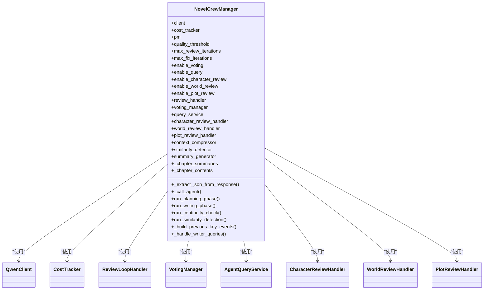

**图表来源**
- [crew_manager.py](file://agents/crew_manager.py#L38-L154)

**章节来源**
- [crew_manager.py](file://agents/crew_manager.py#L1-L1038)

### VotingManager（投票共识管理器）
**新增** 支持多个Agent视角对关键决策进行投票，通过加权置信度计算获胜方案。

- **核心功能**：
  - 多视角投票：支持世界观专家、角色专家、情节专家等不同角色
  - 加权置信度：根据投票者的置信度权重计算最终结果
  - 并行处理：并行调用所有投票者，提高效率
  - 结果聚合：统计各选项得分，计算共识强度

- **投票流程**：
  1. 构建投票提示词，包含决策主题、可选方案、上下文
  2. 并行调用各投票者，收集投票结果
  3. 过滤有效投票，计算加权结果
  4. 返回投票结果，包含获胜选项、共识强度、详细信息

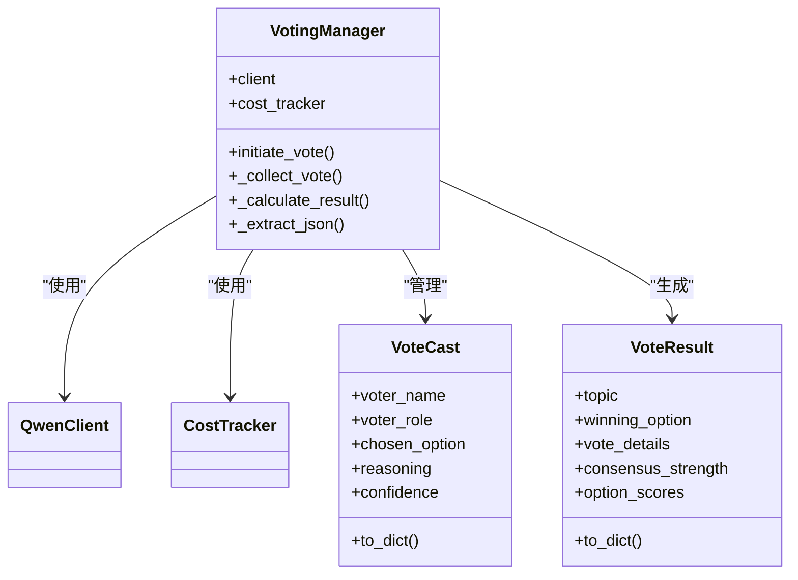

**图表来源**
- [voting_manager.py](file://agents/voting_manager.py#L74-L211)

**章节来源**
- [voting_manager.py](file://agents/voting_manager.py#L1-L236)

### ReviewLoopHandler（审查反馈循环）
**新增** 实现Writer-Editor质量驱动的迭代优化，确保内容质量达到预期标准。

- **核心功能**：
  - Writer-Editor循环：Writer生成内容，Editor进行审查评分和润色
  - 质量阈值控制：根据综合评分决定是否继续迭代
  - 多维度评分：包括语言流畅度、情节逻辑、角色一致性、节奏把控等
  - 迭代控制：支持最大迭代次数限制，避免无限循环

- **执行流程**：
  1. Writer生成初稿
  2. Editor进行多维度评分和润色
  3. 检查评分是否达到阈值
  4. 若未达标，将建议反馈给Writer进行修订
  5. 重复直到达到质量标准或达到最大迭代次数

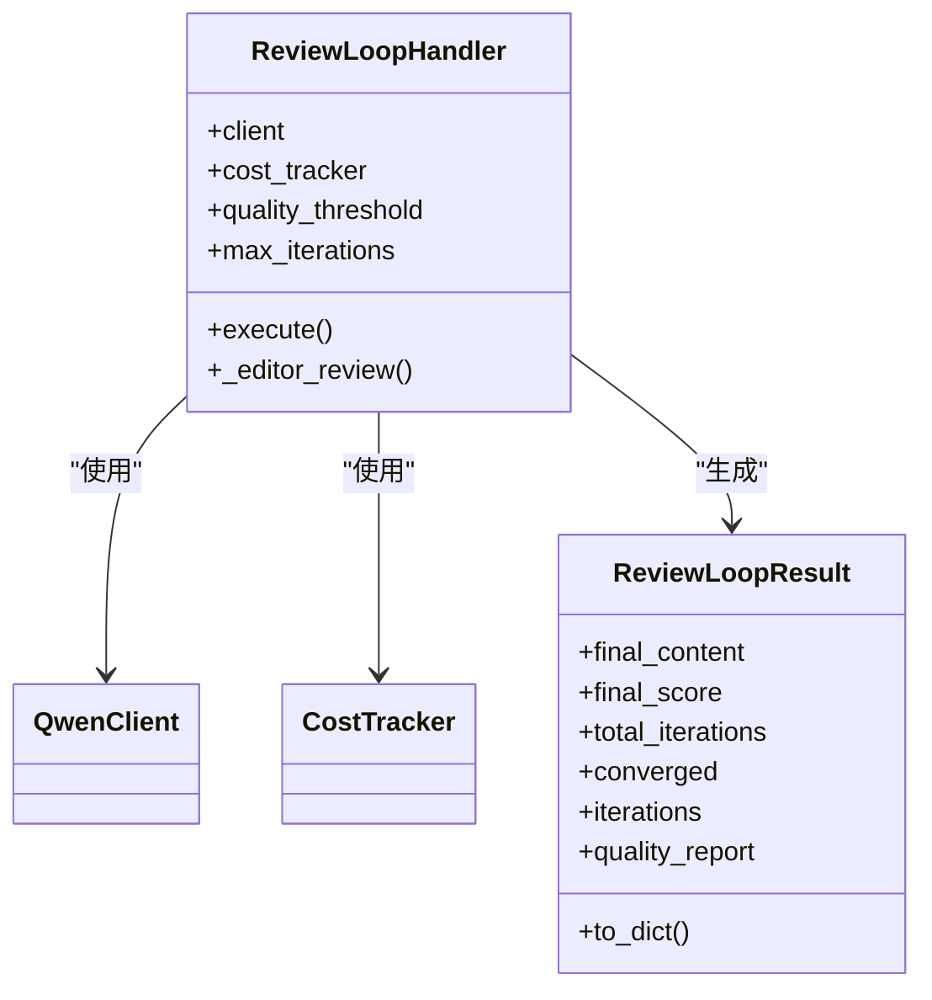

**图表来源**
- [review_loop.py](file://agents/review_loop.py#L91-L263)

**章节来源**
- [review_loop.py](file://agents/review_loop.py#L1-L322)

### CharacterReviewHandler（角色审查循环）
**新增** 确保角色设计的深度和质量，通过Designer-Reviewer循环迭代优化。

- **核心维度**：
  - 心理深度：角色的内在矛盾和挣扎
  - 独特性：角色之间的区分度
  - 成长潜力：角色的成长弧线合理性
  - 关系复杂性：角色关系的多层次性
  - 世界观契合度：角色与设定的一致性

- **执行流程**：
  1. Designer生成角色设计
  2. Reviewer进行多维度评估
  3. 检查是否达到质量阈值
  4. 若未达标，将问题反馈给Designer进行修订
  5. 重复直到达到质量标准或达到最大迭代次数

**章节来源**
- [character_review_loop.py](file://agents/character_review_loop.py#L1-L462)

### WorldReviewHandler（世界观审查循环）
**新增** 确保世界观设计的深度和一致性，通过Builder-Reviewer循环迭代优化。

- **核心维度**：
  - 内在一致性：各个设定之间的自洽性
  - 深度与广度：设定的丰富程度
  - 独特性：世界观的独特创新
  - 可扩展性：支撑长期发展的空间
  - 力量体系完整性：等级和规则的合理性

**章节来源**
- [world_review_loop.py](file://agents/world_review_loop.py#L1-L424)

### PlotReviewHandler（情节大纲审查循环）
**新增** 确保情节架构的完整性和吸引力，通过Architect-Reviewer循环迭代优化。

- **核心维度**：
  - 结构完整性：清晰的起承转合
  - 节奏把控：张弛有度的推进
  - 冲突张力：足够的戏剧冲突
  - 角色利用度：充分发挥角色作用
  - 伏笔设计：合理的铺垫和回收

**章节来源**
- [plot_review_loop.py](file://agents/plot_review_loop.py#L1-L480)

### AgentQueryService（请求-响应协商服务）
**新增** 支持写作过程中的Agent间设定查询，实现请求-响应协商机制。

- **支持类型**：
  - world：世界观架构师，回答设定相关问题
  - character：角色设计师，回答角色相关问题  
  - plot：情节架构师，回答情节相关问题

- **查询流程**：
  1. Writer遇到设定疑问时插入[QUERY:type]question[/QUERY]标记
  2. 解析查询标记，提取问题类型和内容
  3. 以对应角色的视角调用LLM回答
  4. 将答案注入Writer的提示词，重新生成内容

**章节来源**
- [agent_query_service.py](file://agents/agent_query_service.py#L1-L122)

### NovelTeamContext（团队上下文）
**新增** 实现Agent间的信息共享和状态追踪，借鉴AgentMesh的设计理念。

- **核心功能**：
  - Agent输出历史追踪：记录各Agent的输出和子任务
  - 角色状态管理：追踪角色的位置、修为、情感状态等
  - 时间线追踪：记录故事进展和关键事件
  - 伏笔系统集成：追踪待回收的伏笔
  - 团队规则管理：指导Agent决策的规则

- **增强上下文**：
  - 构建当前卷信息、角色状态、时间线、伏笔等增强上下文
  - 为Writer提供更丰富的创作背景信息

**章节来源**
- [team_context.py](file://agents/team_context.py#L1-L493)

### LLM客户端与成本跟踪
- QwenClient：支持OpenAI兼容模式与DashScope模式；提供chat与stream_chat；带指数退避重试
- CostTracker：记录prompt/completion token与累计成本，支持汇总与重置

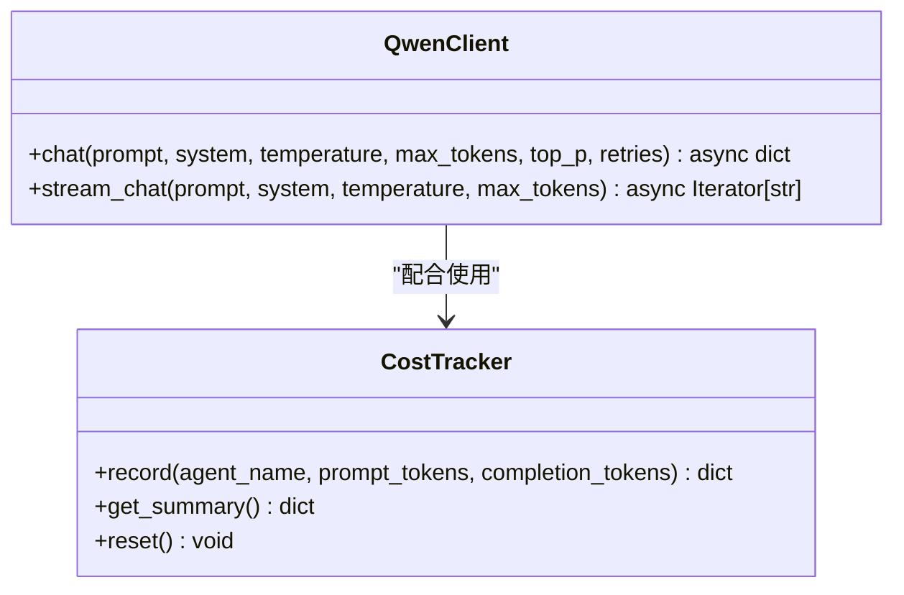

**图表来源**
- [qwen_client.py](file://llm/qwen_client.py#L16-L232)
- [cost_tracker.py](file://llm/cost_tracker.py#L16-L74)

**章节来源**
- [qwen_client.py](file://llm/qwen_client.py#L1-L232)
- [cost_tracker.py](file://llm/cost_tracker.py#L1-L74)

### 日志与配置
- core.logging_config：统一日志配置，支持控制台与文件输出、滚动日志、级别控制
- backend.config：读取.env配置，提供LLM密钥、模型、基础URL、数据库、Redis、Celery、应用参数等

**章节来源**
- [logging_config.py](file://core/logging_config.py#L1-L55)
- [config.py](file://backend/config.py#L1-L59)

## 依赖关系分析
- AgentManager依赖AgentCommunicator、AgentScheduler、QwenClient、CostTracker
- AgentScheduler依赖AgentCommunicator与BaseAgent
- 具体Agent依赖QwenClient与CostTracker
- AgentDispatcher依赖AgentManager与CrewManager
- NovelCrewManager依赖QwenClient、CostTracker、VotingManager、ReviewLoopHandler、AgentQueryService、各种审查处理器、TeamContext
- VotingManager依赖QwenClient与CostTracker
- ReviewLoopHandler依赖QwenClient、CostTracker、IterationController、QualityEvaluator、TeamContext
- 各种审查处理器依赖QwenClient与CostTracker
- AgentQueryService依赖QwenClient与CostTracker
- TeamContext依赖核心日志配置
- 日志与配置贯穿全局

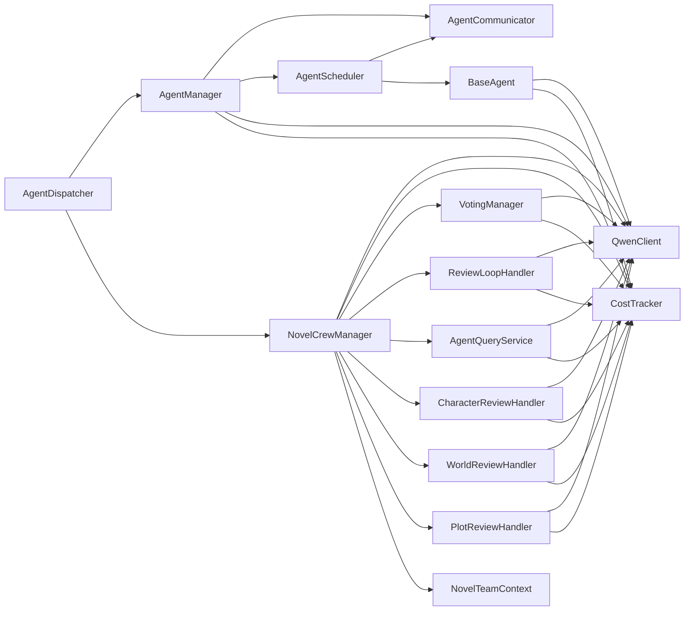

**图表来源**
- [agent_manager.py](file://agents/agent_manager.py#L6-L19)
- [agent_scheduler.py](file://agents/agent_scheduler.py#L7-L10)
- [specific_agents.py](file://agents/specific_agents.py#L5-L9)
- [agent_dispatcher.py](file://agents/agent_dispatcher.py#L7-L11)
- [crew_manager.py](file://agents/crew_manager.py#L14-L35)

**章节来源**
- [agent_manager.py](file://agents/agent_manager.py#L1-L227)
- [agent_scheduler.py](file://agents/agent_scheduler.py#L1-L488)
- [specific_agents.py](file://agents/specific_agents.py#L1-L505)
- [agent_dispatcher.py](file://agents/agent_dispatcher.py#L1-L440)
- [crew_manager.py](file://agents/crew_manager.py#L1-L1038)

## 性能考虑
- 异步与并发：通信与调度均采用asyncio，消息队列与锁保护共享状态，避免竞态
- 任务调度：按优先级与依赖关系调度，减少Agent空闲等待
- LLM调用：使用线程池执行同步调用以避免阻塞事件循环；支持指数退避重试
- 成本控制：CostTracker记录token与成本，便于成本预算与优化
- 并行处理：VotingManager并行调用多个投票者，提高投票效率
- 缓存机制：NovelCrewManager缓存章节摘要和内容，避免重复计算
- 日志级别：生产环境建议INFO以上，避免过多DEBUG日志影响性能
- **增强的依赖检查**：优化的任务调度性能，减少无效任务的处理开销

**章节来源**
- [voting_manager.py](file://agents/voting_manager.py#L111-L123)
- [crew_manager.py](file://agents/crew_manager.py#L682-L689)

## 故障排查指南
- 初始化失败：检查AgentManager初始化流程，确认通信、调度、LLM、成本组件创建成功
- Agent未启动：确认AgentScheduler.register_agent调用与BaseAgent.start执行
- 任务无进展：检查依赖是否满足、Agent是否空闲、消息队列是否正常
- **依赖检查问题**：查看调度器日志中的依赖警告，确认依赖任务ID正确、依赖任务已完成
- **任务完成消息异常**：检查task_id字段是否存在，查看异常处理日志
- LLM调用异常：查看QwenClient重试日志与错误信息，核对配置（密钥、模型、基础URL）
- 成本统计异常：确认CostTracker.record调用与日志输出
- 投票失败：检查VotingManager的并行调用和JSON解析
- 审查循环异常：查看ReviewLoopHandler的评分和修订流程
- 查询协商失败：确认AgentQueryService的查询标记解析和回答生成
- 日志定位：统一使用core.logging_config，关注INFO/ERROR级别输出

**章节来源**
- [agent_manager.py](file://agents/agent_manager.py#L43-L156)
- [agent_scheduler.py](file://agents/agent_scheduler.py#L241-L488)
- [qwen_client.py](file://llm/qwen_client.py#L65-L161)
- [cost_tracker.py](file://llm/cost_tracker.py#L26-L56)
- [voting_manager.py](file://agents/voting_manager.py#L123-L140)
- [review_loop.py](file://agents/review_loop.py#L248-L263)
- [agent_query_service.py](file://agents/agent_query_service.py#L95-L97)
- [logging_config.py](file://core/logging_config.py#L20-L50)

## 结论
Agent管理器核心通过单例模式统一管理Agent系统的初始化、注册与生命周期，结合消息通信与任务调度，实现了可扩展、可观测、可成本控制的多Agent协作框架。特别地，NovelCrewManager新增的400+行高级协调机制，包括投票共识、审查反馈循环、请求-响应协商、质量评估等，形成了完整的智能体协作体系。这些机制通过VotingManager、ReviewLoopHandler、AgentQueryService、各种审查处理器和TeamContext等组件实现，显著提升了小说生成的质量和效率。同时提供两种执行模式（调度器风格与CrewAI风格），满足不同场景需求。配合完善的日志与配置体系，能够稳定支撑复杂的小说生成流水线。

**更新** AgentScheduler的增强依赖检查逻辑提供了更强大的任务依赖验证和错误处理能力，通过详细的警告日志帮助开发者快速定位和解决任务依赖问题，提高了整个系统的稳定性和可靠性。

## 附录

### API参考（AgentManager）
- initialize()：初始化Agent系统，创建通信、调度、LLM、成本组件并注册Agent
  - 参数：无
  - 返回：无
  - 异常：无（内部日志记录）
- start()：启动Agent系统（若未初始化则先初始化）
  - 参数：无
  - 返回：无
- stop()：停止Agent系统并重置状态
  - 参数：无
  - 返回：无
- get_scheduler()：获取调度器实例
  - 参数：无
  - 返回：AgentScheduler或None
- get_agent(agent_name)：获取指定Agent
  - 参数：agent_name: str
  - 返回：Agent实例或None
- get_all_agents()：获取所有Agent映射
  - 参数：无
  - 返回：Dict[str, object]
- get_agent_status(agent_name)：获取Agent状态
  - 参数：agent_name: str
  - 返回：状态字符串或None
- get_all_agent_statuses()：获取所有Agent状态映射
  - 参数：无
  - 返回：Dict[str, str]

**章节来源**
- [agent_manager.py](file://agents/agent_manager.py#L128-L214)

### API参考（AgentDispatcher）
- initialize()：初始化AgentManager并启动Agent
  - 参数：无
  - 返回：无
- set_use_scheduled_agents(use_scheduled)：设置是否使用调度器风格
  - 参数：use_scheduled: bool
  - 返回：无
- run_planning(novel_id, task_id, **kwargs)：执行企划阶段
  - 参数：novel_id: UUID, task_id: UUID, **kwargs
  - 返回：Dict[str, Any]
- run_chapter_writing(novel_id, task_id, chapter_number, volume_number, **kwargs)：执行单章写作
  - 参数：novel_id: UUID, task_id: UUID, chapter_number: int, volume_number: int, **kwargs
  - 返回：Dict[str, Any]
- run_batch_writing(novel_id, task_id, from_chapter, to_chapter, volume_number, **kwargs)：执行批量写作
  - 参数：novel_id: UUID, task_id: UUID, from_chapter: int, to_chapter: int, volume_number: int, **kwargs
  - 返回：Dict[str, Any]
- get_agent_statuses()：获取所有Agent状态
  - 参数：无
  - 返回：Dict[str, str]
- shutdown()：关闭Agent系统
  - 参数：无
  - 返回：无

**章节来源**
- [agent_dispatcher.py](file://agents/agent_dispatcher.py#L33-L440)

### API参考（NovelCrewManager）
- **初始化**：
  - __init__(qwen_client, cost_tracker, quality_threshold=7.5, max_review_iterations=3, max_fix_iterations=2, enable_voting=True, enable_query=True, enable_character_review=True, enable_world_review=True, enable_plot_review=True, character_quality_threshold=7.0, world_quality_threshold=7.0, plot_quality_threshold=7.0, max_character_review_iterations=2, max_world_review_iterations=2, max_plot_review_iterations=2)
  - 参数：LLM客户端、成本跟踪器、质量阈值、最大迭代次数、功能开关等
  - 返回：NovelCrewManager实例

- **企划阶段**：
  - run_planning_phase(genre=None, tags=None, context="", length_type="medium")：执行完整的企划阶段
  - 返回：包含主题分析、世界观设定、角色列表、情节大纲的字典

- **写作阶段**：
  - run_writing_phase(novel_data, chapter_number, volume_number=1, previous_chapters_summary="", character_states="", writing_style="modern", team_context=None)：执行单章写作
  - 返回：包含章节计划、初稿、编辑内容、最终内容、连续性报告、质量评分等的字典

**章节来源**
- [crew_manager.py](file://agents/crew_manager.py#L50-L154)
- [crew_manager.py](file://agents/crew_manager.py#L286-L547)
- [crew_manager.py](file://agents/crew_manager.py#L553-L945)

### API参考（VotingManager）
- initiate_vote(topic, options, context, voters)：发起一次投票
  - 参数：决策主题、可选方案列表、上下文、投票者列表
  - 返回：VoteResult，包含获胜选项、共识强度、详细信息
- _collect_vote(voter, prompt)：收集单个投票者的投票
- _calculate_result(topic, options, votes)：按加权置信度计算获胜方案
- _extract_json(text)：从文本中提取JSON

**章节来源**
- [voting_manager.py](file://agents/voting_manager.py#L85-L140)
- [voting_manager.py](file://agents/voting_manager.py#L142-L211)
- [voting_manager.py](file://agents/voting_manager.py#L213-L236)

### API参考（ReviewLoopHandler）
- execute(initial_draft, chapter_number, chapter_title, chapter_summary, chapter_plan_json, writer_system_prompt, team_context=None)：执行Writer-Editor审查反馈循环
  - 参数：Writer的初稿、章节信息、Writer的system prompt、团队上下文
  - 返回：ReviewLoopResult，包含最终内容、评分、迭代历史等
- _editor_review(content, chapter_number, chapter_title, chapter_summary)：调用Editor进行审查评分+润色

**章节来源**
- [review_loop.py](file://agents/review_loop.py#L113-L263)
- [review_loop.py](file://agents/review_loop.py#L265-L296)

### 使用示例与最佳实践
- 示例一：独立Agent系统启动
  - 参考脚本：scripts/start_agents.py
  - 步骤：初始化QwenClient与CostTracker，创建AgentScheduler，注册五类Agent，等待启动，周期打印状态，优雅关闭
- 示例二：多Agent协作测试
  - 参考脚本：agents/test_multi_agent.py
  - 步骤：创建AgentScheduler，注册Agent，提交市场分析、内容策划、创作、编辑、发布任务，等待完成，打印成本
- 示例三：NovelCrewManager高级协调
  - 步骤：初始化NovelCrewManager，配置投票、审查、查询等功能，执行企划阶段和写作阶段，查看审查循环结果
- 最佳实践
  - 使用AgentManager单例，避免重复初始化
  - 在生产环境设置合适的日志级别与输出
  - 合理设置任务优先级与依赖，避免死锁
  - 使用CostTracker监控成本，定期重置统计
  - 在Agent中实现具体的任务处理逻辑，确保任务完成后发送完成消息
  - 合理配置NovelCrewManager的各项阈值和迭代次数
  - 利用TeamContext实现Agent间的信息共享和状态追踪
  - **利用增强的依赖检查**：仔细查看调度器日志中的依赖警告，及时修正依赖关系

**章节来源**
- [start_agents.py](file://scripts/start_agents.py#L47-L177)
- [test_multi_agent.py](file://agents/test_multi_agent.py#L27-L194)
- [crew_manager.py](file://agents/crew_manager.py#L286-L547)