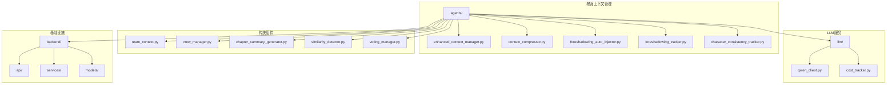
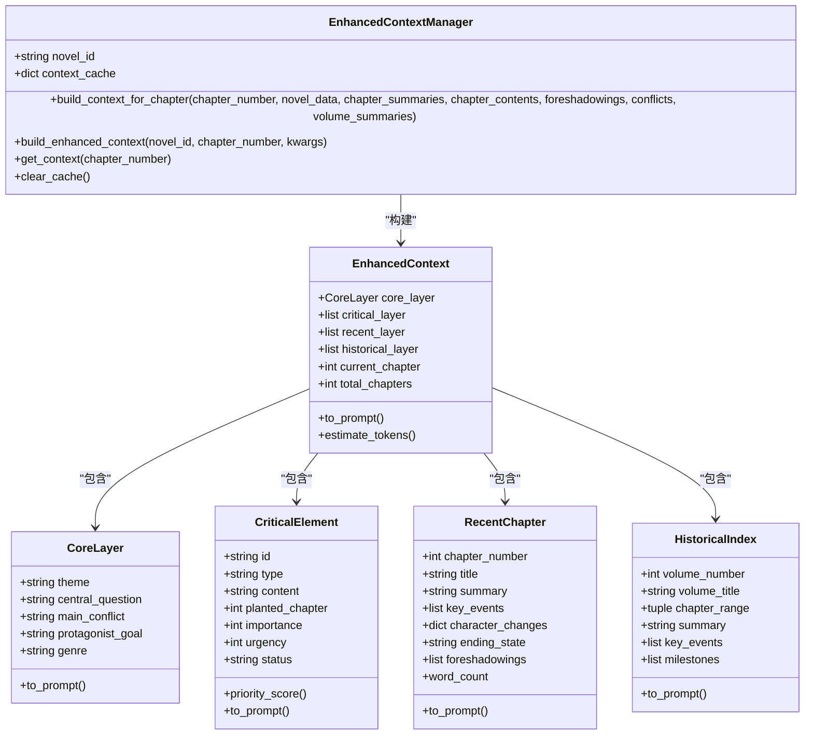
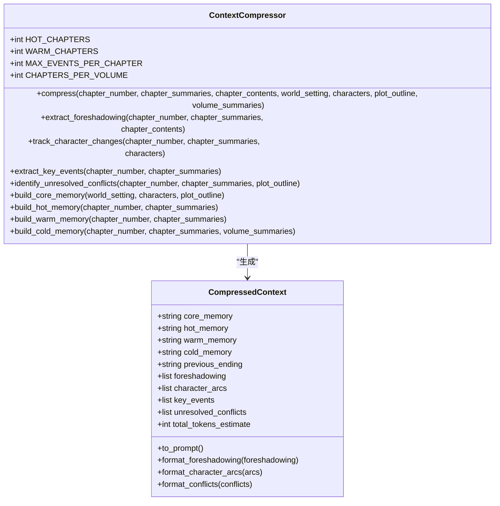
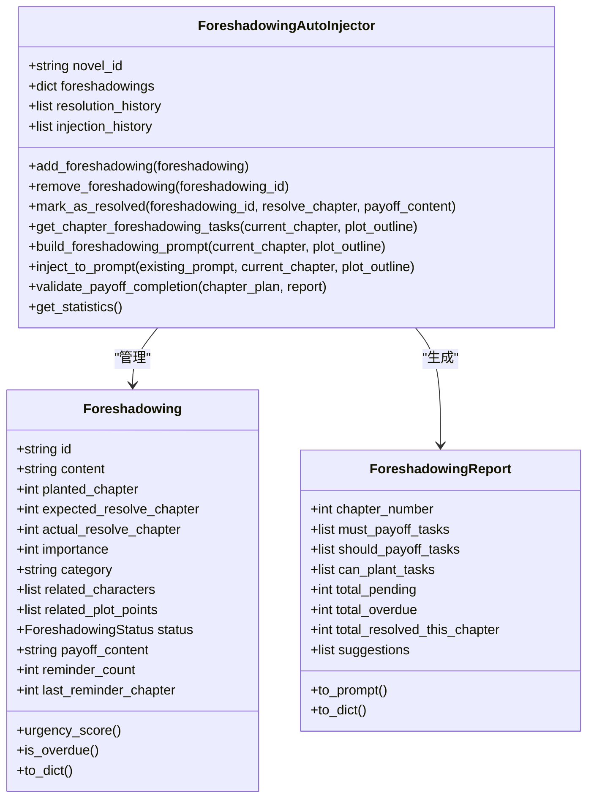
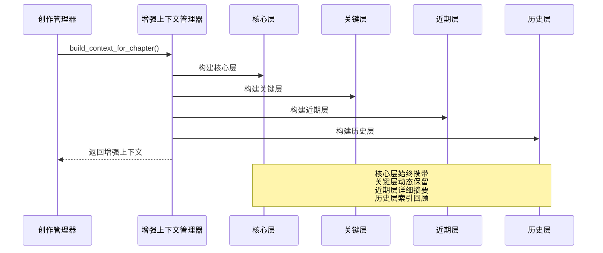
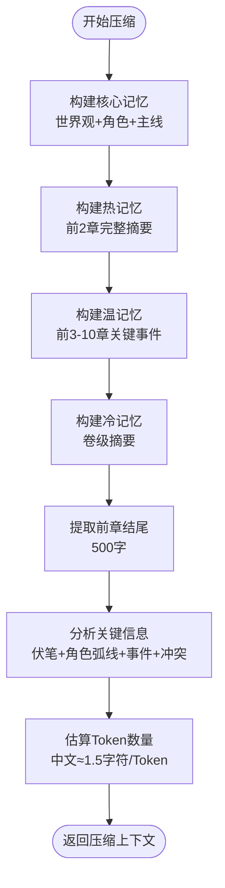
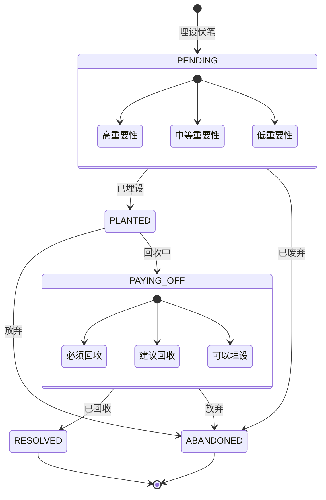
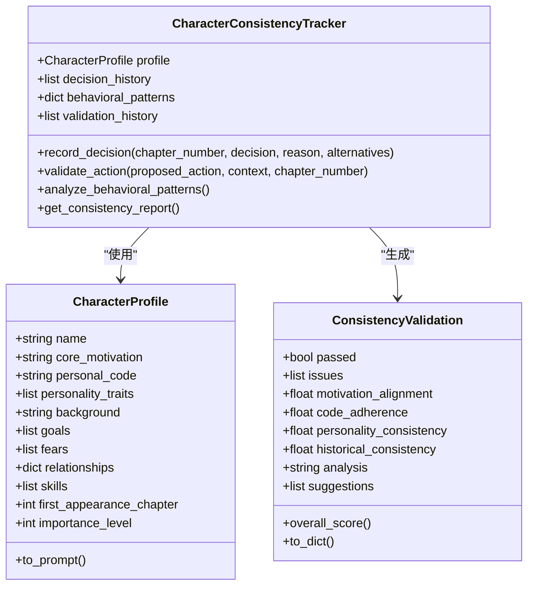
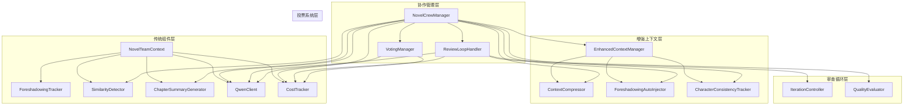

# 上下文压缩系统

<cite>
**本文档引用的文件**
- [enhanced_context_manager.py](file://agents/enhanced_context_manager.py)
- [context_compressor.py](file://agents/context_compressor.py)
- [foreshadowing_auto_injector.py](file://agents/foreshadowing_auto_injector.py)
- [foreshadowing_tracker.py](file://agents/foreshadowing_tracker.py)
- [character_consistency_tracker.py](file://agents/character_consistency_tracker.py)
- [team_context.py](file://agents/team_context.py)
- [crew_manager.py](file://agents/crew_manager.py)
- [qwen_client.py](file://llm/qwen_client.py)
- [chapter_summary_generator.py](file://agents/chapter_summary_generator.py)
- [similarity_detector.py](file://agents/similarity_detector.py)
- [cost_tracker.py](file://llm/cost_tracker.py)
- [review_loop.py](file://agents/review_loop.py)
- [voting_manager.py](file://agents/voting_manager.py)
</cite>

## 更新摘要
**变更内容**
- 新增AdvancedContextManager四层记忆架构，显著提升上下文管理能力
- 集成ContextCompressor组件，实现智能上下文压缩和关键信息提取
- 增强foreshadowing tracking系统，支持自动注入和状态管理
- 新增character arc monitoring功能，追踪角色发展轨迹
- 集成key event identification，自动识别重大转折点
- 扩展上下文管理能力，支持更复杂的创作需求

## 目录
1. [简介](#简介)
2. [项目结构](#项目结构)
3. [核心组件](#核心组件)
4. [架构概览](#架构概览)
5. [详细组件分析](#详细组件分析)
6. [依赖关系分析](#依赖关系分析)
7. [性能考虑](#性能考虑)
8. [故障排除指南](#故障排除指南)
9. [结论](#结论)

## 简介

上下文压缩系统是一个基于人工智能的小说生成辅助系统，专注于小说创作过程中的上下文管理和信息压缩。该系统通过智能压缩技术，将大量小说创作相关的上下文信息转换为精炼、可操作的知识片段，从而提高AI代理在创作过程中的效率和质量。

**更新** 系统现已显著扩展，采用四层记忆架构，支持AdvancedContextManager和ContextCompressor组件，集成了伏笔追踪、角色弧线监控、关键事件识别等高级功能。

系统的核心功能包括：
- **四层记忆架构**：核心层、关键层、近期层、历史层的智能上下文管理
- **智能上下文压缩**：确保上下文大小保持在恒定水平
- **伏笔自动追踪**：埋设、回收、提醒的完整生命周期管理
- **角色发展监控**：追踪角色状态变化和行为模式
- **关键事件识别**：自动提取重大转折点和情节节点
- **成本追踪优化**：精细化的Token使用控制机制

## 项目结构

该项目采用模块化架构设计，主要分为以下几个核心模块：



**图表来源**
- [enhanced_context_manager.py:1-536](file://agents/enhanced_context_manager.py#L1-L536)
- [context_compressor.py:1-658](file://agents/context_compressor.py#L1-L658)
- [foreshadowing_auto_injector.py:1-635](file://agents/foreshadowing_auto_injector.py#L1-L635)
- [foreshadowing_tracker.py:1-376](file://agents/foreshadowing_tracker.py#L1-L376)

**章节来源**
- [enhanced_context_manager.py:1-536](file://agents/enhanced_context_manager.py#L1-L536)
- [context_compressor.py:1-658](file://agents/context_compressor.py#L1-L658)
- [foreshadowing_auto_injector.py:1-635](file://agents/foreshadowing_auto_injector.py#L1-L635)
- [foreshadowing_tracker.py:1-376](file://agents/foreshadowing_tracker.py#L1-L376)

## 核心组件

### 增强上下文管理器 (EnhancedContextManager)

EnhancedContextManager是系统的核心组件，采用四层记忆架构，确保关键信息不丢失：



**图表来源**
- [enhanced_context_manager.py:196-536](file://agents/enhanced_context_manager.py#L196-L536)

### 上下文压缩器 (ContextCompressor)

ContextCompressor实现智能上下文压缩，确保无论小说写到第几章，上下文大小保持在恒定水平：



**图表来源**
- [context_compressor.py:111-658](file://agents/context_compressor.py#L111-L658)

### 伏笔自动注入器 (ForeshadowingAutoInjector)

ForeshadowingAutoInjector提供完整的伏笔生命周期管理：



**图表来源**
- [foreshadowing_auto_injector.py:183-635](file://agents/foreshadowing_auto_injector.py#L183-L635)

**章节来源**
- [enhanced_context_manager.py:196-536](file://agents/enhanced_context_manager.py#L196-L536)
- [context_compressor.py:111-658](file://agents/context_compressor.py#L111-L658)
- [foreshadowing_auto_injector.py:183-635](file://agents/foreshadowing_auto_injector.py#L183-L635)

## 架构概览

系统采用分层架构设计，从底层的LLM服务到顶层的创作流程管理，现已扩展为多层上下文管理：

```mermaid
graph TB
subgraph "用户界面层"
UI[前端界面]
end
subgraph "业务逻辑层"
CM[小说创作管理器]
ECM[增强上下文管理器]
CC[上下文压缩器]
FTI[伏笔自动注入器]
CCT[角色一致性追踪器]
TC[团队上下文]
SD[相似度检测器]
CG[章节摘要生成器]
FT[伏笔追踪器]
end
subgraph "AI服务层"
QC[Qwen客户端]
CE[审查循环]
VM[投票管理器]
end
subgraph "基础设施层"
DB[(数据库)]
LOG[(日志系统)]
CFG[(配置管理)]
END
UI --> CM
CM --> ECM
CM --> CC
CM --> FTI
CM --> CCT
CM --> TC
CM --> SD
CM --> CG
CM --> FT
CM --> QC
CM --> CE
CM --> VM
QC --> DB
ECM --> LOG
CC --> LOG
FTI --> LOG
CCT --> LOG
TC --> LOG
SD --> LOG
CG --> LOG
FT --> LOG
```

**图表来源**
- [crew_manager.py:38-150](file://agents/crew_manager.py#L38-L150)
- [enhanced_context_manager.py:196-280](file://agents/enhanced_context_manager.py#L196-L280)

## 详细组件分析

### 四层记忆架构

系统采用创新的四层记忆架构，确保关键信息的完整保留：



**图表来源**
- [enhanced_context_manager.py:211-279](file://agents/enhanced_context_manager.py#L211-L279)

### 智能上下文压缩

ContextCompressor实现精确的上下文压缩，确保Token使用效率：



**图表来源**
- [context_compressor.py:138-207](file://agents/context_compressor.py#L138-L207)

### 伏笔生命周期管理

ForeshadowingAutoInjector提供完整的伏笔管理：



**图表来源**
- [foreshadowing_auto_injector.py:183-305](file://agents/foreshadowing_auto_injector.py#L183-L305)

### 角色一致性追踪

CharacterConsistencyTracker维护角色行为的一致性：



**图表来源**
- [character_consistency_tracker.py:192-724](file://agents/character_consistency_tracker.py#L192-L724)

**章节来源**
- [enhanced_context_manager.py:211-536](file://agents/enhanced_context_manager.py#L211-L536)
- [context_compressor.py:138-658](file://agents/context_compressor.py#L138-L658)
- [foreshadowing_auto_injector.py:183-635](file://agents/foreshadowing_auto_injector.py#L183-L635)
- [character_consistency_tracker.py:192-724](file://agents/character_consistency_tracker.py#L192-L724)

## 依赖关系分析

系统采用松耦合的设计，各组件之间通过明确定义的接口进行交互：



**图表来源**
- [crew_manager.py:38-150](file://agents/crew_manager.py#L38-L150)
- [enhanced_context_manager.py:196-280](file://agents/enhanced_context_manager.py#L196-L280)

**章节来源**
- [crew_manager.py:1-1038](file://agents/crew_manager.py#L1-L1038)
- [enhanced_context_manager.py:1-536](file://agents/enhanced_context_manager.py#L1-L536)

## 性能考虑

### Token使用优化

系统实现了精细化的成本控制机制：

- **四层记忆架构**：通过核心层始终携带、关键层动态保留、近期层详细、历史层索引的方式，确保Token使用效率
- **智能压缩算法**：ContextCompressor确保上下文大小保持在恒定水平，避免随章节增长而膨胀
- **关键信息提取**：自动识别伏笔、角色弧线、关键事件、未解决冲突等重要信息
- **缓存机制**：EnhancedContextManager提供上下文缓存，避免重复计算
- **批量处理**：支持并发处理多个章节的上下文构建任务

### 内存管理

- **分层存储**：不同层级使用不同的存储策略，核心层常驻内存，历史层按需加载
- **增量更新**：只处理新增或变更的内容，避免全量重新计算
- **内存限制**：设置合理的内存使用上限，防止溢出
- **对象池**：复用数据类实例，减少内存分配

### 并发处理

- **异步调用**：LLM调用采用异步模式，提高响应速度
- **并行上下文构建**：多个章节的上下文可以并行构建
- **流水线处理**：各组件之间采用流水线模式，减少等待时间
- **缓存优化**：多级缓存机制，提高重复查询效率

## 故障排除指南

### 常见问题及解决方案

**1. 上下文构建失败**
- 检查章节摘要数据的完整性
- 验证novel_data格式是否正确
- 确认foreshadowings和conflicts数据结构
- 查看重试机制是否正常工作

**2. Token使用超限**
- 调整压缩参数和阈值
- 检查上下文缓存是否正常清理
- 验证压缩算法的配置
- 监控各层级的Token使用情况

**3. 伏笔追踪异常**
- 检查伏笔状态转换逻辑
- 验证预期回收章节的计算
- 确认提醒机制的触发条件
- 查看日志中的状态变更记录

**4. 角色一致性验证失败**
- 检查角色档案的完整性
- 验证决策历史的准确性
- 确认行为模式分析的逻辑
- 查看一致性评分的计算方式

**5. 成本超支**
- 检查Token使用限制
- 优化提示词长度
- 实施更严格的成本控制
- 监控各组件的Token使用情况

**章节来源**
- [enhanced_context_manager.py:206-280](file://agents/enhanced_context_manager.py#L206-L280)
- [context_compressor.py:128-137](file://agents/context_compressor.py#L128-L137)
- [foreshadowing_auto_injector.py:194-206](file://agents/foreshadowing_auto_injector.py#L194-L206)
- [character_consistency_tracker.py:250-262](file://agents/character_consistency_tracker.py#L250-L262)

## 结论

上下文压缩系统通过智能化的上下文管理和信息压缩技术，为AI驱动的小说创作提供了强大的支持。系统经过显著扩展，现已具备以下核心优势：

1. **四层记忆架构**：通过核心层、关键层、近期层、历史层的智能设计，确保关键信息的完整保留和高效管理
2. **智能上下文压缩**：ContextCompressor实现精确的Token控制，确保系统性能稳定
3. **完整的伏笔管理**：ForeshadowingAutoInjector提供从埋设到回收的完整生命周期管理
4. **角色一致性保障**：CharacterConsistencyTracker确保角色行为的连贯性和可信度
5. **关键事件识别**：自动提取重大转折点，提升情节发展的逻辑性
6. **成本控制优化**：精细化的成本追踪和控制机制，确保资源使用的高效性
7. **可扩展架构**：模块化设计便于功能扩展和维护

**更新** 新版本系统显著提升了上下文管理能力，通过AdvancedContextManager和ContextCompressor组件的集成，实现了更智能、更高效的小说创作支持。系统现在能够更好地处理长篇小说的复杂上下文需求，为自动化小说创作提供了一个更加完善的技术基础。

该系统为自动化小说创作提供了一个坚实的技术基础，能够有效提高创作效率和质量，同时保持合理的成本控制。随着功能的不断扩展和完善，系统将能够支持更大规模、更复杂的小说创作项目。