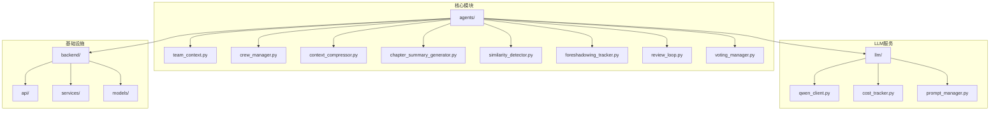
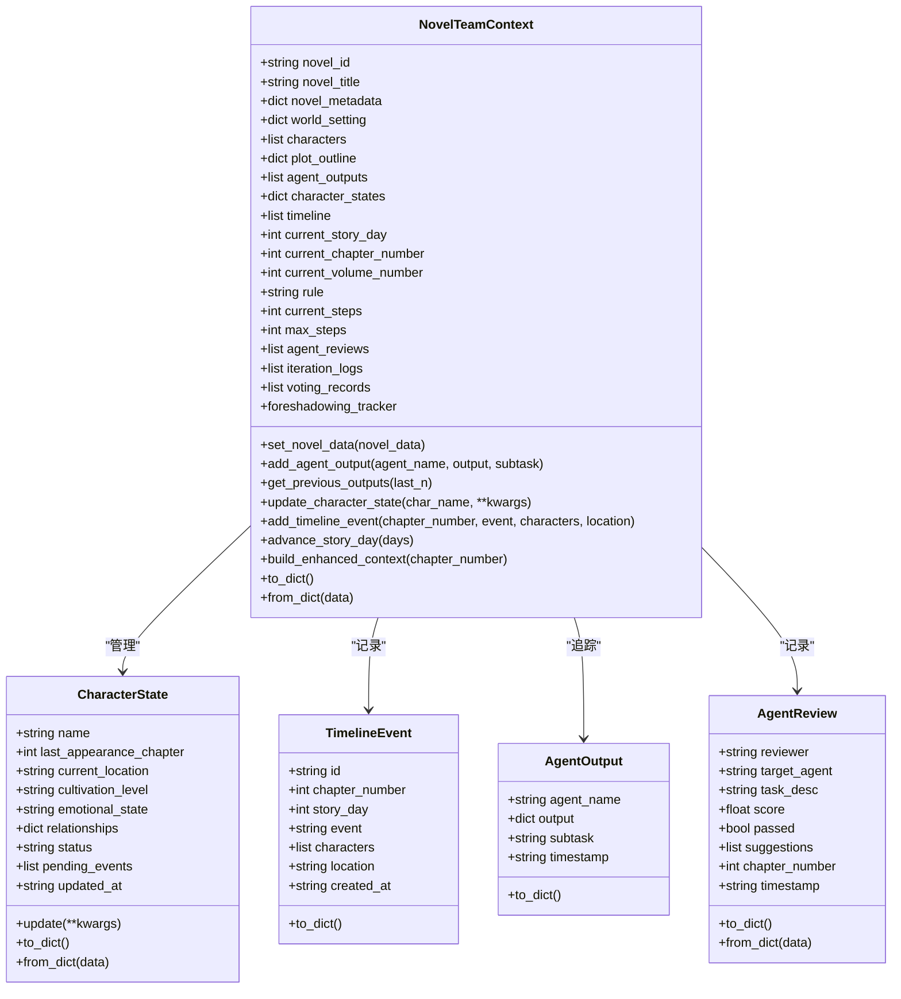
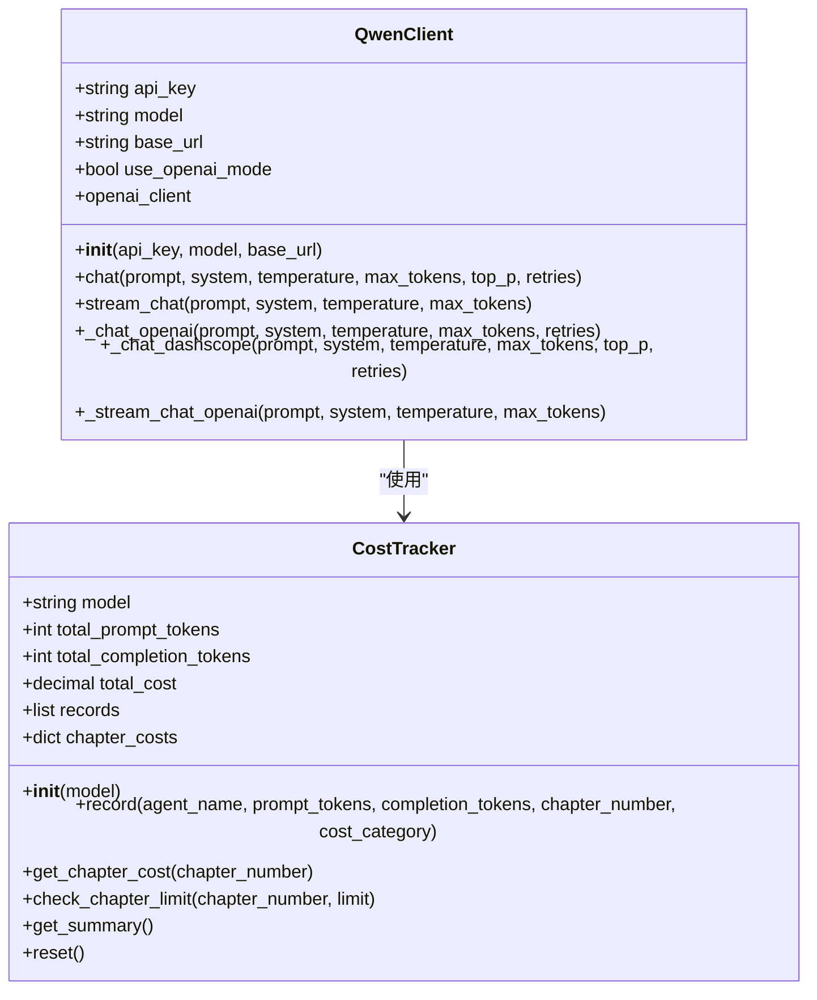
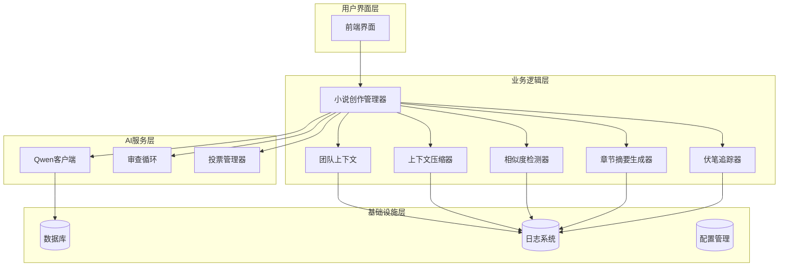
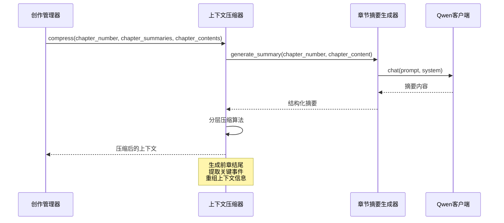
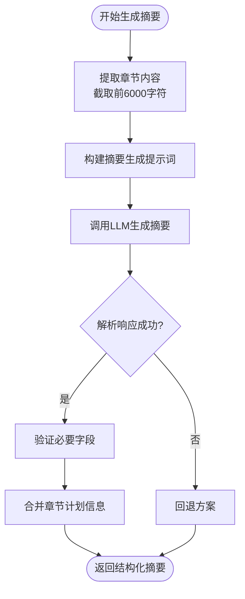
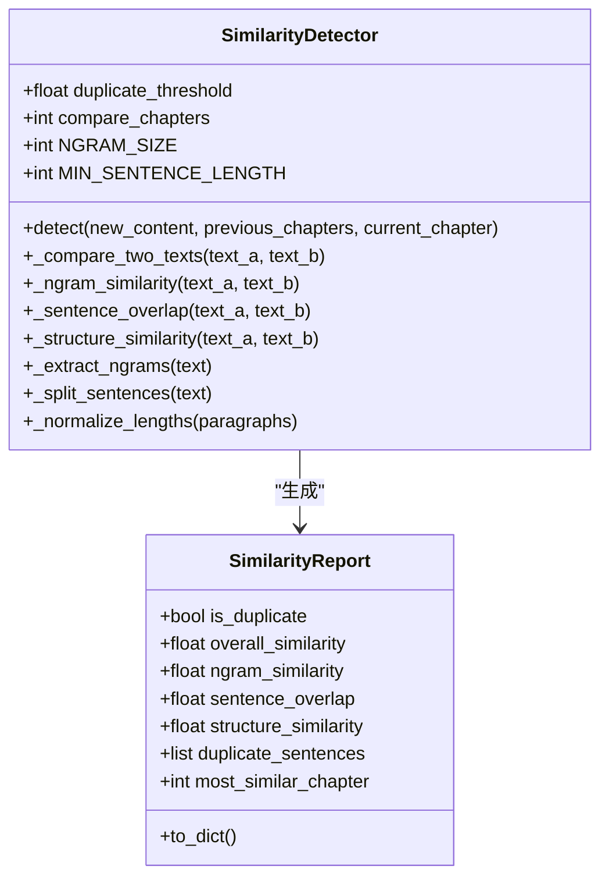
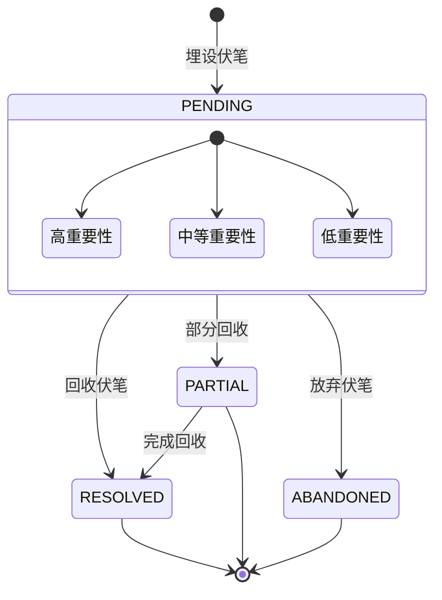
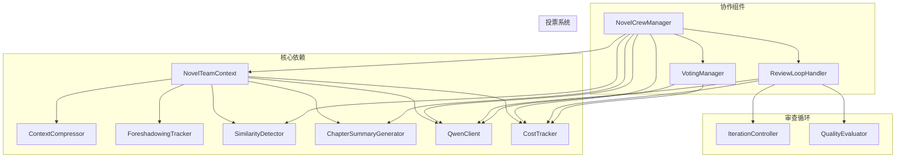

# 上下文压缩系统

<cite>
**本文档引用的文件**
- [team_context.py](file://agents/team_context.py)
- [crew_manager.py](file://agents/crew_manager.py)
- [qwen_client.py](file://llm/qwen_client.py)
- [chapter_summary_generator.py](file://agents/chapter_summary_generator.py)
- [similarity_detector.py](file://agents/similarity_detector.py)
- [cost_tracker.py](file://llm/cost_tracker.py)
- [foreshadowing_tracker.py](file://agents/foreshadowing_tracker.py)
- [review_loop.py](file://agents/review_loop.py)
- [voting_manager.py](file://agents/voting_manager.py)
</cite>

## 目录
1. [简介](#简介)
2. [项目结构](#项目结构)
3. [核心组件](#核心组件)
4. [架构概览](#架构概览)
5. [详细组件分析](#详细组件分析)
6. [依赖关系分析](#依赖关系分析)
7. [性能考虑](#性能考虑)
8. [故障排除指南](#故障排除指南)
9. [结论](#结论)

## 简介

上下文压缩系统是一个基于人工智能的小说生成辅助系统，专注于小说创作过程中的上下文管理和信息压缩。该系统通过智能压缩技术，将大量小说创作相关的上下文信息转换为精炼、可操作的知识片段，从而提高AI代理在创作过程中的效率和质量。

系统的核心功能包括：
- 小说团队上下文管理
- 章节内容压缩和摘要生成
- 相似度检测和去重
- 伏笔追踪和管理
- 成本追踪和优化
- 审查反馈循环

## 项目结构

该项目采用模块化架构设计，主要分为以下几个核心模块：

**图表来源**
- [team_context.py](file://agents/team_context.py#L1-L493)
- [crew_manager.py](file://agents/crew_manager.py#L1-L1038)
- [qwen_client.py](file://llm/qwen_client.py#L1-L232)

**章节来源**
- [team_context.py](file://agents/team_context.py#L1-L493)
- [crew_manager.py](file://agents/crew_manager.py#L1-L1038)

## 核心组件

### 上下文管理器 (NovelTeamContext)

NovelTeamContext是系统的核心上下文管理组件，负责维护整个小说创作过程中的所有相关信息。

**图表来源**
- [team_context.py](file://agents/team_context.py#L14-L493)

### LLM客户端 (QwenClient)

QwenClient提供统一的LLM调用接口，支持多种部署模式和错误处理机制。

**图表来源**
- [qwen_client.py](file://llm/qwen_client.py#L16-L232)
- [cost_tracker.py](file://llm/cost_tracker.py#L16-L120)

**章节来源**
- [team_context.py](file://agents/team_context.py#L155-L493)
- [qwen_client.py](file://llm/qwen_client.py#L16-L232)
- [cost_tracker.py](file://llm/cost_tracker.py#L16-L120)

## 架构概览

系统采用分层架构设计，从底层的LLM服务到顶层的创作流程管理：

**图表来源**
- [crew_manager.py](file://agents/crew_manager.py#L38-L150)
- [team_context.py](file://agents/team_context.py#L155-L216)

## 详细组件分析

### 上下文压缩器 (ContextCompressor)

上下文压缩器是系统的核心组件之一，负责将大量的小说创作上下文信息进行智能压缩和重组。

**图表来源**
- [crew_manager.py](file://agents/crew_manager.py#L681-L694)
- [chapter_summary_generator.py](file://agents/chapter_summary_generator.py#L23-L98)

### 章节摘要生成器 (ChapterSummaryGenerator)

章节摘要生成器专门负责从完整的章节内容中提取关键信息，生成结构化的摘要。

**图表来源**
- [chapter_summary_generator.py](file://agents/chapter_summary_generator.py#L23-L98)

### 相似度检测器 (SimilarityDetector)

相似度检测器用于检测新生成的章节与之前章节的相似程度，防止内容重复。

**图表来源**
- [similarity_detector.py](file://agents/similarity_detector.py#L41-L235)

### 伏笔追踪器 (ForeshadowingTracker)

伏笔追踪器负责管理小说中的伏笔埋设和回收，确保情节的连贯性。

**图表来源**
- [foreshadowing_tracker.py](file://agents/foreshadowing_tracker.py#L15-L120)

**章节来源**
- [crew_manager.py](file://agents/crew_manager.py#L144-L149)
- [chapter_summary_generator.py](file://agents/chapter_summary_generator.py#L15-L162)
- [similarity_detector.py](file://agents/similarity_detector.py#L41-L235)
- [foreshadowing_tracker.py](file://agents/foreshadowing_tracker.py#L120-L376)

## 依赖关系分析

系统采用松耦合的设计，各组件之间通过明确定义的接口进行交互：

**图表来源**
- [crew_manager.py](file://agents/crew_manager.py#L38-L150)
- [team_context.py](file://agents/team_context.py#L155-L216)

**章节来源**
- [crew_manager.py](file://agents/crew_manager.py#L1-L1038)
- [team_context.py](file://agents/team_context.py#L1-L493)

## 性能考虑

### Token使用优化

系统实现了精细化的成本控制机制：

- **分层压缩策略**：通过多级压缩减少Token消耗
- **智能截断**：自动截取关键信息，避免冗余内容
- **成本追踪**：实时监控每个组件的Token使用情况
- **批量处理**：支持并发处理多个章节的压缩任务

### 内存管理

- **缓存机制**：章节摘要和内容缓存，避免重复计算
- **增量更新**：只处理新增或变更的内容
- **内存限制**：设置合理的内存使用上限，防止溢出

### 并发处理

- **异步调用**：LLM调用采用异步模式，提高响应速度
- **并行投票**：投票系统支持多Agent并行投票
- **流水线处理**：各组件之间采用流水线模式，减少等待时间

## 故障排除指南

### 常见问题及解决方案

**1. LLM调用失败**
- 检查API密钥和网络连接
- 查看重试机制是否正常工作
- 验证模型配置是否正确

**2. 上下文压缩效果不佳**
- 调整压缩参数和阈值
- 检查输入内容的质量
- 验证摘要生成器的配置

**3. 相似度检测误报**
- 调整相似度阈值
- 检查N-gram大小设置
- 验证句子分割算法

**4. 成本超支**
- 检查Token使用限制
- 优化提示词长度
- 实施更严格的成本控制

**章节来源**
- [qwen_client.py](file://llm/qwen_client.py#L46-L161)
- [cost_tracker.py](file://llm/cost_tracker.py#L28-L82)
- [similarity_detector.py](file://agents/similarity_detector.py#L65-L110)

## 结论

上下文压缩系统通过智能化的上下文管理和信息压缩技术，为AI驱动的小说创作提供了强大的支持。系统的主要优势包括：

1. **全面的上下文管理**：通过NovelTeamContext统一管理所有创作相关信息
2. **高效的压缩算法**：智能压缩技术显著减少了Token消耗
3. **质量保证机制**：审查反馈循环确保内容质量
4. **成本控制优化**：精细的成本追踪和控制机制
5. **可扩展架构**：模块化设计便于功能扩展和维护

该系统为自动化小说创作提供了一个坚实的技术基础，能够有效提高创作效率和质量，同时保持合理的成本控制。