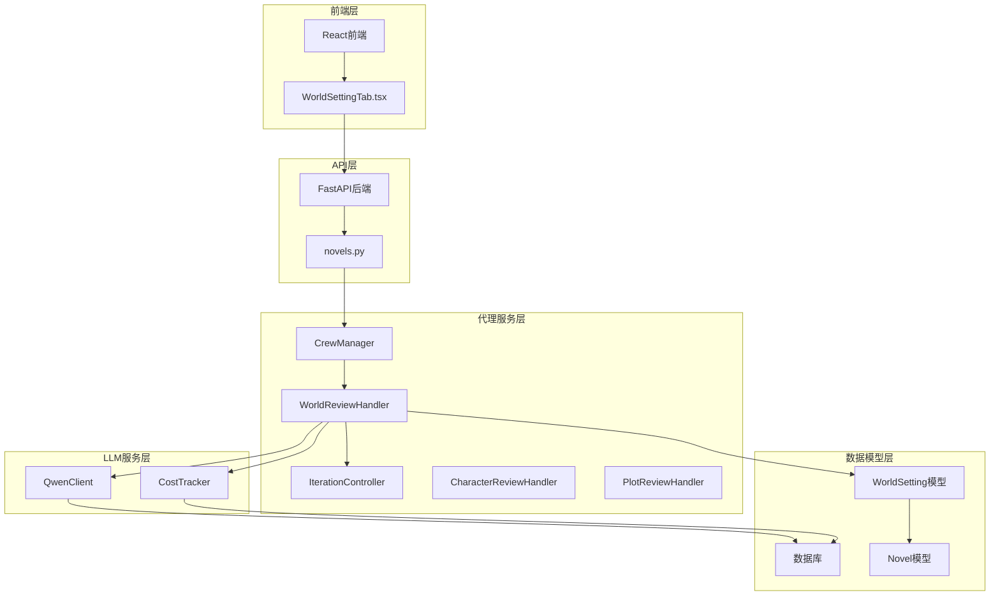
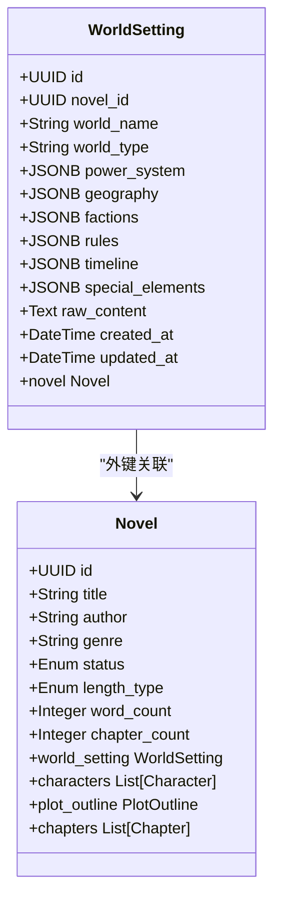
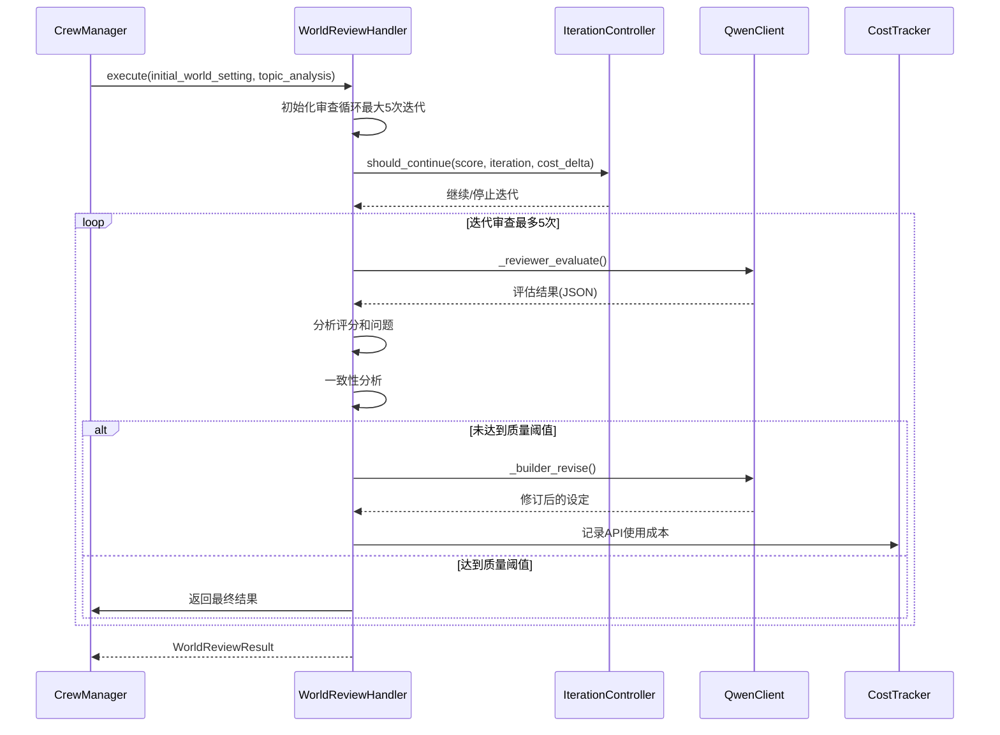
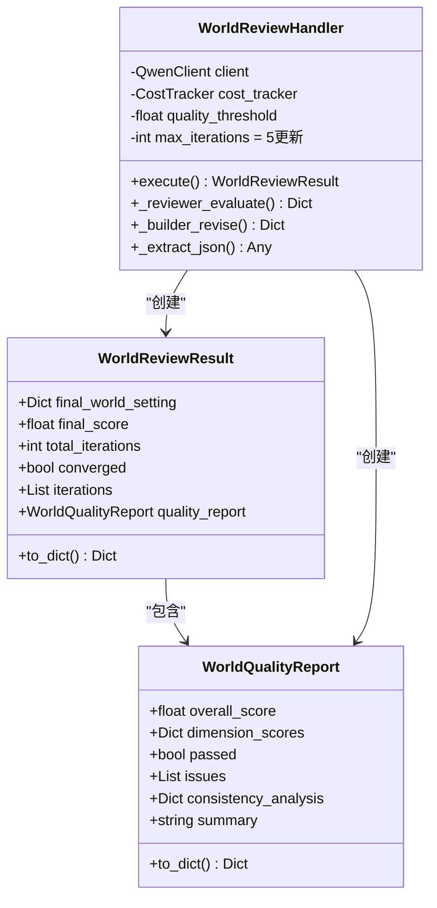
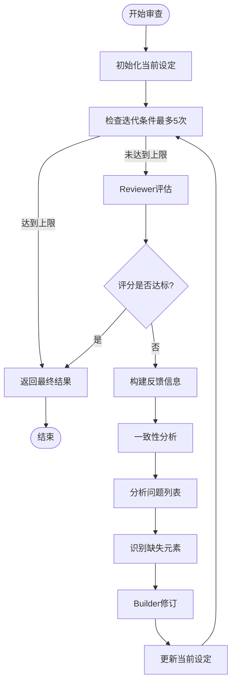
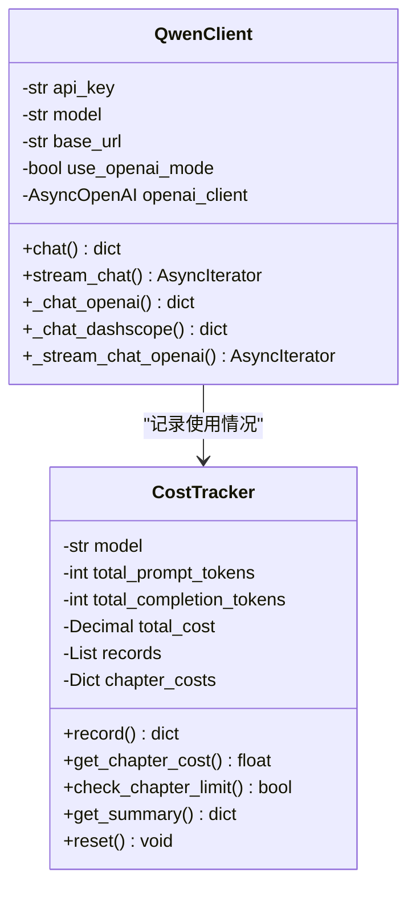

# 世界设定审查处理器

<cite>
**本文档引用的文件**
- [world_setting.py](file://core/models/world_setting.py)
- [world_review_loop.py](file://agents/world_review_loop.py)
- [iteration_controller.py](file://agents/iteration_controller.py)
- [crew_manager.py](file://agents/crew_manager.py)
- [qwen_client.py](file://llm/qwen_client.py)
- [cost_tracker.py](file://llm/cost_tracker.py)
- [config.py](file://backend/config.py)
- [database.py](file://core/database.py)
- [WorldSettingTab.tsx](file://frontend/src/pages/NovelDetail/WorldSettingTab.tsx)
- [novels.py](file://backend/api/v1/novels.py)
- [agent_dispatcher.py](file://agents/agent_dispatcher.py)
- [generation_service.py](file://backend/services/generation_service.py)
</cite>

## 更新摘要
**变更内容**
- 世界审查处理器的最大迭代次数从3次统一增加到5次，提供更充分的优化空间
- 配置系统支持统一的5次最大迭代限制，替代之前的3次限制
- 新增迭代控制机制，支持多轮审查循环的智能控制
- 改进评估功能，新增一致性分析和改进建议功能
- 扩展评估维度，包括内在一致性、深度与广度、独特性、可扩展性、力量体系完整性五个方面
- 增强系统的一致性分析能力，能够识别逻辑矛盾和设定冲突
- 完善迭代历史记录和收敛状态跟踪

## 目录
1. [简介](#简介)
2. [项目结构](#项目结构)
3. [核心组件](#核心组件)
4. [架构概览](#架构概览)
5. [详细组件分析](#详细组件分析)
6. [依赖关系分析](#依赖关系分析)
7. [性能考虑](#性能考虑)
8. [故障排除指南](#故障排除指南)
9. [结论](#结论)

## 简介

世界设定审查处理器是小说生成系统中的关键组件，负责确保虚拟世界的设定具有深度、一致性和创新性。该处理器通过Builder-Reviewer循环迭代机制，对世界观设计进行多维度评估和优化，确保生成的小说具备完整的背景设定和支撑长期连载的扩展空间。

系统采用先进的LLM技术，结合严格的审查流程，实现了从初步设定到最终成品的自动化质量保证。处理器不仅评估设定的内在一致性，还关注力量体系的完整性、地理环境的丰富性以及势力组织的复杂性等多个维度。新增的迭代控制机制和改进评估功能使得系统能够进行多轮审查循环，支持智能的一致性分析，识别逻辑矛盾和设定冲突，并提供具体的改进建议。

**更新** 世界审查处理器现已采用统一的5次最大迭代限制，相比之前的3次限制，提供了更充分的优化空间和更稳定的审查流程。

## 项目结构

小说系统采用模块化架构设计，世界设定审查处理器位于代理服务层的核心位置，与数据模型层、API接口层和前端展示层形成完整的生态系统。



**图表来源**
- [crew_manager.py](file://agents/crew_manager.py#L50-L141)
- [world_review_loop.py](file://agents/world_review_loop.py#L206-L227)
- [iteration_controller.py](file://agents/iteration_controller.py#L41-L48)
- [qwen_client.py](file://llm/qwen_client.py#L16-L45)
- [cost_tracker.py](file://llm/cost_tracker.py#L16-L27)

**章节来源**
- [crew_manager.py](file://agents/crew_manager.py#L50-L141)
- [world_review_loop.py](file://agents/world_review_loop.py#L1-L482)
- [iteration_controller.py](file://agents/iteration_controller.py#L1-L159)

## 核心组件

### 世界设定模型

世界设定审查处理器基于强大的数据模型基础，支持JSONB格式存储复杂的设定信息。



**图表来源**
- [world_setting.py](file://core/models/world_setting.py#L11-L28)
- [novel.py](file://core/models/novel.py#L37-L66)

### 审查处理器架构

世界设定审查处理器采用Builder-Reviewer模式，通过多轮迭代实现质量优化。新增的迭代控制机制提供了更智能的控制策略，支持统一的5次最大迭代限制。



**图表来源**
- [crew_manager.py](file://agents/crew_manager.py#L367-L389)
- [world_review_loop.py](file://agents/world_review_loop.py#L228-L355)
- [iteration_controller.py](file://agents/iteration_controller.py#L70-L115)

**章节来源**
- [world_setting.py](file://core/models/world_setting.py#L1-L29)
- [world_review_loop.py](file://agents/world_review_loop.py#L206-L482)
- [iteration_controller.py](file://agents/iteration_controller.py#L41-L159)

## 架构概览

世界设定审查处理器在整个小说生成系统中扮演着关键角色，通过严格的审查流程确保生成内容的质量和一致性。新增的迭代控制机制提供了更精细的控制策略，支持统一的5次最大迭代限制。

```mermaid
graph TB
subgraph "配置管理"
CFG[Settings配置]
ENV[环境变量]
END
subgraph "审查循环控制"
BR[Builder-Reviewer循环]
IC[迭代控制器]
EVAL[多维度评估]
CONSIST[一致性检查]
REVISE[自动修订]
END
subgraph "LLM集成"
LLM[通义千问API]
PROMPT[专用提示词]
STREAM[流式响应]
END
subgraph "成本控制"
COST[Token追踪]
LIMIT[成本限制]
REPORT[成本报表]
END
CFG --> BR
CFG --> IC
ENV --> LLM
BR --> EVAL
BR --> CONSIST
BR --> REVISE
IC --> EVAL
IC --> CONSIST
IC --> REVISE
EVAL --> LLM
CONSIST --> LLM
REVISE --> LLM
LLM --> COST
COST --> LIMIT
LIMIT --> REPORT
```

**图表来源**
- [config.py](file://backend/config.py#L50-L91)
- [qwen_client.py](file://llm/qwen_client.py#L46-L64)
- [cost_tracker.py](file://llm/cost_tracker.py#L28-L82)
- [iteration_controller.py](file://agents/iteration_controller.py#L41-L48)

## 详细组件分析

### 世界审查处理器

世界审查处理器是整个系统的智能核心，负责对虚拟世界的各个方面进行全面评估。新增的功能包括改进的评估维度和一致性分析，支持统一的5次最大迭代限制。

#### 数据结构设计

处理器使用精心设计的数据类来封装审查过程中的各种信息：



**图表来源**
- [world_review_loop.py](file://agents/world_review_loop.py#L42-L59)
- [world_review_loop.py](file://agents/world_review_loop.py#L206-L227)

#### 审查维度体系

处理器建立了全面的评估维度，确保世界观的各个层面都得到充分考量。评估维度包括内在一致性、深度与广度、独特性、可扩展性、力量体系完整性五个方面：

| 评估维度 | 描述 | 关键要素 |
|---------|------|----------|
| 内在一致性 | 设定之间的逻辑自洽性 | 力量体系与规则的协调、历史事件的连贯性、逻辑矛盾识别 |
| 深度与广度 | 设定的丰富程度和细节层次 | 力量体系的层次性、地理环境的多样性、势力架构的复杂性 |
| 独特性 | 世界观的新颖性和创新性 | 独特的元素、避免模板化设计、创新点评估 |
| 可扩展性 | 支撑长期连载的发展空间 | 未探索区域、预留的势力和主题、未来发展线索 |
| 力量体系完整性 | 修炼和升级机制的合理性 | 等级划分、升级条件、能力限制、体系约束 |

#### 审查流程优化

处理器实现了智能的迭代优化机制，通过分析上一轮的反馈来指导下一轮的修订。新增的迭代控制机制提供了更精细的控制策略，支持统一的5次最大迭代限制：



**图表来源**
- [world_review_loop.py](file://agents/world_review_loop.py#L239-L355)
- [iteration_controller.py](file://agents/iteration_controller.py#L70-L115)

**章节来源**
- [world_review_loop.py](file://agents/world_review_loop.py#L62-L204)
- [world_review_loop.py](file://agents/world_review_loop.py#L206-L482)
- [iteration_controller.py](file://agents/iteration_controller.py#L41-L159)

### LLM集成架构

世界审查处理器深度集成了通义千问LLM服务，通过专用的提示词和API调用来实现智能化的审查功能。新增的改进评估功能包括更详细的反馈和建议，支持统一的5次最大迭代限制。

#### API客户端设计

QwenClient提供了统一的API访问接口，支持多种部署模式：



**图表来源**
- [qwen_client.py](file://llm/qwen_client.py#L16-L45)
- [cost_tracker.py](file://llm/cost_tracker.py#L16-L27)

#### 提示词工程

处理器使用精心设计的提示词来指导LLM进行专业的审查工作。新增的提示词包含了更详细的评估维度和一致性分析要求，支持统一的5次最大迭代限制：

| 提示词类型 | 用途 | 关键特点 |
|-----------|------|----------|
| WORLD_REVIEWER_SYSTEM | 审查员系统提示词 | 专业评审专家角色，严格评估维度，一致性分析 |
| WORLD_REVIEWER_TASK | 审查任务提示词 | 多维度评分和问题识别，改进评估，一致性检查 |
| WORLD_REVISION_TASK | 修订任务提示词 | 具体的修订指导和要求，问题修复导向 |

**章节来源**
- [qwen_client.py](file://llm/qwen_client.py#L1-L232)
- [cost_tracker.py](file://llm/cost_tracker.py#L1-L120)
- [world_review_loop.py](file://agents/world_review_loop.py#L64-L203)

### 前端集成

前端界面提供了直观的世界观设定查看和交互功能：

```mermaid
graph LR
subgraph "前端组件"
WST[WorldSettingTab]
DESC[Descriptions组件]
COLLAPSE[Collapse组件]
TAG[Tag组件]
end
subgraph "数据流"
API[API接口]
STATE[React状态]
RENDER[渲染逻辑]
END
WST --> API
API --> STATE
STATE --> RENDER
RENDER --> DESC
RENDER --> COLLAPSE
RENDER --> TAG
```

**图表来源**
- [WorldSettingTab.tsx](file://frontend/src/pages/NovelDetail/WorldSettingTab.tsx#L55-L121)

**章节来源**
- [WorldSettingTab.tsx](file://frontend/src/pages/NovelDetail/WorldSettingTab.tsx#L1-L122)

## 依赖关系分析

世界设定审查处理器与系统中的多个组件存在紧密的依赖关系，形成了完整的审查生态系统。新增的迭代控制机制增强了系统的控制能力，支持统一的5次最大迭代限制。

```mermaid
graph TB
subgraph "核心依赖"
WRH[WorldReviewHandler]
IC[IterationController]
QC[QwenClient]
CT[CostTracker]
WS[WorldSetting模型]
END
subgraph "配置依赖"
CFG[Settings配置]
ENV[环境变量]
END
subgraph "数据依赖"
DB[数据库连接]
ASYNC[异步会话]
MODEL[ORM模型]
END
subgraph "外部服务"
LLM[通义千问API]
REDIS[Redis缓存]
CELERY[Celery任务队列]
END
WRH --> QC
WRH --> CT
WRH --> WS
WRH --> IC
IC --> WRH
QC --> LLM
CT --> DB
WS --> MODEL
CFG --> WRH
CFG --> IC
ENV --> QC
DB --> ASYNC
ASYNC --> DB
```

**图表来源**
- [crew_manager.py](file://agents/crew_manager.py#L127-L133)
- [config.py](file://backend/config.py#L5-L49)
- [database.py](file://core/database.py#L11-L23)
- [iteration_controller.py](file://agents/iteration_controller.py#L41-L48)

**章节来源**
- [crew_manager.py](file://agents/crew_manager.py#L1-L389)
- [config.py](file://backend/config.py#L1-L101)
- [database.py](file://core/database.py#L1-L36)
- [iteration_controller.py](file://agents/iteration_controller.py#L1-L159)

## 性能考虑

世界设定审查处理器在设计时充分考虑了性能优化和资源控制，确保在保证质量的同时实现高效的运行。新增的迭代控制机制提供了更精细的成本控制策略，支持统一的5次最大迭代限制。

### 成本控制策略

系统实现了多层次的成本控制机制：

1. **Token使用追踪**：实时监控每次API调用的输入输出token数量
2. **成本阈值限制**：为不同章节设置成本上限，防止过度消费
3. **迭代次数控制**：限制最大迭代次数，避免无限循环消耗（现为5次）
4. **模型选择优化**：根据不同场景选择合适的LLM模型
5. **迭代历史记录**：跟踪每次迭代的成本和效果

### 并发处理能力

处理器支持异步并发处理，能够同时处理多个审查任务：

- **异步API调用**：使用async/await模式提高响应效率
- **流式响应处理**：支持LLM的流式输出，减少等待时间
- **连接池管理**：数据库连接池优化，提高并发性能

### 缓存和优化

系统采用了多种缓存和优化策略：

- **LLM响应缓存**：对重复的审查请求进行缓存
- **配置参数缓存**：使用LRU缓存存储配置信息
- **数据库查询优化**：使用selectinload优化关联查询

## 故障排除指南

### 常见问题诊断

#### LLM API调用失败

**症状**：审查过程抛出API调用异常

**可能原因**：
- API密钥配置错误
- 网络连接不稳定
- LLM服务不可用

**解决方案**：
1. 检查环境变量配置
2. 验证网络连接状态
3. 查看服务日志获取详细错误信息

#### JSON解析错误

**症状**：从LLM响应中提取JSON失败

**可能原因**：
- LLM返回格式不符合预期
- 响应内容包含额外字符

**解决方案**：
1. 检查提示词格式
2. 实现更健壮的JSON解析逻辑
3. 添加响应内容验证

#### 数据库连接问题

**症状**：无法保存审查结果到数据库

**可能原因**：
- 数据库连接池耗尽
- SQLAlchemy会话管理异常

**解决方案**：
1. 检查数据库连接配置
2. 实现连接池监控
3. 添加异常重试机制

### 性能优化建议

#### 审查阈值调整

根据不同的质量要求调整审查阈值：

| 质量级别 | 阈值建议 | 适用场景 |
|----------|----------|----------|
| 高质量 | 8.0-9.0 | 专业出版物 |
| 标准质量 | 7.0-8.0 | 一般小说 |
| 快速迭代 | 6.0-7.0 | 测试和原型 |

#### 迭代次数优化

合理设置最大迭代次数（现为5次统一限制）：

- **首次审查**：2-3次迭代
- **修订阶段**：1-2次迭代  
- **最终确认**：1次迭代

#### 一致性分析优化

利用系统的一致性分析功能：

- **逻辑矛盾识别**：自动检测设定中的逻辑冲突
- **时间线问题检查**：验证历史事件的时间顺序
- **设定冲突分析**：识别不同设定元素间的不一致

**章节来源**
- [world_review_loop.py](file://agents/world_review_loop.py#L455-L482)
- [config.py](file://backend/config.py#L75-L91)
- [iteration_controller.py](file://agents/iteration_controller.py#L70-L115)

## 结论

世界设定审查处理器代表了小说生成系统的技术核心，通过智能化的审查流程和严格的质量控制，确保生成内容具备专业水准。该处理器不仅实现了技术上的创新，更为AI辅助创作提供了可靠的基础设施。

系统的设计体现了以下核心优势：

1. **全面的评估体系**：多维度的审查标准确保设定的完整性和一致性，包括内在一致性、深度与广度、独特性、可扩展性、力量体系完整性五个方面
2. **智能的迭代优化**：基于反馈的学习机制持续改进设定质量，新增的迭代控制机制提供更精细的控制策略，支持统一的5次最大迭代限制
3. **严格的一致性分析**：系统能够进行一致性分析，识别逻辑矛盾和设定冲突，并提供具体的改进建议
4. **严格的成本控制**：精细化的成本追踪和限制机制，支持多轮审查循环的成本管理
5. **灵活的配置管理**：可调节的质量阈值和迭代策略，支持不同场景的需求
6. **完整的前后端集成**：从数据存储到用户界面的全栈解决方案

随着AI技术的不断发展，世界设定审查处理器将继续演进，为用户提供更加智能、高效的小说创作体验。通过持续的技术创新和优化，该系统有望成为AI辅助内容创作领域的标杆解决方案。新增的迭代控制机制和改进评估功能进一步提升了系统的智能化水平和实用性，为用户提供了更强大、更可靠的世界观设计工具。

**更新** 世界审查处理器现已采用统一的5次最大迭代限制，相比之前的3次限制，提供了更充分的优化空间和更稳定的审查流程，显著提升了审查质量和系统可靠性。