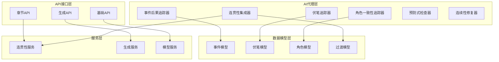
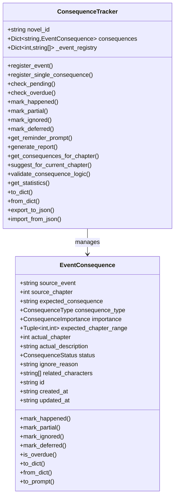
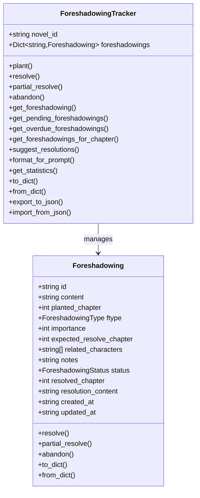
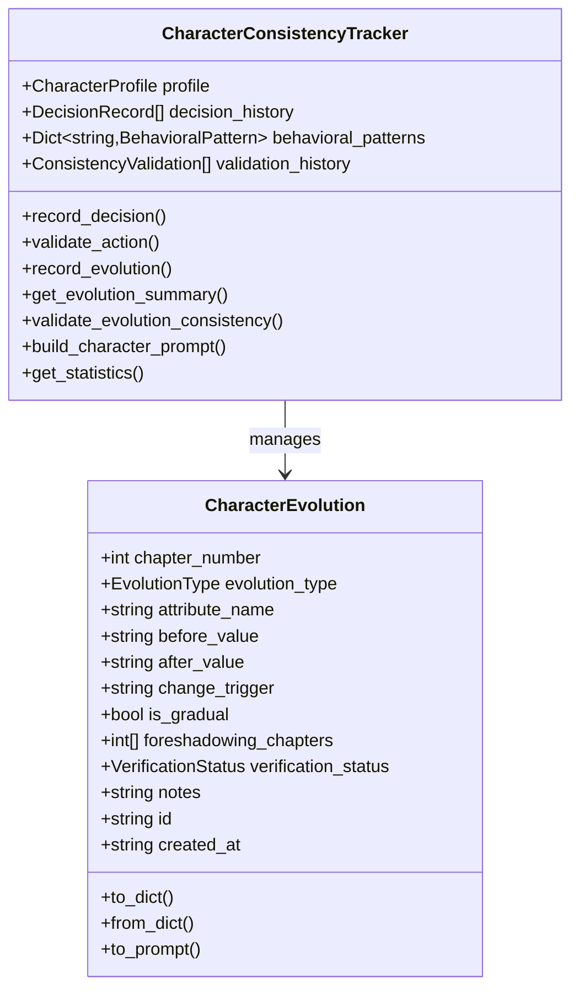
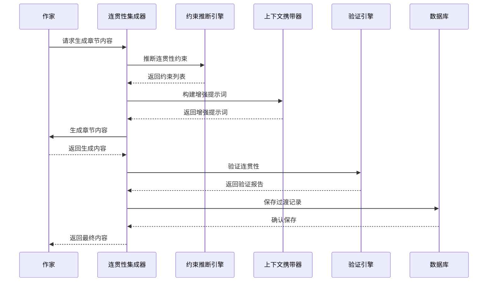
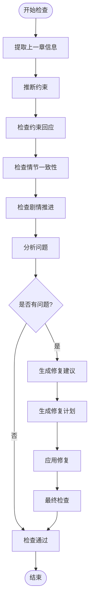
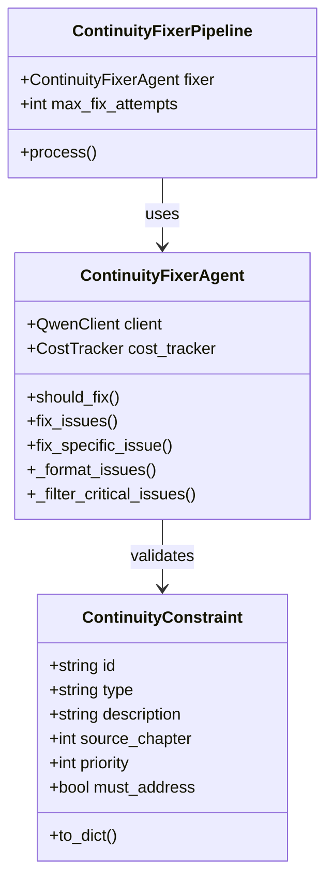
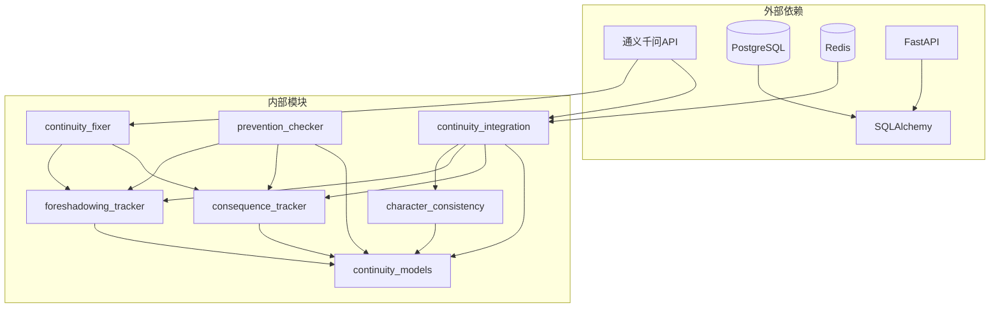

# 事件后果跟踪系统

<cite>
**本文档引用的文件**
- [consequence_tracker.py](file://agents/consequence_tracker.py)
- [continuity_integration.py](file://agents/continuity_integration.py)
- [continuity_models.py](file://agents/continuity_models.py)
- [foreshadowing_tracker.py](file://agents/foreshadowing_tracker.py)
- [character_consistency_tracker.py](file://agents/character_consistency_tracker.py)
- [continuity_inference.py](file://agents/continuity_inference.py)
- [continuity_validation.py](file://agents/continuity_validation.py)
- [context_propagator.py](file://agents/context_propagator.py)
- [continuity_fixer.py](file://agents/continuity_fixer.py)
- [prevention_continuity_checker.py](file://agents/prevention_continuity_checker.py)
- [chapters.py](file://backend/api/v1/chapters.py)
- [generation.py](file://backend/api/v1/generation.py)
- [chapter.py](file://core/models/chapter.py)
- [main.py](file://backend/main.py)
- [continuity_system_test.py](file://tests/continuity_system_test.py)
</cite>

## 更新摘要
**所做更改**
- 新增事件后果跟踪系统的完整833行实现分析
- 更新核心组件架构图以反映新的事件后果追踪器
- 增强多维度叙事后果监控功能说明
- 完善事件后果状态管理和优先级排序机制
- 新增事件后果逻辑验证和统计分析功能

## 目录
1. [简介](#简介)
2. [项目结构](#项目结构)
3. [核心组件](#核心组件)
4. [架构概览](#架构概览)
5. [详细组件分析](#详细组件分析)
6. [依赖关系分析](#依赖关系分析)
7. [性能考虑](#性能考虑)
8. [故障排除指南](#故障排除指南)
9. [结论](#结论)

## 简介

事件后果跟踪系统是一个完整的AI小说创作辅助系统，专注于追踪和管理小说中的重要事件及其预期后果。该系统通过智能算法确保情节连贯性，防止重要事件的"悬而未决"状态，并提供实时的创作提醒和建议。

系统集成了多种先进的AI技术，包括：
- 事件后果追踪和管理
- 伏笔埋设和回收系统  
- 角色一致性验证
- 章节连贯性保障
- 预防式连贯性检查
- 自动修复机制

**更新** 新增833行事件后果跟踪系统，提供多维度叙事后果监控，包括事件后果状态管理、优先级排序、逻辑验证和统计分析等功能。

## 项目结构

该项目采用模块化架构设计，主要分为以下几个核心模块：

**图表来源**
- [consequence_tracker.py:281-800](file://agents/consequence_tracker.py#L281-L800)
- [foreshadowing_tracker.py:128-435](file://agents/foreshadowing_tracker.py#L128-L435)
- [character_consistency_tracker.py:306-1064](file://agents/character_consistency_tracker.py#L306-L1064)

**章节来源**
- [main.py:1-159](file://backend/main.py#L1-L159)
- [chapters.py:1-331](file://backend/api/v1/chapters.py#L1-L331)
- [generation.py:1-217](file://backend/api/v1/generation.py#L1-L217)

## 核心组件

### 事件后果追踪器 (ConsequenceTracker)

事件后果追踪器是整个系统的核心组件，负责追踪小说中重要事件的预期后果。它提供了完整的生命周期管理：

**图表来源**
- [consequence_tracker.py:57-800](file://agents/consequence_tracker.py#L57-L800)

**更新** 新增事件后果实体管理，包括状态跟踪、优先级排序、逻辑验证和统计分析功能。

### 伏笔追踪系统 (ForeshadowingTracker)

伏笔追踪系统专门负责管理小说中的伏笔埋设和回收，确保故事的前后呼应：

**图表来源**
- [foreshadowing_tracker.py:36-435](file://agents/foreshadowing_tracker.py#L36-L435)

### 角色一致性追踪器 (CharacterConsistencyTracker)

角色一致性追踪器确保角色行为在整个故事中保持一致性和可信度：

**图表来源**
- [character_consistency_tracker.py:42-1064](file://agents/character_consistency_tracker.py#L42-L1064)

## 架构概览

系统采用分层架构设计，确保各组件之间的松耦合和高内聚：

```mermaid
graph TB
subgraph "前端界面层"
UI[用户界面]
API[RESTful API]
end
subgraph "业务逻辑层"
CT[事件后果追踪]
FT[伏笔追踪]
CCT[角色一致性]
CI[连贯性集成]
PC[预防检查]
CF[连续性修复]
end
subgraph "数据访问层"
DB[(PostgreSQL数据库)]
REDIS[(Redis缓存)]
end
subgraph "AI服务层"
LLM[通义千问API]
COST[成本追踪]
end
UI --> API
API --> CT
API --> FT
API --> CCT
API --> CI
API --> PC
API --> CF
CT --> DB
FT --> DB
CCT --> DB
CI --> LLM
CF --> LLM
CI --> REDIS
CF --> COST
```

**图表来源**
- [main.py:62-159](file://backend/main.py#L62-L159)
- [continuity_integration.py:24-48](file://agents/continuity_integration.py#L24-L48)

## 详细组件分析

### 连贯性保障集成系统

连贯性保障集成系统是整个AI小说创作流程的核心，它将多个连贯性检查组件整合到一个统一的工作流中：

**图表来源**
- [continuity_integration.py:49-161](file://agents/continuity_integration.py#L49-L161)
- [continuity_inference.py:73-146](file://agents/continuity_inference.py#L73-L146)
- [continuity_validation.py:90-150](file://agents/continuity_validation.py#L90-L150)

### 预防式连贯性检查

预防式连贯性检查器在章节生成前进行主动检查，防止连贯性问题的发生：

**图表来源**
- [prevention_continuity_checker.py:241-298](file://agents/prevention_continuity_checker.py#L241-L298)

### 连续性修复机制

连续性修复器能够自动识别和修复连贯性问题，确保故事质量：

**图表来源**
- [continuity_fixer.py:19-347](file://agents/continuity_fixer.py#L19-L347)

**更新** 新增事件后果逻辑验证功能，确保事件与后果的逻辑关联性和合理性。

**章节来源**
- [continuity_system_test.py:1-610](file://tests/continuity_system_test.py#L1-L610)

## 依赖关系分析

系统采用清晰的依赖层次结构，确保模块间的独立性和可维护性：

**图表来源**
- [continuity_integration.py:11-47](file://agents/continuity_integration.py#L11-L47)
- [character_consistency_tracker.py:19-20](file://agents/character_consistency_tracker.py#L19-L20)

**章节来源**
- [chapter.py:1-79](file://core/models/chapter.py#L1-L79)

## 性能考虑

系统在设计时充分考虑了性能优化：

### 缓存策略
- Redis缓存用于分布式锁和会话管理
- 数据库查询结果缓存减少重复查询
- LLM响应缓存避免重复调用

### 并发控制
- 分布式锁确保章节更新的原子性
- 异步任务处理避免阻塞主线程
- 连接池管理数据库连接

### 优化建议
- 对频繁查询的统计数据进行定期汇总
- 实施指数退避机制处理LLM调用
- 使用批量操作减少数据库往返

**更新** 新增事件后果状态缓存和优先级排序优化，提升大规模事件管理的性能表现。

## 故障排除指南

### 常见问题及解决方案

**1. 连贯性检查失败**
- 检查LLM API密钥配置
- 验证网络连接和防火墙设置
- 查看日志文件获取详细错误信息

**2. 数据库连接问题**
- 确认PostgreSQL服务状态
- 检查连接字符串配置
- 验证用户权限设置

**3. Redis连接问题**
- 检查Redis服务运行状态
- 验证连接URL和认证信息
- 确认网络可达性

**4. 性能问题**
- 监控CPU和内存使用率
- 检查数据库查询性能
- 优化LLM调用频率

**5. 事件后果追踪问题**
- 检查事件状态转换逻辑
- 验证优先级排序算法
- 确认统计计算准确性

**章节来源**
- [continuity_system_test.py:110-206](file://tests/continuity_system_test.py#L110-L206)

## 结论

事件后果跟踪系统通过智能化的AI技术，为小说创作者提供了一个完整的创作辅助平台。系统的核心优势包括：

1. **全面的连贯性保障**：从事件后果追踪到章节过渡验证，确保故事的完整性
2. **智能的创作提醒**：实时提醒创作者处理未闭合的事件和伏笔
3. **预防式质量控制**：在问题发生前进行检查和修复
4. **灵活的扩展性**：模块化设计支持功能扩展和定制

**更新** 新增的833行事件后果跟踪系统进一步增强了系统的叙事监控能力，通过多维度的事件后果管理、智能的状态跟踪和逻辑验证，为AI辅助小说创作提供了更加完善的解决方案。

该系统不仅提高了创作效率，更重要的是保证了作品的质量和连贯性，为AI辅助小说创作提供了可靠的技术支撑。