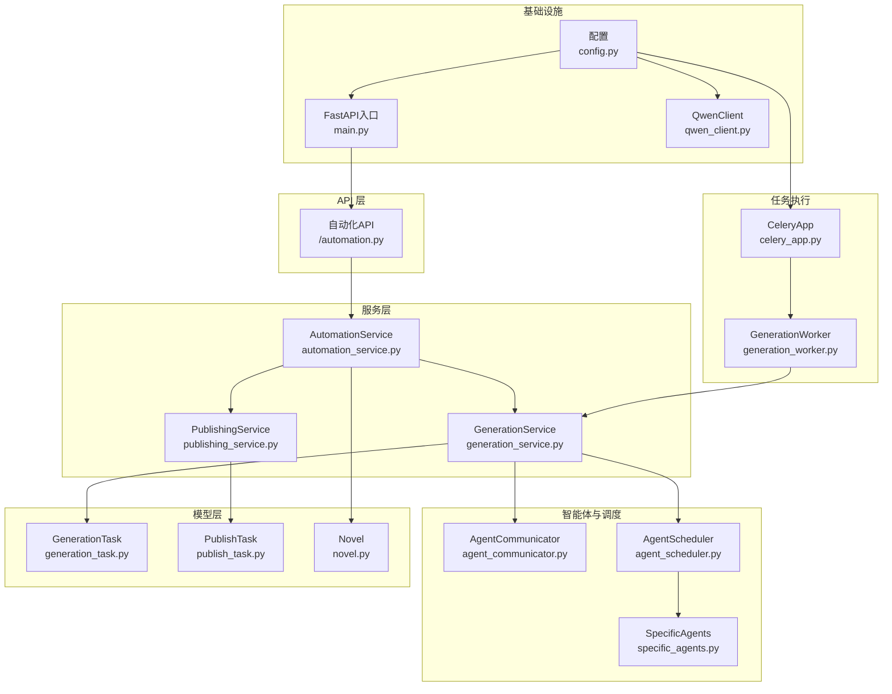
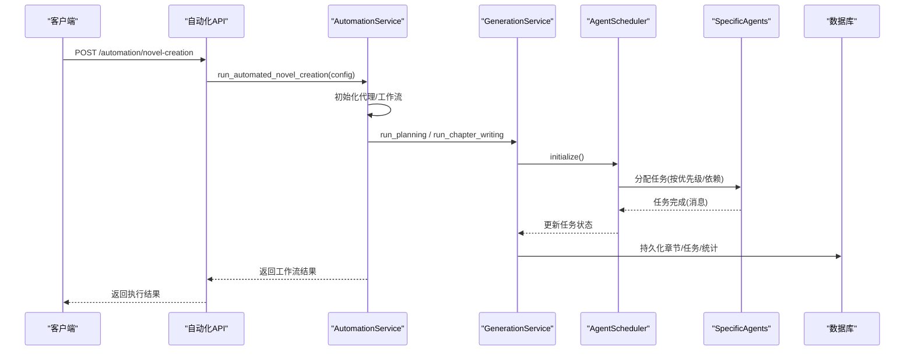
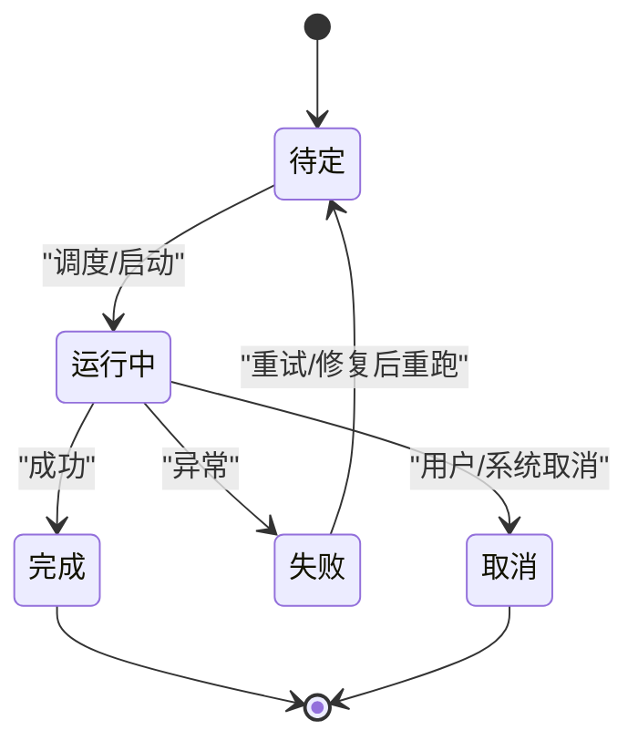
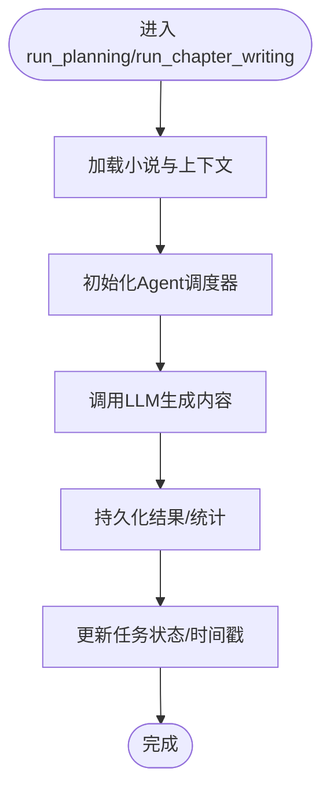
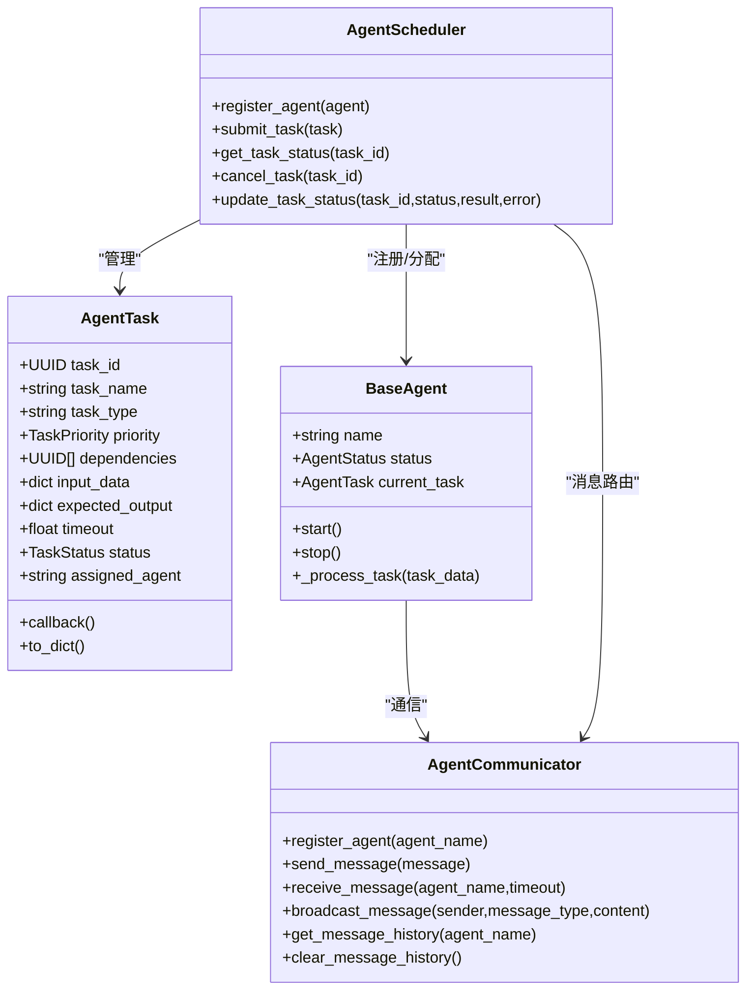
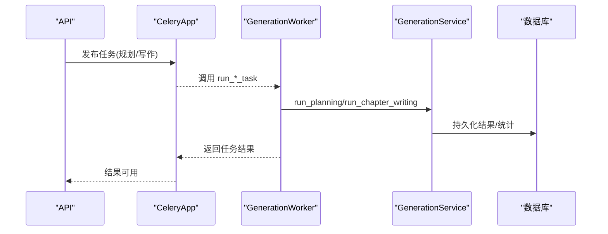
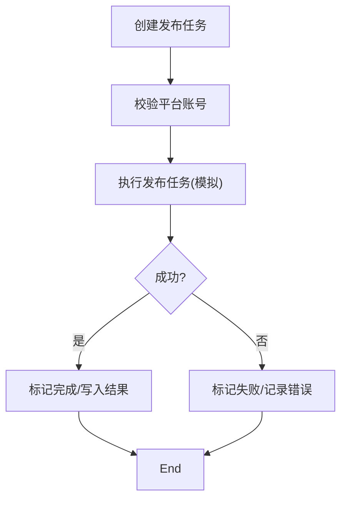
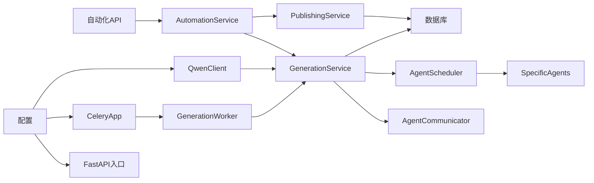

# 任务管理系统

<cite>
**本文引用的文件**
- [core/models/generation_task.py](file://core/models/generation_task.py)
- [core/models/publish_task.py](file://core/models/publish_task.py)
- [core/models/novel.py](file://core/models/novel.py)
- [backend/services/automation_service.py](file://backend/services/automation_service.py)
- [backend/services/generation_service.py](file://backend/services/generation_service.py)
- [backend/services/publishing_service.py](file://backend/services/publishing_service.py)
- [agents/agent_scheduler.py](file://agents/agent_scheduler.py)
- [agents/agent_communicator.py](file://agents/agent_communicator.py)
- [agents/specific_agents.py](file://agents/specific_agents.py)
- [workers/celery_app.py](file://workers/celery_app.py)
- [workers/generation_worker.py](file://workers/generation_worker.py)
- [llm/qwen_client.py](file://llm/qwen_client.py)
- [backend/api/v1/automation.py](file://backend/api/v1/automation.py)
- [backend/main.py](file://backend/main.py)
- [backend/config.py](file://backend/config.py)
</cite>

## 目录
1. [简介](#简介)
2. [项目结构](#项目结构)
3. [核心组件](#核心组件)
4. [架构总览](#架构总览)
5. [详细组件分析](#详细组件分析)
6. [依赖关系分析](#依赖关系分析)
7. [性能考量](#性能考量)
8. [故障排除指南](#故障排除指南)
9. [结论](#结论)
10. [附录](#附录)

## 简介
本技术文档面向"任务管理系统"，围绕小说生成与发布的自动化流水线，系统性阐述任务类型定义、优先级与依赖管理、执行流程、编排机制、生命周期管理、监控与性能统计、错误处理策略，并提供配置示例、最佳实践与故障排除方法。系统采用前后端分离架构，后端基于 FastAPI，任务执行通过 Celery 异步队列与多智能体协作完成，数据库使用 PostgreSQL，缓存与任务中间件使用 Redis。

## 项目结构
后端以模块化方式组织，核心模块包括：
- 数据模型层：定义小说、章节、生成任务、发布任务等实体与枚举
- 服务层：自动化服务、生成服务、发布服务等业务编排与领域逻辑
- 智能体与调度：Agent 通信、调度器、具体智能体实现
- 任务执行：Celery 应用与生成任务 Worker
- LLM 客户端：通义千问封装，支持重试与流式输出
- API 层：自动化相关接口
- 配置与入口：应用配置、环境变量、主程序入口

**图表来源**
- [backend/api/v1/automation.py](file://backend/api/v1/automation.py#L1-L89)
- [backend/services/automation_service.py](file://backend/services/automation_service.py#L1-L445)
- [backend/services/generation_service.py](file://backend/services/generation_service.py#L1-L689)
- [backend/services/publishing_service.py](file://backend/services/publishing_service.py#L1-L275)
- [agents/agent_scheduler.py](file://agents/agent_scheduler.py#L1-L496)
- [agents/agent_communicator.py](file://agents/agent_communicator.py#L1-L180)
- [agents/specific_agents.py](file://agents/specific_agents.py#L1-L505)
- [workers/celery_app.py](file://workers/celery_app.py#L1-L26)
- [workers/generation_worker.py](file://workers/generation_worker.py#L1-L70)
- [core/models/generation_task.py](file://core/models/generation_task.py#L1-L47)
- [core/models/publish_task.py](file://core/models/publish_task.py#L1-L51)
- [core/models/novel.py](file://core/models/novel.py#L1-L66)
- [backend/main.py](file://backend/main.py#L1-L53)
- [backend/config.py](file://backend/config.py#L1-L59)
- [llm/qwen_client.py](file://llm/qwen_client.py#L1-L232)

**章节来源**
- [backend/main.py](file://backend/main.py#L1-L53)
- [backend/config.py](file://backend/config.py#L1-L59)

## 核心组件
- 任务类型与状态
  - 生成任务：规划、写作、编辑、批量写作；状态：待定、运行中、完成、失败、取消
  - 发布任务：创建书籍、发布章节、批量发布；状态：待定、运行中、完成、失败、取消
  - 小说状态：策划中、写作中、已完成、已发布
- 任务优先级与依赖
  - 调度器支持低/中/高/紧急优先级，任务可声明依赖，仅在依赖完成后才执行
  - **依赖检查机制已从Python内置all()函数改为基于循环的增强错误报告机制**，提供更好的可观测性和调试能力
- 执行引擎
  - Celery 异步任务队列，Worker 执行生成任务（规划/写作/批量写作），支持超时与并发控制
- 智能体编排
  - Agent 通信与消息队列，调度器按优先级与依赖分配任务，Agent 完成后上报结果
- LLM 客户端
  - 通义千问封装，支持 OpenAI 兼容与标准 SDK，具备重试与流式输出能力
- API 与入口
  - FastAPI 提供自动化工作流接口，健康检查与根路径

**更新** 依赖检查机制已升级为基于循环的增强错误报告机制，提供更好的可观测性和调试能力

**章节来源**
- [core/models/generation_task.py](file://core/models/generation_task.py#L12-L47)
- [core/models/publish_task.py](file://core/models/publish_task.py#L13-L51)
- [core/models/novel.py](file://core/models/novel.py#L24-L66)
- [agents/agent_scheduler.py](file://agents/agent_scheduler.py#L21-L37)
- [workers/celery_app.py](file://workers/celery_app.py#L12-L26)
- [llm/qwen_client.py](file://llm/qwen_client.py#L16-L232)
- [backend/api/v1/automation.py](file://backend/api/v1/automation.py#L1-L89)
- [backend/main.py](file://backend/main.py#L15-L53)

## 架构总览
系统采用"API → 服务 → 智能体/Worker → 数据库"的分层架构。自动化服务负责编排工作流，生成服务对接智能体调度器并持久化结果，发布服务管理平台账号与发布任务，Celery 异步执行长耗时任务，Agent 通过消息队列协同。

**图表来源**
- [backend/api/v1/automation.py](file://backend/api/v1/automation.py#L13-L28)
- [backend/services/automation_service.py](file://backend/services/automation_service.py#L80-L166)
- [backend/services/generation_service.py](file://backend/services/generation_service.py#L36-L196)
- [agents/agent_scheduler.py](file://agents/agent_scheduler.py#L222-L496)
- [agents/specific_agents.py](file://agents/specific_agents.py#L115-L214)

## 详细组件分析

### 任务类型与生命周期
- 生成任务
  - 类型：planning、writing、editing、batch_writing
  - 状态：pending、running、completed、failed、cancelled
  - 生命周期：创建任务 → 更新状态为 running → 执行阶段 → 成功/失败 → 记录输出与统计
- 发布任务
  - 类型：create_book、publish_chapter、batch_publish
  - 状态：pending、running、completed、failed、cancelled
  - 生命周期：创建任务 → 校验账号 → 执行发布 → 记录结果/错误 → 完成
- 小说状态
  - planning、writing、completed、published，贯穿生成与发布阶段

**图表来源**
- [core/models/generation_task.py](file://core/models/generation_task.py#L19-L25)
- [core/models/publish_task.py](file://core/models/publish_task.py#L20-L27)

**章节来源**
- [core/models/generation_task.py](file://core/models/generation_task.py#L27-L47)
- [core/models/publish_task.py](file://core/models/publish_task.py#L29-L51)
- [core/models/novel.py](file://core/models/novel.py#L37-L66)

### 任务执行流程（生成服务）
- 规划阶段
  - 初始化调度器，调用 LLM 生成世界观、角色、情节大纲
  - 持久化结果并更新小说状态为 writing
- 写作阶段
  - 构造小说上下文（世界观、角色、大纲），调用 LLM 生成章节内容
  - 持久化章节与统计，更新小说字数/章节数
- 批量写作
  - 对指定区间批量执行写作，汇总进度与结果，更新任务状态

**图表来源**
- [backend/services/generation_service.py](file://backend/services/generation_service.py#L36-L196)
- [backend/services/generation_service.py](file://backend/services/generation_service.py#L206-L377)
- [backend/services/generation_service.py](file://backend/services/generation_service.py#L387-L555)

**章节来源**
- [backend/services/generation_service.py](file://backend/services/generation_service.py#L27-L689)

### 任务编排机制（Agent 调度与通信）
- 任务模型
  - 支持优先级、依赖、输入输出、超时与回调
- 调度策略
  - **依赖满足 → 按优先级排序 → 分配空闲 Agent → 发送任务消息**
  - **依赖检查采用基于循环的增强错误报告机制，提供详细的依赖状态信息**
- 通信机制
  - 基于消息队列的点对点与广播通信，支持状态查询与取消
- 具体 Agent
  - 市场分析、内容策划、创作、编辑、发布 Agent，均继承基础 Agent 并实现任务处理

**更新** 依赖检查机制已升级为基于循环的增强错误报告机制，提供更好的可观测性和调试能力

**图表来源**
- [agents/agent_scheduler.py](file://agents/agent_scheduler.py#L39-L101)
- [agents/agent_scheduler.py](file://agents/agent_scheduler.py#L222-L496)
- [agents/agent_communicator.py](file://agents/agent_communicator.py#L72-L180)
- [agents/specific_agents.py](file://agents/specific_agents.py#L103-L136)

**章节来源**
- [agents/agent_scheduler.py](file://agents/agent_scheduler.py#L1-L496)
- [agents/agent_communicator.py](file://agents/agent_communicator.py#L1-L180)
- [agents/specific_agents.py](file://agents/specific_agents.py#L1-L505)

### 异步任务执行（Celery 与 Worker）
- Celery 配置
  - Broker/Backend 使用 Redis，序列化为 JSON，UTC 时区，启用任务跟踪
  - 任务超时与软超时，禁用预取，限制并发
- Worker 任务
  - 规划任务与写作任务（含批量写作），在同步任务中运行异步协程
  - 记录日志与错误，返回统一结果结构

**图表来源**
- [workers/celery_app.py](file://workers/celery_app.py#L6-L26)
- [workers/generation_worker.py](file://workers/generation_worker.py#L58-L70)
- [backend/services/generation_service.py](file://backend/services/generation_service.py#L36-L196)

**章节来源**
- [workers/celery_app.py](file://workers/celery_app.py#L1-L26)
- [workers/generation_worker.py](file://workers/generation_worker.py#L1-L70)

### 发布任务管理
- 平台账号管理
  - 创建/更新账号，凭证加密存储，验证账号可用性
- 发布任务执行
  - 根据任务类型（创建书籍/发布章节/批量发布）模拟执行，记录结果与错误
- 发布预览
  - 查询小说章节发布状态，统计未发布数量

**图表来源**
- [backend/services/publishing_service.py](file://backend/services/publishing_service.py#L144-L209)
- [core/models/publish_task.py](file://core/models/publish_task.py#L29-L51)

**章节来源**
- [backend/services/publishing_service.py](file://backend/services/publishing_service.py#L1-L275)
- [core/models/publish_task.py](file://core/models/publish_task.py#L1-L51)

### API 与入口
- 自动化 API
  - 小说创建、工作流状态查询、批量自动化、代理初始化、市场报告
- FastAPI 入口
  - CORS 配置、路由注册、根路径与健康检查

**章节来源**
- [backend/api/v1/automation.py](file://backend/api/v1/automation.py#L1-L89)
- [backend/main.py](file://backend/main.py#L15-L53)

## 依赖关系分析
- 组件耦合
  - 服务层依赖模型层与 LLM 客户端；调度器与通信模块相互独立但紧密配合
  - Worker 与服务层解耦，通过 Celery 间接交互
- 外部依赖
  - 数据库：PostgreSQL（异步驱动）
  - 缓存/消息：Redis
  - LLM：DashScope/OpenAI 兼容接口
- 潜在风险
  - Agent 通信与任务状态更新需保证幂等与一致性
  - 批量任务与长任务需合理设置超时与并发

**更新** 依赖检查机制已升级为基于循环的增强错误报告机制，提供更好的可观测性和调试能力

**图表来源**
- [backend/api/v1/automation.py](file://backend/api/v1/automation.py#L1-L89)
- [backend/services/automation_service.py](file://backend/services/automation_service.py#L1-L445)
- [backend/services/generation_service.py](file://backend/services/generation_service.py#L1-L689)
- [backend/services/publishing_service.py](file://backend/services/publishing_service.py#L1-L275)
- [agents/agent_scheduler.py](file://agents/agent_scheduler.py#L1-L496)
- [agents/agent_communicator.py](file://agents/agent_communicator.py#L1-L180)
- [agents/specific_agents.py](file://agents/specific_agents.py#L1-L505)
- [workers/celery_app.py](file://workers/celery_app.py#L1-L26)
- [workers/generation_worker.py](file://workers/generation_worker.py#L1-L70)
- [llm/qwen_client.py](file://llm/qwen_client.py#L1-L232)
- [backend/main.py](file://backend/main.py#L1-L53)
- [backend/config.py](file://backend/config.py#L1-L59)

**章节来源**
- [backend/config.py](file://backend/config.py#L1-L59)

## 性能考量
- 并发与限流
  - Celery worker_concurrency 控制并发，worker_prefetch_multiplier=1 避免长任务抢占
  - 任务 time_limit/soft_time_limit 保障资源占用可控
- I/O 密集优化
  - LLM 调用使用异步客户端与线程池执行，减少阻塞
  - 任务结果与统计按批持久化，降低事务开销
- 缓存与索引
  - Redis 作为 Broker/Backend，提升任务状态与结果读写性能
- 监控与告警
  - 建议接入任务追踪与错误日志聚合，结合数据库指标与 LLM 调用统计

**更新** 依赖检查机制已升级为基于循环的增强错误报告机制，提供更好的可观测性和调试能力

[本节为通用性能建议，无需特定文件引用]

## 故障排除指南
- 任务失败排查
  - 检查任务状态与错误信息字段，定位生成/发布阶段异常
  - 关注 LLM 调用重试与超时配置
  - **利用增强的依赖检查错误报告机制，查看具体依赖任务的状态和错误详情**
- Agent 通信问题
  - 确认 Agent 已注册、消息队列存在、消息历史与去重
  - 检查任务取消与状态上报流程
- 数据库与一致性
  - 核对任务与小说状态更新顺序，确保事务提交与刷新
- 配置问题
  - 校验数据库、Redis、Broker/Backend、LLM API Key 等配置项
  - 确认时区与 UTC 设置一致

**更新** 依赖检查机制已升级为基于循环的增强错误报告机制，提供更好的可观测性和调试能力

**章节来源**
- [backend/services/generation_service.py](file://backend/services/generation_service.py#L198-L204)
- [agents/agent_communicator.py](file://agents/agent_communicator.py#L80-L136)
- [workers/celery_app.py](file://workers/celery_app.py#L12-L23)
- [backend/config.py](file://backend/config.py#L5-L59)

## 结论
该任务管理系统以"服务编排 + 智能体协作 + 异步任务"为核心，实现了从市场分析、内容策划、章节生成到发布的全链路自动化。通过明确的任务类型与状态机、完善的依赖与优先级管理、可靠的异步执行与监控，系统具备良好的扩展性与稳定性。

**更新** 依赖检查机制已升级为基于循环的增强错误报告机制，显著提升了系统的可观测性和调试能力，为开发者提供了更详细的依赖状态信息和错误诊断能力。

建议在生产环境中进一步完善可观测性、弹性扩容与安全加固。

[本节为总结性内容，无需特定文件引用]

## 附录

### 任务配置示例（概念性说明）
- 自动化小说创建
  - novel_id：可选，为空则创建新小说
  - config：包含用户偏好、写作风格、平台、是否自动发布等
- 批量自动化
  - batch_config：批量配置列表，支持间隔参数
- 发布任务
  - publish_type：create_book / publish_chapter / batch_publish
  - target_chapters：目标章节号列表
- 代理初始化
  - 调用初始化接口后，各 Agent 即可接收任务

**章节来源**
- [backend/api/v1/automation.py](file://backend/api/v1/automation.py#L13-L89)
- [backend/services/automation_service.py](file://backend/services/automation_service.py#L80-L166)
- [backend/services/publishing_service.py](file://backend/services/publishing_service.py#L144-L209)

### 最佳实践
- 明确任务依赖与优先级，避免环依赖
- 为长耗时任务设置合理超时与重试
- 使用统一的成本与统计埋点，便于成本控制与效果评估
- 对外部 API（LLM）增加熔断与降级策略
- 严格区分开发/测试/生产环境配置，避免敏感信息泄露
- **充分利用增强的依赖检查错误报告机制，及时发现和解决依赖问题**

**更新** 依赖检查机制已升级为基于循环的增强错误报告机制，提供更好的可观测性和调试能力

[本节为通用最佳实践，无需特定文件引用]