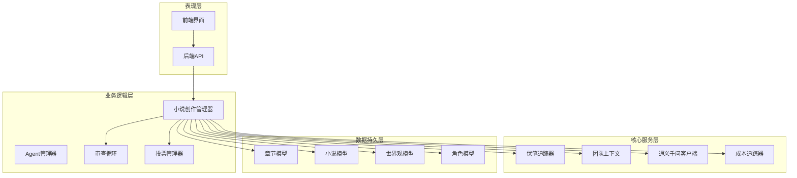
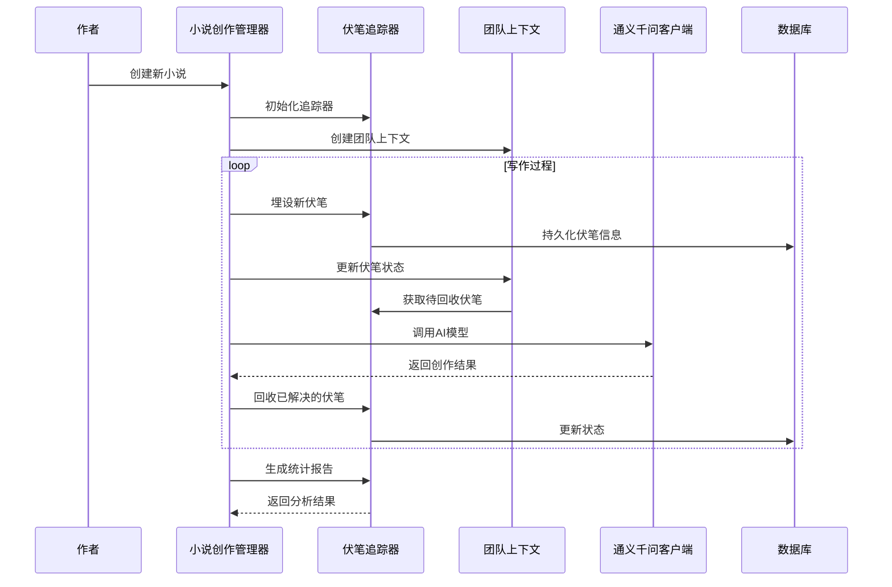
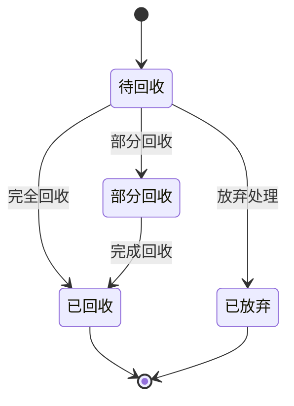
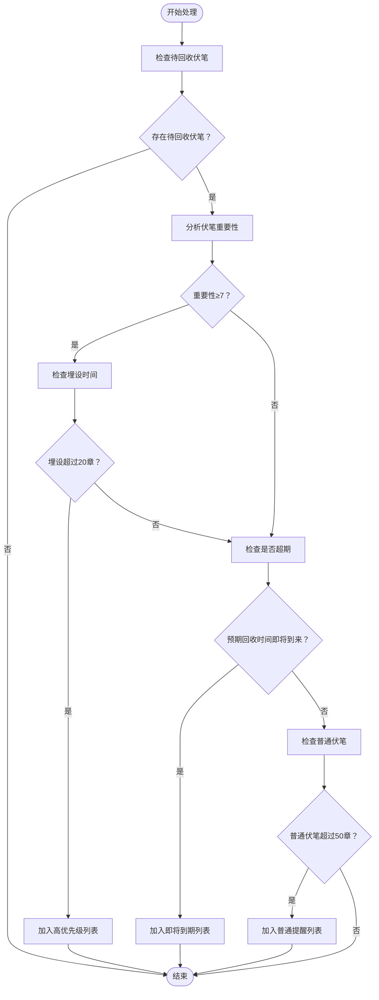
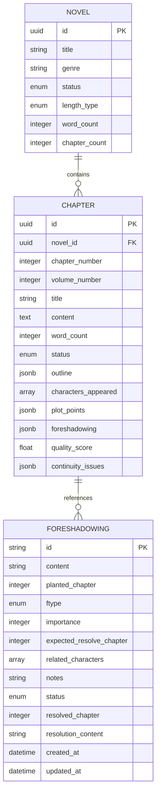
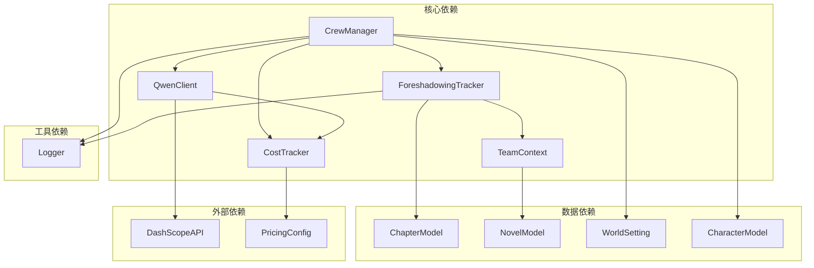

# 伏笔追踪系统

<cite>
**本文档引用的文件**
- [foreshadowing_tracker.py](file://agents/foreshadowing_tracker.py)
- [crew_manager.py](file://agents/crew_manager.py)
- [team_context.py](file://agents/team_context.py)
- [chapter.py](file://core/models/chapter.py)
- [novel.py](file://core/models/novel.py)
- [qwen_client.py](file://llm/qwen_client.py)
- [cost_tracker.py](file://llm/cost_tracker.py)
- [main.py](file://backend/main.py)
</cite>

## 目录
1. [简介](#简介)
2. [项目结构](#项目结构)
3. [核心组件](#核心组件)
4. [架构概览](#架构概览)
5. [详细组件分析](#详细组件分析)
6. [依赖关系分析](#依赖关系分析)
7. [性能考虑](#性能考虑)
8. [故障排除指南](#故障排除指南)
9. [结论](#结论)

## 简介

伏笔追踪系统是小说生成系统中的一个关键子系统，专门负责追踪和管理小说创作过程中的伏笔埋设与回收。该系统确保故事情节的连贯性和完整性，通过智能化的提醒机制帮助作者及时处理未回收的伏笔，提升作品质量。

系统采用模块化设计，集成了先进的AI技术，能够自动识别重要的伏笔线索，提供智能建议，并与其他创作组件无缝集成。

## 项目结构

小说生成系统采用分层架构设计，主要分为以下几个层次：

**图表来源**
- [crew_manager.py](file://agents/crew_manager.py#L38-L150)
- [foreshadowing_tracker.py](file://agents/foreshadowing_tracker.py#L120-L135)
- [team_context.py](file://agents/team_context.py#L155-L216)

**章节来源**
- [crew_manager.py](file://agents/crew_manager.py#L1-L1038)
- [foreshadowing_tracker.py](file://agents/foreshadowing_tracker.py#L1-L376)

## 核心组件

### 伏笔追踪器 (ForeshadowingTracker)

伏笔追踪器是系统的核心组件，负责管理所有伏笔相关操作：

- **状态管理**：跟踪伏笔的生命周期，包括待回收、已回收、已放弃、部分回收四种状态
- **类型分类**：支持情节、角色、物品、悬念、暗示等多种伏笔类型
- **智能提醒**：基于重要性和时间维度提供智能回收建议
- **统计分析**：提供详细的统计数据和趋势分析

### 伏笔实体 (Foreshadowing)

每个伏笔都是一个独立的实体，包含以下关键属性：

- **基本信息**：内容描述、埋设章节、类型、重要性等级
- **关联信息**：涉及的角色、预期回收章节、备注说明
- **状态信息**：当前状态、回收章节、回收内容、时间戳

### 团队上下文集成

系统通过团队上下文实现了伏笔信息的跨组件共享：

- **实时同步**：各Agent可以实时获取当前的伏笔状态
- **上下文增强**：在创作过程中自动融入相关的伏笔信息
- **状态追踪**：记录伏笔在整个创作流程中的变化

**章节来源**
- [foreshadowing_tracker.py](file://agents/foreshadowing_tracker.py#L33-L118)
- [team_context.py](file://agents/team_context.py#L413-L430)

## 架构概览

系统采用分布式Agent架构，各个组件通过明确的接口进行交互：

**图表来源**
- [crew_manager.py](file://agents/crew_manager.py#L553-L800)
- [foreshadowing_tracker.py](file://agents/foreshadowing_tracker.py#L136-L201)

## 详细组件分析

### 伏笔状态管理系统

系统实现了完整的伏笔生命周期管理：

**状态转换逻辑**：
- **待回收**：新埋设的伏笔初始状态
- **已回收**：完全解决相关情节线索
- **部分回收**：只解决了部分相关内容
- **已放弃**：确定不再回收的伏笔

### 伏笔类型分类体系

系统支持多种类型的伏笔，每种类型都有其特定的处理方式：

| 类型 | 描述 | 处理特点 |
|------|------|----------|
| 情节伏笔 | 推动主线剧情发展的线索 | 需要在相关章节中得到完整解决 |
| 角色伏笔 | 影响角色发展的重要元素 | 关注角色弧光和关系变化 |
| 物品伏笔 | 具有特殊意义的道具或物品 | 重视物品的来源和用途 |
| 悬念伏笔 | 制造不确定性的情节设置 | 强调悬念的建立和释放时机 |
| 暗示伏笔 | 间接表达的信息或线索 | 需要读者的主动解读 |

### 智能提醒算法

系统采用多维度算法来识别需要处理的伏笔：

**图表来源**
- [foreshadowing_tracker.py](file://agents/foreshadowing_tracker.py#L253-L289)

### 数据模型设计

系统采用灵活的数据模型来存储伏笔相关信息：

**图表来源**
- [foreshadowing_tracker.py](file://agents/foreshadowing_tracker.py#L33-L118)
- [chapter.py](file://core/models/chapter.py#L18-L45)
- [novel.py](file://core/models/novel.py#L37-L66)

**章节来源**
- [foreshadowing_tracker.py](file://agents/foreshadowing_tracker.py#L33-L376)
- [chapter.py](file://core/models/chapter.py#L1-L45)
- [novel.py](file://core/models/novel.py#L1-L66)

## 依赖关系分析

系统各组件之间存在清晰的依赖关系：

**依赖关系特点**：
- **低耦合高内聚**：各组件职责明确，相互依赖程度适中
- **向上依赖**：底层组件依赖上层组件的配置和接口
- **向下依赖**：上层组件依赖底层组件的功能实现

**章节来源**
- [crew_manager.py](file://agents/crew_manager.py#L1-L1038)
- [foreshadowing_tracker.py](file://agents/foreshadowing_tracker.py#L1-L376)
- [team_context.py](file://agents/team_context.py#L1-L493)

## 性能考虑

### 内存优化策略

系统在处理大量伏笔数据时采用了多项内存优化措施：

- **延迟加载**：只在需要时加载特定章节的伏笔数据
- **缓存机制**：对频繁访问的伏笔状态进行缓存
- **分页处理**：大数据量查询时采用分页策略

### 并发处理能力

系统支持高并发场景下的伏笔管理：

- **异步操作**：关键操作采用异步处理提高响应速度
- **连接池**：数据库连接采用连接池管理
- **资源限制**：对内存和CPU使用进行合理限制

### 成本控制

系统实现了完善的成本控制机制：

- **Token追踪**：精确记录每次AI调用的Token消耗
- **预算管理**：支持按章节或项目的成本预算设置
- **实时监控**：提供成本使用的实时监控和预警

## 故障排除指南

### 常见问题及解决方案

**问题1：伏笔状态异常**
- **症状**：伏笔状态显示错误或无法更新
- **原因**：数据库连接异常或事务处理失败
- **解决方案**：检查数据库连接状态，重新初始化追踪器实例

**问题2：智能提醒不准确**
- **症状**：系统无法正确识别需要处理的伏笔
- **原因**：重要性评分或时间阈值设置不当
- **解决方案**：调整重要性阈值和时间参数配置

**问题3：性能下降**
- **症状**：系统响应缓慢，内存占用过高
- **原因**：缓存失效或数据量过大
- **解决方案**：清理缓存，实施数据分片策略

### 日志分析

系统提供了详细的日志记录功能：

- **操作日志**：记录所有关键操作的时间和结果
- **性能日志**：监控系统性能指标和资源使用情况
- **错误日志**：捕获和记录系统异常和错误信息

**章节来源**
- [foreshadowing_tracker.py](file://agents/foreshadowing_tracker.py#L1-L376)
- [crew_manager.py](file://agents/crew_manager.py#L1-L1038)
- [cost_tracker.py](file://llm/cost_tracker.py#L1-L120)

## 结论

伏笔追踪系统作为小说生成系统的重要组成部分，通过智能化的管理和提醒机制，显著提升了创作效率和作品质量。系统的设计充分体现了现代软件工程的最佳实践，具有良好的可扩展性和维护性。

未来的发展方向包括：
- **AI增强**：利用更先进的AI技术提供更精准的伏笔分析
- **可视化**：开发图形化的伏笔管理界面
- **集成扩展**：与其他创作工具和服务的深度集成
- **性能优化**：持续改进系统的性能和稳定性

该系统为AI辅助小说创作提供了坚实的技术基础，有望成为智能创作领域的重要创新成果。