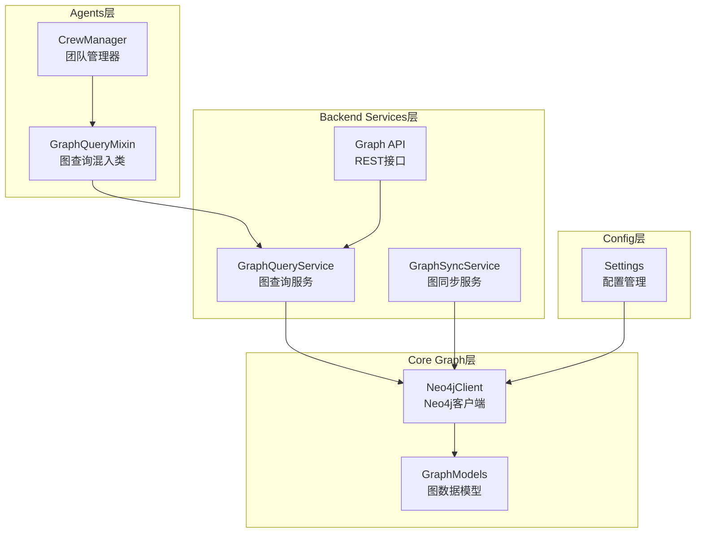
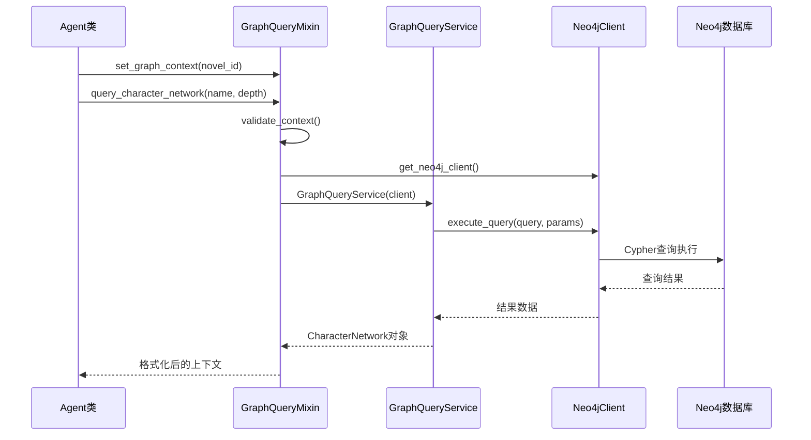
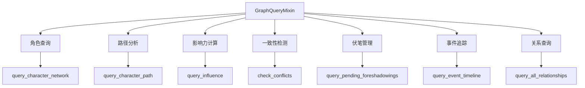
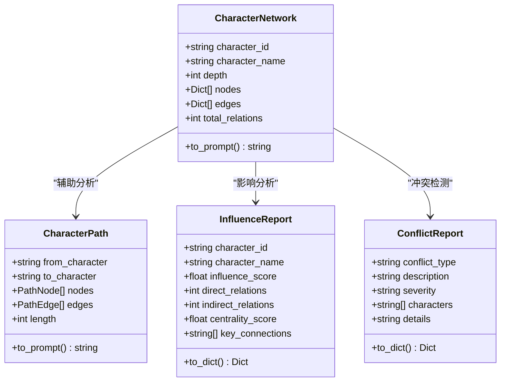
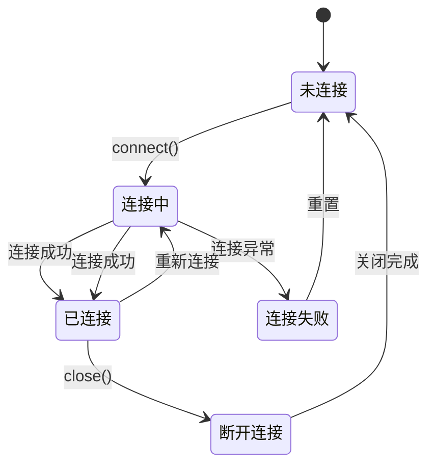
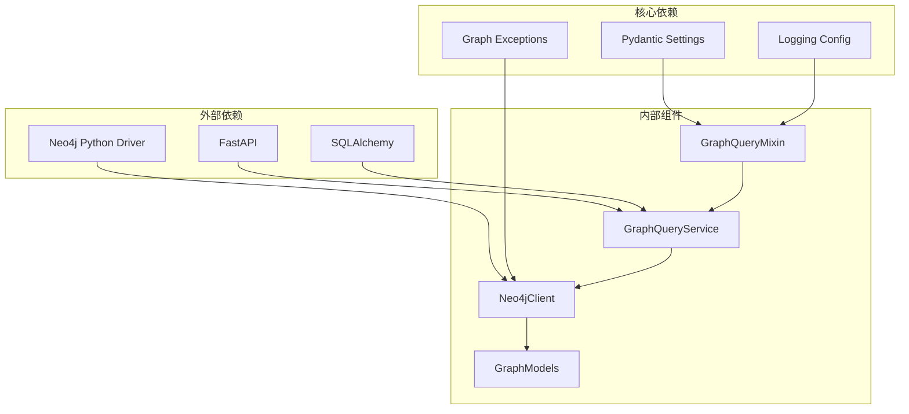

# 图查询混合器

<cite>
**本文档引用的文件**
- [graph_query_mixin.py](file://agents/graph_query_mixin.py)
- [graph_query_service.py](file://backend/services/graph_query_service.py)
- [neo4j_client.py](file://core/graph/neo4j_client.py)
- [graph_models.py](file://core/graph/graph_models.py)
- [config.py](file://backend/config.py)
- [graph.py](file://backend/api/v1/graph.py)
- [graph_sync_service.py](file://backend/services/graph_sync_service.py)
- [crew_manager.py](file://agents/crew_manager.py)
- [test_graph_query_mixin.py](file://tests/unit/test_graph_query_mixin.py)
</cite>

## 目录
1. [简介](#简介)
2. [项目结构](#项目结构)
3. [核心组件](#核心组件)
4. [架构概览](#架构概览)
5. [详细组件分析](#详细组件分析)
6. [依赖关系分析](#依赖关系分析)
7. [性能考量](#性能考量)
8. [故障排除指南](#故障排除指南)
9. [结论](#结论)

## 简介

图查询混合器是一个为AI代理提供图数据库查询能力的核心组件。它基于Neo4j图数据库，为小说创作系统中的各种Agent提供强大的关系查询、路径分析、影响力计算和一致性检测功能。该混合器采用混入(Mixin)模式，可以轻松集成到任何需要图查询能力的Agent类中。

图查询混合器的主要功能包括：
- 角色关系网络查询和可视化
- 角色间最短路径分析
- 角色影响力计算和分析
- 一致性冲突检测
- 伏笔管理系统
- 事件时间线追踪
- 图数据摘要和统计

## 项目结构

图查询混合器位于小说创作系统的agents目录中，与核心图数据库组件形成清晰的分层结构：



**图表来源**
- [graph_query_mixin.py:1-498](file://agents/graph_query_mixin.py#L1-L498)
- [graph_query_service.py:1-537](file://backend/services/graph_query_service.py#L1-L537)
- [neo4j_client.py:1-550](file://core/graph/neo4j_client.py#L1-L550)

**章节来源**
- [graph_query_mixin.py:1-498](file://agents/graph_query_mixin.py#L1-L498)
- [graph_query_service.py:1-537](file://backend/services/graph_query_service.py#L1-L537)
- [neo4j_client.py:1-550](file://core/graph/neo4j_client.py#L1-L550)

## 核心组件

图查询混合器系统由四个核心组件构成，每个组件都有明确的职责和边界：

### 1. GraphQueryMixin（图查询混入类）
作为混入类的核心，提供统一的图查询接口，支持多种查询操作和上下文格式化功能。

### 2. GraphQueryService（图查询服务）
封装具体的图查询逻辑，提供角色网络、路径分析、影响力计算等高级查询功能。

### 3. Neo4jClient（Neo4j客户端）
提供底层的数据库连接管理和查询执行能力，支持异步操作和连接池管理。

### 4. GraphModels（图数据模型）
定义图数据库中的节点和关系的数据结构，确保Python代码与Neo4j之间的数据一致性。

**章节来源**
- [graph_query_mixin.py:26-498](file://agents/graph_query_mixin.py#L26-L498)
- [graph_query_service.py:135-537](file://backend/services/graph_query_service.py#L135-L537)
- [neo4j_client.py:81-550](file://core/graph/neo4j_client.py#L81-L550)
- [graph_models.py:69-463](file://core/graph/graph_models.py#L69-L463)

## 架构概览

图查询混合器采用分层架构设计，确保了良好的可维护性和扩展性：



**图表来源**
- [graph_query_mixin.py:37-76](file://agents/graph_query_mixin.py#L37-L76)
- [graph_query_service.py:149-218](file://backend/services/graph_query_service.py#L149-L218)
- [neo4j_client.py:207-224](file://core/graph/neo4j_client.py#L207-L224)

该架构的关键特点：
- **混入模式**：GraphQueryMixin可以轻松集成到任何Agent类中
- **服务分离**：查询逻辑集中在GraphQueryService中，便于测试和维护
- **客户端抽象**：Neo4jClient提供统一的数据库访问接口
- **配置驱动**：通过Settings类管理图数据库的启用和连接配置

## 详细组件分析

### GraphQueryMixin组件分析

GraphQueryMixin是整个图查询系统的核心入口，提供了统一的查询接口和上下文格式化功能。

#### 主要功能特性

1. **上下文管理**：通过set_graph_context方法设置小说ID和图数据库启用状态
2. **查询接口**：提供多种图查询方法，包括角色网络、路径分析、影响力计算等
3. **上下文格式化**：将查询结果转换为适合提示词使用的格式
4. **错误处理**：完善的异常捕获和错误日志记录机制

#### 查询方法分类



**图表来源**
- [graph_query_mixin.py:46-237](file://agents/graph_query_mixin.py#L46-L237)

#### 上下文格式化机制

GraphQueryMixin提供了专门的格式化方法，将复杂的图查询结果转换为简洁易懂的文本格式：

| 格式化方法 | 输入类型 | 输出格式 | 用途 |
|------------|----------|----------|------|
| format_network_context | CharacterNetwork | 关系网络描述 | 角色关系展示 |
| format_path_context | CharacterPath | 路径描述 | 角色间联系说明 |
| format_conflicts_context | ConflictReport[] | 冲突警告 | 一致性问题提醒 |
| format_foreshadowings_context | Dict[] | 伏笔列表 | 伏笔回收提示 |
| format_influence_context | InfluenceReport | 影响力分析 | 角色重要性评估 |

**章节来源**
- [graph_query_mixin.py:241-445](file://agents/graph_query_mixin.py#L241-L445)

### GraphQueryService组件分析

GraphQueryService封装了具体的图查询逻辑，提供了高级的图分析功能。

#### 数据结构设计



**图表来源**
- [graph_query_service.py:58-132](file://backend/services/graph_query_service.py#L58-L132)

#### 查询算法实现

GraphQueryService实现了多种图算法，包括：

1. **子图遍历算法**：用于获取角色的关系网络
2. **最短路径算法**：使用Neo4j的shortestPath函数
3. **影响力计算算法**：基于直接关系和间接关系的加权计算
4. **一致性检测算法**：规则驱动的冲突检测

**章节来源**
- [graph_query_service.py:149-521](file://backend/services/graph_query_service.py#L149-L521)

### Neo4jClient组件分析

Neo4jClient提供了底层的数据库连接和查询执行能力，是整个图查询系统的技术基础。

#### 连接管理机制



**图表来源**
- [neo4j_client.py:133-180](file://core/graph/neo4j_client.py#L133-L180)

#### 安全防护机制

Neo4jClient实现了多层次的安全防护：

1. **标签白名单验证**：防止Cypher注入攻击
2. **关系类型验证**：确保关系类型的合法性
3. **参数化查询**：所有用户输入都通过参数绑定
4. **连接池管理**：高效的连接复用和资源管理

**章节来源**
- [neo4j_client.py:81-550](file://core/graph/neo4j_client.py#L81-L550)

### 配置管理分析

图查询混合器通过Settings类实现了灵活的配置管理：

#### 图数据库配置选项

| 配置项 | 默认值 | 描述 |
|--------|--------|------|
| ENABLE_GRAPH_DATABASE | False | 启用/禁用图数据库功能 |
| ENABLE_ENTITY_EXTRACTION | True | 启用实体自动抽取 |
| ENABLE_GRAPH_SYNC_ON_CHAPTER | True | 章节生成后自动同步 |
| NEO4J_URI | "" | Neo4j连接URI |
| NEO4J_USER | "neo4j" | 数据库用户名 |
| NEO4J_PASSWORD | None | 数据库密码 |
| NEO4J_MAX_CONNECTION_POOL_SIZE | 50 | 连接池大小 |
| GRAPH_QUERY_CACHE_TTL | 300 | 缓存过期时间(秒) |

**章节来源**
- [config.py:298-350](file://backend/config.py#L298-L350)

## 依赖关系分析

图查询混合器系统具有清晰的依赖层次结构，各组件之间的耦合度适中，便于维护和扩展。



**图表来源**
- [graph_query_mixin.py:14-23](file://agents/graph_query_mixin.py#L14-L23)
- [graph_query_service.py:10-11](file://backend/services/graph_query_service.py#L10-L11)
- [neo4j_client.py:15-22](file://core/graph/neo4j_client.py#L15-L22)

### 组件耦合度分析

| 组件 | 内聚性 | 耦合度 | 说明 |
|------|--------|--------|------|
| GraphQueryMixin | 高 | 低 | 专注于查询接口，依赖关系简单 |
| GraphQueryService | 高 | 中等 | 封装复杂查询逻辑，依赖Neo4jClient |
| Neo4jClient | 高 | 中等 | 提供数据库访问，依赖外部驱动 |
| GraphModels | 高 | 低 | 纯数据模型，无外部依赖 |

**章节来源**
- [graph_query_mixin.py:1-498](file://agents/graph_query_mixin.py#L1-L498)
- [graph_query_service.py:1-537](file://backend/services/graph_query_service.py#L1-L537)
- [neo4j_client.py:1-550](file://core/graph/neo4j_client.py#L1-L550)

## 性能考量

图查询混合器在设计时充分考虑了性能优化，采用了多种策略来提升查询效率：

### 1. 连接池管理
- 最大连接池大小：50个连接
- 连接超时时间：30秒
- 自动连接复用机制

### 2. 查询优化策略
- 深度限制：角色网络查询深度限制在1-5层
- 结果集限制：默认返回100条记录
- 参数化查询：防止查询计划缓存污染

### 3. 缓存机制
- 查询结果缓存：TTL为300秒
- 最大缓存条目：100个
- 缓存键：基于查询参数的哈希值

### 4. 异步处理
- 全面的异步查询支持
- 线程池执行同步操作
- 事件循环集成

## 故障排除指南

### 常见问题及解决方案

#### 1. 图数据库连接失败
**症状**：查询返回None，日志显示连接错误
**原因**：
- Neo4j服务未启动
- 网络连接问题
- 凭据错误

**解决方案**：
```python
# 检查连接状态
client = get_neo4j_client()
if client and client.is_connected:
    print("连接正常")
else:
    print("连接失败，检查配置")

# 手动初始化连接
try:
    client.connect()
    print("手动连接成功")
except Exception as e:
    print(f"连接失败: {e}")
```

#### 2. 查询超时
**症状**：查询长时间无响应
**原因**：
- 查询深度过大
- 图数据库负载过高
- 网络延迟

**解决方案**：
- 减少查询深度（1-3层）
- 优化查询条件
- 增加超时时间配置

#### 3. 权限不足
**症状**：Cypher查询执行失败
**原因**：
- 用户权限不足
- 标签或关系类型不在白名单中

**解决方案**：
- 检查Neo4j用户权限
- 验证查询中使用的标签和关系类型
- 更新白名单配置

**章节来源**
- [neo4j_client.py:133-180](file://core/graph/neo4j_client.py#L133-L180)
- [graph_query_mixin.py:58-75](file://agents/graph_query_mixin.py#L58-L75)

### 调试技巧

1. **启用详细日志**：设置日志级别为DEBUG
2. **查询验证**：在Neo4j浏览器中手动执行相同查询
3. **参数检查**：验证所有查询参数的有效性
4. **连接测试**：使用health_check方法验证连接状态

## 结论

图查询混合器是小说创作系统中一个设计精良、功能完整的图数据库查询组件。它通过混入模式提供了高度的灵活性，使得任何Agent都可以轻松获得强大的图查询能力。

### 主要优势

1. **模块化设计**：清晰的分层架构，便于维护和扩展
2. **安全性强**：多重安全防护机制，防止Cypher注入攻击
3. **性能优化**：连接池、缓存、异步处理等优化策略
4. **易于使用**：简单的API接口，丰富的上下文格式化功能
5. **全面测试**：完善的单元测试和集成测试覆盖

### 应用场景

图查询混合器特别适用于以下场景：
- 小说角色关系分析和可视化
- 故事情节连贯性检查
- 伏笔管理和回收提醒
- 角色影响力分析
- 事件时间线追踪

### 未来发展

随着小说创作系统的不断发展，图查询混合器还可以进一步优化：
- 增加更多图算法支持
- 实现智能查询优化
- 扩展到其他图数据库
- 增强实时查询能力