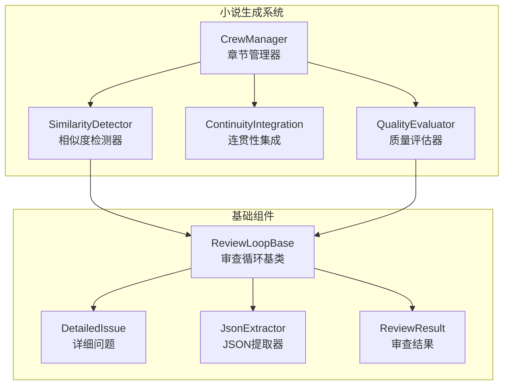
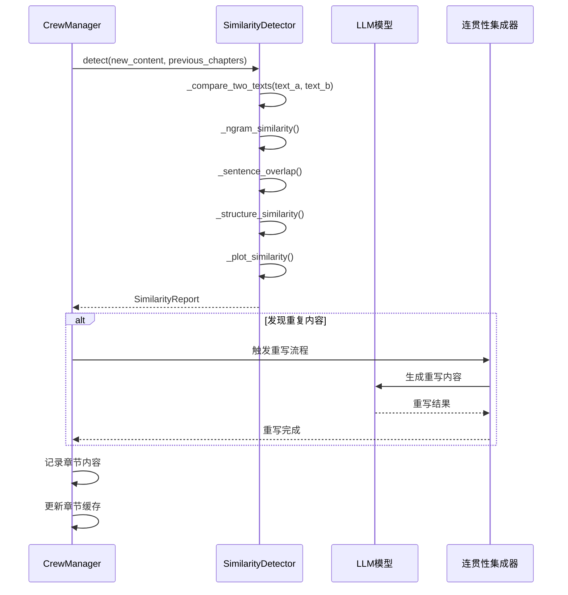
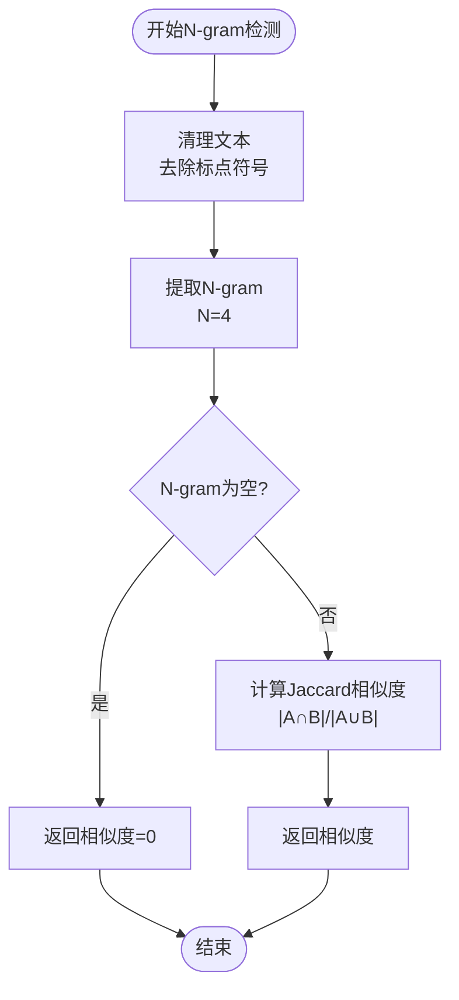
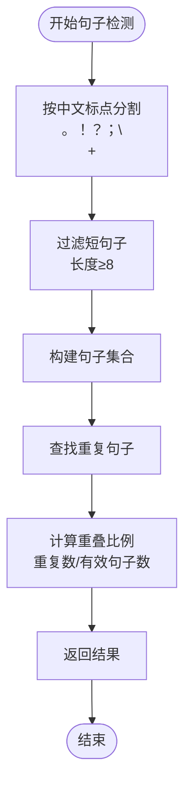
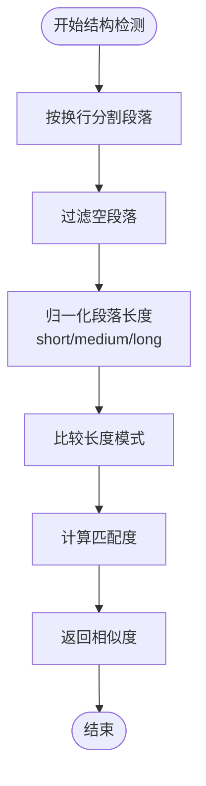
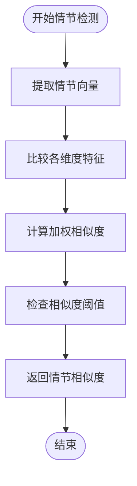
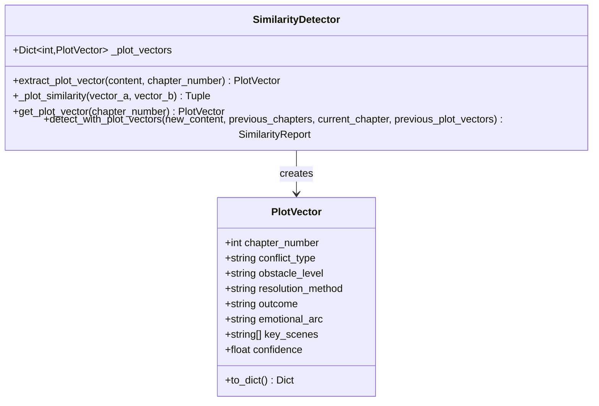
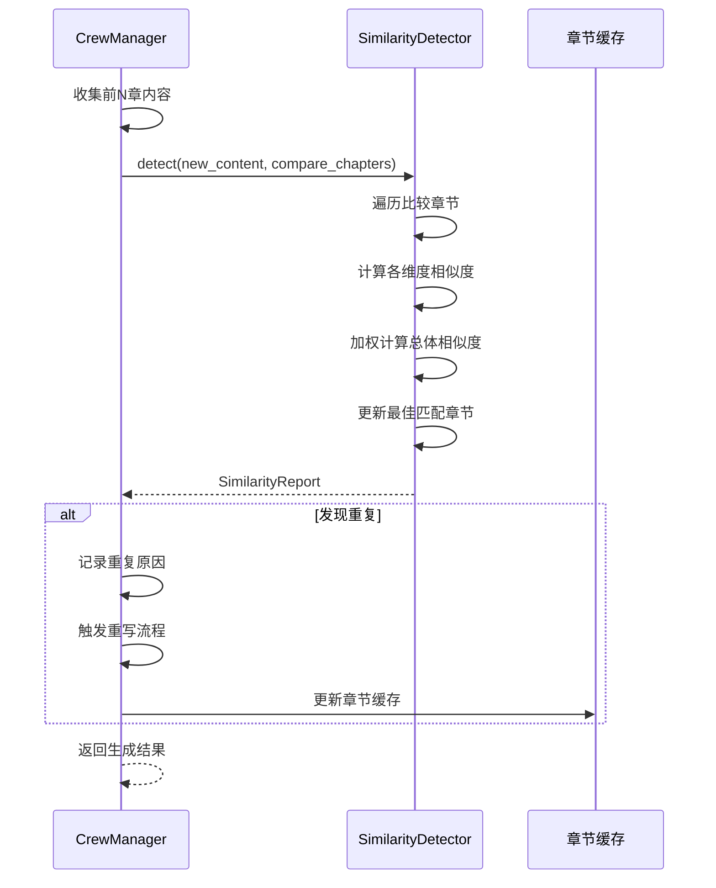
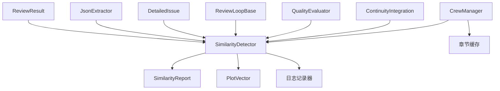

# 增强相似度检测器

<cite>
**本文档引用的文件**
- [similarity_detector.py](file://agents/similarity_detector.py)
- [crew_manager.py](file://agents/crew_manager.py)
- [continuity_integration.py](file://agents/continuity_integration.py)
- [quality_evaluator.py](file://agents/quality_evaluator.py)
- [outline_quality_evaluator.py](file://agents/outline_quality_evaluator.py)
- [review_loop_base.py](file://agents/base/review_loop_base.py)
- [detailed_issue.py](file://agents/base/detailed_issue.py)
- [json_extractor.py](file://agents/base/json_extractor.py)
- [review_result.py](file://agents/base/review_result.py)
</cite>

## 更新摘要
**变更内容**
- 新增情节向量分析功能，支持深层次情节套路化检测
- 实现多算法融合的综合相似度检测系统
- 增强权重配置和阈值管理系统
- 新增 detect_with_plot_vectors 方法支持情节向量比对
- 完善缓存机制和性能优化策略
- **新增复杂重复检测能力**：分析文本相似性和情节结构重复，防止重复叙述

## 目录
1. [简介](#简介)
2. [项目结构](#项目结构)
3. [核心组件](#核心组件)
4. [架构概览](#架构概览)
5. [详细组件分析](#详细组件分析)
6. [依赖关系分析](#依赖关系分析)
7. [性能考量](#性能考量)
8. [故障排除指南](#故障排除指南)
9. [结论](#结论)

## 简介

增强相似度检测器是一个专为网络小说生成系统设计的智能检测组件，现已实现大幅增强，旨在防止章节内容重复和情节套路化。该系统采用多层检测机制，结合轻量级文本相似度算法和深度情节向量分析，为AI写作流程提供全面的质量保障。

**更新** 系统现已具备复杂的重复检测能力，能够同时分析文本相似性和情节结构重复，有效防止重复叙述。

系统的核心价值在于：
- **多层次检测**：同时检测文字重复、句子重叠、结构相似和情节套路化
- **无外部依赖**：使用纯Python实现，无需额外依赖
- **实时预警**：在章节生成过程中即时发现问题
- **智能重写**：自动触发重写机制，确保内容多样性
- **深度分析**：支持情节层面的重复检测，识别套路化内容
- **复杂重复检测**：分析文本相似性和情节结构重复，防止重复叙述

## 项目结构

增强相似度检测器位于agents/similarity_detector.py文件中，与整个小说生成系统的集成关系如下：

**图表来源**
- [similarity_detector.py:1-570](file://agents/similarity_detector.py#L1-L570)
- [crew_manager.py:1250-1449](file://agents/crew_manager.py#L1250-L1449)
- [review_loop_base.py:1-800](file://agents/base/review_loop_base.py#L1-L800)

**章节来源**
- [similarity_detector.py:1-570](file://agents/similarity_detector.py#L1-L570)
- [crew_manager.py:1250-1449](file://agents/crew_manager.py#L1250-L1449)

## 核心组件

### SimilarityDetector 类

SimilarityDetector 是系统的核心检测引擎，现已实现大幅增强，提供以下核心功能：

#### 主要特性
- **多算法融合**：结合N-gram重叠、句子重叠、结构相似度和情节相似度检测
- **情节向量分析**：识别深层次的情节套路化问题
- **动态权重配置**：支持可配置的相似度权重分配
- **缓存机制**：高效管理已提取的情节向量
- **灵活阈值管理**：支持可配置的相似度阈值
- **复杂重复检测**：分析文本相似性和情节结构重复，防止重复叙述

#### 关键参数配置
- **DUPLICATE_THRESHOLD**: 0.30 - 总体相似度阈值
- **PLOT_DUPLICATE_THRESHOLD**: 0.60 - 情节相似度阈值  
- **NGRAM_SIZE**: 4 - N-gram大小
- **MIN_SENTENCE_LENGTH**: 8 - 最小有效句子长度
- **WEIGHTS**: 多算法权重配置

**章节来源**
- [similarity_detector.py:77-116](file://agents/similarity_detector.py#L77-L116)

### SimilarityReport 数据结构

SimilarityReport 提供标准化的检测结果输出：

#### 输出字段
- `is_duplicate`: 是否判定为重复
- `overall_similarity`: 总体相似度 (0-1)
- `ngram_similarity`: N-gram相似度
- `sentence_overlap`: 句子重叠比例
- `structure_similarity`: 结构相似度
- `plot_similarity`: 情节相似度
- `duplicate_sentences`: 重复句子列表
- `plot_duplicate_reasons`: 情节重复原因
- `most_similar_chapter`: 最相似的章节号

**章节来源**
- [similarity_detector.py:16-42](file://agents/similarity_detector.py#L16-L42)

### PlotVector 情节向量

PlotVector 将章节内容抽象为可比较的情节特征向量，这是系统的核心创新：

#### 情节特征维度
- **chapter_number**: 章节号
- **conflict_type**: 冲突类型：对抗/竞速/解谜/成长/探索
- **obstacle_level**: 障碍等级：高/中/低
- **resolution_method**: 解决方式：武力/智谋/妥协/逃避/意外
- **outcome**: 结果：成功/失败/部分/逆转
- **emotional_arc**: 情感弧线：上扬/下抑/波折/平缓
- **key_scenes**: 关键场景类型列表
- **confidence**: 提取置信度
- `to_dict()`: 序列化为字典

**章节来源**
- [similarity_detector.py:44-74](file://agents/similarity_detector.py#L44-L74)

## 架构概览

增强相似度检测器在整个小说生成系统中的工作流程如下：

**图表来源**
- [crew_manager.py:1264-1316](file://agents/crew_manager.py#L1264-L1316)
- [similarity_detector.py:117-162](file://agents/similarity_detector.py#L117-L162)

## 详细组件分析

### 文本相似度检测算法

系统实现了四种互补的文本相似度检测算法：

#### 1. N-gram 相似度检测

使用Jaccard相似度计算N-gram重叠率：

**图表来源**
- [similarity_detector.py:208-231](file://agents/similarity_detector.py#L208-L231)

#### 2. 句子重叠检测

基于中文标点符号的句子分割和重叠检测：

**图表来源**
- [similarity_detector.py:233-259](file://agents/similarity_detector.py#L233-L259)

#### 3. 结构相似度检测

分析段落长度模式的一致性：

**图表来源**
- [similarity_detector.py:265-300](file://agents/similarity_detector.py#L265-L300)

#### 4. 情节相似度检测

基于情节向量的深度相似度分析：

**图表来源**
- [similarity_detector.py:306-366](file://agents/similarity_detector.py#L306-L366)

### 情节向量分析

情节向量提取器将章节内容转换为可比较的结构化特征：

**图表来源**
- [similarity_detector.py:44-74](file://agents/similarity_detector.py#L44-L74)
- [similarity_detector.py:368-484](file://agents/similarity_detector.py#L368-L484)

### 系统集成流程

SimilarityDetector 与 CrewManager 的集成展示了完整的检测流程：

**图表来源**
- [crew_manager.py:1264-1316](file://agents/crew_manager.py#L1264-L1316)
- [similarity_detector.py:117-162](file://agents/similarity_detector.py#L117-L162)

**章节来源**
- [crew_manager.py:1264-1316](file://agents/crew_manager.py#L1264-L1316)
- [similarity_detector.py:117-162](file://agents/similarity_detector.py#L117-L162)

## 依赖关系分析

### 内部依赖关系

**图表来源**
- [similarity_detector.py:1-14](file://agents/similarity_detector.py#L1-L14)
- [crew_manager.py:155-160](file://agents/crew_manager.py#L155-L160)

### 外部依赖

系统设计遵循"零外部依赖"原则，仅使用Python标准库：

- **re**: 正则表达式处理
- **dataclasses**: 数据类定义
- **typing**: 类型注解
- **logging**: 日志记录

这种设计确保了系统的：
- **部署简便**: 无需安装额外包
- **运行稳定**: 减少版本冲突风险
- **维护成本低**: 降低依赖管理复杂度

**章节来源**
- [similarity_detector.py:9-13](file://agents/similarity_detector.py#L9-L13)

## 性能考量

### 时间复杂度分析

| 操作 | 时间复杂度 | 空间复杂度 | 说明 |
|------|------------|------------|------|
| N-gram相似度 | O(n) | O(n) | n为清理后文本长度 |
| 句子重叠检测 | O(m+k) | O(k) | m为句子数，k为重复句子数 |
| 结构相似度 | O(p) | O(p) | p为段落数 |
| 情节向量提取 | O(t) | O(1) | t为文本长度 |
| 情节相似度比较 | O(d) | O(1) | d为特征维度数 |
| 整体比较 | O(C×(n+m+p+t+d)) | O(n+k+p+d) | C为比较章节数 |

### 优化策略

1. **缓存机制**: 情节向量自动缓存，避免重复计算
2. **早期终止**: 发现重复时及时停止进一步比较
3. **阈值优化**: 动态调整相似度阈值适应不同场景
4. **批量处理**: 支持批量章节比较，减少函数调用开销
5. **权重裁剪**: 可配置的权重系统，支持性能调优

## 故障排除指南

### 常见问题及解决方案

#### 1. 检测结果不准确

**症状**: 相似度检测结果与预期不符

**排查步骤**:
1. 检查输入文本是否包含足够的内容
2. 验证相似度阈值设置是否合理
3. 确认章节编号是否正确传递
4. 检查权重配置是否适当

**解决方案**:
- 调整DUPLICATE_THRESHOLD参数
- 增加比较的章节数量
- 检查文本预处理逻辑
- 优化权重配置

#### 2. 性能问题

**症状**: 相似度检测耗时过长

**排查步骤**:
1. 检查比较章节数量是否过多
2. 验证文本长度是否过大
3. 确认缓存机制是否正常工作
4. 检查权重配置是否合理

**解决方案**:
- 限制比较章节数量（默认3章）
- 优化文本预处理步骤
- 检查缓存命中率
- 调整权重配置以平衡精度和性能

#### 3. 情节检测异常

**症状**: 情节向量提取不准确或相似度计算异常

**排查步骤**:
1. 检查输入文本是否包含足够的情节信息
2. 验证关键词匹配逻辑
3. 确认置信度计算是否合理
4. 检查缓存的情节向量是否正确

**解决方案**:
- 增加关键词覆盖范围
- 调整置信度阈值
- 检查文本预处理逻辑
- 验证缓存机制

#### 4. 重写触发异常

**症状**: 自动重写功能未按预期工作

**排查步骤**:
1. 检查相似度检测结果
2. 验证重写提示词构建
3. 确认LLM调用是否成功
4. 检查重写触发条件

**解决方案**:
- 检查重写触发条件
- 验证提示词模板完整性
- 确保LLM客户端配置正确
- 调整相似度阈值

**章节来源**
- [crew_manager.py:1280-1316](file://agents/crew_manager.py#L1280-L1316)

## 结论

增强相似度检测器通过多层检测机制和智能重写流程，为网络小说生成系统提供了强大的质量保障能力。其设计特点包括：

### 核心优势
- **全面检测**: 同时覆盖文字重复、句子重叠、结构相似和情节套路化
- **智能集成**: 无缝融入现有生成流程，自动触发重写
- **深度分析**: 支持情节层面的重复检测，识别套路化内容
- **轻量化设计**: 无外部依赖，易于部署和维护
- **可扩展性**: 支持自定义阈值、权重和检测算法
- **性能优化**: 缓存机制和权重配置支持性能调优
- **复杂重复检测**：分析文本相似性和情节结构重复，防止重复叙述

### 应用价值
- **提升内容质量**: 有效防止重复和套路化内容
- **优化创作体验**: 减少人工审核负担
- **保证多样性**: 确保章节内容的独特性和新鲜感
- **降低风险**: 及时发现潜在的质量问题
- **深度洞察**: 提供情节层面的质量分析
- **防止重复叙述**: 通过复杂重复检测能力确保故事新颖性

该系统为AI驱动的小说创作提供了重要的质量控制手段，是现代智能写作平台不可或缺的核心组件。其大幅增强的功能使其能够更好地适应复杂的网络小说创作需求，为创作者提供更全面的质量保障。新增的复杂重复检测能力特别有助于防止重复叙述，确保故事的多样性和创新性。