# 增强质量评估系统

<cite>
**本文档引用的文件**
- [quality_evaluator.py](file://agents/quality_evaluator.py)
- [outline_quality_evaluator.py](file://agents/outline_quality_evaluator.py)
- [quality_report.py](file://agents/base/quality_report.py)
- [review_loop.py](file://agents/review_loop.py)
- [world_review_loop.py](file://agents/world_review_loop.py)
- [outline_service.py](file://backend/services/outline_service.py)
- [plot_outline.py](file://core/models/plot_outline.py)
- [qwen_client.py](file://llm/qwen_client.py)
- [cost_tracker.py](file://llm/cost_tracker.py)
- [QualityAssessmentSidebar.tsx](file://frontend/src/components/QualityAssessmentSidebar.tsx)
- [outlines.py](file://backend/api/v1/outlines.py)
- [config.py](file://backend/config.py)
- [review_loop_base.py](file://agents/base/review_loop_base.py)
</cite>

## 目录
1. [系统概述](#系统概述)
2. [架构设计](#架构设计)
3. [核心组件分析](#核心组件分析)
4. [质量评估流程](#质量评估流程)
5. [数据模型设计](#数据模型设计)
6. [前端集成](#前端集成)
7. [性能优化策略](#性能优化策略)
8. [故障排除指南](#故障排除指南)
9. [总结](#总结)

## 系统概述

增强质量评估系统是一个基于人工智能的多维度小说创作质量评估平台，旨在为网络小说作者提供全面的质量监控和改进建议。该系统通过结合章节级和大纲级的双重评估机制，实现了从微观到宏观的全方位质量把控。

### 系统特点

- **多层次评估体系**：涵盖章节质量、大纲质量、角色质量、世界观质量等多个维度
- **智能反馈机制**：提供具体的改进建议和优先级排序
- **成本控制**：内置Token使用追踪和成本预算管理
- **可视化界面**：提供直观的质量评估结果展示
- **可扩展架构**：支持多种评估维度和自定义配置

## 架构设计

系统采用分层架构设计，将质量评估功能分解为多个相互协作的组件：

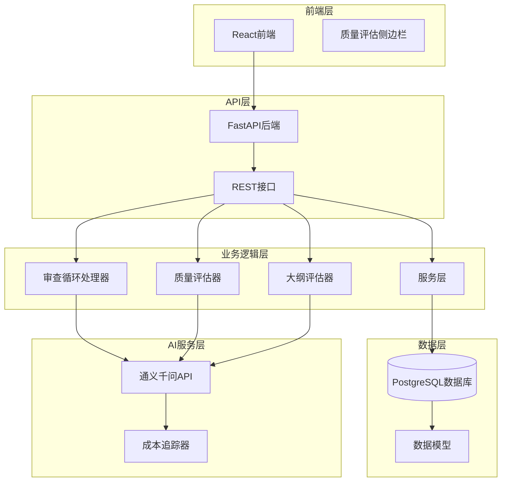

**图表来源**
- [quality_evaluator.py:83-151](file://agents/quality_evaluator.py#L83-L151)
- [outline_quality_evaluator.py:96-164](file://agents/outline_quality_evaluator.py#L96-L164)
- [review_loop.py:145-224](file://agents/review_loop.py#L145-L224)

## 核心组件分析

### 质量评估器组件

质量评估器是系统的核心组件，负责对小说内容进行多维度评分和分析。

#### 章节质量评估器

章节质量评估器专门针对单个章节进行深度分析，包含8个核心评估维度：

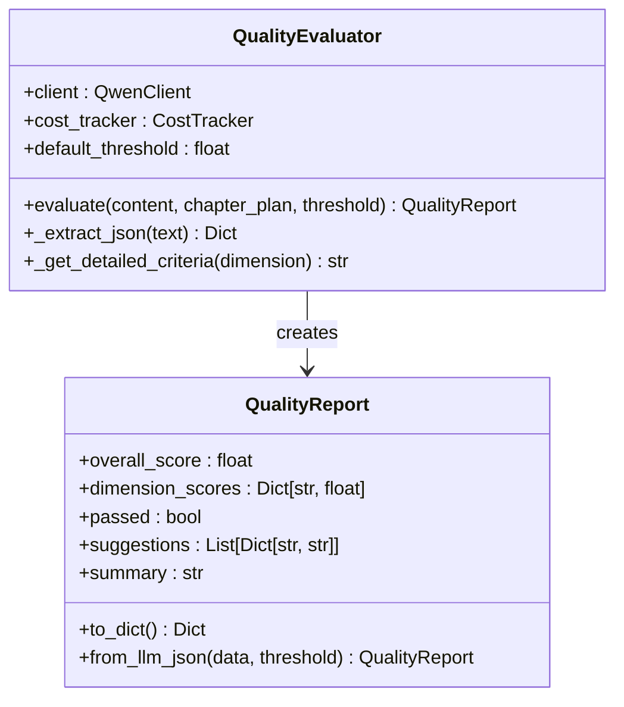

**图表来源**
- [quality_evaluator.py:83-151](file://agents/quality_evaluator.py#L83-L151)
- [quality_evaluator.py:12-42](file://agents/quality_evaluator.py#L12-L42)

#### 大纲质量评估器

大纲质量评估器专注于小说整体结构的质量评估，包含6个扩展评估维度：

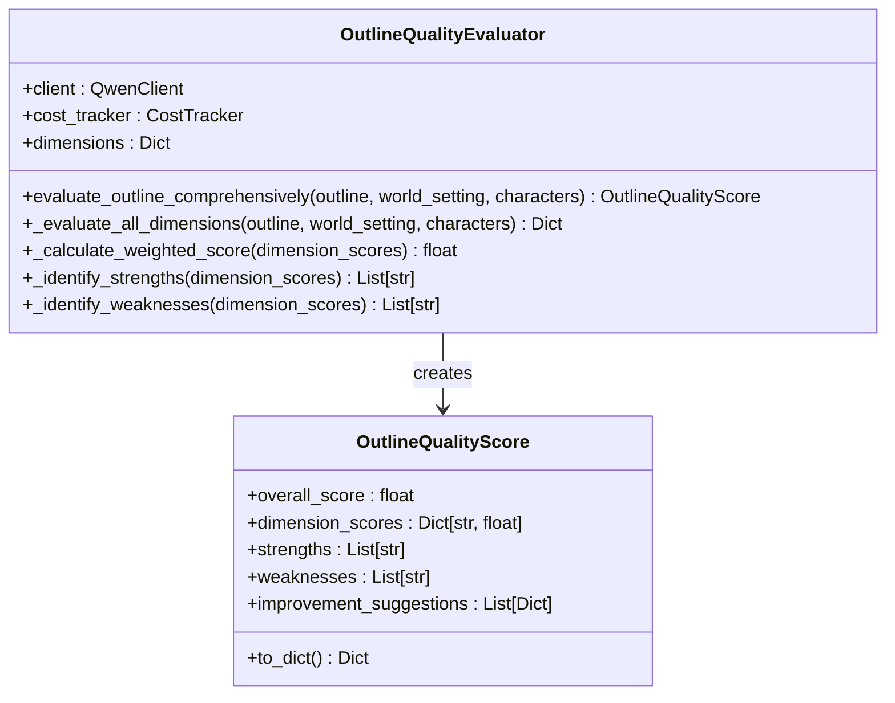

**图表来源**
- [outline_quality_evaluator.py:96-164](file://agents/outline_quality_evaluator.py#L96-L164)
- [outline_quality_evaluator.py:76-94](file://agents/outline_quality_evaluator.py#L76-L94)

### 审查循环处理器

系统采用审查循环模式，通过Designer-Reviewer的协作实现质量的持续改进：

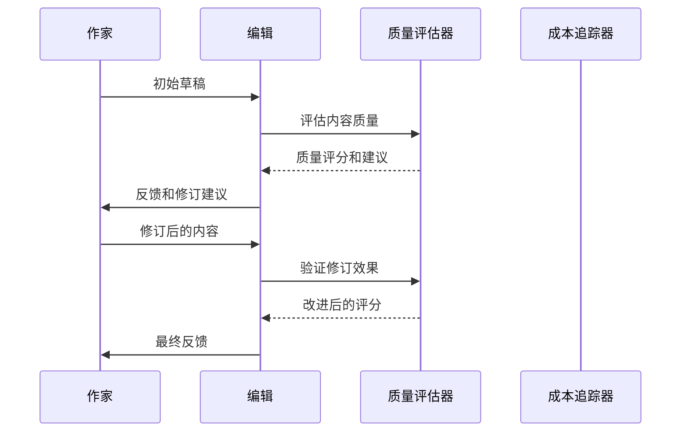

**图表来源**
- [review_loop.py:145-224](file://agents/review_loop.py#L145-L224)
- [review_loop.py:229-316](file://agents/review_loop.py#L229-L316)

### 基础质量报告系统

系统提供了统一的质量报告基类，支持多种类型的评估报告：

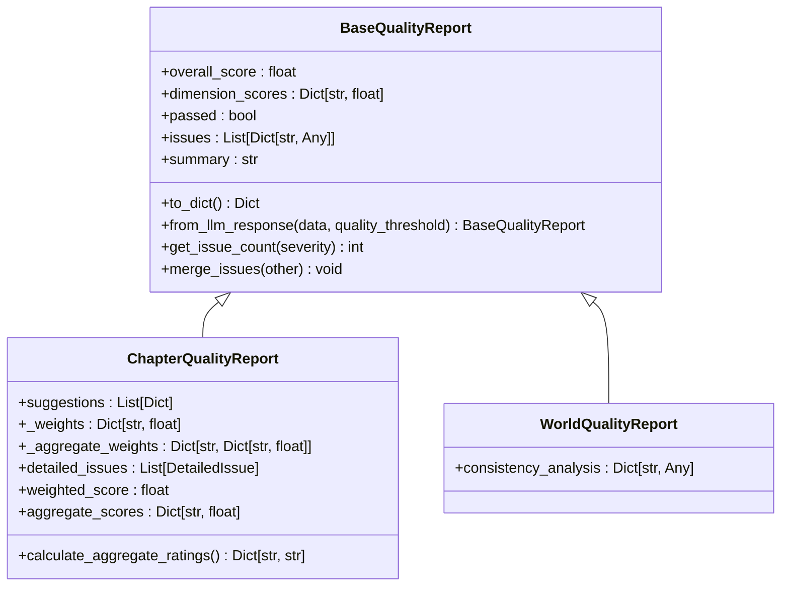

**图表来源**
- [quality_report.py:44-182](file://agents/base/quality_report.py#L44-L182)
- [quality_report.py:274-471](file://agents/base/quality_report.py#L274-L471)

**章节来源**
- [quality_evaluator.py:1-216](file://agents/quality_evaluator.py#L1-L216)
- [outline_quality_evaluator.py:1-475](file://agents/outline_quality_evaluator.py#L1-L475)
- [quality_report.py:1-471](file://agents/base/quality_report.py#L1-L471)
- [review_loop.py:1-862](file://agents/review_loop.py#L1-L862)

## 质量评估流程

系统实现了完整的质量评估流程，从内容输入到最终输出，每个环节都有明确的处理逻辑：

### 章节质量评估流程

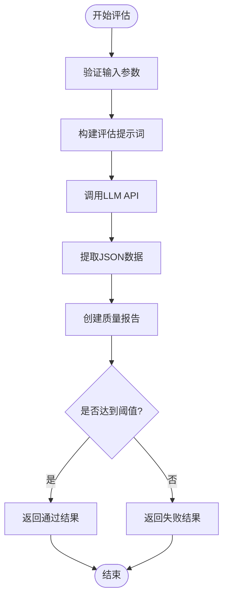

**图表来源**
- [quality_evaluator.py:97-151](file://agents/quality_evaluator.py#L97-L151)

### 大纲质量评估流程

大纲评估流程更加复杂，包含多个维度的综合评估：

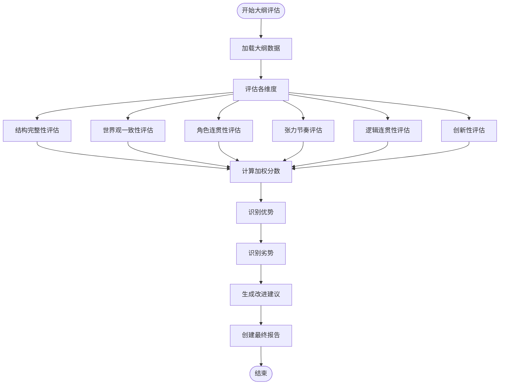

**图表来源**
- [outline_quality_evaluator.py:109-164](file://agents/outline_quality_evaluator.py#L109-L164)
- [outline_quality_evaluator.py:165-202](file://agents/outline_quality_evaluator.py#L165-L202)

**章节来源**
- [outline_quality_evaluator.py:204-397](file://agents/outline_quality_evaluator.py#L204-L397)

## 数据模型设计

系统使用SQLAlchemy ORM框架设计了完整的数据模型，支持质量评估数据的持久化存储：

### 核心数据模型

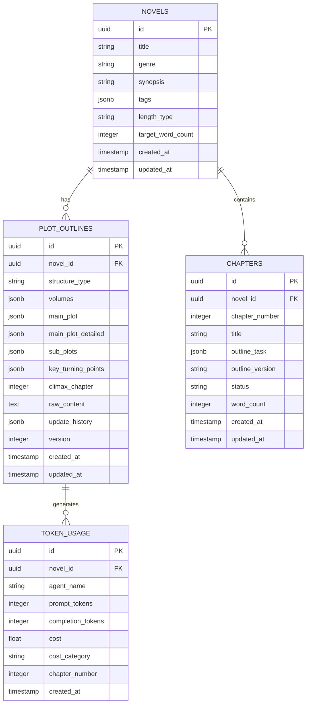

**图表来源**
- [plot_outline.py:13-134](file://core/models/plot_outline.py#L13-L134)

### 评估结果数据模型

系统还设计了专门的数据模型来存储评估结果：

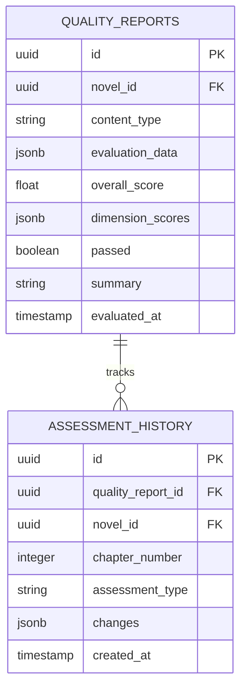

**章节来源**
- [plot_outline.py:1-134](file://core/models/plot_outline.py#L1-L134)

## 前端集成

前端系统提供了直观的质量评估结果展示界面，支持实时数据更新和交互操作：

### 质量评估侧边栏组件

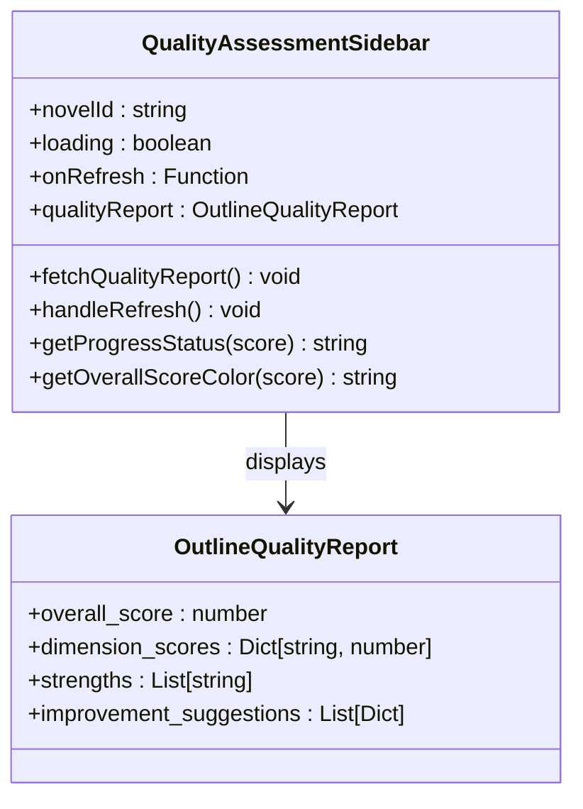

**图表来源**
- [QualityAssessmentSidebar.tsx:48-134](file://frontend/src/components/QualityAssessmentSidebar.tsx#L48-L134)

### API集成架构

前端通过RESTful API与后端进行数据交互：

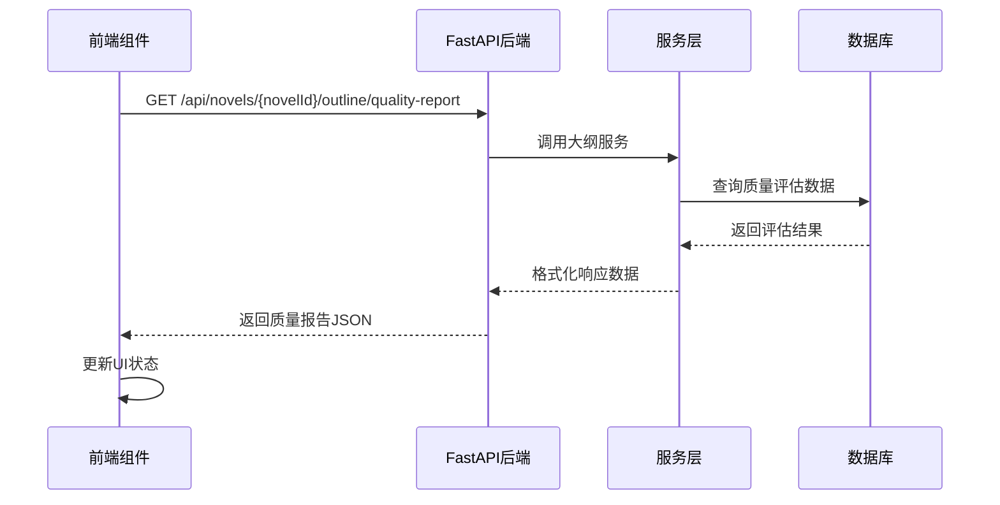

**图表来源**
- [QualityAssessmentSidebar.tsx:56-71](file://frontend/src/components/QualityAssessmentSidebar.tsx#L56-L71)
- [outlines.py:786-800](file://backend/api/v1/outlines.py#L786-L800)

**章节来源**
- [QualityAssessmentSidebar.tsx:1-282](file://frontend/src/components/QualityAssessmentSidebar.tsx#L1-L282)
- [outlines.py:1-1001](file://backend/api/v1/outlines.py#L1-L1001)

## 性能优化策略

系统采用了多种性能优化策略，确保在大规模使用场景下的稳定性和效率：

### LLM调用优化

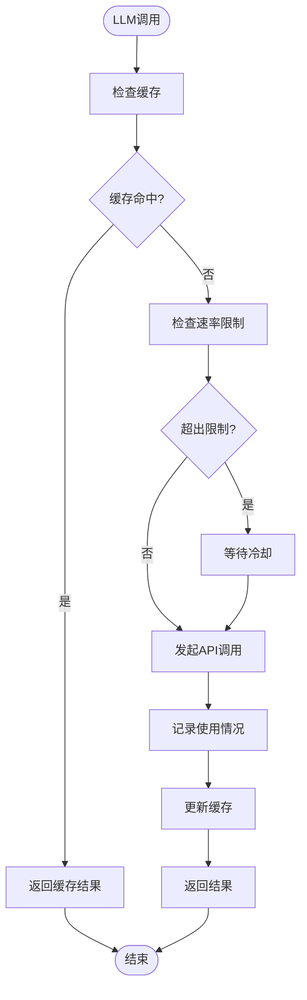

### 成本控制机制

系统实现了多层次的成本控制机制：

- **Token使用追踪**：精确记录每次API调用的Token消耗
- **章节成本限制**：为每个章节设置成本预算上限
- **模型定价管理**：支持多种模型的定价策略
- **自动成本优化**：根据使用情况自动调整调用策略

**章节来源**
- [cost_tracker.py:1-126](file://llm/cost_tracker.py#L1-L126)
- [qwen_client.py:1-371](file://llm/qwen_client.py#L1-L371)

## 故障排除指南

### 常见问题及解决方案

#### LLM调用失败

**问题症状**：API调用超时或返回错误

**解决方案**：
1. 检查网络连接和API密钥配置
2. 查看重试机制是否正常工作
3. 监控Token使用量是否超限
4. 调整超时参数和重试策略

#### 评估结果异常

**问题症状**：质量评分不符合预期或格式错误

**解决方案**：
1. 验证输入数据格式和完整性
2. 检查评估器配置参数
3. 查看日志文件获取详细错误信息
4. 重新运行评估流程

#### 性能问题

**问题症状**：系统响应缓慢或内存占用过高

**解决方案**：
1. 检查数据库连接池配置
2. 优化查询语句和索引
3. 实施缓存策略
4. 监控系统资源使用情况

### 调试工具和技巧

系统提供了丰富的调试工具来帮助开发者定位和解决问题：

- **详细日志记录**：记录所有关键操作和错误信息
- **性能监控**：实时监控系统性能指标
- **错误追踪**：自动捕获和报告异常情况
- **配置验证**：检查配置文件的有效性

**章节来源**
- [config.py:1-514](file://backend/config.py#L1-L514)

## 总结

增强质量评估系统通过精心设计的架构和算法，为网络小说创作提供了全面的质量保障。系统的主要优势包括：

### 核心价值

1. **全面性**：覆盖章节和大纲两个层面的质量评估
2. **智能化**：基于AI的自动化评估和建议生成
3. **可扩展性**：支持自定义评估维度和配置
4. **可视化**：直观的用户界面和实时反馈
5. **成本控制**：智能的成本管理和优化策略

### 技术创新

- **多维度评估**：8个章节评估维度和6个大纲评估维度
- **智能反馈**：基于具体问题的改进建议和优先级排序
- **审查循环**：通过多轮迭代实现质量的持续改进
- **成本追踪**：精确的成本控制和预算管理

### 应用前景

该系统不仅适用于网络小说创作，还可以扩展到其他创意写作领域，如剧本创作、游戏策划等。随着AI技术的不断发展，系统将继续演进，为创作者提供更强大的质量保障工具。

通过本文档的详细分析，开发者可以深入理解系统的架构设计、实现原理和最佳实践，为系统的进一步开发和维护提供有力支持。