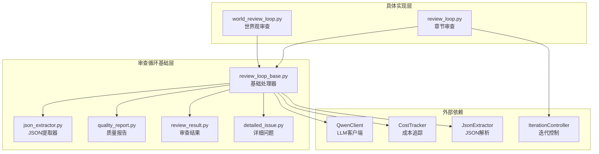
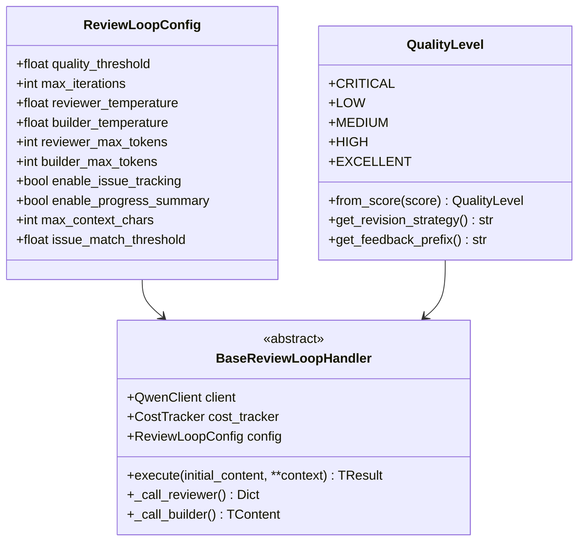
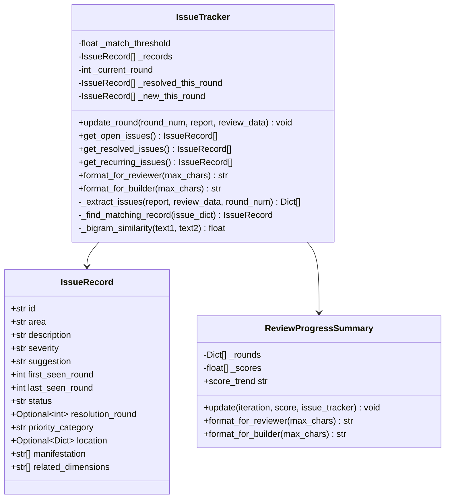
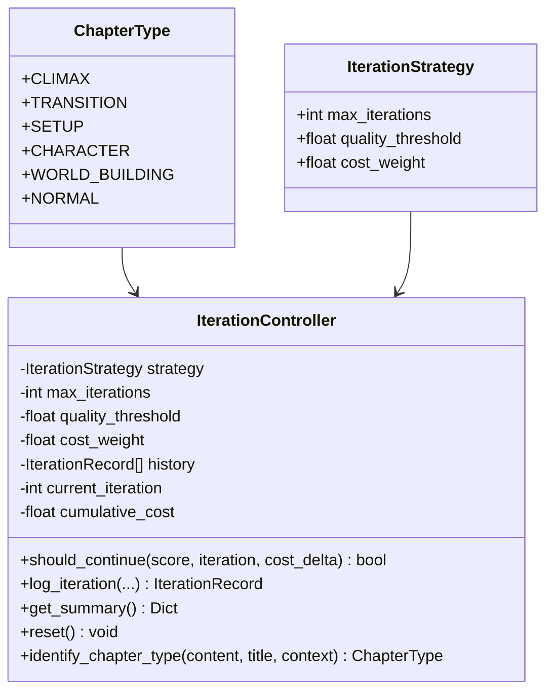
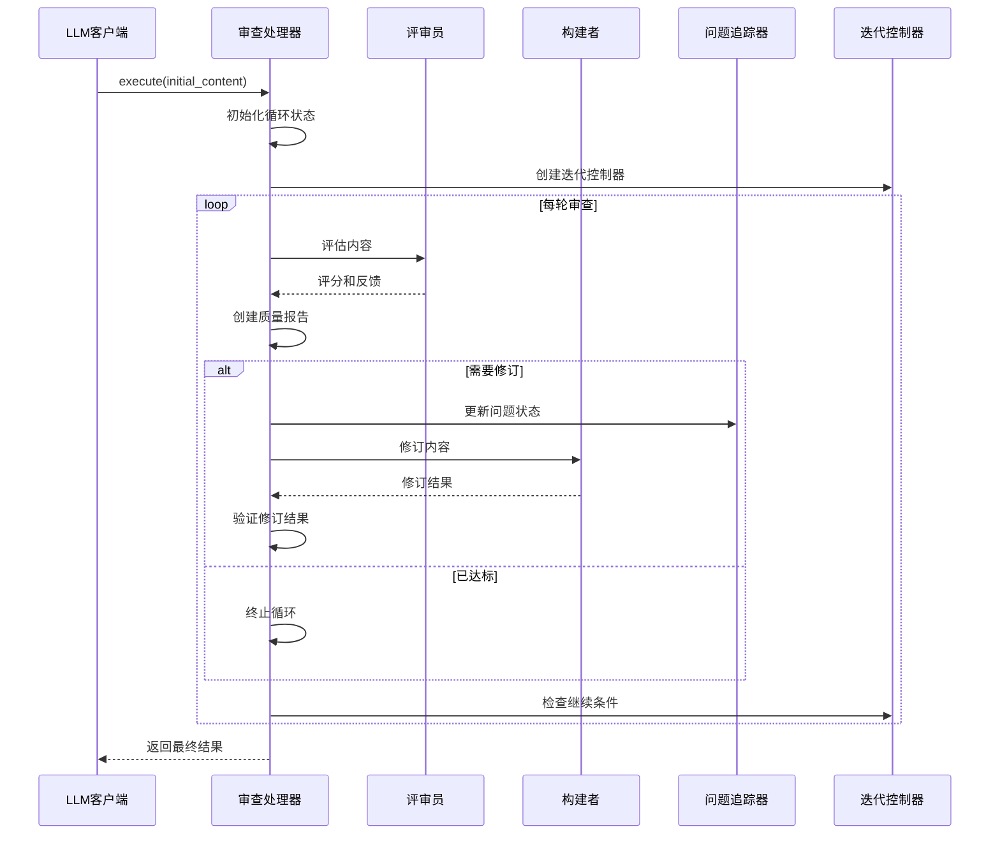
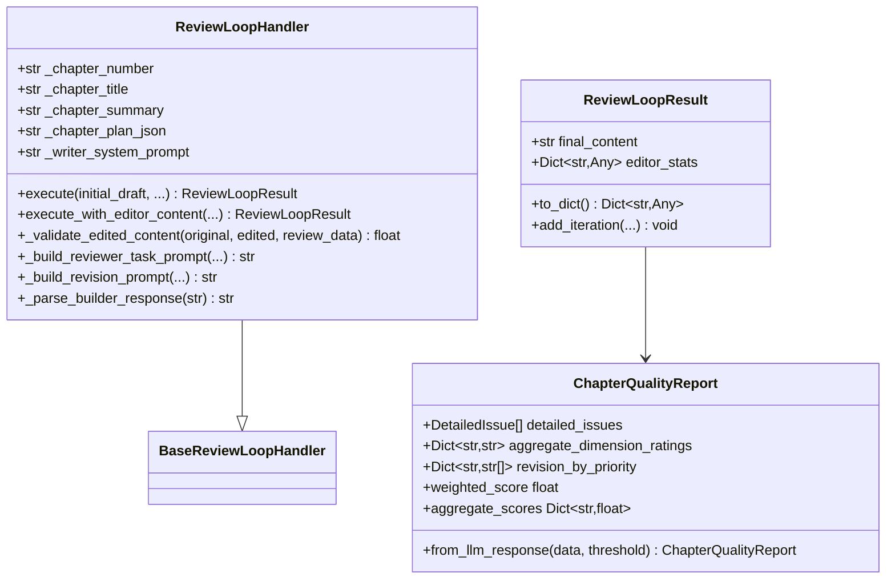
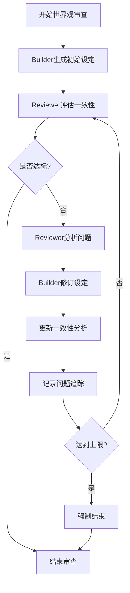
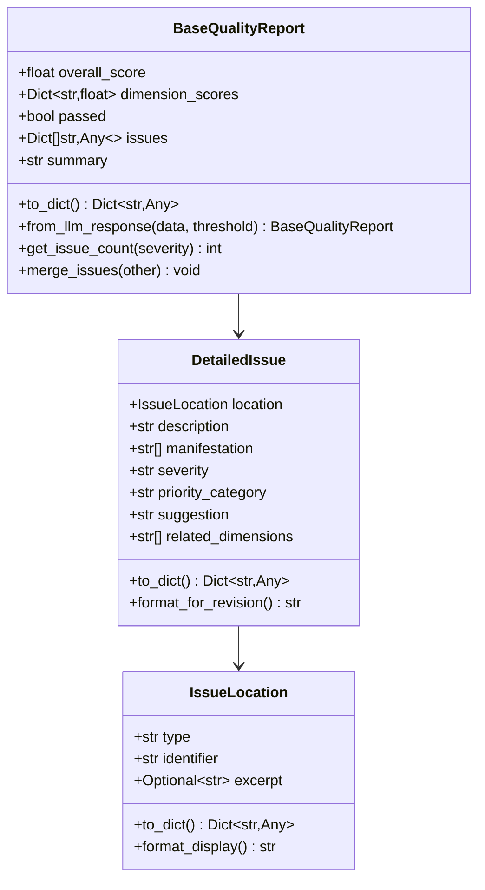
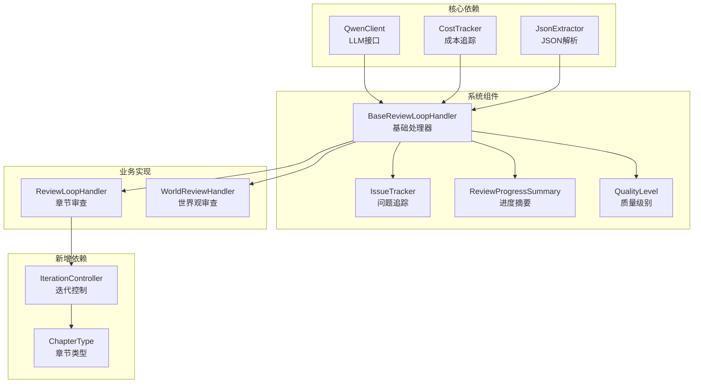

# 审查循环基础处理器

<cite>
**本文档引用的文件**
- [review_loop_base.py](file://agents/base/review_loop_base.py)
- [json_extractor.py](file://agents/base/json_extractor.py)
- [quality_report.py](file://agents/base/quality_report.py)
- [review_result.py](file://agents/base/review_result.py)
- [detailed_issue.py](file://agents/base/detailed_issue.py)
- [review_loop.py](file://agents/review_loop.py)
- [world_review_loop.py](file://agents/world_review_loop.py)
- [iteration_controller.py](file://agents/iteration_controller.py)
</cite>

## 更新摘要
**变更内容**
- 更新了章节审查处理器的增强功能，特别是新增的`execute_with_editor_content`方法
- 增加了动态迭代策略支持，通过`IterationController`实现章节类型感知的智能迭代控制
- 新增了Editor润色内容的自动应用机制和质量验证功能
- 增强了问题追踪系统的兼容性和向后兼容性支持

## 目录
1. [简介](#简介)
2. [项目结构](#项目结构)
3. [核心组件](#核心组件)
4. [架构概览](#架构概览)
5. [详细组件分析](#详细组件分析)
6. [依赖关系分析](#依赖关系分析)
7. [性能考量](#性能考量)
8. [故障排除指南](#故障排除指南)
9. [结论](#结论)

## 简介

审查循环基础处理器是小说创作系统中的核心组件，采用模板方法模式实现了标准化的Builder-Reviewer审查循环。该处理器通过自动化质量评估和智能修订，确保创作内容达到预期标准。

系统支持多种审查类型，包括章节审查、世界观审查、角色审查和情节审查，每种类型都有专门的处理器实现。所有处理器都遵循统一的审查循环模式，通过迭代优化实现内容质量的持续提升。

**更新** 系统现已支持动态迭代策略和Editor润色内容的智能应用，通过章节类型感知的智能控制机制，为不同类型的创作需求提供最优的审查策略。

## 项目结构

审查循环基础处理器位于agents/base目录下，包含以下核心文件：

**图表来源**
- [review_loop_base.py:1-1521](file://agents/base/review_loop_base.py#L1-L1521)
- [review_loop.py:1-918](file://agents/review_loop.py#L1-L918)
- [world_review_loop.py:1-365](file://agents/world_review_loop.py#L1-L365)
- [iteration_controller.py:1-301](file://agents/iteration_controller.py#L1-L301)

**章节来源**
- [review_loop_base.py:1-1521](file://agents/base/review_loop_base.py#L1-L1521)
- [review_loop.py:1-918](file://agents/review_loop.py#L1-L918)
- [world_review_loop.py:1-365](file://agents/world_review_loop.py#L1-L365)
- [iteration_controller.py:1-301](file://agents/iteration_controller.py#L1-L301)

## 核心组件

### 审查循环配置系统

审查循环配置系统提供了灵活的参数控制机制，支持不同审查场景的需求差异。

**图表来源**
- [review_loop_base.py:38-135](file://agents/base/review_loop_base.py#L38-L135)
- [review_loop_base.py:78-135](file://agents/base/review_loop_base.py#L78-L135)
- [review_loop_base.py:653-713](file://agents/base/review_loop_base.py#L653-L713)

### 问题追踪与进度管理

系统内置了强大的问题追踪和进度管理系统，支持跨轮次的问题生命周期管理。

**图表来源**
- [review_loop_base.py:177-540](file://agents/base/review_loop_base.py#L177-L540)
- [review_loop_base.py:542-651](file://agents/base/review_loop_base.py#L542-L651)

**章节来源**
- [review_loop_base.py:177-540](file://agents/base/review_loop_base.py#L177-L540)
- [review_loop_base.py:542-651](file://agents/base/review_loop_base.py#L542-L651)

### 动态迭代控制机制

**新增** 系统现在支持基于章节类型的动态迭代策略，通过`IterationController`实现智能的迭代次数和质量阈值控制。

**图表来源**
- [iteration_controller.py:14-104](file://agents/iteration_controller.py#L14-L104)
- [iteration_controller.py:64-184](file://agents/iteration_controller.py#L64-L184)

**章节来源**
- [iteration_controller.py:1-301](file://agents/iteration_controller.py#L1-L301)

## 架构概览

审查循环系统采用分层架构设计，通过模板方法模式实现代码复用和扩展性。

**图表来源**
- [review_loop_base.py:718-890](file://agents/base/review_loop_base.py#L718-L890)

### 审查循环流程

系统实现了标准化的审查循环流程，确保每次迭代都能带来质量提升：

1. **初始化阶段**：设置循环参数和增强组件
2. **评估阶段**：Reviewer对当前内容进行质量评估
3. **报告阶段**：构建质量报告和问题列表
4. **追踪阶段**：更新问题追踪和进度摘要
5. **决策阶段**：检查退出条件（达标或达到上限）
6. **修订阶段**：Builder根据反馈进行内容修订
7. **验证阶段**：验证修订结果的有效性
8. **记录阶段**：记录迭代历史和统计数据

**更新** 新增了Editor润色内容的自动应用机制，当Editor提供的润色内容质量更高时，系统会自动采用Editor的修改结果。

**章节来源**
- [review_loop_base.py:718-890](file://agents/base/review_loop_base.py#L718-L890)

## 详细组件分析

### 章节审查处理器

章节审查处理器专门针对小说章节内容进行质量评估和优化。

**图表来源**
- [review_loop.py:152-440](file://agents/review_loop.py#L152-L440)
- [review_result.py:129-157](file://agents/base/review_result.py#L129-L157)
- [quality_report.py:274-471](file://agents/base/quality_report.py#L274-L471)

**更新** 章节审查处理器现在支持两种执行模式：
- 标准执行模式：传统的Writer-Editor循环
- 增强执行模式：`execute_with_editor_content`，支持Editor润色内容的自动应用

章节审查处理器的特点包括：

- **详细的维度评分**：支持8个精确维度的评分标准
- **优先级分类**：将问题分为影响阅读体验、提升精彩度、细节打磨三个优先级
- **聚合维度分析**：提供连贯性、合理性、趣味性的综合评估
- **Editor集成**：支持Editor的润色功能和质量验证
- **动态策略**：支持基于章节类型的智能迭代控制
- **向后兼容**：支持新旧两种问题格式的解析

**章节来源**
- [review_loop.py:152-440](file://agents/review_loop.py#L152-L440)
- [quality_report.py:274-471](file://agents/base/quality_report.py#L274-L471)

### 世界观审查处理器

世界观审查处理器专注于小说世界观设计的深度和一致性评估。

**图表来源**
- [world_review_loop.py:166-335](file://agents/world_review_loop.py#L166-L335)

世界观审查处理器的核心功能：

- **多维度评估**：内在一致性、深度广度、独特性、可扩展性、力量体系完整性
- **一致性分析**：自动检测设定冲突和逻辑漏洞
- **主题适配**：根据小说题材特点调整评估标准
- **迭代优化**：通过多轮迭代完善世界观设计

**章节来源**
- [world_review_loop.py:166-335](file://agents/world_review_loop.py#L166-L335)

### 质量报告系统

质量报告系统提供了统一的数据结构和处理逻辑，支持不同类型的质量评估。

**图表来源**
- [quality_report.py:44-182](file://agents/base/quality_report.py#L44-L182)
- [detailed_issue.py:110-190](file://agents/base/detailed_issue.py#L110-L190)

**更新** 质量报告系统现在支持更详细的问题描述格式，包括问题位置、具体表现、关联维度等信息。

**章节来源**
- [quality_report.py:44-182](file://agents/base/quality_report.py#L44-L182)
- [detailed_issue.py:110-190](file://agents/base/detailed_issue.py#L110-L190)

## 依赖关系分析

审查循环基础处理器的依赖关系相对简单，主要依赖于外部的LLM服务和工具模块。

**图表来源**
- [review_loop_base.py:25-31](file://agents/base/review_loop_base.py#L25-L31)
- [review_loop.py:6-22](file://agents/review_loop.py#L6-L22)
- [world_review_loop.py:13-21](file://agents/world_review_loop.py#L13-L21)
- [iteration_controller.py:14-23](file://agents/iteration_controller.py#L14-L23)

### 外部接口依赖

系统对外部接口的依赖主要体现在以下几个方面：

- **LLM服务接口**：通过QwenClient提供统一的AI服务调用接口
- **成本追踪**：通过CostTracker监控和统计LLM调用成本
- **JSON解析**：通过JsonExtractor处理LLM返回的JSON数据
- **日志系统**：使用core.logging_config提供统一的日志记录
- **迭代控制**：通过IterationController提供智能的迭代策略管理

**更新** 新增了迭代控制器的依赖，支持基于章节类型的动态策略控制。

**章节来源**
- [review_loop_base.py:25-31](file://agents/base/review_loop_base.py#L25-L31)
- [review_loop.py:6-22](file://agents/review_loop.py#L6-L22)
- [world_review_loop.py:13-21](file://agents/world_review_loop.py#L13-L21)

## 性能考量

审查循环基础处理器在设计时充分考虑了性能优化和资源控制：

### 超时控制机制

系统实现了多层次的超时控制，防止长时间阻塞影响用户体验：

- **单次调用超时**：每个LLM调用都有独立的超时设置
- **整体循环超时**：整个审查循环过程也有总时长限制
- **Token预算控制**：通过max_tokens参数控制单次调用的成本

### 内存优化策略

- **增量处理**：问题追踪器只保存必要的历史信息
- **压缩输出**：超过长度限制的内容会被自动压缩
- **延迟加载**：非必要的组件按需初始化

### 并发处理能力

- **异步调用**：所有LLM交互都采用异步方式，提高并发性能
- **资源池管理**：通过配置参数控制同时运行的审查任务数量
- **错误恢复**：网络异常时能够自动重试并优雅降级

**更新** 新增了Editor润色内容的自动应用机制，通过质量验证确保只有提升质量的内容才会被采用，避免不必要的内容修改。

## 故障排除指南

### 常见问题诊断

**问题1：LLM调用失败**
- 检查网络连接状态
- 验证API密钥配置
- 查看超时设置是否合理
- 检查成本追踪器状态

**问题2：JSON解析错误**
- 确认LLM返回格式符合预期
- 检查JsonExtractor的配置
- 查看具体的解析错误日志

**问题3：审查循环卡死**
- 检查超时参数设置
- 验证内容验证逻辑
- 查看循环状态和迭代历史

**问题4：Editor润色内容未应用**
- 检查润色内容的质量评分
- 验证质量验证逻辑
- 查看Editor统计信息

### 调试技巧

1. **启用详细日志**：通过设置日志级别获取完整的执行轨迹
2. **监控成本使用**：定期检查CostTracker的统计数据
3. **验证输入输出**：确保传入的内容格式正确
4. **测试边界条件**：验证极端情况下的系统行为
5. **检查迭代策略**：验证章节类型识别和策略配置

**更新** 新增了Editor润色内容应用的调试方法，包括质量验证、统计信息记录等功能。

**章节来源**
- [review_loop_base.py:1375-1476](file://agents/base/review_loop_base.py#L1375-L1476)
- [review_loop.py:490-539](file://agents/review_loop.py#L490-L539)

## 结论

审查循环基础处理器通过标准化的设计模式和丰富的功能特性，为小说创作系统提供了强大而灵活的质量保证机制。其核心优势包括：

1. **高度可扩展性**：通过模板方法模式支持多种审查类型的定制
2. **智能化问题追踪**：跨轮次的问题管理和优先级排序
3. **精细化质量控制**：多维度评分和详细的反馈机制
4. **性能优化设计**：超时控制、内存管理和并发处理
5. **完善的错误处理**：健壮的异常处理和恢复机制
6. **动态策略支持**：基于章节类型的智能迭代控制
7. **Editor集成能力**：自动润色内容的应用和质量验证
8. **向后兼容性**：支持新旧两种问题格式的解析

**更新** 新系统在保持原有功能的基础上，新增了动态迭代策略、Editor润色内容自动应用、章节类型识别等高级功能，进一步提升了系统的智能化水平和实用性。

该系统为小说创作团队提供了专业级的质量管理工具，能够显著提升创作效率和作品质量。通过持续的迭代优化，审查循环系统将继续为创作者提供更好的技术支持。