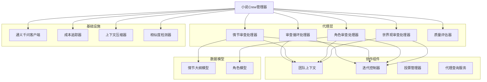
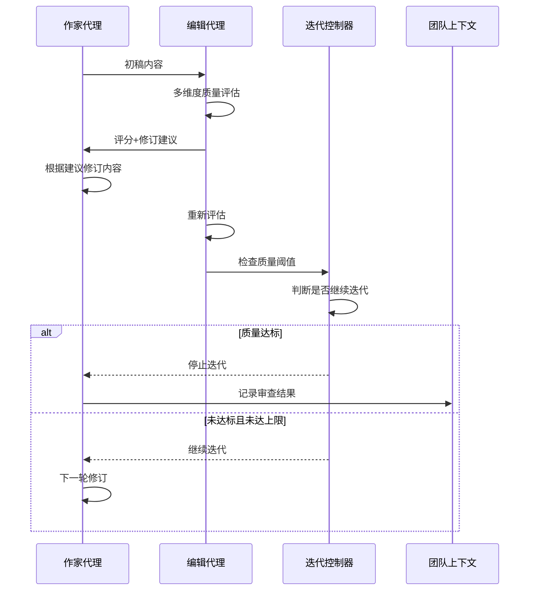
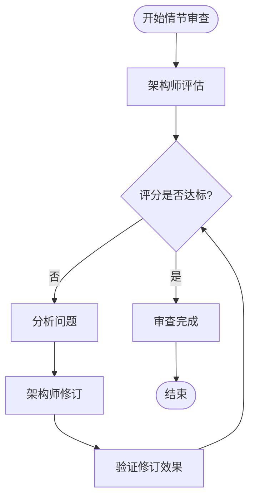
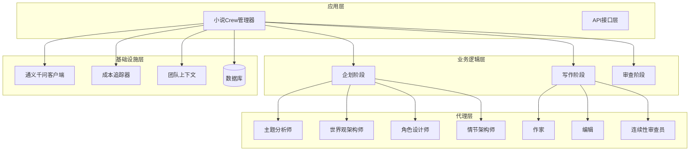
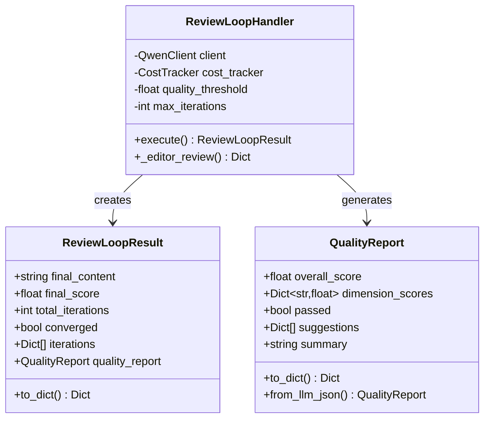
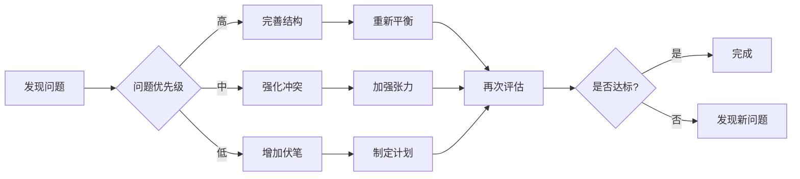
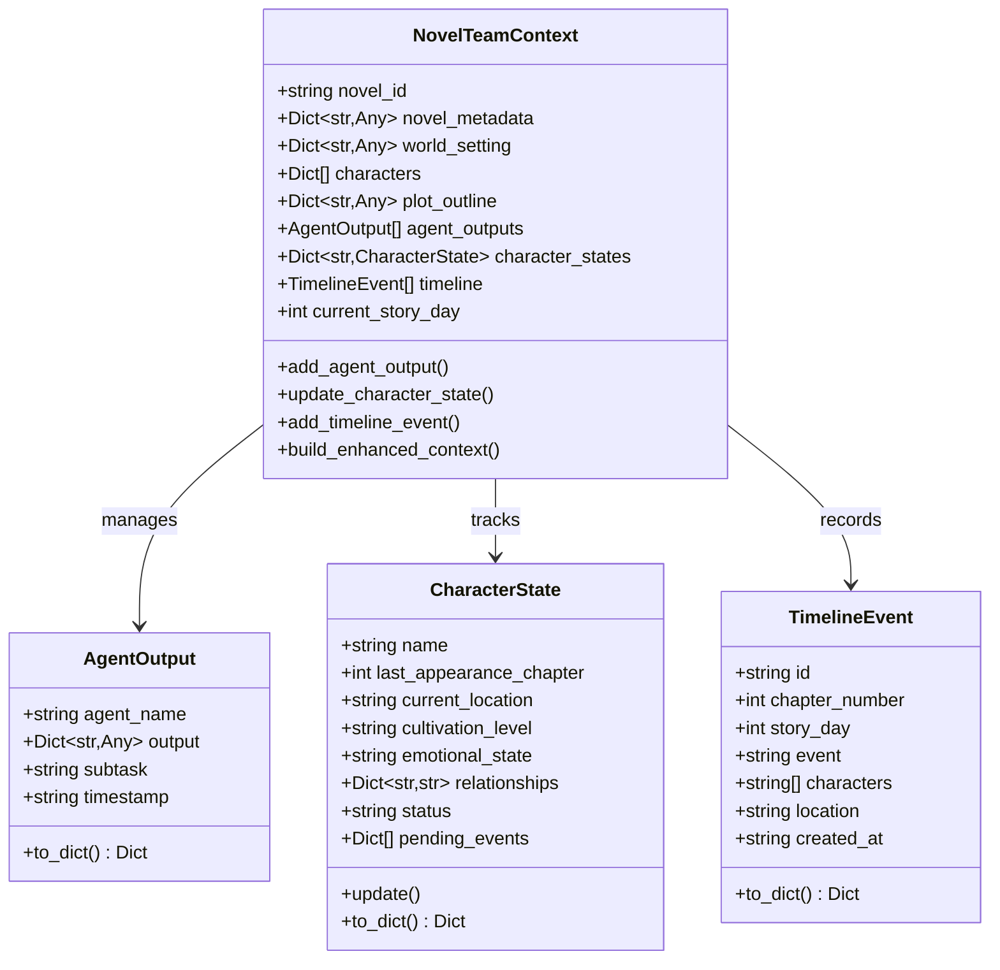
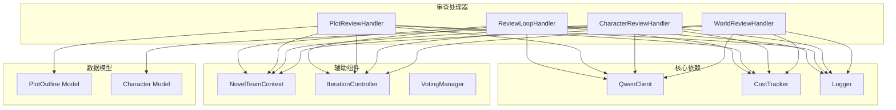
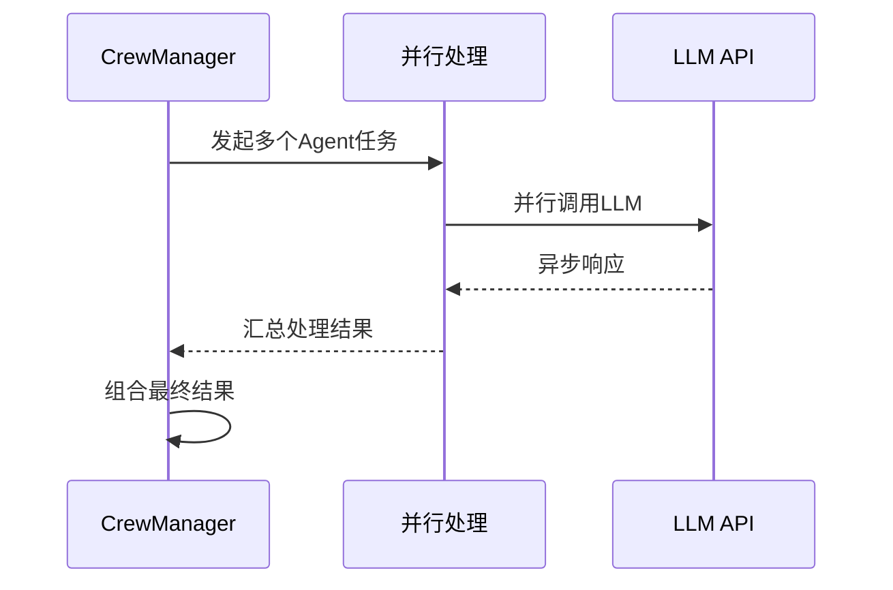

# 情节审查处理器

<cite>
**本文档引用的文件**
- [agents/review_loop.py](file://agents/review_loop.py)
- [agents/plot_review_loop.py](file://agents/plot_review_loop.py)
- [agents/character_review_loop.py](file://agents/character_review_loop.py)
- [agents/world_review_loop.py](file://agents/world_review_loop.py)
- [agents/quality_evaluator.py](file://agents/quality_evaluator.py)
- [agents/team_context.py](file://agents/team_context.py)
- [agents/crew_manager.py](file://agents/crew_manager.py)
- [agents/iteration_controller.py](file://agents/iteration_controller.py)
- [agents/voting_manager.py](file://agents/voting_manager.py)
- [llm/qwen_client.py](file://llm/qwen_client.py)
- [llm/cost_tracker.py](file://llm/cost_tracker.py)
- [core/models/plot_outline.py](file://core/models/plot_outline.py)
- [core/models/character.py](file://core/models/character.py)
</cite>

## 目录
1. [简介](#简介)
2. [项目结构](#项目结构)
3. [核心组件](#核心组件)
4. [架构概览](#架构概览)
5. [详细组件分析](#详细组件分析)
6. [依赖关系分析](#依赖关系分析)
7. [性能考虑](#性能考虑)
8. [故障排除指南](#故障排除指南)
9. [结论](#结论)

## 简介

情节审查处理器是小说生成系统中的核心质量保证组件，负责通过多维度的智能审查机制确保小说内容的质量和一致性。该系统采用先进的AI代理技术，实现了自动化的审查反馈循环，能够对章节内容、角色设计、世界观设定和情节大纲进行全面的质量评估。

系统基于CrewAI风格的代理架构，通过多个专门的审查处理器协同工作，形成了一套完整的质量控制体系。每个审查处理器都针对特定的创作元素进行深度分析，确保小说在各个方面的质量都达到专业标准。

## 项目结构

小说系统采用模块化的架构设计，将不同的功能职责分配到相应的模块中：

**图表来源**
- [agents/crew_manager.py](file://agents/crew_manager.py#L38-L150)
- [agents/review_loop.py](file://agents/review_loop.py#L91-L122)
- [agents/plot_review_loop.py](file://agents/plot_review_loop.py#L229-L256)
- [agents/character_review_loop.py](file://agents/character_review_loop.py#L202-L237)
- [agents/world_review_loop.py](file://agents/world_review_loop.py#L206-L232)

**章节来源**
- [agents/crew_manager.py](file://agents/crew_manager.py#L1-L1038)
- [agents/team_context.py](file://agents/team_context.py#L155-L216)

## 核心组件

### 审查循环处理器

审查循环处理器是系统的核心组件，实现了Writer-Editor的智能协作模式。该处理器通过多轮迭代确保章节内容达到预定的质量标准。

**图表来源**
- [agents/review_loop.py](file://agents/review_loop.py#L113-L263)
- [agents/iteration_controller.py](file://agents/iteration_controller.py#L70-L115)

### 情节审查处理器

情节审查处理器专注于小说情节架构的完整性评估，确保故事结构合理、节奏恰当、冲突充分。

**图表来源**
- [agents/plot_review_loop.py](file://agents/plot_review_loop.py#L251-L379)

### 角色审查处理器

角色审查处理器深入分析角色设计的深度和质量，确保角色具有心理深度、独特性和成长弧线。

**章节来源**
- [agents/character_review_loop.py](file://agents/character_review_loop.py#L202-L381)

### 世界观审查处理器

世界观审查处理器评估虚构世界的内在一致性、深度和独特性，确保设定自洽且具有扩展潜力。

**章节来源**
- [agents/world_review_loop.py](file://agents/world_review_loop.py#L206-L355)

## 架构概览

系统采用分层架构设计，每一层都有明确的职责分工：

**图表来源**
- [agents/crew_manager.py](file://agents/crew_manager.py#L38-L547)
- [llm/qwen_client.py](file://llm/qwen_client.py#L16-L232)

## 详细组件分析

### 审查循环处理器详解

审查循环处理器实现了完整的质量控制流程，包含以下关键特性：

#### 数据结构设计

**图表来源**
- [agents/review_loop.py](file://agents/review_loop.py#L16-L33)
- [agents/review_loop.py](file://agents/review_loop.py#L91-L122)
- [agents/quality_evaluator.py](file://agents/quality_evaluator.py#L12-L42)

#### 工作流程分析

审查循环的执行流程体现了智能质量控制的特点：

1. **初始化阶段**：设置质量阈值和最大迭代次数
2. **评估阶段**：编辑代理对内容进行多维度评分
3. **反馈阶段**：提供具体的修订建议
4. **修订阶段**：作家代理根据反馈改进内容
5. **验证阶段**：检查是否达到质量标准

**章节来源**
- [agents/review_loop.py](file://agents/review_loop.py#L113-L263)

### 情节审查处理器详解

情节审查处理器专注于故事结构的整体质量评估：

#### 评估维度

处理器从五个核心维度评估情节设计：

| 维度 | 评估要点 | 评分标准 |
|------|----------|----------|
| 结构完整性 | 起承转合、卷间递进、主线贯穿 | 9-10分：精妙；8-9分：完整；7-8分：良好 |
| 节奏把控 | 情节推进、高潮分布、张弛有度 | 9-10分：完美；8-9分：紧凑；7-8分：合理 |
| 冲突张力 | 核心冲突、独立冲突、威胁感 | 9-10分：强烈；8-9分：充足；7-8分：一般 |
| 角色利用度 | 主角戏份、角色成长、配角发挥 | 9-10分：充分；8-9分：合理；7-8分：有待改善 |
| 伏笔设计 | 铺垫合理性、转折预兆、悬念回收 | 9-10分：巧妙；8-9分：恰当；7-8分：基础 |

#### 修订策略

当情节设计未达标准时，处理器会提供针对性的改进建议：

**图表来源**
- [agents/plot_review_loop.py](file://agents/plot_review_loop.py#L64-L104)

**章节来源**
- [agents/plot_review_loop.py](file://agents/plot_review_loop.py#L229-L495)

### 角色审查处理器详解

角色审查处理器确保角色设计的深度和质量：

#### 角色评估框架

| 维度 | 评估指标 | 质量标准 |
|------|----------|----------|
| 心理深度 | 内在矛盾、复杂动机、隐藏秘密 | 9-10分：极具深度；8-9分：有深度；7-8分：基础 |
| 独特性 | 角色区分度、避免脸谱化、个性特征 | 9-10分：独特鲜明；8-9分：有一定特色；7-8分：一般 |
| 成长潜力 | 合理的成长弧线、转折点设计、弱点考验 | 9-10分：说服力强；8-9分：合理；7-8分：有待完善 |
| 关系复杂性 | 多层次关系、潜在冲突、关系变化 | 9-10分：关系丰富；8-9分：有一定复杂性；7-8分：简单 |
| 世界观契合度 | 背景一致性、能力符合体系、世界定位 | 9-10分：完全契合；8-9分：基本契合；7-8分：需要调整 |

**章节来源**
- [agents/character_review_loop.py](file://agents/character_review_loop.py#L202-L522)

### 世界观审查处理器详解

世界观审查处理器评估虚构世界的完整性和一致性：

#### 评估维度

| 维度 | 评估要点 | 质量标准 |
|------|----------|----------|
| 内在一致性 | 设定自洽、力量体系逻辑、历史匹配 | 9-10分：完全自洽；8-9分：基本一致；7-8分：有小问题 |
| 深度与广度 | 力量层次、地理丰富性、势力架构 | 9-10分：非常丰富；8-9分：丰富；7-8分：基础 |
| 独特性 | 独特元素、避免套路、创新点 | 9-10分：极具创新；8-9分：有创新；7-8分：一般 |
| 可扩展性 | 发展空间、未探索区域、上升潜力 | 9-10分：潜力巨大；8-9分：有潜力；7-8分：有限 |
| 力量体系完整性 | 等级划分、升级机制、能力限制 | 9-10分：完整；8-9分：基本完整；7-8分：需要完善 |

**章节来源**
- [agents/world_review_loop.py](file://agents/world_review_loop.py#L206-L482)

### 团队上下文管理系统

团队上下文管理系统实现了跨代理的信息共享和状态追踪：

**图表来源**
- [agents/team_context.py](file://agents/team_context.py#L155-L216)
- [agents/team_context.py](file://agents/team_context.py#L14-L30)
- [agents/team_context.py](file://agents/team_context.py#L32-L79)
- [agents/team_context.py](file://agents/team_context.py#L81-L104)

**章节来源**
- [agents/team_context.py](file://agents/team_context.py#L155-L493)

## 依赖关系分析

系统中的组件依赖关系体现了清晰的分层架构：

**图表来源**
- [agents/crew_manager.py](file://agents/crew_manager.py#L14-L31)
- [agents/review_loop.py](file://agents/review_loop.py#L8-L13)
- [agents/plot_review_loop.py](file://agents/plot_review_loop.py#L15-L17)

**章节来源**
- [agents/crew_manager.py](file://agents/crew_manager.py#L1-L1038)

## 性能考虑

系统在设计时充分考虑了性能优化和资源管理：

### 成本控制机制

系统实现了多层次的成本控制策略：

1. **Token使用追踪**：精确记录每次API调用的输入输出token数量
2. **成本分类统计**：按章节、迭代、查询、投票等维度统计成本
3. **成本上限控制**：为每轮审查循环设置成本上限，防止过度消耗
4. **智能重试机制**：在网络不稳定时自动重试，避免人工干预

### 并发处理优化

系统采用了异步编程模式来提高并发处理能力：

**图表来源**
- [agents/crew_manager.py](file://agents/crew_manager.py#L110-L141)

### 内存管理策略

系统通过以下方式优化内存使用：

1. **上下文压缩**：使用上下文压缩器减少重复信息传输
2. **增量更新**：只存储必要的状态信息
3. **及时清理**：定期清理过期的临时数据
4. **分页加载**：大数据集采用分页处理方式

## 故障排除指南

### 常见问题及解决方案

#### LLM API调用失败

**问题症状**：代理调用LLM API时抛出异常

**可能原因**：
1. API密钥配置错误
2. 网络连接不稳定
3. 模型参数超出限制
4. 服务器负载过高

**解决方案**：
1. 检查环境变量配置
2. 实施指数退避重试机制
3. 优化提示词长度
4. 监控API使用情况

#### JSON解析错误

**问题症状**：审查处理器无法从LLM响应中提取JSON

**可能原因**：
1. LLM输出格式不符合预期
2. 响应中包含额外的文本内容
3. 编码格式问题

**解决方案**：
1. 实现多种JSON提取策略
2. 添加响应格式验证
3. 提供降级处理方案

#### 内存溢出问题

**问题症状**：长时间运行后出现内存不足

**可能原因**：
1. 上下文数据累积过多
2. 代理输出未及时清理
3. 缓存数据过大

**解决方案**：
1. 实施数据清理策略
2. 优化上下文压缩算法
3. 设置内存使用上限

**章节来源**
- [agents/review_loop.py](file://agents/review_loop.py#L298-L322)
- [agents/plot_review_loop.py](file://agents/plot_review_loop.py#L456-L495)
- [agents/character_review_loop.py](file://agents/character_review_loop.py#L484-L522)
- [agents/world_review_loop.py](file://agents/world_review_loop.py#L455-L482)

## 结论

情节审查处理器代表了小说生成系统的智能化水平，通过多维度的审查机制确保了内容质量的一致性和专业性。系统的设计体现了以下优势：

1. **全面性**：覆盖小说创作的各个方面，从情节结构到角色设计
2. **智能化**：利用AI代理实现自动化质量控制
3. **可扩展性**：模块化设计便于功能扩展和维护
4. **可控性**：提供成本控制和质量阈值管理
5. **协作性**：支持多代理间的智能协作和信息共享

该系统为自动化小说创作提供了坚实的技术基础，通过持续的优化和改进，能够为用户提供更加优质的小说创作体验。