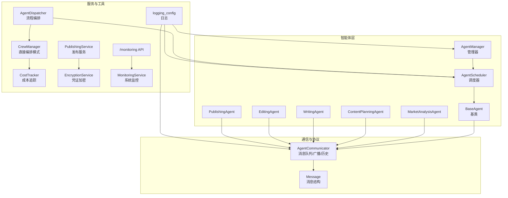
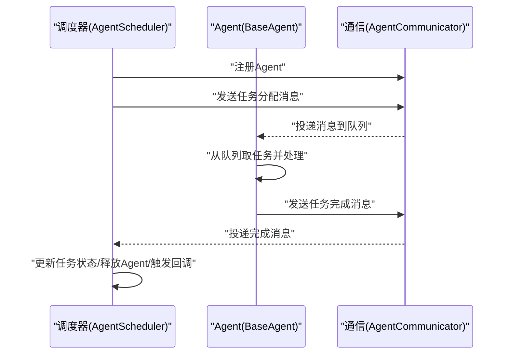
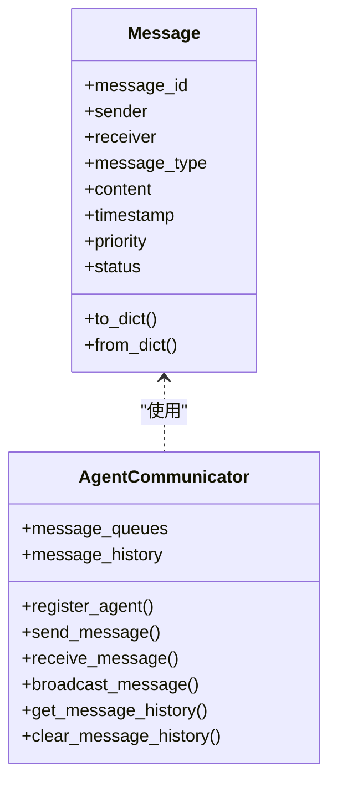
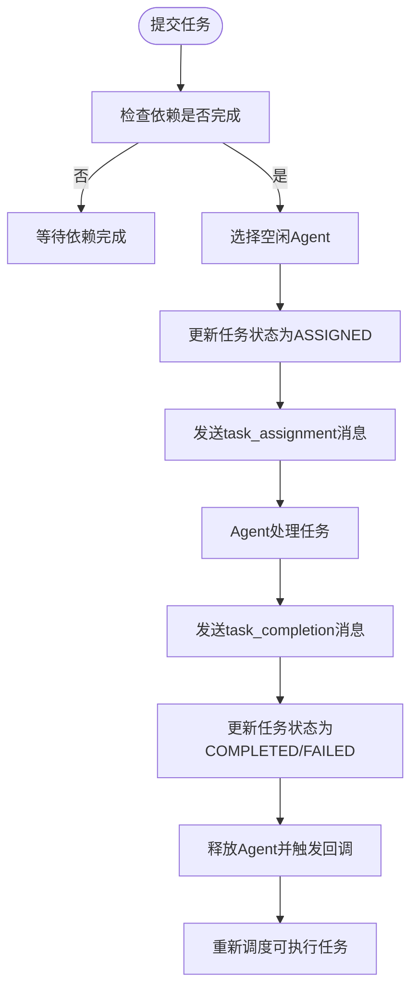
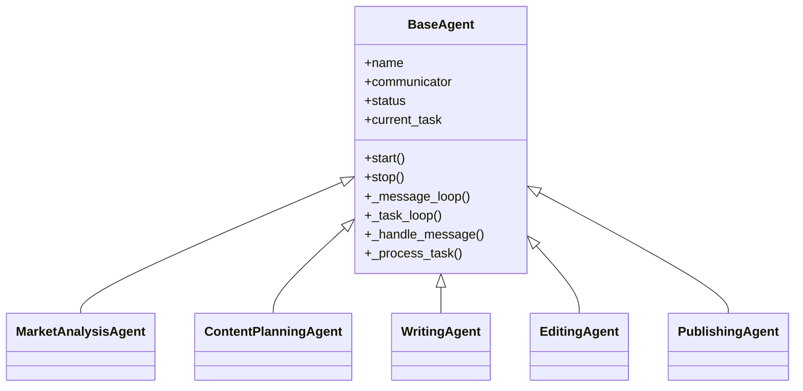
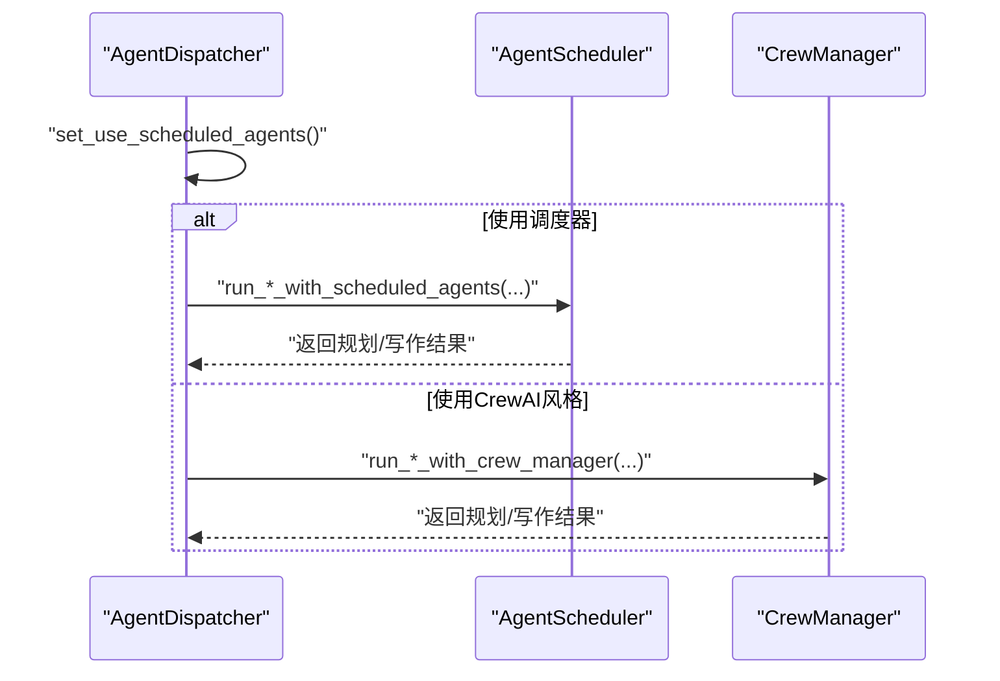
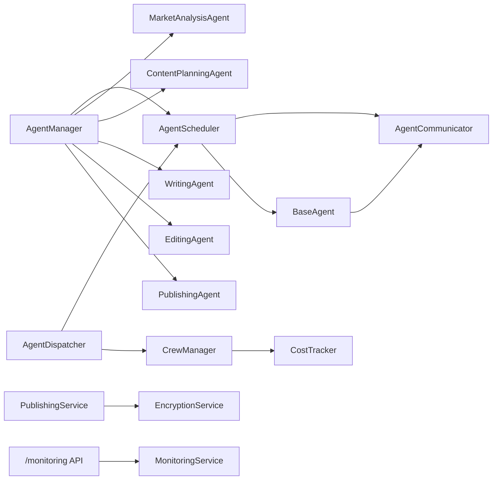

# 智能体通信机制

<cite>
**本文引用的文件**
- [agents/agent_communicator.py](file://agents/agent_communicator.py)
- [agents/agent_scheduler.py](file://agents/agent_scheduler.py)
- [agents/agent_manager.py](file://agents/agent_manager.py)
- [agents/agent_dispatcher.py](file://agents/agent_dispatcher.py)
- [agents/specific_agents.py](file://agents/specific_agents.py)
- [agents/crew_manager.py](file://agents/crew_manager.py)
- [agents/test_multi_agent.py](file://agents/test_multi_agent.py)
- [llm/cost_tracker.py](file://llm/cost_tracker.py)
- [backend/services/encryption_service.py](file://backend/services/encryption_service.py)
- [backend/services/publishing_service.py](file://backend/services/publishing_service.py)
- [backend/api/v1/monitoring.py](file://backend/api/v1/monitoring.py)
- [backend/services/monitoring_service.py](file://backend/services/monitoring_service.py)
- [core/logging_config.py](file://core/logging_config.py)
</cite>

## 目录
1. [引言](#引言)
2. [项目结构](#项目结构)
3. [核心组件](#核心组件)
4. [架构总览](#架构总览)
5. [详细组件分析](#详细组件分析)
6. [依赖关系分析](#依赖关系分析)
7. [性能考虑](#性能考虑)
8. [故障排查指南](#故障排查指南)
9. [结论](#结论)
10. [附录](#附录)

## 引言
本文件系统性梳理小说生成系统的“智能体通信机制”，围绕消息路由、协议定义、数据序列化、通信协议、消息传递模式、安全机制、性能优化与监控诊断等方面进行深入解析。目标是帮助开发者快速理解 Agent 间的通信架构，并在实际工程中高效落地与维护。

## 项目结构
该系统以“智能体”为核心，通过统一的通信管理器实现 Agent 之间的消息传递；调度器负责任务生命周期管理与 Agent 分配；具体 Agent 实现各自业务逻辑；同时提供成本追踪、加密存储、监控 API 等配套能力。

图示来源
- [agents/agent_manager.py](file://agents/agent_manager.py#L22-L75)
- [agents/agent_scheduler.py](file://agents/agent_scheduler.py#L103-L129)
- [agents/agent_communicator.py](file://agents/agent_communicator.py#L72-L110)
- [agents/specific_agents.py](file://agents/specific_agents.py#L15-L505)
- [agents/agent_dispatcher.py](file://agents/agent_dispatcher.py#L17-L52)
- [agents/crew_manager.py](file://agents/crew_manager.py#L19-L36)
- [llm/cost_tracker.py](file://llm/cost_tracker.py#L16-L57)
- [backend/services/encryption_service.py](file://backend/services/encryption_service.py#L10-L49)
- [backend/services/publishing_service.py](file://backend/services/publishing_service.py#L21-L140)
- [backend/api/v1/monitoring.py](file://backend/api/v1/monitoring.py#L1-L100)
- [backend/services/monitoring_service.py](file://backend/services/monitoring_service.py#L63-L177)
- [core/logging_config.py](file://core/logging_config.py#L20-L55)

章节来源
- [agents/agent_manager.py](file://agents/agent_manager.py#L22-L75)
- [agents/agent_scheduler.py](file://agents/agent_scheduler.py#L103-L129)
- [agents/agent_communicator.py](file://agents/agent_communicator.py#L72-L110)
- [agents/specific_agents.py](file://agents/specific_agents.py#L15-L505)
- [agents/agent_dispatcher.py](file://agents/agent_dispatcher.py#L17-L52)
- [agents/crew_manager.py](file://agents/crew_manager.py#L19-L36)
- [llm/cost_tracker.py](file://llm/cost_tracker.py#L16-L57)
- [backend/services/encryption_service.py](file://backend/services/encryption_service.py#L10-L49)
- [backend/services/publishing_service.py](file://backend/services/publishing_service.py#L21-L140)
- [backend/api/v1/monitoring.py](file://backend/api/v1/monitoring.py#L1-L100)
- [backend/services/monitoring_service.py](file://backend/services/monitoring_service.py#L63-L177)
- [core/logging_config.py](file://core/logging_config.py#L20-L55)

## 核心组件
- 消息与通信
  - Message：消息结构，包含消息 ID、发送方、接收方、消息类型、内容、时间戳、优先级与状态。
  - AgentCommunicator：消息队列、广播、历史记录与注册管理。
- 调度与任务
  - BaseAgent：抽象基类，提供消息循环、任务队列与状态管理。
  - AgentScheduler：任务生命周期管理、依赖检查、任务分配与完成回调。
  - AgentTask：任务结构，包含任务 ID、名称、类型、优先级、依赖、输入输出、超时与回调。
- 管理与编排
  - AgentManager：单例管理器，负责通信器、调度器、Agent 实例的创建与注册。
  - AgentDispatcher：在“调度器模式”与“CrewAI风格模式”之间切换，驱动规划与写作阶段。
  - CrewManager：直接调用 LLM 完成企划与写作阶段，适合无需 Agent 间消息编排的场景。
- 安全与成本
  - CostTracker：追踪 Token 使用与成本。
  - EncryptionService/PublishingService：凭证加密与账号管理。
- 监控与日志
  - MonitoringService/API：系统状态、性能指标、错误分析与健康检查。
  - logging_config：统一日志配置与输出。

章节来源
- [agents/agent_communicator.py](file://agents/agent_communicator.py#L11-L110)
- [agents/agent_scheduler.py](file://agents/agent_scheduler.py#L39-L120)
- [agents/agent_manager.py](file://agents/agent_manager.py#L22-L75)
- [agents/agent_dispatcher.py](file://agents/agent_dispatcher.py#L17-L52)
- [agents/crew_manager.py](file://agents/crew_manager.py#L19-L36)
- [llm/cost_tracker.py](file://llm/cost_tracker.py#L16-L57)
- [backend/services/encryption_service.py](file://backend/services/encryption_service.py#L10-L49)
- [backend/services/publishing_service.py](file://backend/services/publishing_service.py#L21-L140)
- [backend/api/v1/monitoring.py](file://backend/api/v1/monitoring.py#L1-L100)
- [backend/services/monitoring_service.py](file://backend/services/monitoring_service.py#L63-L177)
- [core/logging_config.py](file://core/logging_config.py#L20-L55)

## 架构总览
系统采用“消息驱动 + 任务编排”的双轨架构：
- 消息驱动：Agent 通过 AgentCommunicator 的队列进行点对点与广播通信，支持任务分配、取消、状态查询等消息类型。
- 任务编排：AgentScheduler 负责任务生命周期与依赖管理，BaseAgent 从队列取出任务并执行，完成后通过消息上报状态。

图示来源
- [agents/agent_scheduler.py](file://agents/agent_scheduler.py#L241-L279)
- [agents/agent_scheduler.py](file://agents/agent_scheduler.py#L370-L377)
- [agents/agent_scheduler.py](file://agents/agent_scheduler.py#L443-L486)
- [agents/agent_scheduler.py](file://agents/agent_scheduler.py#L136-L145)
- [agents/agent_scheduler.py](file://agents/agent_scheduler.py#L179-L189)
- [agents/agent_communicator.py](file://agents/agent_communicator.py#L91-L110)

章节来源
- [agents/agent_scheduler.py](file://agents/agent_scheduler.py#L241-L279)
- [agents/agent_scheduler.py](file://agents/agent_scheduler.py#L370-L377)
- [agents/agent_scheduler.py](file://agents/agent_scheduler.py#L443-L486)
- [agents/agent_scheduler.py](file://agents/agent_scheduler.py#L136-L145)
- [agents/agent_scheduler.py](file://agents/agent_scheduler.py#L179-L189)
- [agents/agent_communicator.py](file://agents/agent_communicator.py#L91-L110)

## 详细组件分析

### 消息与协议定义
- 消息结构
  - 字段：消息 ID、发送方、接收方、消息类型、内容、时间戳、优先级、状态。
  - 序列化：to_dict/from_dict 支持字典化持久化与网络传输。
- 消息类型
  - 任务分配：task_assignment
  - 任务取消：task_cancellation
  - 状态请求/响应：status_request/status_response
  - 任务完成：task_completion
- 广播与注册
  - 广播：向所有已注册 Agent 发送消息。
  - 注册：按 Agent 名称建立独立队列，保证隔离与并发安全。

图示来源
- [agents/agent_communicator.py](file://agents/agent_communicator.py#L11-L110)
- [agents/agent_communicator.py](file://agents/agent_communicator.py#L72-L176)

章节来源
- [agents/agent_communicator.py](file://agents/agent_communicator.py#L11-L110)
- [agents/agent_communicator.py](file://agents/agent_communicator.py#L72-L176)

### 调度与任务编排
- AgentScheduler
  - 任务状态机：PENDING → ASSIGNED → RUNNING → COMPLETED/FAILED/CANCELLED。
  - 依赖检查：仅在依赖任务全部完成时才调度。
  - 任务分配：按优先级排序，选择空闲 Agent 分配。
  - 完成回调：任务完成后释放 Agent 并触发回调。
- BaseAgent
  - 消息循环：周期性从队列取消息并分发处理。
  - 任务循环：从任务队列取任务并调用子类实现的处理逻辑。
  - 状态管理：IDLE/BUSY/ERROR/OFFLINE。
- AgentTask
  - 输入输出约定：input_data/expected_output。
  - 超时与回调：timeout/callback。

图示来源
- [agents/agent_scheduler.py](file://agents/agent_scheduler.py#L324-L379)
- [agents/agent_scheduler.py](file://agents/agent_scheduler.py#L293-L323)
- [agents/agent_scheduler.py](file://agents/agent_scheduler.py#L443-L486)
- [agents/agent_scheduler.py](file://agents/agent_scheduler.py#L136-L145)
- [agents/agent_scheduler.py](file://agents/agent_scheduler.py#L179-L189)

章节来源
- [agents/agent_scheduler.py](file://agents/agent_scheduler.py#L222-L486)
- [agents/agent_scheduler.py](file://agents/agent_scheduler.py#L39-L120)

### 具体Agent实现
- MarketAnalysisAgent：市场分析 → 产出市场洞察 → 通过消息上报完成。
- ContentPlanningAgent：内容策划 → 产出内容计划 → 通过消息上报完成。
- WritingAgent：章节创作 → 产出正文 → 通过消息上报完成。
- EditingAgent：编辑润色 → 产出修订版 → 通过消息上报完成。
- PublishingAgent：发布执行 → 产出发布结果 → 通过消息上报完成。

图示来源
- [agents/agent_scheduler.py](file://agents/agent_scheduler.py#L103-L220)
- [agents/specific_agents.py](file://agents/specific_agents.py#L15-L505)

章节来源
- [agents/agent_scheduler.py](file://agents/agent_scheduler.py#L103-L220)
- [agents/specific_agents.py](file://agents/specific_agents.py#L15-L505)

### 编排模式对比
- 调度器模式（AgentScheduler）
  - 通过消息驱动任务分配与完成上报，适合复杂依赖与多 Agent 场景。
  - AgentDispatcher 提供模式切换入口，支持超时回退至 CrewManager。
- CrewManager（直接编排）
  - 通过 LLM 直接串行执行各阶段，无需 Agent 间消息编排，适合快速原型与简化部署。

图示来源
- [agents/agent_dispatcher.py](file://agents/agent_dispatcher.py#L44-L52)
- [agents/agent_dispatcher.py](file://agents/agent_dispatcher.py#L53-L170)
- [agents/agent_dispatcher.py](file://agents/agent_dispatcher.py#L171-L196)
- [agents/crew_manager.py](file://agents/crew_manager.py#L168-L302)

章节来源
- [agents/agent_dispatcher.py](file://agents/agent_dispatcher.py#L44-L52)
- [agents/agent_dispatcher.py](file://agents/agent_dispatcher.py#L53-L170)
- [agents/agent_dispatcher.py](file://agents/agent_dispatcher.py#L171-L196)
- [agents/crew_manager.py](file://agents/crew_manager.py#L168-L302)

### 测试与集成
- test_multi_agent：演示如何创建 Agent、注册、提交任务并观察状态变化。
- 适用于端到端集成测试与回归验证。

章节来源
- [agents/test_multi_agent.py](file://agents/test_multi_agent.py#L27-L198)

## 依赖关系分析
- 组件耦合
  - AgentScheduler 依赖 AgentCommunicator 进行消息编排；依赖 BaseAgent 抽象实现任务处理。
  - AgentManager 作为单例，统一创建与注册 Agent，降低外部耦合。
  - AgentDispatcher 在“调度器模式”与“CrewManager模式”之间解耦切换。
- 外部依赖
  - LLM 客户端与提示词管理用于具体任务执行。
  - 数据库与加密服务用于凭证与发布流程。
  - 监控服务与 API 提供系统可观测性。

图示来源
- [agents/agent_manager.py](file://agents/agent_manager.py#L22-L75)
- [agents/agent_scheduler.py](file://agents/agent_scheduler.py#L222-L279)
- [agents/agent_communicator.py](file://agents/agent_communicator.py#L72-L110)
- [agents/agent_dispatcher.py](file://agents/agent_dispatcher.py#L17-L52)
- [agents/crew_manager.py](file://agents/crew_manager.py#L19-L36)
- [llm/cost_tracker.py](file://llm/cost_tracker.py#L16-L57)
- [backend/services/encryption_service.py](file://backend/services/encryption_service.py#L10-L49)
- [backend/services/publishing_service.py](file://backend/services/publishing_service.py#L21-L140)
- [backend/api/v1/monitoring.py](file://backend/api/v1/monitoring.py#L1-L100)
- [backend/services/monitoring_service.py](file://backend/services/monitoring_service.py#L63-L177)

章节来源
- [agents/agent_manager.py](file://agents/agent_manager.py#L22-L75)
- [agents/agent_scheduler.py](file://agents/agent_scheduler.py#L222-L279)
- [agents/agent_communicator.py](file://agents/agent_communicator.py#L72-L110)
- [agents/agent_dispatcher.py](file://agents/agent_dispatcher.py#L17-L52)
- [agents/crew_manager.py](file://agents/crew_manager.py#L19-L36)
- [llm/cost_tracker.py](file://llm/cost_tracker.py#L16-L57)
- [backend/services/encryption_service.py](file://backend/services/encryption_service.py#L10-L49)
- [backend/services/publishing_service.py](file://backend/services/publishing_service.py#L21-L140)
- [backend/api/v1/monitoring.py](file://backend/api/v1/monitoring.py#L1-L100)
- [backend/services/monitoring_service.py](file://backend/services/monitoring_service.py#L63-L177)

## 性能考虑
- 消息批处理
  - 可在 Agent 侧聚合多次任务处理结果，减少消息往返次数。
- 连接池与并发
  - LLM 客户端与数据库连接池需合理配置，避免阻塞与抖动。
- 任务优先级与调度
  - 通过 TaskPriority 与依赖检查，避免热点 Agent 过载。
- 超时与背压
  - receive_message 设置合理超时；队列长度与锁粒度控制防止阻塞。
- 成本控制
  - CostTracker 记录 Token 使用，结合提示词长度与温度参数优化。

章节来源
- [agents/agent_scheduler.py](file://agents/agent_scheduler.py#L21-L27)
- [agents/agent_scheduler.py](file://agents/agent_scheduler.py#L324-L379)
- [llm/cost_tracker.py](file://llm/cost_tracker.py#L16-L57)

## 故障排查指南
- 日志定位
  - 使用统一日志配置输出到控制台与文件，便于问题复现与审计。
- 监控与健康检查
  - 通过 /monitoring 接口获取系统状态、性能指标、错误分析与健康评分。
- 常见问题
  - Agent 未注册：检查 AgentManager.initialize 与 Agent.start 是否正确调用。
  - 任务卡住：确认依赖是否完成、Agent 是否处于 IDLE 状态。
  - 成本异常：核对 CostTracker 记录与 LLM 返回 usage 字段一致性。
  - 凭证泄露风险：确保使用 EncryptionService 加密存储敏感信息。

章节来源
- [core/logging_config.py](file://core/logging_config.py#L20-L55)
- [backend/api/v1/monitoring.py](file://backend/api/v1/monitoring.py#L1-L100)
- [backend/services/monitoring_service.py](file://backend/services/monitoring_service.py#L118-L177)
- [backend/services/encryption_service.py](file://backend/services/encryption_service.py#L10-L49)

## 结论
该智能体通信机制以“消息驱动 + 任务编排”为核心，既支持细粒度的 Agent 间协作，也兼容直接编排模式，满足不同规模与复杂度的业务需求。配合成本追踪、加密存储与监控 API，形成从通信到运维的闭环能力，具备良好的可扩展性与可维护性。

## 附录
- 通信协议要点
  - 消息类型：task_assignment、task_cancellation、status_request、status_response、task_completion。
  - 数据序列化：to_dict/from_dict，便于持久化与跨进程传输。
  - 广播：面向全体 Agent 的通知机制。
- 安全机制
  - 凭证加密：EncryptionService 使用对称加密保护敏感信息。
  - 发布服务：PublishingService 提供账号创建、更新与凭据解密接口。
- 调试与监控
  - 测试脚本：agents/test_multi_agent.py 展示端到端流程。
  - 监控 API：/monitoring 提供系统状态、性能与健康检查接口。

章节来源
- [agents/agent_communicator.py](file://agents/agent_communicator.py#L11-L110)
- [agents/agent_communicator.py](file://agents/agent_communicator.py#L137-L157)
- [backend/services/encryption_service.py](file://backend/services/encryption_service.py#L10-L49)
- [backend/services/publishing_service.py](file://backend/services/publishing_service.py#L21-L140)
- [agents/test_multi_agent.py](file://agents/test_multi_agent.py#L27-L198)
- [backend/api/v1/monitoring.py](file://backend/api/v1/monitoring.py#L1-L100)
- [backend/services/monitoring_service.py](file://backend/services/monitoring_service.py#L118-L177)