# 智能大纲完善系统

<cite>
**本文档引用的文件**
- [agents/__init__.py](file://agents/__init__.py)
- [agents/outline_refiner.py](file://agents/outline_refiner.py)
- [agents/outline_validator.py](file://agents/outline_validator.py)
- [agents/outline_iteration_controller.py](file://agents/outline_iteration_controller.py)
- [agents/outline_quality_evaluator.py](file://agents/outline_quality_evaluator.py)
- [agents/outline_dynamic_updater.py](file://agents/outline_dynamic_updater.py)
- [backend/services/outline_service.py](file://backend/services/outline_service.py)
- [backend/services/generation_service.py](file://backend/services/generation_service.py)
- [backend/api/v1/outlines.py](file://backend/api/v1/outlines.py)
- [backend/schemas/outline.py](file://backend/schemas/outline.py)
- [backend/config.py](file://backend/config.py)
- [core/models/plot_outline.py](file://core/models/plot_outline.py)
- [alembic/versions/fb6eed83562e_add_outline_dynamic_update_fields.py](file://alembic/versions/fb6eed83562e_add_outline_dynamic_update_fields.py)
- [llm/qwen_client.py](file://llm/qwen_client.py)
- [backend/dependencies/agents.py](file://backend/dependencies/agents.py)
- [scripts/demo_outline_enhancement.py](file://scripts/demo_outline_enhancement.py)
- [frontend/src/pages/NovelDetail/OutlineRefinementTab.tsx](file://frontend/src/pages/NovelDetail/OutlineRefinementTab.tsx)
- [frontend/src/pages/NovelDetail/PlotOutlineTab.tsx](file://frontend/src/pages/NovelDetail/PlotOutlineTab.tsx)
- [frontend/src/api/outlines.ts](file://frontend/src/api/outlines.ts)
- [frontend/src/components/EnhancementComparisonModal.tsx](file://frontend/src/components/EnhancementComparisonModal.tsx)
</cite>

## 更新摘要
**所做更改**
- 新增动态大纲更新功能章节，介绍基于权重评分机制的大纲维护能力
- 更新架构图以反映动态更新流程
- 添加动态更新配置和阈值管理
- 更新数据库模型以支持版本管理和更新历史
- 新增前端版本历史展示功能
- 增强AI辅助功能，支持角色信息处理和小说上下文生成
- 新增角色自动检测功能，提升创作过程中的角色管理能力
- 改进字段级合并机制，优化大纲完善性能

## 目录
1. [简介](#简介)
2. [项目结构](#项目结构)
3. [核心组件](#核心组件)
4. [架构概览](#架构概览)
5. [详细组件分析](#详细组件分析)
6. [动态大纲更新功能](#动态大纲更新功能)
7. [AI辅助大纲字段生成功能](#ai辅助大纲字段生动生成功能)
8. [角色自动检测功能](#角色自动检测功能)
9. [依赖关系分析](#依赖关系分析)
10. [性能考虑](#性能考虑)
11. [故障排除指南](#故障排除指南)
12. [结论](#结论)

## 简介

智能大纲完善系统是一个基于人工智能的创作辅助平台，专门用于小说创作过程中的大纲生成、完善和优化。该系统通过集成多个专业的AI Agent，实现了从基础大纲生成到智能完善的完整工作流程，为创作者提供全方位的大纲创作支持。

系统的核心特色包括：
- **多Agent协作机制**：通过专业化Agent分工合作，实现大纲的生成、验证、评估和优化
- **智能完善功能**：基于质量评估和一致性检查，自动识别并改进大纲中的问题
- **动态大纲更新**：基于权重评分机制的智能维护功能，自动跟踪创作进度并调整后续章节规划
- **AI辅助字段生成**：提供智能的AI建议功能，支持单个字段的智能完善
- **角色自动检测**：自动识别章节内容中的新角色并注册到角色库
- **可视化界面**：提供直观的Web界面，支持大纲编辑、预览和智能完善
- **成本控制**：内置Token使用追踪，帮助控制AI调用成本
- **版本管理**：支持大纲版本历史记录和对比

## 项目结构

该项目采用模块化设计，主要分为以下几个核心模块：

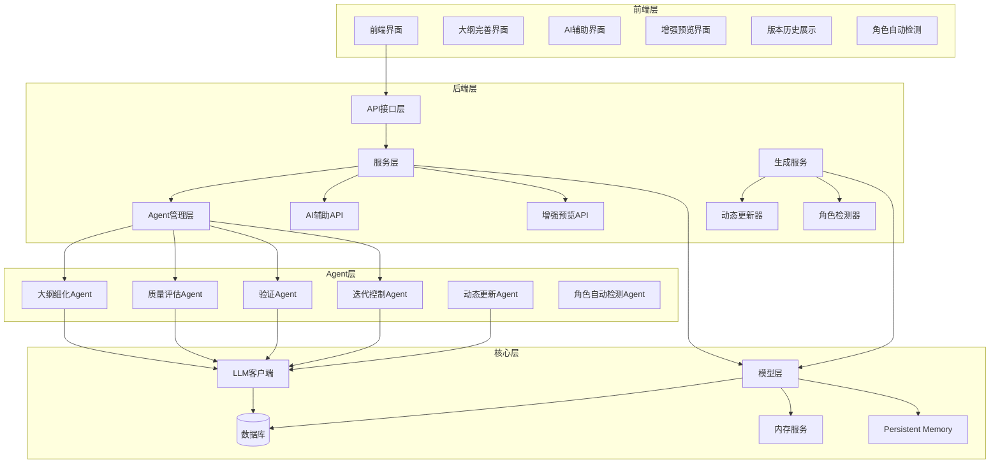

**图表来源**
- [agents/__init__.py:1-46](file://agents/__init__.py#L1-L46)
- [backend/api/v1/outlines.py:37](file://backend/api/v1/outlines.py#L37)
- [backend/services/generation_service.py:1225-1332](file://backend/services/generation_service.py#L1225-L1332)

**章节来源**
- [agents/__init__.py:1-46](file://agents/__init__.py#L1-L46)
- [backend/api/v1/outlines.py:37](file://backend/api/v1/outlines.py#L37)

## 核心组件

### 大纲细化Agent (OutlineRefiner)

大纲细化Agent是系统的核心组件之一，负责将基础的世界设定转化为完整的小说大纲。它具备以下核心功能：

- **完整大纲生成**：基于世界观设定生成包含主线、支线、卷级大纲的完整故事框架
- **详细主线剧情**：生成包含起承转合的详细主线剧情
- **卷级大纲设计**：生成带张力循环的卷级大纲
- **结局连贯性检查**：确保故事结局的逻辑一致性

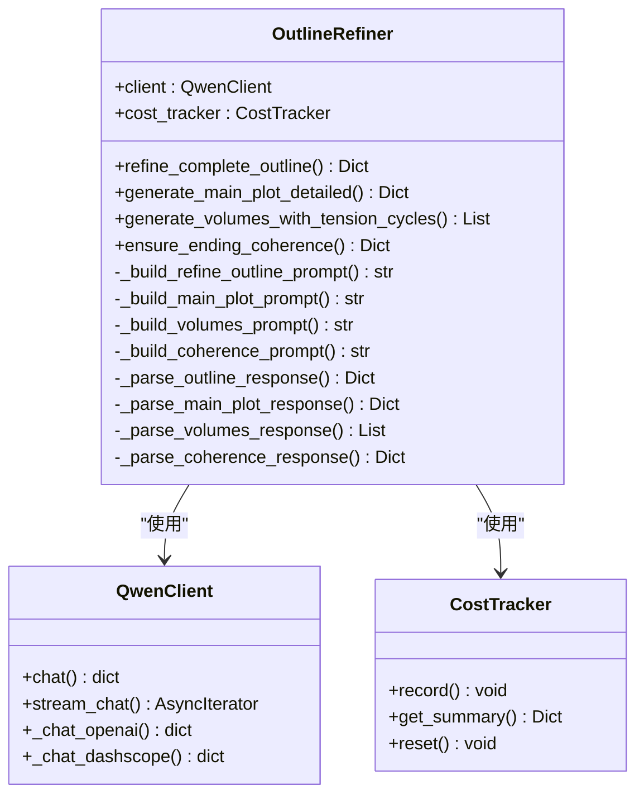

**图表来源**
- [agents/outline_refiner.py:18-705](file://agents/outline_refiner.py#L18-L705)
- [llm/qwen_client.py:16-243](file://llm/qwen_client.py#L16-L243)

### 大纲质量评估器 (OutlineQualityEvaluator)

质量评估器负责对大纲进行全面的质量评估，提供多维度的评分和改进建议：

- **结构完整性评估**：检查大纲结构的完整性和合理性
- **世界观一致性评估**：验证大纲与设定的一致性
- **角色连贯性评估**：检查角色发展的合理性
- **张力节奏评估**：评估故事节奏和张力控制
- **逻辑连贯性评估**：检查故事逻辑的合理性
- **创意新颖性评估**：评估故事的独特性和创新性

**章节来源**
- [agents/outline_quality_evaluator.py:93-440](file://agents/outline_quality_evaluator.py#L93-L440)

### 大纲验证器 (OutlineValidator)

验证器负责检查章节与大纲的一致性，确保创作过程中的质量控制：

- **章节一致性验证**：检查章节计划与大纲要求的一致性
- **角色一致性检查**：验证章节中的角色行为一致性
- **剧情连贯性检查**：确保章节间的剧情连贯性
- **世界观一致性检查**：验证章节内容与世界观设定的一致性
- **改进建议生成**：基于验证结果生成具体的改进建议

**章节来源**
- [agents/outline_validator.py:19-832](file://agents/outline_validator.py#L19-L832)

### 迭代控制器 (OutlineIterationController)

迭代控制器管理大纲完善过程中的迭代优化，确保系统能够自动识别问题并持续改进：

- **阈值控制**：设置质量和一致性的评估阈值
- **迭代决策**：根据评估结果决定是否继续迭代
- **成本控制**：监控和控制迭代过程中的成本消耗
- **历史记录**：记录每次迭代的结果和改进情况

**章节来源**
- [agents/outline_iteration_controller.py:39-404](file://agents/outline_iteration_controller.py#L39-L404)

### 动态大纲更新器 (OutlineDynamicUpdater)

动态大纲更新器是系统的核心维护组件，负责基于实际创作进度自动调整后续大纲规划：

- **偏差分析**：分析最近N章内容与大纲计划的偏差，计算加权评分
- **更新决策**：根据偏差评分和阈值判断是否需要更新
- **智能调整**：生成更新方案，仅修改未写章节的内容
- **版本管理**：自动更新大纲版本号和维护更新历史

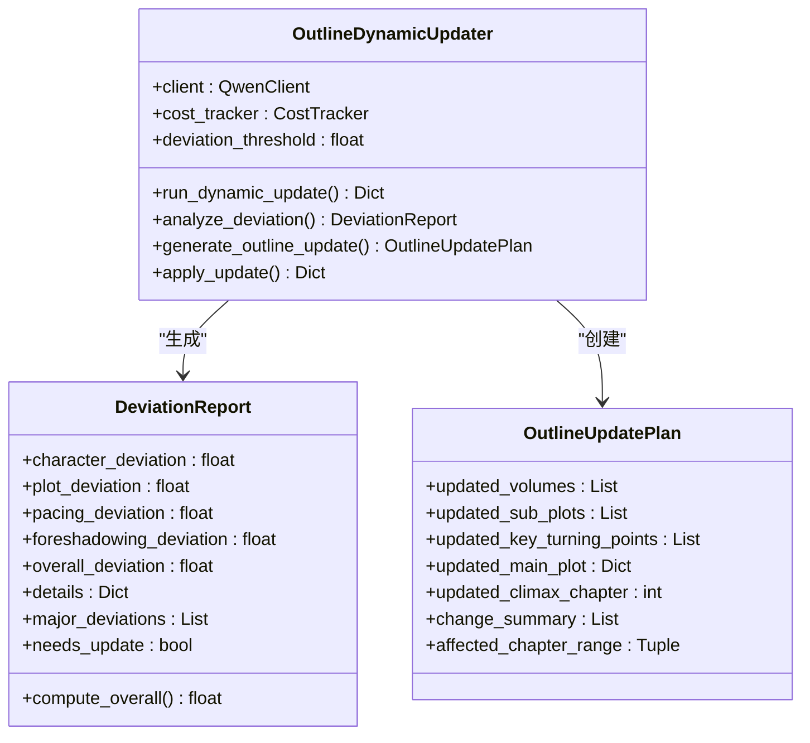

**图表来源**
- [agents/outline_dynamic_updater.py:25-60](file://agents/outline_dynamic_updater.py#L25-L60)
- [agents/outline_dynamic_updater.py:62-195](file://agents/outline_dynamic_updater.py#L62-L195)

**章节来源**
- [agents/outline_dynamic_updater.py:25-60](file://agents/outline_dynamic_updater.py#L25-L60)
- [agents/outline_dynamic_updater.py:62-195](file://agents/outline_dynamic_updater.py#L62-L195)

## 架构概览

系统采用分层架构设计，实现了前后端分离和模块化管理：

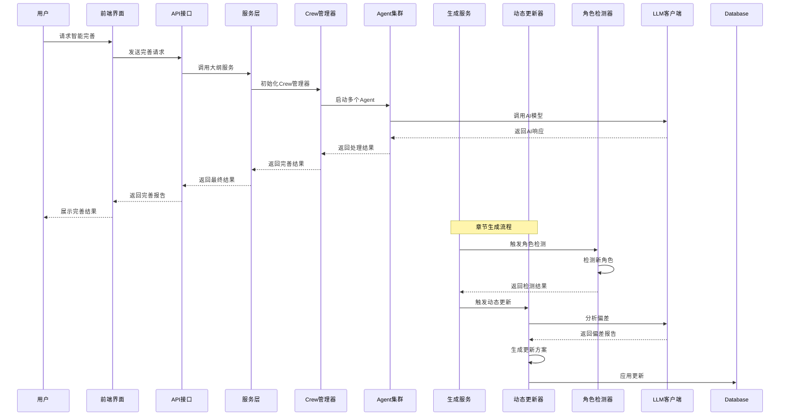

**图表来源**
- [backend/api/v1/outlines.py:517-607](file://backend/api/v1/outlines.py#L517-L607)
- [backend/dependencies/agents.py:12-106](file://backend/dependencies/agents.py#L12-L106)
- [backend/services/generation_service.py:1225-1332](file://backend/services/generation_service.py#L1225-L1332)

系统的核心数据流包括：

1. **用户输入**：通过前端界面提交大纲完善请求
2. **服务处理**：后端服务层接收请求并协调各Agent
3. **Agent协作**：多个专业Agent协同完成大纲完善任务
4. **LLM交互**：Agent通过LLM客户端调用AI模型
5. **结果输出**：生成完善后的大纲和质量报告
6. **动态维护**：生成服务定期检查创作进度并自动更新大纲
7. **角色检测**：章节生成后自动检测新角色并注册到角色库

## 详细组件分析

### Agent依赖管理系统

系统通过依赖注入容器管理Agent的生命周期和依赖关系：

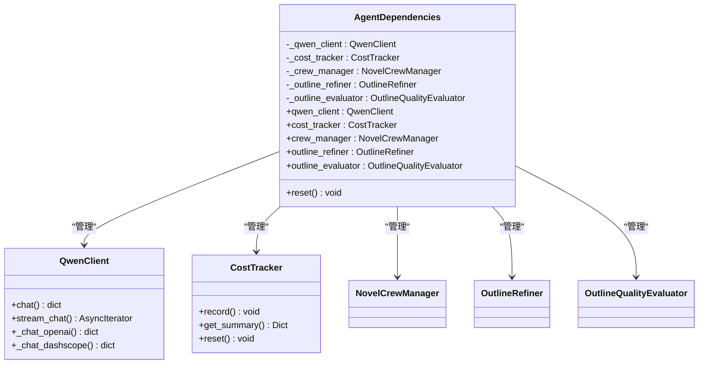

**图表来源**
- [backend/dependencies/agents.py:12-106](file://backend/dependencies/agents.py#L12-L106)

### 大纲服务层

服务层负责处理业务逻辑和数据持久化：

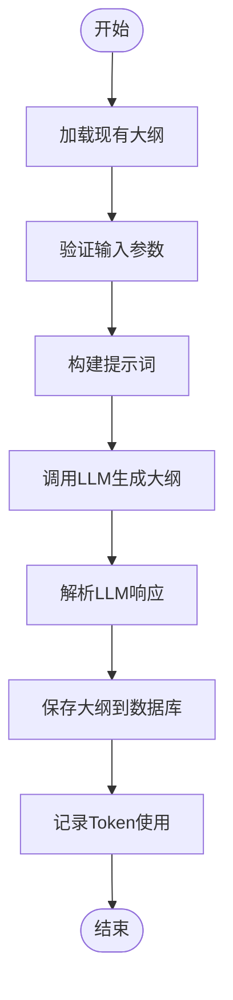

**图表来源**
- [backend/services/outline_service.py:44-114](file://backend/services/outline_service.py#L44-L114)

**章节来源**
- [backend/services/outline_service.py:28-742](file://backend/services/outline_service.py#L28-L742)

### 前端交互界面

前端提供了直观的大纲完善界面，支持智能完善功能：

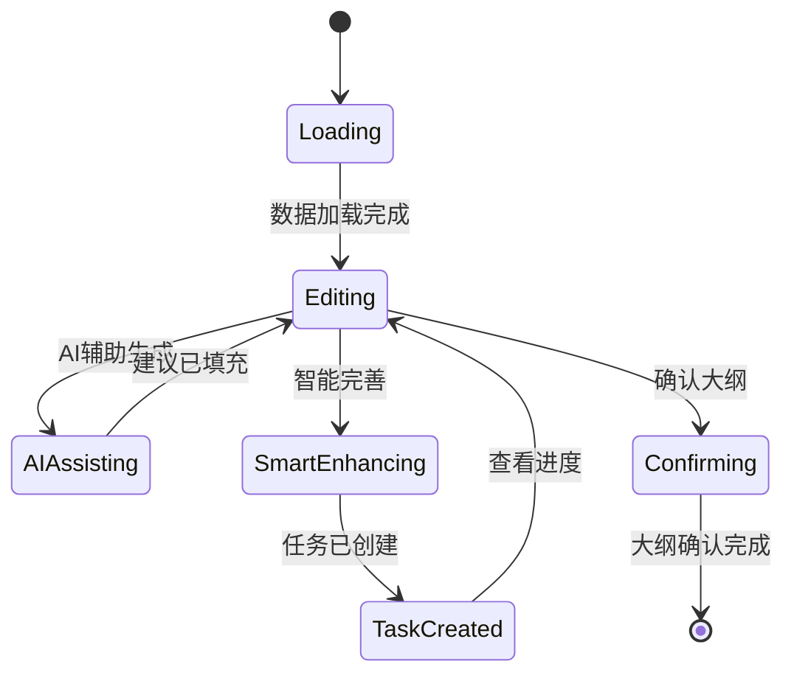

**图表来源**
- [frontend/src/pages/NovelDetail/OutlineRefinementTab.tsx:57-403](file://frontend/src/pages/NovelDetail/OutlineRefinementTab.tsx#L57-L403)

**章节来源**
- [frontend/src/pages/NovelDetail/OutlineRefinementTab.tsx:57-403](file://frontend/src/pages/NovelDetail/OutlineRefinementTab.tsx#L57-L403)

## 动态大纲更新功能

### 权重评分机制

动态更新器采用多维度加权评分机制来评估大纲偏差：

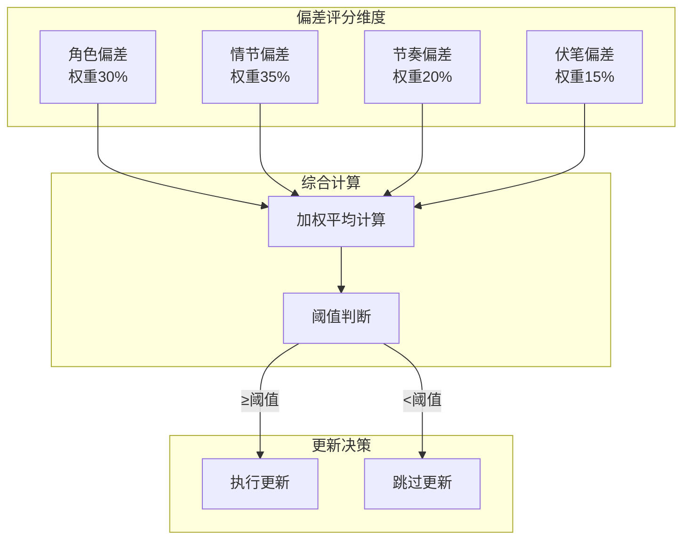

**图表来源**
- [agents/outline_dynamic_updater.py:38-46](file://agents/outline_dynamic_updater.py#L38-L46)

### 更新流程管理

系统通过生成服务定期检查创作进度并自动触发动态更新：

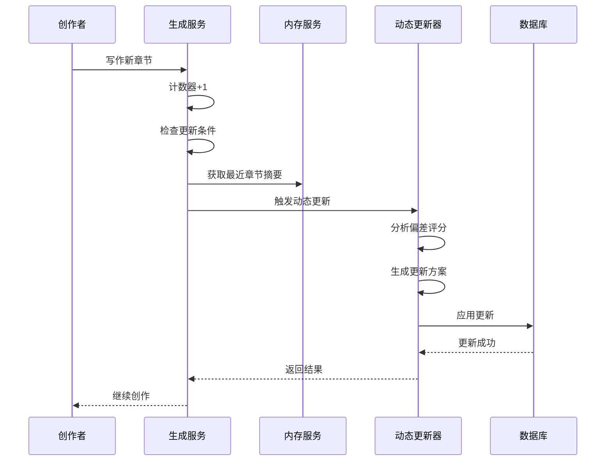

**图表来源**
- [backend/services/generation_service.py:1225-1332](file://backend/services/generation_service.py#L1225-L1332)
- [agents/outline_dynamic_updater.py:82-195](file://agents/outline_dynamic_updater.py#L82-L195)

### 配置管理

系统提供灵活的配置选项来控制动态更新行为：

- **更新间隔**：每N章触发一次偏差评估（默认3章）
- **偏差阈值**：综合偏差评分超过阈值才执行更新（默认6.0分）
- **功能开关**：可启用或禁用动态更新功能
- **成本控制**：通过配置限制更新频率和LLM调用

**章节来源**
- [backend/config.py:129-133](file://backend/config.py#L129-L133)

### 数据库模型更新

为了支持动态更新功能，数据库模型增加了版本管理和历史记录字段：

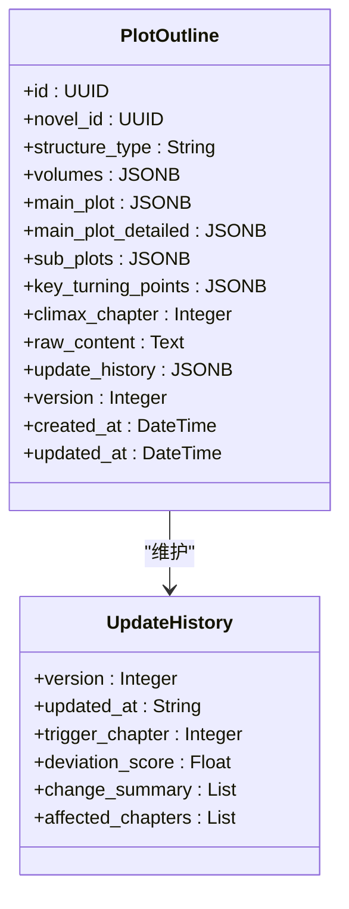

**图表来源**
- [core/models/plot_outline.py:95-108](file://core/models/plot_outline.py#L95-L108)

**章节来源**
- [core/models/plot_outline.py:95-108](file://core/models/plot_outline.py#L95-L108)
- [alembic/versions/fb6eed83562e_add_outline_dynamic_update_fields.py:21-36](file://alembic/versions/fb6eed83562e_add_outline_dynamic_update_fields.py#L21-L36)

### 前端版本历史展示

前端界面提供了直观的版本历史展示功能：

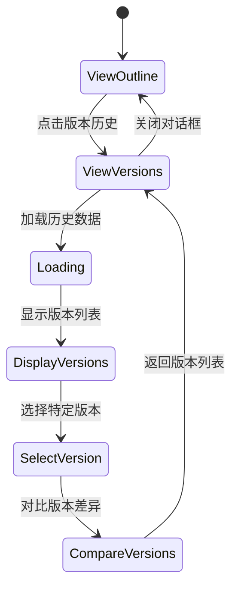

**图表来源**
- [frontend/src/pages/NovelDetail/PlotOutlineTab.tsx:191-236](file://frontend/src/pages/NovelDetail/PlotOutlineTab.tsx#L191-L236)

**章节来源**
- [frontend/src/pages/NovelDetail/PlotOutlineTab.tsx:191-236](file://frontend/src/pages/NovelDetail/PlotOutlineTab.tsx#L191-L236)

## AI辅助大纲字段生动生成功能

### AI辅助API接口

系统新增了专门的AI辅助API，用于为大纲的各个字段提供智能建议：

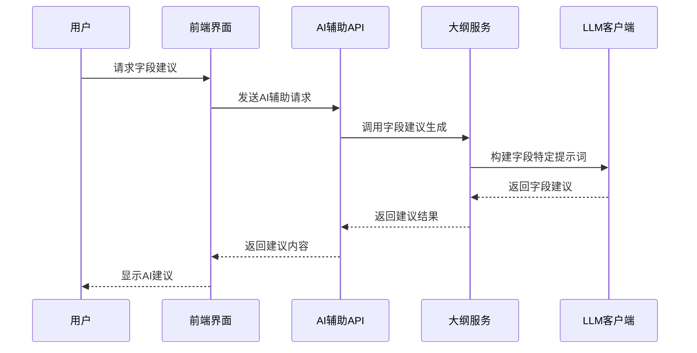

**图表来源**
- [backend/api/v1/outlines.py:475-558](file://backend/api/v1/outlines.py#L475-L558)
- [backend/services/outline_service.py:674-842](file://backend/services/outline_service.py#L674-L842)

### 字段建议生成器

AI辅助功能通过专门的服务类实现，支持多种字段类型的智能建议：

- **结构类型建议**：根据小说类型和目标字数推荐合适的故事结构
- **卷级大纲建议**：根据故事结构和章节数设计卷级划分方案
- **主线剧情建议**：根据世界观和角色构思主线剧情框架
- **支线剧情建议**：根据主线剧情和角色关系设计支线剧情
- **关键转折点建议**：根据剧情发展设计关键转折点
- **高潮章节建议**：根据故事结构推荐高潮章节位置

**章节来源**
- [backend/services/outline_service.py:674-842](file://backend/services/outline_service.py#L674-L842)

### 前端AI辅助界面

前端界面提供了直观的AI辅助功能，支持单个字段的智能完善：

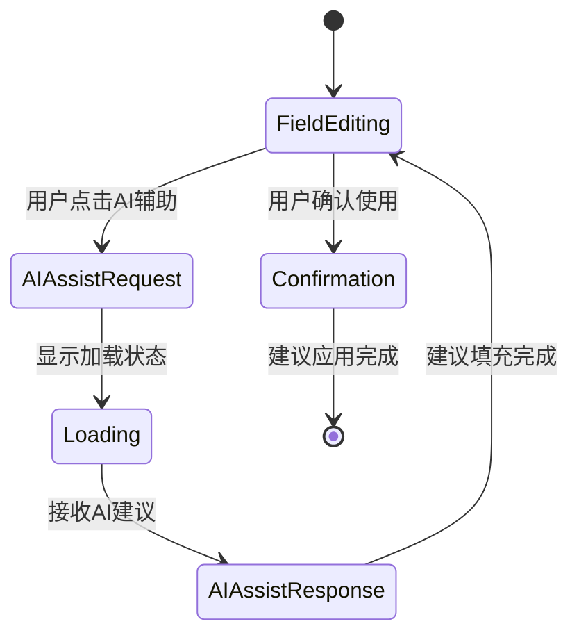

**图表来源**
- [frontend/src/pages/NovelDetail/OutlineRefinementTab.tsx:113-152](file://frontend/src/pages/NovelDetail/OutlineRefinementTab.tsx#L113-L152)

**章节来源**
- [frontend/src/pages/NovelDetail/OutlineRefinementTab.tsx:113-152](file://frontend/src/pages/NovelDetail/OutlineRefinementTab.tsx#L113-L152)

### AI辅助请求和响应模型

系统定义了专门的Pydantic模型来处理AI辅助功能的请求和响应：

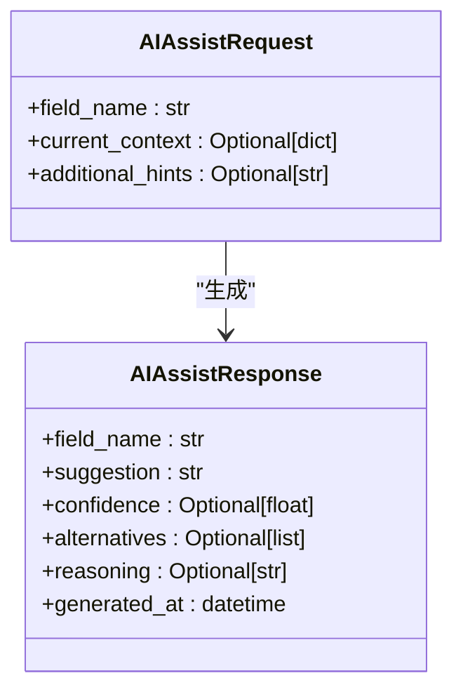

**图表来源**
- [backend/schemas/outline.py:342-377](file://backend/schemas/outline.py#L342-L377)

**章节来源**
- [backend/schemas/outline.py:342-377](file://backend/schemas/outline.py#L342-L377)

## 角色自动检测功能

### 自动检测机制

系统新增了角色自动检测功能，能够在章节生成过程中自动识别新出现的角色：

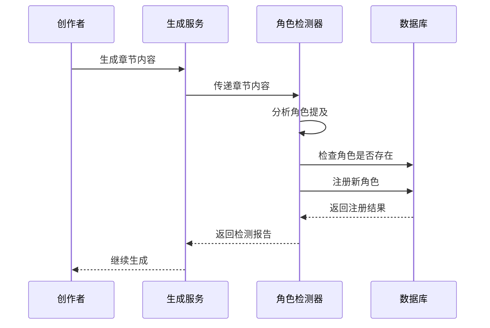

**图表来源**
- [backend/services/generation_service.py:1428-1450](file://backend/services/generation_service.py#L1428-L1450)

### 检测算法

角色检测器使用多层过滤机制来确保检测准确性：

- **置信度阈值**：只有当检测置信度高于阈值时才注册新角色
- **内容长度限制**：限制传入LLM的角色检测内容长度
- **重复检测防护**：避免重复注册相同角色
- **角色类型过滤**：区分主要角色、次要角色和临时角色

**章节来源**
- [backend/config.py:287-292](file://backend/config.py#L287-L292)

### 前端角色管理

前端界面提供了角色自动检测的反馈机制：

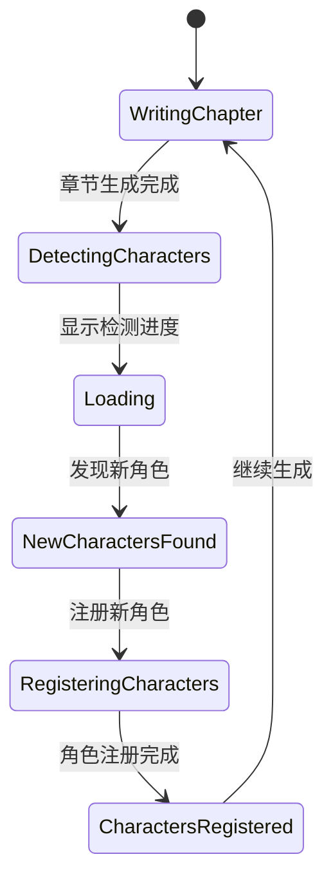

**图表来源**
- [frontend/src/pages/NovelDetail/OutlineRefinementTab.tsx:418-487](file://frontend/src/pages/NovelDetail/OutlineRefinementTab.tsx#L418-L487)

**章节来源**
- [frontend/src/pages/NovelDetail/OutlineRefinementTab.tsx:418-487](file://frontend/src/pages/NovelDetail/OutlineRefinementTab.tsx#L418-L487)

## 依赖关系分析

系统采用松耦合的设计，通过接口和依赖注入实现模块间的解耦：

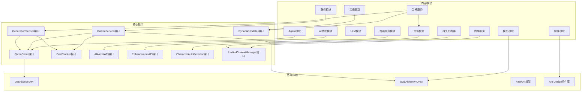

**图表来源**
- [llm/qwen_client.py:16-243](file://llm/qwen_client.py#L16-L243)
- [backend/services/outline_service.py:28-742](file://backend/services/outline_service.py#L28-L742)
- [backend/services/generation_service.py:1225-1332](file://backend/services/generation_service.py#L1225-L1332)

**章节来源**
- [llm/qwen_client.py:16-243](file://llm/qwen_client.py#L16-L243)
- [backend/services/outline_service.py:28-742](file://backend/services/outline_service.py#L28-L742)

## 性能考虑

系统在设计时充分考虑了性能优化：

### LLM调用优化
- **异步调用**：所有LLM调用都采用异步模式，避免阻塞主线程
- **重试机制**：实现指数退避重试，提高调用成功率
- **超时控制**：为复杂的LLM调用设置合理的超时时间
- **流式输出**：支持流式输出，提升用户体验

### 缓存策略
- **依赖缓存**：使用LRU缓存管理Agent依赖实例
- **结果缓存**：对频繁访问的数据进行缓存
- **数据库连接池**：优化数据库连接管理
- **上下文缓存**：使用统一上下文管理器缓存章节摘要

### 成本控制
- **Token追踪**：实时追踪LLM调用的Token使用量
- **成本预算**：支持设置成本上限，防止过度消费
- **智能调度**：根据成本和质量指标智能调度Agent
- **更新频率控制**：通过配置限制动态更新的触发频率

### 动态更新优化
- **批量处理**：定期批量检查多个小说的更新需求
- **内存管理**：定期清理过期的计数器和活跃时间记录
- **数据库优化**：使用异步数据库操作避免阻塞
- **角色检测优化**：限制角色检测的内容长度，避免LLM调用过载

### 字段级合并优化
- **增量更新**：只合并非空字段，避免覆盖已有数据
- **JSON解析优化**：智能处理JSON字符串和字典格式
- **性能监控**：监控字段合并操作的性能影响

## 故障排除指南

### 常见问题及解决方案

**LLM调用失败**
- 检查API密钥配置
- 验证网络连接状态
- 查看重试日志和错误信息
- 调整超时参数

**数据库连接问题**
- 检查数据库配置参数
- 验证数据库服务状态
- 查看连接池配置
- 检查权限设置

**Agent初始化失败**
- 检查依赖注入配置
- 验证Agent类的正确性
- 查看导入路径问题
- 检查模块依赖关系

**前端界面异常**
- 检查API接口状态
- 验证数据格式
- 查看浏览器控制台错误
- 检查网络请求状态

**AI辅助功能异常**
- 检查AI辅助API端点状态
- 验证字段名称的有效性
- 查看上下文数据格式
- 检查LLM客户端配置

**动态更新功能异常**
- 检查配置参数设置
- 验证章节摘要数据格式
- 查看更新历史记录
- 检查数据库字段完整性

**角色检测功能异常**
- 检查角色检测配置
- 验证章节内容格式
- 查看检测日志
- 检查角色注册状态

**字段级合并异常**
- 检查合并配置参数
- 验证字段数据格式
- 查看合并日志
- 检查数据库字段类型

**章节来源**
- [llm/qwen_client.py:76-172](file://llm/qwen_client.py#L76-L172)
- [backend/dependencies/agents.py:66-72](file://backend/dependencies/agents.py#L66-L72)
- [backend/services/generation_service.py:1327-1328](file://backend/services/generation_service.py#L1327-L1328)

## 结论

智能大纲完善系统通过专业的Agent协作机制，为小说创作提供了全面的大纲支持。系统的主要优势包括：

1. **专业性强**：多个专业Agent分工协作，每个Agent专注于特定领域
2. **智能化程度高**：基于AI技术实现自动化的大纲生成和优化
3. **动态维护能力强**：新增的动态更新功能能够自动跟踪创作进度并调整大纲规划
4. **角色管理智能化**：新增的角色自动检测功能能够自动识别和管理新角色
5. **用户体验好**：提供直观的界面和丰富的功能
6. **可扩展性好**：模块化设计便于功能扩展和维护
7. **成本控制**：内置成本追踪和控制机制
8. **版本管理**：支持完整的大纲版本历史记录和对比
9. **性能优化**：多项性能优化措施确保系统高效运行

该系统特别适合需要高质量大纲支撑的小说创作项目，能够显著提升创作效率和作品质量。通过持续的迭代优化，系统将在未来支持更多的创作场景和需求。

**更新** 新增动态大纲更新功能，基于权重评分机制提供智能的大纲维护能力，支持自动跟踪创作进度并调整后续章节规划；增强了AI辅助功能，支持角色信息处理和小说上下文生成；新增角色自动检测功能，提升创作过程中的角色管理能力；改进了字段级合并机制，优化大纲完善性能。