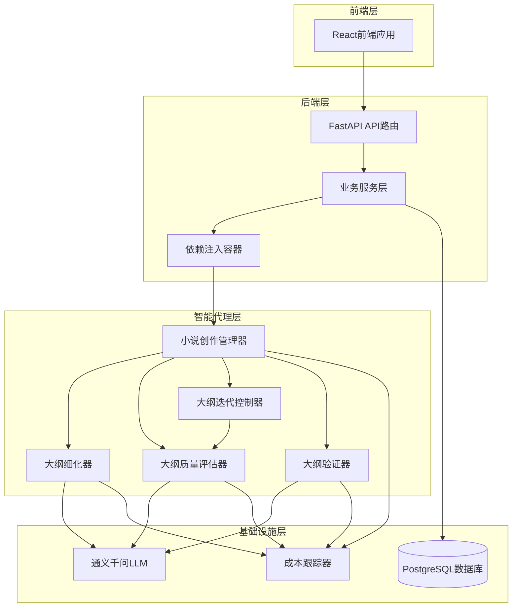
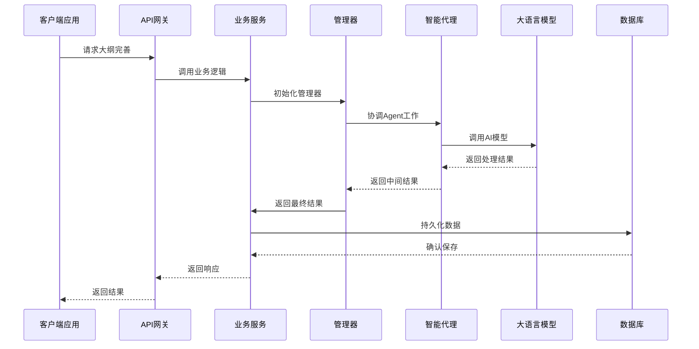
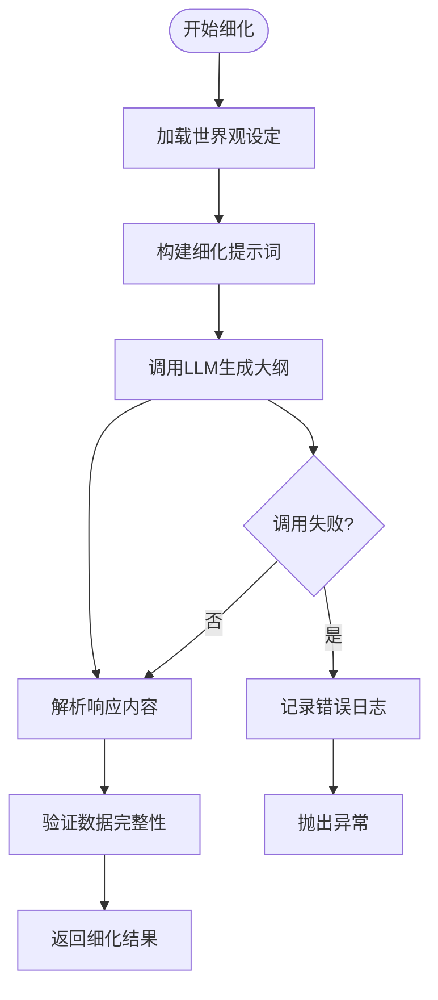
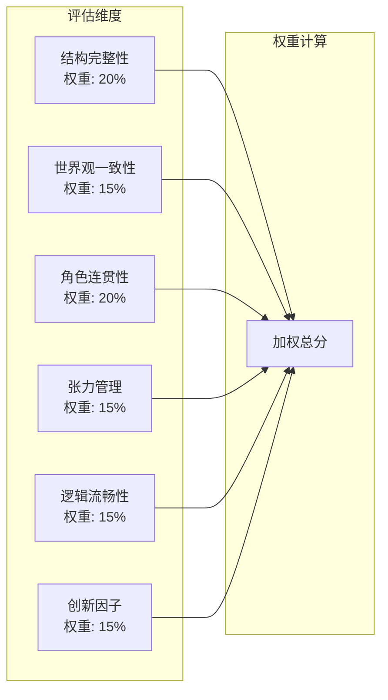
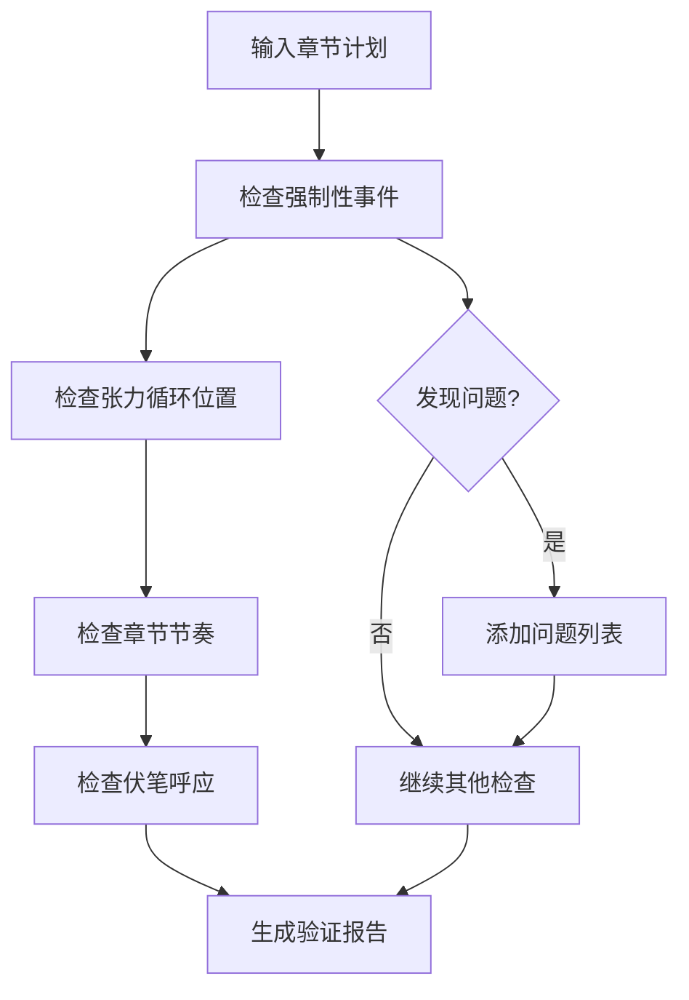
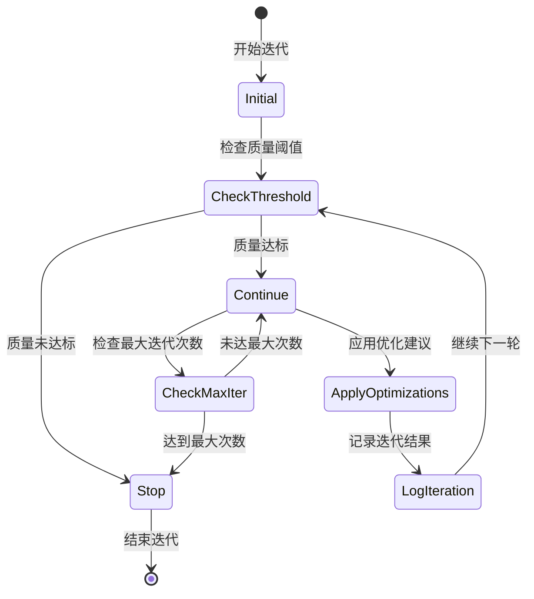
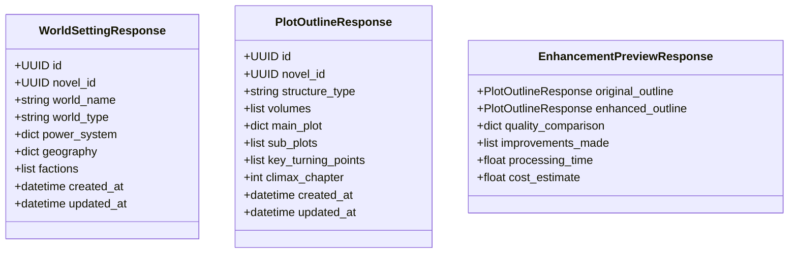
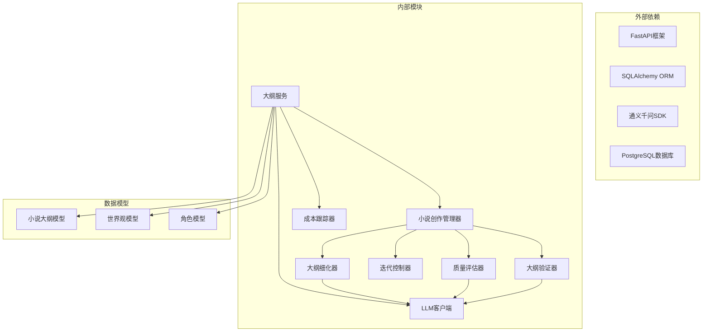

# 智能大纲完善系统

<cite>
**本文档引用的文件**
- [agents/__init__.py](file://agents/__init__.py)
- [agents/outline_refiner.py](file://agents/outline_refiner.py)
- [agents/outline_validator.py](file://agents/outline_validator.py)
- [agents/outline_iteration_controller.py](file://agents/outline_iteration_controller.py)
- [agents/outline_quality_evaluator.py](file://agents/outline_quality_evaluator.py)
- [agents/crew_manager.py](file://agents/crew_manager.py)
- [backend/api/v1/outlines.py](file://backend/api/v1/outlines.py)
- [backend/services/outline_service.py](file://backend/services/outline_service.py)
- [backend/dependencies/agents.py](file://backend/dependencies/agents.py)
- [backend/schemas/outline.py](file://backend/schemas/outline.py)
- [core/models/plot_outline.py](file://core/models/plot_outline.py)
- [llm/qwen_client.py](file://llm/qwen_client.py)
- [scripts/demo_outline_enhancement.py](file://scripts/demo_outline_enhancement.py)
</cite>

## 目录
1. [系统概述](#系统概述)
2. [项目结构](#项目结构)
3. [核心组件](#核心组件)
4. [架构概览](#架构概览)
5. [详细组件分析](#详细组件分析)
6. [依赖关系分析](#依赖关系分析)
7. [性能考虑](#性能考虑)
8. [故障排除指南](#故障排除指南)
9. [结论](#结论)

## 系统概述

智能大纲完善系统是一个基于人工智能的自动化小说创作辅助平台，专注于为用户提供智能化的大纲生成、完善和优化服务。该系统采用多Agent协作架构，结合先进的大语言模型技术，能够自动分析和改善小说大纲的质量。

### 主要功能特性

- **智能大纲生成**：基于用户输入的世界观设定、类型标签等信息，自动生成完整的小说大纲
- **大纲质量评估**：提供多维度的质量评分和改进建议
- **智能完善优化**：通过迭代控制机制持续优化大纲质量
- **一致性检查**：确保大纲与世界观设定、角色设定的一致性
- **API接口服务**：提供完整的RESTful API接口供前端应用调用

### 技术架构特色

- **多Agent协作**：采用CrewAI风格的Agent编排模式，实现专业化分工
- **成本控制**：内置Token使用跟踪和成本控制机制
- **版本管理**：支持大纲版本历史管理和对比
- **扩展性强**：模块化设计，便于功能扩展和维护

## 项目结构

该项目采用清晰的分层架构设计，主要包含以下几个核心层次：

**图表来源**
- [backend/api/v1/outlines.py:1-670](file://backend/api/v1/outlines.py#L1-670)
- [agents/crew_manager.py:1-800](file://agents/crew_manager.py#L1-800)
- [backend/dependencies/agents.py:1-106](file://backend/dependencies/agents.py#L1-106)

**章节来源**
- [backend/api/v1/outlines.py:1-670](file://backend/api/v1/outlines.py#L1-670)
- [agents/crew_manager.py:1-800](file://agents/crew_manager.py#L1-800)
- [backend/dependencies/agents.py:1-106](file://backend/dependencies/agents.py#L1-106)

## 核心组件

### 1. 智能代理系统

系统的核心是基于CrewAI风格的多Agent协作架构，包含以下关键Agent：

#### 大纲细化器 (OutlineRefiner)
负责将基础的世界观设定转化为完整的小说大纲，支持多种输出格式和结构类型。

#### 大纲质量评估器 (OutlineQualityEvaluator)
提供全面的大纲质量评估，包含结构完整性、世界观一致性、角色连贯性等多个维度。

#### 大纲验证器 (OutlineValidator)
检查章节与大纲的一致性，确保内容符合既定的创作规范。

#### 大纲迭代控制器 (OutlineIterationController)
管理大纲完善过程中的迭代优化，确保达到预设的质量标准。

### 2. 业务服务层

#### 大纲服务 (OutlineService)
提供完整的业务逻辑处理，包括大纲生成、分解、验证等功能。

#### API路由 (FastAPI)
提供RESTful API接口，支持前端应用的各种操作需求。

### 3. 数据模型层

#### 小说大纲模型 (PlotOutline)
定义小说大纲的数据结构，支持JSONB格式存储复杂的大纲信息。

### 4. 基础设施层

#### LLM客户端 (QwenClient)
封装通义千问API调用，支持重试机制和流式输出。

#### 成本跟踪器 (CostTracker)
监控和统计大语言模型调用的成本使用情况。

**章节来源**
- [agents/outline_refiner.py:1-705](file://agents/outline_refiner.py#L1-705)
- [agents/outline_quality_evaluator.py:1-440](file://agents/outline_quality_evaluator.py#L1-440)
- [agents/outline_validator.py:1-800](file://agents/outline_validator.py#L1-800)
- [agents/outline_iteration_controller.py:1-404](file://agents/outline_iteration_controller.py#L1-404)
- [backend/services/outline_service.py:1-742](file://backend/services/outline_service.py#L1-742)
- [core/models/plot_outline.py:1-43](file://core/models/plot_outline.py#L1-43)
- [llm/qwen_client.py:1-243](file://llm/qwen_client.py#L1-243)

## 架构概览

系统采用分层架构设计，确保各层职责清晰、耦合度低：

**图表来源**
- [agents/crew_manager.py:422-695](file://agents/crew_manager.py#L422-695)
- [backend/api/v1/outlines.py:517-603](file://backend/api/v1/outlines.py#L517-603)
- [backend/services/outline_service.py:44-114](file://backend/services/outline_service.py#L44-114)

### 数据流分析

系统的核心数据流包括：

1. **输入数据流**：用户输入的世界观设定、类型标签等信息
2. **处理数据流**：多Agent协作处理，生成和优化大纲
3. **输出数据流**：最终的大纲结果和相关报告
4. **持久化数据流**：将结果保存到数据库中

**章节来源**
- [agents/crew_manager.py:422-695](file://agents/crew_manager.py#L422-695)
- [backend/api/v1/outlines.py:517-603](file://backend/api/v1/outlines.py#L517-603)

## 详细组件分析

### 大纲细化器 (OutlineRefiner)

OutlineRefiner是系统的核心组件之一，负责将基础的世界观设定转化为完整的小说大纲。

#### 主要功能

**图表来源**
- [agents/outline_refiner.py:31-84](file://agents/outline_refiner.py#L31-84)

#### 核心方法分析

| 方法名 | 功能描述 | 输入参数 | 返回值 |
|--------|----------|----------|--------|
| refine_complete_outline | 细化完整大纲 | world_setting_data, genre, tags, total_chapters | 完整大纲数据 |
| generate_main_plot_detailed | 生成详细主线剧情 | world_setting_data | 主线剧情数据 |
| generate_volumes_with_tension_cycles | 生成带张力循环的卷大纲 | genre, total_chapters, main_plot | 卷大纲列表 |
| ensure_ending_coherence | 确保结局连贯性 | main_plot, volumes | 连贯性检查报告 |

#### 提示词构建策略

系统采用模板化的提示词构建策略，根据不同场景生成针对性的提示：

- **大纲细化提示词**：包含结构类型、章节范围、张力循环等要素
- **主线剧情提示词**：强调三幕式结构和角色发展弧线
- **卷大纲提示词**：关注章节分配和冲突层次设计
- **连贯性检查提示词**：验证逻辑一致性和角色完整性

**章节来源**
- [agents/outline_refiner.py:18-705](file://agents/outline_refiner.py#L18-705)

### 大纲质量评估器 (OutlineQualityEvaluator)

OutlineQualityEvaluator提供全面的大纲质量评估功能，采用多维度评分体系：

#### 评估维度设计

**图表来源**
- [agents/outline_quality_evaluator.py:11-73](file://agents/outline_quality_evaluator.py#L11-73)

#### 评分算法

评估器采用加权平均算法计算综合评分：

1. **维度评分**：对每个评估维度独立评分（1-10分）
2. **权重分配**：根据维度重要性分配权重
3. **综合计算**：加权求和得到最终评分
4. **结果分析**：识别优势和劣势维度

#### 改进建议生成

基于评估结果自动生成针对性的改进建议：

- **低分维度建议**：针对评分较低的维度提供具体改进方向
- **内容分析建议**：基于大纲具体内容提供优化建议
- **优先级排序**：区分建议的重要性和紧急程度

**章节来源**
- [agents/outline_quality_evaluator.py:93-440](file://agents/outline_quality_evaluator.py#L93-440)

### 大纲验证器 (OutlineValidator)

OutlineValidator负责检查章节内容与大纲设定的一致性，确保创作质量：

#### 验证类型

| 验证类型 | 检查内容 | 重要性 |
|----------|----------|--------|
| 章节一致性 | 章节计划与大纲要求的匹配度 | 高 |
| 角色一致性 | 角色行为、性格、能力的一致性 | 高 |
| 剧情连贯性 | 章节间剧情逻辑的连贯性 | 中 |
| 世界观一致性 | 内容与世界观设定的符合度 | 高 |

#### 检查机制

**图表来源**
- [agents/outline_validator.py:32-77](file://agents/outline_validator.py#L32-77)

#### 评分标准

验证器采用多维度评分标准：

- **完成率评分**：基于强制性事件完成度计算
- **质量评分**：综合考虑情节设计、角色塑造等因素
- **一致性评分**：评估与大纲设定的符合程度

**章节来源**
- [agents/outline_validator.py:19-800](file://agents/outline_validator.py#L19-800)

### 大纲迭代控制器 (OutlineIterationController)

OutlineIterationController管理大纲完善过程中的迭代优化，确保达到预设的质量标准：

#### 迭代控制策略

**图表来源**
- [agents/outline_iteration_controller.py:68-124](file://agents/outline_iteration_controller.py#L68-124)

#### 控制参数

| 参数名称 | 默认值 | 说明 |
|----------|--------|------|
| quality_threshold | 8.0 | 质量评分阈值 |
| consistency_threshold | 8.5 | 一致性评分阈值 |
| max_iterations | 3 | 最大迭代次数 |
| cost_limit | None | 成本上限（可选） |

#### 优化策略

控制器根据评估结果生成针对性的优化建议：

- **质量提升**：针对低分维度提供改进方向
- **一致性增强**：加强世界观元素融入
- **结构优化**：调整角色戏份分配

**章节来源**
- [agents/outline_iteration_controller.py:39-404](file://agents/outline_iteration_controller.py#L39-404)

### API接口设计

系统提供完整的RESTful API接口，支持前端应用的各种操作需求：

#### 核心API端点

| 端点 | 方法 | 功能描述 |
|------|------|----------|
| `/novels/{novel_id}/world-setting` | GET/PATCH | 获取和更新世界观设定 |
| `/novels/{novel_id}/outline` | GET/PATCH | 获取和更新小说大纲 |
| `/novels/{novel_id}/outline/generate` | POST | 生成完整大纲 |
| `/novels/{novel_id}/outline/decompose` | POST | 分解大纲为章节配置 |
| `/novels/{novel_id}/outline/enhance-preview` | POST | 大纲完善预览 |
| `/chapters/{chapter_number}/validate-outline` | POST | 验证章节大纲一致性 |

#### 数据模型

系统采用Pydantic模型定义API数据结构：

**图表来源**
- [backend/schemas/outline.py:9-340](file://backend/schemas/outline.py#L9-340)

**章节来源**
- [backend/api/v1/outlines.py:1-670](file://backend/api/v1/outlines.py#L1-670)
- [backend/schemas/outline.py:1-340](file://backend/schemas/outline.py#L1-340)

## 依赖关系分析

系统采用模块化设计，各组件之间的依赖关系清晰明确：

**图表来源**
- [agents/crew_manager.py:1-800](file://agents/crew_manager.py#L1-800)
- [backend/services/outline_service.py:1-742](file://backend/services/outline_service.py#L1-742)
- [llm/qwen_client.py:1-243](file://llm/qwen_client.py#L1-243)

### 模块耦合度分析

系统采用低耦合设计原则：

- **Agent间松耦合**：通过统一的接口进行通信
- **服务层独立**：业务逻辑与数据访问分离
- **API层抽象**：对外提供统一的接口契约
- **数据层标准化**：使用ORM模型统一数据访问

### 循环依赖防护

系统通过以下机制防止循环依赖：

1. **单向依赖**：所有依赖关系都是单向的
2. **接口隔离**：通过抽象接口隔离具体实现
3. **延迟导入**：使用字符串形式的类型注解
4. **模块重构**：定期检查和重构潜在的循环依赖

**章节来源**
- [agents/crew_manager.py:1-800](file://agents/crew_manager.py#L1-800)
- [backend/services/outline_service.py:1-742](file://backend/services/outline_service.py#L1-742)
- [backend/dependencies/agents.py:1-106](file://backend/dependencies/agents.py#L1-106)

## 性能考虑

系统在设计时充分考虑了性能优化需求：

### LLM调用优化

1. **成本控制**：内置Token使用跟踪，实时监控调用成本
2. **重试机制**：网络异常时自动重试，提高成功率
3. **超时配置**：针对复杂任务设置合理的超时时间
4. **流式输出**：支持流式响应，提升用户体验

### 数据库性能

1. **索引优化**：为常用查询字段建立索引
2. **批量操作**：支持批量数据处理
3. **连接池**：使用连接池管理数据库连接
4. **查询优化**：避免N+1查询问题

### 缓存策略

1. **结果缓存**：缓存常用的查询结果
2. **配置缓存**：缓存Agent配置信息
3. **依赖缓存**：使用LRU缓存管理依赖实例

### 并发处理

1. **异步处理**：大量使用async/await提升并发性能
2. **任务队列**：支持后台任务异步处理
3. **资源限制**：设置合理的资源使用上限

## 故障排除指南

### 常见问题及解决方案

#### LLM调用失败

**问题症状**：API调用返回错误或超时

**可能原因**：
- 网络连接不稳定
- API密钥配置错误
- 超时设置过短
- 服务器负载过高

**解决步骤**：
1. 检查网络连接状态
2. 验证API密钥配置
3. 调整超时参数
4. 查看服务器负载情况

#### 数据库连接问题

**问题症状**：数据库操作失败或连接超时

**可能原因**：
- 数据库服务不可用
- 连接池耗尽
- SQL语法错误
- 权限不足

**解决步骤**：
1. 检查数据库服务状态
2. 查看连接池使用情况
3. 验证SQL语句正确性
4. 检查用户权限配置

#### Agent执行异常

**问题症状**：智能代理执行失败或返回错误结果

**可能原因**：
- 提示词格式错误
- JSON解析失败
- 内存不足
- 依赖服务不可用

**解决步骤**：
1. 检查提示词格式
2. 验证JSON输出格式
3. 监控内存使用情况
4. 检查依赖服务状态

### 日志分析

系统提供了详细的日志记录机制：

#### 日志级别

| 日志级别 | 用途 | 示例 |
|----------|------|------|
| DEBUG | 详细调试信息 | Agent执行细节 |
| INFO | 一般信息 | 系统状态更新 |
| WARNING | 警告信息 | 可能的问题 |
| ERROR | 错误信息 | 异常和错误 |

#### 关键日志字段

- **Agent名称**：标识执行的Agent类型
- **处理时间**：操作耗时统计
- **Token消耗**：LLM调用成本
- **错误详情**：异常堆栈信息

**章节来源**
- [agents/outline_refiner.py:81-83](file://agents/outline_refiner.py#L81-83)
- [agents/outline_validator.py:74-76](file://agents/outline_validator.py#L74-76)
- [agents/outline_iteration_controller.py:110-116](file://agents/outline_iteration_controller.py#L110-116)

## 结论

智能大纲完善系统是一个功能完整、架构清晰的自动化小说创作辅助平台。系统采用先进的多Agent协作架构，结合专业的质量评估和优化机制，能够有效提升小说创作的质量和效率。

### 主要优势

1. **智能化程度高**：基于大语言模型的智能创作辅助
2. **功能完整性**：覆盖从大纲生成到完善的全流程
3. **扩展性强**：模块化设计便于功能扩展
4. **用户体验好**：提供直观的API接口和前端界面

### 技术亮点

1. **多Agent协作**：专业化分工，提升处理效率
2. **质量评估体系**：多维度评分，全面评估创作质量
3. **成本控制机制**：实时监控LLM调用成本
4. **版本管理**：支持大纲版本历史追踪

### 发展前景

系统具有良好的扩展性和发展潜力：

1. **功能扩展**：可增加更多类型的创作辅助功能
2. **性能优化**：持续优化LLM调用效率
3. **用户体验**：改进前端界面和交互体验
4. **生态建设**：构建完整的创作工具生态系统

通过持续的技术创新和功能完善，智能大纲完善系统将成为小说创作者的得力助手，为提升创作质量和效率做出重要贡献。