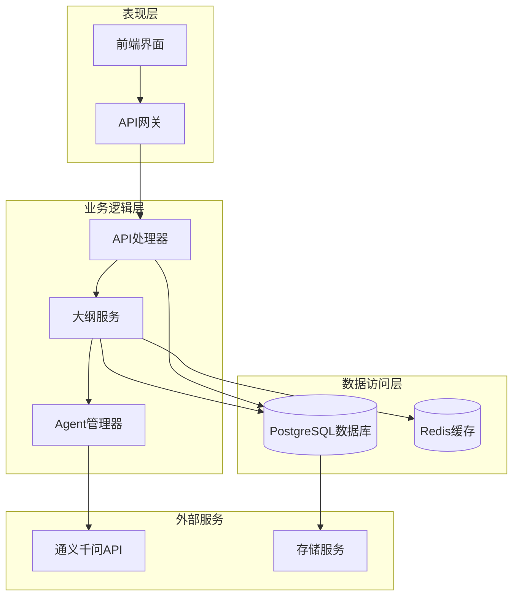
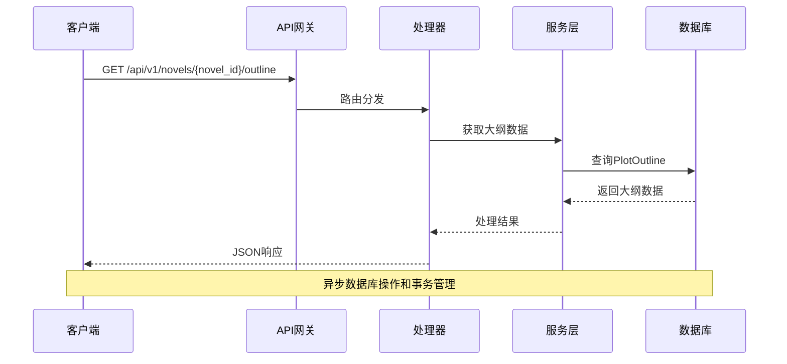
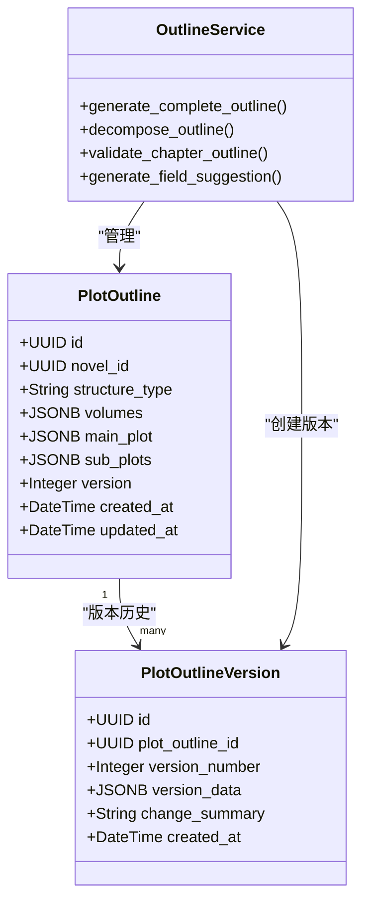
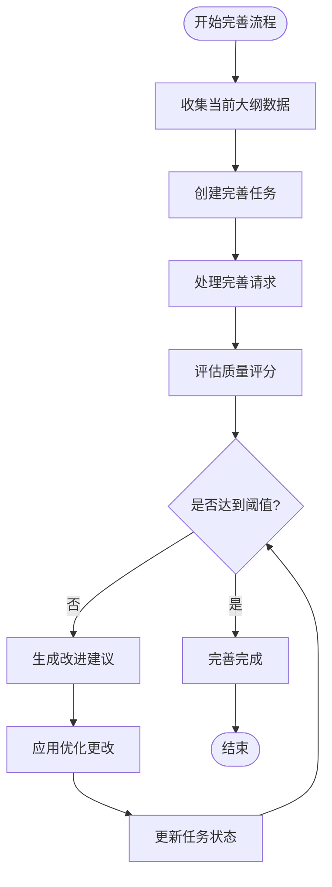
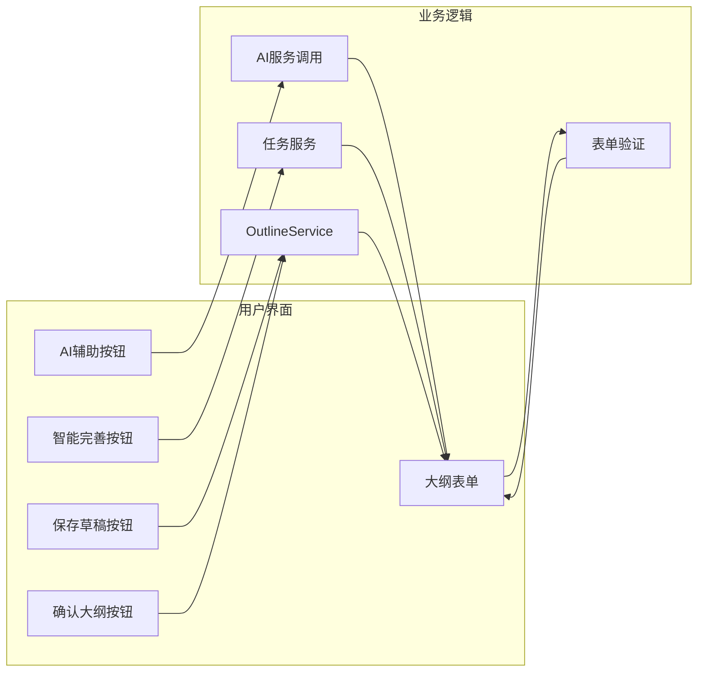
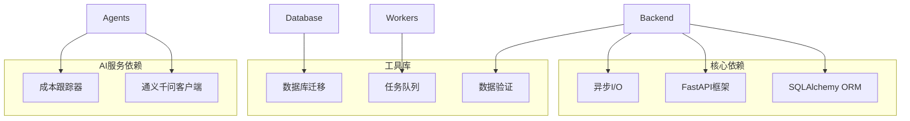

# 大纲版本控制系统

<cite>
**本文档引用的文件**
- [backend/main.py](file://backend/main.py)
- [backend/api/v1/outlines.py](file://backend/api/v1/outlines.py)
- [core/models/plot_outline.py](file://core/models/plot_outline.py)
- [core/models/plot_outline_version.py](file://core/models/plot_outline_version.py)
- [backend/services/outline_service.py](file://backend/services/outline_service.py)
- [agents/outline_refiner.py](file://agents/outline_refiner.py)
- [agents/outline_validator.py](file://agents/outline_validator.py)
- [agents/outline_quality_evaluator.py](file://agents/outline_quality_evaluator.py)
- [agents/outline_iteration_controller.py](file://agents/outline_iteration_controller.py)
- [frontend/src/pages/NovelDetail/OutlineRefinementTab.tsx](file://frontend/src/pages/NovelDetail/OutlineRefinementTab.tsx)
- [scripts/demo_outline_enhancement.py](file://scripts/demo_outline_enhancement.py)
- [core/database.py](file://core/database.py)
- [backend/config.py](file://backend/config.py)
</cite>

## 目录
1. [项目概述](#项目概述)
2. [系统架构](#系统架构)
3. [核心组件](#核心组件)
4. [架构概览](#架构概览)
5. [详细组件分析](#详细组件分析)
6. [依赖关系分析](#依赖关系分析)
7. [性能考虑](#性能考虑)
8. [故障排除指南](#故障排除指南)
9. [结论](#结论)

## 项目概述

大纲版本控制系统是一个基于AI驱动的小说创作平台，专注于提供完整的大纲管理和版本控制功能。该系统采用CrewAI风格的多Agent协作架构，结合先进的LLM技术，为用户提供智能化的大纲生成、完善、验证和版本管理服务。

### 核心功能特性

- **智能大纲生成**：基于世界观设定自动生成完整剧情大纲
- **版本管理**：完整的版本历史追踪和回滚机制
- **质量评估**：多维度的大纲质量评分和改进建议
- **一致性检查**：角色、剧情、世界观的全面一致性验证
- **协作完善**：基于多Agent机制的智能大纲完善流程
- **实时预览**：智能完善结果的实时预览功能

## 系统架构

系统采用分层架构设计，包含表现层、业务逻辑层、数据访问层和外部服务集成层。

**图表来源**
- [backend/main.py:62-90](file://backend/main.py#L62-L90)
- [backend/api/v1/outlines.py:46-46](file://backend/api/v1/outlines.py#L46-L46)
- [core/database.py:13-25](file://core/database.py#L13-L25)

## 核心组件

### 数据模型层

系统的核心数据模型围绕小说大纲管理构建，主要包括以下关键实体：

#### PlotOutline模型
负责存储小说的完整剧情大纲，支持复杂的JSONB结构存储。

#### PlotOutlineVersion模型  
维护大纲的版本历史，支持版本对比和回滚功能。

#### Chapter模型
存储章节信息，与大纲建立关联关系。

**章节来源**
- [core/models/plot_outline.py:13-134](file://core/models/plot_outline.py#L13-L134)
- [core/models/plot_outline_version.py:13-37](file://core/models/plot_outline_version.py#L13-L37)

### 服务层

#### OutlineService
提供大纲管理的核心业务逻辑，包括生成、分解、验证等功能。

#### Agent系统
包含多个专门的Agent，负责不同层面的大纲处理任务。

**章节来源**
- [backend/services/outline_service.py:30-46](file://backend/services/outline_service.py#L30-L46)
- [agents/outline_refiner.py:19-35](file://agents/outline_refiner.py#L19-L35)

## 架构概览

系统采用RESTful API设计，提供完整的大纲管理功能。API路由按照功能模块进行组织，支持HTTP和WebSocket协议。

**图表来源**
- [backend/api/v1/outlines.py:119-194](file://backend/api/v1/outlines.py#L119-L194)
- [backend/main.py:109-114](file://backend/main.py#L109-L114)

## 详细组件分析

### 大纲版本管理系统

#### 版本控制机制

系统实现了完整的版本控制功能，包括版本创建、更新、对比和回滚。

**图表来源**
- [core/models/plot_outline.py:13-134](file://core/models/plot_outline.py#L13-L134)
- [core/models/plot_outline_version.py:13-37](file://core/models/plot_outline_version.py#L13-L37)
- [backend/services/outline_service.py:30-46](file://backend/services/outline_service.py#L30-L46)

#### 智能完善流程

系统提供了基于多Agent机制的大纲智能完善功能，支持实时预览和批量处理。

**图表来源**
- [agents/outline_iteration_controller.py:203-302](file://agents/outline_iteration_controller.py#L203-L302)
- [agents/outline_quality_evaluator.py:109-146](file://agents/outline_quality_evaluator.py#L109-L146)

**章节来源**
- [agents/outline_iteration_controller.py:40-68](file://agents/outline_iteration_controller.py#L40-L68)
- [agents/outline_quality_evaluator.py:96-108](file://agents/outline_quality_evaluator.py#L96-L108)

### Agent协作系统

#### OutlineRefiner Agent
负责大纲的细化和完善，生成详细的主线剧情和卷级大纲。

#### OutlineValidator Agent  
执行全面的一致性检查，包括角色、剧情、世界观等方面的验证。

#### OutlineQualityEvaluator
提供多维度的质量评估，包括结构完整性、创意新颖性等评分维度。

**章节来源**
- [agents/outline_refiner.py:19-35](file://agents/outline_refiner.py#L19-L35)
- [agents/outline_validator.py:20-36](file://agents/outline_validator.py#L20-L36)
- [agents/outline_quality_evaluator.py:96-108](file://agents/outline_quality_evaluator.py#L96-L108)

### 前端交互界面

#### 大纲完善标签页
提供直观的大纲完善界面，支持AI辅助生成和智能完善功能。

**图表来源**
- [frontend/src/pages/NovelDetail/OutlineRefinementTab.tsx:58-107](file://frontend/src/pages/NovelDetail/OutlineRefinementTab.tsx#L58-L107)
- [frontend/src/pages/NovelDetail/OutlineRefinementTab.tsx:216-280](file://frontend/src/pages/NovelDetail/OutlineRefinementTab.tsx#L216-L280)

**章节来源**
- [frontend/src/pages/NovelDetail/OutlineRefinementTab.tsx:58-107](file://frontend/src/pages/NovelDetail/OutlineRefinementTab.tsx#L58-L107)
- [frontend/src/pages/NovelDetail/OutlineRefinementTab.tsx:216-280](file://frontend/src/pages/NovelDetail/OutlineRefinementTab.tsx#L216-L280)

## 依赖关系分析

系统采用模块化设计，各组件之间通过清晰的接口进行通信。

**图表来源**
- [backend/main.py:5-11](file://backend/main.py#L5-L11)
- [agents/outline_refiner.py:13-14](file://agents/outline_refiner.py#L13-L14)
- [backend/config.py:48-71](file://backend/config.py#L48-L71)

**章节来源**
- [backend/config.py:48-71](file://backend/config.py#L48-L71)
- [core/database.py:3-25](file://core/database.py#L3-L25)

## 性能考虑

系统在设计时充分考虑了性能优化，采用了多种技术和策略：

### 数据库优化
- 异步数据库连接池配置
- 适当的索引设计
- 连接超时和重试机制

### 缓存策略
- Redis缓存常用数据
- 任务状态缓存
- API响应缓存

### 并发处理
- 异步API处理
- 并发任务队列
- 连接池管理

## 故障排除指南

### 常见问题诊断

#### 数据库连接问题
- 检查DATABASE_URL配置
- 验证网络连接
- 确认数据库服务状态

#### LLM服务问题
- 验证API密钥配置
- 检查网络连接
- 监控API使用限额

#### 任务执行问题
- 检查Celery配置
- 验证Redis连接
- 监控任务队列状态

**章节来源**
- [backend/main.py:136-158](file://backend/main.py#L136-L158)
- [backend/config.py:305-311](file://backend/config.py#L305-L311)

## 结论

大纲版本控制系统是一个功能完整、架构清晰的小说创作辅助平台。系统通过AI技术和多Agent协作，为用户提供智能化的大纲管理体验。主要特点包括：

1. **完整的版本控制**：支持大纲的完整生命周期管理
2. **智能完善功能**：基于AI的自动化大纲优化
3. **质量保障机制**：多维度的质量评估和一致性检查
4. **用户友好界面**：直观易用的Web界面
5. **可扩展架构**：模块化设计便于功能扩展

该系统为小说创作者提供了强大的技术支持，能够显著提高创作效率和作品质量。通过持续的功能优化和技术升级，系统将继续为用户提供更好的服务体验。