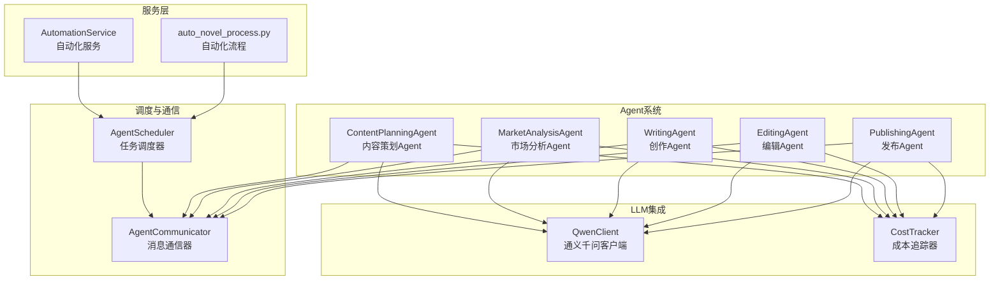
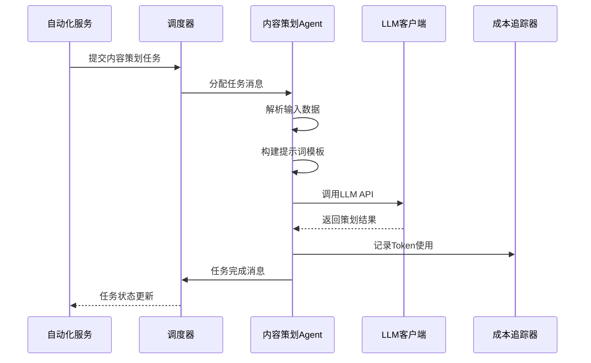
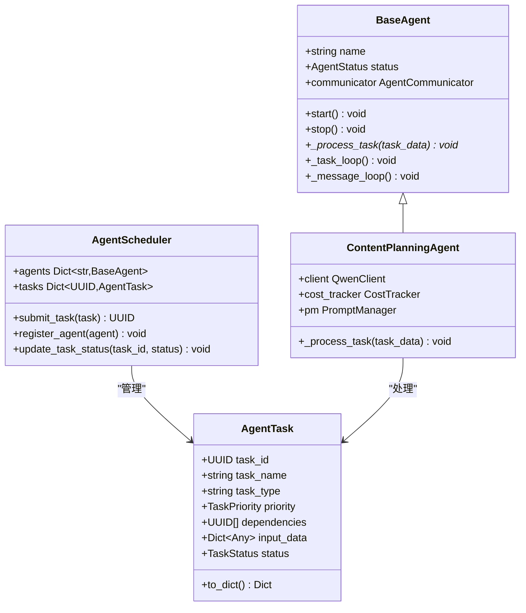
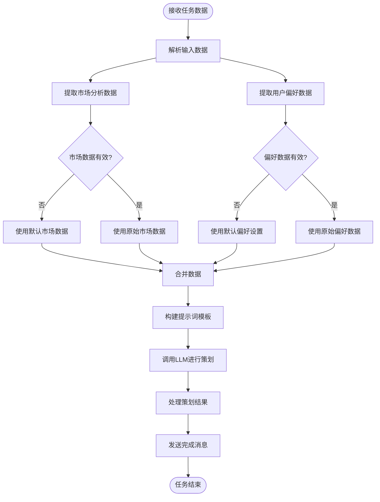
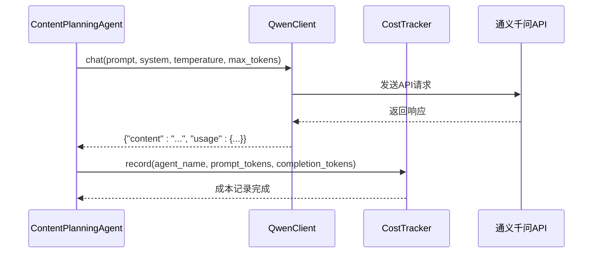
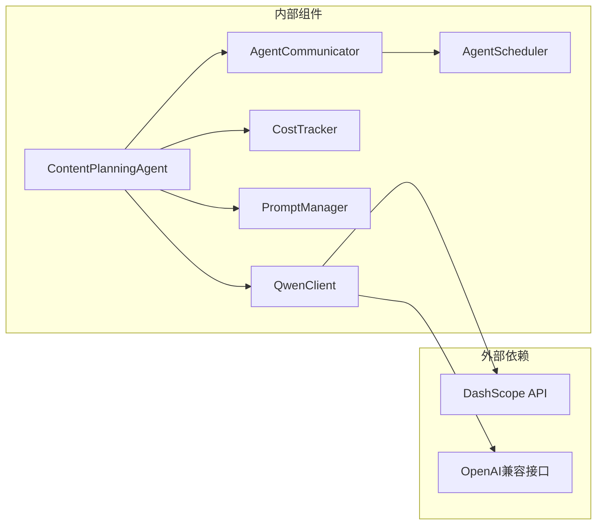

# 内容策划Agent

<cite>
**本文档引用的文件**
- [agents/specific_agents.py](file://agents/specific_agents.py)
- [agents/agent_scheduler.py](file://agents/agent_scheduler.py)
- [agents/agent_communicator.py](file://agents/agent_communicator.py)
- [backend/services/automation_service.py](file://backend/services/automation_service.py)
- [scripts/auto_novel_process.py](file://scripts/auto_novel_process.py)
- [llm/qwen_client.py](file://llm/qwen_client.py)
- [llm/cost_tracker.py](file://llm/cost_tracker.py)
- [scripts/start_agents.py](file://scripts/start_agents.py)
</cite>

## 目录
1. [简介](#简介)
2. [项目结构](#项目结构)
3. [核心组件](#核心组件)
4. [架构总览](#架构总览)
5. [详细组件分析](#详细组件分析)
6. [依赖关系分析](#依赖关系分析)
7. [性能考虑](#性能考虑)
8. [故障排除指南](#故障排除指南)
9. [结论](#结论)

## 简介
内容策划Agent是小说自动化创作流水线中的关键环节，负责将市场分析结果与用户偏好进行融合，生成可执行的小说创作计划。该Agent通过统一的提示词模板和LLM调用接口，将外部输入数据转化为结构化的创作方案，并通过Agent通信与调度系统实现与其他Agent的协作。

## 项目结构
内容策划Agent位于agents模块中，采用分层架构设计，包含Agent实现、调度系统、通信机制和LLM集成等核心组件。

**图表来源**
- [agents/specific_agents.py](file://agents/specific_agents.py#L115-L213)
- [agents/agent_scheduler.py](file://agents/agent_scheduler.py#L222-L488)
- [agents/agent_communicator.py](file://agents/agent_communicator.py#L72-L180)
- [backend/services/automation_service.py](file://backend/services/automation_service.py#L27-L78)
- [scripts/auto_novel_process.py](file://scripts/auto_novel_process.py#L98-L131)

**章节来源**
- [agents/specific_agents.py](file://agents/specific_agents.py#L1-L505)
- [agents/agent_scheduler.py](file://agents/agent_scheduler.py#L1-L488)
- [agents/agent_communicator.py](file://agents/agent_communicator.py#L1-L180)

## 核心组件
内容策划Agent的核心功能围绕以下关键组件展开：

### 主要职责
- **数据融合处理**：整合市场分析结果与用户偏好
- **提示词构建**：基于模板生成LLM输入
- **LLM调用**：执行内容策划任务
- **结果标准化**：输出结构化的内容计划

### 技术特性
- **温度参数**：0.8的创造性平衡
- **Token限制**：3072的最大输出长度
- **成本控制**：实时Token使用追踪
- **异步处理**：非阻塞的任务执行模型

**章节来源**
- [agents/specific_agents.py](file://agents/specific_agents.py#L115-L213)
- [llm/qwen_client.py](file://llm/qwen_client.py#L46-L64)
- [llm/cost_tracker.py](file://llm/cost_tracker.py#L26-L56)

## 架构总览
内容策划Agent采用事件驱动的异步架构，通过消息队列实现松耦合的组件交互。

**图表来源**
- [backend/services/automation_service.py](file://backend/services/automation_service.py#L176-L213)
- [agents/agent_scheduler.py](file://agents/agent_scheduler.py#L369-L378)
- [agents/specific_agents.py](file://agents/specific_agents.py#L137-L213)

## 详细组件分析

### 内容策划Agent实现
内容策划Agent继承自BaseAgent基类，实现了完整的任务处理生命周期。

**图表来源**
- [agents/specific_agents.py](file://agents/specific_agents.py#L103-L213)
- [agents/agent_scheduler.py](file://agents/agent_scheduler.py#L39-L100)

### 输入数据处理流程
内容策划Agent对输入数据进行严格的解析和整合：

**图表来源**
- [agents/specific_agents.py](file://agents/specific_agents.py#L145-L170)

### 提示词模板与参数配置
内容策划Agent使用专门的提示词模板和参数配置：

#### 温度参数配置
- **值**：0.8
- **目的**：在创造性和一致性之间取得平衡
- **适用场景**：内容策划需要一定创造性，但又不能过于发散

#### Token限制配置
- **值**：3072
- **目的**：确保输出长度适中，便于后续处理
- **考虑因素**：市场分析数据和用户偏好的综合长度

**章节来源**
- [agents/specific_agents.py](file://agents/specific_agents.py#L164-L170)

### LLM调用与成本控制
内容策划Agent通过QwenClient进行LLM调用，并集成成本追踪机制：

**图表来源**
- [agents/specific_agents.py](file://agents/specific_agents.py#L164-L178)
- [llm/qwen_client.py](file://llm/qwen_client.py#L46-L64)
- [llm/cost_tracker.py](file://llm/cost_tracker.py#L26-L56)

**章节来源**
- [llm/qwen_client.py](file://llm/qwen_client.py#L16-L232)
- [llm/cost_tracker.py](file://llm/cost_tracker.py#L16-L74)

## 依赖关系分析
内容策划Agent的依赖关系体现了清晰的分层架构：

**图表来源**
- [agents/specific_agents.py](file://agents/specific_agents.py#L1-L13)
- [llm/qwen_client.py](file://llm/qwen_client.py#L16-L45)

### 组件耦合度分析
- **低耦合**：Agent与具体实现分离
- **高内聚**：每个组件职责明确
- **可扩展性**：支持新的Agent类型添加

**章节来源**
- [agents/agent_scheduler.py](file://agents/agent_scheduler.py#L222-L251)
- [agents/agent_communicator.py](file://agents/agent_communicator.py#L72-L90)

## 性能考虑
内容策划Agent在性能方面采用了多项优化策略：

### 异步处理优势
- **非阻塞I/O**：避免等待LLM响应阻塞整个系统
- **并发执行**：多个Agent可以同时处理任务
- **资源利用率**：提高CPU和内存使用效率

### 成本优化策略
- **Token追踪**：实时监控使用量，防止成本失控
- **参数调优**：合理的温度和Token限制配置
- **缓存机制**：重复任务的结果缓存

### 扩展性设计
- **插件化架构**：易于添加新的Agent类型
- **配置驱动**：通过配置文件调整行为
- **监控集成**：完整的日志和指标收集

## 故障排除指南
内容策划Agent可能遇到的问题及解决方案：

### 常见问题诊断
1. **LLM调用失败**
   - 检查API密钥配置
   - 验证网络连接状态
   - 查看重试机制日志

2. **任务超时**
   - 增加max_tokens限制
   - 优化提示词模板长度
   - 检查系统资源使用情况

3. **成本异常**
   - 验证Token计数准确性
   - 检查模型定价配置
   - 审核任务执行频率

### 调试建议
- 启用详细日志记录
- 使用单元测试验证核心逻辑
- 监控系统资源使用情况
- 定期审查成本报告

**章节来源**
- [agents/specific_agents.py](file://agents/specific_agents.py#L209-L213)
- [llm/qwen_client.py](file://llm/qwen_client.py#L97-L106)

## 结论
内容策划Agent通过精心设计的架构和实现，成功地将市场分析与用户偏好融合，为小说创作提供了科学的内容规划方案。其异步处理机制、成本控制策略和模块化设计，使其成为自动化创作流水线中的关键基础设施。未来可以在提示词工程、多模态输入处理和智能参数调优等方面进一步优化，以提升内容策划的质量和效率。