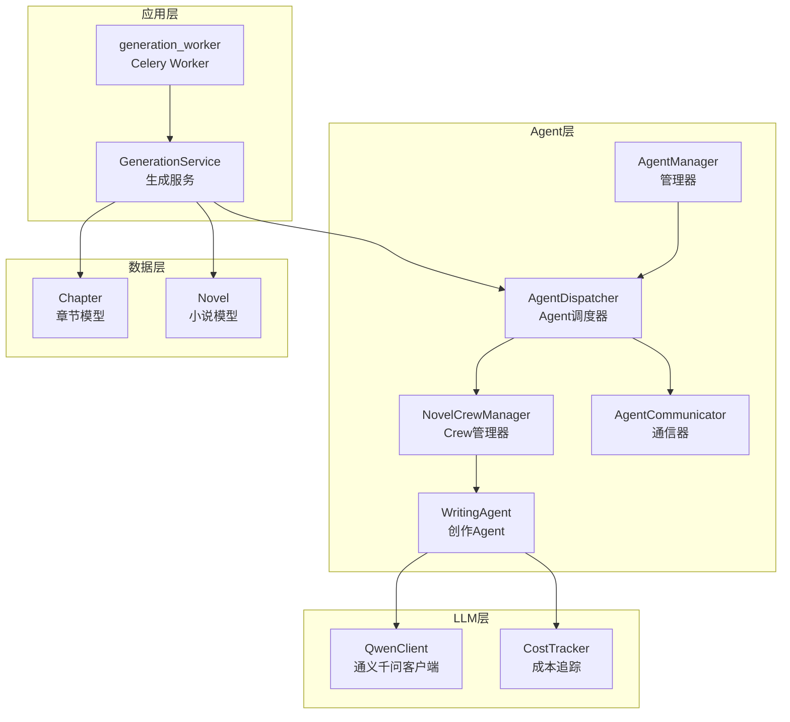
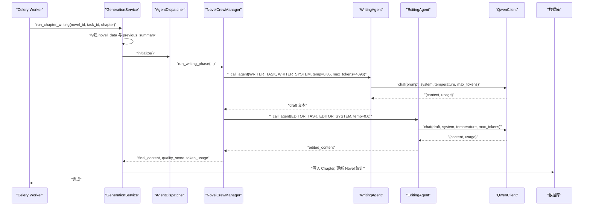
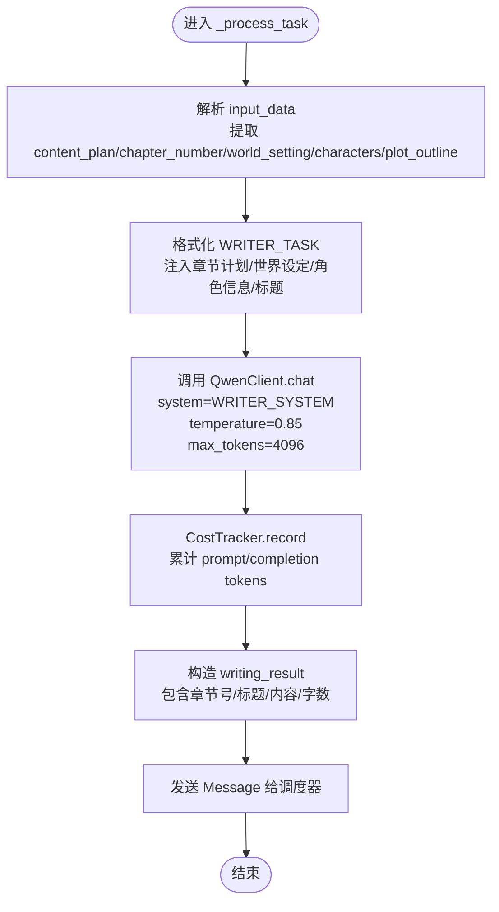
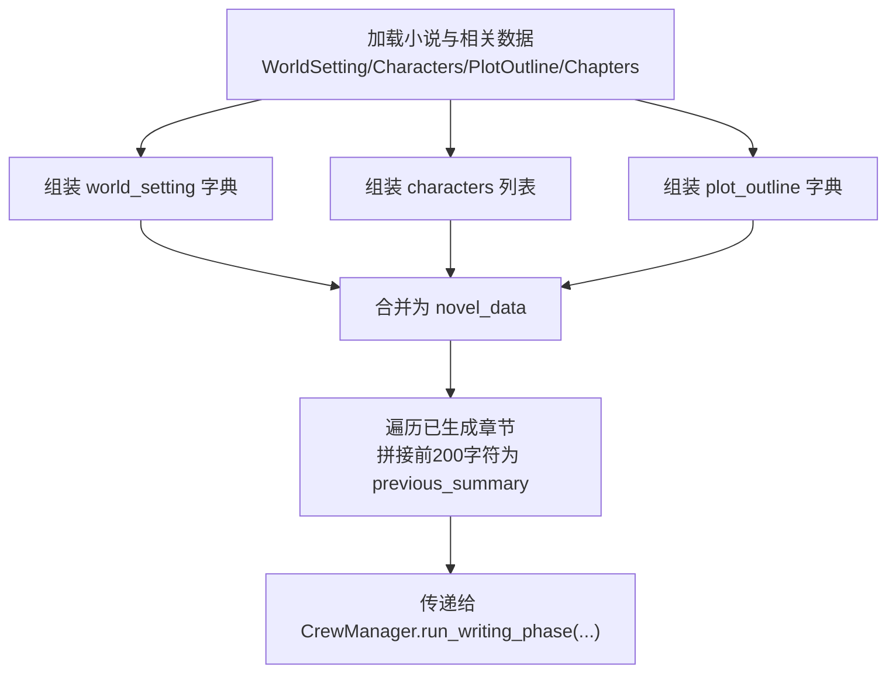
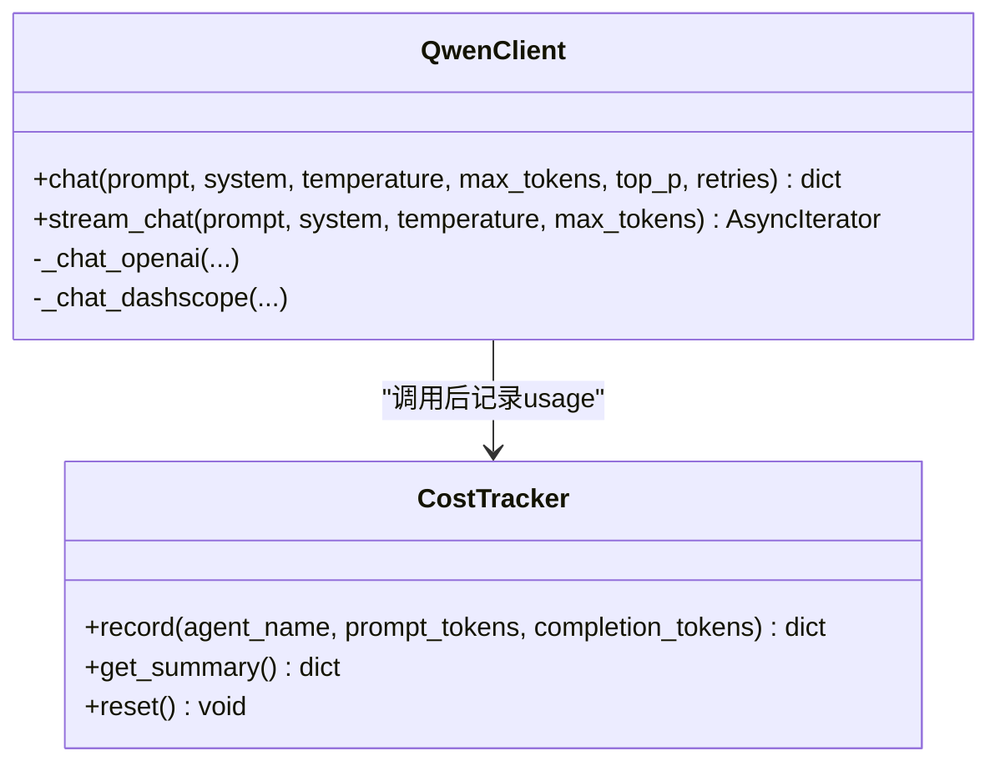
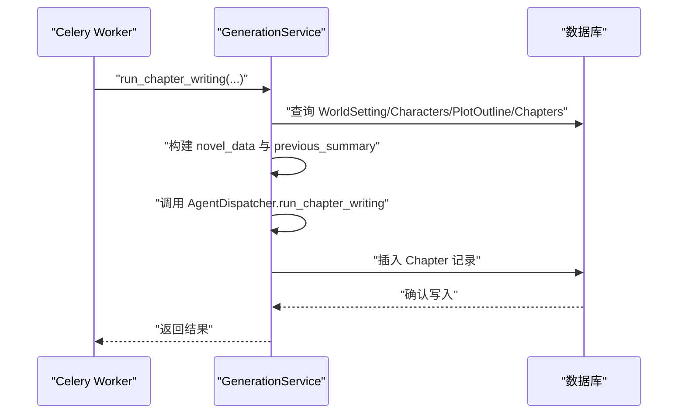
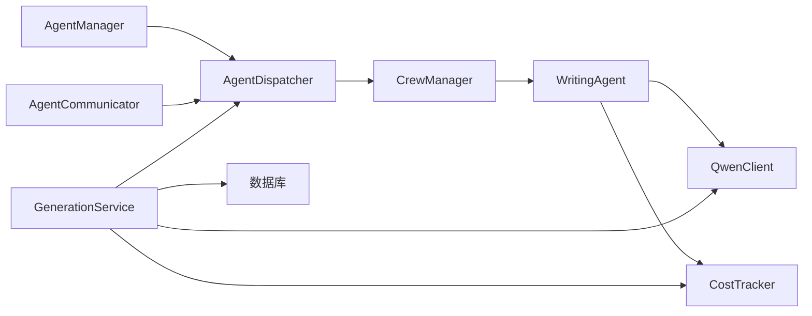

# 创作Agent

<cite>
**本文引用的文件**
- [agents/specific_agents.py](file://agents/specific_agents.py)
- [agents/crew_manager.py](file://agents/crew_manager.py)
- [agents/agent_dispatcher.py](file://agents/agent_dispatcher.py)
- [agents/agent_communicator.py](file://agents/agent_communicator.py)
- [agents/agent_manager.py](file://agents/agent_manager.py)
- [llm/qwen_client.py](file://llm/qwen_client.py)
- [llm/cost_tracker.py](file://llm/cost_tracker.py)
- [backend/services/generation_service.py](file://backend/services/generation_service.py)
- [workers/generation_worker.py](file://workers/generation_worker.py)
- [core/models/chapter.py](file://core/models/chapter.py)
- [core/models/novel.py](file://core/models/novel.py)
- [backend/config.py](file://backend/config.py)
</cite>

## 目录
1. [简介](#简介)
2. [项目结构](#项目结构)
3. [核心组件](#核心组件)
4. [架构总览](#架构总览)
5. [详细组件分析](#详细组件分析)
6. [依赖关系分析](#依赖关系分析)
7. [性能考量](#性能考量)
8. [故障排查指南](#故障排查指南)
9. [结论](#结论)
10. [附录](#附录)

## 简介
本文件聚焦“创作Agent”的深入技术文档，系统阐述 WritingAgent 的文本生成能力与实现细节，重点说明其如何根据内容计划生成高质量的小说章节。文档覆盖输入数据的复杂处理流程（content_plan、world_setting、characters、plot_outline 等多维信息整合）、提示词构建策略（WRITER_TASK、WRITER_SYSTEM）、温度参数（0.85）与最大token（4096）的配置考量，并提供从章节规划解析、上下文信息提取、LLM调用到最终文本生成的完整创作流程。同时包含字数统计、章节标题处理与质量保证机制的说明。

## 项目结构
围绕创作Agent的关键模块与职责如下：
- Agent层：WritingAgent 负责章节文本生成；Agent调度器与通信器支撑跨Agent协作。
- LLM层：QwenClient 提供统一的通义千问调用；CostTracker 追踪token用量与成本。
- 服务层：GenerationService 编排企划与写作阶段，持久化结果；Celery Worker 异步执行任务。
- 数据模型：Chapter、Novel 等 ORM 模型承载章节与小说元数据。

图表来源
- [agents/agent_dispatcher.py](file://agents/agent_dispatcher.py#L17-L68)
- [agents/crew_manager.py](file://agents/crew_manager.py#L19-L36)
- [agents/specific_agents.py](file://agents/specific_agents.py#L216-L320)
- [llm/qwen_client.py](file://llm/qwen_client.py#L16-L54)
- [llm/cost_tracker.py](file://llm/cost_tracker.py#L16-L57)
- [backend/services/generation_service.py](file://backend/services/generation_service.py#L27-L35)
- [workers/generation_worker.py](file://workers/generation_worker.py#L58-L70)
- [core/models/chapter.py](file://core/models/chapter.py#L18-L38)
- [core/models/novel.py](file://core/models/novel.py#L37-L66)

章节来源
- [agents/agent_dispatcher.py](file://agents/agent_dispatcher.py#L17-L68)
- [agents/crew_manager.py](file://agents/crew_manager.py#L19-L36)
- [agents/specific_agents.py](file://agents/specific_agents.py#L216-L320)
- [llm/qwen_client.py](file://llm/qwen_client.py#L16-L54)
- [llm/cost_tracker.py](file://llm/cost_tracker.py#L16-L57)
- [backend/services/generation_service.py](file://backend/services/generation_service.py#L27-L35)
- [workers/generation_worker.py](file://workers/generation_worker.py#L58-L70)
- [core/models/chapter.py](file://core/models/chapter.py#L18-L38)
- [core/models/novel.py](file://core/models/novel.py#L37-L66)

## 核心组件
- WritingAgent：接收 content_plan、world_setting、characters、plot_outline 等输入，构建 WRITER_TASK 与 WRITER_SYSTEM，调用 QwenClient 生成章节文本，记录成本并返回结果。
- QwenClient：封装 DashScope/OpenAI 兼容模式调用，支持重试与流式输出，返回 content 与 usage。
- CostTracker：按模型定价计算 token 成本，累计统计并记录每次调用。
- GenerationService：编排企划与写作阶段，构建 novel_data，调用 Agent 调度器，持久化章节与统计信息。
- AgentDispatcher/CrewManager：在 Crew 风格下编排多Agent协作，执行企划与写作阶段。
- Chapter/Novel 模型：存储章节内容、字数、质量评分与小说统计信息。

章节来源
- [agents/specific_agents.py](file://agents/specific_agents.py#L216-L320)
- [llm/qwen_client.py](file://llm/qwen_client.py#L46-L162)
- [llm/cost_tracker.py](file://llm/cost_tracker.py#L26-L57)
- [backend/services/generation_service.py](file://backend/services/generation_service.py#L206-L378)
- [agents/crew_manager.py](file://agents/crew_manager.py#L104-L163)
- [core/models/chapter.py](file://core/models/chapter.py#L18-L38)
- [core/models/novel.py](file://core/models/novel.py#L37-L66)

## 架构总览
创作Agent的调用链路如下：前端/Worker 触发 GenerationService.run_chapter_writing，后者构建 novel_data 并调用 AgentDispatcher.run_chapter_writing，最终由 CrewManager 编排 WritingAgent 与 EditingAgent 完成创作与润色，返回最终文本并持久化。

图表来源
- [workers/generation_worker.py](file://workers/generation_worker.py#L36-L69)
- [backend/services/generation_service.py](file://backend/services/generation_service.py#L206-L378)
- [agents/agent_dispatcher.py](file://agents/agent_dispatcher.py#L197-L263)
- [agents/crew_manager.py](file://agents/crew_manager.py#L407-L447)
- [agents/specific_agents.py](file://agents/specific_agents.py#L238-L319)
- [llm/qwen_client.py](file://llm/qwen_client.py#L46-L162)

## 详细组件分析

### WritingAgent：章节文本生成
- 输入整合：从 input_data 获取 content_plan、chapter_number、world_setting、characters、plot_outline；若 content_plan 缺失标题，则回退为“第N章”。
- 提示词构建：使用 PromptManager 格式化 WRITER_TASK，注入章节编号、章节计划、世界设定简述、角色信息、上一章结尾片段与章节标题。
- LLM调用：调用 QwenClient.chat，system 使用 WRITER_SYSTEM，temperature=0.85，max_tokens=4096；记录 usage 至 CostTracker。
- 输出处理：构造 writing_result，包含章节号、标题、内容与字数；通过 Message 发送给调度器。

图表来源
- [agents/specific_agents.py](file://agents/specific_agents.py#L238-L319)

章节来源
- [agents/specific_agents.py](file://agents/specific_agents.py#L216-L320)

### 提示词构建策略与参数配置
- WRITER_TASK：以章节计划为核心，结合世界设定简述与角色信息，要求生成符合该章节目标的正文；同时注入上一章结尾片段以便保持连贯性。
- WRITER_SYSTEM：定义创作Agent的角色定位与风格约束，确保生成内容符合小说类型与平台要求。
- 温度参数（0.85）：在创造性与稳定性之间取得平衡，允许一定随机性以提升创意，同时避免过度发散导致离题。
- 最大token（4096）：为长文本生成预留充足上下文空间，兼顾成本控制与生成长度需求。

章节来源
- [agents/specific_agents.py](file://agents/specific_agents.py#L261-L278)
- [agents/crew_manager.py](file://agents/crew_manager.py#L407-L420)

### 输入数据复杂处理流程
- novel_data 构建：GenerationService 从数据库加载 WorldSetting、Characters、PlotOutline、Chapters，组装为 novel_data，其中：
  - world_setting：包含世界名称、类型、力量体系、地理、派系、规则等字段；
  - characters：包含角色姓名、角色类型、个性、背景、能力等；
  - plot_outline：包含结构类型、卷列表、主线剧情、副线剧情、关键转折点等。
- previous_summary 构建：遍历已生成章节，取每章前200字符拼接为“上文摘要”，传入 CrewManager 以增强上下文连贯性。

图表来源
- [backend/services/generation_service.py](file://backend/services/generation_service.py#L252-L313)

章节来源
- [backend/services/generation_service.py](file://backend/services/generation_service.py#L206-L313)

### LLM调用与成本追踪
- QwenClient 支持两种模式：
  - OpenAI 兼容模式：通过 AsyncOpenAI 客户端异步调用，支持流式输出；
  - 标准 DashScope 模式：使用线程池执行同步调用，避免阻塞事件循环。
- 重试机制：默认最多重试3次，指数退避等待；异常时抛出错误。
- CostTracker：按模型定价（元/1000 tokens）计算 prompt 与 completion 成本，累计总成本与总token数。

图表来源
- [llm/qwen_client.py](file://llm/qwen_client.py#L46-L162)
- [llm/cost_tracker.py](file://llm/cost_tracker.py#L26-L57)

章节来源
- [llm/qwen_client.py](file://llm/qwen_client.py#L46-L162)
- [llm/cost_tracker.py](file://llm/cost_tracker.py#L16-L57)

### 质量保证机制与字数统计
- 字数统计：WritingAgent 在生成完成后计算 content 长度作为 word_count；后续编辑阶段同样统计 edited_content 的字数。
- 质量评分：CrewManager 在编辑阶段可扩展质量评估指标（如连续性检查、节奏与冲突评估等），并将 quality_score 写入 Chapter。
- 连续性报告：编辑阶段可产出 continuity_report，包含潜在问题清单，便于人工复核与修正。

章节来源
- [agents/specific_agents.py](file://agents/specific_agents.py#L288-L294)
- [agents/crew_manager.py](file://agents/crew_manager.py#L431-L447)
- [core/models/chapter.py](file://core/models/chapter.py#L29-L34)

### 章节标题处理
- 若 content_plan 中存在 title，则直接使用；否则回退为“第N章”的格式，确保章节标题一致性与可读性。

章节来源
- [agents/specific_agents.py](file://agents/specific_agents.py#L269-L291)

### 从任务到持久化的完整流程
- Celery Worker：接收 novel_id、task_id、chapter_number 等参数，调用 GenerationService.run_chapter_writing。
- GenerationService：构建 novel_data 与 previous_summary，调用 AgentDispatcher.run_chapter_writing，得到 final_content。
- 持久化：创建 Chapter 记录，更新 Novel 的章节数与总字数，记录 Token 使用与成本，更新 GenerationTask 状态与输出数据。

图表来源
- [workers/generation_worker.py](file://workers/generation_worker.py#L36-L69)
- [backend/services/generation_service.py](file://backend/services/generation_service.py#L206-L378)

章节来源
- [workers/generation_worker.py](file://workers/generation_worker.py#L36-L69)
- [backend/services/generation_service.py](file://backend/services/generation_service.py#L206-L378)

## 依赖关系分析
- AgentDispatcher 依赖 AgentManager、AgentCommunicator、CrewManager 与 QwenClient/CostTracker。
- WritingAgent 依赖 PromptManager（通过 CrewManager 格式化提示词）与 QwenClient/CostTracker。
- GenerationService 依赖 AgentDispatcher、QwenClient、CostTracker，并与数据库交互。
- LLM层独立于业务逻辑，提供统一的调用接口与成本追踪。

图表来源
- [agents/agent_manager.py](file://agents/agent_manager.py#L43-L69)
- [agents/agent_dispatcher.py](file://agents/agent_dispatcher.py#L17-L32)
- [agents/crew_manager.py](file://agents/crew_manager.py#L26-L36)
- [agents/specific_agents.py](file://agents/specific_agents.py#L233-L236)
- [backend/services/generation_service.py](file://backend/services/generation_service.py#L30-L35)

章节来源
- [agents/agent_manager.py](file://agents/agent_manager.py#L43-L69)
- [agents/agent_dispatcher.py](file://agents/agent_dispatcher.py#L17-L32)
- [agents/crew_manager.py](file://agents/crew_manager.py#L26-L36)
- [agents/specific_agents.py](file://agents/specific_agents.py#L233-L236)
- [backend/services/generation_service.py](file://backend/services/generation_service.py#L30-L35)

## 性能考量
- 温度与采样：0.85 的温度在创意与可控性之间取得平衡，适合小说创作场景；如需更稳定输出，可降低至 0.6。
- 上下文长度：max_tokens=4096 为长文本留足空间；建议在提示词中精简冗余信息，减少不必要的重复，以控制成本。
- 重试与并发：QwenClient 的重试机制与线程池调用避免阻塞；在高并发场景下，建议合理配置 Celery worker 数量与队列容量。
- 成本控制：CostTracker 提供实时成本监控，建议定期导出汇总，优化提示词与参数以降低 token 消耗。

## 故障排查指南
- LLM调用失败：检查 DASHSCOPE_API_KEY、DASHSCOPE_MODEL 与 DASHSCOPE_BASE_URL 配置；查看 QwenClient 的异常日志与重试次数。
- Agent通信异常：确认 AgentCommunicator 注册与消息队列状态；检查 broadcast/send/receive 的超时与锁竞争。
- 数据持久化失败：核对数据库连接配置（DATABASE_URL/DATABASE_URL_SYNC）与权限；检查 Chapter/Novel 写入事务提交。
- 成本统计异常：确认 CostTracker 的模型定价与记录条目；核对 usage 字段是否正确返回。

章节来源
- [backend/config.py](file://backend/config.py#L5-L27)
- [llm/qwen_client.py](file://llm/qwen_client.py#L54-L162)
- [agents/agent_communicator.py](file://agents/agent_communicator.py#L72-L136)
- [core/models/chapter.py](file://core/models/chapter.py#L18-L38)
- [core/models/novel.py](file://core/models/novel.py#L37-L66)
- [llm/cost_tracker.py](file://llm/cost_tracker.py#L26-L57)

## 结论
WritingAgent 通过精心设计的提示词策略与参数配置，在创造性与可控性之间取得良好平衡，能够高质量地根据内容计划生成小说章节。结合 GenerationService 的编排能力、AgentDispatcher 的协作机制以及 CostTracker 的成本追踪，系统实现了从任务触发到文本落地的完整流水线。建议在实际部署中持续优化提示词与参数，并建立完善的监控与告警机制，以保障生成质量与成本控制。

## 附录
- 相关配置项参考：
  - LLM：DASHSCOPE_API_KEY、DASHSCOPE_MODEL、DASHSCOPE_BASE_URL
  - 数据库：DB_USER、DB_PASSWORD、DB_HOST、DB_PORT、DB_NAME
  - Celery：CELERY_BROKER_URL、CELERY_RESULT_BACKEND
- 数据模型字段要点：
  - Chapter：word_count、quality_score、continuity_issues、outline 等
  - Novel：word_count、chapter_count、token_cost 等

章节来源
- [backend/config.py](file://backend/config.py#L5-L34)
- [core/models/chapter.py](file://core/models/chapter.py#L21-L34)
- [core/models/novel.py](file://core/models/novel.py#L40-L55)