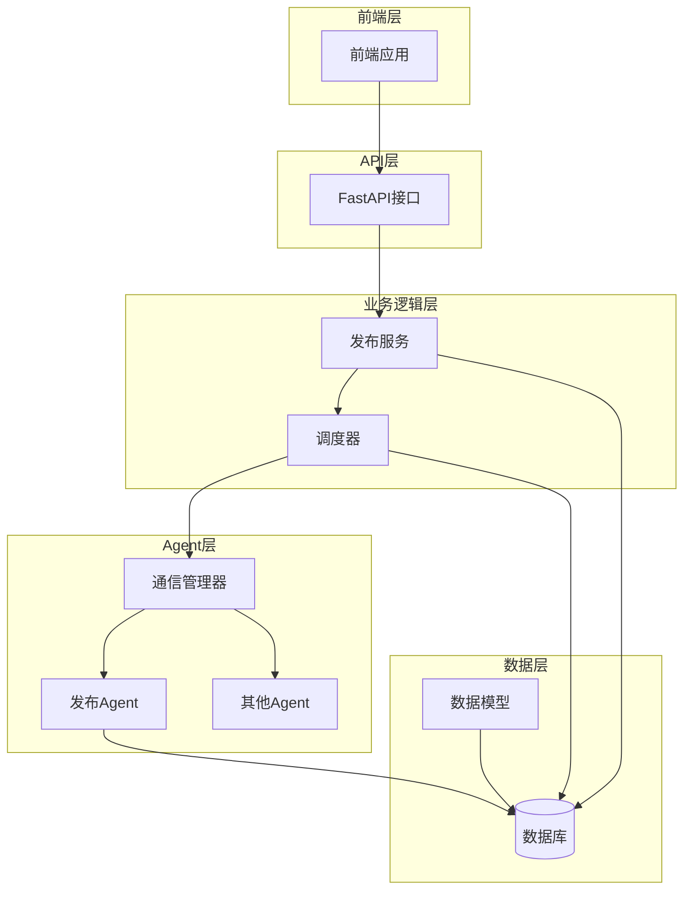
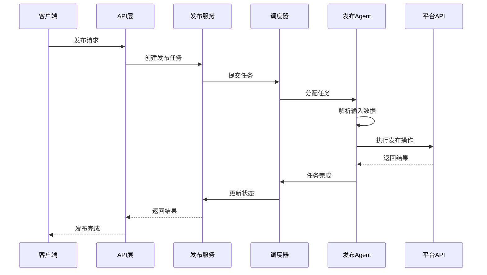
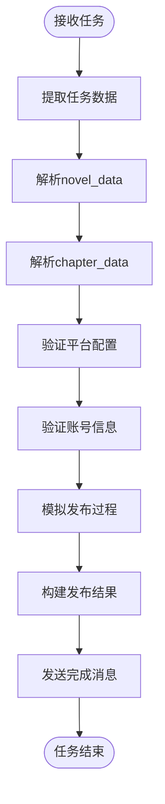
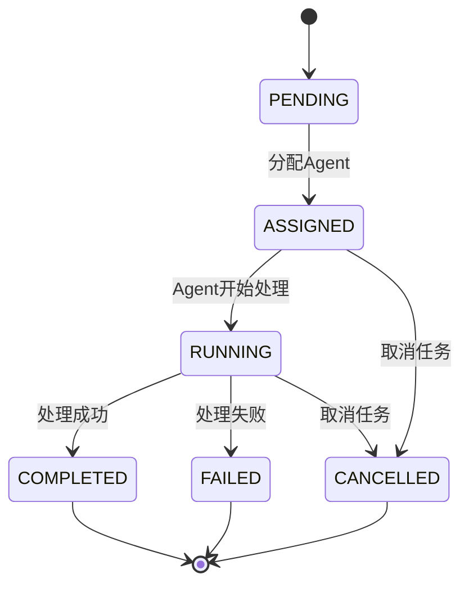
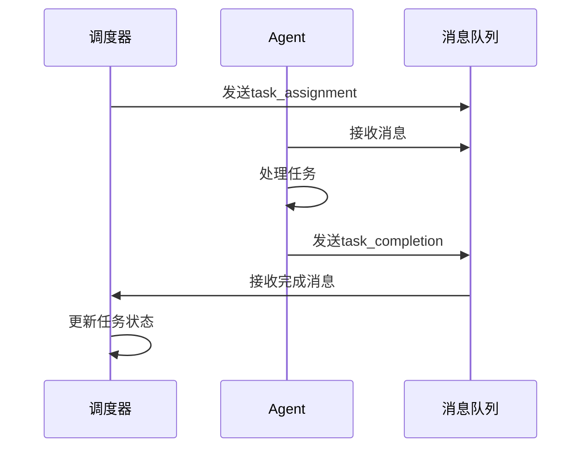
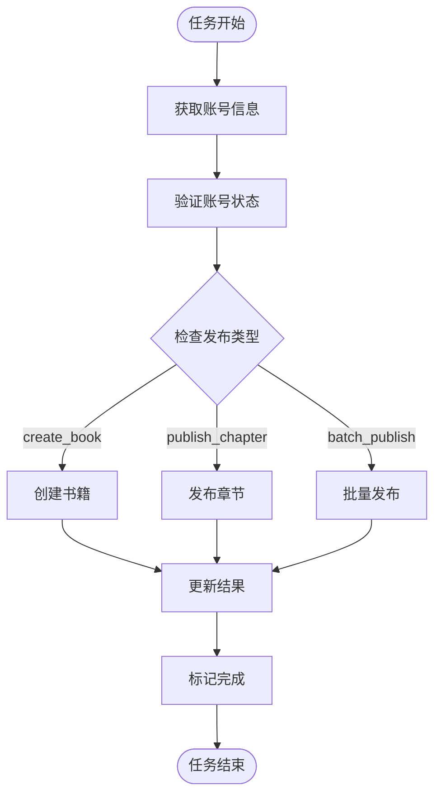
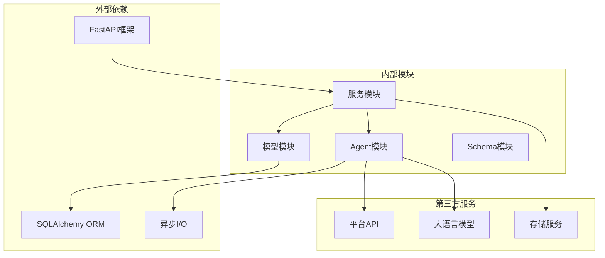

# 发布Agent

<cite>
**本文档引用的文件**
- [agents/specific_agents.py](file://agents/specific_agents.py)
- [agents/agent_scheduler.py](file://agents/agent_scheduler.py)
- [agents/agent_communicator.py](file://agents/agent_communicator.py)
- [backend/services/publishing_service.py](file://backend/services/publishing_service.py)
- [backend/api/v1/publishing.py](file://backend/api/v1/publishing.py)
- [backend/schemas/publishing.py](file://backend/schemas/publishing.py)
- [core/models/publish_task.py](file://core/models/publish_task.py)
- [core/models/chapter_publish.py](file://core/models/chapter_publish.py)
- [core/models/platform_account.py](file://core/models/platform_account.py)
- [scripts/start_agents.py](file://scripts/start_agents.py)
- [auto_novel_process.py](file://scripts/auto_novel_process.py)
</cite>

## 目录
1. [简介](#简介)
2. [项目结构](#项目结构)
3. [核心组件](#核心组件)
4. [架构概览](#架构概览)
5. [详细组件分析](#详细组件分析)
6. [依赖关系分析](#依赖关系分析)
7. [性能考虑](#性能考虑)
8. [故障排除指南](#故障排除指南)
9. [结论](#结论)
10. [附录](#附录)

## 简介

发布Agent是小说发布自动化系统中的关键组件，负责协调小说发布流程并在不同平台之间进行内容分发。该系统采用多Agent协作架构，通过智能调度和通信机制实现高效的发布工作流。

发布Agent的主要职责包括：
- 接收发布请求并解析输入数据
- 协调平台配置验证和内容准备
- 执行发布操作并将结果反馈给调度器
- 管理发布状态跟踪和错误处理
- 支持多种发布模式：单章发布、批量发布和新书创建

## 项目结构

小说发布系统采用模块化设计，主要分为以下几个层次：



**图表来源**
- [agents/specific_agents.py](file://agents/specific_agents.py#L425-L505)
- [agents/agent_scheduler.py](file://agents/agent_scheduler.py#L222-L488)
- [backend/services/publishing_service.py](file://backend/services/publishing_service.py#L21-L275)

**章节来源**
- [agents/specific_agents.py](file://agents/specific_agents.py#L1-L505)
- [agents/agent_scheduler.py](file://agents/agent_scheduler.py#L1-L488)
- [backend/services/publishing_service.py](file://backend/services/publishing_service.py#L1-L275)

## 核心组件

发布Agent系统由多个核心组件构成，每个组件都有明确的职责分工：

### 1. 发布Agent (PublishingAgent)
- **职责**: 执行实际的发布操作，协调平台集成
- **特点**: 当前为模拟实现，未来可扩展为真实平台集成
- **输入**: novel_data, chapter_data, platform, account_id
- **输出**: 发布结果和状态信息

### 2. Agent调度器 (AgentScheduler)
- **职责**: 管理Agent生命周期，分配任务，处理依赖关系
- **功能**: 任务队列管理、状态跟踪、错误处理
- **特性**: 支持优先级调度和依赖关系解析

### 3. 通信管理器 (AgentCommunicator)
- **职责**: 提供Agent间的异步通信机制
- **功能**: 消息传递、广播、历史记录
- **特性**: 基于队列的消息系统，支持超时处理

### 4. 发布服务 (PublishingService)
- **职责**: 后台发布任务执行，平台账号管理
- **功能**: 任务状态管理、结果汇总、错误处理
- **特性**: 支持多种发布类型和批量操作

**章节来源**
- [agents/specific_agents.py](file://agents/specific_agents.py#L425-L505)
- [agents/agent_scheduler.py](file://agents/agent_scheduler.py#L222-L488)
- [agents/agent_communicator.py](file://agents/agent_communicator.py#L72-L180)
- [backend/services/publishing_service.py](file://backend/services/publishing_service.py#L21-L275)

## 架构概览

发布Agent系统采用分层架构设计，实现了清晰的职责分离和良好的扩展性：



**图表来源**
- [backend/api/v1/publishing.py](file://backend/api/v1/publishing.py#L157-L231)
- [backend/services/publishing_service.py](file://backend/services/publishing_service.py#L144-L209)
- [agents/specific_agents.py](file://agents/specific_agents.py#L447-L505)

## 详细组件分析

### 发布Agent实现分析

发布Agent继承自BaseAgent基类，实现了完整的任务处理流程：

#### 输入数据处理

发布Agent接收以下关键输入数据：

| 参数名称 | 类型 | 必需 | 描述 |
|---------|------|------|------|
| novel_data | dict | 是 | 小说元数据，包含标题、ID、类型等 |
| chapter_data | dict | 是 | 章节信息，包含章节号、标题等 |
| platform | str | 是 | 目标发布平台名称 |
| account_id | UUID | 是 | 平台账号ID |

#### 数据解析流程



**图表来源**
- [agents/specific_agents.py](file://agents/specific_agents.py#L456-L498)

#### 当前模拟实现

当前发布Agent采用模拟实现方式，主要特征：
- 使用随机时间戳作为发布时间
- 生成模拟的平台书籍ID和章节ID
- 返回固定的成功状态
- 不涉及真实的平台API调用

#### 未来扩展可能性

```mermaid
classDiagram
class PublishingAgent {
+novel_data : dict
+chapter_data : dict
+platform : str
+account_id : UUID
+_process_task(task_data) void
+simulate_publish() dict
+real_publish() dict
}
class PlatformAdapter {
<<interface>>
+login(credentials) bool
+create_book(metadata) dict
+publish_chapter(content) dict
+batch_publish(chapters) dict
}
class QidianAdapter {
+login(credentials) bool
+create_book(metadata) dict
+publish_chapter(content) dict
+batch_publish(chapters) dict
}
class WeixinAdapter {
+login(credentials) bool
+create_book(metadata) dict
+publish_chapter(content) dict
+batch_publish(chapters) dict
}
PublishingAgent --> PlatformAdapter : "使用"
PlatformAdapter <|-- QidianAdapter : "实现"
PlatformAdapter <|-- WeixinAdapter : "实现"
```



**图表来源**
- [agents/specific_agents.py](file://agents/specific_agents.py#L425-L505)

**章节来源**
- [agents/specific_agents.py](file://agents/specific_agents.py#L425-L505)

### Agent调度系统

Agent调度系统提供了完整的任务管理和状态跟踪机制：

#### 任务状态管理



#### 依赖关系处理

调度器支持复杂的任务依赖关系：
- 串行依赖：任务B必须等待任务A完成后才能执行
- 并行处理：多个独立任务可以同时执行
- 优先级调度：高优先级任务优先分配

**章节来源**
- [agents/agent_scheduler.py](file://agents/agent_scheduler.py#L29-L488)

### 通信机制

Agent间的通信基于消息传递模式：

#### 消息类型定义

| 消息类型 | 用途 | 内容结构 |
|---------|------|----------|
| task_assignment | 任务分配 | 包含完整任务信息 |
| task_cancellation | 任务取消 | 包含任务ID |
| task_completion | 任务完成 | 包含结果和状态 |
| status_request | 状态查询 | 空内容 |
| status_response | 状态响应 | 包含Agent状态 |

#### 消息传递流程



**图表来源**
- [agents/agent_communicator.py](file://agents/agent_communicator.py#L91-L136)
- [agents/agent_scheduler.py](file://agents/agent_scheduler.py#L155-L178)

**章节来源**
- [agents/agent_communicator.py](file://agents/agent_communicator.py#L72-L180)
- [agents/agent_scheduler.py](file://agents/agent_scheduler.py#L136-L190)

### 发布服务层

发布服务提供了完整的后台任务执行能力：

#### 发布类型支持

| 发布类型 | 描述 | 主要功能 |
|---------|------|----------|
| create_book | 创建新书 | 在平台创建新的小说作品 |
| publish_chapter | 发布章节 | 发布单个章节内容 |
| batch_publish | 批量发布 | 一次性发布多个章节 |

#### 任务执行流程



**图表来源**
- [backend/services/publishing_service.py](file://backend/services/publishing_service.py#L144-L209)

**章节来源**
- [backend/services/publishing_service.py](file://backend/services/publishing_service.py#L21-L275)

## 依赖关系分析

发布Agent系统具有清晰的依赖关系结构：



**图表来源**
- [agents/specific_agents.py](file://agents/specific_agents.py#L1-L13)
- [backend/services/publishing_service.py](file://backend/services/publishing_service.py#L8-L18)

**章节来源**
- [agents/specific_agents.py](file://agents/specific_agents.py#L1-L13)
- [backend/services/publishing_service.py](file://backend/services/publishing_service.py#L1-L275)

## 性能考虑

发布Agent系统在设计时充分考虑了性能优化：

### 异步处理
- 所有Agent都采用异步模式运行
- 使用队列机制避免阻塞操作
- 支持并发任务处理

### 内存管理
- 及时清理已完成任务的状态信息
- 控制消息历史记录的大小
- 合理的缓存策略

### 扩展性设计
- 插件化的平台适配器
- 可配置的优先级和超时参数
- 支持动态添加新的Agent类型

## 故障排除指南

### 常见问题及解决方案

#### 1. Agent无法接收任务
**症状**: Agent状态一直显示为空闲
**可能原因**:
- 通信管理器未正确注册Agent
- 消息队列未创建
- 网络连接问题

**解决方法**:
- 检查Agent注册流程
- 验证消息队列状态
- 确认网络连接正常

#### 2. 发布任务失败
**症状**: 任务状态变为failed
**可能原因**:
- 平台API调用失败
- 凭证验证失败
- 网络超时

**解决方法**:
- 检查平台API状态
- 验证账号凭证
- 增加重试机制

#### 3. 调度器任务积压
**症状**: 任务长时间处于待处理状态
**可能原因**:
- Agent资源不足
- 任务依赖关系复杂
- 优先级设置不当

**解决方法**:
- 增加Agent实例数量
- 简化任务依赖关系
- 调整任务优先级

**章节来源**
- [agents/agent_scheduler.py](file://agents/agent_scheduler.py#L406-L442)
- [agents/agent_communicator.py](file://agents/agent_communicator.py#L91-L136)

## 结论

发布Agent系统展现了现代AI驱动的自动化发布平台的设计理念。通过模块化架构、智能调度和可靠的通信机制，系统能够高效地协调复杂的发布流程。

### 主要优势
- **模块化设计**: 清晰的职责分离便于维护和扩展
- **异步处理**: 高效的任务执行和资源利用
- **可扩展性**: 支持多种平台和发布模式
- **可靠性**: 完善的错误处理和状态跟踪

### 未来发展方向
- 实现真实平台集成
- 增强监控和告警机制
- 优化性能和资源使用
- 扩展更多发布平台支持

## 附录

### API参考

#### 发布任务创建
- **端点**: POST /publishing/tasks
- **功能**: 创建新的发布任务
- **参数**: novel_id, account_id, publish_type, config

#### 平台账号管理
- **端点**: POST /publishing/accounts
- **功能**: 创建平台账号
- **参数**: platform, account_name, username, password

#### 发布预览
- **端点**: POST /publishing/preview
- **功能**: 获取发布预览信息
- **参数**: novel_id, from_chapter, to_chapter

### 配置示例

#### 发布配置模板
```json
{
  "novel_data": {
    "title": "示例小说",
    "id": "uuid-string",
    "genre": "玄幻",
    "tags": ["热血", "修仙"]
  },
  "chapter_data": {
    "chapter_number": 1,
    "title": "第一章",
    "content": "章节内容..."
  },
  "platform": "qidian",
  "account_id": "uuid-string"
}
```