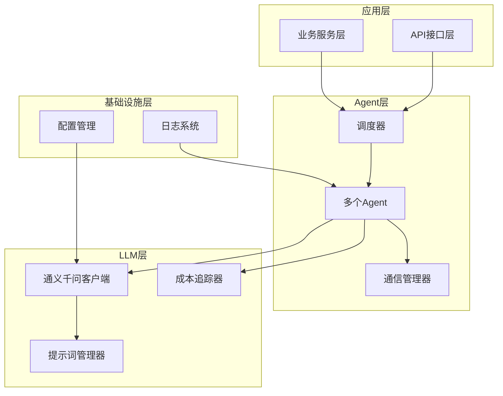
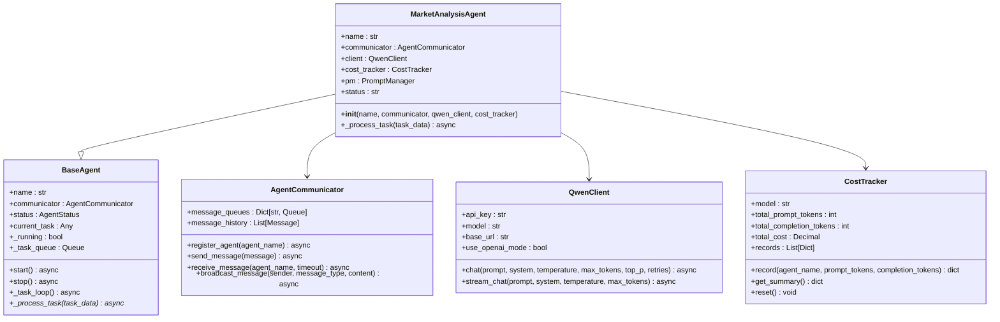
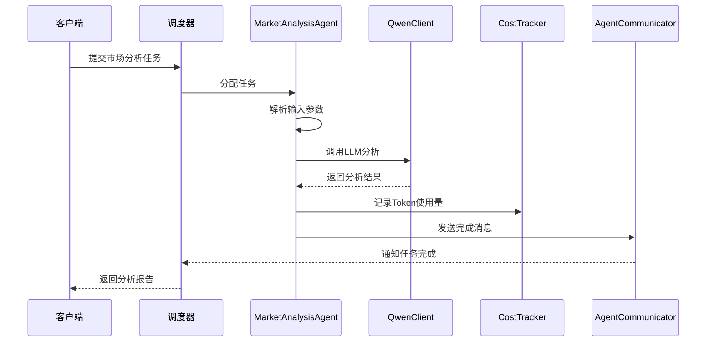
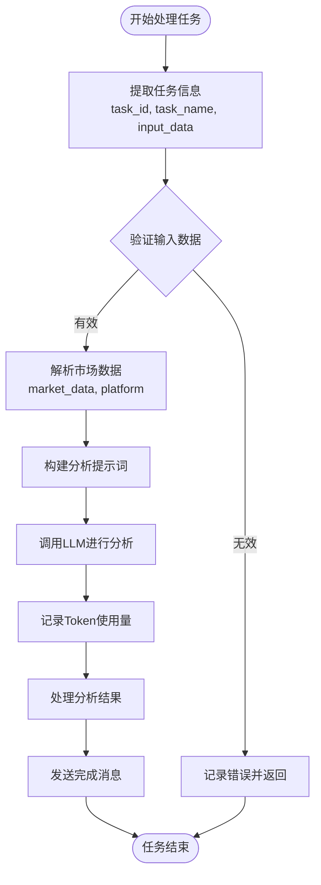
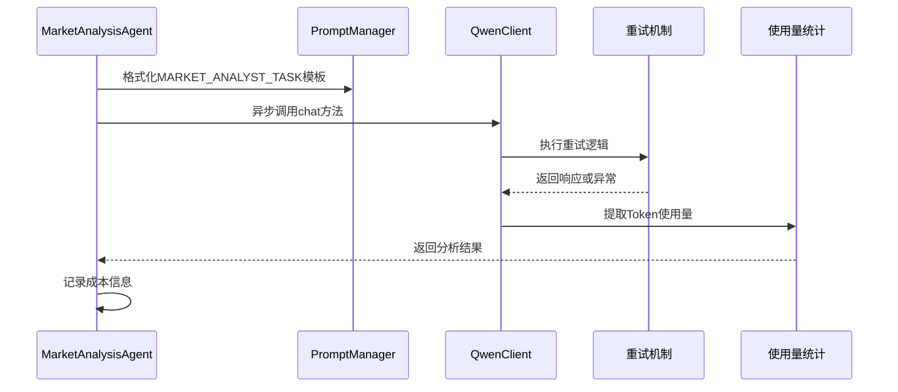
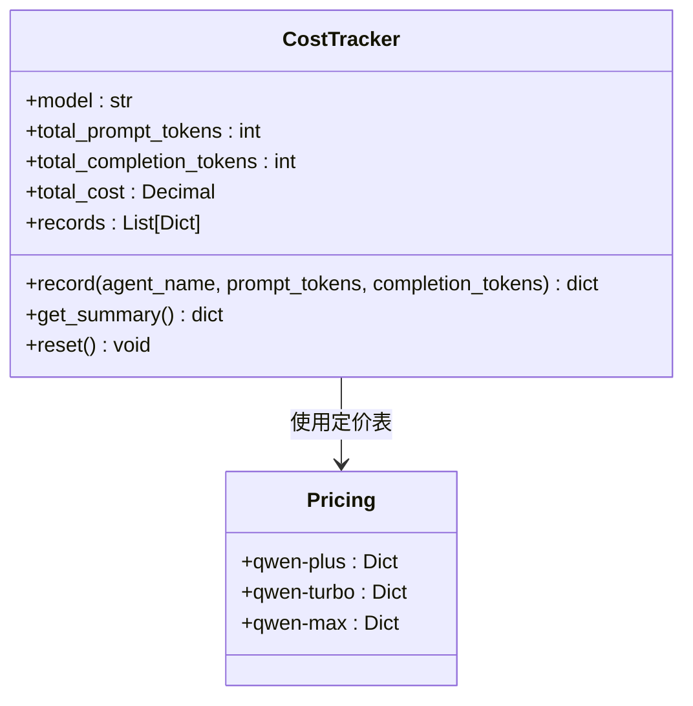
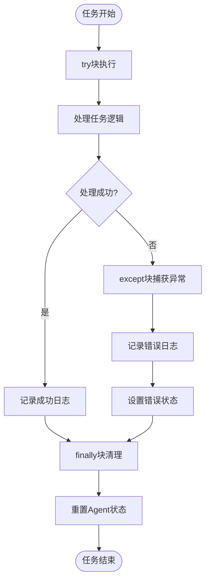
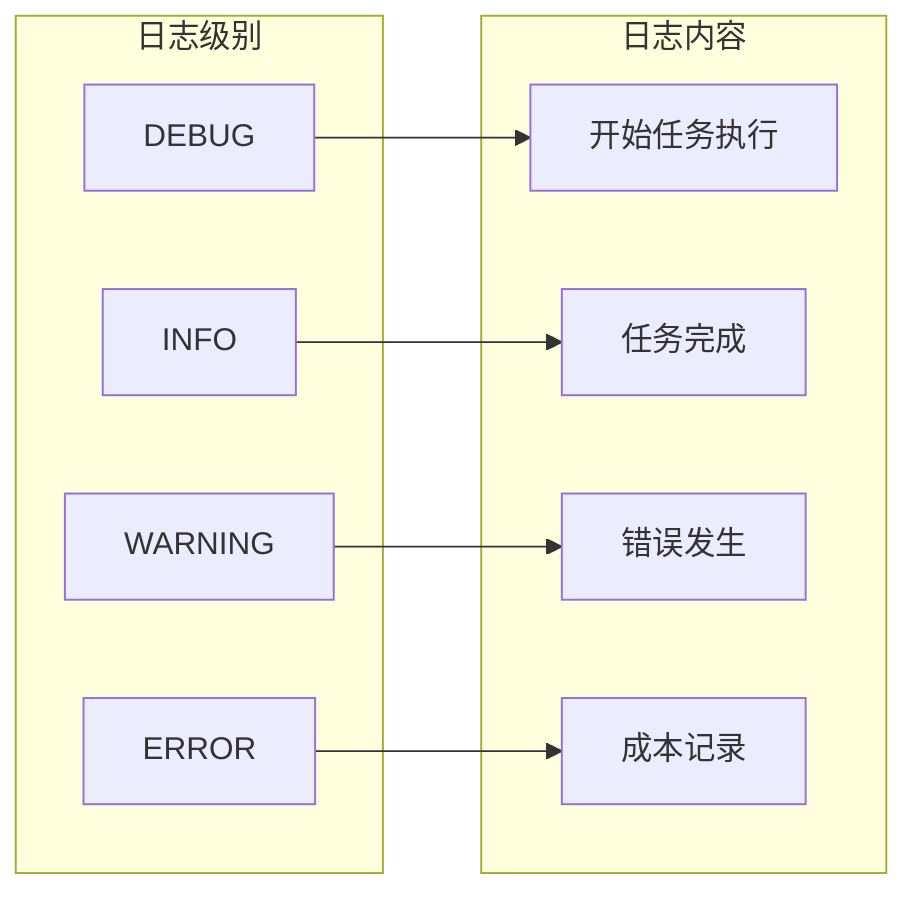
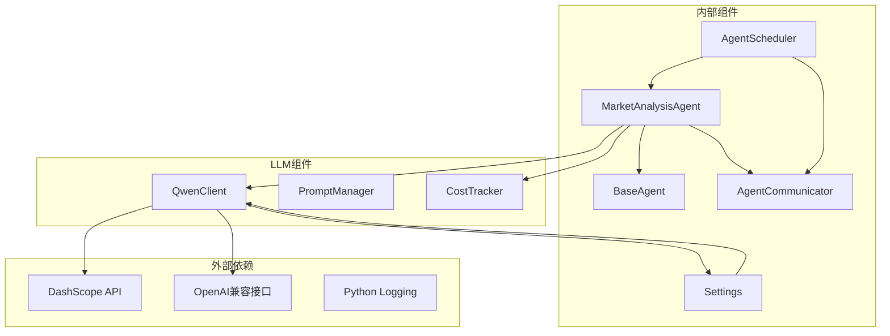

# 市场分析Agent

<cite>
**本文档引用的文件**
- [specific_agents.py](file://agents/specific_agents.py)
- [qwen_client.py](file://llm/qwen_client.py)
- [cost_tracker.py](file://llm/cost_tracker.py)
- [agent_communicator.py](file://agents/agent_communicator.py)
- [agent_scheduler.py](file://agents/agent_scheduler.py)
- [config.py](file://backend/config.py)
</cite>

## 目录
1. [简介](#简介)
2. [项目结构](#项目结构)
3. [核心组件](#核心组件)
4. [架构概览](#架构概览)
5. [详细组件分析](#详细组件分析)
6. [依赖关系分析](#依赖关系分析)
7. [性能考虑](#性能考虑)
8. [故障排除指南](#故障排除指南)
9. [结论](#结论)

## 简介

市场分析Agent是小说创作系统中的关键智能体，负责进行市场调研、趋势分析和数据收集。该Agent通过集成通义千问大语言模型，能够对小说市场的数据进行深度分析，为内容创作提供数据驱动的决策支持。

该Agent在小说创作流水线中扮演着上游分析角色，为后续的内容策划、创作、编辑和发布环节提供市场洞察和趋势预测。其设计采用模块化架构，具备完善的错误处理机制、成本追踪功能和异步处理能力。

## 项目结构

小说创作系统的Agent架构采用分层设计，主要包含以下核心层次：

**图表来源**
- [specific_agents.py](file://agents/specific_agents.py#L15-L112)
- [agent_scheduler.py](file://agents/agent_scheduler.py#L222-L487)
- [qwen_client.py](file://llm/qwen_client.py#L16-L232)

**章节来源**
- [specific_agents.py](file://agents/specific_agents.py#L1-L505)
- [agent_scheduler.py](file://agents/agent_scheduler.py#L1-L487)

## 核心组件

### MarketAnalysisAgent 类设计

MarketAnalysisAgent继承自BaseAgent基类，实现了专门的市场分析功能。该类的核心特点包括：

- **职责分离**：专注于市场数据分析和趋势预测
- **异步处理**：支持非阻塞的任务处理机制
- **成本控制**：集成了完整的Token使用量追踪功能
- **错误恢复**：具备完善的异常处理和状态管理

### 关键属性和方法

**图表来源**
- [specific_agents.py](file://agents/specific_agents.py#L15-L112)
- [agent_scheduler.py](file://agents/agent_scheduler.py#L103-L221)
- [agent_communicator.py](file://agents/agent_communicator.py#L72-L180)
- [qwen_client.py](file://llm/qwen_client.py#L16-L232)
- [cost_tracker.py](file://llm/cost_tracker.py#L16-L74)

**章节来源**
- [specific_agents.py](file://agents/specific_agents.py#L15-L112)
- [agent_scheduler.py](file://agents/agent_scheduler.py#L103-L221)

## 架构概览

市场分析Agent在整个系统架构中处于核心位置，负责连接数据源与创作流程。其工作流程如下：

**图表来源**
- [agent_scheduler.py](file://agents/agent_scheduler.py#L324-L377)
- [specific_agents.py](file://agents/specific_agents.py#L37-L112)
- [qwen_client.py](file://llm/qwen_client.py#L46-L64)

## 详细组件分析

### 输入参数处理机制

MarketAnalysisAgent对输入参数进行了严格的验证和处理：

**图表来源**
- [specific_agents.py](file://agents/specific_agents.py#L45-L112)

#### 参数验证和处理

Agent首先从任务数据中提取必要的信息，包括任务标识符、任务名称和输入数据。对于市场数据和平台参数，Agent提供了默认值以确保任务的健壮性。

#### 提示词构建策略

Agent使用PromptManager来构建分析提示词，采用模板化的方式将市场数据和平台信息注入到预定义的提示词模板中。

**章节来源**
- [specific_agents.py](file://agents/specific_agents.py#L45-L70)

### LLM调用流程

MarketAnalysisAgent的LLM调用采用了异步非阻塞的方式，确保了系统的响应性和并发处理能力：

**图表来源**
- [specific_agents.py](file://agents/specific_agents.py#L64-L70)
- [qwen_client.py](file://llm/qwen_client.py#L46-L64)

#### 温度参数设置

MarketAnalysisAgent使用温度参数0.7，这个设置在创造性和准确性之间取得了平衡，既保证了分析的创造性，又确保了结果的可靠性。

#### 最大Token限制

设置最大Token限制为2048，这个限制适用于市场分析场景，既能容纳足够的上下文信息，又避免了不必要的资源消耗。

**章节来源**
- [specific_agents.py](file://agents/specific_agents.py#L64-L70)
- [qwen_client.py](file://llm/qwen_client.py#L46-L64)

### 成本追踪机制

CostTracker提供了完整的Token使用量和成本追踪功能：

**图表来源**
- [cost_tracker.py](file://llm/cost_tracker.py#L16-L74)

#### 定价策略

系统支持多种模型的定价策略，包括qwen-plus、qwen-turbo和qwen-max，每种模型都有不同的输入和输出定价。

#### 成本计算

成本计算采用Decimal类型确保精度，使用公式：总成本 = (提示Token数 × 输入单价) + (完成Token数 × 输出单价)

**章节来源**
- [cost_tracker.py](file://llm/cost_tracker.py#L8-L56)

### 错误处理策略

MarketAnalysisAgent实现了多层次的错误处理机制：

**图表来源**
- [specific_agents.py](file://agents/specific_agents.py#L108-L112)

#### 异常处理

Agent使用try-except-finally结构确保即使出现异常也能正确清理状态，避免Agent卡在忙碌状态。

#### 状态管理

Agent维护三种状态：空闲(idle)、忙碌(busy)和错误(error)，通过状态机确保Agent的正确生命周期管理。

**章节来源**
- [specific_agents.py](file://agents/specific_agents.py#L108-L112)

### 日志记录机制

系统采用了统一的日志记录机制，确保了操作的可追溯性和问题的快速定位：

**图表来源**
- [specific_agents.py](file://agents/specific_agents.py#L51-L52)
- [specific_agents.py](file://agents/specific_agents.py#L89-L90)
- [specific_agents.py](file://agents/specific_agents.py#L109-L110)
- [cost_tracker.py](file://llm/cost_tracker.py#L52-L55)

**章节来源**
- [specific_agents.py](file://agents/specific_agents.py#L51-L112)
- [cost_tracker.py](file://llm/cost_tracker.py#L52-L55)

## 依赖关系分析

MarketAnalysisAgent的依赖关系体现了清晰的分层架构：

**图表来源**
- [specific_agents.py](file://agents/specific_agents.py#L5-L9)
- [qwen_client.py](file://llm/qwen_client.py#L16-L45)
- [agent_scheduler.py](file://agents/agent_scheduler.py#L222-L251)

### 组件耦合度分析

- **低耦合设计**：Agent与具体实现解耦，通过接口抽象实现
- **高内聚特性**：每个组件专注于单一职责
- **可扩展性**：新的Agent可以轻松添加到现有架构中

**章节来源**
- [specific_agents.py](file://agents/specific_agents.py#L5-L9)
- [qwen_client.py](file://llm/qwen_client.py#L16-L45)

## 性能考虑

### 异步处理优化

MarketAnalysisAgent采用了完全异步的处理模式，具有以下优势：

- **非阻塞I/O**：避免了等待LLM响应时的线程阻塞
- **并发处理**：多个Agent可以同时处理不同任务
- **资源利用率**：提高了CPU和内存的使用效率

### 缓存策略

虽然当前实现中没有显式的缓存机制，但可以通过以下方式优化：

- **提示词缓存**：对常用的提示词模板进行缓存
- **结果缓存**：对相似的市场分析结果进行缓存
- **模型响应缓存**：对重复的LLM查询结果进行缓存

### 内存管理

系统采用了渐进式的内存管理模式：

- **流式处理**：支持流式LLM响应处理
- **及时清理**：任务完成后及时清理状态和临时数据
- **资源监控**：通过成本追踪监控资源使用情况

## 故障排除指南

### 常见问题及解决方案

#### LLM调用失败

**症状**：Agent在调用LLM时抛出异常

**可能原因**：
- API密钥配置错误
- 网络连接不稳定
- 模型参数超出限制

**解决步骤**：
1. 验证配置文件中的API密钥
2. 检查网络连接状态
3. 调整温度和Token限制参数
4. 查看详细的错误日志

#### Token使用量异常

**症状**：成本追踪显示异常高的使用量

**排查步骤**：
1. 检查输入数据的大小和复杂度
2. 验证PromptManager的模板使用
3. 确认CostTracker的记录逻辑
4. 对比不同模型的定价差异

#### Agent状态异常

**症状**：Agent长时间处于忙碌状态

**解决方法**：
1. 检查异常处理逻辑是否正确执行
2. 验证finally块的状态重置
3. 查看AgentCommunicator的消息队列
4. 确认调度器的任务分配机制

**章节来源**
- [specific_agents.py](file://agents/specific_agents.py#L108-L112)
- [qwen_client.py](file://llm/qwen_client.py#L97-L106)
- [cost_tracker.py](file://llm/cost_tracker.py#L52-L55)

## 结论

MarketAnalysisAgent作为小说创作系统的核心智能体，展现了现代AI应用的最佳实践。其设计特点包括：

**架构优势**：
- 清晰的分层架构和职责分离
- 完善的异步处理机制
- 有效的成本控制和追踪
- 健壮的错误处理和状态管理

**技术特色**：
- 基于通义千问的大语言模型集成
- 模板化的提示词管理
- 统一的日志记录和监控
- 可扩展的Agent架构

**应用场景**：
该Agent特别适用于需要数据驱动决策的内容创作场景，能够为小说作者提供准确的市场趋势分析和创作建议，显著提升创作效率和作品成功率。

通过持续的优化和扩展，MarketAnalysisAgent有望成为小说创作生态系统中的重要基础设施组件，为整个创作流程提供智能化的支持和服务。