# 特定智能体实现

<cite>
**本文引用的文件**
- [agents/specific_agents.py](file://agents/specific_agents.py)
- [agents/agent_manager.py](file://agents/agent_manager.py)
- [agents/agent_dispatcher.py](file://agents/agent_dispatcher.py)
- [agents/crew_manager.py](file://agents/crew_manager.py)
- [agents/agent_communicator.py](file://agents/agent_communicator.py)
- [agents/agent_scheduler.py](file://agents/agent_scheduler.py)
- [llm/cost_tracker.py](file://llm/cost_tracker.py)
- [agents/quality_evaluator.py](file://agents/quality_evaluator.py)
- [agents/theme_guardian.py](file://agents/theme_guardian.py)
- [agents/voting_manager.py](file://agents/voting_manager.py)
- [agents/prevention_continuity_checker.py](file://agents/prevention_continuity_checker.py)
- [agents/base/quality_report.py](file://agents/base/quality_report.py)
- [agents/review_loop.py](file://agents/review_loop.py)
- [agents/base/review_loop_base.py](file://agents/base/review_loop_base.py)
- [agents/base/review_result.py](file://agents/base/review_result.py)
- [tests/agents/test_quality_dimension_unification.py](file://tests/agents/test_quality_dimension_unification.py)
- [tests/continuity_system_test.py](file://tests/continuity_system_test.py)
</cite>

## 更新摘要
**变更内容**
- 新增质量评估智能体（QualityEvaluator）支持五维质量评分体系
- 新增主题守护智能体（ThemeGuardian）提供主题一致性审查
- 新增预防式连贯性检查智能体（PreventionContinuityChecker）在生成前进行连贯性保障
- 新增投票共识管理器（VotingManager）支持多智能体决策投票
- 增强审查循环系统，支持质量评估报告的统一结构
- 更新Agent查询服务和投票管理器功能

## 目录
1. [简介](#简介)
2. [项目结构](#项目结构)
3. [核心组件](#核心组件)
4. [架构总览](#架构总览)
5. [详细组件分析](#详细组件分析)
6. [新增智能体详解](#新增智能体详解)
7. [审查循环系统](#审查循环系统)
8. [依赖分析](#依赖分析)
9. [性能考虑](#性能考虑)
10. [故障排查指南](#故障排查指南)
11. [结论](#结论)
12. [附录](#附录)

## 简介
本文件面向"特定智能体实现"的全面技术文档，聚焦五种核心智能体：市场分析Agent、内容策划Agent、创作Agent、编辑Agent、发布Agent。文档从职责边界、工作流程、决策逻辑、输出格式出发，结合调度与通信机制，系统阐述它们在两种执行模式下的协作方式：基于调度器的Agent系统与CrewAI风格的直接编排系统；并提供配置参数、性能优化策略与错误恢复机制，帮助读者高效理解与扩展该智能体流水线。

**更新** 系统现已集成多项新增智能体，包括质量评估、主题守护、连贯性检查和投票共识等，形成更加完善的智能体生态系统。

## 项目结构
该项目采用分层与模块化组织方式：
- agents：智能体实现与调度通信基础设施
- llm：大模型客户端与成本追踪
- backend：后端API与服务层（与智能体协作）
- frontend：前端应用（与后端交互）

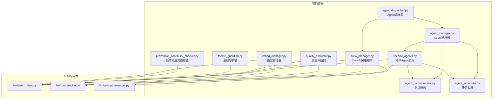

**图表来源**
- [agents/specific_agents.py:1-505](file://agents/specific_agents.py#L1-L505)
- [agents/agent_manager.py:1-227](file://agents/agent_manager.py#L1-L227)
- [agents/agent_dispatcher.py:1-433](file://agents/agent_dispatcher.py#L1-L433)
- [agents/crew_manager.py:1-480](file://agents/crew_manager.py#L1-L480)
- [agents/agent_communicator.py:1-180](file://agents/agent_communicator.py#L1-L180)
- [agents/agent_scheduler.py:1-488](file://agents/agent_scheduler.py#L1-L488)
- [agents/quality_evaluator.py:1-219](file://agents/quality_evaluator.py#L1-L219)
- [agents/theme_guardian.py:1-625](file://agents/theme_guardian.py#L1-L625)
- [agents/prevention_continuity_checker.py:1-715](file://agents/prevention_continuity_checker.py#L1-L715)
- [agents/voting_manager.py:1-281](file://agents/voting_manager.py#L1-L281)
- [llm/cost_tracker.py:1-74](file://llm/cost_tracker.py#L1-L74)

**章节来源**
- [agents/specific_agents.py:1-505](file://agents/specific_agents.py#L1-L505)
- [agents/agent_manager.py:1-227](file://agents/agent_manager.py#L1-L227)
- [agents/agent_dispatcher.py:1-433](file://agents/agent_dispatcher.py#L1-L433)
- [agents/crew_manager.py:1-480](file://agents/crew_manager.py#L1-L480)
- [agents/agent_communicator.py:1-180](file://agents/agent_communicator.py#L1-L180)
- [agents/agent_scheduler.py:1-488](file://agents/agent_scheduler.py#L1-L488)
- [agents/quality_evaluator.py:1-219](file://agents/quality_evaluator.py#L1-L219)
- [agents/theme_guardian.py:1-625](file://agents/theme_guardian.py#L1-L625)
- [agents/prevention_continuity_checker.py:1-715](file://agents/prevention_continuity_checker.py#L1-L715)
- [agents/voting_manager.py:1-281](file://agents/voting_manager.py#L1-L281)
- [llm/cost_tracker.py:1-74](file://llm/cost_tracker.py#L1-L74)

## 核心组件
- 市场分析Agent：负责市场调研与趋势分析，产出市场洞察与推荐标签。
- 内容策划Agent：基于市场分析与用户偏好，生成小说标题、题材、标签、概要与内容计划。
- 创作Agent：依据内容计划、世界观、角色与上一章结尾，生成章节正文。
- 编辑Agent：对创作草稿进行润色与优化，输出编辑后内容。
- 发布Agent：模拟发布流程，记录平台发布状态与标识。

上述Agent均继承统一的BaseAgent基类，具备统一的状态机、消息处理循环与任务队列，支持异步并发与错误恢复。

**更新** 新增质量评估、主题守护、连贯性检查和投票管理等智能体，形成完整的质量保障体系。

**章节来源**
- [agents/specific_agents.py:15-505](file://agents/specific_agents.py#L15-L505)
- [agents/agent_scheduler.py:103-220](file://agents/agent_scheduler.py#L103-L220)

## 架构总览
系统提供两种执行路径：
- 基于调度器的Agent系统：通过AgentScheduler提交与调度任务，Agent按依赖链串行执行，适合可控的流水线式工作流。
- CrewAI风格编排：由CrewManager直接调用LLM，按阶段顺序执行，适合快速原型与端到端编排。

**更新** 当前系统采用临时降级策略：默认使用CrewManager执行完整流程，当基于调度器的功能不完善时自动降级到CrewManager。

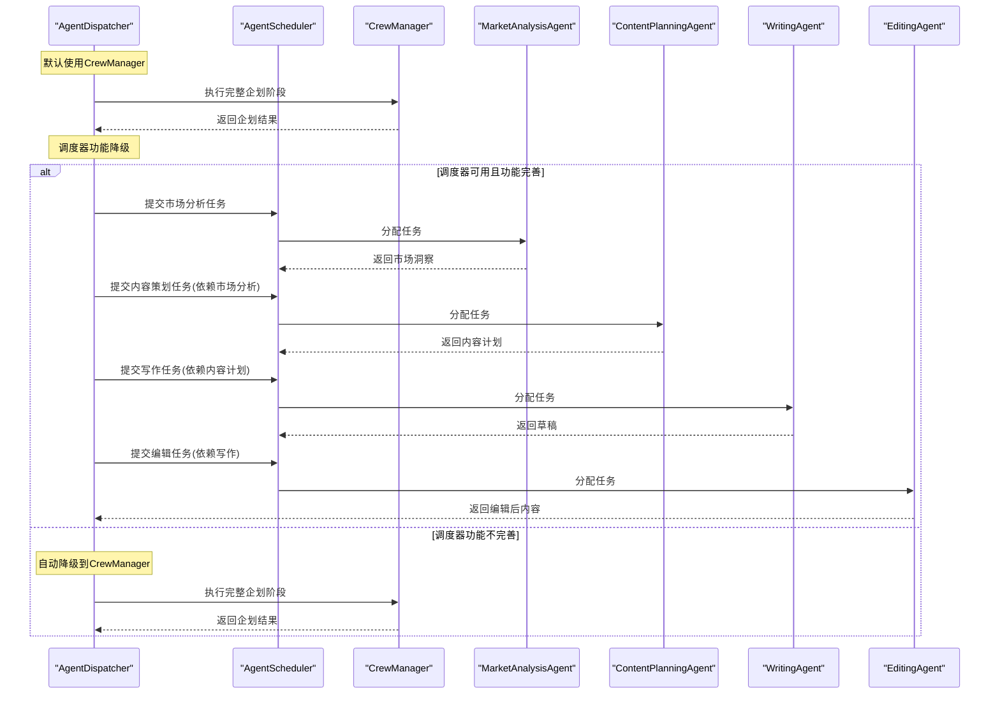

**图表来源**
- [agents/agent_dispatcher.py:64-162](file://agents/agent_dispatcher.py#L64-L162)
- [agents/agent_dispatcher.py:164-188](file://agents/agent_dispatcher.py#L164-L188)
- [agents/agent_dispatcher.py:156-158](file://agents/agent_dispatcher.py#L156-L158)
- [agents/agent_scheduler.py:253-379](file://agents/agent_scheduler.py#L253-L379)
- [agents/specific_agents.py:37-113](file://agents/specific_agents.py#L37-L113)
- [agents/specific_agents.py:137-214](file://agents/specific_agents.py#L137-L214)
- [agents/specific_agents.py:238-320](file://agents/specific_agents.py#L238-L320)
- [agents/specific_agents.py:344-423](file://agents/specific_agents.py#L344-L423)

## 详细组件分析

### 市场分析Agent（MarketAnalysisAgent）
- 职责边界：收集市场数据，结合平台与题材标签，输出趋势话题、热门题材与推荐标签。
- 输入：市场数据、平台、题材与标签上下文。
- 输出：包含平台、趋势话题、热门题材、推荐标签与市场洞察的结构化结果。
- 决策逻辑：使用PromptManager格式化提示词，调用QwenClient进行分析，记录Token用量。
- 错误处理：捕获异常并置状态为错误，最终复位为空闲。

**图表来源**
- [agents/specific_agents.py:37-113](file://agents/specific_agents.py#L37-L113)
- [llm/cost_tracker.py:26-56](file://llm/cost_tracker.py#L26-L56)

**章节来源**
- [agents/specific_agents.py:15-113](file://agents/specific_agents.py#L15-L113)
- [llm/cost_tracker.py:1-74](file://llm/cost_tracker.py#L1-L74)

### 内容策划Agent（ContentPlanningAgent）
- 职责边界：整合市场分析与用户偏好，生成小说标题、题材、标签、概要与内容计划。
- 输入：市场分析结果、用户偏好（题材、标签、上下文）。
- 输出：包含标题、题材、标签、概要、受众与内容计划的结构化结果。
- 决策逻辑：格式化提示词，调用QwenClient，记录Token用量。

**图表来源**
- [agents/specific_agents.py:137-214](file://agents/specific_agents.py#L137-L214)
- [llm/cost_tracker.py:26-56](file://llm/cost_tracker.py#L26-L56)

**章节来源**
- [agents/specific_agents.py:115-214](file://agents/specific_agents.py#L115-L214)
- [llm/cost_tracker.py:1-74](file://llm/cost_tracker.py#L1-L74)

### 创作Agent（WritingAgent）
- 职责边界：根据内容计划、章节序号、世界观、角色与上一章结尾，生成章节正文。
- 输入：内容计划、章节号、世界设定、角色列表、情节大纲、上一章结尾。
- 输出：包含章节号、标题、正文与字数的结果。
- 决策逻辑：格式化提示词，调用QwenClient，记录Token用量。

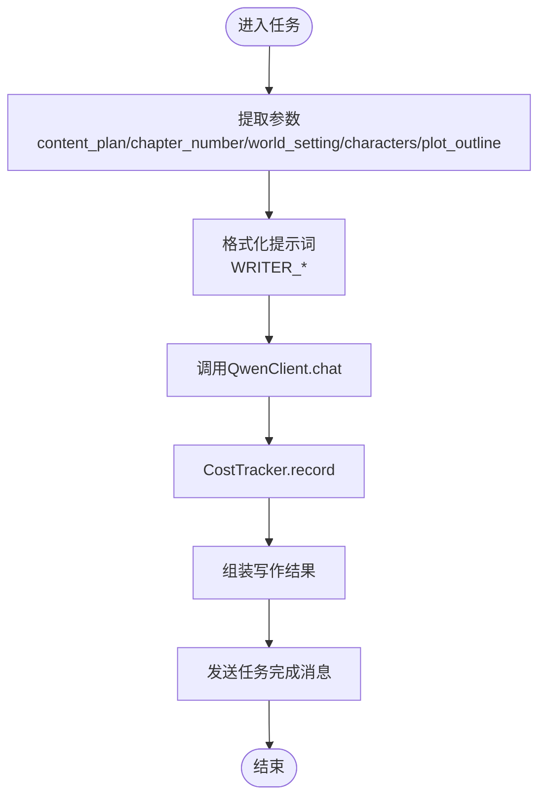

**图表来源**
- [agents/specific_agents.py:238-320](file://agents/specific_agents.py#L238-L320)
- [llm/cost_tracker.py:26-56](file://llm/cost_tracker.py#L26-L56)

**章节来源**
- [agents/specific_agents.py:216-320](file://agents/specific_agents.py#L216-L320)
- [llm/cost_tracker.py:1-74](file://llm/cost_tracker.py#L1-L74)

### 编辑Agent（EditingAgent）
- 职责边界：对创作草稿进行润色与优化，输出编辑后内容。
- 输入：草稿内容、章节号、章节标题、章节摘要。
- 输出：包含章节号、原始内容、编辑后内容与字数的结果。
- 决策逻辑：格式化提示词，调用QwenClient，记录Token用量。

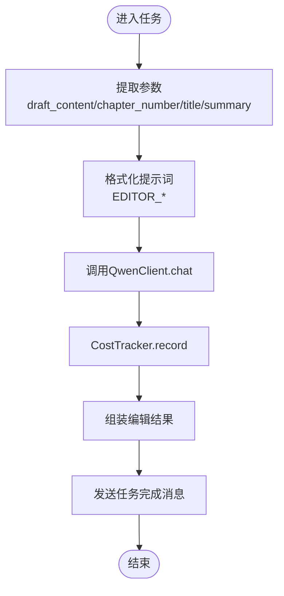

**图表来源**
- [agents/specific_agents.py:344-423](file://agents/specific_agents.py#L344-L423)
- [llm/cost_tracker.py:26-56](file://llm/cost_tracker.py#L26-L56)

**章节来源**
- [agents/specific_agents.py:322-423](file://agents/specific_agents.py#L322-L423)
- [llm/cost_tracker.py:1-74](file://llm/cost_tracker.py#L1-L74)

### 发布Agent（PublishingAgent）
- 职责边界：模拟发布流程，记录平台发布状态与标识。
- 输入：小说数据、章节数据、平台与账号信息。
- 输出：包含平台、书名、章节号、发布状态、时间戳与平台书/章节ID的结果。
- 决策逻辑：构造发布结果并发送任务完成消息（实际发布需扩展）。

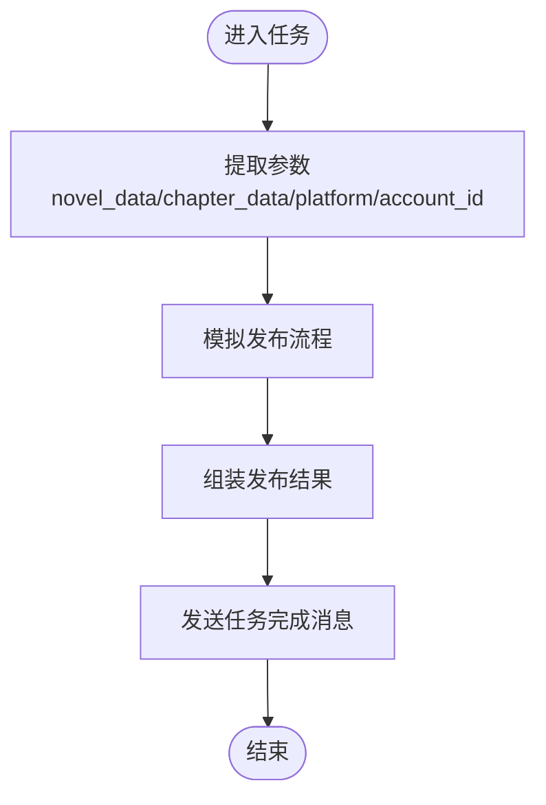

**图表来源**
- [agents/specific_agents.py:447-505](file://agents/specific_agents.py#L447-L505)

**章节来源**
- [agents/specific_agents.py:425-505](file://agents/specific_agents.py#L425-L505)

### Agent管理器（AgentManager）
- 职责边界：单例管理器，负责初始化通信、调度器、LLM客户端与成本追踪器，并创建与注册所有Agent。
- 生命周期：initialize → start → stop；提供查询Agent状态与获取实例的方法。

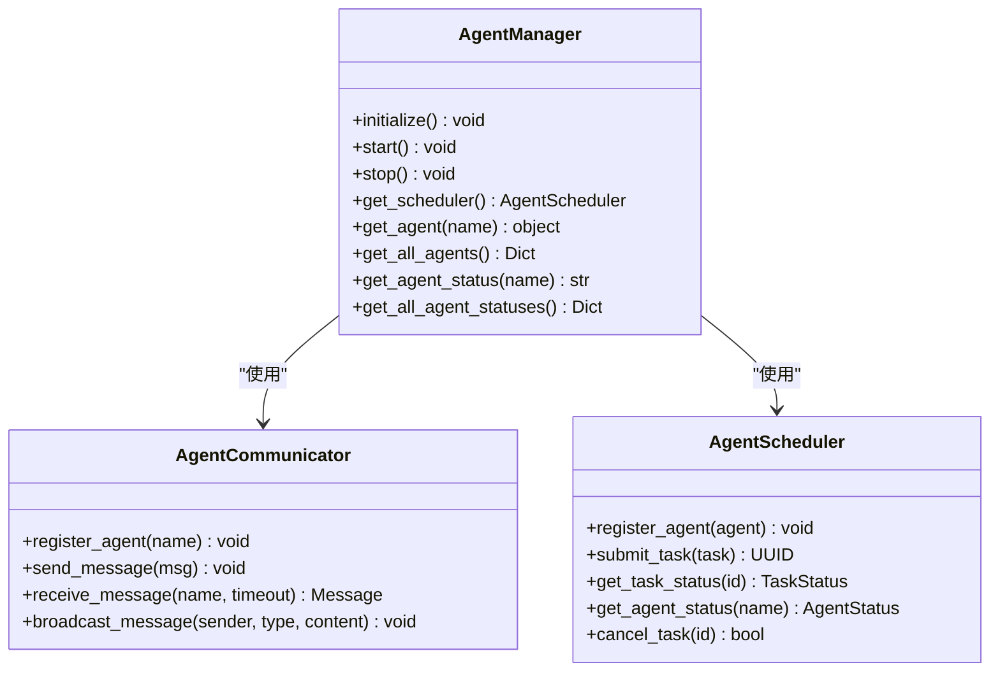

**图表来源**
- [agents/agent_manager.py:22-227](file://agents/agent_manager.py#L22-L227)
- [agents/agent_communicator.py:72-180](file://agents/agent_communicator.py#L72-L180)
- [agents/agent_scheduler.py:222-488](file://agents/agent_scheduler.py#L222-L488)

**章节来源**
- [agents/agent_manager.py:1-227](file://agents/agent_manager.py#L1-L227)

### Agent调度器（AgentScheduler）与通信（AgentCommunicator）
- 通信机制：消息封装为Message，支持注册、发送、接收、广播与历史记录；Agent通过队列异步处理任务。
- 调度机制：维护任务生命周期（待处理、已分配、运行中、已完成、失败、取消），按优先级与依赖关系分配空闲Agent。

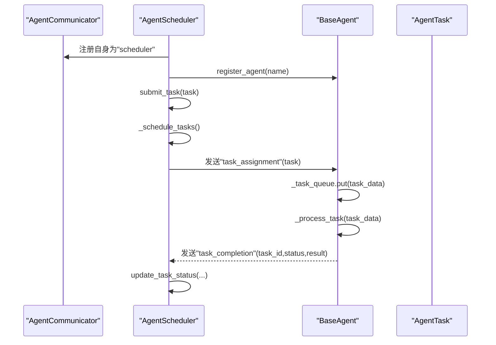

**图表来源**
- [agents/agent_scheduler.py:222-488](file://agents/agent_scheduler.py#L222-L488)
- [agents/agent_communicator.py:72-180](file://agents/agent_communicator.py#L72-L180)

**章节来源**
- [agents/agent_scheduler.py:1-488](file://agents/agent_scheduler.py#L1-L488)
- [agents/agent_communicator.py:1-180](file://agents/agent_communicator.py#L1-L180)

### CrewAI风格编排（CrewManager）
- 职责边界：以阶段顺序编排多个Agent（主题分析、世界观、角色、情节架构、章节策划、作家、编辑、连续性审查），直接调用QwenClient并追踪成本。
- 数据流转：各阶段输出作为下一阶段输入，支持JSON与纯文本混合返回，统一通过CostTracker记录成本。

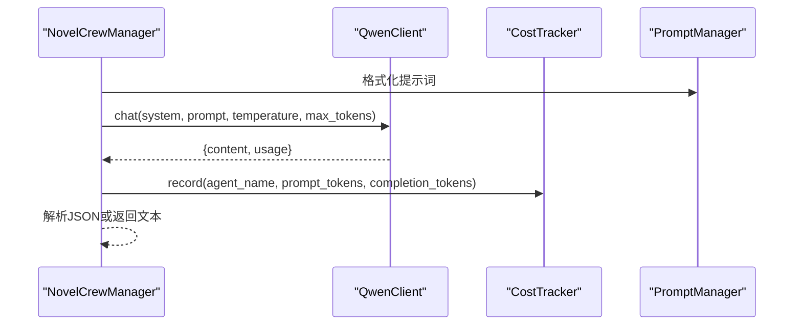

**图表来源**
- [agents/crew_manager.py:104-163](file://agents/crew_manager.py#L104-L163)
- [agents/crew_manager.py:168-302](file://agents/crew_manager.py#L168-L302)
- [agents/crew_manager.py:308-480](file://agents/crew_manager.py#L308-L480)

**章节来源**
- [agents/crew_manager.py:1-480](file://agents/crew_manager.py#L1-L480)

### Agent调度器（AgentDispatcher）
- 职责边界：在"基于调度器的Agent系统"与"CrewAI风格编排"之间切换；在前者模式下，按依赖链提交任务并等待完成；在后者模式下，委托CrewManager执行。
- 关键流程：run_planning、run_chapter_writing、run_batch_writing；支持超时等待与错误回退。
- **更新** 默认使用CrewManager，当调度器功能不完善时自动降级到CrewManager。

**图表来源**
- [agents/agent_dispatcher.py:53-170](file://agents/agent_dispatcher.py#L53-L170)
- [agents/agent_dispatcher.py:171-196](file://agents/agent_dispatcher.py#L171-L196)
- [agents/agent_dispatcher.py:156-158](file://agents/agent_dispatcher.py#L156-L158)

**章节来源**
- [agents/agent_dispatcher.py:1-433](file://agents/agent_dispatcher.py#L1-L433)

## 新增智能体详解

### 质量评估智能体（QualityEvaluator）
- 职责边界：对章节内容进行多维度质量评估，提供综合评分与改进建议。
- 输入：章节文本、章节计划（可选）、质量阈值。
- 输出：包含整体评分、维度评分、问题列表、改进建议的质量报告。
- 决策逻辑：支持5个维度评估（语言流畅度、情节逻辑、角色一致性、节奏把控、爽感设计），使用加权计算得出综合评分。
- 错误处理：评估失败时返回默认通过报告，确保流程不中断。

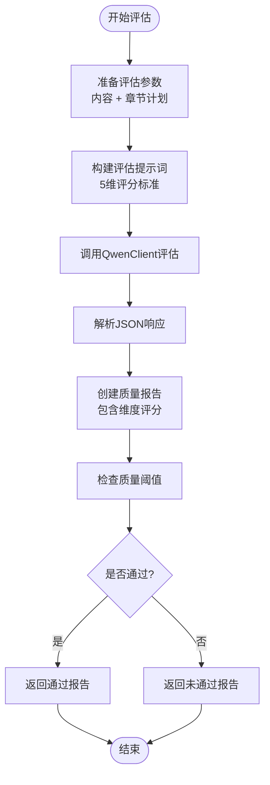

**图表来源**
- [agents/quality_evaluator.py:96-149](file://agents/quality_evaluator.py#L96-L149)

**章节来源**
- [agents/quality_evaluator.py:1-219](file://agents/quality_evaluator.py#L1-L219)
- [agents/base/quality_report.py:288-347](file://agents/base/quality_report.py#L288-L347)

### 主题守护智能体（ThemeGuardian）
- 职责边界：定义小说核心主题，审查章节计划的主题一致性，提供修正建议。
- 输入：小说数据、章节计划、章节号。
- 输出：包含主题一致性评分、问题列表、改进建议的审查报告。
- 决策逻辑：从小说数据推断核心主题，检查主线推进度、角色动机一致性、支线相关度、主题表达度四个维度。
- 错误处理：记录审查历史，提供统计信息。

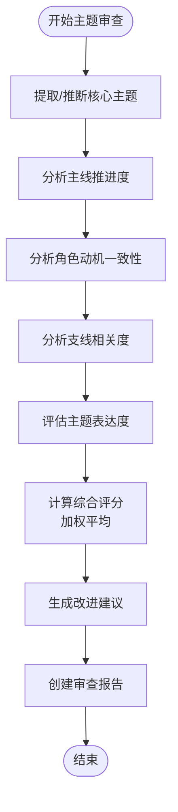

**图表来源**
- [agents/theme_guardian.py:233-294](file://agents/theme_guardian.py#L233-L294)

**章节来源**
- [agents/theme_guardian.py:1-625](file://agents/theme_guardian.py#L1-L625)

### 预防式连贯性检查智能体（PreventionContinuityChecker）
- 职责边界：在章节生成前检查策划的连贯性，识别潜在问题并提供修正建议。
- 输入：当前章节策划、上一章信息、约束列表、章节号。
- 输出：包含约束回应、情节一致性、剧情推进评分的检查报告。
- 决策逻辑：检查约束回应（高优先级约束必须回应）、情节一致性（地点、角色、时间、状态连续性）、剧情推进（主要事件、冲突推进、角色发展）。
- 错误处理：自动修正策划，提供详细的改进建议。

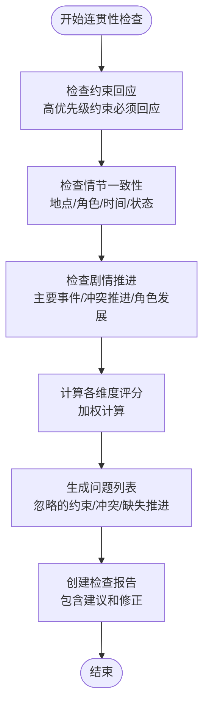

**图表来源**
- [agents/prevention_continuity_checker.py:237-300](file://agents/prevention_continuity_checker.py#L237-L300)

**章节来源**
- [agents/prevention_continuity_checker.py:1-715](file://agents/prevention_continuity_checker.py#L1-L715)

### 投票共识管理器（VotingManager）
- 职责边界：协调多个智能体对关键决策进行投票，通过加权置信度计算获胜方案。
- 输入：决策主题、可选方案列表、当前创作上下文、投票者列表。
- 输出：包含获胜方案、共识强度、投票详情的投票结果。
- 决策逻辑：并行收集各投票者的投票，使用置信度加权计算，支持模糊匹配和JSON解析。
- 错误处理：过滤无效投票，记录投票失败信息。

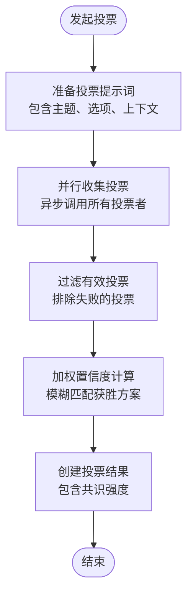

**图表来源**
- [agents/voting_manager.py:85-140](file://agents/voting_manager.py#L85-L140)

**章节来源**
- [agents/voting_manager.py:1-281](file://agents/voting_manager.py#L1-L281)

## 审查循环系统

### 质量评估报告基类（BaseQualityReport）
- 职责边界：提供所有审查循环共享的质量评估报告基础结构，支持不同领域的扩展。
- 功能特性：安全提取overall_score、维度平均分计算、问题合并、统计方法。
- 扩展支持：WorldQualityReport、CharacterQualityReport、PlotQualityReport、ChapterQualityReport等子类。

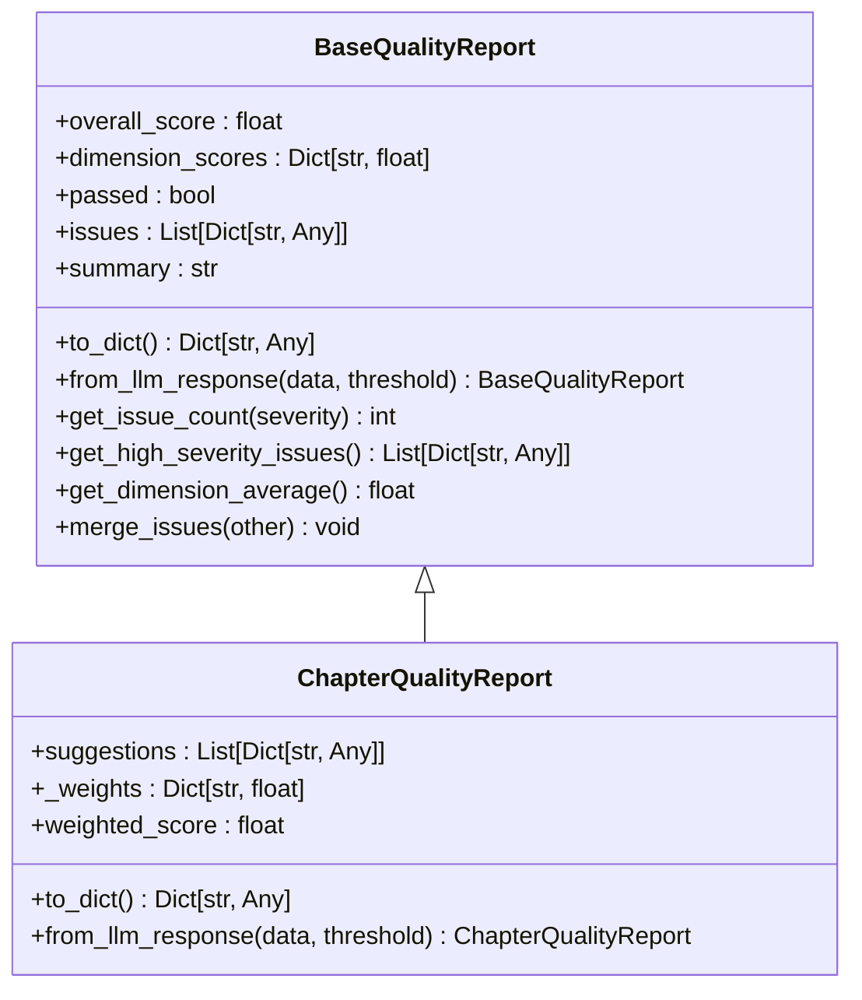

**图表来源**
- [agents/base/quality_report.py:44-191](file://agents/base/quality_report.py#L44-L191)
- [agents/base/quality_report.py:288-347](file://agents/base/quality_report.py#L288-L347)

**章节来源**
- [agents/base/quality_report.py:1-347](file://agents/base/quality_report.py#L1-L347)

### 审查循环处理器（ReviewLoopHandler）
- 职责边界：实现Writer-Editor审查反馈循环，支持多轮迭代优化。
- 工作流程：Writer生成内容 → Editor审查评分+润色 → Writer修订 → 重复直到达标。
- 增强功能：Editor效果验证、问题追踪、进度摘要、停滞检测、动态迭代策略。

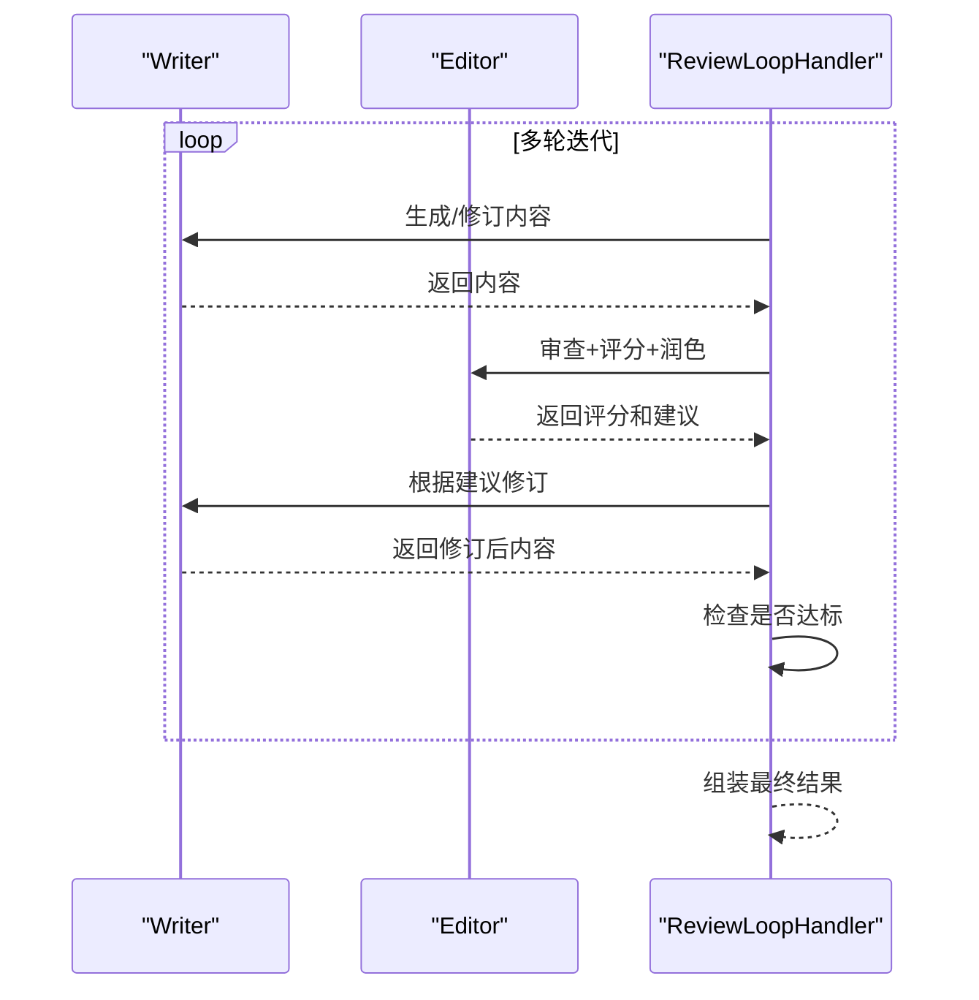

**图表来源**
- [agents/review_loop.py:113-153](file://agents/review_loop.py#L113-L153)

**章节来源**
- [agents/review_loop.py:1-681](file://agents/review_loop.py#L1-L681)
- [agents/base/review_loop_base.py:598-800](file://agents/base/review_loop_base.py#L598-L800)
- [agents/base/review_result.py:23-127](file://agents/base/review_result.py#L23-L127)

## 依赖分析
- 组件耦合
  - specific_agents依赖agent_communicator、agent_scheduler、llm.qwen_client、llm.prompt_manager、llm.cost_tracker。
  - agent_manager聚合Agent、通信与调度器，提供全局访问。
  - agent_dispatcher在两种模式间切换，依赖agent_manager与crew_manager。
  - crew_manager直接依赖qwen_client与cost_tracker，通过prompt_manager格式化提示词。
  - **新增智能体**：quality_evaluator依赖qwen_client和cost_tracker；theme_guardian处理主题定义和审查；prevention_continuity_checker处理连贯性检查；voting_manager协调多智能体投票。
- 外部依赖
  - LLM调用与Token计费；日志系统贯穿各模块。

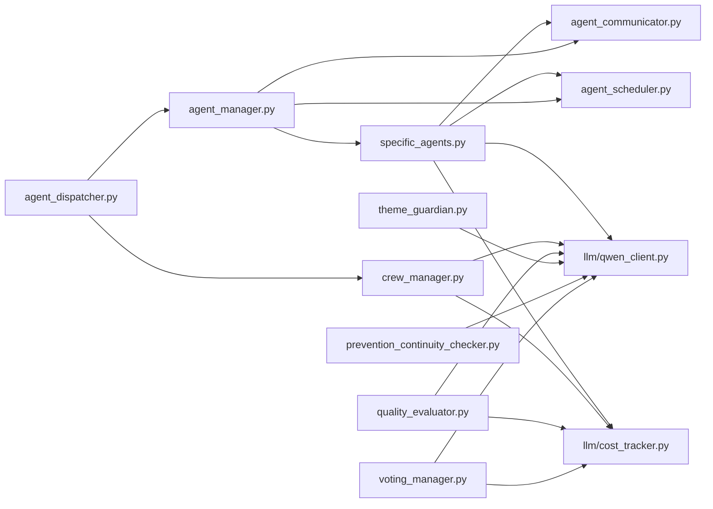

**图表来源**
- [agents/specific_agents.py:1-505](file://agents/specific_agents.py#L1-L505)
- [agents/agent_manager.py:1-227](file://agents/agent_manager.py#L1-L227)
- [agents/agent_dispatcher.py:1-433](file://agents/agent_dispatcher.py#L1-L433)
- [agents/crew_manager.py:1-480](file://agents/crew_manager.py#L1-L480)
- [agents/agent_communicator.py:1-180](file://agents/agent_communicator.py#L1-L180)
- [agents/agent_scheduler.py:1-488](file://agents/agent_scheduler.py#L1-L488)
- [agents/quality_evaluator.py:1-219](file://agents/quality_evaluator.py#L1-L219)
- [agents/theme_guardian.py:1-625](file://agents/theme_guardian.py#L1-L625)
- [agents/prevention_continuity_checker.py:1-715](file://agents/prevention_continuity_checker.py#L1-L715)
- [agents/voting_manager.py:1-281](file://agents/voting_manager.py#L1-L281)

**章节来源**
- [agents/specific_agents.py:1-505](file://agents/specific_agents.py#L1-L505)
- [agents/agent_manager.py:1-227](file://agents/agent_manager.py#L1-L227)
- [agents/agent_dispatcher.py:1-433](file://agents/agent_dispatcher.py#L1-L433)
- [agents/crew_manager.py:1-480](file://agents/crew_manager.py#L1-L480)
- [agents/agent_communicator.py:1-180](file://agents/agent_communicator.py#L1-L180)
- [agents/agent_scheduler.py:1-488](file://agents/agent_scheduler.py#L1-L488)
- [agents/quality_evaluator.py:1-219](file://agents/quality_evaluator.py#L1-L219)
- [agents/theme_guardian.py:1-625](file://agents/theme_guardian.py#L1-L625)
- [agents/prevention_continuity_checker.py:1-715](file://agents/prevention_continuity_checker.py#L1-L715)
- [agents/voting_manager.py:1-281](file://agents/voting_manager.py#L1-L281)

## 性能考虑
- Token与成本控制
  - 使用CostTracker记录prompt与completion token，按模型定价计算累计成本，便于预算控制与成本优化。
  - 不同Agent的temperature与max_tokens已针对任务特性进行设置，建议在生产环境结合SLA与成本目标微调。
- 异步与并发
  - Agent通过消息队列与任务队列异步处理，避免阻塞；调度器按优先级与依赖分配任务，减少空闲等待。
  - **新增智能体**：QualityEvaluator、PreventionContinuityChecker、VotingManager均支持异步操作，提高系统吞吐量。
- 超时与重试
  - 调度器等待任务完成时设置超时；建议在Agent内部增加指数退避与重试策略，提升鲁棒性。
  - **新增投票管理器**：支持并行投票收集，使用异步gather提高效率。
- 批量写作
  - 批量写作采用顺序执行并记录失败章节，便于定位问题；可扩展为并行执行并带进度统计。
- **更新** 降级策略优化
  - 默认使用CrewManager确保功能完整性，避免调度器功能不完善导致的流程中断。
  - 自动降级机制减少人工干预，提高系统稳定性。
- **新增质量评估优化**
  - ChapterQualityReport支持加权总分计算，特别强调爽感设计（30%权重），符合网络小说特点。
  - QualityEvaluator提供详细的评分标准，支持JSON解析和错误恢复。

**章节来源**
- [llm/cost_tracker.py:1-74](file://llm/cost_tracker.py#L1-L74)
- [agents/agent_scheduler.py:313-329](file://agents/agent_scheduler.py#L313-L329)
- [agents/agent_dispatcher.py:265-304](file://agents/agent_dispatcher.py#L265-L304)
- [agents/quality_evaluator.py:120-149](file://agents/quality_evaluator.py#L120-L149)
- [agents/voting_manager.py:111-140](file://agents/voting_manager.py#L111-L140)

## 故障排查指南
- 常见问题
  - Agent未注册：检查AgentManager.initialize与AgentCommunicator.register_agent。
  - 任务无进展：确认调度器依赖满足、Agent状态为IDLE、消息队列非空。
  - LLM调用失败：查看CostTracker记录与日志，确认模型参数与网络连通性。
  - 发布Agent未实现：当前为模拟实现，需扩展实际发布服务。
  - **更新** 调度器功能不完善：系统会自动降级到CrewManager，无需手动干预。
  - **新增智能体问题**：
    - QualityEvaluator评估失败：检查JSON解析和提示词格式。
    - ThemeGuardian主题推断失败：验证小说数据结构。
    - PreventionContinuityChecker检查异常：确认约束格式和章节数据。
    - VotingManager投票失败：检查投票者配置和JSON输出格式。
- 排查步骤
  - 获取Agent状态：AgentDispatcher.get_agent_statuses。
  - 查看消息历史：AgentCommunicator.get_message_history。
  - 检查任务状态：AgentScheduler.get_task_status与update_task_status。
  - 回退到CrewAI风格：AgentDispatcher.set_use_scheduled_agents(False)。
  - **更新** 检查降级状态：观察日志中的降级警告信息。
  - **新增智能体调试**：
    - 质量评估：检查ChapterQualityReport的权重配置和维度评分。
    - 主题守护：验证ThemeDefinition的推断逻辑和审查报告。
    - 连贯性检查：确认约束列表格式和检查报告的维度评分。
    - 投票管理：检查投票者配置和加权计算结果。

**章节来源**
- [agents/agent_communicator.py:158-176](file://agents/agent_communicator.py#L158-L176)
- [agents/agent_scheduler.py:380-405](file://agents/agent_scheduler.py#L380-L405)
- [agents/agent_dispatcher.py:305-312](file://agents/agent_dispatcher.py#L305-L312)
- [agents/quality_evaluator.py:142-149](file://agents/quality_evaluator.py#L142-L149)
- [agents/theme_guardian.py:286-293](file://agents/theme_guardian.py#L286-L293)
- [agents/prevention_continuity_checker.py:292-299](file://agents/prevention_continuity_checker.py#L292-L299)
- [agents/voting_manager.py:131-132](file://agents/voting_manager.py#L131-L132)

## 结论
该智能体系统通过统一的通信与调度框架，实现了从市场分析到发布的端到端自动化流程。当前采用临时降级策略：默认使用CrewManager确保完整的企划阶段执行，当基于调度器的功能不完善时自动降级到CrewManager。两种执行模式互补：基于调度器的Agent系统强调可控与可观测，CrewAI风格编排强调快速落地。配合成本追踪与状态监控，系统具备良好的可扩展性与运维能力。

**更新** 新增的质量评估、主题守护、连贯性检查和投票管理等智能体，形成了更加完善的质量保障体系。质量评估支持五维评分和加权计算，主题守护确保内容主题一致性，预防式连贯性检查在生成前发现问题，投票管理器协调多智能体决策。这些新增功能显著提升了系统的智能化水平和内容质量保证能力。

后续可在发布Agent、批量写作与错误恢复方面进一步增强，同时完善调度器功能以支持更完整的自动化流程。新增智能体的集成也为未来的功能扩展奠定了坚实基础。

## 附录
- 配置参数建议
  - temperature与max_tokens：根据Agent职责与输出稳定性调整。
  - 任务优先级：高价值流程（如内容策划）可设为HIGH，编辑可设为MEDIUM。
  - 超时时间：根据LLM响应时间与业务SLA设置。
  - **更新** 调度器模式：默认使用CrewManager，仅在调度器功能完善时启用基于调度器的Agent系统。
  - **新增智能体配置**：
    - QualityEvaluator：默认阈值7.5，支持自定义阈值和维度权重。
    - ThemeGuardian：主题权重配置，审查阈值7.0。
    - PreventionContinuityChecker：约束权重0.4，一致性权重0.35，进度权重0.25。
    - VotingManager：投票者置信度加权，支持模糊匹配。
- 最佳实践
  - 明确Agent职责边界，避免跨Agent重复计算。
  - 使用CostTracker定期导出成本报表，持续优化提示词与参数。
  - 在关键节点增加幂等与重试机制，保障可靠性。
  - **更新** 监控降级状态：关注调度器功能完善进度，及时启用基于调度器的Agent系统。
  - **新增智能体使用建议**：
    - 质量评估：在编辑循环中集成QualityEvaluator进行独立质量验证。
    - 主题守护：在章节策划阶段使用ThemeGuardian进行主题一致性检查。
    - 连贯性检查：在生成前使用PreventionContinuityChecker进行预防式检查。
    - 投票管理：对关键创作决策使用VotingManager进行多智能体共识。

**章节来源**
- [agents/quality_evaluator.py:86-94](file://agents/quality_evaluator.py#L86-L94)
- [agents/theme_guardian.py:495-519](file://agents/theme_guardian.py#L495-L519)
- [agents/prevention_continuity_checker.py:114-122](file://agents/prevention_continuity_checker.py#L114-L122)
- [agents/voting_manager.py:172-211](file://agents/voting_manager.py#L172-L211)
- [agents/review_loop.py:91-97](file://agents/review_loop.py#L91-L97)