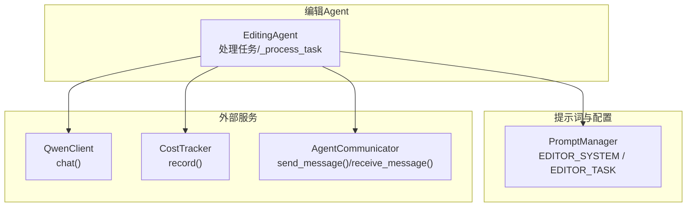
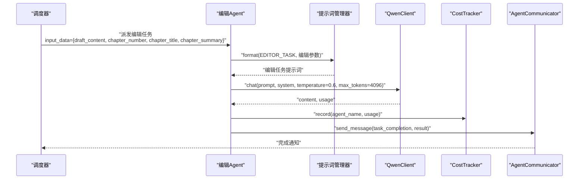
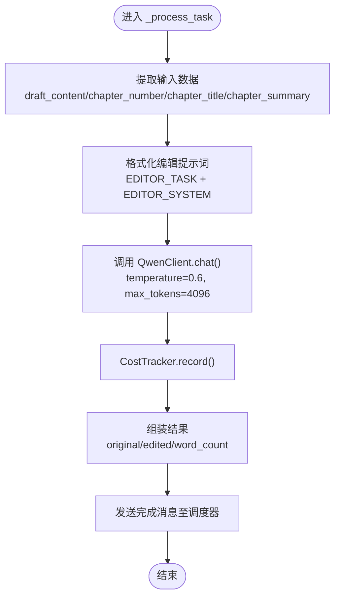
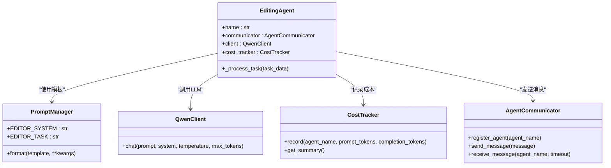
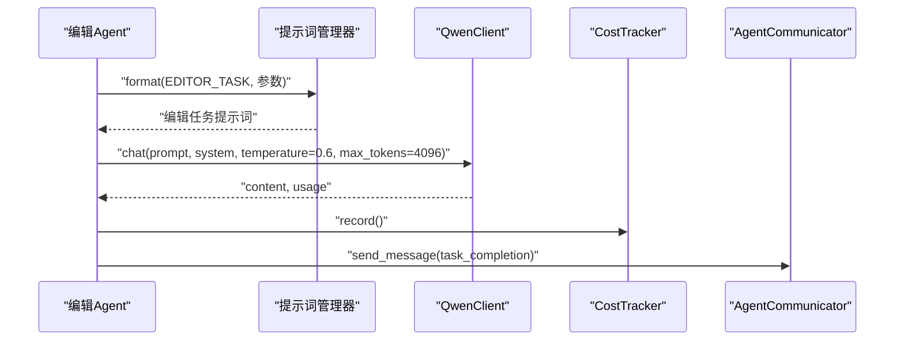

# 编辑Agent

<cite>
**本文引用的文件**
- [agents/specific_agents.py](file://agents/specific_agents.py)
- [llm/qwen_client.py](file://llm/qwen_client.py)
- [agents/agent_communicator.py](file://agents/agent_communicator.py)
- [llm/cost_tracker.py](file://llm/cost_tracker.py)
- [llm/prompt_manager.py](file://llm/prompt_manager.py)
</cite>

## 目录
1. [简介](#简介)
2. [项目结构](#项目结构)
3. [核心组件](#核心组件)
4. [架构总览](#架构总览)
5. [详细组件分析](#详细组件分析)
6. [依赖关系分析](#依赖关系分析)
7. [性能与成本考量](#性能与成本考量)
8. [故障排查指南](#故障排查指南)
9. [结论](#结论)
10. [附录：编辑流程与提示词模板](#附录编辑流程与提示词模板)

## 简介
本文件面向“编辑Agent”的专业技术文档，聚焦其在创作内容质量控制方面的实现与架构。文档将系统阐述编辑Agent如何接收草稿与上下文信息，构建编辑提示词，调用大模型进行润色与优化，并通过通信与成本模块完成任务闭环。同时，我们将解释较低温度参数与较大token上限的配置策略，给出从草稿接收、编辑指令构建、LLM调用到优化内容生成的完整流程，并提供编辑前后对比、字数统计与质量评估建议。

## 项目结构
编辑Agent位于多智能体协作体系中，负责对创作阶段产出的章节草稿进行质量控制与语言优化。其核心交互涉及：
- 任务输入：草稿内容、章节编号、章节标题、章节摘要
- 提示词模板：编辑系统提示与编辑任务提示
- 大模型调用：温度0.6、最大token 4096
- 结果输出：原始内容、优化后内容、字数统计
- 通信与成本：消息传递、成本记录

图表来源
- [agents/specific_agents.py](file://agents/specific_agents.py#L322-L422)
- [llm/prompt_manager.py](file://llm/prompt_manager.py#L307-L317)
- [llm/qwen_client.py](file://llm/qwen_client.py#L46-L64)
- [llm/cost_tracker.py](file://llm/cost_tracker.py#L26-L56)
- [agents/agent_communicator.py](file://agents/agent_communicator.py#L91-L136)

章节来源
- [agents/specific_agents.py](file://agents/specific_agents.py#L322-L422)

## 核心组件
- 编辑Agent（EditingAgent）：负责接收草稿与上下文，格式化编辑提示词，调用大模型，记录成本，回传结果。
- 提示词管理器（PromptManager）：提供编辑系统提示与编辑任务提示模板。
- 通义千问客户端（QwenClient）：封装DashScope/OpenAI兼容模式的异步调用，支持重试与流式输出。
- 成本追踪器（CostTracker）：按模型定价计算prompt/completion token成本并累计。
- Agent通信器（AgentCommunicator）：提供Agent间消息注册、发送、接收与广播能力。

章节来源
- [agents/specific_agents.py](file://agents/specific_agents.py#L322-L422)
- [llm/prompt_manager.py](file://llm/prompt_manager.py#L307-L317)
- [llm/qwen_client.py](file://llm/qwen_client.py#L46-L64)
- [llm/cost_tracker.py](file://llm/cost_tracker.py#L26-L56)
- [agents/agent_communicator.py](file://agents/agent_communicator.py#L72-L136)

## 架构总览
编辑Agent在多Agent流水线中的位置如下：

图表来源
- [agents/specific_agents.py](file://agents/specific_agents.py#L344-L422)
- [llm/prompt_manager.py](file://llm/prompt_manager.py#L307-L317)
- [llm/qwen_client.py](file://llm/qwen_client.py#L46-L64)
- [llm/cost_tracker.py](file://llm/cost_tracker.py#L26-L56)
- [agents/agent_communicator.py](file://agents/agent_communicator.py#L91-L136)

## 详细组件分析

### 编辑Agent（EditingAgent）
- 输入数据处理
  - 接收字段：草稿内容、章节编号、章节标题、章节摘要
  - 默认值策略：若缺少章节标题则以“第N章”形式生成
- 提示词构建
  - 使用编辑任务模板与系统模板，注入草稿、章节号、标题、摘要
- LLM调用
  - 温度0.6：强调确定性与一致性，适合编辑场景
  - 最大token 4096：保障长文本润色空间
- 结果处理
  - 输出包含原始内容、优化后内容、字数统计
  - 通过Agent通信器向调度器上报完成状态

图表来源
- [agents/specific_agents.py](file://agents/specific_agents.py#L344-L422)
- [llm/prompt_manager.py](file://llm/prompt_manager.py#L307-L317)
- [llm/cost_tracker.py](file://llm/cost_tracker.py#L26-L56)
- [agents/agent_communicator.py](file://agents/agent_communicator.py#L91-L136)

章节来源
- [agents/specific_agents.py](file://agents/specific_agents.py#L322-L422)

### 提示词模板（EDITOR_SYSTEM / EDITOR_TASK）
- 编辑系统提示（EDITOR_SYSTEM）：定义编辑角色与职责，确保输出风格与质量标准一致
- 编辑任务提示（EDITOR_TASK）：注入草稿内容、章节号、标题、摘要，指导模型进行针对性润色与优化

章节来源
- [llm/prompt_manager.py](file://llm/prompt_manager.py#L307-L317)

### 通义千问客户端（QwenClient）
- 支持两种模式：DashScope SDK与OpenAI兼容模式
- 异步调用与重试机制，保证稳定性
- 返回内容与token用量，供成本追踪使用

章节来源
- [llm/qwen_client.py](file://llm/qwen_client.py#L46-L64)

### 成本追踪器（CostTracker）
- 按模型定价计算prompt与completion token成本
- 累计总成本与调用次数，便于运营与预算控制

章节来源
- [llm/cost_tracker.py](file://llm/cost_tracker.py#L26-L56)

### Agent通信器（AgentCommunicator）
- 提供消息注册、发送、接收、广播与历史查询
- 保障编辑Agent与调度器之间的可靠通信

章节来源
- [agents/agent_communicator.py](file://agents/agent_communicator.py#L72-L136)

## 依赖关系分析
编辑Agent的内部依赖关系如下：

图表来源
- [agents/specific_agents.py](file://agents/specific_agents.py#L322-L422)
- [llm/prompt_manager.py](file://llm/prompt_manager.py#L307-L317)
- [llm/qwen_client.py](file://llm/qwen_client.py#L46-L64)
- [llm/cost_tracker.py](file://llm/cost_tracker.py#L26-L56)
- [agents/agent_communicator.py](file://agents/agent_communicator.py#L72-L136)

## 性能与成本考量
- 温度参数（0.6）
  - 降低创造性，提升输出稳定性和一致性，适合编辑场景
- 最大token（4096）
  - 保障长文本润色空间，避免截断导致的语义不完整
- 成本控制
  - 通过CostTracker记录每次调用的prompt与completion token，结合模型定价计算累计成本
  - 建议在批量编辑时监控调用次数与总token消耗，合理规划预算

章节来源
- [agents/specific_agents.py](file://agents/specific_agents.py#L378-L381)
- [llm/cost_tracker.py](file://llm/cost_tracker.py#L26-L56)

## 故障排查指南
- 编辑任务失败
  - 检查输入数据是否完整（草稿、章节号、标题、摘要）
  - 查看日志中的错误信息，定位异常点
- LLM调用异常
  - 确认API密钥、模型与基础URL配置正确
  - 观察重试机制是否生效
- 通信问题
  - 确认调度器已注册并可接收消息
  - 检查消息队列状态与超时设置

章节来源
- [agents/specific_agents.py](file://agents/specific_agents.py#L418-L422)
- [llm/qwen_client.py](file://llm/qwen_client.py#L54-L64)
- [agents/agent_communicator.py](file://agents/agent_communicator.py#L91-L136)

## 结论
编辑Agent通过明确的输入规范、严谨的提示词模板与稳定的LLM调用配置，实现了对创作内容的高质量控制。较低温度与较大token上限的组合，兼顾了编辑的一致性与长文本处理能力；配合成本追踪与消息通信机制，形成了可运维、可观测的任务闭环。建议在实际应用中持续监控编辑结果质量与成本表现，迭代优化提示词与阈值参数。

## 附录：编辑流程与提示词模板

### 编辑流程（从草稿到优化内容）
- 接收草稿与上下文：草稿内容、章节编号、章节标题、章节摘要
- 构建编辑提示词：使用编辑任务模板与系统模板，注入上述参数
- 调用大模型：temperature=0.6，max_tokens=4096
- 记录成本：基于usage统计prompt与completion token
- 组装结果：包含原始内容、优化后内容、字数统计
- 通知调度器：发送完成消息，携带结果

图表来源
- [agents/specific_agents.py](file://agents/specific_agents.py#L366-L415)
- [llm/prompt_manager.py](file://llm/prompt_manager.py#L307-L317)
- [llm/qwen_client.py](file://llm/qwen_client.py#L46-L64)
- [llm/cost_tracker.py](file://llm/cost_tracker.py#L26-L56)
- [agents/agent_communicator.py](file://agents/agent_communicator.py#L91-L136)

### 提示词模板（节选）
- 编辑系统提示（EDITOR_SYSTEM）：定义编辑角色与职责
- 编辑任务提示（EDITOR_TASK）：注入草稿、章节号、标题、摘要，指导润色与优化

章节来源
- [llm/prompt_manager.py](file://llm/prompt_manager.py#L307-L317)