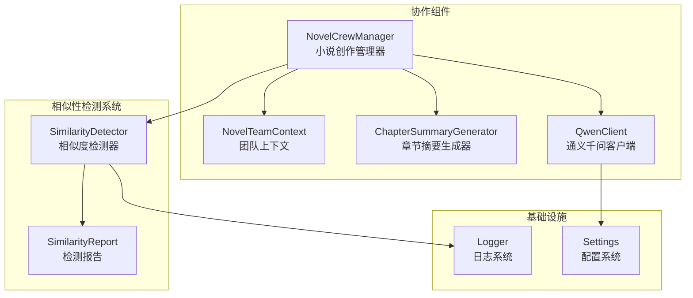
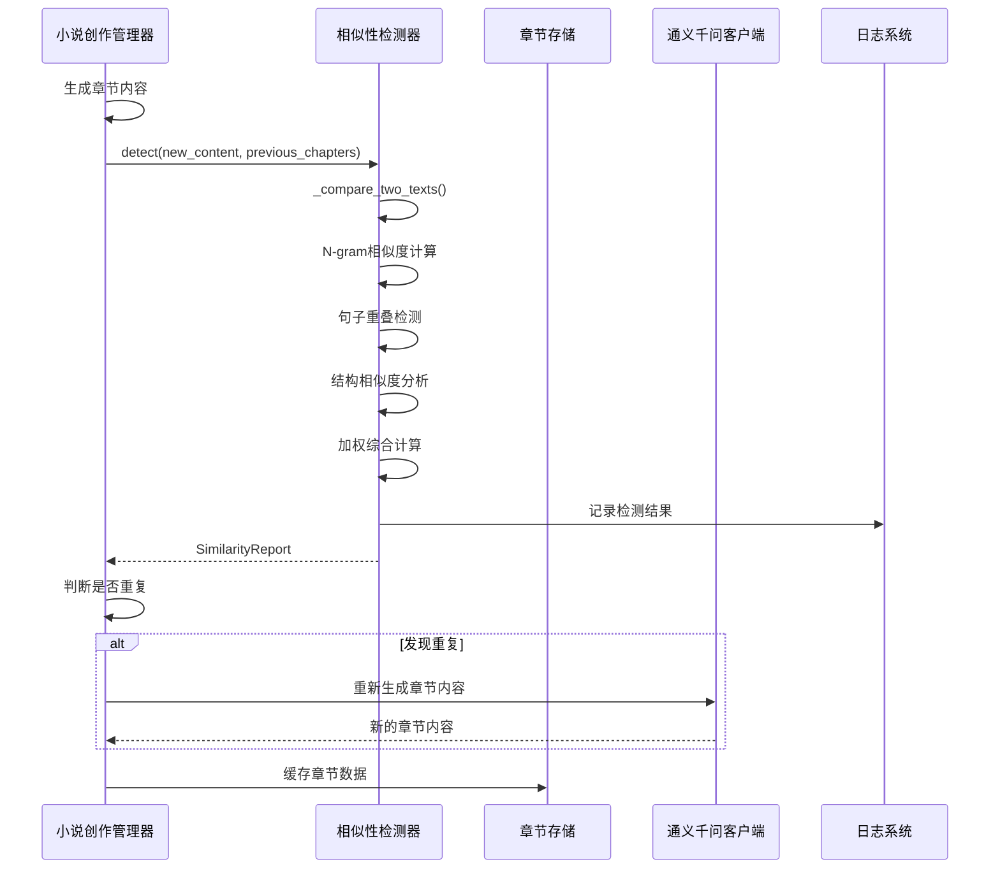
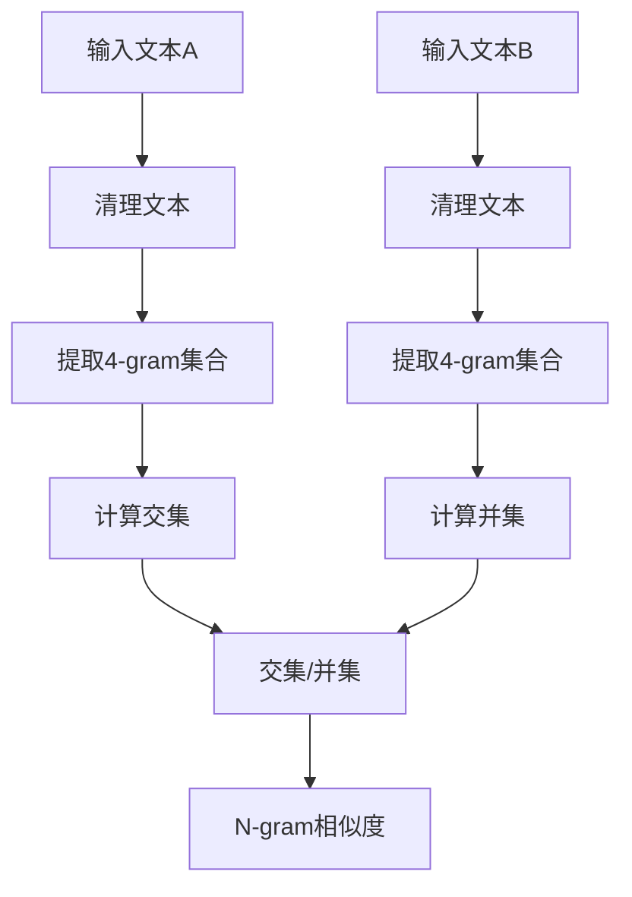
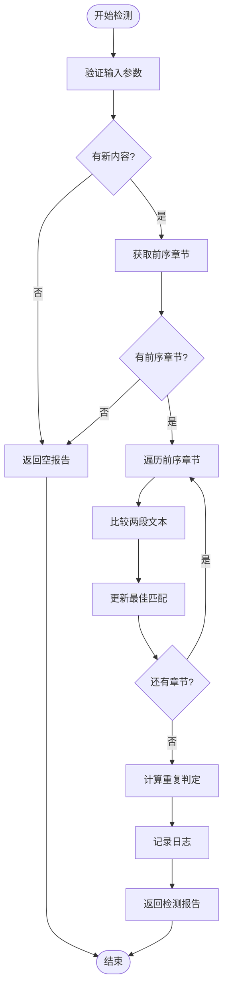
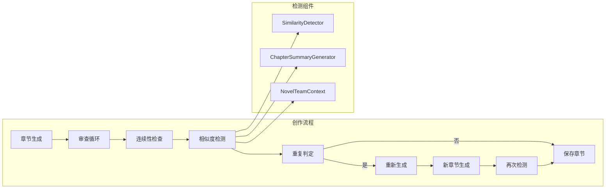
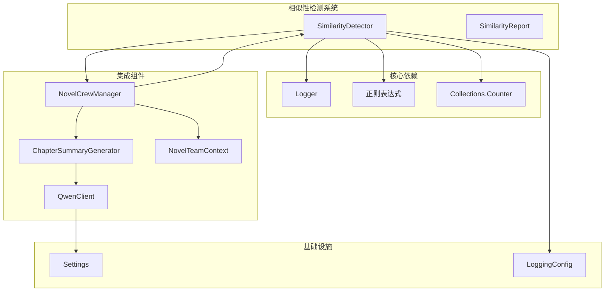

# 相似性检测系统

<cite>
**本文档引用的文件**
- [agents/similarity_detector.py](file://agents/similarity_detector.py)
- [agents/crew_manager.py](file://agents/crew_manager.py)
- [agents/team_context.py](file://agents/team_context.py)
- [agents/chapter_summary_generator.py](file://agents/chapter_summary_generator.py)
- [llm/qwen_client.py](file://llm/qwen_client.py)
- [core/logging_config.py](file://core/logging_config.py)
- [backend/config.py](file://backend/config.py)
</cite>

## 目录
1. [简介](#简介)
2. [项目结构](#项目结构)
3. [核心组件](#核心组件)
4. [架构概览](#架构概览)
5. [详细组件分析](#详细组件分析)
6. [依赖关系分析](#依赖关系分析)
7. [性能考虑](#性能考虑)
8. [故障排除指南](#故障排除指南)
9. [结论](#结论)

## 简介

相似性检测系统是小说生成Agent系统中的一个关键质量控制组件，专门用于检测和防止章节内容的重复创作。该系统采用多种轻量级文本相似度算法，无需外部依赖即可实现高效的重复检测。

系统的核心目标是在自动化小说生成过程中，确保新生成的章节内容与之前的章节保持足够的创新性和独特性，避免机械重复和内容雷同，从而提升整体作品质量。

## 项目结构

相似性检测系统位于小说生成Agent系统的agents模块中，与其它协作组件共同构成完整的创作流程：

**图表来源**
- [agents/similarity_detector.py](file://agents/similarity_detector.py#L1-L235)
- [agents/crew_manager.py](file://agents/crew_manager.py#L143-L149)
- [agents/team_context.py](file://agents/team_context.py#L155-L216)

**章节来源**
- [agents/similarity_detector.py](file://agents/similarity_detector.py#L1-L235)
- [agents/crew_manager.py](file://agents/crew_manager.py#L1-L1038)

## 核心组件

相似性检测系统由以下核心组件构成：

### SimilarityDetector 类
- **功能**：主检测器，负责计算文本相似度
- **算法**：N-gram重叠检测、关键句重复检测、结构相似度检测
- **阈值**：总体相似度超过30%判定为重复
- **权重分配**：N-gram(35%) + 句子重叠(45%) + 结构相似度(20%)

### SimilarityReport 数据类
- **属性**：重复判定标志、各项相似度指标、重复句子列表
- **输出**：标准化的检测结果字典
- **统计**：记录最相似的章节号和重复句子数量

### 集成组件
- **NovelCrewManager**：协调相似性检测在整个创作流程中的应用
- **ChapterSummaryGenerator**：提供章节摘要供检测使用
- **NovelTeamContext**：维护章节数据缓存和上下文信息

**章节来源**
- [agents/similarity_detector.py](file://agents/similarity_detector.py#L17-L134)
- [agents/crew_manager.py](file://agents/crew_manager.py#L143-L149)

## 架构概览

相似性检测系统在小说生成流程中的位置和作用：

**图表来源**
- [agents/crew_manager.py](file://agents/crew_manager.py#L873-L916)
- [agents/similarity_detector.py](file://agents/similarity_detector.py#L65-L110)

## 详细组件分析

### 相似度检测算法

系统采用三种互补的相似度检测算法：

#### N-gram 相似度检测
- **原理**：基于Jaccard相似系数计算字符级n-gram重叠
- **实现**：提取中文文本的4-gram集合，计算交集与并集比值
- **预处理**：去除标点符号和空白字符，保留中文字符和字母数字

**图表来源**
- [agents/similarity_detector.py](file://agents/similarity_detector.py#L136-L147)
- [agents/similarity_detector.py](file://agents/similarity_detector.py#L149-L159)

#### 句子重叠检测
- **分句策略**：按中文标点符号分割句子
- **过滤条件**：最小句子长度8字符，避免短片段误判
- **检测逻辑**：比较两个文本的句子集合，计算重叠比例

#### 结构相似度检测
- **分析维度**：段落长度分布模式
- **归一化**：将段落长度分为短(50字)、中(200字)、长三类
- **匹配计算**：比较相同位置段落长度分类的一致性

**章节来源**
- [agents/similarity_detector.py](file://agents/similarity_detector.py#L112-L134)
- [agents/similarity_detector.py](file://agents/similarity_detector.py#L161-L221)

### 检测流程

**图表来源**
- [agents/similarity_detector.py](file://agents/similarity_detector.py#L65-L110)

### 集成应用

相似性检测在小说创作流程中的集成：

**图表来源**
- [agents/crew_manager.py](file://agents/crew_manager.py#L873-L916)
- [agents/crew_manager.py](file://agents/crew_manager.py#L917-L945)

**章节来源**
- [agents/crew_manager.py](file://agents/crew_manager.py#L873-L945)

## 依赖关系分析

相似性检测系统与其他组件的依赖关系：

**图表来源**
- [agents/similarity_detector.py](file://agents/similarity_detector.py#L9-L14)
- [agents/crew_manager.py](file://agents/crew_manager.py#L143-L149)
- [agents/chapter_summary_generator.py](file://agents/chapter_summary_generator.py#L15-L22)

**章节来源**
- [agents/similarity_detector.py](file://agents/similarity_detector.py#L1-L235)
- [agents/crew_manager.py](file://agents/crew_manager.py#L1-L1038)

## 性能考虑

### 算法复杂度
- **N-gram检测**：O(n)时间复杂度，n为清理后文本长度
- **句子重叠**：O(m+k)时间复杂度，m和k分别为两文本的句子数
- **结构相似度**：O(p)时间复杂度，p为段落数
- **总体复杂度**：O(n+m+k+p)，线性增长

### 内存优化
- **缓存策略**：使用字典缓存章节内容和摘要
- **数据结构**：使用集合进行高效的N-gram重叠计算
- **限制措施**：最多记录5个重复句子，避免内存膨胀

### 扩展性设计
- **可配置参数**：相似度阈值、N-gram大小、最小句子长度
- **权重调整**：可根据不同需求调整各算法权重
- **批量处理**：支持同时检测多个前序章节

## 故障排除指南

### 常见问题及解决方案

#### 检测结果不准确
- **症状**：相似度计算异常或误判
- **原因**：文本预处理不当或阈值设置不合理
- **解决**：调整MIN_SENTENCE_LENGTH和DUPLICATE_THRESHOLD参数

#### 性能问题
- **症状**：检测过程耗时过长
- **原因**：大量前序章节或超长文本
- **解决**：优化compare_chapters参数，实施文本截断

#### 集成错误
- **症状**：相似性检测未生效
- **原因**：组件初始化失败或配置错误
- **解决**：检查QwenClient配置和日志输出

**章节来源**
- [agents/similarity_detector.py](file://agents/similarity_detector.py#L47-L63)
- [backend/config.py](file://backend/config.py#L5-L10)

## 结论

相似性检测系统通过多算法融合的方式，为自动化小说生成提供了有效的质量保障机制。系统具有以下特点：

1. **算法多样性**：结合字符级、句子级和结构级三个维度的相似度检测
2. **轻量化设计**：完全基于Python标准库实现，无需额外依赖
3. **可配置性**：支持参数调优以适应不同创作需求
4. **集成性**：无缝融入现有的小说创作流程中

该系统在保证创作效率的同时，有效防止了内容重复，提升了整体作品质量，是小说生成Agent系统中不可或缺的重要组件。