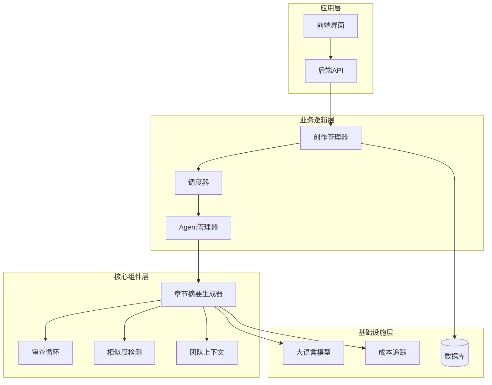
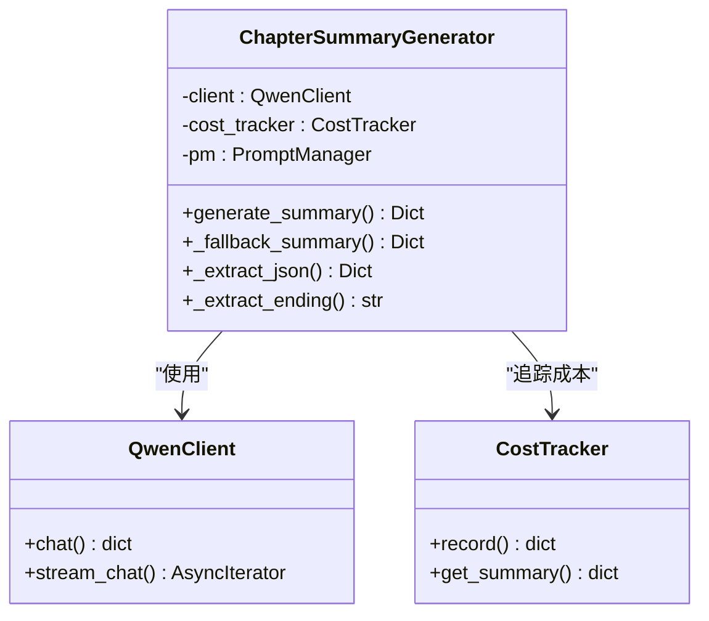
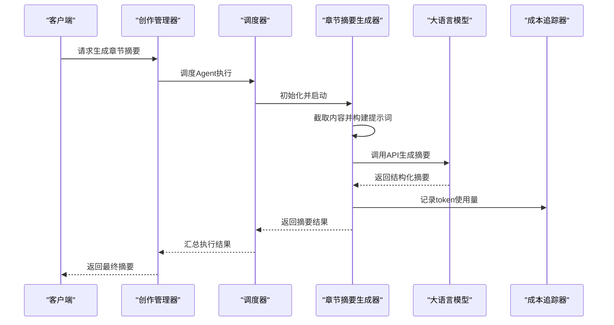
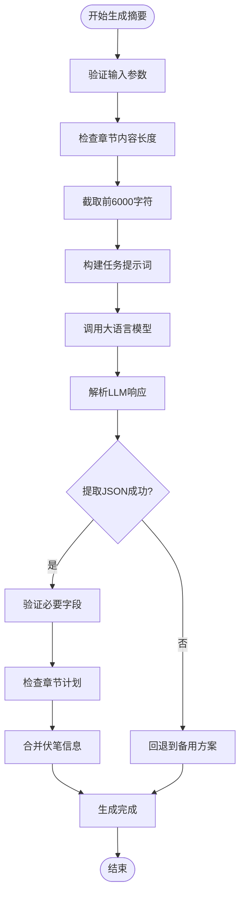
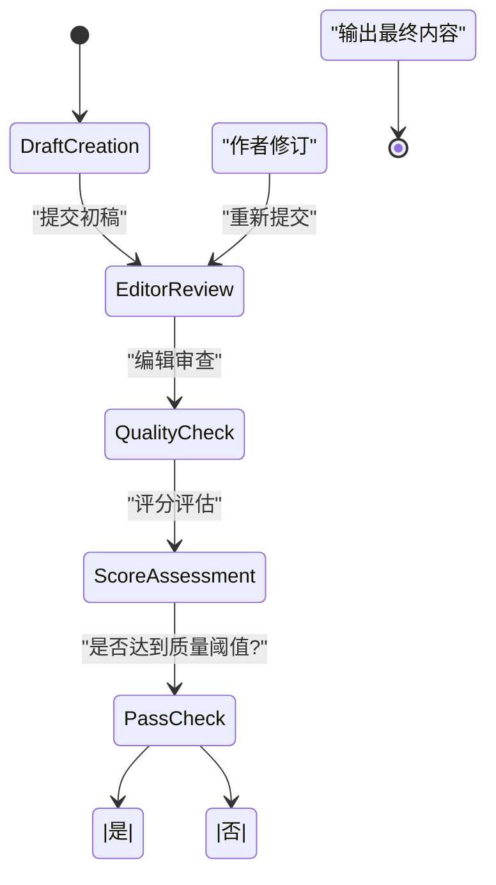
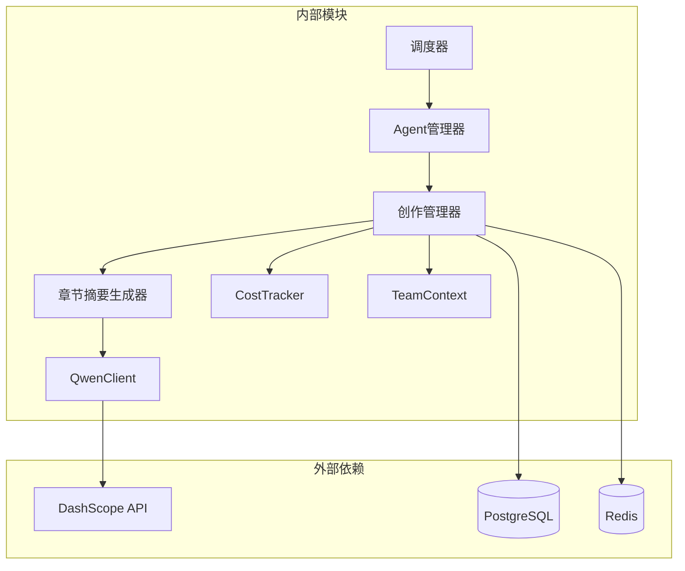

# 章节摘要生成器

<cite>
**本文档引用的文件**
- [chapter_summary_generator.py](file://agents/chapter_summary_generator.py)
- [crew_manager.py](file://agents/crew_manager.py)
- [agent_manager.py](file://agents/agent_manager.py)
- [agent_dispatcher.py](file://agents/agent_dispatcher.py)
- [qwen_client.py](file://llm/qwen_client.py)
- [cost_tracker.py](file://llm/cost_tracker.py)
- [team_context.py](file://agents/team_context.py)
- [similarity_detector.py](file://agents/similarity_detector.py)
- [review_loop.py](file://agents/review_loop.py)
- [chapter.py](file://core/models/chapter.py)
- [config.py](file://backend/config.py)
</cite>

## 目录
1. [简介](#简介)
2. [项目结构](#项目结构)
3. [核心组件](#核心组件)
4. [架构概览](#架构概览)
5. [详细组件分析](#详细组件分析)
6. [依赖关系分析](#依赖关系分析)
7. [性能考虑](#性能考虑)
8. [故障排除指南](#故障排除指南)
9. [结论](#结论)

## 简介

章节摘要生成器是小说创作自动化系统中的核心组件，专门负责为小说章节生成高质量的结构化摘要。该系统采用先进的大语言模型技术，替代传统的简单文本截断方式，能够生成包含关键事件、角色变化、情节推进等多个维度的详细摘要。

系统集成了完整的创作流水线，包括企划阶段、写作阶段和审查阶段，通过多个专业Agent协同工作，确保生成内容的质量和一致性。摘要生成器不仅能够处理单个章节的摘要生成，还能与整个创作系统无缝集成，为后续的章节写作和内容管理提供重要支撑。

## 项目结构

该项目采用模块化的架构设计，主要分为以下几个核心层次：

**图表来源**
- [chapter_summary_generator.py](file://agents/chapter_summary_generator.py#L15-L162)
- [crew_manager.py](file://agents/crew_manager.py#L38-L150)
- [agent_manager.py](file://agents/agent_manager.py#L22-L227)

**章节来源**
- [chapter_summary_generator.py](file://agents/chapter_summary_generator.py#L1-L162)
- [crew_manager.py](file://agents/crew_manager.py#L1-L1038)
- [agent_manager.py](file://agents/agent_manager.py#L1-L227)

## 核心组件

### 章节摘要生成器

章节摘要生成器是系统的核心组件，负责将完整的章节内容转换为结构化的摘要信息。该组件具有以下关键特性：

**主要功能**：
- 结构化摘要生成：提取关键事件、角色变化、情节推进等核心信息
- 智能内容截断：避免过长的输入导致token溢出
- 多层回退机制：在LLM失败时自动切换到备用方案
- JSON解析优化：智能提取和解析LLM返回的JSON格式数据

**数据结构**：

**图表来源**
- [chapter_summary_generator.py](file://agents/chapter_summary_generator.py#L15-L162)
- [qwen_client.py](file://llm/qwen_client.py#L16-L232)
- [cost_tracker.py](file://llm/cost_tracker.py#L16-L120)

**章节来源**
- [chapter_summary_generator.py](file://agents/chapter_summary_generator.py#L15-L162)

### 创作管理器

创作管理器负责协调整个小说创作流程，包括企划阶段和写作阶段的各个Agent协作：

**核心职责**：
- Agent生命周期管理
- 工作流编排和调度
- 成本控制和资源管理
- 审查反馈循环处理

**章节来源**
- [crew_manager.py](file://agents/crew_manager.py#L38-L150)

### Agent管理器

Agent管理器实现了单例模式，负责所有Agent的统一管理和初始化：

**主要特性**：
- 单例模式确保全局唯一性
- 异步初始化支持
- 动态Agent注册和管理
- 状态监控和查询

**章节来源**
- [agent_manager.py](file://agents/agent_manager.py#L22-L227)

## 架构概览

系统采用分层架构设计，各层职责明确，耦合度低，便于维护和扩展：

**图表来源**
- [crew_manager.py](file://agents/crew_manager.py#L553-L800)
- [agent_dispatcher.py](file://agents/agent_dispatcher.py#L17-L456)
- [chapter_summary_generator.py](file://agents/chapter_summary_generator.py#L23-L98)

## 详细组件分析

### 章节摘要生成流程

章节摘要生成器的工作流程体现了高度的智能化和容错能力：

**图表来源**
- [chapter_summary_generator.py](file://agents/chapter_summary_generator.py#L23-L98)

**实现细节**：
- **智能截断**：自动截取前6000字符避免token溢出
- **多策略解析**：支持直接JSON、Markdown代码块和手动提取
- **字段完整性**：确保关键字段如key_events、character_changes等的存在
- **回退机制**：在LLM失败时自动降级到基于原文的摘要生成

**章节来源**
- [chapter_summary_generator.py](file://agents/chapter_summary_generator.py#L23-L162)

### 审查反馈循环

系统集成了完整的审查反馈循环，确保生成内容的质量：

**图表来源**
- [review_loop.py](file://agents/review_loop.py#L91-L200)

**章节来源**
- [review_loop.py](file://agents/review_loop.py#L1-L322)

### 成本追踪系统

系统实现了精细化的成本追踪机制：

**追踪维度**：
- Token使用量统计
- 成本分类追踪（基础、迭代、查询、投票）
- 章节级成本汇总
- 实时成本预警

**章节来源**
- [cost_tracker.py](file://llm/cost_tracker.py#L16-L120)

## 依赖关系分析

系统采用了松耦合的设计原则，通过接口和抽象类实现组件间的解耦：

**图表来源**
- [chapter_summary_generator.py](file://agents/chapter_summary_generator.py#L9-L12)
- [crew_manager.py](file://agents/crew_manager.py#L14-L35)
- [agent_manager.py](file://agents/agent_manager.py#L6-L19)

**依赖特点**：
- **低耦合高内聚**：各模块职责明确，接口清晰
- **异步支持**：全面采用async/await模式提升性能
- **错误隔离**：每个组件都有独立的错误处理机制
- **可扩展性**：通过插件化设计支持新功能的添加

**章节来源**
- [chapter_summary_generator.py](file://agents/chapter_summary_generator.py#L1-L162)
- [crew_manager.py](file://agents/crew_manager.py#L1-L1038)
- [agent_manager.py](file://agents/agent_manager.py#L1-L227)

## 性能考虑

系统在设计时充分考虑了性能优化：

**内存优化**：
- 章节内容截断避免内存溢出
- 智能缓存机制减少重复计算
- 流式处理支持大文本处理

**并发处理**：
- 异步I/O操作提升吞吐量
- 多Agent并行执行
- 连接池管理降低资源消耗

**成本控制**：
- 实时token使用监控
- 成本阈值预警机制
- 智能重试策略

## 故障排除指南

### 常见问题及解决方案

**LLM调用失败**：
- 检查API密钥配置
- 验证网络连接状态
- 查看重试机制日志

**摘要生成异常**：
- 确认输入内容格式正确
- 检查JSON解析策略
- 验证回退机制是否正常工作

**性能问题**：
- 监控token使用量
- 检查并发连接数
- 优化提示词长度

**章节来源**
- [chapter_summary_generator.py](file://agents/chapter_summary_generator.py#L95-L98)
- [qwen_client.py](file://llm/qwen_client.py#L54-L161)

## 结论

章节摘要生成器作为小说创作自动化系统的核心组件，展现了现代AI应用的最佳实践。系统通过精心设计的架构、完善的错误处理机制和智能化的成本控制，为大规模内容创作提供了可靠的技术支撑。

该系统的主要优势包括：
- **高可靠性**：多重回退机制确保服务稳定性
- **智能化程度高**：支持复杂的审查反馈循环
- **成本可控**：精细化的成本追踪和控制
- **易于扩展**：模块化设计支持功能扩展

未来可以考虑的功能增强方向：
- 更高级的摘要生成算法
- 多模态内容支持
- 实时协作功能
- 更精细的个性化定制