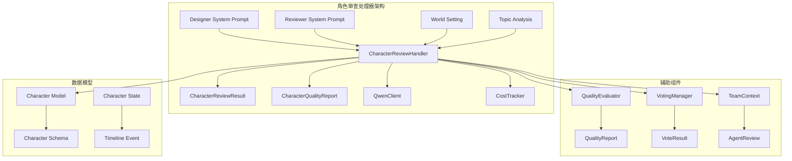
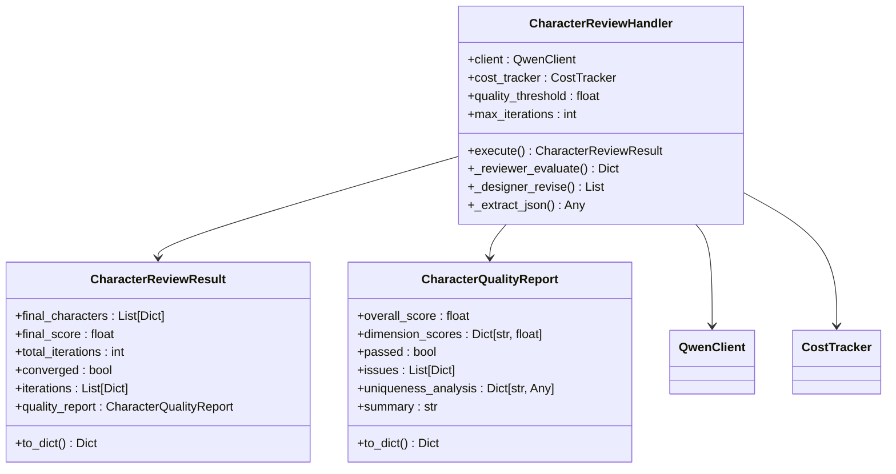
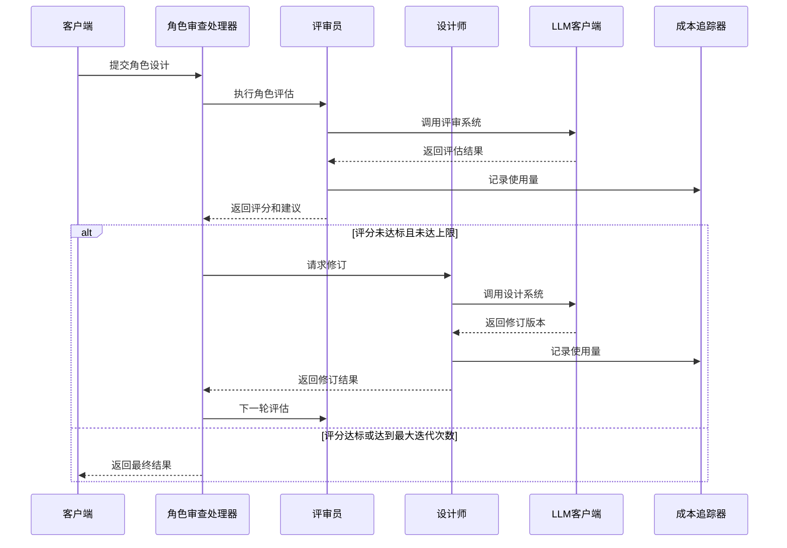
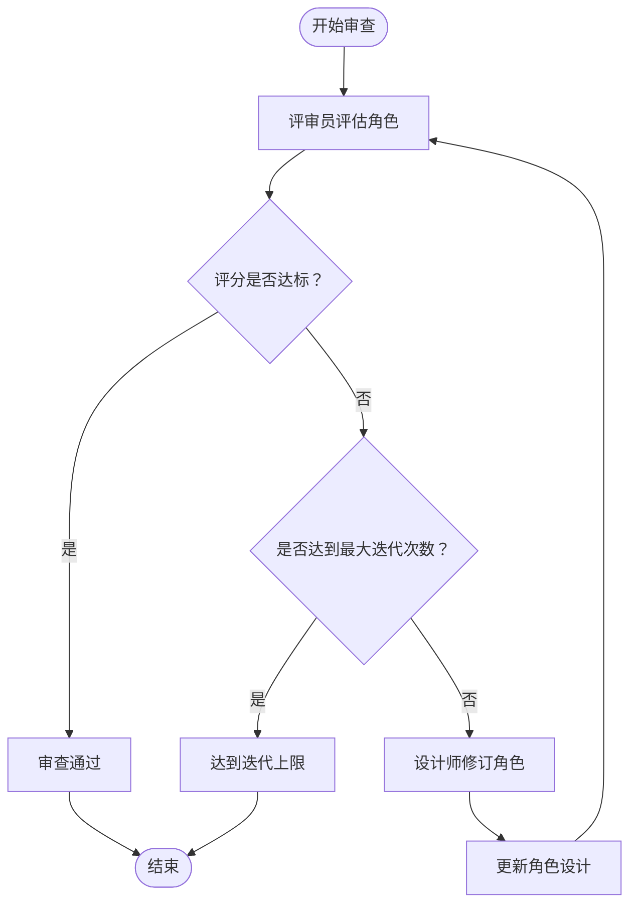
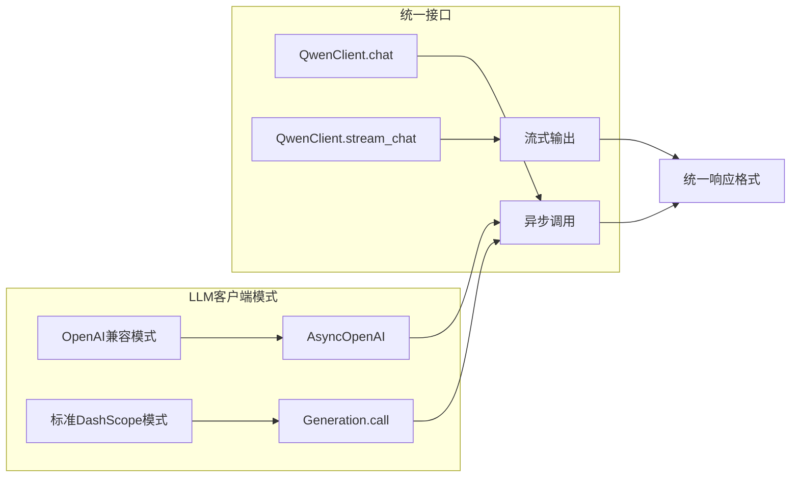
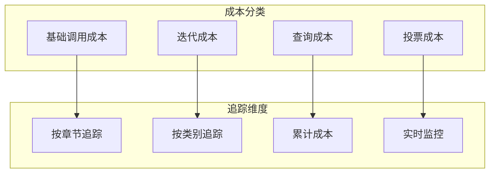
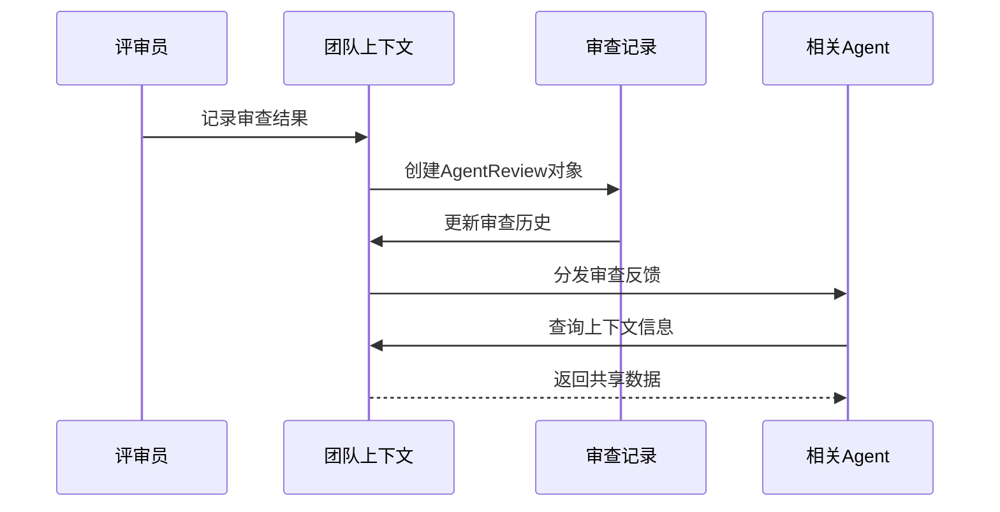
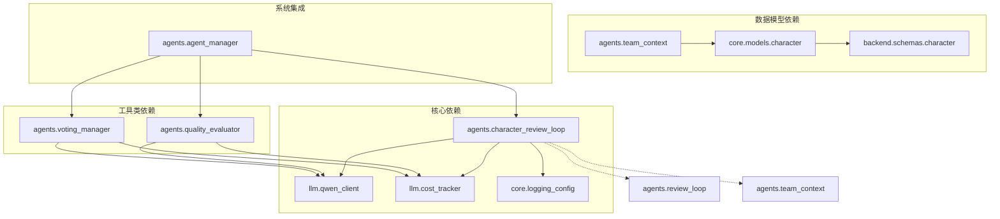

# 角色审查处理器

<cite>
**本文档引用的文件**
- [character_review_loop.py](file://agents/character_review_loop.py)
- [review_loop.py](file://agents/review_loop.py)
- [quality_evaluator.py](file://agents/quality_evaluator.py)
- [voting_manager.py](file://agents/voting_manager.py)
- [team_context.py](file://agents/team_context.py)
- [agent_manager.py](file://agents/agent_manager.py)
- [qwen_client.py](file://llm/qwen_client.py)
- [cost_tracker.py](file://llm/cost_tracker.py)
- [character.py](file://core/models/character.py)
- [character.py](file://backend/schemas/character.py)
</cite>

## 目录
1. [简介](#简介)
2. [项目结构](#项目结构)
3. [核心组件](#核心组件)
4. [架构概览](#架构概览)
5. [详细组件分析](#详细组件分析)
6. [依赖关系分析](#依赖关系分析)
7. [性能考虑](#性能考虑)
8. [故障排除指南](#故障排除指南)
9. [结论](#结论)

## 简介

角色审查处理器是小说生成系统中的关键质量保证组件，专门负责确保角色设计的深度和质量。该处理器通过"设计师-评审员"循环迭代的方式，从心理深度、独特性、成长潜力、关系复杂性和世界观契合度五个维度对角色进行全面评估和优化。

该系统采用先进的LLM技术，结合成本追踪和团队协作机制，为用户提供高质量的角色设计方案。处理器不仅能够自动检测角色设计中的问题，还能提供具体的改进建议，确保最终的角色设计既符合创作要求又具有文学价值。

## 项目结构

小说生成系统采用模块化的架构设计，角色审查处理器作为其中的核心组件，位于agents目录下，与其它智能体组件协同工作。

**图表来源**
- [character_review_loop.py](file://agents/character_review_loop.py#L188-L350)
- [qwen_client.py](file://llm/qwen_client.py#L16-L161)
- [cost_tracker.py](file://llm/cost_tracker.py#L16-L82)

**章节来源**
- [character_review_loop.py](file://agents/character_review_loop.py#L1-L50)
- [agent_manager.py](file://agents/agent_manager.py#L22-L75)

## 核心组件

角色审查处理器由多个精心设计的组件构成，每个组件都有明确的职责和功能：

### 主要组件概述

1. **CharacterReviewHandler**: 核心处理器类，负责协调整个审查流程
2. **CharacterReviewResult**: 存储最终审查结果的数据结构
3. **CharacterQualityReport**: 详细的评分报告对象
4. **QwenClient**: LLM客户端封装，处理与通义千问API的交互
5. **CostTracker**: 成本追踪器，监控和记录API调用成本

### 数据结构设计

系统采用数据类（dataclass）模式，确保数据结构的清晰性和类型安全性：

**图表来源**
- [character_review_loop.py](file://agents/character_review_loop.py#L188-L350)
- [character_review_loop.py](file://agents/character_review_loop.py#L42-L59)

**章节来源**
- [character_review_loop.py](file://agents/character_review_loop.py#L188-L350)
- [character_review_loop.py](file://agents/character_review_loop.py#L19-L60)

## 架构概览

角色审查处理器采用流水线式的处理架构，通过多轮迭代确保角色设计质量：

**图表来源**
- [character_review_loop.py](file://agents/character_review_loop.py#L218-L350)
- [character_review_loop.py](file://agents/character_review_loop.py#L352-L423)

## 详细组件分析

### 角色审查处理器核心逻辑

角色审查处理器实现了完整的"设计师-评审员"循环机制，通过多维度评估确保角色设计质量：

#### 评估维度设计

系统从五个核心维度对角色进行全面评估：

1. **心理深度** (psychological_depth): 角色的内在矛盾和复杂动机
2. **独特性** (uniqueness): 角色之间的差异化程度
3. **成长潜力** (growth_potential): 角色的发展弧线合理性
4. **关系复杂性** (relationship_complexity): 角色间关系的多层次性
5. **世界观契合度** (world_fit): 角色与设定的一致性

#### 迭代控制机制

处理器采用智能的迭代控制策略：

**图表来源**
- [character_review_loop.py](file://agents/character_review_loop.py#L238-L288)

#### 错误处理和恢复机制

系统具备完善的错误处理能力：

- LLM调用失败时的降级策略
- JSON解析失败的多种尝试方法
- 迭代过程中的异常捕获和记录
- 成功状态的回退机制

**章节来源**
- [character_review_loop.py](file://agents/character_review_loop.py#L218-L350)
- [character_review_loop.py](file://agents/character_review_loop.py#L352-L462)

### LLM客户端集成

角色审查处理器集成了强大的LLM客户端，支持多种部署模式：

#### 多模式支持

**图表来源**
- [qwen_client.py](file://llm/qwen_client.py#L46-L161)
- [qwen_client.py](file://llm/qwen_client.py#L163-L227)

#### 重试机制和错误处理

系统实现了智能的重试策略：

- 指数退避重试（最多3次）
- 不同模式下的异常处理
- 流式调用的断点续传
- 超时和连接错误的处理

**章节来源**
- [qwen_client.py](file://llm/qwen_client.py#L16-L232)

### 成本追踪和监控

成本追踪器提供了全面的使用情况监控：

#### 成本计算模型

系统采用精确的成本计算模型：

- 基于tokens的定价策略
- 不同模型的差异化定价
- 章节级别的成本追踪
- 实时成本汇总和统计

#### 成本分类管理

**图表来源**
- [cost_tracker.py](file://llm/cost_tracker.py#L28-L82)

**章节来源**
- [cost_tracker.py](file://llm/cost_tracker.py#L16-L120)

### 团队协作和上下文管理

角色审查处理器与团队协作系统深度集成：

#### 上下文共享机制

系统通过NovelTeamContext实现多Agent间的上下文共享：

- 角色状态的实时追踪
- 时间线事件的记录和查询
- 审查反馈的历史记录
- 伏笔系统的集成

#### 审查反馈循环

**图表来源**
- [team_context.py](file://agents/team_context.py#L106-L153)
- [team_context.py](file://agents/team_context.py#L366-L382)

**章节来源**
- [team_context.py](file://agents/team_context.py#L155-L493)

## 依赖关系分析

角色审查处理器与系统其他组件存在紧密的依赖关系：

**图表来源**
- [character_review_loop.py](file://agents/character_review_loop.py#L14-L16)
- [qwen_client.py](file://llm/qwen_client.py#L11-L13)
- [cost_tracker.py](file://llm/cost_tracker.py#L6-L6)

### 外部依赖分析

系统对外部依赖的管理：

- **LLM服务**: 通义千问API的集成和适配
- **数据库**: 角色数据的持久化存储
- **日志系统**: 统一的日志记录和监控
- **配置管理**: 环境变量和运行参数的管理

**章节来源**
- [character_review_loop.py](file://agents/character_review_loop.py#L1-L20)
- [qwen_client.py](file://llm/qwen_client.py#L1-L20)

## 性能考虑

角色审查处理器在设计时充分考虑了性能优化：

### 内存管理

- 数据类的高效内存使用
- 异步操作的资源管理
- 缓存策略的合理应用
- 大型响应的分块处理

### 并发处理

- 异步LLM调用的并发执行
- 流式响应的实时处理
- 多Agent协作的同步机制
- 资源竞争的避免策略

### 成本优化

- Token使用的精确计算
- 重试机制的智能控制
- 模型选择的成本考量
- 批量处理的效率提升

## 故障排除指南

### 常见问题和解决方案

#### LLM调用失败

**问题症状**: LLM API调用异常或超时

**诊断步骤**:
1. 检查API密钥和配置
2. 验证网络连接状态
3. 查看重试日志和错误信息
4. 确认模型可用性

**解决方案**:
- 配置正确的API密钥和基础URL
- 实施指数退避重试策略
- 设置合理的超时时间
- 监控API使用限额

#### JSON解析错误

**问题症状**: 无法从LLM响应中提取JSON数据

**诊断步骤**:
1. 检查LLM响应格式
2. 验证JSON结构完整性
3. 确认编码格式正确性
4. 查看响应内容截断情况

**解决方案**:
- 实现多种JSON提取策略
- 添加响应格式验证
- 实施内容预处理机制
- 提供降级解析方案

#### 性能问题

**问题症状**: 处理速度慢或内存占用过高

**诊断步骤**:
1. 分析成本追踪数据
2. 检查并发处理状态
3. 监控系统资源使用
4. 评估算法复杂度

**解决方案**:
- 优化LLM调用频率
- 实施缓存策略
- 调整批处理大小
- 优化数据结构设计

**章节来源**
- [character_review_loop.py](file://agents/character_review_loop.py#L424-L462)
- [qwen_client.py](file://llm/qwen_client.py#L79-L106)

## 结论

角色审查处理器是小说生成系统中不可或缺的关键组件，它通过智能化的"设计师-评审员"循环机制，确保了角色设计的高质量和一致性。系统的设计体现了以下几个核心优势：

1. **全面的质量评估**: 从五个维度对角色进行全面分析
2. **智能的迭代优化**: 通过多轮反馈实现持续改进
3. **成本效益平衡**: 在保证质量的同时控制LLM使用成本
4. **系统化集成**: 与团队协作和上下文管理深度整合
5. **鲁棒的错误处理**: 提供完善的异常处理和恢复机制

该处理器不仅提升了角色设计的质量，还为整个小说生成流程提供了可靠的质量保障，是构建高质量AI辅助创作系统的重要基石。