# 质量保证系统

<cite>
**本文档引用的文件**
- [review_loop_base.py](file://agents/base/review_loop_base.py)
- [quality_report.py](file://agents/base/quality_report.py)
- [review_result.py](file://agents/base/review_result.py)
- [json_extractor.py](file://agents/base/json_extractor.py)
- [world_review_loop.py](file://agents/world_review_loop.py)
- [review_loop.py](file://agents/review_loop.py)
- [character_review_loop.py](file://agents/character_review_loop.py)
- [plot_review_loop.py](file://agents/plot_review_loop.py)
- [quality_evaluator.py](file://agents/quality_evaluator.py)
- [iteration_controller.py](file://agents/iteration_controller.py)
- [similarity_detector.py](file://agents/similarity_detector.py)
- [crew_manager.py](file://agents/crew_manager.py)
- [team_context.py](file://agents/team_context.py)
- [cost_tracker.py](file://llm/cost_tracker.py)
- [chapter_summary_generator.py](file://agents/chapter_summary_generator.py)
- [logging_config.py](file://core/logging_config.py)
- [continuity_fixer.py](file://agents/continuity_fixer.py)
- [test_automation_service.py](file://tests/unit/test_automation_service.py)
- [test_integration_service.py](file://tests/unit/test_integration_service.py)
- [conftest.py](file://tests/conftest.py)
</cite>

## 更新摘要
**变更内容**
- **统一质量报告框架**：新增BaseQualityReport基类及其子类（WorldQualityReport、CharacterQualityReport、PlotQualityReport、ChapterQualityReport），提供标准化的质量评估报告结构
- **标准化审查循环实现**：所有审查处理器现在基于统一的BaseReviewLoopHandler基类，支持多轮迭代审查和统一的质量报告生成
- **改进的审查结果系统**：新增BaseReviewResult基类及其子类，提供统一的审查结果数据结构，支持不同类型的最终输出
- **增强的质量评估能力**：新的报告框架支持多维度评分、问题追踪、一致性分析和修订建议等高级功能
- **统一的迭代限制配置**：将世界审查、角色审查、情节审查、章节审查的最大迭代次数统一为5次
- **标准化的质量阈值**：章节审查阈值调整为7.5分，角色和世界观审查阈值为7.0分

## 目录
1. [简介](#简介)
2. [项目结构](#项目结构)
3. [核心组件](#核心组件)
4. [架构概览](#架构概览)
5. [详细组件分析](#详细组件分析)
6. [多阶段评估系统](#多阶段评估系统)
7. [质量阈值控制机制](#质量阈值控制机制)
8. [迭代限制与成本控制](#迭代限制与成本控制)
9. [详细报告机制](#详细报告机制)
10. [依赖关系分析](#依赖关系分析)
11. [性能考虑](#性能考虑)
12. [故障排除指南](#故障排除指南)
13. [结论](#结论)

## 简介

小说质量保证系统是一个基于人工智能的自动化小说创作质量控制系统。该系统通过多维度的质量评估、智能审查反馈循环、内容相似度检测和成本追踪等机制，确保生成的小说内容达到专业标准。

系统的核心特点包括：
- **统一质量报告框架**：基于BaseQualityReport基类的标准化质量评估报告结构
- **智能审查反馈循环**：Writer-Editor协作的质量改进机制
- **多阶段评估系统**：支持章节、角色、世界观和情节的多层级质量控制
- **质量阈值控制**：灵活的质量标准设置和动态调整
- **迭代限制机制**：基于质量阈值、迭代次数和成本的综合控制
- **详细报告机制**：提供多维度的质量评估报告和迭代历史记录
- **内容质量保障**：防止重复内容和保持叙事连贯性
- **成本控制**：精确的Token使用量和费用追踪
- **团队协作**：跨Agent的信息共享和状态管理
- **标准化基础架构**：统一的审查循环实现模式和质量报告框架

## 项目结构

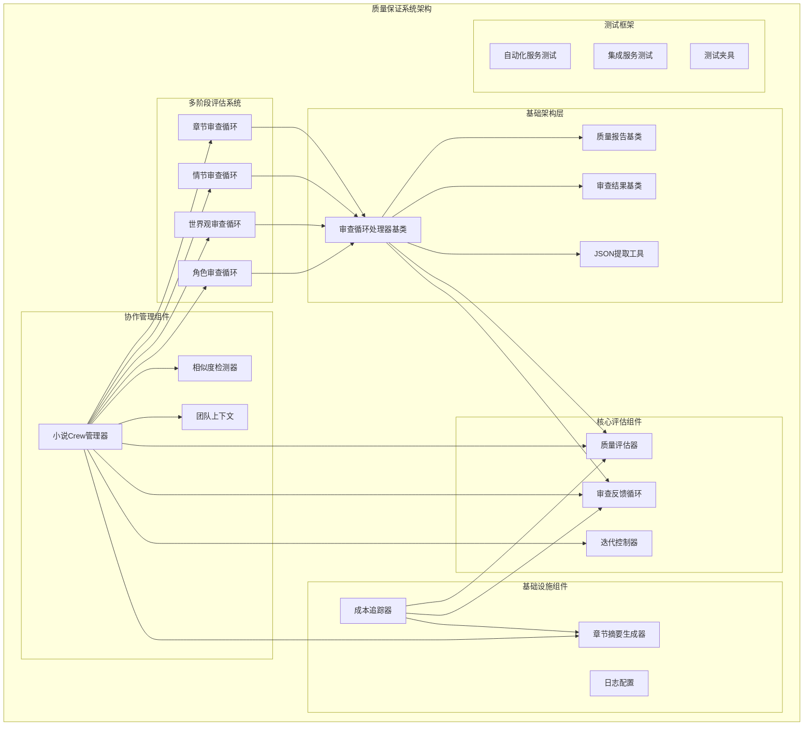
```mermaid
graph TB
subgraph "质量保证系统架构"
subgraph "基础架构层"
BRB[审查循环处理器基类]
BQR[质量报告基类]
BRR[审查结果基类]
JE[JSON提取工具]
end
subgraph "核心评估组件"
QE[质量评估器]
RL[审查反馈循环]
IC[迭代控制器]
end
subgraph "多阶段评估系统"
CRE[角色审查循环]
WRE[世界观审查循环]
PRE[情节审查循环]
RRL[章节审查循环]
end
subgraph "协作管理组件"
CM[小说Crew管理器]
TC[团队上下文]
SD[相似度检测器]
end
subgraph "基础设施组件"
CT[成本追踪器]
CSG[章节摘要生成器]
LC[日志配置]
end
subgraph "测试框架"
TAU[自动化服务测试]
TIS[集成服务测试]
CF[测试夹具]
end
end
BRB --> BQR
BRB --> BRR
BRB --> JE
BRB --> QE
BRB --> RL
CRE --> BRB
WRE --> BRB
PRE --> BRB
RRL --> BRB
CM --> QE
CM --> RL
CM --> CRE
CM --> WRE
CM --> PRE
CM --> RRL
CM --> SD
CM --> IC
CM --> TC
CM --> CSG
CT --> QE
CT --> RL
CT --> CSG
```

**图表来源**
- [review_loop_base.py](file://agents/base/review_loop_base.py#L64-L380)
- [quality_report.py](file://agents/base/quality_report.py#L44-L144)
- [review_result.py](file://agents/base/review_result.py#L23-L127)
- [json_extractor.py](file://agents/base/json_extractor.py#L16-L235)

**章节来源**
- [crew_manager.py](file://agents/crew_manager.py#L38-L1038)
- [team_context.py](file://agents/team_context.py#L155-L493)

## 核心组件

### 审查循环处理器基类 (BaseReviewLoopHandler)

审查循环处理器基类是系统的基础架构组件，使用模板方法模式封装了Designer-Reviewer审查循环的核心迭代逻辑。该基类定义了完整的审查循环流程，子类只需实现特定领域的抽象方法即可获得完整的审查循环功能。

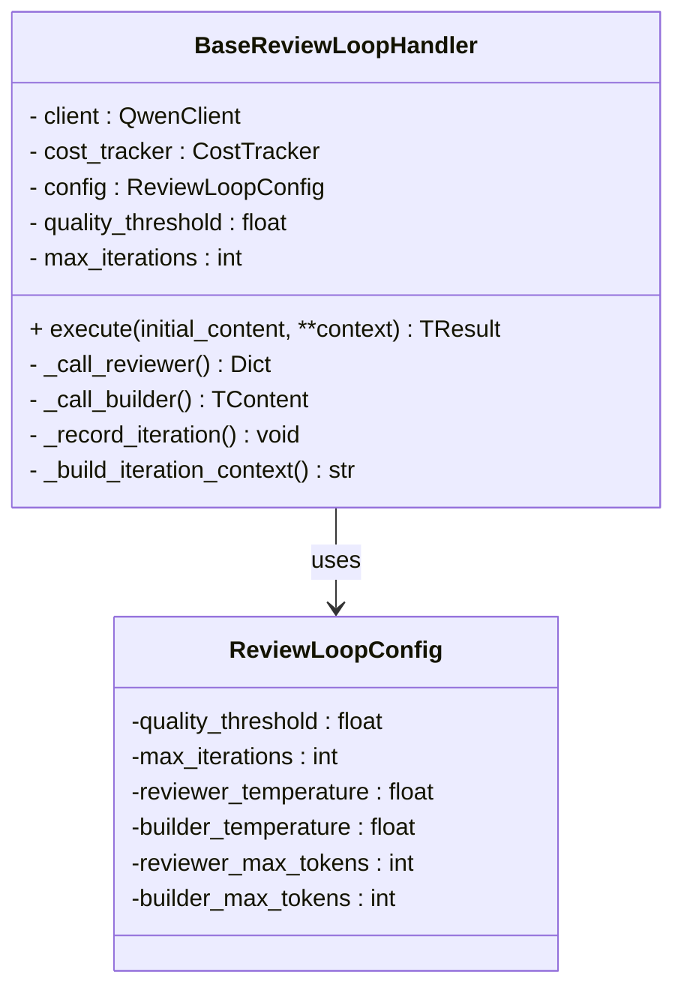
```mermaid
classDiagram
class BaseReviewLoopHandler {
- client : QwenClient
- cost_tracker : CostTracker
- config : ReviewLoopConfig
- quality_threshold : float
- max_iterations : int
+ execute(initial_content, **context) TResult
- _call_reviewer() Dict
- _call_builder() TContent
- _record_iteration() void
- _build_iteration_context() str
}
class ReviewLoopConfig {
-quality_threshold : float
-max_iterations : int
-reviewer_temperature : float
-builder_temperature : float
-reviewer_max_tokens : int
-builder_max_tokens : int
}
BaseReviewLoopHandler --> ReviewLoopConfig : uses
```

**图表来源**
- [review_loop_base.py](file://agents/base/review_loop_base.py#L64-L115)

### 质量报告基类 (BaseQualityReport)

质量报告基类提供了所有审查循环共享的质量评估报告基础结构。所有审查循环的质量报告都继承自此类，包含综合评分、维度评分、问题列表和评估摘要等通用字段。

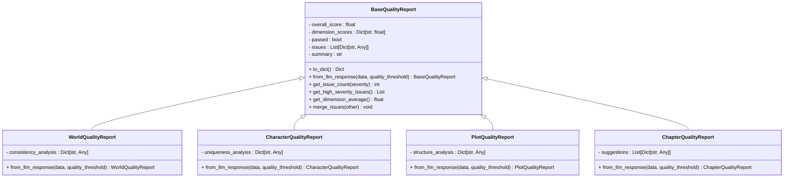
```mermaid
classDiagram
class BaseQualityReport {
- overall_score : float
- dimension_scores : Dict[str, float]
- passed : bool
- issues : List[Dict[str, Any]]
- summary : str
+ to_dict() Dict
+ from_llm_response(data, quality_threshold) BaseQualityReport
+ get_issue_count(severity) int
+ get_high_severity_issues() List
+ get_dimension_average() float
+ merge_issues(other) void
}
class WorldQualityReport {
- consistency_analysis : Dict[str, Any]
+ from_llm_response(data, quality_threshold) WorldQualityReport
}
class CharacterQualityReport {
- uniqueness_analysis : Dict[str, Any]
+ from_llm_response(data, quality_threshold) CharacterQualityReport
}
class PlotQualityReport {
- structure_analysis : Dict[str, Any]
+ from_llm_response(data, quality_threshold) PlotQualityReport
}
class ChapterQualityReport {
- suggestions : List[Dict[str, Any]]
+ from_llm_response(data, quality_threshold) ChapterQualityReport
}
BaseQualityReport <|-- WorldQualityReport
BaseQualityReport <|-- CharacterQualityReport
BaseQualityReport <|-- PlotQualityReport
BaseQualityReport <|-- ChapterQualityReport
```

**图表来源**
- [quality_report.py](file://agents/base/quality_report.py#L44-L144)

### 审查结果基类 (BaseReviewResult)

审查结果基类提供了所有审查循环共享的结果数据结构，支持不同类型的最终输出（字符串/字典/列表）。该基类定义了统一的结果数据结构，包括最终输出内容、评分、迭代历史和质量报告等字段。

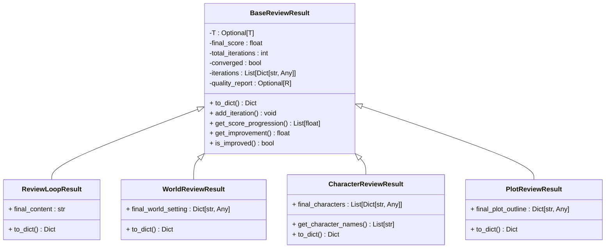
```mermaid
classDiagram
class BaseReviewResult {
-T : Optional[T]
-final_score : float
-total_iterations : int
-converged : bool
-iterations : List[Dict[str, Any]]
-quality_report : Optional[R]
+ to_dict() Dict
+ add_iteration() void
+ get_score_progression() List[float]
+ get_improvement() float
+ is_improved() bool
}
class ReviewLoopResult {
+ final_content : str
+ to_dict() Dict
}
class WorldReviewResult {
+ final_world_setting : Dict[str, Any]
+ to_dict() Dict
}
class CharacterReviewResult {
+ final_characters : List[Dict[str, Any]]
+ get_character_names() List[str]
+ to_dict() Dict
}
class PlotReviewResult {
+ final_plot_outline : Dict[str, Any]
+ to_dict() Dict
}
BaseReviewResult <|-- ReviewLoopResult
BaseReviewResult <|-- WorldReviewResult
BaseReviewResult <|-- CharacterReviewResult
BaseReviewResult <|-- PlotReviewResult
```

**图表来源**
- [review_result.py](file://agents/base/review_result.py#L23-L127)

### JSON提取工具 (JsonExtractor)

JSON提取工具提供了统一处理LLM响应中JSON提取的功能，支持多种格式包括纯JSON文本、Markdown代码块包裹的JSON和混合文本中的JSON对象/数组。

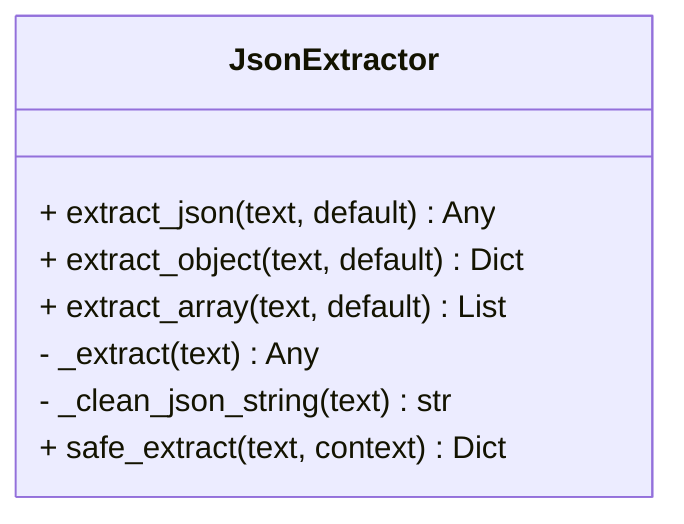
```mermaid
classDiagram
class JsonExtractor {
+ extract_json(text, default) Any
+ extract_object(text, default) Dict
+ extract_array(text, default) List
- _extract(text) Any
- _clean_json_string(text) str
+ safe_extract(text, context) Dict
}
```

**图表来源**
- [json_extractor.py](file://agents/base/json_extractor.py#L16-L235)

**章节来源**
- [review_loop_base.py](file://agents/base/review_loop_base.py#L64-L115)
- [quality_report.py](file://agents/base/quality_report.py#L44-L144)
- [review_result.py](file://agents/base/review_result.py#L23-L127)
- [json_extractor.py](file://agents/base/json_extractor.py#L16-L235)

## 架构概览

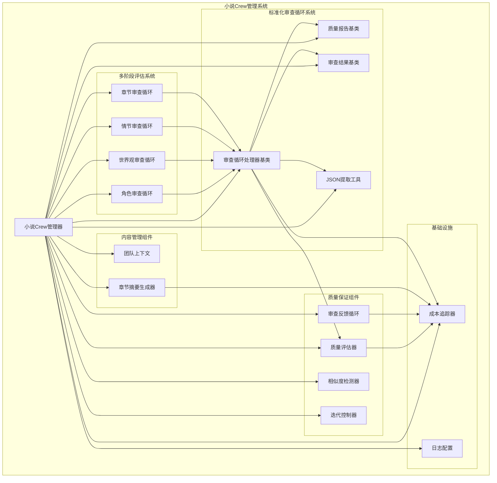
```mermaid
graph TB
subgraph "小说Crew管理系统"
CM[小说Crew管理器]
subgraph "质量保证组件"
QE[质量评估器]
RL[审查反馈循环]
SD[相似度检测器]
IC[迭代控制器]
end
subgraph "标准化审查循环系统"
BRB[审查循环处理器基类]
BQR[质量报告基类]
BRR[审查结果基类]
JE[JSON提取工具]
end
subgraph "多阶段评估系统"
CRE[角色审查循环]
WRE[世界观审查循环]
PRE[情节审查循环]
RRL[章节审查循环]
end
subgraph "内容管理组件"
TC[团队上下文]
CSG[章节摘要生成器]
end
subgraph "基础设施"
CT[成本追踪器]
LC[日志配置]
end
end
CM --> QE
CM --> RL
CM --> SD
CM --> IC
CM --> BRB
CM --> BQR
CM --> BRR
CM --> JE
CM --> CRE
CM --> WRE
CM --> PRE
CM --> RRL
CM --> TC
CM --> CSG
CM --> CT
CM --> LC
QE --> CT
RL --> CT
CSG --> CT
BRB --> QE
BRB --> CT
BRB --> BQR
BRB --> BRR
BRB --> JE
CRE --> BRB
WRE --> BRB
PRE --> BRB
RRL --> BRB
```

**图表来源**
- [crew_manager.py](file://agents/crew_manager.py#L38-L1038)
- [cost_tracker.py](file://llm/cost_tracker.py#L16-L120)

## 详细组件分析

### 小说Crew管理器

小说Crew管理器是整个质量保证系统的核心协调器，负责管理各个Agent之间的协作。其主要功能包括：

#### 协作机制
- **审查反馈循环**：Writer-Editor质量驱动迭代
- **投票共识**：企划阶段关键决策的多视角投票
- **请求-应答协商**：Writer写作过程中的设定查询
- **多阶段评估**：章节、角色、世界观和情节的多层级质量控制

#### 组件集成
系统集成了多个专门的质量保证组件：

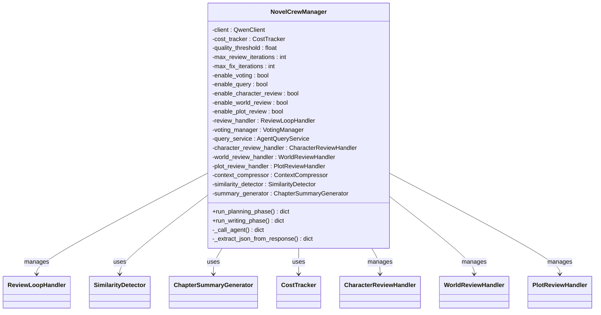
```mermaid
classDiagram
class NovelCrewManager {
-client : QwenClient
-cost_tracker : CostTracker
-quality_threshold : float
-max_review_iterations : int
-max_fix_iterations : int
-enable_voting : bool
-enable_query : bool
-enable_character_review : bool
-enable_world_review : bool
-enable_plot_review : bool
-review_handler : ReviewLoopHandler
-voting_manager : VotingManager
-query_service : AgentQueryService
-character_review_handler : CharacterReviewHandler
-world_review_handler : WorldReviewHandler
-plot_review_handler : PlotReviewHandler
-context_compressor : ContextCompressor
-similarity_detector : SimilarityDetector
-summary_generator : ChapterSummaryGenerator
+run_planning_phase() dict
+run_writing_phase() dict
-_call_agent() dict
-_extract_json_from_response() dict
}
NovelCrewManager --> ReviewLoopHandler : manages
NovelCrewManager --> SimilarityDetector : uses
NovelCrewManager --> ChapterSummaryGenerator : uses
NovelCrewManager --> CostTracker : uses
NovelCrewManager --> CharacterReviewHandler : manages
NovelCrewManager --> WorldReviewHandler : manages
NovelCrewManager --> PlotReviewHandler : manages
```

**图表来源**
- [crew_manager.py](file://agents/crew_manager.py#L38-L1038)

#### 写作阶段流程

小说Crew管理器的写作阶段包含以下关键步骤：

1. **章节策划**：生成详细的章节计划
2. **内容生成**：作家根据计划生成初稿
3. **质量审查**：审查反馈循环的质量改进
4. **连续性检查**：确保叙事连贯性
5. **最终整合**：生成最终版本内容

**章节来源**
- [crew_manager.py](file://agents/crew_manager.py#L553-L800)

### 团队上下文管理

团队上下文系统实现了Agent之间的信息共享和状态追踪，包含以下核心功能：

#### 数据结构
- **Agent输出历史**：记录各Agent的输出内容
- **角色状态管理**：追踪角色的发展和变化
- **时间线追踪**：维护故事的时间线事件
- **审查反馈记录**：保存质量评估和改进建议

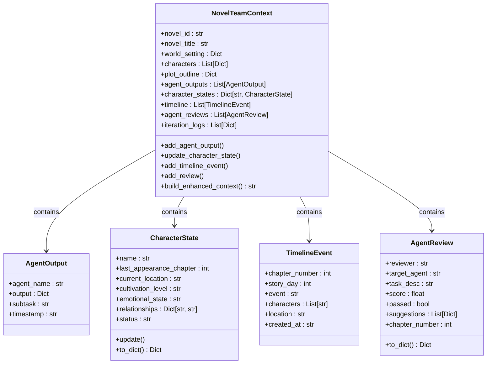
```mermaid
classDiagram
class NovelTeamContext {
+novel_id : str
+novel_title : str
+world_setting : Dict
+characters : List[Dict]
+plot_outline : Dict
+agent_outputs : List[AgentOutput]
+character_states : Dict[str, CharacterState]
+timeline : List[TimelineEvent]
+agent_reviews : List[AgentReview]
+iteration_logs : List[Dict]
+add_agent_output()
+update_character_state()
+add_timeline_event()
+add_review()
+build_enhanced_context() str
}
class AgentOutput {
+agent_name : str
+output : Dict
+subtask : str
+timestamp : str
}
class CharacterState {
+name : str
+last_appearance_chapter : int
+current_location : str
+cultivation_level : str
+emotional_state : str
+relationships : Dict[str, str]
+status : str
+update()
+to_dict() Dict
}
class TimelineEvent {
+chapter_number : int
+story_day : int
+event : str
+characters : List[str]
+location : str
+created_at : str
}
class AgentReview {
+reviewer : str
+target_agent : str
+task_desc : str
+score : float
+passed : bool
+suggestions : List[Dict]
+chapter_number : int
+to_dict() Dict
}
NovelTeamContext --> AgentOutput : contains
NovelTeamContext --> CharacterState : contains
NovelTeamContext --> TimelineEvent : contains
NovelTeamContext --> AgentReview : contains
```

**图表来源**
- [team_context.py](file://agents/team_context.py#L155-L493)

### 成本追踪系统

成本追踪系统精确监控每个Agent的Token使用量和费用消耗：

#### 计费模式
- **模型定价**：支持多种通义千问模型的定价策略
- **分类追踪**：按章节、类别追踪成本
- **实时监控**：提供累计成本和单次调用成本

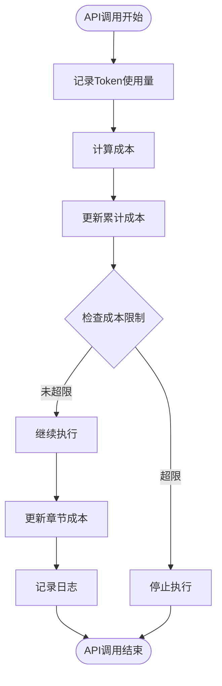
```mermaid
flowchart TD
Start([API调用开始]) --> Record[记录Token使用量]
Record --> Calculate[计算成本]
Calculate --> UpdateTotal[更新累计成本]
UpdateTotal --> CheckLimit{检查成本限制}
CheckLimit --> |未超限| Continue[继续执行]
CheckLimit --> |超限| Stop[停止执行]
Continue --> UpdateChapter[更新章节成本]
UpdateChapter --> Log[记录日志]
Log --> End([API调用结束])
Stop --> End
```

**图表来源**
- [cost_tracker.py](file://llm/cost_tracker.py#L28-L82)

**章节来源**
- [cost_tracker.py](file://llm/cost_tracker.py#L16-L120)

## 多阶段评估系统

### 角色审查循环 (CharacterReviewHandler)

角色审查循环专门负责角色设计的质量控制，确保角色具有心理深度、独特性、成长潜力、关系复杂性和世界观契合度等特征。

#### 评估维度
- **心理深度**：角色的内在矛盾和挣扎
- **独特性**：角色之间的区分度
- **成长潜力**：角色的成长弧线合理性
- **关系复杂性**：角色关系的多层次性
- **世界观契合度**：角色与设定的一致性

#### 统一的标准化实现

**更新** 角色审查处理器现在基于统一的审查循环处理器基类实现，支持多轮迭代审查，最大迭代次数统一为5次：

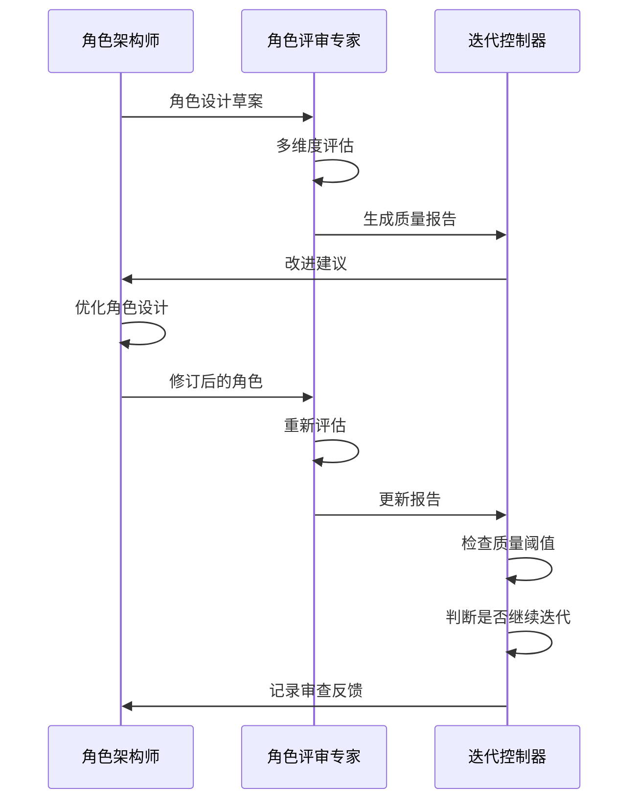
```mermaid
sequenceDiagram
participant Builder as 角色架构师
participant Reviewer as 角色评审专家
participant Controller as 迭代控制器
Builder->>Reviewer : 角色设计草案
Reviewer->>Reviewer : 多维度评估
Reviewer->>Controller : 生成质量报告
Controller->>Builder : 改进建议
Builder->>Builder : 优化角色设计
Builder->>Reviewer : 修订后的角色
Reviewer->>Reviewer : 重新评估
Reviewer->>Controller : 更新报告
Controller->>Controller : 检查质量阈值
Controller->>Controller : 判断是否继续迭代
Controller->>Builder : 记录审查反馈
```

**图表来源**
- [character_review_loop.py](file://agents/character_review_loop.py#L232-L381)

**章节来源**
- [character_review_loop.py](file://agents/character_review_loop.py#L202-L522)

### 世界观审查循环 (WorldReviewHandler)

世界观审查循环专注于世界观设计的深度、一致性和创新性，确保设定的内在一致性、深度与广度、独特性、可扩展性和力量体系完整性。

#### 评估维度
- **内在一致性**：设定之间的自洽性
- **深度与广度**：设定的层次和细节
- **独特性**：世界观的独特元素
- **可扩展性**：为后续剧情预留空间
- **力量体系完整性**：修炼体系的合理性

#### 统一的标准化实现

**更新** 世界观审查处理器现在基于统一的审查循环处理器基类实现，支持多轮迭代审查，最大迭代次数统一为5次：

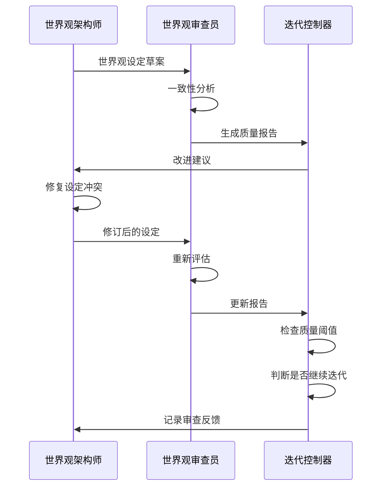
```mermaid
sequenceDiagram
participant Builder as 世界观架构师
participant Reviewer as 世界观审查员
participant Controller as 迭代控制器
Builder->>Reviewer : 世界观设定草案
Reviewer->>Reviewer : 一致性分析
Reviewer->>Controller : 生成质量报告
Controller->>Builder : 改进建议
Builder->>Builder : 修复设定冲突
Builder->>Reviewer : 修订后的设定
Reviewer->>Reviewer : 重新评估
Reviewer->>Controller : 更新报告
Controller->>Controller : 检查质量阈值
Controller->>Controller : 判断是否继续迭代
Controller->>Builder : 记录审查反馈
```

**图表来源**
- [world_review_loop.py](file://agents/world_review_loop.py#L206-L482)

**章节来源**
- [world_review_loop.py](file://agents/world_review_loop.py#L206-L482)

### 情节审查循环 (PlotReviewHandler)

情节审查循环确保情节架构的完整性、节奏把控、冲突张力、角色利用度和伏笔设计，支持结构完整性、节奏把控、冲突强度、角色使用和伏笔回收等评估。

#### 评估维度
- **结构完整性**：清晰的起承转合
- **节奏把控**：张弛有度的推进
- **冲突张力**：足够的戏剧冲突
- **角色利用度**：充分发挥角色作用
- **伏笔设计**：合理的铺垫和回收

#### 统一的标准化实现

**更新** 情节审查处理器现在基于统一的审查循环处理器基类实现，支持多轮迭代审查，最大迭代次数统一为5次：

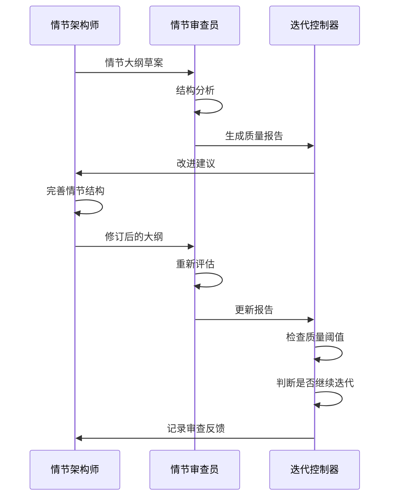
```mermaid
sequenceDiagram
participant Builder as 情节架构师
participant Reviewer as 情节审查员
participant Controller as 迭代控制器
Builder->>Reviewer : 情节大纲草案
Reviewer->>Reviewer : 结构分析
Reviewer->>Controller : 生成质量报告
Controller->>Builder : 改进建议
Builder->>Builder : 完善情节结构
Builder->>Reviewer : 修订后的大纲
Reviewer->>Reviewer : 重新评估
Reviewer->>Controller : 更新报告
Controller->>Controller : 检查质量阈值
Controller->>Controller : 判断是否继续迭代
Controller->>Builder : 记录审查反馈
```

**图表来源**
- [plot_review_loop.py](file://agents/plot_review_loop.py#L229-L544)

**章节来源**
- [plot_review_loop.py](file://agents/plot_review_loop.py#L229-L544)

### 章节审查循环 (ReviewLoopHandler)

章节审查循环实现了Writer-Editor协作的质量改进机制，专门负责章节内容的质量控制。

#### 评估维度
- **语言流畅度**：文字表达的通顺程度
- **情节逻辑**：剧情发展的合理性
- **角色一致性**：角色行为与设定的一致性
- **节奏把控**：故事推进的速度控制

#### 统一的标准化实现

**更新** 章节审查处理器现在基于统一的审查循环处理器基类实现，支持多轮迭代审查，最大迭代次数统一为5次：

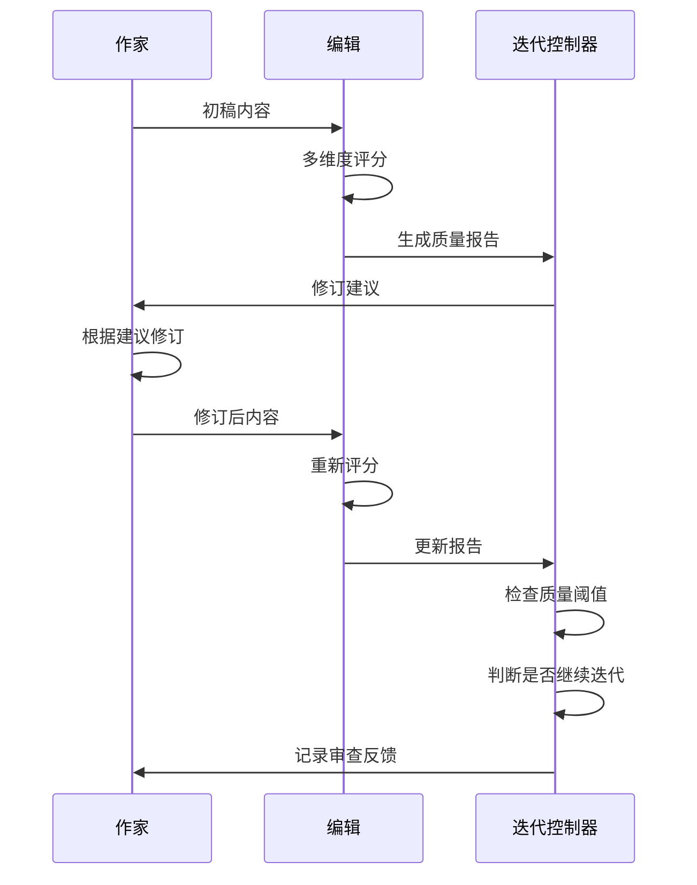
```mermaid
sequenceDiagram
participant Writer as 作家
participant Editor as 编辑
participant Controller as 迭代控制器
Writer->>Editor : 初稿内容
Editor->>Editor : 多维度评分
Editor->>Controller : 生成质量报告
Controller->>Writer : 修订建议
Writer->>Writer : 根据建议修订
Writer->>Editor : 修订后内容
Editor->>Editor : 重新评分
Editor->>Controller : 更新报告
Controller->>Controller : 检查质量阈值
Controller->>Controller : 判断是否继续迭代
Controller->>Writer : 记录审查反馈
```

**图表来源**
- [review_loop.py](file://agents/review_loop.py#L113-L263)

**章节来源**
- [review_loop.py](file://agents/review_loop.py#L16-L34)

## 质量阈值控制机制

### 多维度质量阈值设置

系统支持不同维度的质量阈值设置，包括：

- **章节质量阈值**：默认7.5分，控制章节内容质量
- **角色设计阈值**：默认7.0分，控制角色设计质量
- **世界观设计阈值**：默认7.0分，控制设定质量
- **情节大纲阈值**：默认7.0分，控制情节架构质量

### 动态阈值调整

质量阈值可以根据以下因素动态调整：
- **内容复杂度**：更复杂的章节可能需要更高的质量标准
- **创作阶段**：不同阶段的质量要求可能不同
- **成本控制**：预算限制可能影响质量阈值
- **用户偏好**：根据用户反馈调整质量标准

### 阈值控制策略

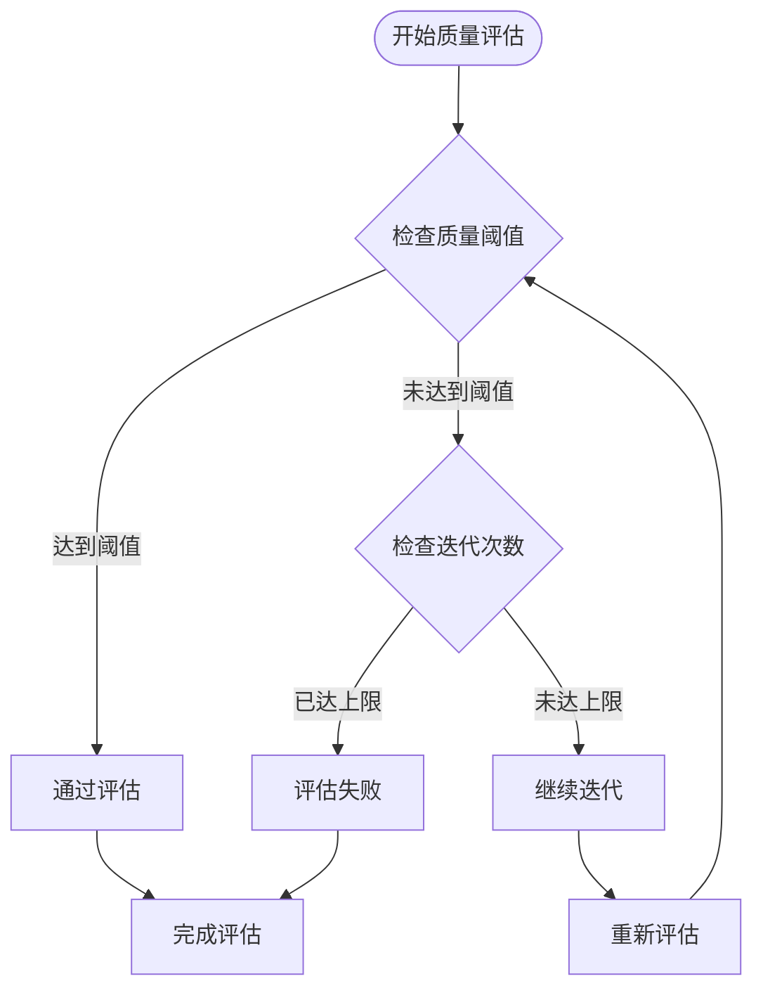
```mermaid
flowchart TD
Start([开始质量评估]) --> CheckThreshold{检查质量阈值}
CheckThreshold --> |达到阈值| Pass[通过评估]
CheckThreshold --> |未达到阈值| CheckIterations{检查迭代次数}
CheckIterations --> |未达上限| Continue[继续迭代]
CheckIterations --> |已达上限| Fail[评估失败]
Continue --> Reassess[重新评估]
Reassess --> CheckThreshold
Pass --> Complete[完成评估]
Fail --> Complete
```

**图表来源**
- [iteration_controller.py](file://agents/iteration_controller.py#L70-L115)

## 迭代限制与成本控制

### 综合迭代控制

系统通过迭代控制器实现综合的迭代限制机制：

#### 退出条件
1. **质量达标**：当前分数≥质量阈值
2. **迭代次数限制**：超过最大迭代次数
3. **成本超限**：累计成本超过预算限制

#### 成本控制策略
- **实时成本监控**：每轮迭代后更新累计成本
- **成本预算分配**：为不同阶段分配预算
- **成本效益分析**：评估每次迭代的成本收益

### 迭代历史记录

系统详细记录每次迭代的历史信息：

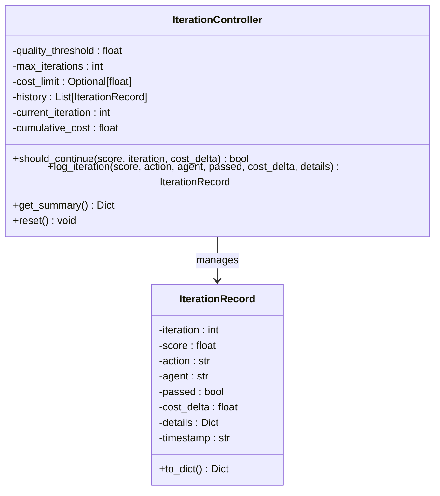
```mermaid
classDiagram
class IterationRecord {
-iteration : int
-score : float
-action : str
-agent : str
-passed : bool
-cost_delta : float
-details : Dict
-timestamp : str
+to_dict() Dict
}
class IterationController {
-quality_threshold : float
-max_iterations : int
-cost_limit : Optional[float]
-history : List[IterationRecord]
-current_iteration : int
-cumulative_cost : float
+should_continue(score, iteration, cost_delta) bool
+log_iteration(score, action, agent, passed, cost_delta, details) IterationRecord
+get_summary() Dict
+reset() void
}
IterationController --> IterationRecord : manages
```

**图表来源**
- [iteration_controller.py](file://agents/iteration_controller.py#L11-L39)

**章节来源**
- [iteration_controller.py](file://agents/iteration_controller.py#L41-L159)

### 标准化迭代限制配置

**更新** 系统已标准化迭代限制配置：

#### 统一的最大迭代次数
- **世界审查**：最大迭代次数统一为5次
- **角色审查**：最大迭代次数统一为5次  
- **情节审查**：最大迭代次数统一为5次
- **章节审查**：最大迭代次数统一为5次

#### 连续性修复迭代限制
- **连续性修复**：最大迭代次数从2次增加到3次

#### 配置实现
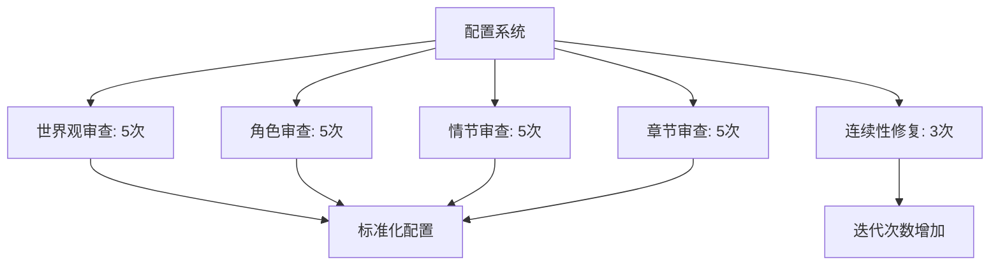
```mermaid
flowchart TD
Config[配置系统] --> WorldReview[世界观审查: 5次]
Config --> CharReview[角色审查: 5次]
Config --> PlotReview[情节审查: 5次]
Config --> ChapterReview[章节审查: 5次]
Config --> ContinuityFix[连续性修复: 3次]
WorldReview --> Standardized[标准化配置]
CharReview --> Standardized
PlotReview --> Standardized
ChapterReview --> Standardized
ContinuityFix --> Increased[迭代次数增加]
```

**图表来源**
- [crew_manager.py](file://agents/crew_manager.py#L50-L88)
- [character_review_loop.py](file://agents/character_review_loop.py#L212-L230)
- [world_review_loop.py](file://agents/world_review_loop.py#L216-L226)
- [plot_review_loop.py](file://agents/plot_review_loop.py#L239-L249)

**章节来源**
- [crew_manager.py](file://agents/crew_manager.py#L50-L88)
- [character_review_loop.py](file://agents/character_review_loop.py#L212-L230)
- [world_review_loop.py](file://agents/world_review_loop.py#L216-L226)
- [plot_review_loop.py](file://agents/plot_review_loop.py#L239-L249)

## 详细报告机制

### 多维度质量报告

系统提供详细的多维度质量报告，包括：

#### 章节质量报告
- **总体评分**：综合质量分数
- **维度评分**：语言流畅度、情节逻辑、角色一致性、节奏把控
- **改进建议**：具体的修改建议和优先级
- **评估摘要**：简短的整体评价

#### 多阶段评估报告
- **角色设计报告**：心理深度、独特性、成长潜力、关系复杂性、世界观契合度
- **世界观报告**：内在一致性、深度与广度、独特性、可扩展性、力量体系完整性
- **情节大纲报告**：结构完整性、节奏把控、冲突张力、角色利用度、伏笔设计

### 统一的审查结果系统

**更新** 系统现在提供统一的审查结果数据结构：

#### 审查结果数据结构
- **最终输出内容**：不同类型的最终输出（字符串/字典/列表）
- **最终评分**：最后一次迭代的质量评分
- **总迭代次数**：实际完成的迭代轮次
- **收敛状态**：是否达到质量阈值
- **迭代历史**：每轮迭代的详细记录
- **质量报告**：最后一次迭代的质量报告

#### 审查结果类型
- **章节审查结果**：最终输出为字符串（章节内容）
- **角色审查结果**：最终输出为列表（角色列表）
- **世界观审查结果**：最终输出为字典（世界观设定）
- **情节审查结果**：最终输出为字典（情节大纲）

### 审查反馈记录

团队上下文系统保存详细的审查反馈记录：
- **审查者信息**：评审者的身份和职责
- **目标对象**：被审查的内容和Agent
- **评分详情**：各项指标的评分和解释
- **改进建议**：具体的修改建议和实施指导

**章节来源**
- [review_loop.py](file://agents/review_loop.py#L16-L34)
- [character_review_loop.py](file://agents/character_review_loop.py#L19-L39)
- [world_review_loop.py](file://agents/world_review_loop.py#L20-L39)
- [plot_review_loop.py](file://agents/plot_review_loop.py#L20-L39)

## 依赖关系分析

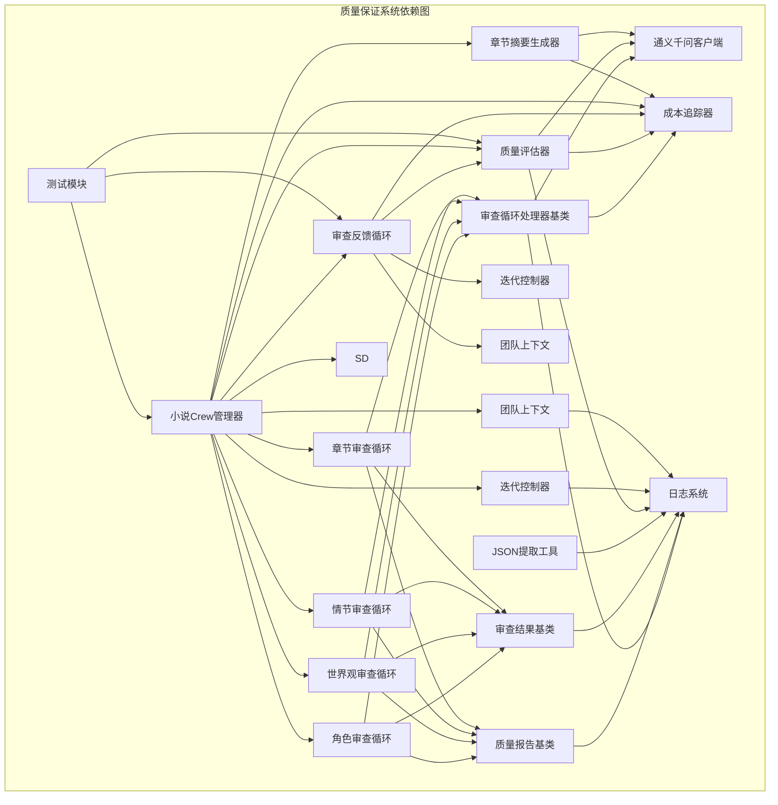
```mermaid
graph TB
subgraph "质量保证系统依赖图"
BRB[审查循环处理器基类] --> QwenClient[通义千问客户端]
BRB --> CostTracker[成本追踪器]
BRB --> Logger[日志系统]
BQR[质量报告基类] --> Logger
BRR[审查结果基类] --> Logger
JE[JSON提取工具] --> Logger
QE[质量评估器] --> QwenClient
QE --> CostTracker
QE --> Logger
RL[审查反馈循环] --> QE
RL --> IterationController[迭代控制器]
RL --> TeamContext[团队上下文]
RL --> CostTracker
CRE[角色审查循环] --> BRB
CRE --> BQR
CRE --> BRR
WRE[世界观审查循环] --> BRB
WRE --> BQR
WRE --> BRR
PRE[情节审查循环] --> BRB
PRE --> BQR
PRE --> BRR
RRL[章节审查循环] --> BRB
RRL --> BQR
RRL --> BRR
CM[小说Crew管理器] --> QE
CM --> RL
CM --> CRE
CM --> WRE
CM --> PRE
CM --> RRL
CM --> IC
CM --> TC
CM --> SD
CM --> CSG
CM --> CostTracker
CSG[章节摘要生成器] --> QwenClient
CSG --> CostTracker
IC[迭代控制器] --> Logger
TC[团队上下文] --> Logger
Test[测试模块] --> CM
Test --> QE
Test --> RL
end
```

**图表来源**
- [crew_manager.py](file://agents/crew_manager.py#L10-L35)
- [quality_evaluator.py](file://agents/quality_evaluator.py#L7-L9)

**章节来源**
- [crew_manager.py](file://agents/crew_manager.py#L10-L35)
- [quality_evaluator.py](file://agents/quality_evaluator.py#L7-L9)

## 性能考虑

### Token使用优化

系统通过以下机制优化Token使用效率：

1. **智能截断**：章节摘要生成器自动截取内容避免过长输入
2. **成本分类追踪**：区分不同类型的API调用成本
3. **迭代控制**：通过迭代控制器限制最大迭代次数
4. **批量处理**：支持批量自动化任务执行

### 内存管理

- **上下文压缩**：使用上下文压缩器减少内存占用
- **分页加载**：相似度检测器只比较最近的章节内容
- **缓存机制**：章节摘要和内容缓存提高访问速度
- **迭代历史管理**：定期清理历史记录释放内存

### 并发处理

- **异步调用**：所有LLM API调用都采用异步模式
- **资源池管理**：合理分配和回收系统资源
- **负载均衡**：多Agent并行处理提高效率

## 故障排除指南

### 常见问题及解决方案

#### 质量评估失败
当质量评估器无法从LLM响应中提取JSON时，系统会：
1. 尝试直接解析JSON格式
2. 检查Markdown代码块标记
3. 查找第一个和最后一个花括号之间的内容
4. 如果仍失败，返回默认通过报告

#### 审查循环异常
审查反馈循环具有完善的错误处理机制：
1. 编辑器审查失败时返回默认评分
2. Writer修订失败时停止迭代
3. 记录详细的错误日志便于调试
4. 提供重试机制和降级策略

#### 多阶段评估问题
多阶段评估系统提供：
1. **统一实现模式**：所有审查处理器遵循相同的基类实现
2. **标准化配置**：统一的迭代限制和质量阈值
3. **成本控制**：为各阶段分配合理的成本预算
4. **进度监控**：实时监控各阶段的完成进度

#### 迭代控制异常
迭代控制器的故障排除：
1. **阈值设置**：检查质量阈值是否合理
2. **迭代限制**：确认最大迭代次数设置
3. **成本监控**：验证成本限制配置
4. **历史记录**：检查迭代历史是否正常

**章节来源**
- [quality_evaluator.py](file://agents/quality_evaluator.py#L137-L173)
- [review_loop.py](file://agents/review_loop.py#L294-L322)
- [iteration_controller.py](file://agents/iteration_controller.py#L89-L115)

### 测试框架

系统包含完整的测试框架，确保质量保证机制的可靠性：

#### 单元测试
- **自动化服务测试**：验证端到端工作流
- **集成服务测试**：测试服务间的协作
- **测试夹具**：提供数据库和HTTP客户端

#### 测试配置
- **异步事件循环**：正确处理异步测试
- **数据库隔离**：每个测试使用独立的数据库
- **事务回滚**：测试完成后自动清理数据

**章节来源**
- [test_automation_service.py](file://tests/unit/test_automation_service.py#L6-L87)
- [test_integration_service.py](file://tests/unit/test_integration_service.py#L6-L59)
- [conftest.py](file://tests/conftest.py#L21-L84)

## 结论

小说质量保证系统通过多层次的质量控制机制，确保生成的小说内容达到专业标准。系统的主要优势包括：

1. **统一质量报告框架**：基于BaseQualityReport基类的标准化质量评估报告结构
2. **全面的质量评估**：多维度评分确保内容质量
3. **智能的改进机制**：审查反馈循环持续优化内容
4. **多阶段评估系统**：支持章节、角色、世界观和情节的多层级质量控制
5. **灵活的质量阈值**：支持不同维度的质量标准设置
6. **综合迭代控制**：基于质量阈值、迭代次数和成本的综合控制
7. **详细报告机制**：提供多维度的质量评估报告和迭代历史
8. **成本控制**：精确的Token使用追踪
9. **团队协作**：高效的Agent间信息共享
10. **可扩展性**：模块化的架构设计
11. **标准化基础架构**：统一的审查循环实现模式和质量报告框架

**更新** 系统的新特性包括统一的基础架构标准化、标准化审查循环实现模式、新的质量报告框架和审查结果系统。这些功能共同构成了一个完整的质量保证生态系统。

**标准化迭代限制配置** 系统现已实现配置标准化，将世界审查、角色审查、情节审查、章节审查的最大迭代次数统一为5次，连续性修复的最大迭代次数从2次增加到3次。这一标准化配置提升了系统的稳定性和一致性，为小说创作提供了更加可靠和高效的质量保证方案。

**统一的标准化实现** 系统现在基于统一的审查循环处理器基类实现，所有审查处理器都遵循相同的模板方法模式，确保了实现的一致性和可维护性。新的质量报告框架和审查结果系统提供了更加标准化和统一的数据结构，便于系统的扩展和维护。

未来可以进一步优化算法性能，增加更多的质量评估维度，并扩展到其他类型的创意内容生成。同时，可以考虑引入机器学习技术来自动调整质量阈值和优化评估参数，进一步提升系统的智能化水平。