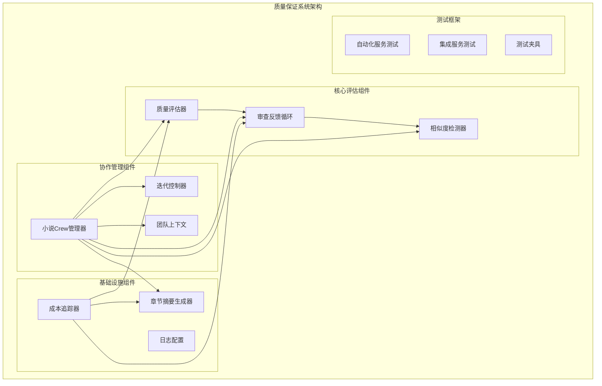
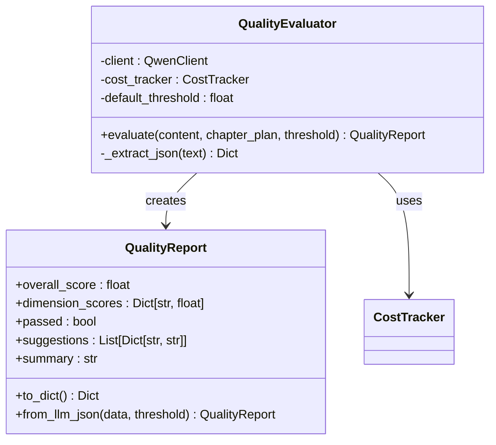
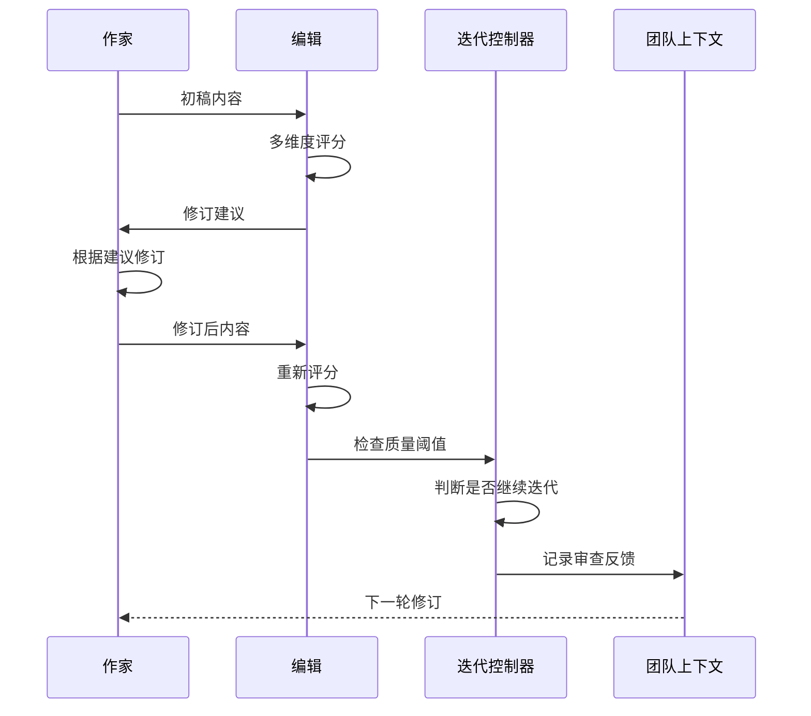
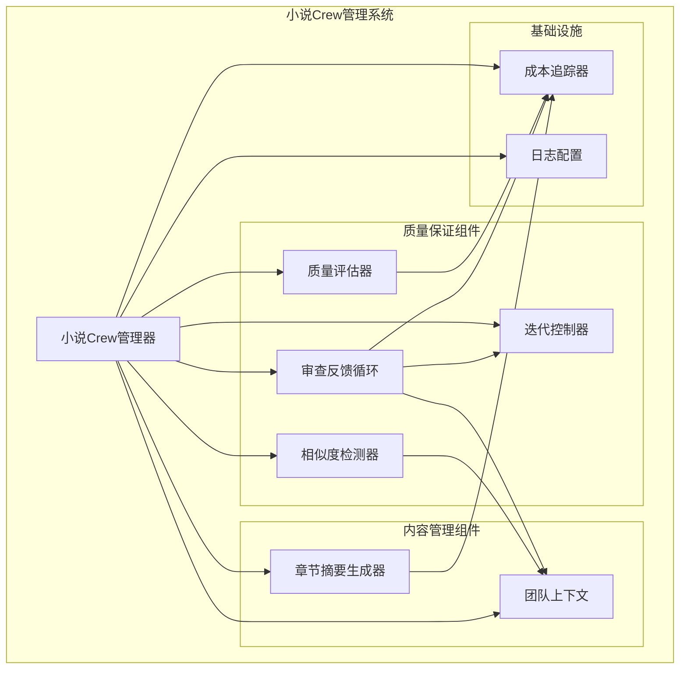
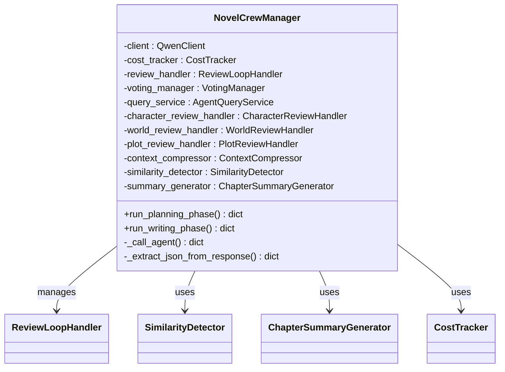
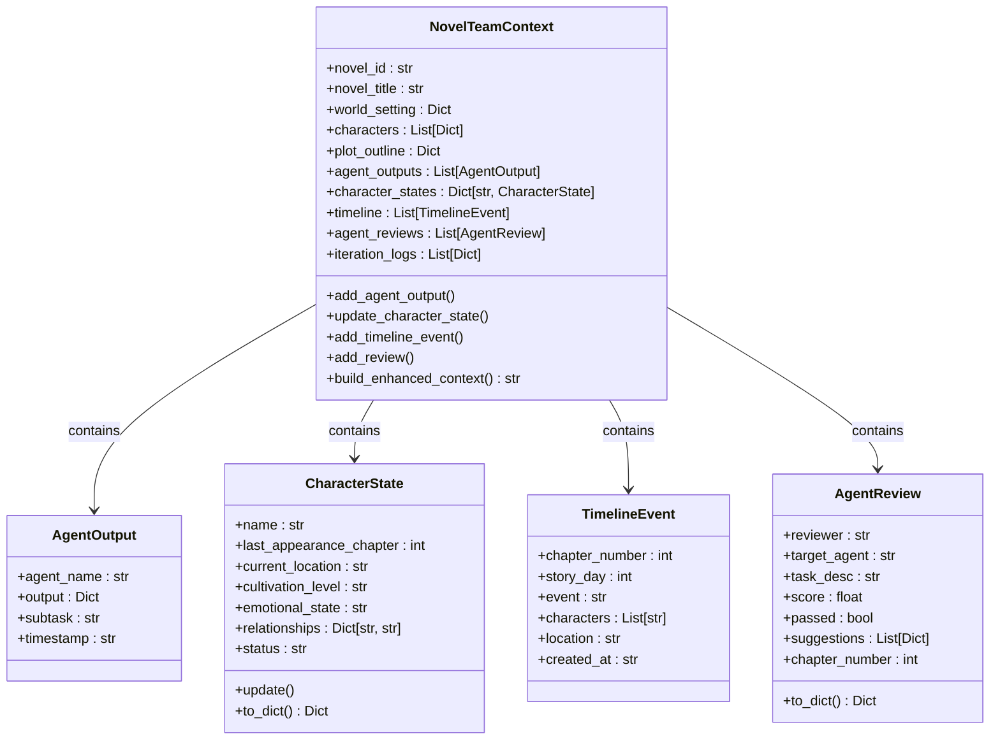
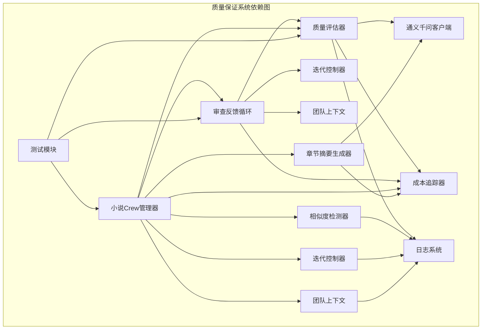

# 质量保证系统

<cite>
**本文档引用的文件**
- [quality_evaluator.py](file://agents/quality_evaluator.py)
- [review_loop.py](file://agents/review_loop.py)
- [similarity_detector.py](file://agents/similarity_detector.py)
- [crew_manager.py](file://agents/crew_manager.py)
- [team_context.py](file://agents/team_context.py)
- [cost_tracker.py](file://llm/cost_tracker.py)
- [iteration_controller.py](file://agents/iteration_controller.py)
- [chapter_summary_generator.py](file://agents/chapter_summary_generator.py)
- [logging_config.py](file://core/logging_config.py)
- [test_automation_service.py](file://tests/unit/test_automation_service.py)
- [test_integration_service.py](file://tests/unit/test_integration_service.py)
- [conftest.py](file://tests/conftest.py)
</cite>

## 目录
1. [简介](#简介)
2. [项目结构](#项目结构)
3. [核心组件](#核心组件)
4. [架构概览](#架构概览)
5. [详细组件分析](#详细组件分析)
6. [依赖关系分析](#依赖关系分析)
7. [性能考虑](#性能考虑)
8. [故障排除指南](#故障排除指南)
9. [结论](#结论)

## 简介

小说质量保证系统是一个基于人工智能的自动化小说创作质量控制系统。该系统通过多维度的质量评估、智能审查反馈循环、内容相似度检测和成本追踪等机制，确保生成的小说内容达到专业标准。

系统的核心特点包括：
- 多维度质量评估：涵盖语言流畅度、情节逻辑、角色一致性和节奏把控
- 智能审查反馈循环：Writer-Editor协作的质量改进机制
- 内容质量保障：防止重复内容和保持叙事连贯性
- 成本控制：精确的Token使用量和费用追踪
- 团队协作：跨Agent的信息共享和状态管理

## 项目结构

**图表来源**
- [quality_evaluator.py](file://agents/quality_evaluator.py#L78-L173)
- [review_loop.py](file://agents/review_loop.py#L91-L322)
- [similarity_detector.py](file://agents/similarity_detector.py#L41-L235)
- [crew_manager.py](file://agents/crew_manager.py#L38-L1038)

**章节来源**
- [crew_manager.py](file://agents/crew_manager.py#L38-L1038)
- [team_context.py](file://agents/team_context.py#L155-L493)

## 核心组件

### 质量评估器 (QualityEvaluator)

质量评估器是系统的核心质量控制组件，负责对章节内容进行多维度评分。它支持以下评估维度：

- **语言流畅度 (fluency)**：文字表达的通顺程度
- **情节逻辑 (plot_logic)**：剧情发展的合理性
- **角色一致性 (character_consistency)**：角色行为与设定的一致性
- **节奏把控 (pacing)**：故事推进的速度控制

**图表来源**
- [quality_evaluator.py](file://agents/quality_evaluator.py#L78-L173)

### 审查反馈循环 (ReviewLoopHandler)

审查反馈循环实现了Writer-Editor协作的质量改进机制。该循环包含以下流程：

1. **Writer生成初稿**
2. **Editor审查评分和润色**
3. **质量评估和迭代控制**
4. **Writer根据反馈修订内容**

**图表来源**
- [review_loop.py](file://agents/review_loop.py#L113-L263)

### 相似度检测器 (SimilarityDetector)

相似度检测器用于防止内容重复，采用多种算法确保章节间的独特性：

- **N-gram相似度检测**：基于字符n-gram的重叠分析
- **句子重叠检测**：识别重复的关键句子
- **结构相似度检测**：分析段落长度和结构模式

**章节来源**
- [similarity_detector.py](file://agents/similarity_detector.py#L41-L235)

## 架构概览

**图表来源**
- [crew_manager.py](file://agents/crew_manager.py#L38-L1038)
- [cost_tracker.py](file://llm/cost_tracker.py#L16-L120)

## 详细组件分析

### 小说Crew管理器

小说Crew管理器是整个质量保证系统的核心协调器，负责管理各个Agent之间的协作。其主要功能包括：

#### 协作机制
- **审查反馈循环**：Writer-Editor质量驱动迭代
- **投票共识**：企划阶段关键决策的多视角投票
- **请求-应答协商**：Writer写作过程中的设定查询

#### 组件集成
系统集成了多个专门的质量保证组件：

**图表来源**
- [crew_manager.py](file://agents/crew_manager.py#L38-L1038)

#### 写作阶段流程

小说Crew管理器的写作阶段包含以下关键步骤：

1. **章节策划**：生成详细的章节计划
2. **内容生成**：作家根据计划生成初稿
3. **质量审查**：审查反馈循环的质量改进
4. **连续性检查**：确保叙事连贯性
5. **最终整合**：生成最终版本内容

**章节来源**
- [crew_manager.py](file://agents/crew_manager.py#L553-L800)

### 团队上下文管理

团队上下文系统实现了Agent之间的信息共享和状态追踪，包含以下核心功能：

#### 数据结构
- **Agent输出历史**：记录各Agent的输出内容
- **角色状态管理**：追踪角色的发展和变化
- **时间线追踪**：维护故事的时间线事件
- **审查反馈记录**：保存质量评估和改进建议

**图表来源**
- [team_context.py](file://agents/team_context.py#L155-L493)

### 成本追踪系统

成本追踪系统精确监控每个Agent的Token使用量和费用消耗：

#### 计费模式
- **模型定价**：支持多种通义千问模型的定价策略
- **分类追踪**：按章节、类别追踪成本
- **实时监控**：提供累计成本和单次调用成本

**图表来源**
- [cost_tracker.py](file://llm/cost_tracker.py#L28-L82)

**章节来源**
- [cost_tracker.py](file://llm/cost_tracker.py#L16-L120)

## 依赖关系分析

**图表来源**
- [crew_manager.py](file://agents/crew_manager.py#L10-L35)
- [quality_evaluator.py](file://agents/quality_evaluator.py#L7-L9)

**章节来源**
- [crew_manager.py](file://agents/crew_manager.py#L10-L35)
- [quality_evaluator.py](file://agents/quality_evaluator.py#L7-L9)

## 性能考虑

### Token使用优化

系统通过以下机制优化Token使用效率：

1. **智能截断**：章节摘要生成器自动截取内容避免过长输入
2. **成本分类追踪**：区分不同类型的API调用成本
3. **迭代控制**：通过迭代控制器限制最大迭代次数

### 内存管理

- **上下文压缩**：使用上下文压缩器减少内存占用
- **分页加载**：相似度检测器只比较最近的章节内容
- **缓存机制**：章节摘要和内容缓存提高访问速度

### 并发处理

- **异步调用**：所有LLM API调用都采用异步模式
- **批量处理**：支持批量自动化任务执行
- **资源池管理**：合理分配和回收系统资源

## 故障排除指南

### 常见问题及解决方案

#### 质量评估失败
当质量评估器无法从LLM响应中提取JSON时，系统会：
1. 尝试直接解析JSON格式
2. 检查Markdown代码块标记
3. 查找第一个和最后一个花括号之间的内容
4. 如果仍失败，返回默认通过报告

#### 审查循环异常
审查反馈循环具有完善的错误处理机制：
1. 编辑器审查失败时返回默认评分
2. Writer修订失败时停止迭代
3. 记录详细的错误日志便于调试

#### 相似度检测问题
相似度检测器提供多种检测策略：
1. N-gram相似度计算
2. 句子级别重叠检测
3. 结构模式相似度分析

**章节来源**
- [quality_evaluator.py](file://agents/quality_evaluator.py#L137-L173)
- [review_loop.py](file://agents/review_loop.py#L294-L322)

### 测试框架

系统包含完整的测试框架，确保质量保证机制的可靠性：

#### 单元测试
- **自动化服务测试**：验证端到端工作流
- **集成服务测试**：测试服务间的协作
- **测试夹具**：提供数据库和HTTP客户端

#### 测试配置
- **异步事件循环**：正确处理异步测试
- **数据库隔离**：每个测试使用独立的数据库
- **事务回滚**：测试完成后自动清理数据

**章节来源**
- [test_automation_service.py](file://tests/unit/test_automation_service.py#L6-L87)
- [test_integration_service.py](file://tests/unit/test_integration_service.py#L6-L59)
- [conftest.py](file://tests/conftest.py#L21-L84)

## 结论

小说质量保证系统通过多层次的质量控制机制，确保生成的小说内容达到专业标准。系统的主要优势包括：

1. **全面的质量评估**：多维度评分确保内容质量
2. **智能的改进机制**：审查反馈循环持续优化内容
3. **成本控制**：精确的Token使用追踪
4. **团队协作**：高效的Agent间信息共享
5. **可扩展性**：模块化的架构设计

该系统为AI驱动的小说创作提供了可靠的质量保障，通过自动化流程减少了人工干预，同时保持了高质量的输出标准。未来可以进一步优化算法性能，增加更多的质量评估维度，并扩展到其他类型的创意内容生成。