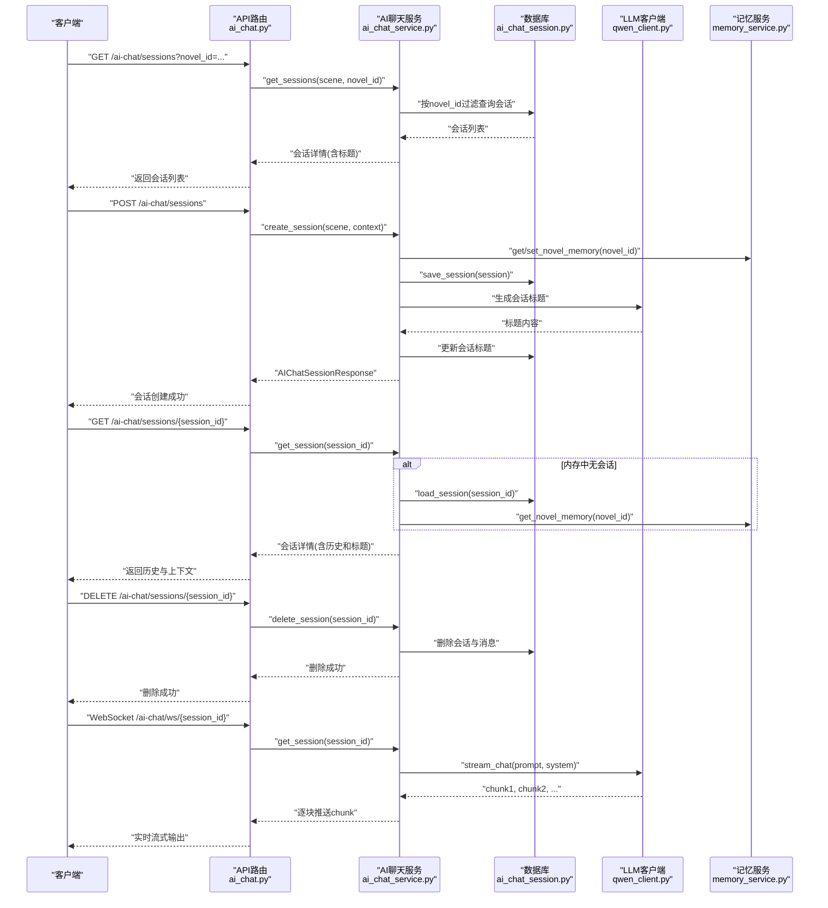
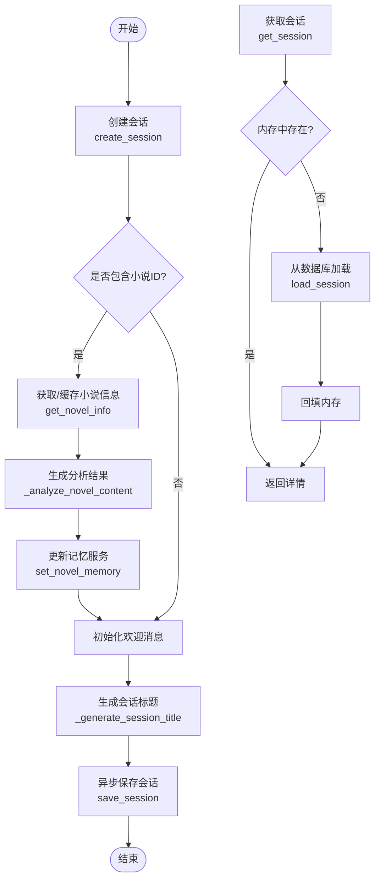
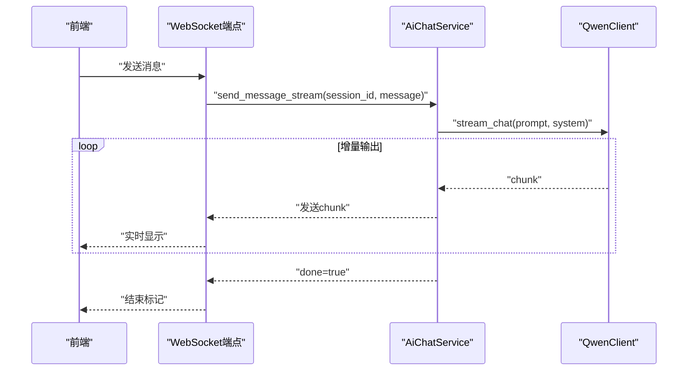
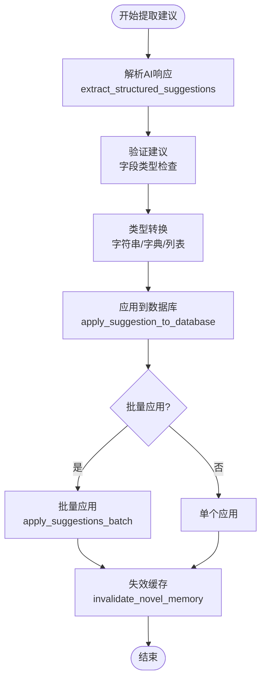
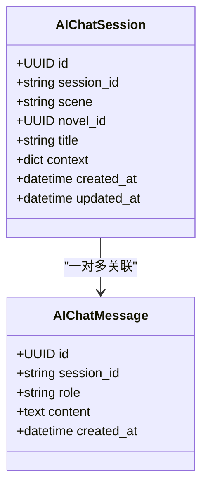
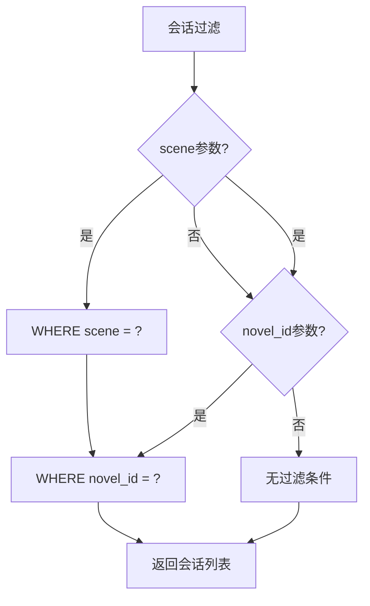
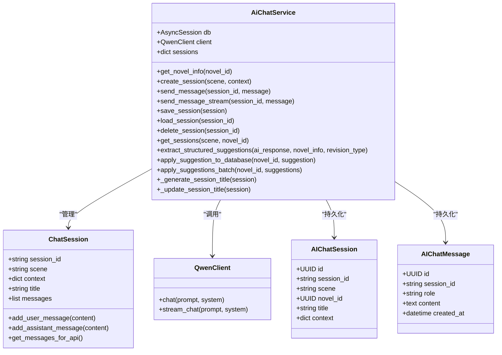

# AI聊天API

<cite>
**本文引用的文件**
- [backend/api/v1/ai_chat.py](file://backend/api/v1/ai_chat.py)
- [backend/schemas/ai_chat.py](file://backend/schemas/ai_chat.py)
- [backend/services/ai_chat_service.py](file://backend/services/ai_chat_service.py)
- [core/models/ai_chat_session.py](file://core/models/ai_chat_session.py)
- [alembic/versions/b5dd1dd83814_add_ai_chat_session_models.py](file://alembic/versions/b5dd1dd83814_add_ai_chat_session_models.py)
- [alembic/versions/5c24a4e1ec52_add_novel_id_and_title_to_chat_session.py](file://alembic/versions/5c24a4e1ec52_add_novel_id_and_title_to_chat_session.py)
- [llm/qwen_client.py](file://llm/qwen_client.py)
- [backend/main.py](file://backend/main.py)
- [frontend/src/api/aiChat.ts](file://frontend/src/api/aiChat.ts)
- [frontend/src/components/AIChatDrawer.tsx](file://frontend/src/components/AIChatDrawer.tsx)
- [backend/services/memory_service.py](file://backend/services/memory_service.py)
</cite>

## 更新摘要
**变更内容**
- 新增结构化修订建议提取、验证和应用API，支持从AI回复中自动提取可执行的修订建议
- 增强WebSocket流式功能，提供更好的实时聊天体验和错误处理
- 改进错误处理机制，包括详细的日志记录和异常反馈
- 新增按小说ID过滤会话列表的API支持，实现会话隔离管理
- 会话标题自动生成和动态显示功能，提升用户体验
- 前端WebSocket流式传输优化，支持更好的实时交互

## 目录
1. [简介](#简介)
2. [项目结构](#项目结构)
3. [核心组件](#核心组件)
4. [架构总览](#架构总览)
5. [详细组件分析](#详细组件分析)
6. [依赖关系分析](#依赖关系分析)
7. [性能与可扩展性](#性能与可扩展性)
8. [故障排查指南](#故障排查指南)
9. [结论](#结论)
10. [附录：API使用示例](#附录api使用示例)

## 简介
本文件面向"AI聊天API"的使用者与维护者，系统性阐述会话管理、消息处理、上下文与历史记录、实时流式传输、会话持久化等能力，并结合创作助手、内容审核、创意讨论等典型场景，提供端到端的使用说明与最佳实践。

**更新** 本版本新增了结构化修订建议功能，支持从AI回复中自动提取可执行的修订建议，包括世界观、角色、大纲、章节等各个方面的建议。同时增强了WebSocket流式功能，改进了错误处理机制，新增了按小说ID过滤会话列表的功能，支持会话隔离管理。

## 项目结构
- 后端采用FastAPI，路由集中在backend/api/v1/ai_chat.py，业务逻辑在backend/services/ai_chat_service.py，数据模型位于core/models/ai_chat_session.py，LLM客户端封装在llm/qwen_client.py。
- 前端通过frontend/src/api/aiChat.ts封装HTTP与WebSocket调用，UI组件frontend/src/components/AIChatDrawer.tsx演示实时流式交互和动态标题显示。
- 数据库迁移脚本定义了ai_chat_sessions与ai_chat_messages两张表，支持会话与消息的持久化，现已支持novel_id和title字段。

```mermaid
graph TB
subgraph "后端"
API["API路由<br/>backend/api/v1/ai_chat.py"]
SVC["AI聊天服务<br/>backend/services/ai_chat_service.py"]
MODEL["会话模型<br/>core/models/ai_chat_session.py"]
LLM["LLM客户端<br/>llm/qwen_client.py"]
MEM["记忆服务<br/>backend/services/memory_service.py"]
END
subgraph "前端"
FE_API["前端API封装<br/>frontend/src/api/aiChat.ts"]
FE_UI["聊天抽屉组件<br/>frontend/src/components/AIChatDrawer.tsx"]
END
subgraph "数据库"
MIG["迁移脚本<br/>alembic/versions/b5dd1dd83814_add_ai_chat_session_models.py"]
MIG2["迁移脚本<br/>alembic/versions/5c24a4e1ec52_add_novel_id_and_title_to_chat_session.py"]
END
FE_API --> API
FE_UI --> FE_API
API --> SVC
SVC --> MODEL
SVC --> LLM
SVC --> MEM
MODEL --> MIG
MODEL --> MIG2
```

**图表来源**
- [backend/api/v1/ai_chat.py](file://backend/api/v1/ai_chat.py#L1-L490)
- [backend/services/ai_chat_service.py](file://backend/services/ai_chat_service.py#L1-L2238)
- [core/models/ai_chat_session.py](file://core/models/ai_chat_session.py#L1-L38)
- [alembic/versions/b5dd1dd83814_add_ai_chat_session_models.py](file://alembic/versions/b5dd1dd83814_add_ai_chat_session_models.py#L1-L59)
- [alembic/versions/5c24a4e1ec52_add_novel_id_and_title_to_chat_session.py](file://alembic/versions/5c24a4e1ec52_add_novel_id_and_title_to_chat_session.py#L1-L44)
- [llm/qwen_client.py](file://llm/qwen_client.py#L1-L232)
- [frontend/src/api/aiChat.ts](file://frontend/src/api/aiChat.ts#L1-L212)
- [frontend/src/components/AIChatDrawer.tsx](file://frontend/src/components/AIChatDrawer.tsx#L1-L992)

## 核心组件
- API路由层：提供会话创建、列表查询、详情获取、消息发送、会话删除、WebSocket流式对话、意图解析与修订建议等接口，现支持按novel_id过滤。
- 服务层：负责会话生命周期管理、上下文与历史记录维护、意图识别与澄清、与LLM交互、数据库持久化、会话标题生成与更新、以及与记忆服务协作。
- 数据模型层：定义会话与消息的数据库表结构，支持索引与外键约束，现已包含novel_id和title字段。
- LLM客户端：封装DashScope/OpenAI兼容模式的调用，支持重试与流式输出。
- 记忆服务：提供小说信息的内存缓存与版本管理，提升加载效率并检测内容变化。
- 前端API与UI：封装HTTP与WebSocket调用，展示实时流式消息和动态会话标题。

**章节来源**
- [backend/api/v1/ai_chat.py](file://backend/api/v1/ai_chat.py#L58-L490)
- [backend/services/ai_chat_service.py](file://backend/services/ai_chat_service.py#L194-L2238)
- [core/models/ai_chat_session.py](file://core/models/ai_chat_session.py#L17-L38)
- [llm/qwen_client.py](file://llm/qwen_client.py#L16-L232)
- [backend/services/memory_service.py](file://backend/services/memory_service.py#L72-L232)
- [frontend/src/api/aiChat.ts](file://frontend/src/api/aiChat.ts#L150-L212)
- [frontend/src/components/AIChatDrawer.tsx](file://frontend/src/components/AIChatDrawer.tsx#L118-L155)

## 架构总览
下图展示了从HTTP请求到WebSocket流式响应的端到端流程，以及与数据库、LLM与记忆服务的交互，现支持按小说ID的会话过滤。



**图表来源**
- [backend/api/v1/ai_chat.py](file://backend/api/v1/ai_chat.py#L126-L186)
- [backend/services/ai_chat_service.py](file://backend/services/ai_chat_service.py#L1505-L1684)
- [core/models/ai_chat_session.py](file://core/models/ai_chat_session.py#L17-L38)
- [llm/qwen_client.py](file://llm/qwen_client.py#L163-L232)
- [backend/services/memory_service.py](file://backend/services/memory_service.py#L72-L138)

## 详细组件分析

### 1) 会话管理与持久化
- 会话创建：接收场景与可选上下文，生成唯一session_id，初始化欢迎消息，必要时加载小说信息并生成分析结果，异步保存至数据库。
- 会话列表：支持按场景和novel_id过滤，按更新时间倒序返回，现支持按小说隔离会话。
- 会话详情：优先从内存获取，否则从数据库加载并回填内存；返回session_id、场景、上下文、标题与完整消息历史。
- 会话删除：先从内存移除，再从数据库删除会话与消息。
- **新增** 会话标题管理：自动从对话内容生成标题，支持动态更新和显示。



**图表来源**
- [backend/services/ai_chat_service.py](file://backend/services/ai_chat_service.py#L552-L611)
- [backend/services/ai_chat_service.py](file://backend/services/ai_chat_service.py#L432-L481)
- [backend/api/v1/ai_chat.py](file://backend/api/v1/ai_chat.py#L58-L93)

**章节来源**
- [backend/api/v1/ai_chat.py](file://backend/api/v1/ai_chat.py#L58-L93)
- [backend/services/ai_chat_service.py](file://backend/services/ai_chat_service.py#L432-L481)
- [core/models/ai_chat_session.py](file://core/models/ai_chat_session.py#L17-L38)

### 2) 消息格式与历史记录
- 消息结构：包含role（user/assistant）与content。
- 历史记录：服务内部维护messages列表与conversation_history，对外统一序列化为API响应格式。
- 上下文注入：当场景为小说修订/分析时，会在提示词中注入小说信息（标题、类型、角色、大纲、章节等），并支持按修订类型生成针对性提示词。

**章节来源**
- [backend/schemas/ai_chat.py](file://backend/schemas/ai_chat.py#L21-L35)
- [backend/services/ai_chat_service.py](file://backend/services/ai_chat_service.py#L120-L192)
- [backend/services/ai_chat_service.py](file://backend/services/ai_chat_service.py#L1111-L1309)

### 3) 实时聊天与流式传输
- HTTP消息：send_message返回完整回复。
- WebSocket流式：/ai-chat/ws/{session_id}建立连接后，逐块推送chunk，最后发送done标记；异常时返回error。
- LLM流式：QwenClient.stream_chat支持增量输出，服务层逐块转发给客户端。



**图表来源**
- [backend/api/v1/ai_chat.py](file://backend/api/v1/ai_chat.py#L126-L186)
- [backend/services/ai_chat_service.py](file://backend/services/ai_chat_service.py#L1505-L1684)
- [llm/qwen_client.py](file://llm/qwen_client.py#L163-L232)
- [frontend/src/components/AIChatDrawer.tsx](file://frontend/src/components/AIChatDrawer.tsx#L118-L155)

**章节来源**
- [backend/api/v1/ai_chat.py](file://backend/api/v1/ai_chat.py#L126-L186)
- [backend/services/ai_chat_service.py](file://backend/services/ai_chat_service.py#L1505-L1684)
- [llm/qwen_client.py](file://llm/qwen_client.py#L163-L232)
- [frontend/src/components/AIChatDrawer.tsx](file://frontend/src/components/AIChatDrawer.tsx#L118-L155)

### 4) 场景与意图处理
- 场景类型：novel_creation、crawler_task、novel_revision、novel_analysis。
- 意图识别：根据用户输入关键词识别创作、修订、分析等意图；必要时生成追问问题引导澄清。
- 修订提示词：针对世界设定、角色、大纲、章节等类型生成定制化提示词，必要时注入小说关键信息。

**章节来源**
- [backend/services/ai_chat_service.py](file://backend/services/ai_chat_service.py#L696-L807)
- [backend/services/ai_chat_service.py](file://backend/services/ai_chat_service.py#L808-L864)
- [backend/services/ai_chat_service.py](file://backend/services/ai_chat_service.py#L1111-L1309)

### 5) 结构化修订建议与数据库应用
**更新** 新增了完整的结构化修订建议功能，支持从AI回复中自动提取可执行的修订建议。

- **增强的建议提取**：从AI回复中抽取结构化建议，包含类型、目标对象、字段、建议值、描述与置信度，支持改进的类型转换逻辑和验证处理。
- **优化的系统提示词**：针对不同修订类型（novel、world_setting、character、outline、chapter）提供详细的提取指导。
- **改进的类型转换**：针对不同字段类型（字符串、字典、列表）进行智能转换，确保数据库字段类型匹配。
- **增强的验证处理**：对建议内容进行严格验证，包括字段存在性检查、类型验证和长度限制。
- **单个应用**：根据建议类型与目标定位数据库实体，更新对应字段，支持角色和章节的ID/名称匹配。
- **批量应用**：逐条应用并汇总结果，成功后失效记忆缓存以保证下次读取最新数据。



**图表来源**
- [backend/services/ai_chat_service.py](file://backend/services/ai_chat_service.py#L1799-L1893)
- [backend/services/ai_chat_service.py](file://backend/services/ai_chat_service.py#L1894-L2135)
- [backend/services/ai_chat_service.py](file://backend/services/ai_chat_service.py#L2136-L2173)

**章节来源**
- [backend/services/ai_chat_service.py](file://backend/services/ai_chat_service.py#L1799-L1893)
- [backend/services/ai_chat_service.py](file://backend/services/ai_chat_service.py#L1894-L2135)
- [backend/services/ai_chat_service.py](file://backend/services/ai_chat_service.py#L2136-L2173)

### 6) 数据模型与迁移
- 表结构：ai_chat_sessions（会话主表）、ai_chat_messages（消息明细表），支持session_id唯一索引与外键约束。
- 迁移：创建表、索引与外键，满足会话与消息的快速检索与一致性。
- **更新** 新增字段：novel_id（UUID类型，用于按小说隔离会话）和title（字符串类型，用于会话标题显示）。



**图表来源**
- [core/models/ai_chat_session.py](file://core/models/ai_chat_session.py#L17-L38)
- [alembic/versions/5c24a4e1ec52_add_novel_id_and_title_to_chat_session.py](file://alembic/versions/5c24a4e1ec52_add_novel_id_and_title_to_chat_session.py#L21-L44)

**章节来源**
- [core/models/ai_chat_session.py](file://core/models/ai_chat_session.py#L17-L38)
- [alembic/versions/b5dd1dd83814_add_ai_chat_session_models.py](file://alembic/versions/b5dd1dd83814_add_ai_chat_session_models.py#L21-L59)
- [alembic/versions/5c24a4e1ec52_add_novel_id_and_title_to_chat_session.py](file://alembic/versions/5c24a4e1ec52_add_novel_id_and_title_to_chat_session.py#L21-L44)

### 7) 前端集成要点
- HTTP接口：封装会话创建、消息发送、会话列表、详情与删除，现支持novel_id参数过滤。
- WebSocket：构建ws/wss地址，发送消息并接收chunk，结束时停止流式。
- UI组件：演示实时渲染、错误处理与滚动行为，现支持动态会话标题显示。
- **新增** 动态标题显示：优先显示会话标题，如不存在则显示场景对应的默认标题。

**章节来源**
- [frontend/src/api/aiChat.ts](file://frontend/src/api/aiChat.ts#L169-L175)
- [frontend/src/api/aiChat.ts](file://frontend/src/api/aiChat.ts#L113-L117)
- [frontend/src/components/AIChatDrawer.tsx](file://frontend/src/components/AIChatDrawer.tsx#L700-L704)

### 8) 改进的日志记录与错误处理
**更新** 新增了详细的修订建议处理日志记录和错误处理机制。

- **增强的日志记录**：详细的建议提取过程日志，包括建议类型、字段、目标ID等关键信息。
- **改进的错误处理**：对JSON解析失败、数据库操作异常等情况进行优雅处理和错误反馈。
- **验证机制**：对输入参数进行严格验证，确保数据完整性和类型正确性。
- **应用跟踪**：记录每个建议的应用结果，包括成功、失败和跳过的情况。
- **会话标题管理**：记录会话标题生成和更新的日志，便于调试和监控。

**章节来源**
- [backend/services/ai_chat_service.py](file://backend/services/ai_chat_service.py#L1887-L1892)
- [backend/services/ai_chat_service.py](file://backend/services/ai_chat_service.py#L1921-L1928)
- [backend/api/v1/ai_chat.py](file://backend/api/v1/ai_chat.py#L118-L124)

### 9) 按小说ID过滤会话列表
**新增** 会话列表现在支持按novel_id参数过滤，实现会话按小说的隔离管理。

- **API端点**：GET /ai-chat/sessions?novel_id={novel_id}
- **参数支持**：scene（可选场景过滤）、novel_id（可选小说ID过滤）
- **数据库查询**：按novel_id精确匹配，支持UUID类型转换
- **前端集成**：listSessions函数支持novelId参数传递



**图表来源**
- [backend/api/v1/ai_chat.py](file://backend/api/v1/ai_chat.py#L222-L238)
- [backend/services/ai_chat_service.py](file://backend/services/ai_chat_service.py#L482-L525)

**章节来源**
- [backend/api/v1/ai_chat.py](file://backend/api/v1/ai_chat.py#L222-L238)
- [backend/services/ai_chat_service.py](file://backend/services/ai_chat_service.py#L482-L525)
- [frontend/src/api/aiChat.ts](file://frontend/src/api/aiChat.ts#L169-L175)

### 10) 会话标题自动生成与显示
**新增** 会话标题管理功能，提供智能的会话标题生成和动态显示。

- **标题生成**：基于对话内容（前6条消息）生成简洁的会话标题
- **自动更新**：首次有用户消息时自动生成并更新数据库
- **优先显示**：前端优先显示数据库中的标题，如不存在则显示场景默认标题
- **AI生成**：使用LLM生成标题，支持自定义提示词和温度参数

**章节来源**
- [backend/services/ai_chat_service.py](file://backend/services/ai_chat_service.py#L615-L679)
- [frontend/src/components/AIChatDrawer.tsx](file://frontend/src/components/AIChatDrawer.tsx#L700-L704)

## 依赖关系分析



**图表来源**
- [backend/services/ai_chat_service.py](file://backend/services/ai_chat_service.py#L194-L2238)
- [llm/qwen_client.py](file://llm/qwen_client.py#L16-L232)
- [core/models/ai_chat_session.py](file://core/models/ai_chat_session.py#L17-L38)

**章节来源**
- [backend/services/ai_chat_service.py](file://backend/services/ai_chat_service.py#L194-L2238)
- [llm/qwen_client.py](file://llm/qwen_client.py#L16-L232)
- [core/models/ai_chat_session.py](file://core/models/ai_chat_session.py#L17-L38)

## 性能与可扩展性
- 内存与数据库双缓存：会话优先驻留内存，减少数据库压力；数据库仅存储变更与历史，支持增量保存。
- 记忆服务：对小说信息进行结构化缓存与版本管理，检测变化后更新，避免重复计算。
- 流式输出：LLM与WebSocket均支持增量输出，降低首屏延迟与带宽占用。
- 异步保存：会话保存采用异步任务，不影响请求响应。
- **修订建议缓存**：成功应用的建议会使记忆缓存失效并更新版本，确保数据一致性。
- **会话标题缓存**：生成的标题会缓存到数据库，避免重复计算。
- **按小说过滤**：novel_id字段支持索引，提高按小说过滤的查询性能。
- 可扩展点：可引入Redis缓存、分页加载历史、压缩消息内容、限流与鉴权中间件等。

## 故障排查指南
- 会话不存在：当session_id无效或未创建时，HTTP接口返回404；WebSocket端点会先校验会话是否存在。
- LLM调用失败：QwenClient内置重试机制；若仍失败，WebSocket会返回error；可在日志中查看详细异常。
- 数据库异常：保存/加载会话时捕获异常并回滚，确保一致性；可通过数据库迁移脚本确认表结构。
- 前端连接问题：确认WebSocket地址协议（ws/wss）与主机一致；监听onerror/onclose事件并做降级处理。
- **建议提取失败**：检查AI响应格式是否符合预期，确保JSON解析正常；查看日志中的详细错误信息。
- **建议应用失败**：验证目标对象是否存在，检查字段类型是否匹配，确认数据库连接正常。
- **修订建议验证失败**：检查建议字段是否在允许的范围内，确保置信度在0-1之间。
- **会话标题生成失败**：检查LLM服务可用性，查看日志中的错误信息；回退到默认标题。
- **按小说过滤失败**：确认novel_id格式正确（UUID格式），检查数据库中是否存在该小说ID。

**章节来源**
- [backend/api/v1/ai_chat.py](file://backend/api/v1/ai_chat.py#L118-L124)
- [backend/api/v1/ai_chat.py](file://backend/api/v1/ai_chat.py#L177-L186)
- [llm/qwen_client.py](file://llm/qwen_client.py#L16-L44)
- [backend/services/ai_chat_service.py](file://backend/services/ai_chat_service.py#L1674-L1684)

## 结论
本AI聊天API围绕"会话生命周期管理 + 上下文与历史 + 实时流式 + 结构化建议 + 数据持久化"构建，既满足创作助手、内容审核、创意讨论等场景，又具备良好的扩展性与稳定性。通过前端与后端的协同，实现了从HTTP到WebSocket的无缝体验。最新的增强功能进一步提升了建议提取的准确性和应用的可靠性，为小说创作和修订提供了更强大的智能化支持。

**更新** 新增的结构化修订建议功能显著提升了系统的智能化水平，能够自动从AI回复中提取可执行的修订建议，包括世界观、角色、大纲、章节等各个方面的具体修改内容。增强的WebSocket流式功能提供了更好的实时聊天体验，改进的错误处理机制确保了系统的稳定性和可靠性。按小说ID过滤会话列表功能支持多小说场景下的会话隔离管理，会话标题自动生成和动态显示功能大幅改善了用户体验。

## 附录：API使用示例

### 基础聊天API
- 创建会话
  - 方法与路径：POST /ai-chat/sessions
  - 请求体字段：scene（必填，枚举）、context（可选，可包含novel_id）
  - 响应体字段：session_id、scene、welcome_message、created_at
  - 示例场景：novel_creation、crawler_task、novel_revision、novel_analysis

- 发送消息（HTTP）
  - 方法与路径：POST /ai-chat/sessions/{session_id}/messages
  - 请求体字段：message（必填）
  - 响应体字段：session_id、message、role、created_at

- 获取会话详情
  - 方法与路径：GET /ai-chat/sessions/{session_id}
  - 响应体字段：session_id、scene、context、messages（role/content）

- 获取会话列表
  - 方法与路径：GET /ai-chat/sessions?scene=...&novel_id=...
  - 查询参数：scene（可选）、novel_id（可选，按小说ID过滤）
  - 响应体字段：sessions（包含id、session_id、scene、novel_id、title、context、created_at、updated_at）

- 删除会话
  - 方法与路径：DELETE /ai-chat/sessions/{session_id}
  - 响应体字段：message

- 实时聊天（WebSocket）
  - 路径：/api/v1/ai-chat/ws/{session_id}
  - 客户端发送：{"message": "..."}
  - 服务端推送：{"chunk": "...", "done": false}，最后{"chunk": "", "done": true}

### 意图解析API
- 小说意图解析
  - 方法与路径：POST /ai-chat/parse-novel
  - 请求体字段：user_input（必填）
  - 响应体字段：title、genre、tags、synopsis

- 爬虫意图解析
  - 方法与路径：POST /ai-chat/parse-crawler
  - 请求体字段：user_input（必填）
  - 响应体字段：crawl_type、ranking_type、max_pages、book_ids

### 结构化修订建议API
**更新** 新增了完整的修订建议提取、验证和应用API。

- **新增** 提取建议
  - 方法与路径：POST /ai-chat/extract-suggestions
  - 请求体字段：novel_id（必填）、ai_response（必填）、revision_type（可选，默认general）
  - 响应体字段：suggestions（包含type、target_id、target_name、field、suggested_value、description、confidence）

- **新增** 应用单个建议
  - 方法与路径：POST /ai-chat/apply-suggestion
  - 请求体字段：novel_id（必填）、suggestion（必填，包含上述建议字段）
  - 响应体字段：success、type、field、character_name、chapter_number、error

- **新增** 批量应用建议
  - 方法与路径：POST /ai-chat/apply-suggestions
  - 请求体字段：novel_id（必填）、suggestions（必填，建议数组）
  - 响应体字段：total、success_count、failed_count、details

- **新增** 获取角色列表
  - 方法与路径：GET /ai-chat/novels/{novel_id}/characters-list
  - 响应体字段：characters（包含id、name、role_type、personality、background）

- **新增** 获取章节列表
  - 方法与路径：GET /ai-chat/novels/{novel_id}/chapters-list
  - 响应体字段：chapters（包含id、chapter_number、title、word_count、status）

### 按小说ID过滤会话列表API
**新增** 支持按小说ID过滤会话列表的API使用示例。

- 获取特定小说的会话列表
  - 方法与路径：GET /ai-chat/sessions?novel_id={novel_id}&scene={scene}
  - 查询参数：novel_id（必填，小说ID）、scene（可选，场景类型）
  - 响应体字段：sessions（包含过滤后的会话列表）

**章节来源**
- [backend/api/v1/ai_chat.py](file://backend/api/v1/ai_chat.py#L58-L490)
- [backend/schemas/ai_chat.py](file://backend/schemas/ai_chat.py#L9-L139)
- [frontend/src/api/aiChat.ts](file://frontend/src/api/aiChat.ts#L150-L212)
- [frontend/src/components/AIChatDrawer.tsx](file://frontend/src/components/AIChatDrawer.tsx#L118-L155)