# AI聊天API

<cite>
**本文档引用的文件**
- [backend/api/v1/ai_chat.py](file://backend/api/v1/ai_chat.py)
- [backend/schemas/ai_chat.py](file://backend/schemas/ai_chat.py)
- [backend/services/ai_chat_service.py](file://backend/services/ai_chat_service.py)
- [core/models/ai_chat_session.py](file://core/models/ai_chat_session.py)
- [alembic/versions_archived/b5dd1dd83814_add_ai_chat_session_models.py](file://alembic/versions_archived/b5dd1dd83814_add_ai_chat_session_models.py)
- [alembic/versions_archived/5c24a4e1ec52_add_novel_id_and_title_to_chat_session.py](file://alembic/versions_archived/5c24a4e1ec52_add_novel_id_and_title_to_chat_session.py)
- [llm/qwen_client.py](file://llm/qwen_client.py)
- [backend/main.py](file://backend/main.py)
- [frontend/src/api/aiChat.ts](file://frontend/src/api/aiChat.ts)
- [frontend/src/components/AIChatDrawer.tsx](file://frontend/src/components/AIChatDrawer.tsx)
- [backend/services/memory_service.py](file://backend/services/memory_service.py)
- [backend/services/context_manager.py](file://backend/services/context_manager.py)
- [backend/services/revision_understanding_service.py](file://backend/services/revision_understanding_service.py)
- [backend/services/revision_execution_service.py](file://backend/services/revision_execution_service.py)
- [backend/services/revision_data_validator.py](file://backend/services/revision_data_validator.py)
- [backend/api/v1/revision.py](file://backend/api/v1/revision.py)
- [core/models/revision_plan.py](file://core/models/revision_plan.py)
- [alembic/versions/add_revision_and_memory_tables.py](file://alembic/versions/add_revision_and_memory_tables.py)
- [backend/services/novel_tool_executor.py](file://backend/services/novel_tool_executor.py)
</cite>

## 更新摘要
**变更内容**
- 新增章节修改建议提取和应用的API端点，包括extract-chapter-suggestions和apply-chapter-modification路由
- 新增章节助手场景（chapter_assistant），专门用于章节编辑和改进
- 新增章节修改建议的数据模型和响应格式
- 新增章节修改建议的前端展示和应用界面
- 新增章节修改建议的LLM解析和结构化提取功能
- 新增章节修改建议的工具执行和应用机制

## 目录
1. [简介](#简介)
2. [项目结构](#项目结构)
3. [核心组件](#核心组件)
4. [架构总览](#架构总览)
5. [详细组件分析](#详细组件分析)
6. [依赖关系分析](#依赖关系分析)
7. [性能与可扩展性](#性能与可扩展性)
8. [故障排查指南](#故障排查指南)
9. [结论](#结论)
10. [附录：API使用示例](#附录api使用示例)

## 简介
本文件面向"AI聊天API"的使用者与维护者，系统性阐述会话管理、消息处理、上下文与历史记录、实时流式传输、会话持久化等能力，并结合创作助手、内容审核、创意讨论等典型场景，提供端到端的使用说明与最佳实践。

**更新** 本版本新增了完整的AI聊天数据库模式支持，包括会话与消息的持久化存储；实现了WebSocket流式对话功能，支持实时消息传输；引入了结构化修订建议提取与应用机制，为小说创作和修订提供智能化支持；新增智能章节分析功能，支持章节内容的深度分析与结构化摘要生成；新增自然语言修订功能，支持通过对话解析用户修订指令并执行数据库更新；新增修订理解服务，支持用户反馈的结构化解析与修订计划生成；新增章节修改建议提取和应用功能，支持从AI回复中提取具体的章节修改建议并直接应用到小说内容中；新增章节助手场景，专门用于章节编辑和改进。

## 项目结构
- 后端采用FastAPI，路由集中在backend/api/v1/ai_chat.py，业务逻辑在backend/services/ai_chat_service.py，数据模型位于core/models/ai_chat_session.py，LLM客户端封装在llm/qwen_client.py。
- 前端通过frontend/src/api/aiChat.ts封装HTTP与WebSocket调用，UI组件frontend/src/components/AIChatDrawer.tsx演示实时流式交互和动态标题显示。
- 数据库迁移脚本定义了ai_chat_sessions与ai_chat_messages两张表，支持会话与消息的持久化，现已支持novel_id和title字段。
- 新增智能章节分析功能，通过章节摘要生成和智能摘要功能提供深度分析能力。
- 新增自然语言修订功能，支持通过对话解析用户修订指令，提供预览和确认机制。
- 新增修订理解服务，支持用户反馈的结构化解析与修订计划生成。
- 新增修订数据验证服务，确保修订指令的有效性与准确性。
- 新增修订执行服务，支持修订计划的确认执行与影响评估。
- **新增** 章节修改建议功能，支持从AI回复中提取具体的章节修改建议并直接应用到小说内容中。
- **新增** 章节助手场景，专门用于章节编辑和改进，支持章节内容分析和修改建议提取。

```mermaid
graph TB
subgraph "后端"
API["API路由<br/>backend/api/v1/ai_chat.py"]
SVC["AI聊天服务<br/>backend/services/ai_chat_service.py"]
MODEL["会话模型<br/>core/models/ai_chat_session.py"]
LLM["LLM客户端<br/>llm/qwen_client.py"]
MEM["记忆服务<br/>backend/services/memory_service.py"]
CTX["上下文管理<br/>backend/services/context_manager.py"]
REV_U["修订理解服务<br/>backend/services/revision_understanding_service.py"]
REV_D["修订数据验证<br/>backend/services/revision_data_validator.py"]
REV_E["修订执行服务<br/>backend/services/revision_execution_service.py"]
CHAP_MOD["章节修改服务<br/>extract_chapter_modifications"]
NOVEL_TOOL["小说工具执行器<br/>novel_tool_executor"]
END
subgraph "前端"
FE_API["前端API封装<br/>frontend/src/api/aiChat.ts"]
FE_UI["聊天抽屉组件<br/>frontend/src/components/AIChatDrawer.tsx"]
END
subgraph "数据库"
MIG["迁移脚本<br/>alembic/versions_archived/b5dd1dd83814_add_ai_chat_session_models.py"]
MIG2["迁移脚本<br/>alembic/versions_archived/5c24a4e1ec52_add_novel_id_and_title_to_chat_session.py"]
MIG3["修订表迁移<br/>alembic/versions/add_revision_and_memory_tables.py"]
END
FE_API --> API
FE_UI --> FE_API
API --> SVC
SVC --> MODEL
SVC --> LLM
SVC --> MEM
SVC --> CTX
SVC --> REV_U
SVC --> REV_D
SVC --> REV_E
SVC --> CHAP_MOD
SVC --> NOVEL_TOOL
REV_API --> REV_U
REV_API --> REV_D
REV_API --> REV_E
MODEL --> MIG
MODEL --> MIG2
MIG3 --> REV_U
MIG3 --> REV_D
MIG3 --> REV_E
```

**图表来源**
- [backend/api/v1/ai_chat.py:1-768](file://backend/api/v1/ai_chat.py#L1-L768)
- [backend/services/ai_chat_service.py:1-4450](file://backend/services/ai_chat_service.py#L1-L4450)
- [core/models/ai_chat_session.py:1-53](file://core/models/ai_chat_session.py#L1-L53)
- [alembic/versions_archived/b5dd1dd83814_add_ai_chat_session_models.py:1-96](file://alembic/versions_archived/b5dd1dd83814_add_ai_chat_session_models.py#L1-L96)
- [alembic/versions_archived/5c24a4e1ec52_add_novel_id_and_title_to_chat_session.py:1-53](file://alembic/versions_archived/5c24a4e1ec52_add_novel_id_and_title_to_chat_session.py#L1-L53)
- [llm/qwen_client.py:1-232](file://llm/qwen_client.py#L1-L232)
- [frontend/src/api/aiChat.ts:1-436](file://frontend/src/api/aiChat.ts#L1-L436)
- [frontend/src/components/AIChatDrawer.tsx:120-1089](file://frontend/src/components/AIChatDrawer.tsx#L120-L1089)
- [backend/services/revision_understanding_service.py:1-511](file://backend/services/revision_understanding_service.py#L1-L511)
- [backend/services/revision_execution_service.py:1-97](file://backend/services/revision_execution_service.py#L1-L97)
- [backend/services/revision_data_validator.py:1-619](file://backend/services/revision_data_validator.py#L1-L619)
- [backend/api/v1/revision.py:1-463](file://backend/api/v1/revision.py#L1-L463)
- [core/models/revision_plan.py:1-116](file://core/models/revision_plan.py#L1-L116)
- [alembic/versions/add_revision_and_memory_tables.py:1-157](file://alembic/versions/add_revision_and_memory_tables.py#L1-L157)
- [backend/services/novel_tool_executor.py:100-578](file://backend/services/novel_tool_executor.py#L100-L578)

## 核心组件
- API路由层：提供会话创建、列表查询、详情获取、消息发送、会话删除、WebSocket流式对话、意图解析与修订建议等接口，现支持按novel_id过滤。
- 服务层：负责会话生命周期管理、上下文与历史记录维护、意图识别与澄清、与LLM交互、数据库持久化、会话标题生成与更新、以及与记忆服务协作。
- 数据模型层：定义会话与消息的数据库表结构，支持索引与外键约束，现已包含novel_id和title字段。
- LLM客户端：封装DashScope/OpenAI兼容模式的调用，支持重试与流式输出。
- 记忆服务：提供小说信息的内存缓存与版本管理，提升加载效率并检测内容变化。
- 前端API与UI：封装HTTP与WebSocket调用，展示实时流式消息和动态会话标题。
- **新增** 智能章节分析：提供章节内容的深度分析、结构化摘要生成和智能摘要功能。
- **新增** 结构化修订系统：支持从AI回复中提取结构化修订建议，自动应用到数据库并管理修订流程。
- **新增** 自然语言修订：支持通过对话解析用户修订指令，提供预览和确认机制。
- **新增** 修订理解服务：解析用户反馈，生成修订计划，支持置信度评估和影响范围分析。
- **新增** 修订数据验证：验证用户修订指令中的实体有效性，提供相似名称建议。
- **新增** 修订执行服务：支持修订计划的确认执行，评估影响并更新数据库。
- **新增** 章节修改建议系统：支持从AI回复中提取具体的章节修改建议，包括替换、插入、追加三种类型，并直接应用到小说章节内容中。
- **新增** 章节助手场景：专门用于章节编辑和改进，支持章节内容分析、修改建议提取和应用。

**章节来源**
- [backend/api/v1/ai_chat.py:58-768](file://backend/api/v1/ai_chat.py#L58-L768)
- [backend/services/ai_chat_service.py:214-225](file://backend/services/ai_chat_service.py#L214-L225)
- [core/models/ai_chat_session.py:19-53](file://core/models/ai_chat_session.py#L19-L53)
- [llm/qwen_client.py:16-232](file://llm/qwen_client.py#L16-L232)
- [backend/services/memory_service.py:72-232](file://backend/services/memory_service.py#L72-L232)
- [frontend/src/api/aiChat.ts:150-175](file://frontend/src/api/aiChat.ts#L150-L175)
- [frontend/src/components/AIChatDrawer.tsx:120-1089](file://frontend/src/components/AIChatDrawer.tsx#L120-L1089)

## 架构总览
下图展示了从HTTP请求到WebSocket流式响应的端到端流程，以及与数据库、LLM与记忆服务的交互，现支持按小说ID的会话过滤。

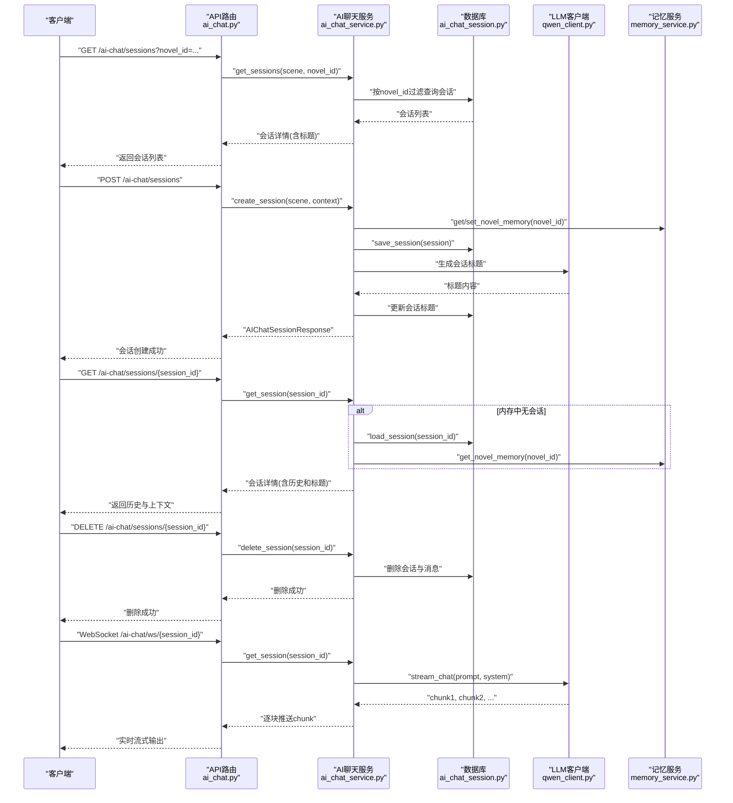

**图表来源**
- [backend/api/v1/ai_chat.py:128-190](file://backend/api/v1/ai_chat.py#L128-L190)
- [backend/services/ai_chat_service.py:421-534](file://backend/services/ai_chat_service.py#L421-L534)
- [core/models/ai_chat_session.py:19-53](file://core/models/ai_chat_session.py#L19-L53)
- [llm/qwen_client.py:163-232](file://llm/qwen_client.py#L163-L232)
- [backend/services/memory_service.py:72-138](file://backend/services/memory_service.py#L72-L138)

## 详细组件分析

### 1) 会话管理与持久化
- 会话创建：接收场景与可选上下文，生成唯一session_id，初始化欢迎消息，必要时加载小说信息并生成分析结果，异步保存至数据库。
- 会话列表：支持按场景和novel_id过滤，按更新时间倒序返回，现支持按小说隔离会话。
- 会话详情：优先从内存获取，否则从数据库加载并回填内存；返回session_id、场景、上下文、标题与完整消息历史。
- 会话删除：先从内存移除，再从数据库删除会话与消息。
- **新增** 会话标题管理：自动从对话内容生成标题，支持动态更新和显示。
- **新增** 章节助手场景：新增chapter_assistant场景，专门用于章节编辑和改进，支持预加载当前章节内容和增强上下文。

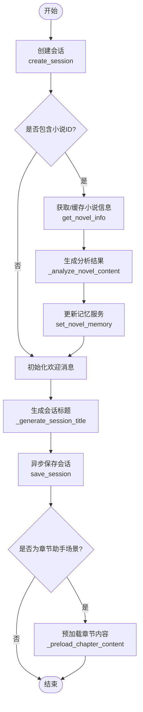

**图表来源**
- [backend/services/ai_chat_service.py:614-683](file://backend/services/ai_chat_service.py#L614-L683)
- [backend/services/ai_chat_service.py:421-534](file://backend/services/ai_chat_service.py#L421-L534)
- [backend/api/v1/ai_chat.py:58-94](file://backend/api/v1/ai_chat.py#L58-L94)

**章节来源**
- [backend/api/v1/ai_chat.py:58-94](file://backend/api/v1/ai_chat.py#L58-L94)
- [backend/services/ai_chat_service.py:421-683](file://backend/services/ai_chat_service.py#L421-L683)
- [core/models/ai_chat_session.py:19-53](file://core/models/ai_chat_session.py#L19-L53)

### 2) 消息格式与历史记录
- 消息结构：包含role（user/assistant）与content。
- 历史记录：服务内部维护messages列表与conversation_history，对外统一序列化为API响应格式。
- 上下文注入：当场景为小说修订/分析时，会在提示词中注入小说信息（标题、类型、角色、大纲、章节等），并支持按修订类型生成针对性提示词。
- **新增** 章节助手上下文：章节助手场景会将当前章节内容注入到系统提示词中，便于进行章节级别的分析和修改。

**章节来源**
- [backend/schemas/ai_chat.py:21-35](file://backend/schemas/ai_chat.py#L21-L35)
- [backend/services/ai_chat_service.py:130-212](file://backend/services/ai_chat_service.py#L130-L212)
- [backend/services/ai_chat_service.py:1485-1716](file://backend/services/ai_chat_service.py#L1485-L1716)
- [backend/services/ai_chat_service.py:3003-3023](file://backend/services/ai_chat_service.py#L3003-L3023)

### 3) 实时聊天与流式传输
- HTTP消息：send_message返回完整回复。
- WebSocket流式：/ai-chat/ws/{session_id}建立连接后，逐块推送chunk，最后发送done标记；异常时返回error。
- LLM流式：QwenClient.stream_chat支持增量输出，服务层逐块转发给客户端。

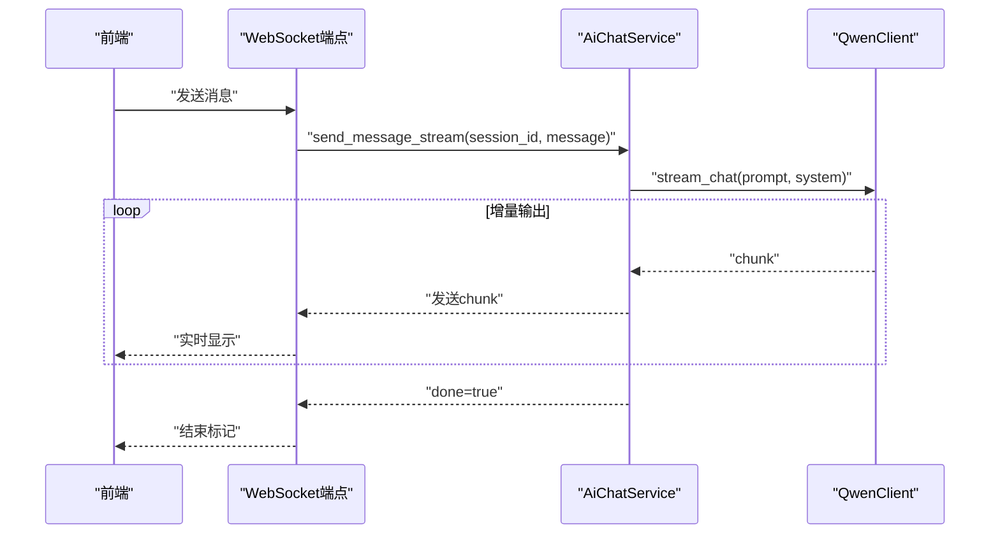

**图表来源**
- [backend/api/v1/ai_chat.py:128-190](file://backend/api/v1/ai_chat.py#L128-L190)
- [backend/services/ai_chat_service.py:1718-1920](file://backend/services/ai_chat_service.py#L1718-L1920)
- [llm/qwen_client.py:163-232](file://llm/qwen_client.py#L163-L232)
- [frontend/src/components/AIChatDrawer.tsx:120-160](file://frontend/src/components/AIChatDrawer.tsx#L120-L160)

**章节来源**
- [backend/api/v1/ai_chat.py:128-190](file://backend/api/v1/ai_chat.py#L128-L190)
- [backend/services/ai_chat_service.py:1718-1920](file://backend/services/ai_chat_service.py#L1718-L1920)
- [llm/qwen_client.py:163-232](file://llm/qwen_client.py#L163-L232)
- [frontend/src/components/AIChatDrawer.tsx:120-160](file://frontend/src/components/AIChatDrawer.tsx#L120-L160)

### 4) 场景与意图处理
- 场景类型：novel_creation、crawler_task、novel_revision、novel_analysis、chapter_assistant。
- 意图识别：根据用户输入关键词识别创作、修订、分析等意图；必要时生成追问问题引导澄清。
- 修订提示词：针对世界设定、角色、大纲、章节等类型生成定制化提示词，必要时注入小说关键信息。
- **新增** 章节助手场景：专门用于章节编辑和改进，支持章节内容分析、修改建议提取和应用。

**章节来源**
- [backend/services/ai_chat_service.py:60-120](file://backend/services/ai_chat_service.py#L60-L120)
- [backend/services/ai_chat_service.py:773-800](file://backend/services/ai_chat_service.py#L773-L800)
- [backend/services/ai_chat_service.py:1300-1483](file://backend/services/ai_chat_service.py#L1300-L1483)
- [backend/services/ai_chat_service.py:218-241](file://backend/services/ai_chat_service.py#L218-L241)

### 5) 结构化修订建议与数据库应用
**更新** 新增了完整的结构化修订建议功能，支持从AI回复中自动提取可执行的修订建议。

- **增强的建议提取**：从AI回复中抽取结构化建议，包含类型、目标对象、字段、建议值、描述与置信度，支持改进的类型转换逻辑和验证处理。
- **优化的系统提示词**：针对不同修订类型（novel、world_setting、character、outline、chapter）提供详细的提取指导。
- **改进的类型转换**：针对不同字段类型（字符串、字典、列表）进行智能转换，确保数据库字段类型匹配。
- **增强的验证处理**：对建议内容进行严格验证，包括字段存在性检查、类型验证和长度限制。
- **单个应用**：根据建议类型与目标定位数据库实体，更新对应字段，支持角色和章节的ID/名称匹配。
- **批量应用**：逐条应用并汇总结果，成功后失效记忆缓存以保证下次读取最新数据。


**图表来源**
- [backend/services/ai_chat_service.py:2054-2156](file://backend/services/ai_chat_service.py#L2054-L2156)
- [backend/services/ai_chat_service.py:2158-2492](file://backend/services/ai_chat_service.py#L2158-L2492)

**章节来源**
- [backend/services/ai_chat_service.py:2054-2156](file://backend/services/ai_chat_service.py#L2054-L2156)
- [backend/services/ai_chat_service.py:2158-2492](file://backend/services/ai_chat_service.py#L2158-L2492)

### 6) 智能章节分析功能
**新增** 智能章节分析功能，提供章节内容的深度分析与结构化摘要生成。

- **智能章节摘要**：使用AI读取完整章节内容并提炼关键点，生成结构化的章节摘要，包含关键事件、情节概要、人物互动、情感走向、伏笔暗示等。
- **章节摘要查询**：支持智能摘要模式和简单模式，智能模式使用LLM提炼关键点，简单模式返回完整章节内容。
- **多章节批量处理**：支持指定章节范围的批量处理，自动缓存已生成的摘要。
- **上下文集成**：智能摘要与章节内容结合，提供更精准的分析建议。

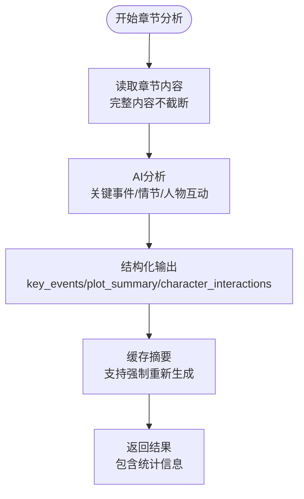

**图表来源**
- [backend/api/v1/ai_chat.py:522-568](file://backend/api/v1/ai_chat.py#L522-L568)
- [backend/services/ai_chat_service.py:664-742](file://backend/services/ai_chat_service.py#L664-L742)

**章节来源**
- [backend/api/v1/ai_chat.py:500-690](file://backend/api/v1/ai_chat.py#L500-L690)
- [backend/services/ai_chat_service.py:664-742](file://backend/services/ai_chat_service.py#L664-L742)

### 7) 自然语言修订系统
**新增** 自然语言修订系统，支持通过对话解析用户修订指令并执行数据库更新。

- **修订指令解析**：将用户的自然语言修订指令解析为结构化的修订操作，支持角色信息修改、新增和删除等操作。
- **修订预览**：生成修订预览，包含操作类型、目标对象、字段、新旧值等信息，供用户确认。
- **确认执行**：用户确认后执行实际的数据库修改操作，支持事务回滚和错误处理。
- **修订流程集成**：与会话管理系统集成，在修订场景下提供完整的对话式修订流程。

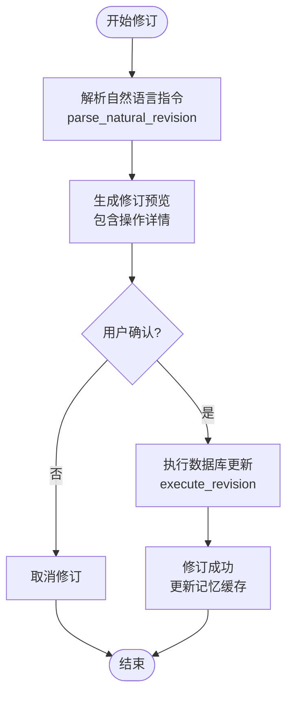

**图表来源**
- [backend/api/v1/ai_chat.py:624-690](file://backend/api/v1/ai_chat.py#L624-L690)
- [backend/services/ai_chat_service.py:3241-3589](file://backend/services/ai_chat_service.py#L3241-L3589)

**章节来源**
- [backend/api/v1/ai_chat.py:624-690](file://backend/api/v1/ai_chat.py#L624-L690)
- [backend/services/ai_chat_service.py:3241-3589](file://backend/services/ai_chat_service.py#L3241-L3589)

### 8) 修订理解服务
**新增** 修订理解服务，支持用户反馈的结构化解析与修订计划生成。

- **反馈解析**：使用LLM分析用户反馈，理解修订意图并生成结构化分析结果。
- **实体验证**：验证用户提到的角色、章节等实体的有效性，提供相似名称建议。
- **目标定位**：补充目标ID信息，定位到具体的小说元素。
- **影响评估**：评估修改对章节和角色的影响范围，提供严重程度评估。
- **修订计划**：创建修订计划，包含理解意图、置信度、目标列表、修改建议和影响评估。

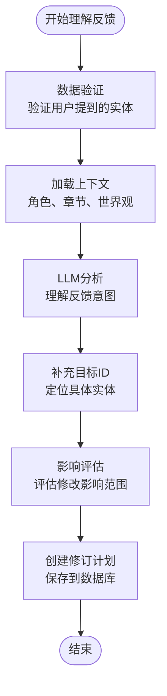

**图表来源**
- [backend/services/revision_understanding_service.py:63-119](file://backend/services/revision_understanding_service.py#L63-L119)
- [backend/services/revision_understanding_service.py:195-231](file://backend/services/revision_understanding_service.py#L195-L231)
- [backend/services/revision_understanding_service.py:391-425](file://backend/services/revision_understanding_service.py#L391-L425)
- [backend/services/revision_understanding_service.py:427-468](file://backend/services/revision_understanding_service.py#L427-L468)

**章节来源**
- [backend/services/revision_understanding_service.py:17-511](file://backend/services/revision_understanding_service.py#L17-L511)

### 9) 修订数据验证
**新增** 修订数据验证服务，确保修订指令的有效性与准确性。

- **实体提取**：从用户反馈中提取角色名、章节号、地点、世界元素等实体。
- **角色验证**：验证角色是否存在，提供模糊匹配和相似名称建议。
- **章节验证**：验证章节号是否存在，提供可用章节建议。
- **地点验证**：验证地点和世界元素，基于世界观设定进行验证。
- **验证报告**：生成详细的验证报告，包含统计数据和警告信息。

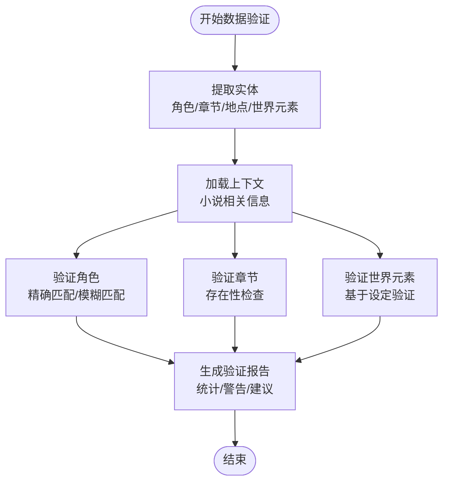

**图表来源**
- [backend/services/revision_data_validator.py:58-132](file://backend/services/revision_data_validator.py#L58-L132)
- [backend/services/revision_data_validator.py:134-202](file://backend/services/revision_data_validator.py#L134-L202)
- [backend/services/revision_data_validator.py:282-345](file://backend/services/revision_data_validator.py#L282-L345)
- [backend/services/revision_data_validator.py:347-391](file://backend/services/revision_data_validator.py#L347-L391)
- [backend/services/revision_data_validator.py:454-502](file://backend/services/revision_data_validator.py#L454-L502)

**章节来源**
- [backend/services/revision_data_validator.py:43-619](file://backend/services/revision_data_validator.py#L43-L619)

### 10) 修订执行服务
**新增** 修订执行服务，支持修订计划的确认执行与影响评估。

- **计划执行**：根据修订计划执行具体的数据库修改操作。
- **用户确认**：支持用户对修订计划的确认或拒绝。
- **修改合并**：合并用户对修改方案的调整。
- **影响追踪**：提取受影响的章节，更新修订计划状态。
- **事务管理**：支持事务回滚和错误处理。

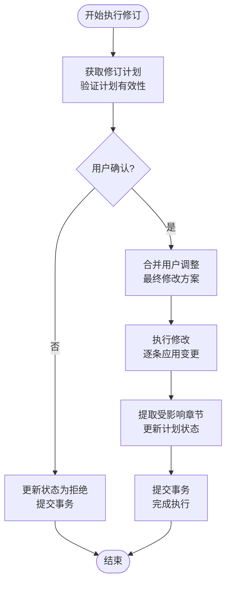

**图表来源**
- [backend/services/revision_execution_service.py:53-97](file://backend/services/revision_execution_service.py#L53-L97)
- [backend/services/revision_execution_service.py:1-52](file://backend/services/revision_execution_service.py#L1-L52)

**章节来源**
- [backend/services/revision_execution_service.py:1-97](file://backend/services/revision_execution_service.py#L1-L97)

### 11) 章节修改建议系统
**新增** 章节修改建议系统，支持从AI回复中提取具体的章节修改建议并直接应用到小说内容中。

- **建议提取**：使用LLM解析AI回复中的修改建议，提取结构化的章节修改建议，包括替换、插入、追加三种类型。
- **建议结构**：包含修改类型、位置描述、原文内容（仅替换类型）、新内容、修改理由、置信度等字段。
- **整体评估**：提供整体评分和优缺点分析，帮助用户全面了解章节质量。
- **建议应用**：支持直接应用修改建议到小说章节内容，包括替换指定文本、在开头插入内容、在末尾追加内容等操作。
- **字数统计**：应用修改后返回修改前后的字数统计，便于用户了解修改效果。
- **工具执行**：通过NovelToolExecutor执行具体的章节修改操作，支持多种修改类型。

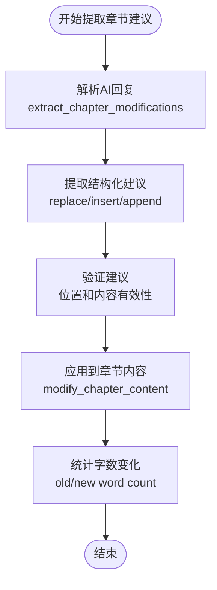

**图表来源**
- [backend/api/v1/ai_chat.py:662-767](file://backend/api/v1/ai_chat.py#L662-L767)
- [backend/services/ai_chat_service.py:4375-4450](file://backend/services/ai_chat_service.py#L4375-L4450)
- [backend/services/novel_tool_executor.py:569-578](file://backend/services/novel_tool_executor.py#L569-L578)

**章节来源**
- [backend/api/v1/ai_chat.py:662-767](file://backend/api/v1/ai_chat.py#L662-L767)
- [backend/services/ai_chat_service.py:4375-4450](file://backend/services/ai_chat_service.py#L4375-L4450)
- [backend/schemas/ai_chat.py:274-319](file://backend/schemas/ai_chat.py#L274-L319)
- [backend/services/novel_tool_executor.py:569-578](file://backend/services/novel_tool_executor.py#L569-L578)

### 12) 数据模型与迁移
- 表结构：ai_chat_sessions（会话主表）、ai_chat_messages（消息明细表），支持session_id唯一索引与外键约束。
- 迁移：创建表、索引与外键，满足会话与消息的快速检索与一致性。
- **更新** 新增字段：novel_id（UUID类型，用于按小说隔离会话）和title（字符串类型，用于会话标题显示）。
- **新增** 修订计划表：revision_plans，支持修订流程的完整记录与管理。
- **新增** 回顾经验表：hindsight_experiences，记录修订经验与策略效果。
- **新增** 策略效果表：strategy_effectiveness，跟踪修订策略的有效性。
- **新增** 用户偏好表：user_preferences，存储用户偏好信息。
- **新增** 章节修改建议模型：ChapterModification，支持替换、插入、追加三种修改类型。

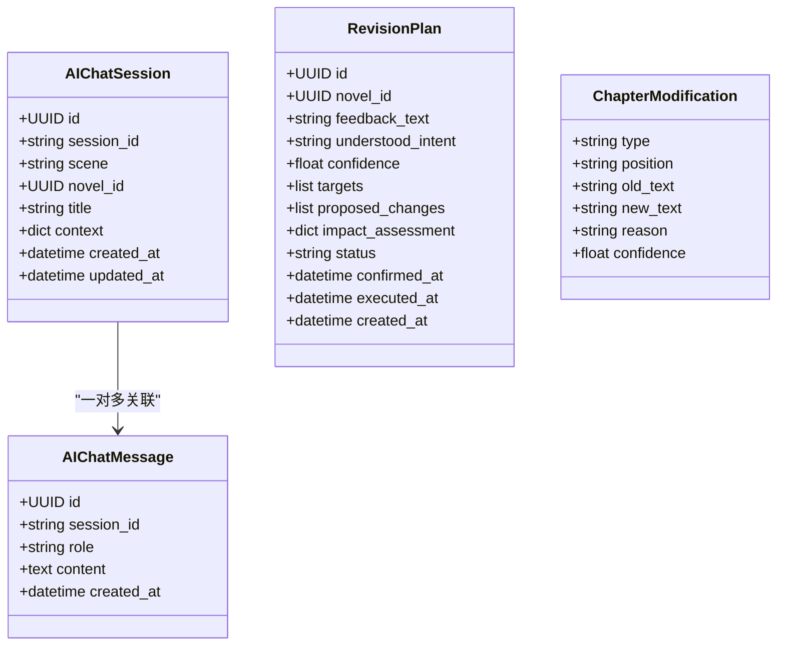

**图表来源**
- [core/models/ai_chat_session.py:19-53](file://core/models/ai_chat_session.py#L19-L53)
- [alembic/versions_archived/5c24a4e1ec52_add_novel_id_and_title_to_chat_session.py:22-53](file://alembic/versions_archived/5c24a4e1ec52_add_novel_id_and_title_to_chat_session.py#L22-L53)
- [core/models/revision_plan.py:33-116](file://core/models/revision_plan.py#L33-L116)
- [alembic/versions/add_revision_and_memory_tables.py:22-157](file://alembic/versions/add_revision_and_memory_tables.py#L22-L157)

**章节来源**
- [core/models/ai_chat_session.py:19-53](file://core/models/ai_chat_session.py#L19-L53)
- [alembic/versions_archived/b5dd1dd83814_add_ai_chat_session_models.py:21-96](file://alembic/versions_archived/b5dd1dd83814_add_ai_chat_session_models.py#L21-L96)
- [alembic/versions_archived/5c24a4e1ec52_add_novel_id_and_title_to_chat_session.py:22-53](file://alembic/versions_archived/5c24a4e1ec52_add_novel_id_and_title_to_chat_session.py#L22-L53)
- [core/models/revision_plan.py:14-116](file://core/models/revision_plan.py#L14-L116)
- [alembic/versions/add_revision_and_memory_tables.py:22-157](file://alembic/versions/add_revision_and_memory_tables.py#L22-L157)

### 13) 前端集成要点
- HTTP接口：封装会话创建、消息发送、会话列表、详情与删除，现支持novel_id参数过滤。
- WebSocket：构建ws/wss地址，发送消息并接收chunk，结束时停止流式。
- UI组件：演示实时渲染、错误处理与滚动行为，现支持动态会话标题显示。
- **新增** 动态标题显示：优先显示会话标题，如不存在则显示场景对应的默认标题。
- **新增** 智能摘要功能：提供章节范围选择和智能摘要生成功能。
- **新增** 修订建议展示：在修订场景下展示提取的结构化建议，支持一键应用。
- **新增** 自然语言修订：支持通过自然语言描述修订需求，提供预览和确认机制。
- **新增** 章节修改建议UI：新增章节修改建议模态框，支持替换、插入、追加三种类型的修改建议展示和应用。
- **新增** 章节助手场景UI：新增章节修改建议提取和应用功能，支持章节内容分析和修改建议展示。

**章节来源**
- [frontend/src/api/aiChat.ts:150-175](file://frontend/src/api/aiChat.ts#L150-L175)
- [frontend/src/api/aiChat.ts:113-117](file://frontend/src/api/aiChat.ts#L113-L117)
- [frontend/src/components/AIChatDrawer.tsx:690-1089](file://frontend/src/components/AIChatDrawer.tsx#L690-L1089)

### 14) 改进的日志记录与错误处理
**更新** 新增了详细的修订建议处理日志记录和错误处理机制。

- **增强的日志记录**：详细的建议提取过程日志，包括建议类型、字段、目标ID等关键信息。
- **改进的错误处理**：对JSON解析失败、数据库操作异常等情况进行优雅处理和错误反馈。
- **验证机制**：对输入参数进行严格验证，确保数据完整性和类型正确性。
- **应用跟踪**：记录每个建议的应用结果，包括成功、失败和跳过的情况。
- **会话标题管理**：记录会话标题生成和更新的日志，便于调试和监控。
- **修订流程日志**：详细记录修订指令解析、预览生成和执行过程。
- **修订理解日志**：记录反馈解析、实体验证和计划生成的详细过程。
- **章节修改日志**：记录章节修改建议提取和应用的详细过程。
- **章节助手日志**：记录章节内容预加载和增强上下文构建的日志。

**章节来源**
- [backend/services/ai_chat_service.py:2183-2191](file://backend/services/ai_chat_service.py#L2183-L2191)
- [backend/services/ai_chat_service.py:2151-2156](file://backend/services/ai_chat_service.py#L2151-L2156)
- [backend/api/v1/ai_chat.py:364-365](file://backend/api/v1/ai_chat.py#L364-L365)

### 15) 按小说ID过滤会话列表
**新增** 会话列表现在支持按novel_id参数过滤，实现会话按小说的隔离管理。

- **API端点**：GET /ai-chat/sessions?novel_id={novel_id}
- **参数支持**：scene（可选场景过滤）、novel_id（可选小说ID过滤）
- **数据库查询**：按novel_id精确匹配，支持UUID类型转换
- **前端集成**：listSessions函数支持novelId参数传递

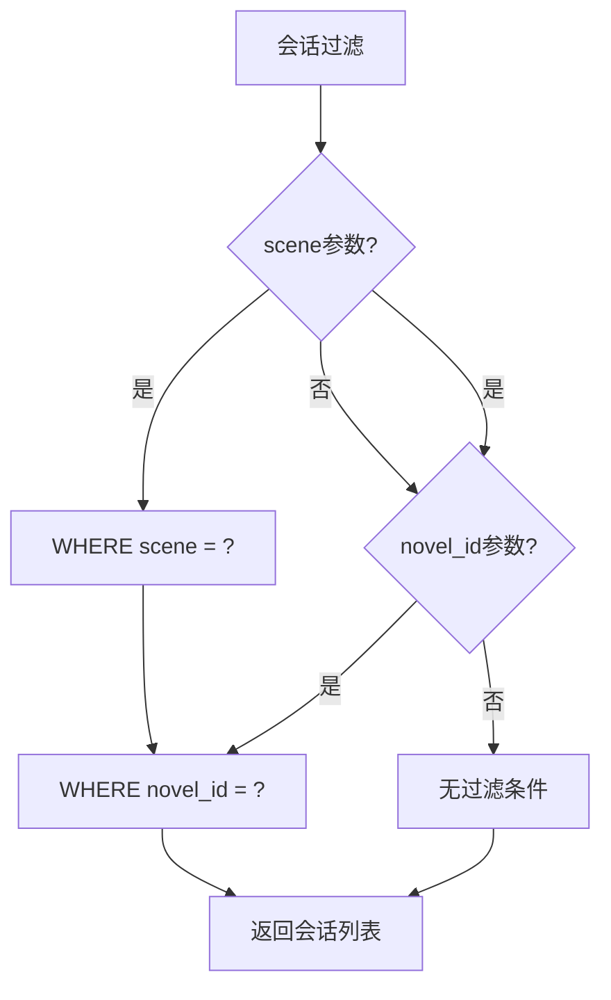

**图表来源**
- [backend/api/v1/ai_chat.py:226-242](file://backend/api/v1/ai_chat.py#L226-L242)
- [backend/services/ai_chat_service.py:535-586](file://backend/services/ai_chat_service.py#L535-L586)

**章节来源**
- [backend/api/v1/ai_chat.py:226-242](file://backend/api/v1/ai_chat.py#L226-L242)
- [backend/services/ai_chat_service.py:535-586](file://backend/services/ai_chat_service.py#L535-L586)
- [frontend/src/api/aiChat.ts:169-175](file://frontend/src/api/aiChat.ts#L169-L175)

### 16) 会话标题自动生成与显示
**新增** 会话标题管理功能，提供智能的会话标题生成和动态显示。

- **标题生成**：基于对话内容（前6条消息）生成简洁的会话标题
- **自动更新**：首次有用户消息时自动生成并更新数据库
- **优先显示**：前端优先显示数据库中的标题，如不存在则显示场景默认标题
- **AI生成**：使用LLM生成标题，支持自定义提示词和温度参数

**章节来源**
- [backend/services/ai_chat_service.py:688-772](file://backend/services/ai_chat_service.py#L688-L772)
- [frontend/src/components/AIChatDrawer.tsx:700-704](file://frontend/src/components/AIChatDrawer.tsx#L700-L704)

### 17) 章节助手场景
**新增** 章节助手场景，专门用于章节编辑和改进，提供完整的章节修改建议提取和应用功能。

- **场景定义**：SCENE_CHAPTER_ASSISTANT，专门用于章节编辑助手
- **预加载内容**：自动加载当前章节内容和增强上下文
- **增强上下文**：构建章节相关的角色、世界设定、剧情大纲等上下文信息
- **欢迎消息**：动态生成章节编辑欢迎消息，包含小说标题、章节号和章节标题
- **系统提示词**：将当前章节内容注入到系统提示词中，便于进行章节级别的分析和修改

**章节来源**
- [backend/services/ai_chat_service.py:218-241](file://backend/services/ai_chat_service.py#L218-L241)
- [backend/services/ai_chat_service.py:1237-1290](file://backend/services/ai_chat_service.py#L1237-L1290)
- [backend/services/ai_chat_service.py:3006-3023](file://backend/services/ai_chat_service.py#L3006-L3023)

## 依赖关系分析

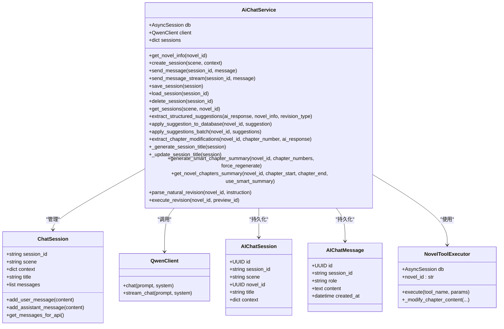

**图表来源**
- [backend/services/ai_chat_service.py:214-225](file://backend/services/ai_chat_service.py#L214-L225)
- [backend/services/ai_chat_service.py:421-683](file://backend/services/ai_chat_service.py#L421-L683)
- [llm/qwen_client.py:16-44](file://llm/qwen_client.py#L16-L44)
- [core/models/ai_chat_session.py:19-53](file://core/models/ai_chat_session.py#L19-L53)
- [backend/services/novel_tool_executor.py:100-578](file://backend/services/novel_tool_executor.py#L100-L578)

**章节来源**
- [backend/services/ai_chat_service.py:214-225](file://backend/services/ai_chat_service.py#L214-L225)
- [llm/qwen_client.py:16-44](file://llm/qwen_client.py#L16-L44)
- [core/models/ai_chat_session.py:19-53](file://core/models/ai_chat_session.py#L19-L53)

## 性能与可扩展性
- 内存与数据库双缓存：会话优先驻留内存，减少数据库压力；数据库仅存储变更与历史，支持增量保存。
- 记忆服务：对小说信息进行结构化缓存与版本管理，检测变化后更新，避免重复计算。
- 流式输出：LLM与WebSocket均支持增量输出，降低首屏延迟与带宽占用。
- 异步保存：会话保存采用异步任务，不影响请求响应。
- **修订建议缓存**：成功应用的建议会使记忆缓存失效并更新版本，确保数据一致性。
- **会话标题缓存**：生成的标题会缓存到数据库，避免重复计算。
- **按小说过滤**：novel_id字段支持索引，提高按小说过滤的查询性能。
- **智能摘要缓存**：章节摘要支持缓存机制，避免重复计算。
- **上下文管理**：多层缓存架构（内存缓存、记忆服务缓存、SQLite持久化）提升性能。
- **自然语言修订缓存**：修订预览临时存储在内存中，支持快速确认执行。
- **修订理解缓存**：LLM分析结果可缓存，减少重复计算。
- **数据验证缓存**：验证结果可缓存，提高后续验证速度。
- **修订执行并发**：支持多个修订计划的并发执行，提高系统吞吐量。
- **章节修改建议缓存**：提取的章节修改建议可缓存，减少重复解析。
- **章节助手上下文缓存**：章节内容预加载和增强上下文可缓存，提升响应速度。
- **章节修改工具缓存**：章节修改操作可缓存，减少重复执行。
- 可扩展点：可引入Redis缓存、分页加载历史、压缩消息内容、限流与鉴权中间件等。

## 故障排查指南
- 会话不存在：当session_id无效或未创建时，HTTP接口返回404；WebSocket端点会先校验会话是否存在。
- LLM调用失败：QwenClient内置重试机制；若仍失败，WebSocket会返回error；可在日志中查看详细异常。
- 数据库异常：保存/加载会话时捕获异常并回滚，确保一致性；可通过数据库迁移脚本确认表结构。
- 前端连接问题：确认WebSocket地址协议（ws/wss）与主机一致；监听onerror/onclose事件并做降级处理。
- **建议提取失败**：检查AI响应格式是否符合预期，确保JSON解析正常；查看日志中的详细错误信息。
- **建议应用失败**：验证目标对象是否存在，检查字段类型是否匹配，确认数据库连接正常。
- **修订建议验证失败**：检查建议字段是否在允许的范围内，确保置信度在0-1之间。
- **会话标题生成失败**：检查LLM服务可用性，查看日志中的错误信息；回退到默认标题。
- **按小说过滤失败**：确认novel_id格式正确（UUID格式），检查数据库中是否存在该小说ID。
- **智能摘要生成失败**：检查章节内容完整性，确认LLM服务可用性，查看日志中的错误信息。
- **章节摘要查询失败**：验证章节范围参数，检查数据库中是否存在指定章节。
- **自然语言修订解析失败**：检查用户指令格式，确认LLM响应可解析，查看日志中的错误信息。
- **修订执行失败**：检查目标对象状态，确认字段权限，查看数据库事务回滚日志。
- **修订理解失败**：检查LLM服务可用性，验证用户反馈格式，查看验证报告中的详细信息。
- **数据验证失败**：检查实体提取逻辑，确认数据库连接正常，查看验证报告中的警告信息。
- **修订执行服务异常**：检查修订计划状态，确认用户确认信息，查看事务执行日志。
- **章节修改建议提取失败**：检查AI回复内容格式，确认LLM能够正确解析JSON结构。
- **章节修改建议应用失败**：检查修改类型和参数有效性，确认章节内容可更新，查看工具执行日志。
- **章节助手场景失败**：检查章节内容加载和增强上下文构建，确认章节编号和小说ID有效。

**章节来源**
- [backend/api/v1/ai_chat.py:128-190](file://backend/api/v1/ai_chat.py#L128-L190)
- [backend/api/v1/ai_chat.py:96-126](file://backend/api/v1/ai_chat.py#L96-L126)
- [llm/qwen_client.py:16-44](file://llm/qwen_client.py#L16-L44)
- [backend/services/ai_chat_service.py:588-612](file://backend/services/ai_chat_service.py#L588-L612)

## 结论
本AI聊天API围绕"会话生命周期管理 + 上下文与历史 + 实时流式 + 结构化建议 + 数据持久化 + 智能章节分析 + 自然语言修订 + 修订理解与执行 + 章节修改建议"构建，既满足创作助手、内容审核、创意讨论等场景，又具备良好的扩展性与稳定性。通过前端与后端的协同，实现了从HTTP到WebSocket的无缝体验。最新的增强功能进一步提升了建议提取的准确性和应用的可靠性，为小说创作和修订提供了更强大的智能化支持。

**更新** 新增的按小说ID过滤会话列表功能显著提升了系统的可扩展性，支持多小说场景下的会话隔离管理。会话标题自动生成和动态显示功能大幅改善了用户体验，使得会话管理更加直观和高效。智能章节分析功能为小说创作和修订工作流程提供了更强大的智能化支持，通过结构化摘要和深度分析帮助作者更好地理解和改进作品。自然语言修订系统通过对话式交互，让用户能够更直观地进行小说内容的修改和优化。修订理解服务、数据验证服务和执行服务的完整链路，为复杂的修订需求提供了可靠的技术支撑。新增的章节修改建议系统进一步完善了小说创作的智能化工具链，通过从AI回复中提取具体的章节修改建议并直接应用到小说内容中，大大提高了创作效率和质量。章节助手场景的引入，为作者提供了专门的章节编辑支持，包括章节内容分析、修改建议提取和应用等功能，形成了完整的创作辅助体系。

## 附录：API使用示例

### 基础聊天API
- 创建会话
  - 方法与路径：POST /ai-chat/sessions
  - 请求体字段：scene（必填，枚举）、context（可选，可包含novel_id）
  - 响应体字段：session_id、scene、welcome_message、created_at
  - 示例场景：novel_creation、crawler_task、novel_revision、novel_analysis、chapter_assistant

- 发送消息（HTTP）
  - 方法与路径：POST /ai-chat/sessions/{session_id}/messages
  - 请求体字段：message（必填)
  - 响应体字段：session_id、message、role、created_at

- 获取会话详情
  - 方法与路径：GET /ai-chat/sessions/{session_id}
  - 响应体字段：session_id、scene、context、messages（role/content）

- 获取会话列表
  - 方法与路径：GET /ai-chat/sessions?scene=...&novel_id=...
  - 查询参数：scene（可选）、novel_id（可选，按小说ID过滤）
  - 响应体字段：sessions（包含id、session_id、scene、novel_id、title、context、created_at、updated_at）

- 删除会话
  - 方法与路径：DELETE /ai-chat/sessions/{session_id}
  - 响应体字段：message

- 实时聊天（WebSocket）
  - 路径：/api/v1/ai-chat/ws/{session_id}
  - 客户端发送：{"message": "..."}
  - 服务端推送：{"chunk": "...", "done": false}，最后{"chunk": "", "done": true}

### 意图解析API
- 小说意图解析
  - 方法与路径：POST /ai-chat/parse-novel
  - 请求体字段：user_input（必填）
  - 响应体字段：title、genre、tags、synopsis

- 爬虫意图解析
  - 方法与路径：POST /ai-chat/parse-crawler
  - 请求体字段：user_input（必填）
  - 响应体字段：crawl_type、ranking_type、max_pages、book_ids

### 结构化修订建议API
**更新** 新增了完整的修订建议提取、验证和应用API。

- **新增** 提取建议
  - 方法与路径：POST /ai-chat/extract-suggestions
  - 请求体字段：novel_id（必填）、ai_response（必填）、revision_type（可选，默认general）
  - 响应体字段：suggestions（包含type、target_id、target_name、field、suggested_value、description、confidence）

- **新增** 应用单个建议
  - 方法与路径：POST /ai-chat/apply-suggestion
  - 请求体字段：novel_id（必填）、suggestion（必填，包含上述建议字段）
  - 响应体字段：success、type、field、character_name、chapter_number、error

- **新增** 批量应用建议
  - 方法与路径：POST /ai-chat/apply-suggestions
  - 请求体字段：novel_id（必填）、suggestions（必填，建议数组）
  - 响应体字段：total、success_count、failed_count、details

- **新增** 获取角色列表
  - 方法与路径：GET /ai-chat/novels/{novel_id}/characters-list
  - 响应体字段：characters（包含id、name、role_type、personality、background）

- **新增** 获取章节列表
  - 方法与路径：GET /ai-chat/novels/{novel_id}/chapters-list
  - 响应体字段：chapters（包含id、chapter_number、title、word_count、status）

### 智能章节分析API
**新增** 智能章节分析功能的完整API使用示例。

- **新增** 生成智能章节摘要
  - 方法与路径：POST /ai-chat/smart-summary
  - 请求体字段：novel_id（必填）、chapter_numbers（必填，章节号列表）、force_regenerate（可选，默认false）
  - 响应体字段：novel_id、novel_title、summaries（包含key_events、plot_summary、character_interactions、emotional_arc、foreshadowing、ending_state）、total_chapters_requested、generated_count、cached_count

- **新增** 获取章节摘要
  - 方法与路径：POST /ai-chat/chapters-summary
  - 请求体字段：novel_id（必填）、chapter_start（可选，默认1）、chapter_end（可选，默认10）、use_smart_summary（可选，默认true）
  - 响应体字段：根据use_smart_summary参数返回智能摘要或完整章节内容

### 自然语言修订API
**新增** 自然语言修订系统的完整API使用示例。

- **新增** 解析自然语言修订指令
  - 方法与路径：POST /ai-chat/natural-revision
  - 请求体字段：novel_id（必填）、instruction（必填，如"把主角年龄改成25岁"）
  - 响应体字段：preview（修订预览信息）、message（AI说明消息）、needs_confirmation（是否需要确认）、error（错误信息）

- **新增** 执行修订操作
  - 方法与路径：POST /ai-chat/execute-revision
  - 请求体字段：novel_id（必填）、preview_id（必填，修订预览ID）
  - 响应体字段：success（是否成功）、message（执行结果消息）、action（执行的操作类型）、field（修改的字段）、target_name（目标名称）、error（错误信息）

### 修订理解与执行API
**新增** 修订理解服务的完整API使用示例。

- **新增** 理解用户反馈
  - 方法与路径：POST /revision/understand
  - 请求体字段：novel_id（必填）、feedback（必填，用户修订反馈）
  - 响应体字段：plan_id（修订计划ID）、understood_intent（理解意图）、confidence（置信度）、targets（目标列表）、proposed_changes（建议修改）、impact_assessment（影响评估）、display_text（显示文本）

- **新增** 执行修订计划
  - 方法与路径：POST /revision/execute
  - 请求体字段：plan_id（必填）、confirmed（可选，默认true）、modifications（可选，用户调整）
  - 响应体字段：success（是否成功）、message（执行结果）、changes（修改详情）、affected_chapters（受影响章节）

- **新增** 预览修订计划
  - 方法与路径：GET /revision/preview/{plan_id}
  - 响应体字段：修订计划的影响预览信息

- **新增** 获取修订计划列表
  - 方法与路径：GET /revision/plans/{novel_id}
  - 响应体字段：plans（修订计划列表）

### 章节修改建议API
**新增** 章节修改建议系统的完整API使用示例。

- **新增** 提取章节修改建议
  - 方法与路径：POST /ai-chat/extract-chapter-suggestions
  - 请求体字段：novel_id（必填）、chapter_number（必填）、ai_response（必填）
  - 响应体字段：suggestions（包含type、position、old_text、new_text、reason、confidence）、overall_score、pros、cons

- **新增** 应用章节修改建议
  - 方法与路径：POST /ai-chat/apply-chapter-modification
  - 请求体字段：novel_id（必填）、chapter_number（必填）、modification（必填，包含上述修改建议字段）
  - 响应体字段：success（是否成功）、message（执行结果消息）、old_word_count（修改前字数）、new_word_count（修改后字数）、error（错误信息）

### 按小说ID过滤会话列表API
**新增** 支持按小说ID过滤会话列表的API使用示例。

- 获取特定小说的会话列表
  - 方法与路径：GET /ai-chat/sessions?novel_id={novel_id}&scene={scene}
  - 查询参数：novel_id（必填，小说ID）、scene（可选，场景类型）
  - 响应体字段：sessions（包含过滤后的会话列表）

**章节来源**
- [backend/api/v1/ai_chat.py:58-768](file://backend/api/v1/ai_chat.py#L58-L768)
- [backend/schemas/ai_chat.py:9-319](file://backend/schemas/ai_chat.py#L9-L319)
- [frontend/src/api/aiChat.ts:150-436](file://frontend/src/api/aiChat.ts#L150-L436)
- [frontend/src/components/AIChatDrawer.tsx:690-1089](file://frontend/src/components/AIChatDrawer.tsx#L690-L1089)
- [backend/api/v1/revision.py:1-463](file://backend/api/v1/revision.py#L1-L463)
- [backend/services/revision_understanding_service.py:1-511](file://backend/services/revision_understanding_service.py#L1-L511)
- [backend/services/revision_execution_service.py:1-97](file://backend/services/revision_execution_service.py#L1-L97)
- [backend/services/revision_data_validator.py:1-619](file://backend/services/revision_data_validator.py#L1-L619)
- [backend/services/novel_tool_executor.py:100-578](file://backend/services/novel_tool_executor.py#L100-L578)