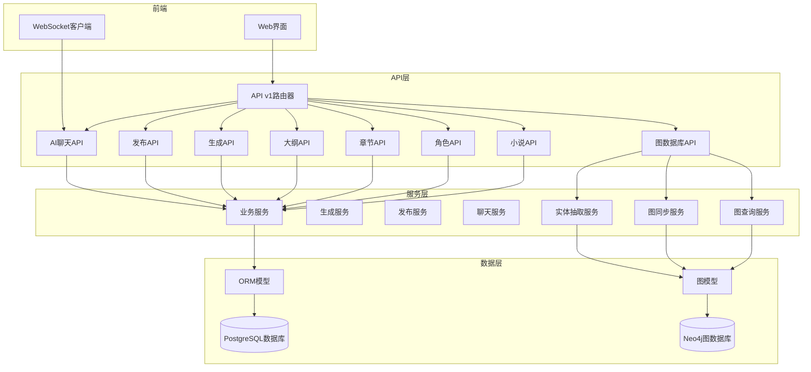
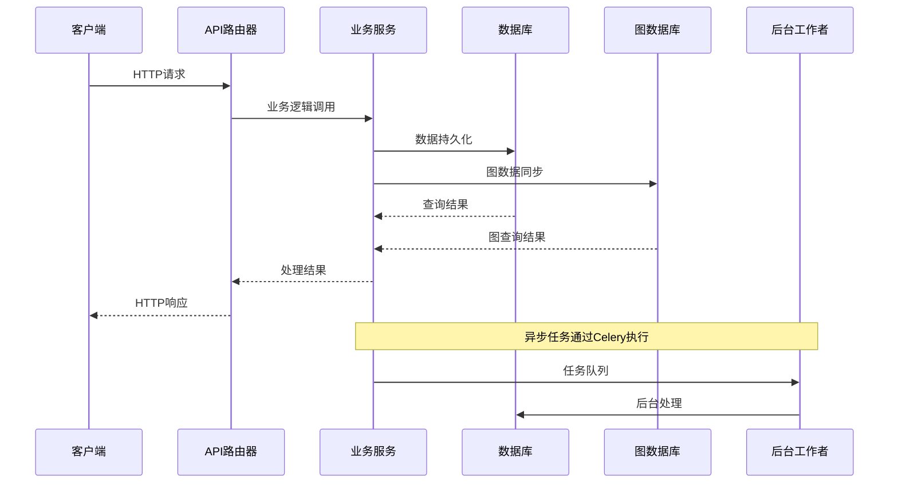
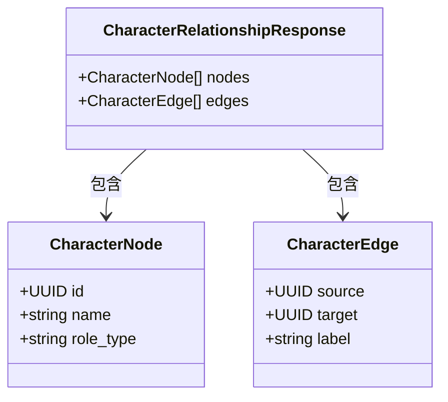
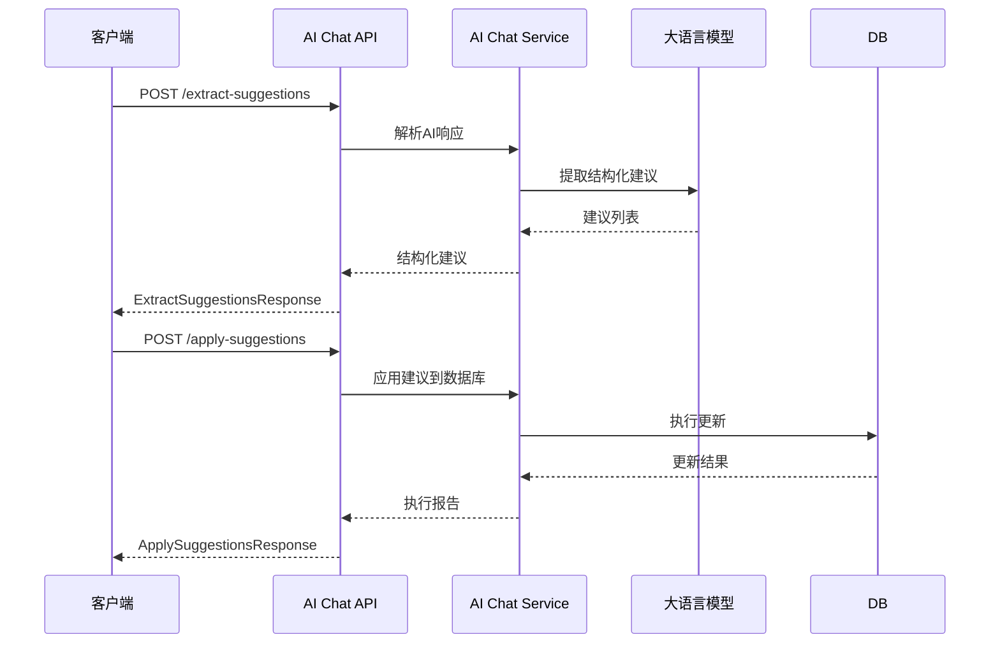
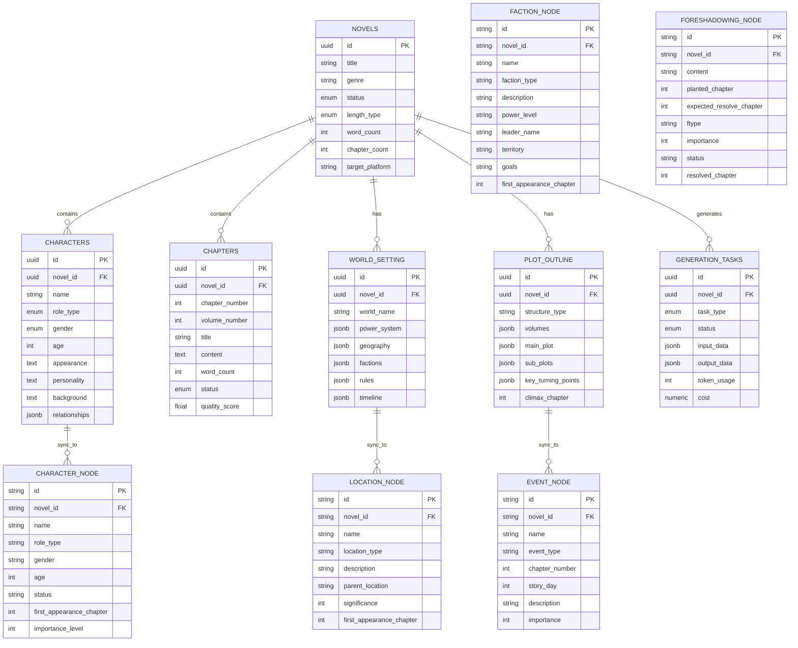
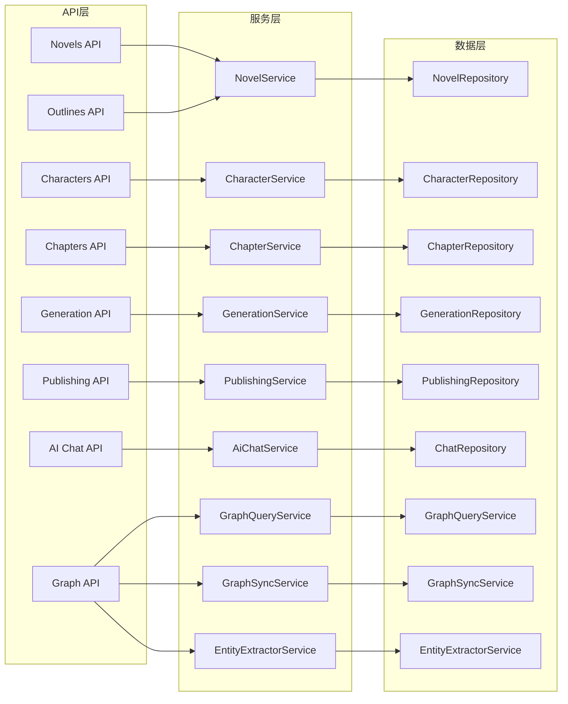

# API接口文档

<cite>
**本文档引用的文件**
- [backend/api/v1/__init__.py](file://backend/api/v1/__init__.py)
- [backend/api/v1/novels.py](file://backend/api/v1/novels.py)
- [backend/api/v1/characters.py](file://backend/api/v1/characters.py)
- [backend/api/v1/chapters.py](file://backend/api/v1/chapters.py)
- [backend/api/v1/generation.py](file://backend/api/v1/generation.py)
- [backend/api/v1/publishing.py](file://backend/api/v1/publishing.py)
- [backend/api/v1/ai_chat.py](file://backend/api/v1/ai_chat.py)
- [backend/api/v1/outlines.py](file://backend/api/v1/outlines.py)
- [backend/api/v1/graph.py](file://backend/api/v1/graph.py)
- [backend/schemas/novel.py](file://backend/schemas/novel.py)
- [backend/schemas/character.py](file://backend/schemas/character.py)
- [backend/schemas/outline.py](file://backend/schemas/outline.py)
- [backend/schemas/generation.py](file://backend/schemas/generation.py)
- [backend/schemas/publishing.py](file://backend/schemas/publishing.py)
- [backend/schemas/ai_chat.py](file://backend/schemas/ai_chat.py)
- [core/models/novel.py](file://core/models/novel.py)
- [core/models/character.py](file://core/models/character.py)
- [core/models/chapter.py](file://core/models/chapter.py)
- [core/models/generation_task.py](file://core/models/generation_task.py)
- [backend/services/graph_query_service.py](file://backend/services/graph_query_service.py)
- [backend/services/graph_sync_service.py](file://backend/services/graph_sync_service.py)
- [backend/services/entity_extractor_service.py](file://backend/services/entity_extractor_service.py)
- [core/graph/graph_models.py](file://core/graph/graph_models.py)
- [core/graph/neo4j_client.py](file://core/graph/neo4j_client.py)
- [backend/config.py](file://backend/config.py)
</cite>

## 更新摘要
**变更内容**
- 新增完整的图数据库API模块，包含健康检查、初始化、同步、查询、实体抽取等端点
- 添加图数据库服务层，包括查询服务、同步服务、实体抽取服务
- 新增图数据库核心模型和Neo4j客户端
- 更新配置系统以支持图数据库功能开关和连接配置
- 扩展Agents文档以包含图数据库相关内容

## 目录
1. [简介](#简介)
2. [项目结构](#项目结构)
3. [核心组件](#核心组件)
4. [架构概览](#架构概览)
5. [详细组件分析](#详细组件分析)
6. [依赖关系分析](#依赖关系分析)
7. [性能考虑](#性能考虑)
8. [故障排除指南](#故障排除指南)
9. [结论](#结论)
10. [附录](#附录)

## 简介
本项目是一个基于FastAPI构建的小说生成系统，提供从创意生成、角色塑造、章节管理到发布的完整工作流。系统采用异步数据库访问、后台任务处理和流式WebSocket通信，支持多种AI驱动的功能。**最新更新**：新增完整的图数据库支持，包括角色关系网络分析、实体抽取、一致性检测等高级功能。

## 项目结构
系统采用模块化设计，主要分为以下层次：



**图表来源**
- [backend/api/v1/__init__.py:22-33](file://backend/api/v1/__init__.py#L22-L33)
- [backend/api/v1/graph.py](file://backend/api/v1/graph.py#L29)
- [backend/services/graph_query_service.py:135-147](file://backend/services/graph_query_service.py#L135-L147)
- [backend/services/graph_sync_service.py:61-76](file://backend/services/graph_sync_service.py#L61-L76)

**章节来源**
- [backend/api/v1/__init__.py:1-41](file://backend/api/v1/__init__.py#L1-L41)

## 核心组件
系统包含以下核心API模块：

### API版本管理
- **版本前缀**: `/api/v1`
- **当前版本**: v1.0
- **版本策略**: 向后兼容，新增功能通过新端点实现

### 认证与授权
- **认证方式**: 基于数据库的用户会话管理
- **授权机制**: 基于角色的权限控制
- **安全措施**: SQL注入防护、参数验证、错误处理

### 图数据库支持
- **功能开关**: 通过配置项 `ENABLE_GRAPH_DATABASE` 控制
- **连接管理**: 支持连接池和健康检查
- **数据同步**: 自动同步小说数据到图数据库
- **查询能力**: 支持关系网络、路径分析、影响力计算等

**章节来源**
- [backend/api/v1/__init__.py:22-33](file://backend/api/v1/__init__.py#L22-L33)
- [backend/config.py:307-350](file://backend/config.py#L307-L350)

## 架构概览
系统采用分层架构，确保关注点分离和可扩展性：



**图表来源**
- [backend/api/v1/generation.py:73-101](file://backend/api/v1/generation.py#L73-L101)
- [backend/api/v1/publishing.py:223-229](file://backend/api/v1/publishing.py#L223-L229)
- [backend/api/v1/graph.py:138-151](file://backend/api/v1/graph.py#L138-L151)

## 详细组件分析

### 小说管理API (Novels)

#### CRUD操作端点

| 方法 | URL模式 | 描述 | 请求体 | 响应码 |
|------|---------|------|--------|--------|
| GET | `/api/v1/novels` | 获取小说列表 | 分页查询参数 | 200 |
| POST | `/api/v1/novels` | 创建新小说 | NovelCreate | 201 |
| GET | `/api/v1/novels/{novel_id}` | 获取小说详情 | - | 200, 404 |
| PATCH | `/api/v1/novels/{novel_id}` | 更新小说信息 | NovelUpdate | 200, 404 |
| DELETE | `/api/v1/novels/{novel_id}` | 删除小说 | - | 204, 404 |

#### 分页查询参数
- `page`: 页码，默认1，最小1
- `page_size`: 每页大小，默认10，范围1-100
- `status`: 状态筛选，可选值：planning, writing, completed, published

#### 关联数据加载
API自动加载以下关联数据：
- 世界观设定 (WorldSetting)
- 角色列表 (Character[])
- 章节列表 (Chapter[])

**章节来源**
- [backend/api/v1/novels.py:25-63](file://backend/api/v1/novels.py#L25-L63)
- [backend/api/v1/novels.py:81-104](file://backend/api/v1/novels.py#L81-L104)
- [backend/api/v1/novels.py:107-130](file://backend/api/v1/novels.py#L107-L130)
- [backend/api/v1/novels.py:133-149](file://backend/api/v1/novels.py#L133-L149)

### 角色管理API (Characters)

#### 角色CRUD端点

| 方法 | URL模式 | 描述 | 请求体 | 响应码 |
|------|---------|------|--------|--------|
| GET | `/api/v1/novels/{novel_id}/characters` | 获取角色列表 | - | 200, 404 |
| POST | `/api/v1/novels/{novel_id}/characters` | 创建角色 | CharacterCreate | 201, 404 |
| GET | `/api/v1/novels/{novel_id}/characters/relationships` | 获取角色关系图 | - | 200, 404 |
| GET | `/api/v1/novels/{novel_id}/characters/{character_id}` | 获取角色详情 | - | 200, 404 |
| PATCH | `/api/v1/novels/{novel_id}/characters/{character_id}` | 更新角色 | CharacterUpdate | 200, 404 |
| DELETE | `/api/v1/novels/{novel_id}/characters/{character_id}` | 删除角色 | - | 204, 404 |

#### 角色关系图数据结构



**图表来源**
- [backend/schemas/character.py:58-76](file://backend/schemas/character.py#L58-L76)

**章节来源**
- [backend/api/v1/characters.py:24-45](file://backend/api/v1/characters.py#L24-L45)
- [backend/api/v1/characters.py:48-70](file://backend/api/v1/characters.py#L48-L70)
- [backend/api/v1/characters.py:73-127](file://backend/api/v1/characters.py#L73-L127)
- [backend/api/v1/characters.py:130-149](file://backend/api/v1/characters.py#L130-L149)
- [backend/api/v1/characters.py:152-179](file://backend/api/v1/characters.py#L152-L179)
- [backend/api/v1/characters.py:182-202](file://backend/api/v1/characters.py#L182-L202)

### 章节管理API (Chapters)

#### 章节操作端点

| 方法 | URL模式 | 描述 | 请求体 | 响应码 |
|------|---------|------|--------|--------|
| GET | `/api/v1/novels/{novel_id}/chapters` | 获取章节列表 | 分页+状态筛选 | 200, 404 |
| GET | `/api/v1/novels/{novel_id}/chapters/{chapter_number}` | 获取章节详情 | - | 200, 404 |
| PATCH | `/api/v1/novels/{novel_id}/chapters/{chapter_number}` | 更新章节内容 | ChapterUpdate | 200, 404 |
| DELETE | `/api/v1/novels/{novel_id}/chapters/{chapter_number}` | 删除章节 | - | 204, 404 |
| POST | `/api/v1/novels/{novel_id}/chapters/batch-delete` | 批量删除章节 | BatchDeleteRequest | 204, 404 |

#### 章节状态管理
章节状态枚举：
- `draft`: 草稿
- `reviewing`: 审核中
- `published`: 已发布

#### 批量删除请求体
```json
{
  "chapter_numbers": [1, 2, 3, 4, 5]
}
```

**章节来源**
- [backend/api/v1/chapters.py:29-76](file://backend/api/v1/chapters.py#L29-L76)
- [backend/api/v1/chapters.py:79-101](file://backend/api/v1/chapters.py#L79-L101)
- [backend/api/v1/chapters.py:104-138](file://backend/api/v1/chapters.py#L104-L138)
- [backend/api/v1/chapters.py:141-167](file://backend/api/v1/chapters.py#L141-L167)
- [backend/api/v1/chapters.py:170-199](file://backend/api/v1/chapters.py#L170-L199)

### 生成任务API (Generation)

#### 任务管理端点

| 方法 | URL模式 | 描述 | 请求体 | 响应码 |
|------|---------|------|--------|--------|
| POST | `/api/v1/generation/tasks` | 创建生成任务 | GenerationTaskCreate | 201 |
| GET | `/api/v1/generation/tasks` | 获取任务列表 | 分页+筛选 | 200 |
| GET | `/api/v1/generation/tasks/{task_id}` | 获取任务状态 | - | 200, 404 |
| POST | `/api/v1/generation/tasks/{task_id}/cancel` | 取消任务 | - | 200, 404 |

#### 任务类型与参数


**图表来源**
- [backend/api/v1/generation.py:23-103](file://backend/api/v1/generation.py#L23-L103)

#### 任务状态流转
- `pending`: 待执行
- `running`: 执行中
- `completed`: 已完成
- `failed`: 执行失败
- `cancelled`: 已取消

**章节来源**
- [backend/api/v1/generation.py:23-103](file://backend/api/v1/generation.py#L23-L103)
- [backend/api/v1/generation.py:106-134](file://backend/api/v1/generation.py#L106-L134)
- [backend/api/v1/generation.py:137-149](file://backend/api/v1/generation.py#L137-L149)
- [backend/api/v1/generation.py:152-170](file://backend/api/v1/generation.py#L152-L170)

### 发布管理API (Publishing)

#### 平台账号管理

| 方法 | URL模式 | 描述 | 请求体 | 响应码 |
|------|---------|------|--------|--------|
| POST | `/api/v1/publishing/accounts` | 创建平台账号 | PlatformAccountCreate | 201 |
| GET | `/api/v1/publishing/accounts` | 获取账号列表 | 分页+筛选 | 200 |
| GET | `/api/v1/publishing/accounts/{account_id}` | 获取账号详情 | - | 200, 404 |
| PATCH | `/api/v1/publishing/accounts/{account_id}` | 更新账号 | PlatformAccountUpdate | 200, 404 |
| DELETE | `/api/v1/publishing/accounts/{account_id}` | 删除账号 | - | 200, 404 |
| POST | `/api/v1/publishing/accounts/{account_id}/verify` | 验证账号 | - | 200, 404 |

#### 发布任务管理

| 方法 | URL模式 | 描述 | 请求体 | 响应码 |
|------|---------|------|--------|--------|
| POST | `/api/v1/publishing/tasks` | 创建发布任务 | PublishTaskCreate | 201 |
| GET | `/api/v1/publishing/tasks` | 获取任务列表 | 分页+筛选 | 200 |
| GET | `/api/v1/publishing/tasks/{task_id}` | 获取任务详情 | - | 200, 404 |
| POST | `/api/v1/publishing/tasks/{task_id}/cancel` | 取消任务 | - | 200, 404 |
| GET | `/api/v1/publishing/tasks/{task_id}/chapters` | 获取章节发布记录 | 分页+筛选 | 200, 404 |

#### 发布预览
- POST `/api/v1/publishing/preview`: 获取发布预览信息
- 支持指定章节范围进行预览

**章节来源**
- [backend/api/v1/publishing.py:38-52](file://backend/api/v1/publishing.py#L38-L52)
- [backend/api/v1/publishing.py:55-83](file://backend/api/v1/publishing.py#L55-L83)
- [backend/api/v1/publishing.py:157-231](file://backend/api/v1/publishing.py#L157-L231)
- [backend/api/v1/publishing.py:234-266](file://backend/api/v1/publishing.py#L234-L266)
- [backend/api/v1/publishing.py:346-368](file://backend/api/v1/publishing.py#L346-L368)

### AI聊天API (AI Chat)

#### 会话管理端点

| 方法 | URL模式 | 描述 | 请求体 | 响应码 |
|------|---------|------|--------|--------|
| POST | `/api/v1/ai-chat/sessions` | 创建会话 | AIChatSessionCreate | 201 |
| POST | `/api/v1/ai-chat/sessions/{session_id}/messages` | 发送消息 | AIChatMessageCreate | 200, 404 |
| GET | `/api/v1/ai-chat/sessions` | 获取会话列表 | - | 200 |
| GET | `/api/v1/ai-chat/sessions/{session_id}` | 获取会话详情 | - | 200, 404 |
| DELETE | `/api/v1/ai-chat/sessions/{session_id}` | 删除会话 | - | 200, 404 |

#### WebSocket流式对话
- WebSocket路径: `/api/v1/ai-chat/ws/{session_id}`
- 支持实时流式响应
- 自动断线重连机制

#### 场景类型
- `novel_creation`: 小说创作场景
- `crawler_task`: 爬虫任务场景  
- `novel_revision`: 小说修订场景
- `novel_analysis`: 小说分析场景

#### 结构化建议处理



**图表来源**
- [backend/api/v1/ai_chat.py:247-288](file://backend/api/v1/ai_chat.py#L247-L288)
- [backend/api/v1/ai_chat.py:317-341](file://backend/api/v1/ai_chat.py#L317-L341)

**章节来源**
- [backend/api/v1/ai_chat.py:54-76](file://backend/api/v1/ai_chat.py#L54-L76)
- [backend/api/v1/ai_chat.py:79-104](file://backend/api/v1/ai_chat.py#L79-L104)
- [backend/api/v1/ai_chat.py:106-151](file://backend/api/v1/ai_chat.py#L106-L151)
- [backend/api/v1/ai_chat.py:247-341](file://backend/api/v1/ai_chat.py#L247-L341)

### 世界观与大纲API (Outlines)

#### 世界观设定端点

| 方法 | URL模式 | 描述 | 请求体 | 响应码 |
|------|---------|------|--------|--------|
| GET | `/api/v1/novels/{novel_id}/world-setting` | 获取世界观设定 | - | 200, 404 |
| PATCH | `/api/v1/novels/{novel_id}/world-setting` | 更新世界观设定 | WorldSettingUpdate | 200, 404 |

#### 情节大纲端点

| 方法 | URL模式 | 描述 | 请求体 | 响应码 |
|------|---------|------|--------|--------|
| GET | `/api/v1/novels/{novel_id}/outline` | 获取情节大纲 | - | 200, 404 |
| PATCH | `/api/v1/novels/{novel_id}/outline` | 更新情节大纲 | PlotOutlineUpdate | 200, 404 |

**章节来源**
- [backend/api/v1/outlines.py:25-52](file://backend/api/v1/outlines.py#L25-L52)
- [backend/api/v1/outlines.py:55-91](file://backend/api/v1/outlines.py#L55-L91)
- [backend/api/v1/outlines.py:94-121](file://backend/api/v1/outlines.py#L94-L121)
- [backend/api/v1/outlines.py:124-160](file://backend/api/v1/outlines.py#L124-L160)

### 图数据库API (Graph)

#### 健康检查与连接管理

| 方法 | URL模式 | 描述 | 请求体 | 响应码 |
|------|---------|------|--------|--------|
| GET | `/api/v1/novels/{novel_id}/graph/health` | 检查图数据库健康状态 | - | 200 |
| POST | `/api/v1/novels/{novel_id}/graph/init` | 初始化图数据库连接 | - | 200, 400 |

#### 数据同步管理

| 方法 | URL模式 | 描述 | 请求体 | 响应码 |
|------|---------|------|--------|--------|
| POST | `/api/v1/novels/{novel_id}/graph/sync` | 同步小说数据到图数据库 | - | 200, 400, 404 |
| GET | `/api/v1/novels/{novel_id}/graph/sync/status` | 获取同步状态 | - | 200 |
| DELETE | `/api/v1/novels/{novel_id}/graph/sync` | 清除小说的图数据库数据 | - | 200, 400, 500 |

#### 图查询功能

| 方法 | URL模式 | 描述 | 请求体 | 响应码 |
|------|---------|------|--------|--------|
| GET | `/api/v1/novels/{novel_id}/graph/network/{character_name}` | 获取角色关系网络 | depth查询参数 | 200, 400, 404 |
| GET | `/api/v1/novels/{novel_id}/graph/path` | 查找角色间最短路径 | from_character, to_character查询参数 | 200, 400, 404 |
| GET | `/api/v1/novels/{novel_id}/graph/relationships` | 获取所有角色关系 | relationship_type查询参数 | 200, 400, 500 |
| GET | `/api/v1/novels/{novel_id}/graph/conflicts` | 检测一致性冲突 | - | 200, 400, 500 |
| GET | `/api/v1/novels/{novel_id}/graph/influence/{character_name}` | 获取角色影响力分析 | - | 200, 400, 404 |
| GET | `/api/v1/novels/{novel_id}/graph/timeline` | 获取事件时间线 | character_name查询参数 | 200, 400, 500 |
| GET | `/api/v1/novels/{novel_id}/graph/foreshadowings/pending` | 获取待回收的伏笔 | current_chapter查询参数 | 200, 400, 500 |

#### 实体抽取功能

| 方法 | URL模式 | 描述 | 请求体 | 响应码 |
|------|---------|------|--------|--------|
| POST | `/api/v1/novels/{novel_id}/graph/extract` | 从章节内容抽取实体 | chapter_number, chapter_content | 200, 400, 500 |
| POST | `/api/v1/novels/{novel_id}/graph/extract/batch` | 批量抽取多章节实体 | chapters数组 | 200, 400, 500 |

#### 图数据库配置参数
- `depth`: 查询深度，范围1-5，默认2
- `full_sync`: 是否全量同步，默认True
- `relationship_type`: 关系类型过滤参数
- `character_name`: 角色名称查询参数
- `current_chapter`: 当前章节号参数

#### 图查询响应格式
```json
{
  "success": true,
  "character_id": "角色ID",
  "character_name": "角色名称",
  "depth": 2,
  "nodes": [...],
  "edges": [...],
  "total_relations": 10,
  "prompt_format": "格式化的提示词"
}
```

**章节来源**
- [backend/api/v1/graph.py:35-100](file://backend/api/v1/graph.py#L35-L100)
- [backend/api/v1/graph.py:105-151](file://backend/api/v1/graph.py#L105-L151)
- [backend/api/v1/graph.py:154-205](file://backend/api/v1/graph.py#L154-L205)
- [backend/api/v1/graph.py:246-282](file://backend/api/v1/graph.py#L246-L282)
- [backend/api/v1/graph.py:285-331](file://backend/api/v1/graph.py#L285-L331)
- [backend/api/v1/graph.py:334-364](file://backend/api/v1/graph.py#L334-L364)
- [backend/api/v1/graph.py:367-401](file://backend/api/v1/graph.py#L367-L401)
- [backend/api/v1/graph.py:404-436](file://backend/api/v1/graph.py#L404-L436)
- [backend/api/v1/graph.py:439-469](file://backend/api/v1/graph.py#L439-L469)
- [backend/api/v1/graph.py:472-503](file://backend/api/v1/graph.py#L472-L503)
- [backend/api/v1/graph.py:509-544](file://backend/api/v1/graph.py#L509-L544)
- [backend/api/v1/graph.py:547-580](file://backend/api/v1/graph.py#L547-L580)

## 依赖关系分析

### 数据模型关系



**图表来源**
- [core/models/novel.py:37-66](file://core/models/novel.py#L37-L66)
- [core/models/character.py:31-54](file://core/models/character.py#L31-L54)
- [core/models/chapter.py:18-45](file://core/models/chapter.py#L18-L45)
- [core/models/generation_task.py:27-47](file://core/models/generation_task.py#L27-L47)
- [core/graph/graph_models.py:101-162](file://core/graph/graph_models.py#L101-L162)
- [core/graph/graph_models.py:166-215](file://core/graph/graph_models.py#L166-L215)
- [core/graph/graph_models.py:219-274](file://core/graph/graph_models.py#L219-L274)
- [core/graph/graph_models.py:278-333](file://core/graph/graph_models.py#L278-L333)
- [core/graph/graph_models.py:337-395](file://core/graph/graph_models.py#L337-L395)

### API依赖关系



**图表来源**
- [backend/api/v1/novels.py:13-19](file://backend/api/v1/novels.py#L13-L19)
- [backend/api/v1/characters.py:11-19](file://backend/api/v1/characters.py#L11-L19)
- [backend/api/v1/chapters.py:12-20](file://backend/api/v1/chapters.py#L12-L20)
- [backend/api/v1/graph.py:19-25](file://backend/api/v1/graph.py#L19-L25)

**章节来源**
- [backend/api/v1/novels.py:13-19](file://backend/api/v1/novels.py#L13-L19)
- [backend/api/v1/characters.py:11-19](file://backend/api/v1/characters.py#L11-L19)
- [backend/api/v1/chapters.py:12-20](file://backend/api/v1/chapters.py#L12-L20)
- [backend/api/v1/graph.py:19-25](file://backend/api/v1/graph.py#L19-L25)

## 性能考虑

### 数据库优化
- **索引策略**: 在常用查询字段上建立适当索引
- **连接池**: 使用异步连接池提高并发性能
- **查询优化**: 使用selectinload避免N+1查询问题
- **分页机制**: 实现高效的分页查询

### 缓存策略
- **会话缓存**: 内存中缓存活跃的AI聊天会话
- **查询结果缓存**: 缓存不频繁变化的数据
- **静态资源缓存**: CDN加速静态文件
- **图查询缓存**: 缓存图数据库查询结果

### 异步处理
- **后台任务**: 使用Celery处理耗时任务
- **WebSocket**: 实现实时流式通信
- **异步数据库**: SQLAlchemy异步引擎
- **图数据库异步**: Neo4j客户端支持异步查询

### 监控与日志
- **性能指标**: 收集API响应时间和错误率
- **数据库监控**: 监控查询性能和连接使用
- **日志聚合**: 集中化日志管理和分析
- **图数据库监控**: 监控Neo4j连接和查询性能

## 故障排除指南

### 常见错误处理

#### HTTP状态码说明
- **200**: 成功获取数据
- **201**: 资源创建成功
- **204**: 成功删除无返回内容
- **400**: 请求参数错误或功能未启用
- **404**: 资源不存在
- **500**: 服务器内部错误
- **503**: 服务不可用（如图数据库未连接）

#### 错误响应格式
```json
{
  "detail": "错误描述信息",
  "code": "错误代码"
}
```

#### 调试建议
1. **检查请求参数**: 确保UUID格式正确
2. **验证权限**: 确认用户有相应操作权限
3. **查看日志**: 检查服务器错误日志
4. **数据库连接**: 验证数据库连接状态
5. **图数据库状态**: 检查Neo4j连接和功能开关

**章节来源**
- [backend/api/v1/novels.py:101-102](file://backend/api/v1/novels.py#L101-L102)
- [backend/api/v1/characters.py:146-147](file://backend/api/v1/characters.py#L146-L147)
- [backend/api/v1/chapters.py:157-161](file://backend/api/v1/chapters.py#L157-L161)
- [backend/api/v1/graph.py:42-70](file://backend/api/v1/graph.py#L42-L70)

## 结论
本小说生成系统提供了完整的小说创作和发布解决方案，具有以下特点：

### 技术优势
- **模块化设计**: 清晰的分层架构便于维护和扩展
- **异步处理**: 高效的异步数据库和WebSocket支持
- **AI集成**: 完整的AI聊天和内容生成功能
- **发布自动化**: 支持多平台的自动化发布流程
- **图数据库支持**: 新增强大的关系网络分析能力

### 功能特性
- **全生命周期管理**: 从创意到发布的完整流程
- **智能辅助**: AI驱动的内容创作和修订
- **多平台支持**: 支持主流小说发布平台
- **实时协作**: WebSocket实现实时对话和反馈
- **关系分析**: 基于图数据库的角色关系网络分析
- **一致性检测**: 自动检测和报告故事逻辑冲突

### 扩展性
系统设计充分考虑了未来的功能扩展，包括：
- 新的AI模型集成
- 更多的发布平台支持
- 高级分析和推荐功能
- 移动端应用支持
- 更丰富的图数据分析功能

## 附录

### API版本管理
- **版本前缀**: `/api/v1`
- **向后兼容**: 保持现有API不变
- **新功能**: 通过新增端点实现
- **弃用策略**: 提供迁移指南和过渡期

### 最佳实践
1. **错误处理**: 统一的错误响应格式
2. **参数验证**: 严格的输入验证
3. **安全措施**: CSRF保护和输入过滤
4. **性能优化**: 缓存策略和数据库优化
5. **图数据库配置**: 合理设置功能开关和连接参数

### 开发指南
- **环境配置**: `.env`文件配置
- **数据库迁移**: Alembic版本管理
- **测试策略**: 单元测试和集成测试
- **部署方案**: Docker容器化部署
- **图数据库部署**: Neo4j独立部署和连接配置

### 图数据库配置
- **功能开关**: `ENABLE_GRAPH_DATABASE=True` 启用图数据库功能
- **连接配置**: 设置Neo4j连接参数和凭据
- **实体抽取**: `ENABLE_ENTITY_EXTRACTION` 控制实体抽取功能
- **同步策略**: 配置自动同步和手动同步选项
- **查询缓存**: 设置图查询结果缓存参数