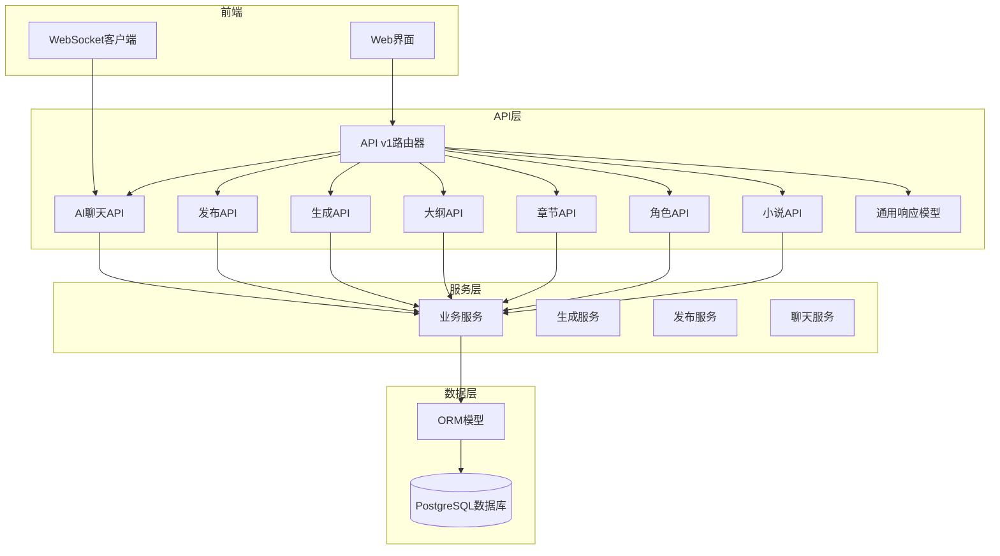
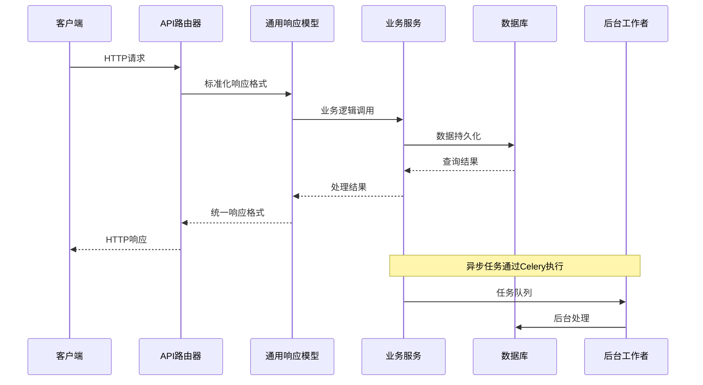
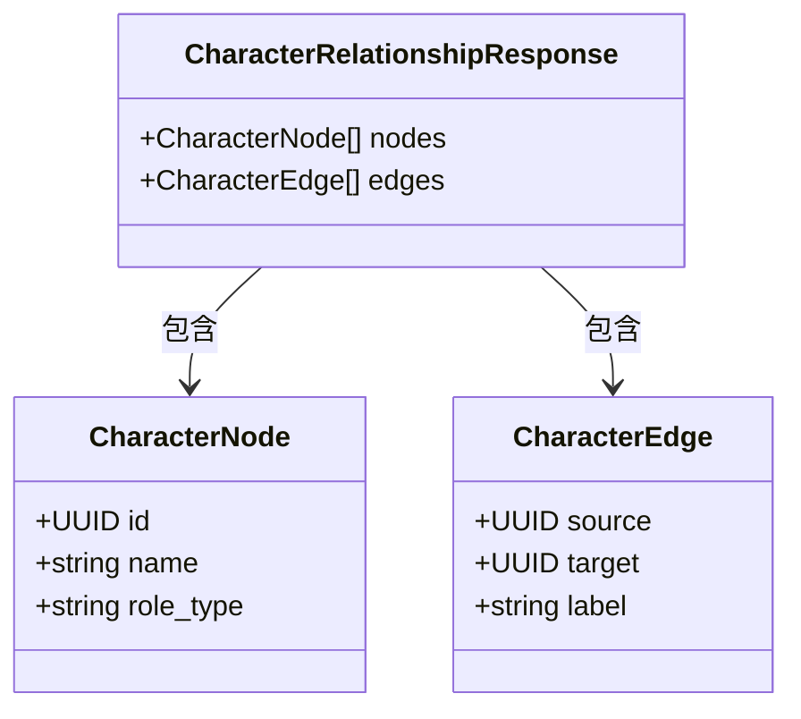
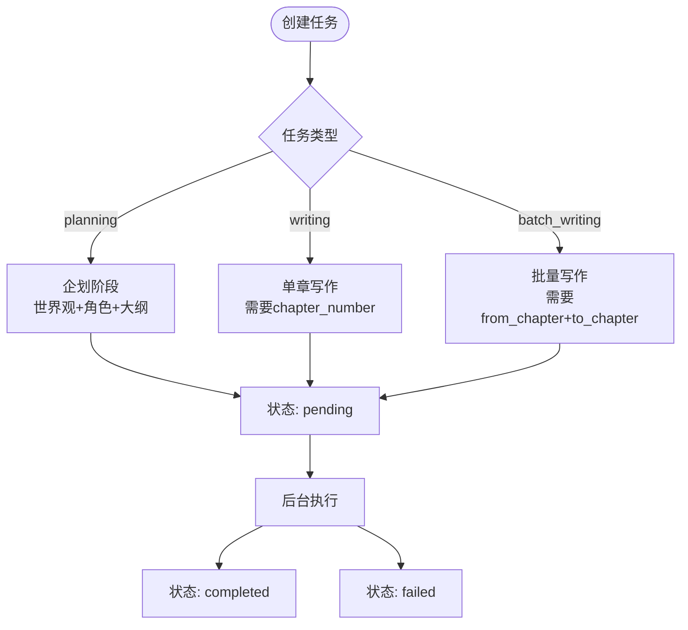
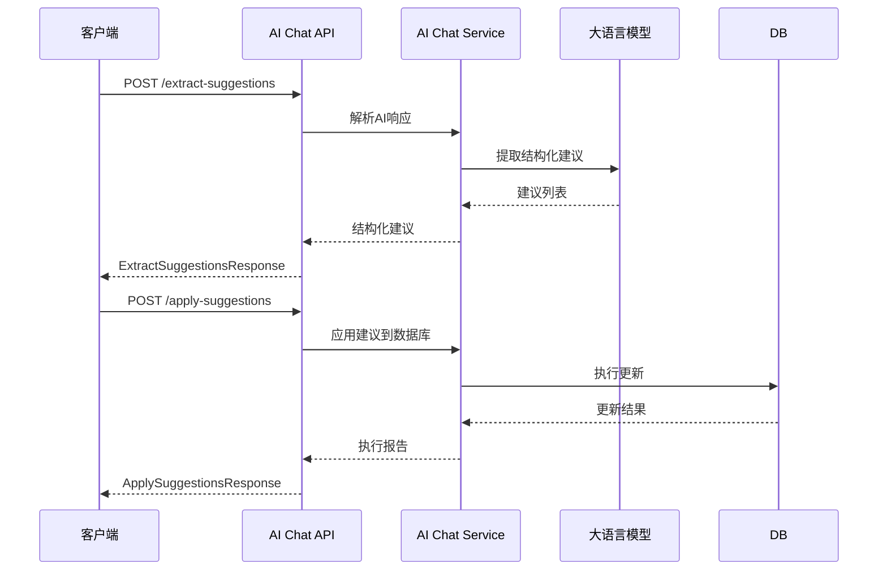
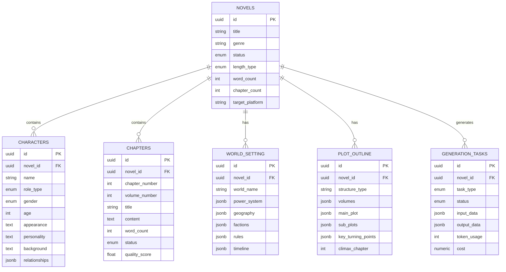
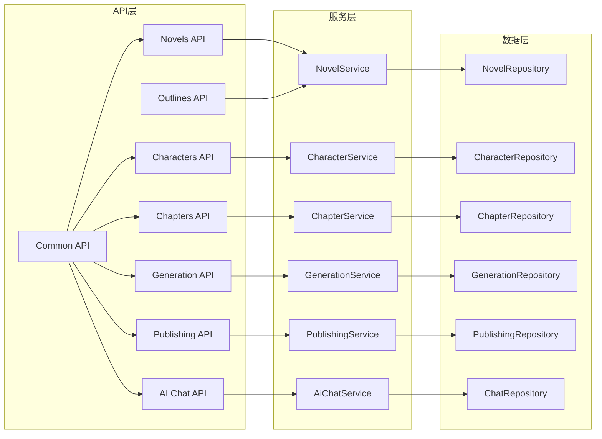

# API接口文档

<cite>
**本文档引用的文件**
- [backend/api/v1/__init__.py](file://backend/api/v1/__init__.py)
- [backend/api/v1/novels.py](file://backend/api/v1/novels.py)
- [backend/api/v1/characters.py](file://backend/api/v1/characters.py)
- [backend/api/v1/chapters.py](file://backend/api/v1/chapters.py)
- [backend/api/v1/generation.py](file://backend/api/v1/generation.py)
- [backend/api/v1/publishing.py](file://backend/api/v1/publishing.py)
- [backend/api/v1/ai_chat.py](file://backend/api/v1/ai_chat.py)
- [backend/api/v1/outlines.py](file://backend/api/v1/outlines.py)
- [backend/schemas/common.py](file://backend/schemas/common.py)
- [backend/schemas/novel.py](file://backend/schemas/novel.py)
- [backend/schemas/character.py](file://backend/schemas/character.py)
- [backend/schemas/outline.py](file://backend/schemas/outline.py)
- [backend/schemas/generation.py](file://backend/schemas/generation.py)
- [backend/schemas/publishing.py](file://backend/schemas/publishing.py)
- [backend/schemas/ai_chat.py](file://backend/schemas/ai_chat.py)
- [core/models/novel.py](file://core/models/novel.py)
- [core/models/character.py](file://core/models/character.py)
- [core/models/chapter.py](file://core/models/chapter.py)
- [core/models/generation_task.py](file://core/models/generation_task.py)
</cite>

## 更新摘要
**所做更改**
- 新增通用响应模型模块，统一API响应格式
- 更新发布管理API的删除和验证响应格式
- 更新生成任务API的任务取消响应格式
- 更新AI聊天API的消息响应格式
- 标准化所有API模块的错误处理和响应格式

## 目录
1. [简介](#简介)
2. [项目结构](#项目结构)
3. [核心组件](#核心组件)
4. [架构概览](#架构概览)
5. [详细组件分析](#详细组件分析)
6. [依赖关系分析](#依赖关系分析)
7. [性能考虑](#性能考虑)
8. [故障排除指南](#故障排除指南)
9. [结论](#结论)
10. [附录](#附录)

## 简介
本项目是一个基于FastAPI构建的小说生成系统，提供从创意生成、角色塑造、章节管理到发布的完整工作流。系统采用异步数据库访问、后台任务处理和流式WebSocket通信，支持多种AI驱动的功能。

**更新** 新增通用响应模型模块，实现API响应格式的标准化和统一化。

## 项目结构
系统采用模块化设计，主要分为以下层次：



**图表来源**
- [backend/api/v1/__init__.py](file://backend/api/v1/__init__.py#L21-L39)
- [backend/schemas/common.py](file://backend/schemas/common.py#L1-L28)

**章节来源**
- [backend/api/v1/__init__.py](file://backend/api/v1/__init__.py#L1-L39)

## 核心组件
系统包含以下核心API模块：

### API版本管理
- **版本前缀**: `/api/v1`
- **当前版本**: v1.0
- **版本策略**: 向后兼容，新增功能通过新端点实现

### 通用响应模型
**新增** 系统现在提供统一的响应模型，确保所有API响应格式的一致性：

#### 通用消息响应
- `MessageResponse`: 标准化的操作结果消息
- 字段: `message` (字符串，操作结果消息)

#### 任务相关响应
- `TaskCancelResponse`: 任务取消响应
- 字段: `message` (字符串，取消结果消息), `task_id` (字符串，被取消的任务ID)

#### 账号相关响应
- `VerifyAccountResponse`: 账号验证响应
- 字段: `success` (布尔值，验证是否成功), `message` (字符串，验证结果消息)
- `DeleteResponse`: 删除操作响应
- 字段: `message` (字符串，删除结果消息), `account_id` (可选字符串，被删除的账号ID)

### 认证与授权
- **认证方式**: 基于数据库的用户会话管理
- **授权机制**: 基于角色的权限控制
- **安全措施**: SQL注入防护、参数验证、错误处理

**章节来源**
- [backend/schemas/common.py](file://backend/schemas/common.py#L7-L27)

## 架构概览
系统采用分层架构，确保关注点分离和可扩展性：



**图表来源**
- [backend/schemas/common.py](file://backend/schemas/common.py#L7-L27)
- [backend/api/v1/generation.py](file://backend/api/v1/generation.py#L159-L183)
- [backend/api/v1/publishing.py](file://backend/api/v1/publishing.py#L129-L148)

## 详细组件分析

### 小说管理API (Novels)

#### CRUD操作端点

| 方法 | URL模式 | 描述 | 请求体 | 响应码 |
|------|---------|------|--------|--------|
| GET | `/api/v1/novels` | 获取小说列表 | 分页查询参数 | 200 |
| POST | `/api/v1/novels` | 创建新小说 | NovelCreate | 201 |
| GET | `/api/v1/novels/{novel_id}` | 获取小说详情 | - | 200, 404 |
| PATCH | `/api/v1/novels/{novel_id}` | 更新小说信息 | NovelUpdate | 200, 404 |
| DELETE | `/api/v1/novels/{novel_id}` | 删除小说 | - | 204, 404 |

#### 分页查询参数
- `page`: 页码，默认1，最小1
- `page_size`: 每页大小，默认10，范围1-100
- `status`: 状态筛选，可选值：planning, writing, completed, published

#### 关联数据加载
API自动加载以下关联数据：
- 世界观设定 (WorldSetting)
- 角色列表 (Character[])
- 章节列表 (Chapter[])

**章节来源**
- [backend/api/v1/novels.py](file://backend/api/v1/novels.py#L25-L67)
- [backend/api/v1/novels.py](file://backend/api/v1/novels.py#L88-L141)
- [backend/api/v1/novels.py](file://backend/api/v1/novels.py#L144-L168)

### 角色管理API (Characters)

#### 角色CRUD端点

| 方法 | URL模式 | 描述 | 请求体 | 响应码 |
|------|---------|------|--------|--------|
| GET | `/api/v1/novels/{novel_id}/characters` | 获取角色列表 | - | 200, 404 |
| POST | `/api/v1/novels/{novel_id}/characters` | 创建角色 | CharacterCreate | 201, 404 |
| GET | `/api/v1/novels/{novel_id}/characters/relationships` | 获取角色关系图 | - | 200, 404 |
| GET | `/api/v1/novels/{novel_id}/characters/{character_id}` | 获取角色详情 | - | 200, 404 |
| PATCH | `/api/v1/novels/{novel_id}/characters/{character_id}` | 更新角色 | CharacterUpdate | 200, 404 |
| DELETE | `/api/v1/novels/{novel_id}/characters/{character_id}` | 删除角色 | - | 204, 404 |

#### 角色关系图数据结构



**图表来源**
- [backend/schemas/character.py](file://backend/schemas/character.py#L58-L76)

**章节来源**
- [backend/api/v1/characters.py](file://backend/api/v1/characters.py#L24-L47)
- [backend/api/v1/characters.py](file://backend/api/v1/characters.py#L50-L74)
- [backend/api/v1/characters.py](file://backend/api/v1/characters.py#L77-L133)
- [backend/api/v1/characters.py](file://backend/api/v1/characters.py#L136-L157)
- [backend/api/v1/characters.py](file://backend/api/v1/characters.py#L160-L189)
- [backend/api/v1/characters.py](file://backend/api/v1/characters.py#L192-L215)

### 章节管理API (Chapters)

#### 章节操作端点

| 方法 | URL模式 | 描述 | 请求体 | 响应码 |
|------|---------|------|--------|--------|
| GET | `/api/v1/novels/{novel_id}/chapters` | 获取章节列表 | 分页+状态筛选 | 200, 404 |
| GET | `/api/v1/novels/{novel_id}/chapters/{chapter_number}` | 获取章节详情 | - | 200, 404 |
| PATCH | `/api/v1/novels/{novel_id}/chapters/{chapter_number}` | 更新章节内容 | ChapterUpdate | 200, 404 |
| DELETE | `/api/v1/novels/{novel_id}/chapters/{chapter_number}` | 删除章节 | - | 204, 404 |
| POST | `/api/v1/novels/{novel_id}/chapters/batch-delete` | 批量删除章节 | BatchDeleteRequest | 204, 404 |

#### 章节状态管理
章节状态枚举：
- `draft`: 草稿
- `reviewing`: 审核中
- `published`: 已发布

#### 批量删除请求体
```json
{
  "chapter_numbers": [1, 2, 3, 4, 5]
}
```

**章节来源**
- [backend/api/v1/chapters.py](file://backend/api/v1/chapters.py#L30-L80)
- [backend/api/v1/chapters.py](file://backend/api/v1/chapters.py#L83-L107)
- [backend/api/v1/chapters.py](file://backend/api/v1/chapters.py#L110-L146)
- [backend/api/v1/chapters.py](file://backend/api/v1/chapters.py#L149-L177)
- [backend/api/v1/chapters.py](file://backend/api/v1/chapters.py#L180-L212)

### 生成任务API (Generation)

#### 任务管理端点

| 方法 | URL模式 | 描述 | 请求体 | 响应码 |
|------|---------|------|--------|--------|
| POST | `/api/v1/generation/tasks` | 创建生成任务 | GenerationTaskCreate | 201 |
| GET | `/api/v1/generation/tasks` | 获取任务列表 | 分页+筛选 | 200 |
| GET | `/api/v1/generation/tasks/{task_id}` | 获取任务状态 | - | 200, 404 |
| POST | `/api/v1/generation/tasks/{task_id}/cancel` | 取消任务 | - | 200, 404 |

#### 任务类型与参数



**图表来源**
- [backend/api/v1/generation.py](file://backend/api/v1/generation.py#L30-L110)

#### 任务状态流转
- `pending`: 待执行
- `running`: 执行中
- `completed`: 已完成
- `failed`: 执行失败
- `cancelled`: 已取消

**更新** 任务取消响应现在使用统一的 `TaskCancelResponse` 格式，包含标准的消息和任务ID字段。

**章节来源**
- [backend/api/v1/generation.py](file://backend/api/v1/generation.py#L30-L110)
- [backend/api/v1/generation.py](file://backend/api/v1/generation.py#L113-L141)
- [backend/api/v1/generation.py](file://backend/api/v1/generation.py#L144-L156)
- [backend/api/v1/generation.py](file://backend/api/v1/generation.py#L159-L183)

### 发布管理API (Publishing)

#### 平台账号管理

| 方法 | URL模式 | 描述 | 请求体 | 响应码 |
|------|---------|------|--------|--------|
| POST | `/api/v1/publishing/accounts` | 创建平台账号 | PlatformAccountCreate | 201 |
| GET | `/api/v1/publishing/accounts` | 获取账号列表 | 分页+筛选 | 200 |
| GET | `/api/v1/publishing/accounts/{account_id}` | 获取账号详情 | - | 200, 404 |
| PATCH | `/api/v1/publishing/accounts/{account_id}` | 更新账号 | PlatformAccountUpdate | 200, 404 |
| DELETE | `/api/v1/publishing/accounts/{account_id}` | 删除账号 | DeleteResponse | 200, 404 |
| POST | `/api/v1/publishing/accounts/{account_id}/verify` | 验证账号 | - | 200, 404 |

#### 发布任务管理

| 方法 | URL模式 | 描述 | 请求体 | 响应码 |
|------|---------|------|--------|--------|
| POST | `/api/v1/publishing/tasks` | 创建发布任务 | PublishTaskCreate | 201 |
| GET | `/api/v1/publishing/tasks` | 获取任务列表 | 分页+筛选 | 200 |
| GET | `/api/v1/publishing/tasks/{task_id}` | 获取任务详情 | - | 200, 404 |
| POST | `/api/v1/publishing/tasks/{task_id}/cancel` | 取消任务 | TaskCancelResponse | 200, 404 |
| GET | `/api/v1/publishing/tasks/{task_id}/chapters` | 获取章节发布记录 | 分页+筛选 | 200, 404 |

#### 发布预览
- POST `/api/v1/publishing/preview`: 获取发布预览信息
- 支持指定章节范围进行预览

**更新** 发布API现在使用统一的响应模型：
- 删除操作返回 `DeleteResponse` 格式
- 验证操作返回 `VerifyAccountResponse` 格式
- 取消任务返回 `TaskCancelResponse` 格式

**章节来源**
- [backend/api/v1/publishing.py](file://backend/api/v1/publishing.py#L38-L56)
- [backend/api/v1/publishing.py](file://backend/api/v1/publishing.py#L59-L91)
- [backend/api/v1/publishing.py](file://backend/api/v1/publishing.py#L94-L106)
- [backend/api/v1/publishing.py](file://backend/api/v1/publishing.py#L109-L126)
- [backend/api/v1/publishing.py](file://backend/api/v1/publishing.py#L129-L148)
- [backend/api/v1/publishing.py](file://backend/api/v1/publishing.py#L151-L166)
- [backend/api/v1/publishing.py](file://backend/api/v1/publishing.py#L173-L249)
- [backend/api/v1/publishing.py](file://backend/api/v1/publishing.py#L252-L284)
- [backend/api/v1/publishing.py](file://backend/api/v1/publishing.py#L287-L299)
- [backend/api/v1/publishing.py](file://backend/api/v1/publishing.py#L302-L327)
- [backend/api/v1/publishing.py](file://backend/api/v1/publishing.py#L330-L364)
- [backend/api/v1/publishing.py](file://backend/api/v1/publishing.py#L371-L397)

### AI聊天API (AI Chat)

#### 会话管理端点

| 方法 | URL模式 | 描述 | 请求体 | 响应码 |
|------|---------|------|--------|--------|
| POST | `/api/v1/ai-chat/sessions` | 创建会话 | AIChatSessionCreate | 201 |
| POST | `/api/v1/ai-chat/sessions/{session_id}/messages` | 发送消息 | AIChatMessageCreate | 200, 404 |
| GET | `/api/v1/ai-chat/sessions` | 获取会话列表 | - | 200 |
| GET | `/api/v1/ai-chat/sessions/{session_id}` | 获取会话详情 | - | 200, 404 |
| DELETE | `/api/v1/ai-chat/sessions/{session_id}` | 删除会话 | MessageResponse | 200, 404 |

#### WebSocket流式对话
- WebSocket路径: `/api/v1/ai-chat/ws/{session_id}`
- 支持实时流式响应
- 自动断线重连机制

#### 场景类型
- `novel_creation`: 小说创作场景
- `crawler_task`: 爬虫任务场景  
- `novel_revision`: 小说修订场景
- `novel_analysis`: 小说分析场景

#### 结构化建议处理



**图表来源**
- [backend/api/v1/ai_chat.py](file://backend/api/v1/ai_chat.py#L302-L363)
- [backend/api/v1/ai_chat.py](file://backend/api/v1/ai_chat.py#L395-L424)

**更新** 会话删除操作现在使用统一的 `MessageResponse` 格式，提供标准的操作结果消息。

**章节来源**
- [backend/api/v1/ai_chat.py](file://backend/api/v1/ai_chat.py#L58-L92)
- [backend/api/v1/ai_chat.py](file://backend/api/v1/ai_chat.py#L95-L124)
- [backend/api/v1/ai_chat.py](file://backend/api/v1/ai_chat.py#L126-L186)
- [backend/api/v1/ai_chat.py](file://backend/api/v1/ai_chat.py#L188-L220)
- [backend/api/v1/ai_chat.py](file://backend/api/v1/ai_chat.py#L222-L273)
- [backend/api/v1/ai_chat.py](file://backend/api/v1/ai_chat.py#L275-L299)
- [backend/api/v1/ai_chat.py](file://backend/api/v1/ai_chat.py#L302-L424)

### 世界观与大纲API (Outlines)

#### 世界观设定端点

| 方法 | URL模式 | 描述 | 请求体 | 响应码 |
|------|---------|------|--------|--------|
| GET | `/api/v1/novels/{novel_id}/world-setting` | 获取世界观设定 | - | 200, 404 |
| PATCH | `/api/v1/novels/{novel_id}/world-setting` | 更新世界观设定 | WorldSettingUpdate | 200, 404 |

#### 情节大纲端点

| 方法 | URL模式 | 描述 | 请求体 | 响应码 |
|------|---------|------|--------|--------|
| GET | `/api/v1/novels/{novel_id}/outline` | 获取情节大纲 | - | 200, 404 |
| PATCH | `/api/v1/novels/{novel_id}/outline` | 更新情节大纲 | PlotOutlineUpdate | 200, 404 |

**章节来源**
- [backend/api/v1/outlines.py](file://backend/api/v1/outlines.py#L25-L54)
- [backend/api/v1/outlines.py](file://backend/api/v1/outlines.py#L57-L96)
- [backend/api/v1/outlines.py](file://backend/api/v1/outlines.py#L99-L128)
- [backend/api/v1/outlines.py](file://backend/api/v1/outlines.py#L131-L170)

## 依赖关系分析

### 数据模型关系



**图表来源**
- [core/models/novel.py](file://core/models/novel.py#L37-L66)
- [core/models/character.py](file://core/models/character.py#L31-L54)
- [core/models/chapter.py](file://core/models/chapter.py#L18-L45)
- [core/models/generation_task.py](file://core/models/generation_task.py#L27-L47)

### API依赖关系



**图表来源**
- [backend/api/v1/novels.py](file://backend/api/v1/novels.py#L13-L19)
- [backend/api/v1/characters.py](file://backend/api/v1/characters.py#L11-L19)
- [backend/api/v1/chapters.py](file://backend/api/v1/chapters.py#L12-L20)
- [backend/schemas/common.py](file://backend/schemas/common.py#L7-L27)

**章节来源**
- [backend/api/v1/novels.py](file://backend/api/v1/novels.py#L13-L19)
- [backend/api/v1/characters.py](file://backend/api/v1/characters.py#L11-L19)
- [backend/api/v1/chapters.py](file://backend/api/v1/chapters.py#L12-L20)

## 性能考虑

### 数据库优化
- **索引策略**: 在常用查询字段上建立适当索引
- **连接池**: 使用异步连接池提高并发性能
- **查询优化**: 使用selectinload避免N+1查询问题
- **分页机制**: 实现高效的分页查询

### 缓存策略
- **会话缓存**: 内存中缓存活跃的AI聊天会话
- **查询结果缓存**: 缓存不频繁变化的数据
- **静态资源缓存**: CDN加速静态文件

### 异步处理
- **后台任务**: 使用Celery处理耗时任务
- **WebSocket**: 实现实时流式通信
- **异步数据库**: SQLAlchemy异步引擎

### 监控与日志
- **性能指标**: 收集API响应时间和错误率
- **数据库监控**: 监控查询性能和连接使用
- **日志聚合**: 集中化日志管理和分析

## 故障排除指南

### 常见错误处理

#### HTTP状态码说明
- **200**: 成功获取数据
- **201**: 资源创建成功
- **204**: 成功删除无返回内容
- **400**: 请求参数错误
- **404**: 资源不存在
- **500**: 服务器内部错误

#### 统一错误响应格式
**更新** 所有API现在使用统一的错误响应格式：

```json
{
  "detail": "错误描述信息",
  "code": "错误代码"
}
```

#### 通用响应模型
**新增** 统一的响应格式确保API一致性：

- `MessageResponse`: `{ "message": "操作结果消息" }`
- `TaskCancelResponse`: `{ "message": "取消结果消息", "task_id": "任务ID" }`
- `VerifyAccountResponse`: `{ "success": true/false, "message": "验证结果消息" }`
- `DeleteResponse`: `{ "message": "删除结果消息", "account_id": "账号ID" }`

#### 调试建议
1. **检查请求参数**: 确保UUID格式正确
2. **验证权限**: 确认用户有相应操作权限
3. **查看日志**: 检查服务器错误日志
4. **数据库连接**: 验证数据库连接状态

**章节来源**
- [backend/schemas/common.py](file://backend/schemas/common.py#L7-L27)

## 结论
本小说生成系统提供了完整的小说创作和发布解决方案，具有以下特点：

### 技术优势
- **模块化设计**: 清晰的分层架构便于维护和扩展
- **异步处理**: 高效的异步数据库和WebSocket支持
- **AI集成**: 完整的AI聊天和内容生成功能
- **发布自动化**: 支持多平台的自动化发布流程
- **响应标准化**: 统一的响应格式提升API质量

### 功能特性
- **全生命周期管理**: 从创意到发布的完整流程
- **智能辅助**: AI驱动的内容创作和修订
- **多平台支持**: 支持主流小说发布平台
- **实时协作**: WebSocket实现实时对话和反馈
- **统一接口**: 标准化的响应格式简化集成

### 扩展性
系统设计充分考虑了未来的功能扩展，包括：
- 新的AI模型集成
- 更多的发布平台支持
- 高级分析和推荐功能
- 移动端应用支持

## 附录

### API版本管理
- **版本前缀**: `/api/v1`
- **向后兼容**: 保持现有API不变
- **新功能**: 通过新增端点实现
- **弃用策略**: 提供迁移指南和过渡期

### 最佳实践
1. **错误处理**: 统一的错误响应格式
2. **参数验证**: 严格的输入验证
3. **安全措施**: CSRF保护和输入过滤
4. **性能优化**: 缓存策略和数据库优化
5. **响应标准化**: 使用统一的响应模型

### 开发指南
- **环境配置**: `.env`文件配置
- **数据库迁移**: Alembic版本管理
- **测试策略**: 单元测试和集成测试
- **部署方案**: Docker容器化部署

### 通用响应模型使用指南
**新增** 开发者在使用API时应注意：
- 所有成功响应都遵循统一的结构
- 错误响应包含详细的错误信息
- 删除操作返回明确的确认信息
- 任务取消返回标准的结果格式
- 验证操作返回明确的成功状态