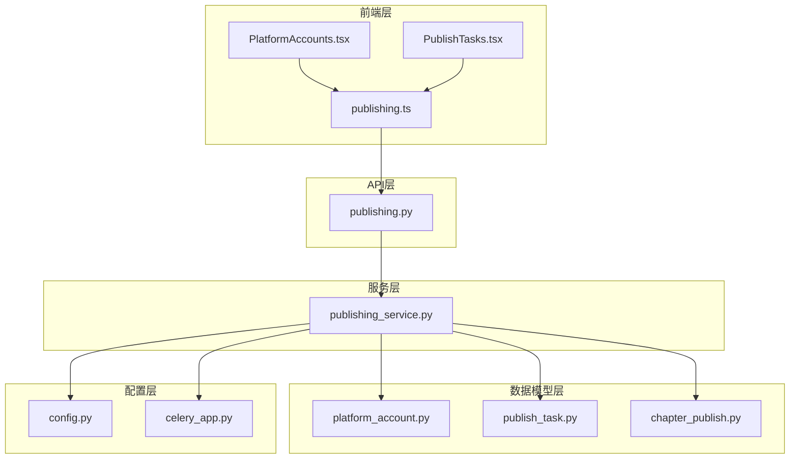
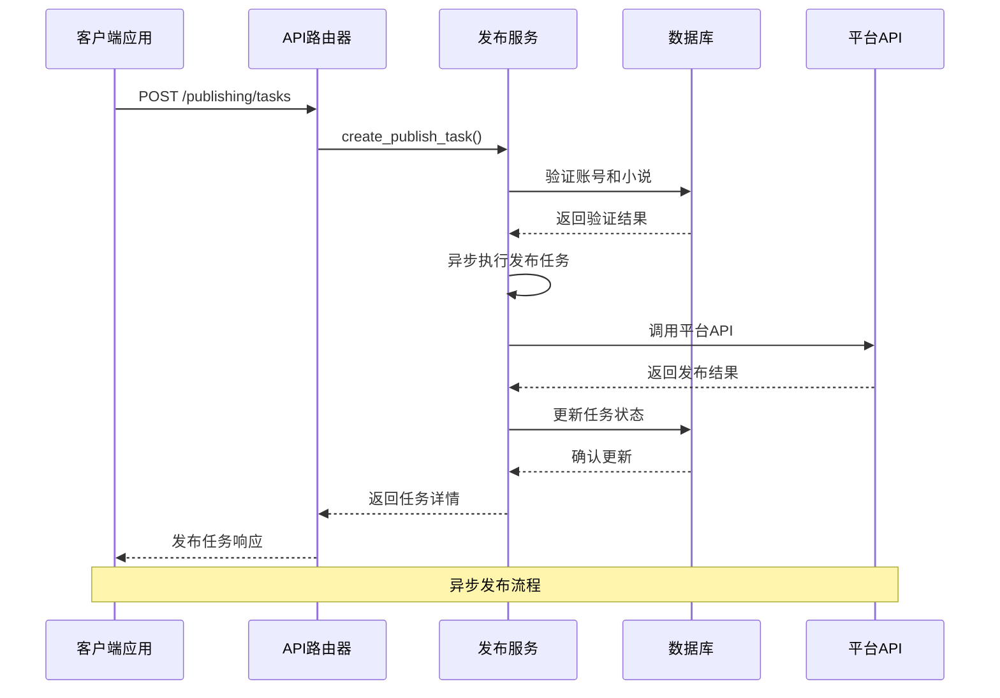
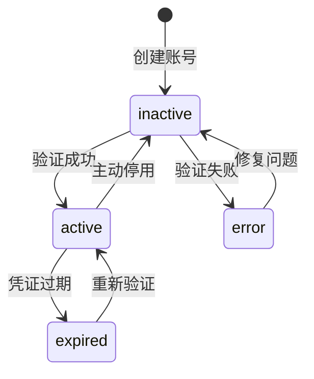
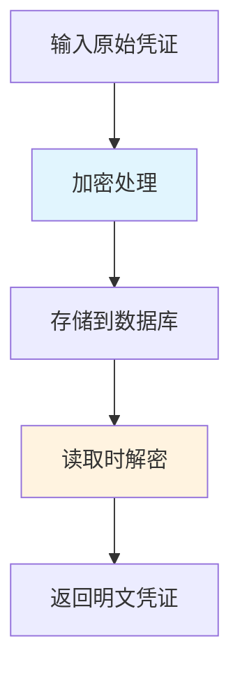
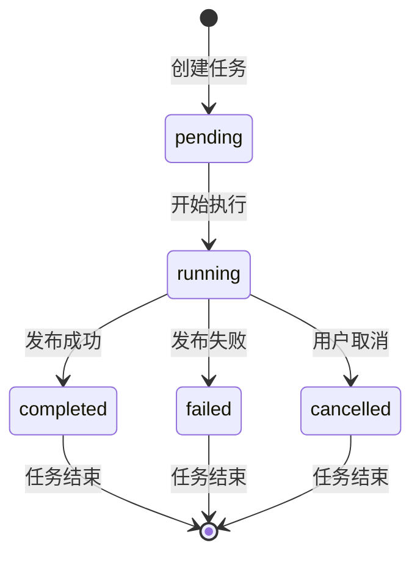
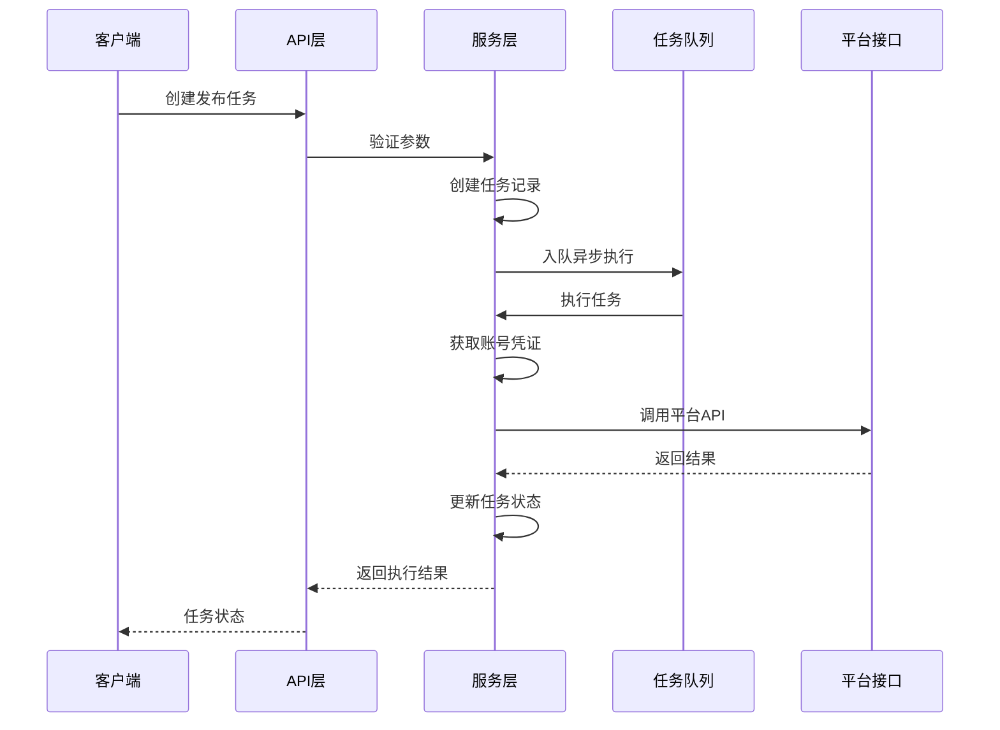
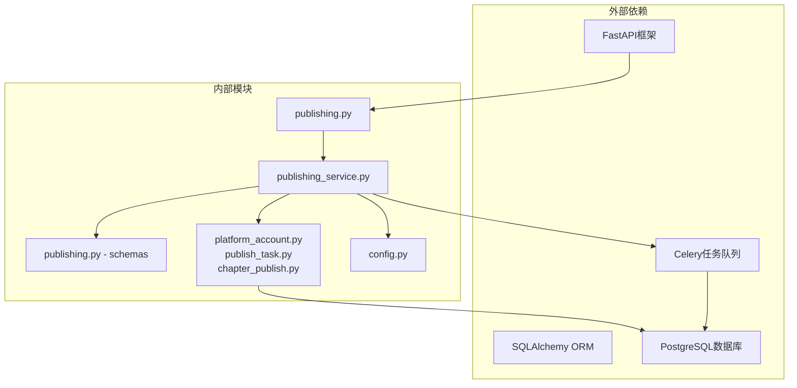
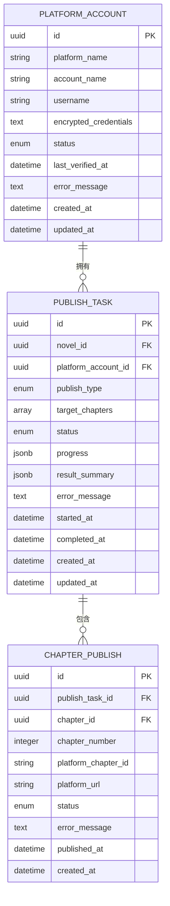

# 发布管理API

<cite>
**本文档引用的文件**
- [backend/api/v1/publishing.py](file://backend/api/v1/publishing.py)
- [backend/services/publishing_service.py](file://backend/services/publishing_service.py)
- [backend/schemas/publishing.py](file://backend/schemas/publishing.py)
- [core/models/publish_task.py](file://core/models/publish_task.py)
- [core/models/platform_account.py](file://core/models/platform_account.py)
- [core/models/chapter_publish.py](file://core/models/chapter_publish.py)
- [frontend/src/api/publishing.ts](file://frontend/src/api/publishing.ts)
- [frontend/src/pages/PlatformAccounts.tsx](file://frontend/src/pages/PlatformAccounts.tsx)
- [frontend/src/pages/PublishTasks.tsx](file://frontend/src/pages/PublishTasks.tsx)
- [frontend/src/api/types.ts](file://frontend/src/api/types.ts)
- [backend/config.py](file://backend/config.py)
- [workers/celery_app.py](file://workers/celery_app.py)
</cite>

## 目录
1. [简介](#简介)
2. [项目结构](#项目结构)
3. [核心组件](#核心组件)
4. [架构概览](#架构概览)
5. [详细组件分析](#详细组件分析)
6. [依赖关系分析](#依赖关系分析)
7. [性能考虑](#性能考虑)
8. [故障排除指南](#故障排除指南)
9. [结论](#结论)

## 简介

发布管理API是小说发布系统的核心组件，负责管理多个平台的账号认证、发布任务调度和状态跟踪。该系统支持多平台同时发布、定时发布和批量发布等高级功能，为小说作者和出版商提供了完整的自动化发布解决方案。

系统采用FastAPI框架构建，基于异步编程模型，确保高并发场景下的性能表现。通过加密存储机制保护敏感的平台凭证信息，提供安全可靠的发布管理服务。

## 项目结构

发布管理API位于后端服务的API路由层，与业务逻辑和服务层分离，遵循清晰的分层架构设计：

**图表来源**
- [backend/api/v1/publishing.py](file://backend/api/v1/publishing.py#L1-L369)
- [backend/services/publishing_service.py](file://backend/services/publishing_service.py#L1-L275)
- [core/models/platform_account.py](file://core/models/platform_account.py#L1-L38)

**章节来源**
- [backend/api/v1/publishing.py](file://backend/api/v1/publishing.py#L1-L369)
- [backend/services/publishing_service.py](file://backend/services/publishing_service.py#L1-L275)

## 核心组件

发布管理系统由以下核心组件构成：

### 平台账号管理组件
- **平台账号模型**: 存储平台认证信息，支持多种平台适配
- **账号状态管理**: 支持激活、停用、过期等状态控制
- **凭证加密存储**: 使用对称加密保护敏感信息

### 发布任务管理组件
- **任务调度引擎**: 异步执行发布任务，支持并发处理
- **发布类型支持**: 创建新书、发布单章、批量发布三种模式
- **进度跟踪**: 实时监控发布进度和状态变化

### 前端交互组件
- **账号管理界面**: 提供平台账号的增删改查功能
- **任务管理界面**: 展示发布任务状态和进度
- **实时轮询**: 自动刷新任务状态，提供良好的用户体验

**章节来源**
- [backend/schemas/publishing.py](file://backend/schemas/publishing.py#L1-L144)
- [core/models/publish_task.py](file://core/models/publish_task.py#L1-L51)

## 架构概览

发布管理API采用分层架构设计，确保各层职责明确，便于维护和扩展：

**图表来源**
- [backend/api/v1/publishing.py](file://backend/api/v1/publishing.py#L157-L231)
- [backend/services/publishing_service.py](file://backend/services/publishing_service.py#L144-L209)

系统架构特点：
- **异步处理**: 使用asyncio实现非阻塞I/O操作
- **加密安全**: 敏感数据采用对称加密存储
- **状态管理**: 完整的任务生命周期状态跟踪
- **错误处理**: 统一的异常处理和错误信息记录

## 详细组件分析

### 平台账号管理API

平台账号管理提供完整的账号生命周期管理功能：

#### API端点定义

| 端点 | 方法 | 功能描述 |
|------|------|----------|
| `/publishing/accounts` | POST | 创建新的平台账号 |
| `/publishing/accounts` | GET | 获取平台账号列表 |
| `/publishing/accounts/{account_id}` | GET | 获取账号详情 |
| `/publishing/accounts/{account_id}` | PATCH | 更新账号信息 |
| `/publishing/accounts/{account_id}` | DELETE | 删除账号 |
| `/publishing/accounts/{account_id}/verify` | POST | 验证账号有效性 |

#### 账号状态管理

**图表来源**
- [core/models/platform_account.py](file://core/models/platform_account.py#L13-L19)

#### 凭证加密机制

系统采用对称加密算法保护平台凭证信息：

**图表来源**
- [backend/services/publishing_service.py](file://backend/services/publishing_service.py#L42-L49)
- [backend/services/publishing_service.py](file://backend/services/publishing_service.py#L103-L112)

**章节来源**
- [backend/api/v1/publishing.py](file://backend/api/v1/publishing.py#L38-L151)
- [backend/services/publishing_service.py](file://backend/services/publishing_service.py#L32-L139)

### 发布任务管理API

发布任务管理提供灵活的任务调度和状态跟踪功能：

#### 发布类型定义

| 发布类型 | 描述 | 参数要求 | 使用场景 |
|----------|------|----------|----------|
| `create_book` | 创建新书 | novel_id, account_id | 首次发布小说 |
| `publish_chapter` | 发布单章 | novel_id, account_id, chapter_number | 单章发布 |
| `batch_publish` | 批量发布 | novel_id, account_id, from_chapter, to_chapter | 连续章节发布 |

#### 任务状态流转

**图表来源**
- [core/models/publish_task.py](file://core/models/publish_task.py#L20-L27)

#### 任务执行流程

**图表来源**
- [backend/api/v1/publishing.py](file://backend/api/v1/publishing.py#L157-L231)
- [backend/services/publishing_service.py](file://backend/services/publishing_service.py#L144-L209)

**章节来源**
- [backend/api/v1/publishing.py](file://backend/api/v1/publishing.py#L157-L303)
- [backend/services/publishing_service.py](file://backend/services/publishing_service.py#L144-L275)

### 发布预览功能

发布预览功能允许用户在实际发布前查看即将发布的章节状态：

#### 预览数据结构

| 字段 | 类型 | 描述 |
|------|------|------|
| novel_id | UUID | 小说标识符 |
| novel_title | string | 小说标题 |
| total_chapters | integer | 总章节数 |
| unpublished_count | integer | 未发布章节数 |
| chapters | array | 章节预览列表 |

#### 章节预览项

| 字段 | 类型 | 描述 |
|------|------|------|
| chapter_number | integer | 章节序号 |
| title | string | 章节标题 |
| word_count | integer | 字数统计 |
| status | string | 章节状态 |
| is_published | boolean | 是否已发布 |
| published_at | datetime | 发布时间 |

**章节来源**
- [backend/api/v1/publishing.py](file://backend/api/v1/publishing.py#L346-L369)
- [backend/services/publishing_service.py](file://backend/services/publishing_service.py#L212-L275)

## 依赖关系分析

发布管理API的依赖关系体现了清晰的分层架构：

**图表来源**
- [backend/api/v1/publishing.py](file://backend/api/v1/publishing.py#L1-L31)
- [backend/services/publishing_service.py](file://backend/services/publishing_service.py#L1-L27)

### 数据模型关系

**图表来源**
- [core/models/platform_account.py](file://core/models/platform_account.py#L21-L38)
- [core/models/publish_task.py](file://core/models/publish_task.py#L29-L51)
- [core/models/chapter_publish.py](file://core/models/chapter_publish.py#L21-L39)

**章节来源**
- [core/models/platform_account.py](file://core/models/platform_account.py#L1-L38)
- [core/models/publish_task.py](file://core/models/publish_task.py#L1-L51)
- [core/models/chapter_publish.py](file://core/models/chapter_publish.py#L1-L39)

## 性能考虑

发布管理API在设计时充分考虑了性能优化：

### 异步处理优势
- **非阻塞I/O**: 使用asyncio避免线程阻塞
- **并发执行**: 支持多任务并行处理
- **资源优化**: 减少内存和CPU占用

### 数据库优化
- **索引设计**: 为常用查询字段建立索引
- **批量操作**: 支持批量插入和更新
- **连接池**: 使用连接池管理数据库连接

### 缓存策略
- **任务状态缓存**: 缓存频繁访问的任务状态
- **配置信息缓存**: 缓存平台配置信息
- **凭证缓存**: 缓存解密后的凭证信息

## 故障排除指南

### 常见问题及解决方案

#### 账号验证失败
**症状**: 账号状态显示为invalid
**原因**: 凭证错误或平台API不可用
**解决**: 
1. 检查平台凭证是否正确
2. 验证网络连接
3. 重新尝试验证

#### 发布任务执行失败
**症状**: 任务状态停留在running
**原因**: 平台API调用失败或超时
**解决**:
1. 检查平台API状态
2. 查看错误日志
3. 重试任务执行

#### 数据库连接问题
**症状**: API调用超时或连接失败
**原因**: 数据库服务器不可用
**解决**:
1. 检查数据库服务状态
2. 验证连接配置
3. 重启数据库服务

**章节来源**
- [backend/services/publishing_service.py](file://backend/services/publishing_service.py#L134-L138)
- [backend/api/v1/publishing.py](file://backend/api/v1/publishing.py#L297-L299)

## 结论

发布管理API为小说发布系统提供了完整、可靠的服务端解决方案。通过清晰的分层架构、完善的错误处理机制和安全的凭证管理，系统能够满足各种复杂的发布需求。

系统的主要优势包括：
- **多平台支持**: 灵活的平台适配机制
- **异步处理**: 高效的任务执行和状态跟踪
- **安全保障**: 加密存储和严格的权限控制
- **用户友好**: 直观的前端界面和实时状态更新

未来可以考虑的功能增强：
- **定时发布**: 支持基于时间的任务调度
- **发布策略**: 更精细的发布规则配置
- **监控告警**: 完善的系统监控和告警机制
- **扩展接口**: 支持更多平台的API集成