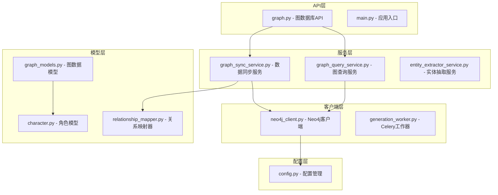
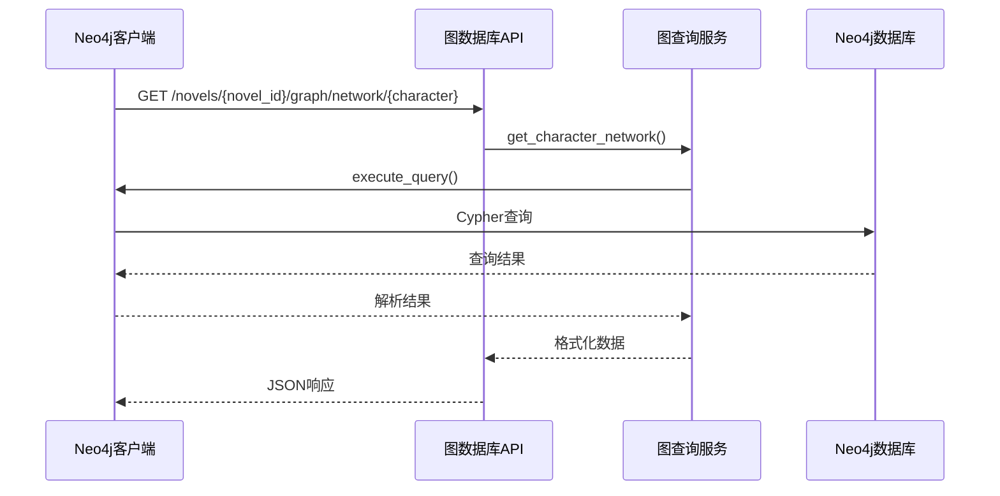
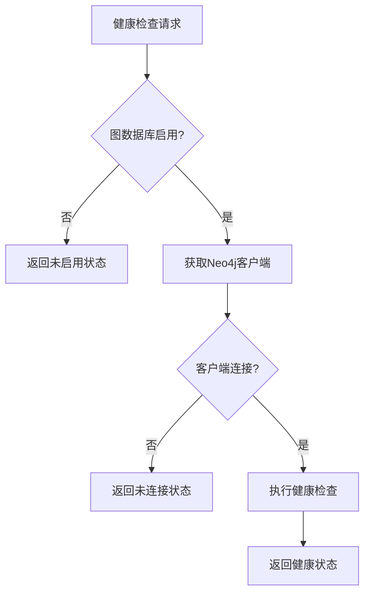
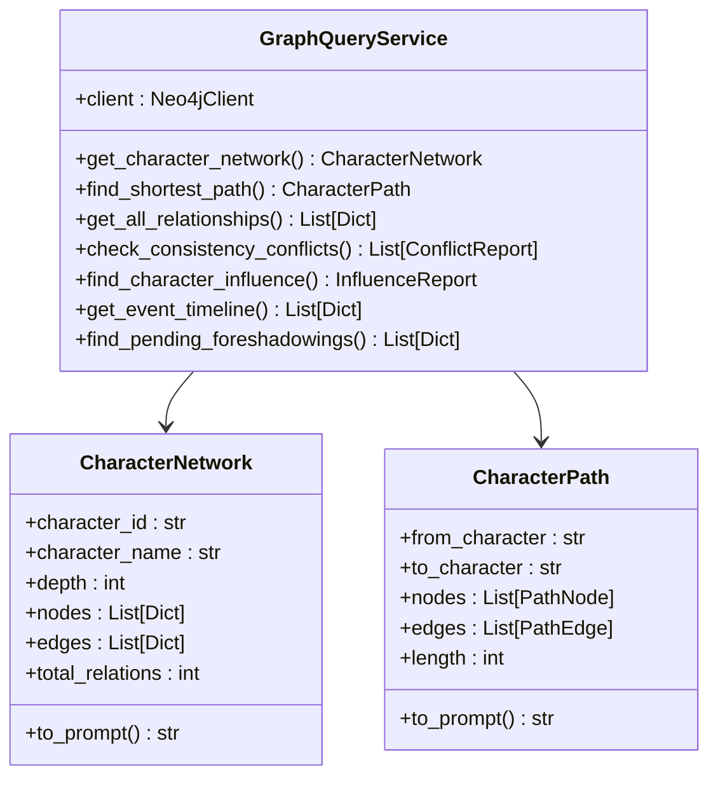
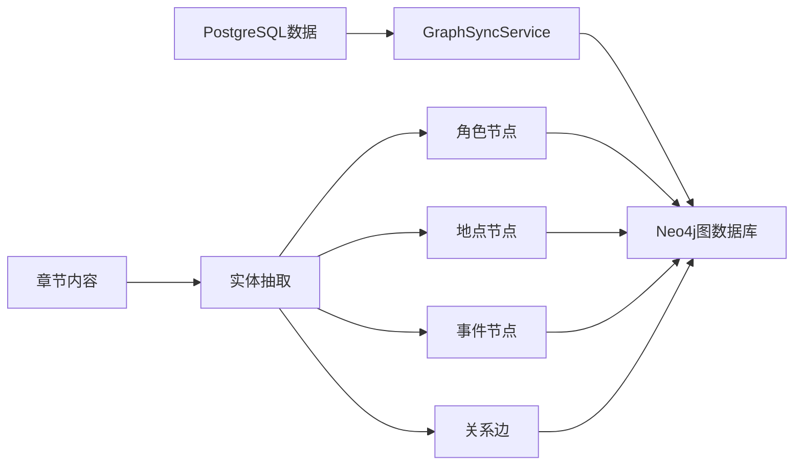
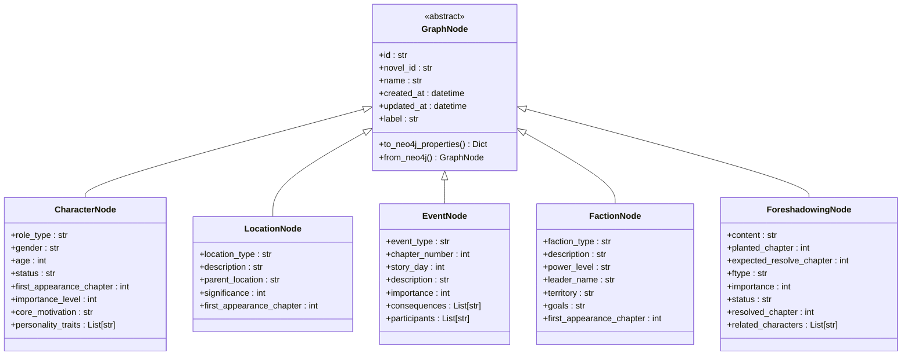
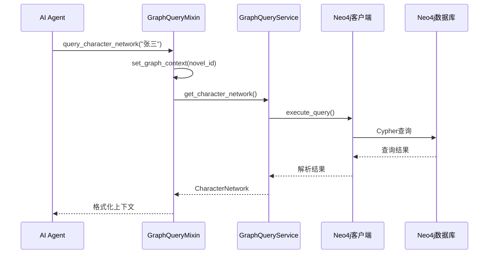
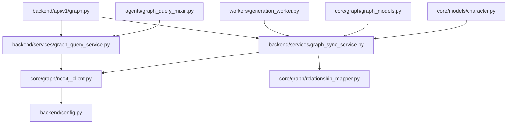

# 图数据库API端点

<cite>
**本文档引用的文件**
- [backend/api/v1/graph.py](file://backend/api/v1/graph.py)
- [backend/services/graph_query_service.py](file://backend/services/graph_query_service.py)
- [core/graph/neo4j_client.py](file://core/graph/neo4j_client.py)
- [core/graph/graph_models.py](file://core/graph/graph_models.py)
- [agents/graph_query_mixin.py](file://agents/graph_query_mixin.py)
- [backend/services/graph_sync_service.py](file://backend/services/graph_sync_service.py)
- [core/graph/relationship_mapper.py](file://core/graph/relationship_mapper.py)
- [workers/generation_worker.py](file://workers/generation_worker.py)
- [backend/config.py](file://backend/config.py)
- [core/models/character.py](file://core/models/character.py)
- [backend/main.py](file://backend/main.py)
</cite>

## 目录
1. [简介](#简介)
2. [项目结构](#项目结构)
3. [核心组件](#核心组件)
4. [架构概览](#架构概览)
5. [详细组件分析](#详细组件分析)
6. [依赖关系分析](#依赖关系分析)
7. [性能考量](#性能考量)
8. [故障排除指南](#故障排除指南)
9. [结论](#结论)

## 简介

本文档详细介绍了小说生成系统中的图数据库API端点，这是一个基于Neo4j图数据库的完整解决方案，专门用于存储和查询小说中的实体关系网络。该系统支持角色关系分析、事件时间线追踪、伏笔管理、一致性冲突检测等多种高级功能，为AI写作Agent提供强大的知识图谱支持。

系统采用模块化设计，包含API路由层、服务层、数据模型层和底层客户端层，形成了完整的图数据库生态系统。通过异步编程和连接池管理，确保了高性能和高可用性。

## 项目结构

小说生成系统的图数据库功能分布在多个层次中，形成了清晰的分层架构：

**图表来源**
- [backend/api/v1/graph.py:1-765](file://backend/api/v1/graph.py#L1-L765)
- [backend/services/graph_query_service.py:1-537](file://backend/services/graph_query_service.py#L1-L537)
- [core/graph/neo4j_client.py:1-550](file://core/graph/neo4j_client.py#L1-L550)

**章节来源**
- [backend/api/v1/graph.py:1-765](file://backend/api/v1/graph.py#L1-L765)
- [backend/main.py:1-159](file://backend/main.py#L1-L159)

## 核心组件

### 图数据库客户端

Neo4j客户端是整个系统的基础，提供了异步连接管理和查询执行能力：

- **连接管理**：支持连接池、自动重连和健康检查
- **查询执行**：提供同步和异步查询接口
- **事务支持**：支持多操作原子执行
- **安全验证**：标签和关系类型白名单验证

### 图查询服务

图查询服务封装了所有图分析功能，包括：

- **角色网络查询**：支持多跳关系查询和可视化
- **路径分析**：查找角色间的最短关系路径
- **一致性检测**：自动检测故事逻辑冲突
- **影响力分析**：计算角色在网络中的重要性

### 数据同步服务

负责将PostgreSQL中的实体数据同步到Neo4j：

- **全量同步**：初始化小说图数据库
- **增量同步**：章节生成后的实时同步
- **关系映射**：将角色关系转换为图边
- **实体抽取**：从章节内容中识别新实体

**章节来源**
- [core/graph/neo4j_client.py:81-550](file://core/graph/neo4j_client.py#L81-L550)
- [backend/services/graph_query_service.py:135-537](file://backend/services/graph_query_service.py#L135-L537)
- [backend/services/graph_sync_service.py:64-746](file://backend/services/graph_sync_service.py#L64-L746)

## 架构概览

系统采用分层架构设计，确保了良好的可维护性和扩展性：

**图表来源**
- [backend/api/v1/graph.py:260-296](file://backend/api/v1/graph.py#L260-L296)
- [backend/services/graph_query_service.py:149-218](file://backend/services/graph_query_service.py#L149-L218)
- [core/graph/neo4j_client.py:207-224](file://core/graph/neo4j_client.py#L207-L224)

系统架构的关键特性：

1. **异步处理**：所有数据库操作都支持异步执行
2. **连接池管理**：优化数据库连接资源使用
3. **错误处理**：完善的异常捕获和错误恢复机制
4. **配置驱动**：通过配置文件控制功能开关

## 详细组件分析

### API路由层

图数据库API提供了完整的REST接口，涵盖了所有核心功能：

#### 健康检查和连接管理

**图表来源**
- [backend/api/v1/graph.py:49-84](file://backend/api/v1/graph.py#L49-L84)

#### 数据同步功能

API支持多种同步模式：

- **全量同步**：初始化小说图数据库
- **增量同步**：章节生成后的实时同步  
- **清理同步**：删除小说的图数据

#### 图查询功能

提供丰富的查询接口：

- **角色网络**：获取角色的多跳关系网络
- **路径分析**：查找两个角色间的最短路径
- **关系查询**：获取所有角色关系
- **一致性检测**：检测故事逻辑冲突
- **影响力分析**：计算角色在网络中的重要性
- **时间线查询**：获取事件时间线

**章节来源**
- [backend/api/v1/graph.py:119-255](file://backend/api/v1/graph.py#L119-L255)
- [backend/api/v1/graph.py:257-484](file://backend/api/v1/graph.py#L257-L484)

### 服务层组件

#### 图查询服务

图查询服务是系统的核心，提供了完整的图分析能力：

**图表来源**
- [backend/services/graph_query_service.py:135-537](file://backend/services/graph_query_service.py#L135-L537)

#### 数据同步服务

数据同步服务负责维护图数据库与关系数据库的一致性：

**图表来源**
- [backend/services/graph_sync_service.py:64-746](file://backend/services/graph_sync_service.py#L64-L746)

**章节来源**
- [backend/services/graph_query_service.py:1-537](file://backend/services/graph_query_service.py#L1-L537)
- [backend/services/graph_sync_service.py:1-746](file://backend/services/graph_sync_service.py#L1-L746)

### 数据模型层

#### 图节点模型

系统定义了完整的图数据模型，支持多种实体类型：

**图表来源**
- [core/graph/graph_models.py:69-463](file://core/graph/graph_models.py#L69-L463)

#### 关系类型映射

系统提供了完整的角色关系映射机制：

- **对称关系**：朋友、敌人、兄弟姐妹等
- **非对称关系**：师父-徒弟、上级-下属等
- **反向映射**：自动推导关系的反向类型
- **关系分类**：情感、家庭、社会、组织等类别

**章节来源**
- [core/graph/graph_models.py:1-463](file://core/graph/graph_models.py#L1-L463)
- [core/graph/relationship_mapper.py:1-226](file://core/graph/relationship_mapper.py#L1-L226)

### Agent集成

#### 图查询混入类

Agent可以通过混入类获得图数据库查询能力：

**图表来源**
- [agents/graph_query_mixin.py:26-498](file://agents/graph_query_mixin.py#L26-L498)

Agent混入类提供了以下功能：

- **角色网络查询**：获取角色的社交关系图
- **路径分析**：查找角色间的关联路径
- **影响力分析**：计算角色在网络中的重要性
- **一致性检测**：检测故事逻辑冲突
- **上下文格式化**：将查询结果转换为提示词格式

**章节来源**
- [agents/graph_query_mixin.py:1-498](file://agents/graph_query_mixin.py#L1-L498)

## 依赖关系分析

系统采用了清晰的依赖关系设计，确保了模块间的松耦合：

**图表来源**
- [backend/api/v1/graph.py:1-765](file://backend/api/v1/graph.py#L1-L765)
- [backend/services/graph_query_service.py:1-537](file://backend/services/graph_query_service.py#L1-L537)
- [core/graph/neo4j_client.py:1-550](file://core/graph/neo4j_client.py#L1-L550)

主要依赖关系特点：

1. **向下依赖**：上层模块依赖下层模块，但下层模块不依赖上层模块
2. **接口抽象**：通过抽象接口减少模块间的耦合
3. **配置驱动**：通过配置文件控制功能开关和行为
4. **异步设计**：所有数据库操作都支持异步执行

**章节来源**
- [backend/api/v1/graph.py:1-765](file://backend/api/v1/graph.py#L1-L765)
- [backend/services/graph_query_service.py:1-537](file://backend/services/graph_query_service.py#L1-L537)

## 性能考量

系统在设计时充分考虑了性能优化：

### 连接池管理
- **最大连接数**：默认50个连接，可根据需求调整
- **连接超时**：30秒超时时间，避免长时间阻塞
- **自动重连**：连接失败时自动重试

### 查询优化
- **异步执行**：所有查询都支持异步执行
- **批量操作**：支持批量创建节点和关系
- **索引利用**：通过novel_id字段进行高效查询

### 缓存策略
- **查询缓存**：可配置的查询结果缓存
- **TTL控制**：可配置的缓存过期时间
- **内存限制**：最大缓存条目数限制

### 异步处理
- **Celery集成**：支持长时间运行的任务
- **进度跟踪**：全量抽取任务支持进度查询
- **错误恢复**：任务失败时自动重试

## 故障排除指南

### 常见问题及解决方案

#### 图数据库连接问题
1. **检查配置**：确认ENABLE_GRAPH_DATABASE设置为True
2. **验证URI**：确保NEO4J_URI配置正确
3. **网络连接**：检查Neo4j服务器可达性
4. **认证信息**：验证用户名和密码

#### 查询性能问题
1. **索引优化**：确保novel_id字段有适当的索引
2. **查询优化**：避免过于复杂的嵌套查询
3. **连接池**：适当调整连接池大小
4. **缓存配置**：启用合适的查询缓存

#### 数据同步问题
1. **检查数据源**：确认PostgreSQL中的数据完整
2. **验证映射规则**：检查关系类型映射是否正确
3. **错误日志**：查看详细的错误信息
4. **重试机制**：利用内置的重试功能

**章节来源**
- [core/graph/neo4j_client.py:133-172](file://core/graph/neo4j_client.py#L133-L172)
- [backend/services/graph_sync_service.py:190-230](file://backend/services/graph_sync_service.py#L190-L230)

## 结论

小说生成系统的图数据库API端点提供了一个完整、高性能、可扩展的图数据分析解决方案。通过精心设计的分层架构和模块化组件，系统能够有效地支持AI写作Agent的各种图分析需求。

系统的主要优势包括：

1. **功能完整性**：涵盖角色关系分析、事件追踪、一致性检测等核心功能
2. **性能优化**：异步处理、连接池管理、查询缓存等优化措施
3. **可扩展性**：模块化设计支持功能扩展和定制
4. **可靠性**：完善的错误处理和重试机制
5. **易用性**：简洁的API接口和丰富的工具类

通过图数据库技术的应用，系统为AI写作提供了强大的知识图谱支持，能够显著提升小说创作的质量和效率。随着功能的不断完善和优化，该系统将成为AI辅助创作领域的重要基础设施。