# 大纲管理API

<cite>
**本文档引用的文件**
- [outlines.py](file://backend/api/v1/outlines.py)
- [outline_service.py](file://backend/services/outline_service.py)
- [plot_outline.py](file://core/models/plot_outline.py)
- [outline.py](file://backend/schemas/outline.py)
- [outline_dynamic_updater.py](file://agents/outline_dynamic_updater.py)
- [outline_iteration_controller.py](file://agents/outline_iteration_controller.py)
- [outline_quality_evaluator.py](file://agents/outline_quality_evaluator.py)
- [outline_validator.py](file://agents/outline_validator.py)
- [crew_manager.py](file://agents/crew_manager.py)
- [main.py](file://backend/main.py)
- [add_outline_enhancements_to_chapters.py](file://alembic/versions/add_outline_enhancements_to_chapters.py)
</cite>

## 更新摘要
**变更内容**
- 新增大纲动态更新功能，支持基于实际写作内容的智能调整
- 增强卷信息结构，新增核心冲突、主线事件、关键转折点、张力循环、情感弧线、角色发展弧线、支线情节、伏笔分配、主题、字数范围等详细字段
- 新增大纲智能完善预览接口（enhance-preview）
- 新增应用大纲优化结果接口（apply-enhancement）
- 扩展大纲质量评估维度
- 增强AI智能代理协作能力
- 新增章节验证功能

## 目录
1. [简介](#简介)
2. [项目结构](#项目结构)
3. [核心组件](#核心组件)
4. [架构概览](#架构概览)
5. [详细组件分析](#详细组件分析)
6. [依赖关系分析](#依赖关系分析)
7. [性能考虑](#性能考虑)
8. [故障排除指南](#故障排除指南)
9. [结论](#结论)

## 简介

大纲管理API是小说生成系统的核心功能模块，提供完整的大纲生命周期管理能力。该系统基于FastAPI框架构建，采用现代化的软件架构设计，集成了AI智能辅助功能，能够帮助创作者高效地创建、管理和优化小说大纲。

系统的主要特色包括：
- **完整的API接口**：提供世界观设定、剧情大纲的查询和更新功能
- **智能完善功能**：通过AI Agent进行大纲质量评估和优化
- **章节分解能力**：将大纲自动分解为详细的章节配置
- **一致性验证**：确保章节内容与大纲保持一致
- **版本管理**：支持大纲版本历史追踪和回滚
- **智能增强**：提供大纲增强预览和应用增强接口
- **动态更新**：根据实际写作内容自动调整后续大纲
- **详细卷结构**：支持丰富的卷信息字段和章节验证

## 项目结构

小说系统采用分层架构设计，主要目录结构如下：

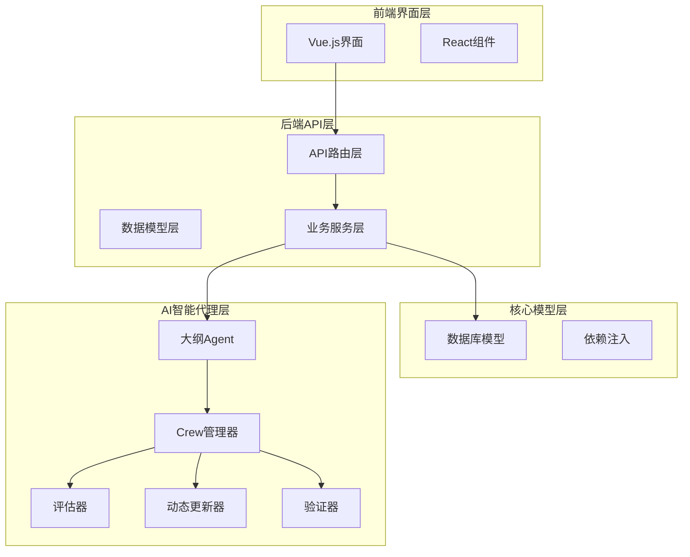

**图表来源**
- [main.py:62-106](file://backend/main.py#L62-L106)
- [outlines.py:37-38](file://backend/api/v1/outlines.py#L37-L38)

**章节来源**
- [main.py:1-149](file://backend/main.py#L1-L149)
- [outlines.py:1-871](file://backend/api/v1/outlines.py#L1-L871)

## 核心组件

大纲管理API由多个核心组件协同工作，形成完整的功能体系：

### API路由层
- **WorldSetting API**：管理小说的世界观设定
- **PlotOutline API**：管理小说的剧情大纲
- **Chapter Outline API**：管理章节大纲任务
- **Validation API**：提供大纲一致性验证
- **Enhancement API**：提供大纲智能增强功能
- **Dynamic Update API**：提供大纲动态更新功能

### 服务层
- **OutlineService**：核心大纲服务，处理AI生成、分解、验证等业务逻辑
- **OutlineDynamicUpdater**：管理大纲动态更新过程
- **OutlineIterationController**：管理大纲优化迭代过程
- **OutlineQualityEvaluator**：评估大纲质量
- **OutlineValidator**：验证大纲一致性

### 数据模型层
- **PlotOutline**：存储剧情大纲数据，包含增强的卷信息结构
- **WorldSetting**：存储世界观设定
- **Chapter**：存储章节信息，包含大纲任务和验证结果

**章节来源**
- [outline_service.py:28-932](file://backend/services/outline_service.py#L28-L932)
- [plot_outline.py:11-114](file://core/models/plot_outline.py#L11-L114)

## 架构概览

系统采用分层架构设计，确保各层职责清晰、耦合度低：

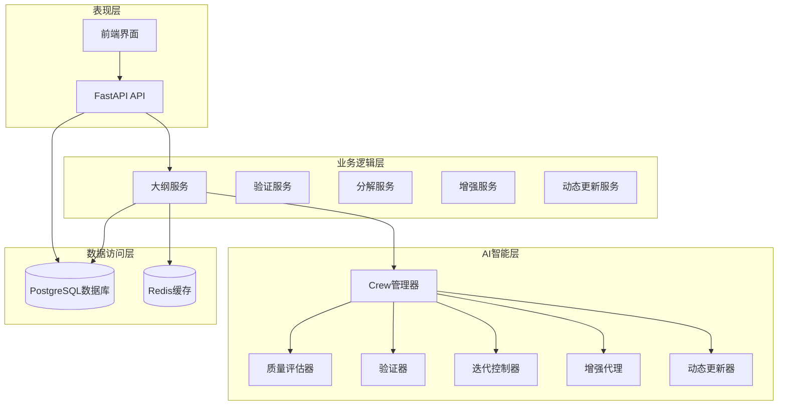

**图表来源**
- [crew_manager.py:38-153](file://agents/crew_manager.py#L38-L153)
- [outline_service.py:28-43](file://backend/services/outline_service.py#L28-L43)

## 详细组件分析

### API路由组件

#### WorldSetting API
负责管理小说的世界观设定，提供查询和更新功能：

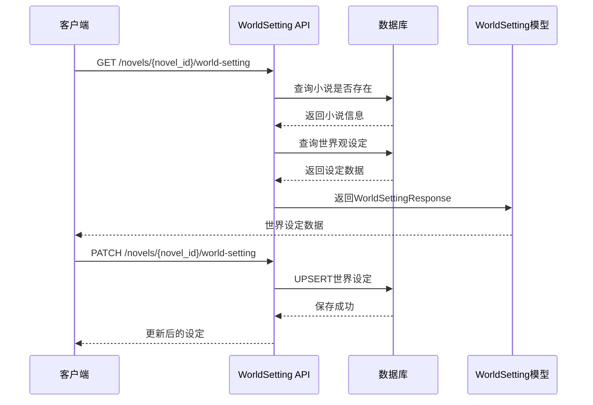

**图表来源**
- [outlines.py:40-111](file://backend/api/v1/outlines.py#L40-L111)

#### PlotOutline API
管理小说的剧情大纲，提供完整的CRUD操作，现已支持动态更新：

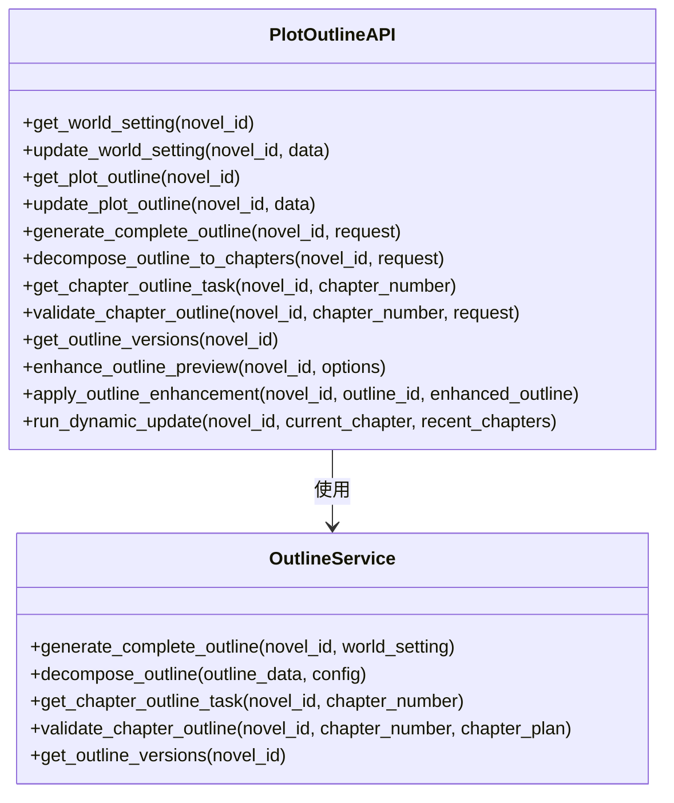

**图表来源**
- [outlines.py:37-871](file://backend/api/v1/outlines.py#L37-L871)
- [outline_service.py:28-932](file://backend/services/outline_service.py#L28-L932)

**章节来源**
- [outlines.py:114-871](file://backend/api/v1/outlines.py#L114-L871)

#### Enhancement API
新增的大纲智能增强功能，提供预览和应用增强接口：

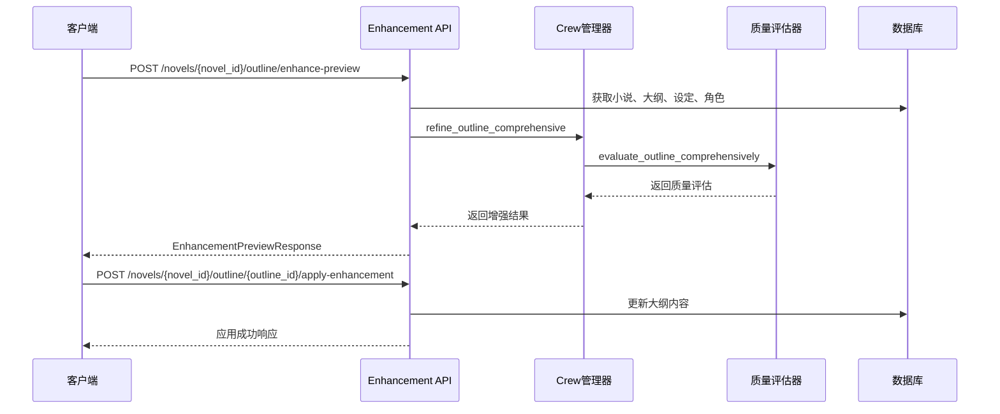

**图表来源**
- [outlines.py:684-800](file://backend/api/v1/outlines.py#L684-L800)

**章节来源**
- [outlines.py:684-800](file://backend/api/v1/outlines.py#L684-L800)

#### Dynamic Update API
新增的大纲动态更新功能，根据实际写作内容自动调整后续大纲：

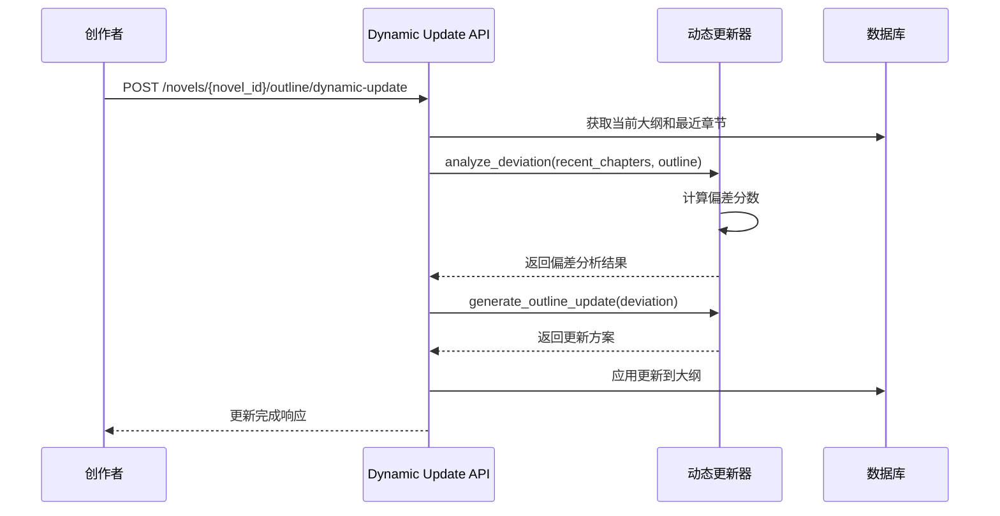

**图表来源**
- [outline_dynamic_updater.py:82-195](file://agents/outline_dynamic_updater.py#L82-L195)

**章节来源**
- [outline_dynamic_updater.py:62-745](file://agents/outline_dynamic_updater.py#L62-L745)

### 服务组件

#### OutlineService 核心功能
OutlineService是大纲管理的核心业务服务，提供以下主要功能：

1. **大纲生成**：基于世界观设定生成完整大纲
2. **大纲分解**：将卷级大纲分解为章节配置
3. **章节任务获取**：提取指定章节的大纲任务
4. **一致性验证**：验证章节与大纲的一致性
5. **版本管理**：管理大纲版本历史
6. **智能增强**：提供大纲增强预览和应用功能

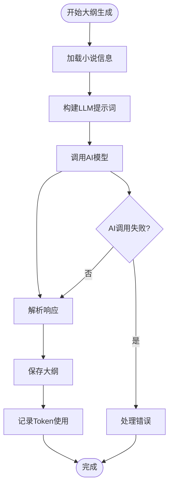

**图表来源**
- [outline_service.py:44-114](file://backend/services/outline_service.py#L44-L114)

**章节来源**
- [outline_service.py:28-932](file://backend/services/outline_service.py#L28-L932)

### AI智能组件

#### OutlineDynamicUpdater
管理大纲动态更新过程，根据实际写作内容自动调整后续大纲：

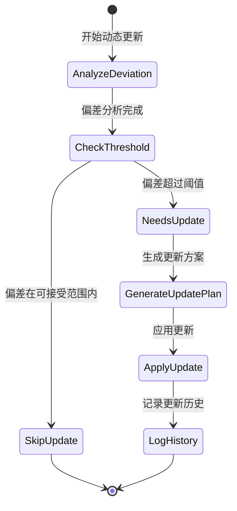

**图表来源**
- [outline_dynamic_updater.py:82-195](file://agents/outline_dynamic_updater.py#L82-L195)

#### OutlineIterationController
管理大纲优化的迭代过程，确保达到质量标准：

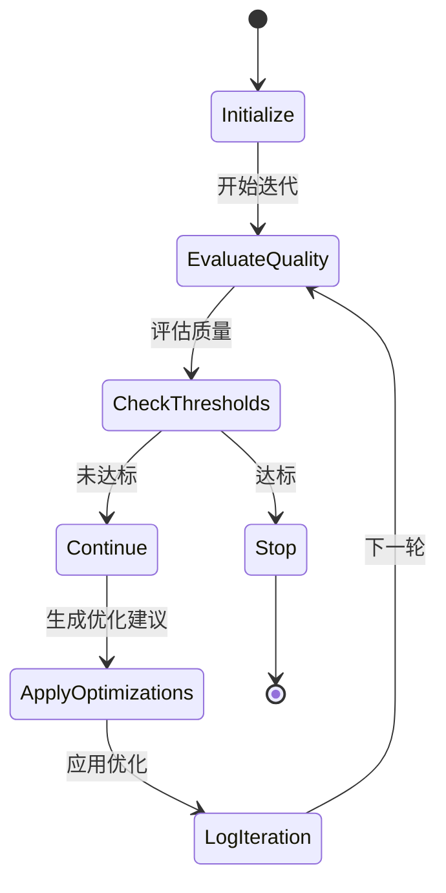

**图表来源**
- [outline_iteration_controller.py:68-124](file://agents/outline_iteration_controller.py#L68-L124)

#### OutlineQualityEvaluator
提供全面的大纲质量评估，包含扩展的评估维度：

| 评估维度 | 权重 | 描述 | 新增标准 |
|---------|------|------|----------|
| structure_completeness | 20% | 大纲结构完整性 | 三幕结构、转折点分布、结局完整性 |
| setting_consistency | 15% | 与世界观设定一致性 | 力量体系、地理环境、势力关系 |
| character_coherence | 20% | 角色发展连贯性 | 角色动机、成长轨迹、关系变化 |
| tension_management | 15% | 张力节奏控制 | 冲突层次、高潮安排、节奏变化 |
| logical_flow | 15% | 逻辑连贯性 | 因果关系、时间线、事件衔接 |
| innovation_factor | 15% | 创意新颖性 | 独特设定、情节设计、主题深度 |

**章节来源**
- [outline_iteration_controller.py:39-404](file://agents/outline_iteration_controller.py#L39-L404)
- [outline_quality_evaluator.py:11-440](file://agents/outline_quality_evaluator.py#L11-L440)

#### Enhanced Crew Management
扩展的Crew管理器支持大纲智能增强和动态更新功能：

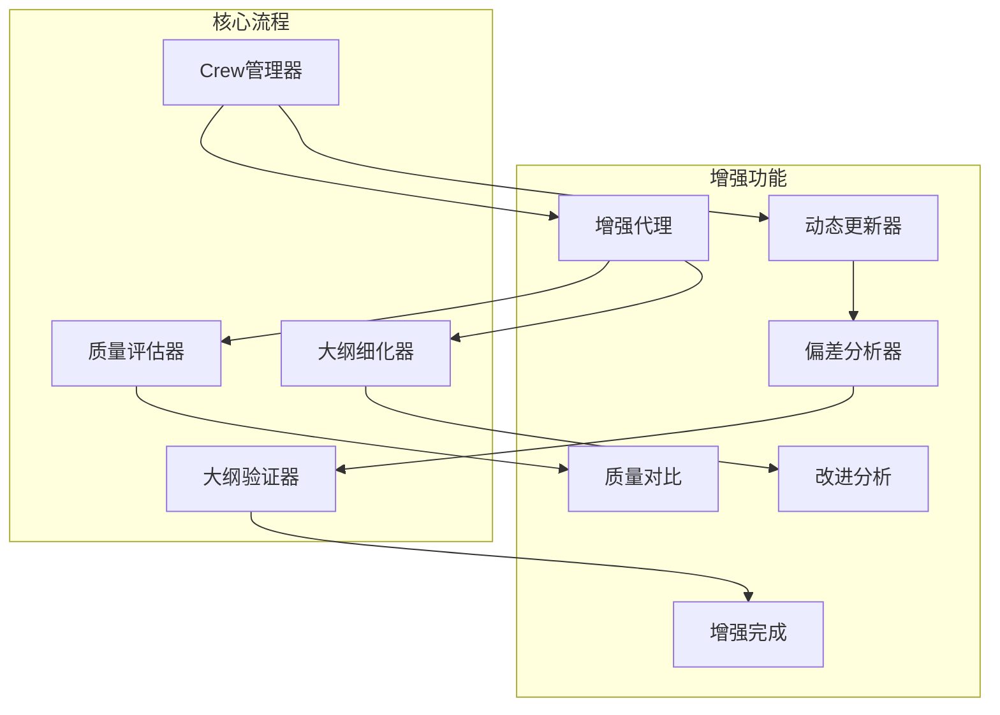

**图表来源**
- [crew_manager.py:38-153](file://agents/crew_manager.py#L38-L153)

**章节来源**
- [crew_manager.py:38-153](file://agents/crew_manager.py#L38-L153)

### 数据模型组件

#### PlotOutline 数据模型
存储剧情大纲的完整数据结构，现已增强卷信息字段：

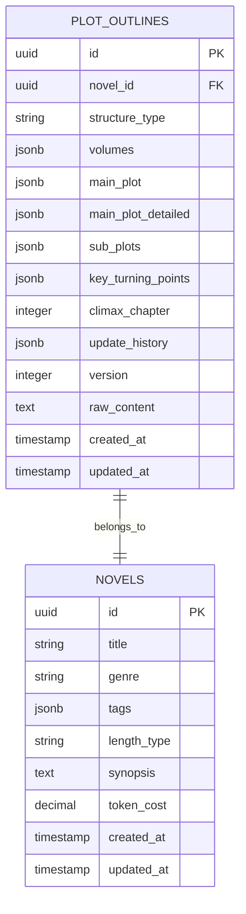

**增强的卷信息结构**：
- **核心冲突**：本卷的主要矛盾
- **主线事件**：重大事件列表，包含章节、事件描述、影响
- **关键转折点**：转折点列表，包含章节、事件、重要性
- **张力循环**：欲扬先抑的循环结构，包含压制期事件和释放期事件
- **情感弧线**：情感变化曲线描述
- **角色发展弧线**：角色成长轨迹
- **支线情节**：次要故事线
- **伏笔分配**：故事线索的铺设和回收
- **主题**：本卷的主题思想
- **字数范围**：预期的字数区间

**图表来源**
- [plot_outline.py:11-114](file://core/models/plot_outline.py#L11-L114)

**章节来源**
- [plot_outline.py:11-114](file://core/models/plot_outline.py#L11-L114)

### 数据库增强
新增章节大纲增强相关字段：

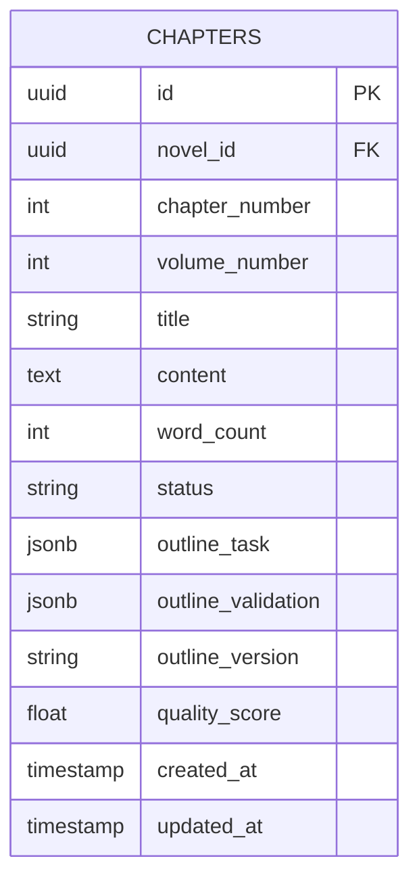

**新增字段说明**：
- **outline_task**：章节大纲任务，包含强制性事件、张力循环位置等
- **outline_validation**：章节大纲验证结果
- **outline_version**：大纲版本标识

**图表来源**
- [add_outline_enhancements_to_chapters.py:22-35](file://alembic/versions/add_outline_enhancements_to_chapters.py#L22-L35)

**章节来源**
- [add_outline_enhancements_to_chapters.py:22-35](file://alembic/versions/add_outline_enhancements_to_chapters.py#L22-L35)

## 依赖关系分析

系统采用模块化设计，各组件之间的依赖关系清晰：

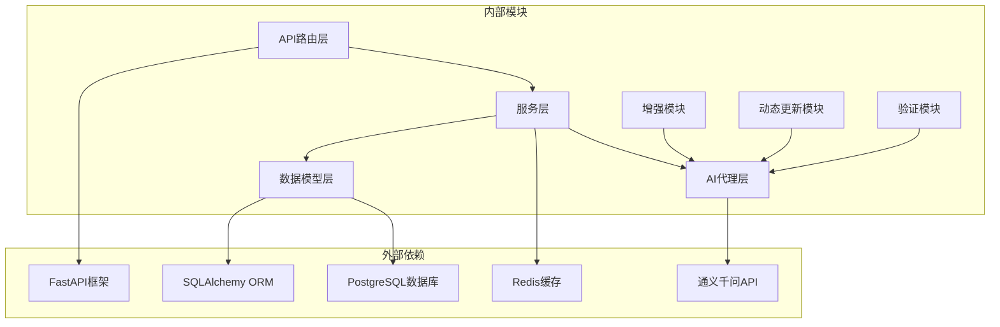

**图表来源**
- [crew_manager.py:10-28](file://agents/crew_manager.py#L10-L28)
- [outline_service.py:16-26](file://backend/services/outline_service.py#L16-L26)

### 核心依赖关系

1. **API层依赖服务层**：API路由调用业务服务处理具体逻辑
2. **服务层依赖数据模型**：业务逻辑操作数据库模型
3. **AI代理层依赖LLM服务**：智能功能调用通义千问API
4. **数据模型依赖ORM框架**：使用SQLAlchemy进行数据库操作
5. **增强模块依赖评估器**：提供质量对比和改进分析
6. **动态更新模块依赖验证器**：确保更新后的大纲一致性
7. **验证模块依赖LLM服务**：进行智能验证和建议生成

**章节来源**
- [crew_manager.py:38-153](file://agents/crew_manager.py#L38-L153)
- [outline_service.py:28-43](file://backend/services/outline_service.py#L28-L43)

## 性能考虑

系统在设计时充分考虑了性能优化：

### 缓存策略
- **Redis缓存**：缓存热点数据，减少数据库查询
- **Token使用记录**：避免重复计算成本
- **章节内容缓存**：章节连续性检测使用

### 数据库优化
- **异步数据库连接**：使用AsyncSession提高并发性能
- **批量操作**：支持批量章节创建和更新
- **索引优化**：为常用查询字段建立索引

### AI调用优化
- **成本控制**：实时跟踪Token使用，控制成本
- **结果复用**：避免重复调用相同请求
- **批处理**：支持批量AI任务处理
- **质量评估缓存**：避免重复的质量评估计算

### 增强功能优化
- **预览模式**：增强预览不修改数据库，降低风险
- **增量更新**：应用增强时只更新必要的字段
- **版本控制**：增强结果独立版本管理
- **动态更新阈值**：避免频繁的小幅更新

### 动态更新优化
- **偏差阈值控制**：只有当偏差超过阈值时才进行更新
- **更新范围限制**：仅更新未写章节的内容
- **历史记录管理**：记录更新历史便于追踪
- **版本号递增**：支持版本回溯和比较

## 故障排除指南

### 常见问题及解决方案

#### 1. 数据库连接问题
**症状**：API调用时报数据库连接错误
**解决方案**：
- 检查数据库服务状态
- 验证连接字符串配置
- 查看连接池配置

#### 2. AI模型调用失败
**症状**：大纲生成或验证时AI调用失败
**解决方案**：
- 检查通义千问API密钥配置
- 验证网络连接
- 查看API响应状态码

#### 3. 数据模型映射错误
**症状**：Pydantic模型验证失败
**解决方案**：
- 检查数据格式是否符合模型定义
- 验证UUID格式
- 确认JSON数据结构

#### 4. 权限认证问题
**症状**：API调用返回401或403错误
**解决方案**：
- 检查认证头设置
- 验证用户权限
- 重新登录获取新令牌

#### 5. 增强功能异常
**症状**：大纲增强预览或应用失败
**解决方案**：
- 检查大纲数据完整性
- 验证增强选项配置
- 查看质量评估结果
- 确认数据库连接正常

#### 6. 动态更新异常
**症状**：大纲动态更新失败或更新不当
**解决方案**：
- 检查最近章节数据格式
- 验证偏差阈值设置
- 查看更新方案生成日志
- 确认数据库事务处理

#### 7. 卷信息格式问题
**症状**：卷信息缺少number字段或格式不正确
**解决方案**：
- 使用fix_plot_outline_volumes函数修复格式
- 检查数据库中的卷数据
- 验证API响应格式

**章节来源**
- [outline_service.py:111-114](file://backend/services/outline_service.py#L111-L114)
- [outline_iteration_controller.py:110-117](file://agents/outline_iteration_controller.py#L110-L117)
- [outlines.py:831-871](file://backend/api/v1/outlines.py#L831-L871)

## 结论

大纲管理API系统是一个功能完整、架构清晰的小说创作辅助工具。通过合理的分层设计和模块化架构，系统实现了以下目标：

### 技术优势
- **模块化设计**：各组件职责明确，便于维护和扩展
- **AI集成**：深度集成通义千问API，提供智能化功能
- **性能优化**：采用异步处理和缓存策略，保证系统性能
- **错误处理**：完善的异常处理机制，提高系统稳定性
- **智能增强**：新增的大纲增强功能，提供更强大的创作辅助
- **动态适应**：支持基于实际写作内容的智能调整
- **详细结构**：丰富的卷信息字段，支持精细化创作管理

### 功能特性
- **完整的大纲生命周期管理**：从创建到优化的全流程支持
- **智能完善功能**：通过多维度评估提升大纲质量
- **一致性验证**：确保章节内容与大纲保持一致
- **版本管理**：支持大纲版本历史追踪
- **智能增强**：提供大纲增强预览和应用功能
- **动态更新**：根据实际写作内容自动调整后续大纲
- **详细卷结构**：支持丰富的卷信息字段和章节验证

### 应用价值
该系统为小说创作者提供了强大的技术支撑，能够显著提高创作效率，降低创作门槛，帮助创作者专注于内容创作本身。通过AI智能辅助，系统能够帮助创作者发现大纲中的潜在问题，提供优化建议，从而创作出更加优秀的作品。

### 新增功能价值
大纲智能增强功能和动态更新功能的引入，为系统增加了以下价值：
- **质量提升**：通过AI评估和优化，显著提升大纲质量
- **风险控制**：预览模式确保增强结果的安全性
- **创作效率**：自动化的大纲优化减少人工工作量
- **学习辅助**：提供具体的改进建议和优化方向
- **智能适应**：根据实际写作内容自动调整后续规划
- **持续优化**：支持创作过程中的持续改进

### 未来发展方向
系统在未来可以进一步扩展的功能包括：
- 更丰富的AI评估维度和标准
- 支持更多类型的文学作品和创作需求
- 增强的可视化编辑功能和交互体验
- 更精细的版本控制机制和历史追踪
- 多语言支持和本地化适配
- 增强的协作功能和团队管理
- 智能写作助手和内容生成
- 创作进度监控和统计分析

通过持续的技术创新和功能完善，大纲管理API系统将继续为小说创作者提供强有力的技术支持，推动数字创作生态的发展和繁荣。