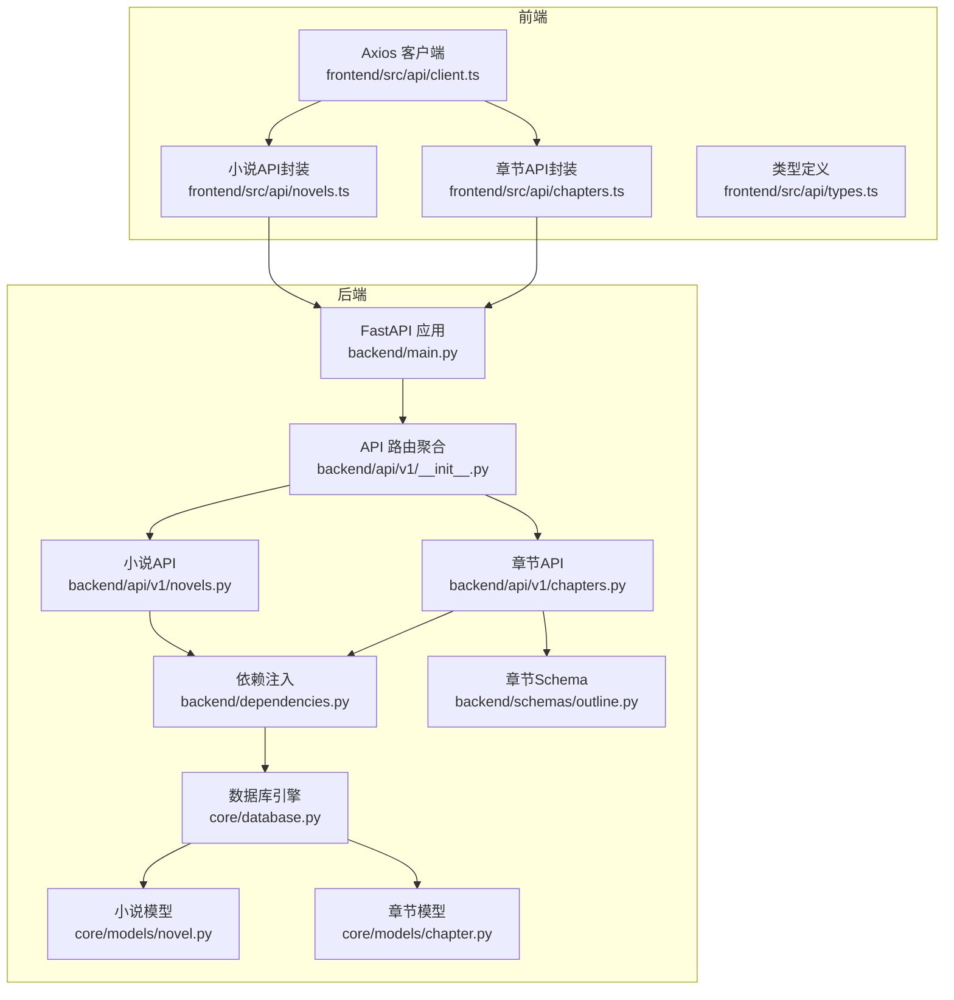
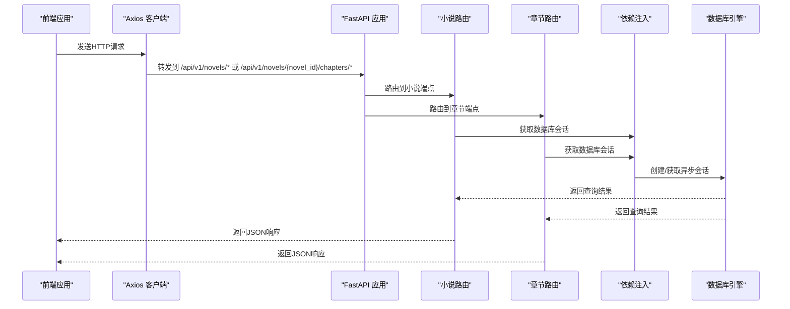
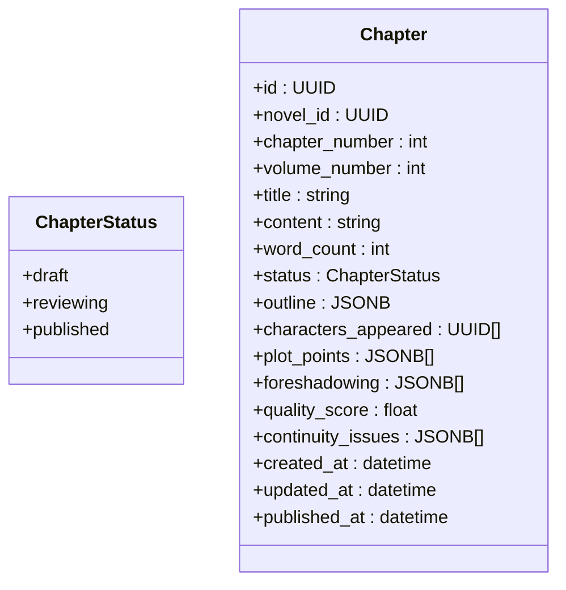
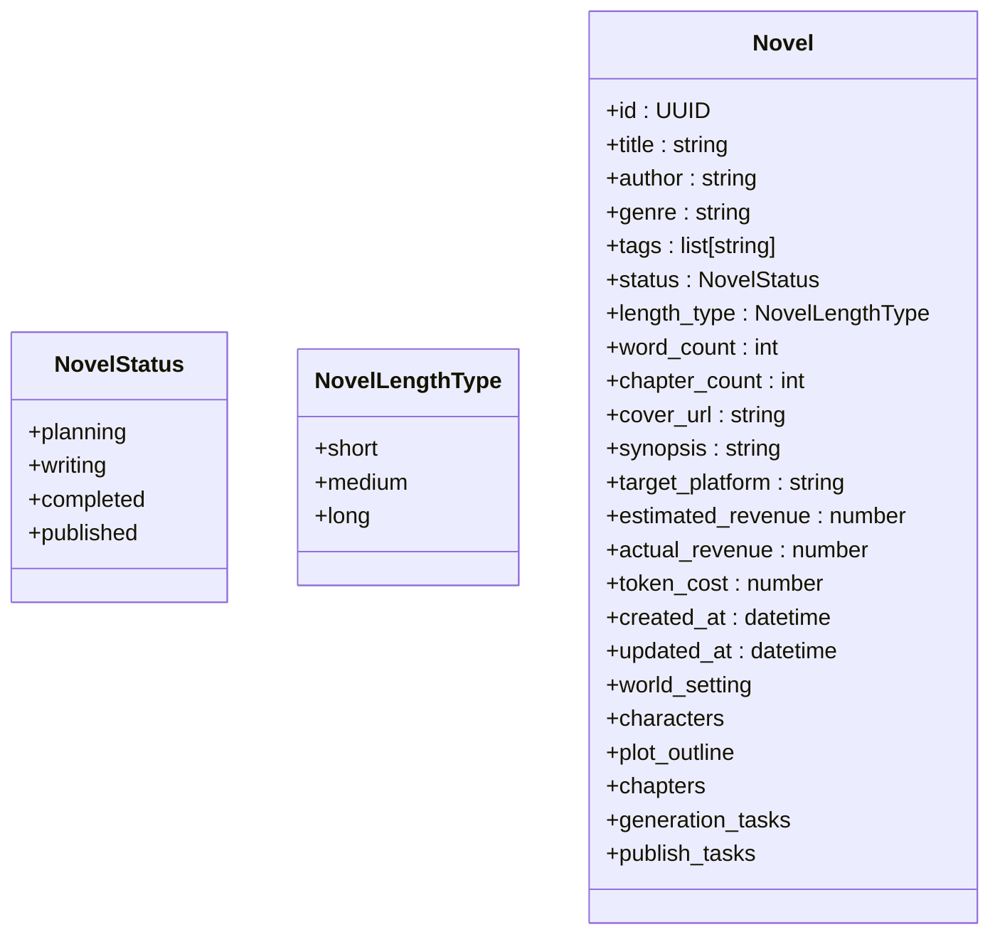
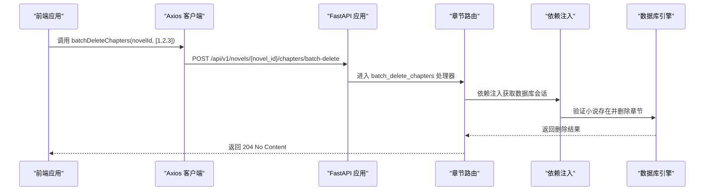
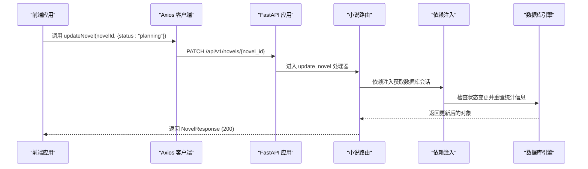
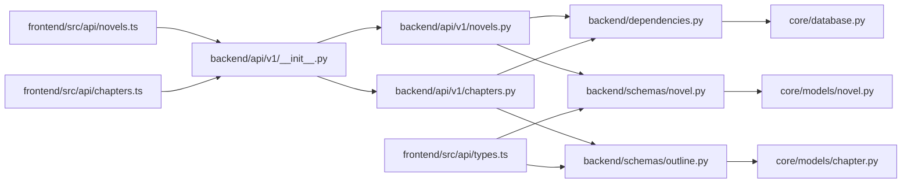

# 小说管理API

<cite>
**本文档引用的文件**
- [backend/api/v1/novels.py](file://backend/api/v1/novels.py)
- [backend/api/v1/chapters.py](file://backend/api/v1/chapters.py)
- [backend/schemas/novel.py](file://backend/schemas/novel.py)
- [backend/schemas/outline.py](file://backend/schemas/outline.py)
- [core/models/novel.py](file://core/models/novel.py)
- [core/models/chapter.py](file://core/models/chapter.py)
- [backend/dependencies.py](file://backend/dependencies.py)
- [core/database.py](file://core/database.py)
- [backend/api/v1/__init__.py](file://backend/api/v1/__init__.py)
- [backend/main.py](file://backend/main.py)
- [frontend/src/api/novels.ts](file://frontend/src/api/novels.ts)
- [frontend/src/api/chapters.ts](file://frontend/src/api/chapters.ts)
- [frontend/src/api/types.ts](file://frontend/src/api/types.ts)
- [backend/config.py](file://backend/config.py)
</cite>

## 更新摘要
**变更内容**
- 新增了小说状态管理的自动重置功能：当状态改为'planning'(企划中)时，会自动重置所有统计信息（字数、章节数、Token成本等）
- 增强了PATCH /api/v1/novels/{novel_id}端点的文档说明，明确描述了状态变更时的数据重置行为
- 更新了相关章节的状态管理功能，支持草稿、审核中、已发布三种状态

## 目录
1. [简介](#简介)
2. [项目结构](#项目结构)
3. [核心组件](#核心组件)
4. [架构概览](#架构概览)
5. [详细组件分析](#详细组件分析)
6. [依赖分析](#依赖分析)
7. [性能考虑](#性能考虑)
8. [故障排除指南](#故障排除指南)
9. [结论](#结论)
10. [附录](#附录)

## 简介
本文件为小说管理API的详细技术文档，覆盖小说的完整CRUD操作以及新增的章节管理功能，包括：
- 小说管理API：GET /api/v1/novels、POST /api/v1/novels、GET /api/v1/novels/{novel_id}、PATCH /api/v1/novels/{novel_id}、DELETE /api/v1/novels/{novel_id}
- 章节管理API：GET /api/v1/novels/{novel_id}/chapters、GET /api/v1/novels/{novel_id}/chapters/{chapter_number}、PATCH /api/v1/novels/{novel_id}/chapters/{chapter_number}、DELETE /api/v1/novels/{novel_id}/chapters/{chapter_number}、POST /api/v1/novels/{novel_id}/chapters/batch-delete

文档详细说明每个端点的请求参数、响应格式、状态码处理、分页参数、状态枚举值、错误处理机制，并提供完整的请求/响应示例与常见使用场景。

## 项目结构
后端采用FastAPI + SQLAlchemy异步ORM架构，API版本化组织在v1模块下，数据库通过依赖注入提供会话管理。前端通过Axios客户端调用后端接口。新增的章节管理模块提供独立的路由前缀和完整的CRUD操作。

**图表来源**
- [backend/main.py](file://backend/main.py#L15-L32)
- [backend/api/v1/__init__.py](file://backend/api/v1/__init__.py#L11-L24)
- [backend/api/v1/novels.py](file://backend/api/v1/novels.py#L22-L22)
- [backend/api/v1/chapters.py](file://backend/api/v1/chapters.py#L27-L27)
- [backend/dependencies.py](file://backend/dependencies.py#L12-L19)
- [core/database.py](file://core/database.py#L11-L35)
- [core/models/novel.py](file://core/models/novel.py#L37-L66)
- [core/models/chapter.py](file://core/models/chapter.py#L18-L45)
- [backend/schemas/outline.py](file://backend/schemas/outline.py#L128-L168)
- [frontend/src/api/client.ts](file://frontend/src/api/client.ts#L4-L8)
- [frontend/src/api/novels.ts](file://frontend/src/api/novels.ts#L1-L44)
- [frontend/src/api/chapters.ts](file://frontend/src/api/chapters.ts#L1-L48)
- [frontend/src/api/types.ts](file://frontend/src/api/types.ts#L5-L44)

**章节来源**
- [backend/main.py](file://backend/main.py#L15-L32)
- [backend/api/v1/__init__.py](file://backend/api/v1/__init__.py#L11-L24)
- [backend/api/v1/novels.py](file://backend/api/v1/novels.py#L22-L22)
- [backend/api/v1/chapters.py](file://backend/api/v1/chapters.py#L27-L27)
- [backend/dependencies.py](file://backend/dependencies.py#L12-L19)
- [core/database.py](file://core/database.py#L11-L35)
- [core/models/novel.py](file://core/models/novel.py#L37-L66)
- [core/models/chapter.py](file://core/models/chapter.py#L18-L45)
- [backend/schemas/outline.py](file://backend/schemas/outline.py#L128-L168)
- [frontend/src/api/client.ts](file://frontend/src/api/client.ts#L4-L8)
- [frontend/src/api/novels.ts](file://frontend/src/api/novels.ts#L1-L44)
- [frontend/src/api/chapters.ts](file://frontend/src/api/chapters.ts#L1-L48)
- [frontend/src/api/types.ts](file://frontend/src/api/types.ts#L5-L44)

## 核心组件
- API路由器：定义了小说模块和章节模块的路由前缀与标签，集中管理CRUD端点。
- Pydantic模型：定义请求与响应的数据结构，确保前后端数据一致性。
- ORM模型：定义数据库表结构及枚举类型，包含小说状态、章节状态与篇幅类型。
- 依赖注入：提供异步数据库会话，自动处理事务与异常回滚。
- 前端封装：统一的HTTP客户端与类型定义，便于调用与类型安全。

**章节来源**
- [backend/api/v1/novels.py](file://backend/api/v1/novels.py#L22-L22)
- [backend/api/v1/chapters.py](file://backend/api/v1/chapters.py#L27-L27)
- [backend/schemas/novel.py](file://backend/schemas/novel.py#L8-L57)
- [backend/schemas/outline.py](file://backend/schemas/outline.py#L128-L168)
- [core/models/novel.py](file://core/models/novel.py#L24-L35)
- [core/models/chapter.py](file://core/models/chapter.py#L12-L16)
- [backend/dependencies.py](file://backend/dependencies.py#L12-L19)
- [core/database.py](file://core/database.py#L25-L35)
- [frontend/src/api/novels.ts](file://frontend/src/api/novels.ts#L1-L44)
- [frontend/src/api/chapters.ts](file://frontend/src/api/chapters.ts#L1-L48)
- [frontend/src/api/types.ts](file://frontend/src/api/types.ts#L5-L44)

## 架构概览
小说API遵循REST风格，使用FastAPI的依赖注入与SQLAlchemy异步查询实现高效的数据访问。前端通过Axios进行HTTP请求，后端通过CORS中间件允许指定来源访问。章节管理API提供独立的路由空间，支持复杂的分页和状态过滤功能。

**图表来源**
- [backend/main.py](file://backend/main.py#L22-L32)
- [backend/api/v1/novels.py](file://backend/api/v1/novels.py#L25-L150)
- [backend/api/v1/chapters.py](file://backend/api/v1/chapters.py#L30-L212)
- [backend/dependencies.py](file://backend/dependencies.py#L12-L19)
- [core/database.py](file://core/database.py#L25-L35)

**章节来源**
- [backend/main.py](file://backend/main.py#L22-L32)
- [backend/api/v1/novels.py](file://backend/api/v1/novels.py#L25-L150)
- [backend/api/v1/chapters.py](file://backend/api/v1/chapters.py#L30-L212)
- [backend/dependencies.py](file://backend/dependencies.py#L12-L19)
- [core/database.py](file://core/database.py#L25-L35)

## 详细组件分析

### 章节管理API

#### 端点：GET /api/v1/novels/{novel_id}/chapters
- 功能：分页获取指定小说的章节列表，支持按状态筛选。
- 路径参数：
  - novel_id：UUID，小说唯一标识
- 查询参数：
  - page：页码，最小为1
  - page_size：每页数量，最小为1，最大为100
  - status：可选，章节状态筛选（draft/reviewing/published）
- 响应：ChapterListResponse，包含items（章节列表）、total（总数）、page、page_size。
- 状态码：
  - 200 OK：成功返回数据
  - 404 Not Found：小说不存在
- 错误处理：
  - 参数校验失败时由FastAPI自动返回422 Unprocessable Entity
  - 无数据时返回空数组，total为0

请求示例
- GET /api/v1/novels/a1b2c3d4-e5f6-7890-a1b2-c3d4e5f67890/chapters?page=1&page_size=20&status=draft
- GET /api/v1/novels/a1b2c3d4-e5f6-7890-a1b2-c3d4e5f67890/chapters?page=2&page_size=50

响应示例
- 200 OK
  {
    "items": [
      {
        "id": "d2b8f1a4-1a2b-4c3d-8e5f-6a7b8c9d0e1f",
        "novel_id": "a1b2c3d4-e5f6-7890-a1b2-c3d4e5f67890",
        "chapter_number": 1,
        "volume_number": 1,
        "title": "第一章：开篇",
        "content": "这是第一章的内容...",
        "word_count": 1500,
        "status": "draft",
        "quality_score": null,
        "created_at": "2024-01-01T12:00:00Z",
        "updated_at": "2024-01-01T12:00:00Z"
      }
    ],
    "total": 1,
    "page": 1,
    "page_size": 20
  }

常见场景
- 列表分页浏览：设置page与page_size
- 状态筛选：添加status参数过滤不同状态的章节
- 内容管理：按状态查看草稿、审核中、已发布的章节

**章节来源**
- [backend/api/v1/chapters.py](file://backend/api/v1/chapters.py#L30-L80)
- [backend/schemas/outline.py](file://backend/schemas/outline.py#L162-L168)
- [frontend/src/api/chapters.ts](file://frontend/src/api/chapters.ts#L4-L14)
- [frontend/src/api/types.ts](file://frontend/src/api/types.ts#L96-L116)

#### 端点：GET /api/v1/novels/{novel_id}/chapters/{chapter_number}
- 功能：根据章节号获取章节详情。
- 路径参数：
  - novel_id：UUID，小说唯一标识
  - chapter_number：整数，章节号
- 响应：ChapterResponse
- 状态码：
  - 200 OK：成功
  - 404 Not Found：章节不存在
- 错误处理：
  - 未找到章节时返回404

请求示例
- GET /api/v1/novels/a1b2c3d4-e5f6-7890-a1b2-c3d4e5f67890/chapters/1

响应示例
- 200 OK
  {
    "id": "d2b8f1a4-1a2b-4c3d-8e5f-6a7b8c9d0e1f",
    "novel_id": "a1b2c3d4-e5f6-7890-a1b2-c3d4e5f67890",
    "chapter_number": 1,
    "volume_number": 1,
    "title": "第一章：开篇",
    "content": "这是第一章的内容...",
    "word_count": 1500,
    "status": "draft",
    "quality_score": null,
    "created_at": "2024-01-01T12:00:00Z",
    "updated_at": "2024-01-01T12:00:00Z"
  }

常见场景
- 章节详情展示：获取单个章节的完整信息
- 编辑界面：为章节编辑器提供数据源

**章节来源**
- [backend/api/v1/chapters.py](file://backend/api/v1/chapters.py#L83-L107)
- [core/models/chapter.py](file://core/models/chapter.py#L18-L45)
- [frontend/src/api/chapters.ts](file://frontend/src/api/chapters.ts#L16-L19)
- [frontend/src/api/types.ts](file://frontend/src/api/types.ts#L96-L109)

#### 端点：PATCH /api/v1/novels/{novel_id}/chapters/{chapter_number}
- 功能：更新章节内容（部分字段）。
- 路径参数：
  - novel_id：UUID，小说唯一标识
  - chapter_number：整数，章节号
- 请求体：ChapterUpdate（可选字段）
  - title：可选，章节标题
  - content：可选，章节正文内容
  - status：可选，章节状态（draft/reviewing/published）
- 响应：ChapterResponse
- 状态码：
  - 200 OK：更新成功
  - 404 Not Found：章节不存在
  - 422 Unprocessable Entity：请求参数校验失败
- 错误处理：
  - 未找到章节返回404
  - 参数校验失败返回422

请求示例
- PATCH /api/v1/novels/a1b2c3d4-e5f6-7890-a1b2-c3d4e5f67890/chapters/1
  {
    "status": "reviewing",
    "title": "第一章：新的开始"
  }

响应示例
- 200 OK
  {
    "id": "d2b8f1a4-1a2b-4c3d-8e5f-6a7b8c9d0e1f",
    "novel_id": "a1b2c3d4-e5f6-7890-a1b2-c3d4e5f67890",
    "chapter_number": 1,
    "volume_number": 1,
    "title": "第一章：新的开始",
    "content": "这是第一章的内容...",
    "word_count": 1500,
    "status": "reviewing",
    "quality_score": null,
    "created_at": "2024-01-01T12:00:00Z",
    "updated_at": "2024-01-03T10:00:00Z"
  }

常见场景
- 状态变更：如从draft切换到reviewing
- 内容更新：修改章节标题或正文内容
- 自动字数统计：更新content时自动重新计算word_count

**章节来源**
- [backend/api/v1/chapters.py](file://backend/api/v1/chapters.py#L110-L146)
- [backend/schemas/outline.py](file://backend/schemas/outline.py#L135-L143)
- [frontend/src/api/chapters.ts](file://frontend/src/api/chapters.ts#L21-L31)
- [frontend/src/api/types.ts](file://frontend/src/api/types.ts#L111-L115)

#### 端点：DELETE /api/v1/novels/{novel_id}/chapters/{chapter_number}
- 功能：删除指定章节。
- 路径参数：
  - novel_id：UUID，小说唯一标识
  - chapter_number：整数，章节号
- 响应：无内容（204 No Content）
- 状态码：
  - 204 No Content：删除成功
  - 404 Not Found：章节不存在
- 错误处理：
  - 未找到章节返回404

请求示例
- DELETE /api/v1/novels/a1b2c3d4-e5f6-7890-a1b2-c3d4e5f67890/chapters/1

响应示例
- 204 No Content

常见场景
- 章节删除：删除不需要的章节
- 内容清理：移除错误或重复的章节

**章节来源**
- [backend/api/v1/chapters.py](file://backend/api/v1/chapters.py#L149-L177)
- [core/models/chapter.py](file://core/models/chapter.py#L18-L45)
- [frontend/src/api/chapters.ts](file://frontend/src/api/chapters.ts#L33-L38)

#### 端点：POST /api/v1/novels/{novel_id}/chapters/batch-delete
- 功能：批量删除多个章节。
- 路径参数：
  - novel_id：UUID，小说唯一标识
- 请求体：BatchDeleteRequest
  - chapter_numbers：整数数组，要删除的章节号列表
- 响应：无内容（204 No Content）
- 状态码：
  - 204 No Content：删除成功
  - 404 Not Found：小说不存在
- 错误处理：
  - 未找到小说返回404
  - 不存在的章节号会被忽略

请求示例
- POST /api/v1/novels/a1b2c3d4-e5f6-7890-a1b2-c3d4e5f67890/chapters/batch-delete
  {
    "chapter_numbers": [1, 2, 3, 5, 8]
  }

响应示例
- 204 No Content

常见场景
- 批量清理：一次性删除多个不需要的章节
- 内容重组：删除连续的章节后重新编号

**章节来源**
- [backend/api/v1/chapters.py](file://backend/api/v1/chapters.py#L180-L212)
- [backend/api/v1/chapters.py](file://backend/api/v1/chapters.py#L23-L26)
- [frontend/src/api/chapters.ts](file://frontend/src/api/chapters.ts#L40-L47)

### 小说管理API

#### 端点：GET /api/v1/novels
- 功能：分页获取小说列表，支持状态筛选。
- 查询参数：
  - page：页码，最小为1
  - page_size：每页数量，最小为1，最大为100
  - status：可选，小说状态筛选（planning/writing/completed/published）
- 响应：NovelListResponse，包含items（小说列表）、total（总数）、page、page_size。
- 状态码：
  - 200 OK：成功返回数据
- 错误处理：
  - 参数校验失败时由FastAPI自动返回422 Unprocessable Entity
  - 无数据时返回空数组，total为0

请求示例
- GET /api/v1/novels?page=1&page_size=10&status=writing
- GET /api/v1/novels?page=2&page_size=20

响应示例
- 200 OK
  {
    "items": [
      {
        "id": "d2b8f1a4-1a2b-4c3d-8e5f-6a7b8c9d0e1f",
        "title": "示例小说",
        "author": "AI创作",
        "genre": "科幻",
        "tags": ["未来", "太空"],
        "status": "writing",
        "length_type": "medium",
        "word_count": 15000,
        "chapter_count": 12,
        "cover_url": null,
        "synopsis": "这是一个示例小说。",
        "target_platform": "番茄小说",
        "estimated_revenue": 0,
        "actual_revenue": 0,
        "token_cost": 0,
        "created_at": "2024-01-01T12:00:00Z",
        "updated_at": "2024-01-02T14:30:00Z"
      }
    ],
    "total": 1,
    "page": 1,
    "page_size": 10
  }

常见场景
- 列表分页浏览：设置page与page_size
- 状态筛选：添加status参数过滤
- 性能优化：合理设置page_size，避免过大导致响应缓慢

**章节来源**
- [backend/api/v1/novels.py](file://backend/api/v1/novels.py#L25-L63)
- [backend/schemas/novel.py](file://backend/schemas/novel.py#L53-L57)
- [frontend/src/api/novels.ts](file://frontend/src/api/novels.ts#L4-L13)
- [frontend/src/api/types.ts](file://frontend/src/api/types.ts#L26-L33)

#### 端点：POST /api/v1/novels
- 功能：创建新小说。
- 请求体：NovelCreate
  - title：必填，小说标题
  - genre：必填，小说类型
  - tags：可选，标签列表
  - synopsis：可选，简介
  - target_platform：可选，默认"番茄小说"
  - length_type：可选，默认"medium"（short/medium/long）
- 响应：NovelResponse
- 状态码：
  - 201 Created：创建成功
  - 422 Unprocessable Entity：请求参数校验失败
- 错误处理：
  - 参数校验失败返回422
  - 数据库约束冲突由底层ORM抛出异常

请求示例
- POST /api/v1/novels
  {
    "title": "新小说",
    "genre": "悬疑",
    "tags": ["推理", "都市"],
    "synopsis": "这是一部悬疑小说。",
    "target_platform": "番茄小说",
    "length_type": "medium"
  }

响应示例
- 201 Created
  {
    "id": "a1b2c3d4-e5f6-7890-a1b2-c3d4e5f67890",
    "title": "新小说",
    "author": "AI创作",
    "genre": "悬疑",
    "tags": ["推理", "都市"],
    "status": "planning",
    "length_type": "medium",
    "word_count": 0,
    "chapter_count": 0,
    "cover_url": null,
    "synopsis": "这是一部悬疑小说。",
    "target_platform": "番茄小说",
    "estimated_revenue": 0,
    "actual_revenue": 0,
    "token_cost": 0,
    "created_at": "2024-01-03T09:00:00Z",
    "updated_at": "2024-01-03T09:00:00Z"
  }

常见场景
- 快速创建：仅提供必要字段title与genre
- 初始化状态：默认状态为planning，适合后续流程推进

**章节来源**
- [backend/api/v1/novels.py](file://backend/api/v1/novels.py#L66-L78)
- [backend/schemas/novel.py](file://backend/schemas/novel.py#L8-L28)
- [frontend/src/api/novels.ts](file://frontend/src/api/novels.ts#L20-L23)
- [frontend/src/api/types.ts](file://frontend/src/api/types.ts#L26-L44)

#### 端点：GET /api/v1/novels/{novel_id}
- 功能：获取小说详情，包含世界观、角色、章节数等关联信息。
- 路径参数：
  - novel_id：UUID，小说唯一标识
- 响应：NovelResponse（包含关联信息的预加载）
- 状态码：
  - 200 OK：成功
  - 404 Not Found：小说不存在
- 错误处理：
  - 未找到小说时返回404

请求示例
- GET /api/v1/novels/d2b8f1a4-1a2b-4c3d-8e5f-6a7b8c9d0e1f

响应示例
- 200 OK
  {
    "id": "d2b8f1a4-1a2b-4c3d-8e5f-6a7b8c9d0e1f",
    "title": "示例小说",
    "author": "AI创作",
    "genre": "科幻",
    "tags": ["未来", "太空"],
    "status": "writing",
    "length_type": "medium",
    "word_count": 15000,
    "chapter_count": 12,
    "cover_url": null,
    "synopsis": "这是一个示例小说。",
    "target_platform": "番茄小说",
    "estimated_revenue": 0,
    "actual_revenue": 0,
    "token_cost": 0,
    "created_at": "2024-01-01T12:00:00Z",
    "updated_at": "2024-01-02T14:30:00Z"
  }

常见场景
- 详情页展示：获取小说基础信息与统计指标
- 关联信息：前端可直接使用返回的关联数据减少二次请求

**章节来源**
- [backend/api/v1/novels.py](file://backend/api/v1/novels.py#L81-L104)
- [core/models/novel.py](file://core/models/novel.py#L59-L66)
- [frontend/src/api/novels.ts](file://frontend/src/api/novels.ts#L15-L18)
- [frontend/src/api/types.ts](file://frontend/src/api/types.ts#L6-L24)

#### 端点：PATCH /api/v1/novels/{novel_id}
- 功能：更新小说信息（部分字段）。
- 路径参数：
  - novel_id：UUID，小说唯一标识
- 请求体：NovelUpdate（可选字段）
  - title、genre、tags、synopsis、status、cover_url、target_platform、length_type
- 响应：NovelResponse
- 状态码：
  - 200 OK：更新成功
  - 404 Not Found：小说不存在
  - 422 Unprocessable Entity：请求参数校验失败
- 错误处理：
  - 未找到小说返回404
  - 参数校验失败返回422

**更新** 当状态从其他状态改为'planning'(企划中)时，会自动重置所有统计信息：
- 字数统计：word_count重置为0
- 章节数量：chapter_count重置为0
- Token成本：token_cost重置为0
- 预估收益：estimated_revenue重置为0
- 实际收益：actual_revenue重置为0

请求示例
- PATCH /api/v1/novels/d2b8f1a4-1a2b-4c3d-8e5f-6a7b8c9d0e1f
  {
    "status": "planning"
  }

响应示例
- 200 OK
  {
    "id": "d2b8f1a4-1a2b-4c3d-8e5f-6a7b8c9d0e1f",
    "title": "示例小说",
    "author": "AI创作",
    "genre": "科幻",
    "tags": ["未来", "太空"],
    "status": "planning",
    "length_type": "medium",
    "word_count": 0,
    "chapter_count": 0,
    "cover_url": null,
    "synopsis": "这是一个示例小说。",
    "target_platform": "番茄小说",
    "estimated_revenue": 0,
    "actual_revenue": 0,
    "token_cost": 0,
    "created_at": "2024-01-01T12:00:00Z",
    "updated_at": "2024-01-03T10:00:00Z"
  }

常见场景
- 状态重置：将已完成的小说重置为企划中状态
- 数据清理：准备重新开始创作流程
- 统计重置：确保统计数据的准确性

**章节来源**
- [backend/api/v1/novels.py](file://backend/api/v1/novels.py#L116-L162)
- [backend/schemas/novel.py](file://backend/schemas/novel.py#L33-L49)
- [frontend/src/api/novels.ts](file://frontend/src/api/novels.ts#L25-L28)
- [frontend/src/api/types.ts](file://frontend/src/api/types.ts#L35-L44)

#### 端点：DELETE /api/v1/novels/{novel_id}
- 功能：删除小说（级联删除相关数据）。
- 路径参数：
  - novel_id：UUID，小说唯一标识
- 响应：无内容（204 No Content）
- 状态码：
  - 204 No Content：删除成功
  - 404 Not Found：小说不存在
- 错误处理：
  - 未找到小说返回404

请求示例
- DELETE /api/v1/novels/d2b8f1a4-1a2b-4c3d-8e5f-6a7b8c9d0e1f

响应示例
- 204 No Content

常见场景
- 清理无效数据：删除不再需要的小说及其关联内容
- 级联删除：确保相关的世界观、角色、章节、生成与发布任务一并清理

**章节来源**
- [backend/api/v1/novels.py](file://backend/api/v1/novels.py#L165-L189)
- [core/models/novel.py](file://core/models/novel.py#L60-L66)
- [frontend/src/api/novels.ts](file://frontend/src/api/novels.ts#L30-L32)

### 数据模型与枚举

#### 章节状态枚举
章节状态管理是新增的重要功能，支持草稿、审核中、已发布三种状态：

#### 小说状态与篇幅类型
小说状态与篇幅类型的定义保持不变：

**图表来源**
- [core/models/chapter.py](file://core/models/chapter.py#L12-L16)
- [core/models/novel.py](file://core/models/novel.py#L24-L35)

**章节来源**
- [core/models/chapter.py](file://core/models/chapter.py#L12-L16)
- [core/models/novel.py](file://core/models/novel.py#L24-L35)

### 端到端调用序列

#### 章节管理调用序列
以下序列图展示了前端调用章节API的典型流程（以批量删除为例）：

**图表来源**
- [frontend/src/api/chapters.ts](file://frontend/src/api/chapters.ts#L40-L47)
- [backend/api/v1/chapters.py](file://backend/api/v1/chapters.py#L180-L212)
- [backend/dependencies.py](file://backend/dependencies.py#L12-L19)
- [core/database.py](file://core/database.py#L25-L35)

**章节来源**
- [frontend/src/api/chapters.ts](file://frontend/src/api/chapters.ts#L40-L47)
- [backend/api/v1/chapters.py](file://backend/api/v1/chapters.py#L180-L212)
- [backend/dependencies.py](file://backend/dependencies.py#L12-L19)
- [core/database.py](file://core/database.py#L25-L35)

#### 小说管理调用序列
以下序列图展示了前端调用小说API的典型流程（以状态重置为例）：

**图表来源**
- [frontend/src/api/novels.ts](file://frontend/src/api/novels.ts#L25-L28)
- [backend/api/v1/novels.py](file://backend/api/v1/novels.py#L116-L162)
- [backend/dependencies.py](file://backend/dependencies.py#L12-L19)
- [core/database.py](file://core/database.py#L25-L35)

**章节来源**
- [frontend/src/api/novels.ts](file://frontend/src/api/novels.ts#L25-L28)
- [backend/api/v1/novels.py](file://backend/api/v1/novels.py#L116-L162)
- [backend/dependencies.py](file://backend/dependencies.py#L12-L19)
- [core/database.py](file://core/database.py#L25-L35)

## 依赖分析
- 路由聚合：API v1将各模块路由统一挂载，包括新增的章节路由。
- 依赖注入：通过get_db提供异步会话，自动处理提交与回滚。
- 数据库引擎：基于异步PostgreSQL驱动，支持高并发读写。
- 前端类型：与后端Pydantic模型保持一致，确保类型安全。

**图表来源**
- [backend/api/v1/__init__.py](file://backend/api/v1/__init__.py#L11-L24)
- [backend/api/v1/novels.py](file://backend/api/v1/novels.py#L13-L20)
- [backend/api/v1/chapters.py](file://backend/api/v1/chapters.py#L13-L20)
- [backend/dependencies.py](file://backend/dependencies.py#L12-L19)
- [core/database.py](file://core/database.py#L11-L35)
- [backend/schemas/novel.py](file://backend/schemas/novel.py#L8-L57)
- [backend/schemas/outline.py](file://backend/schemas/outline.py#L128-L168)
- [core/models/novel.py](file://core/models/novel.py#L37-L66)
- [core/models/chapter.py](file://core/models/chapter.py#L18-L45)
- [frontend/src/api/novels.ts](file://frontend/src/api/novels.ts#L1-L44)
- [frontend/src/api/chapters.ts](file://frontend/src/api/chapters.ts#L1-L48)
- [frontend/src/api/types.ts](file://frontend/src/api/types.ts#L5-L44)

**章节来源**
- [backend/api/v1/__init__.py](file://backend/api/v1/__init__.py#L11-L24)
- [backend/api/v1/novels.py](file://backend/api/v1/novels.py#L13-L20)
- [backend/api/v1/chapters.py](file://backend/api/v1/chapters.py#L13-L20)
- [backend/dependencies.py](file://backend/dependencies.py#L12-L19)
- [core/database.py](file://core/database.py#L11-L35)
- [backend/schemas/novel.py](file://backend/schemas/novel.py#L8-L57)
- [backend/schemas/outline.py](file://backend/schemas/outline.py#L128-L168)
- [core/models/novel.py](file://core/models/novel.py#L37-L66)
- [core/models/chapter.py](file://core/models/chapter.py#L18-L45)
- [frontend/src/api/novels.ts](file://frontend/src/api/novels.ts#L1-L44)
- [frontend/src/api/chapters.ts](file://frontend/src/api/chapters.ts#L1-L48)
- [frontend/src/api/types.ts](file://frontend/src/api/types.ts#L5-L44)

## 性能考虑
- 分页参数限制：page_size最大为100，避免单次返回过多数据。
- 异步数据库：使用异步引擎与会话，提升并发处理能力。
- 关联预加载：详情接口对关联实体进行selectinload，减少N+1查询风险。
- CORS限制：仅允许特定前端地址访问，降低跨域攻击面。
- 超时设置：前端Axios设置较长超时，适应长时间任务。
- 章节状态索引：章节状态字段支持快速过滤和排序。
- 状态重置优化：状态变更检测使用高效的条件判断，避免不必要的数据库操作。

## 故障排除指南
- 404 Not Found：当novel_id或chapter_number不存在时返回。检查ID是否正确以及数据是否已删除。
- 422 Unprocessable Entity：请求参数校验失败。检查请求体字段类型与必填项。
- 数据库异常：依赖注入层自动回滚并抛出异常。检查数据库连接与权限。
- CORS问题：确认前端地址在CORS白名单内且请求头正确。
- 章节状态异常：确保状态值在允许范围内（draft、reviewing、published）。
- 状态重置异常：检查状态变更逻辑，确保只在从其他状态切换到planning时触发重置。

**章节来源**
- [backend/api/v1/chapters.py](file://backend/api/v1/chapters.py#L53-L54)
- [backend/api/v1/chapters.py](file://backend/api/v1/chapters.py#L101-L105)
- [backend/api/v1/chapters.py](file://backend/api/v1/chapters.py#L167-L171)
- [backend/api/v1/chapters.py](file://backend/api/v1/chapters.py#L196-L197)
- [backend/api/v1/chapters.py](file://backend/api/v1/chapters.py#L129-L133)
- [backend/api/v1/novels.py](file://backend/api/v1/novels.py#L141-L145)
- [backend/dependencies.py](file://backend/dependencies.py#L25-L35)
- [backend/main.py](file://backend/main.py#L22-L29)

## 结论
小说管理API与新增的章节管理API共同构成了完整的AI小说创作系统。章节管理API提供了强大的内容管理能力，包括改进的分页功能、状态过滤和批量删除功能。通过合理的分页策略、异步数据库与CORS配置，满足了生产环境下的可用性与安全性需求。前端类型定义与Axios封装进一步提升了开发效率与调用体验。

**更新** 最新的状态管理功能确保了数据的完整性：当小说状态重置为'planning'时，所有相关的统计信息都会被自动清理，为新的创作流程做好准备。这一设计保证了系统的数据一致性，避免了状态与实际数据不匹配的问题。

## 附录

### 章节状态枚举值
- 章节状态：draft（草稿）、reviewing（审核中）、published（已发布）

**章节来源**
- [core/models/chapter.py](file://core/models/chapter.py#L12-L16)

### 状态枚举值
- 小说状态：planning（规划中）、writing（写作中）、completed（已完成）、published（已发布）
- 篇幅类型：short（短文）、medium（中篇小说）、long（长篇小说）

**章节来源**
- [core/models/novel.py](file://core/models/novel.py#L24-L35)

### 分页参数说明
- page：页码，从1开始
- page_size：每页数量，最小1，最大100

**章节来源**
- [backend/api/v1/chapters.py](file://backend/api/v1/chapters.py#L33-L35)
- [backend/api/v1/novels.py](file://backend/api/v1/novels.py#L27-L29)

### 数据库配置
- 使用异步PostgreSQL驱动，连接池大小与溢出配置见数据库引擎初始化。
- 动态构建DATABASE_URL，支持从环境变量读取配置。

**章节来源**
- [core/database.py](file://core/database.py#L11-L22)
- [backend/config.py](file://backend/config.py#L18-L27)

### 批量删除请求格式
- chapter_numbers：整数数组，要删除的章节号列表

**章节来源**
- [backend/api/v1/chapters.py](file://backend/api/v1/chapters.py#L23-L26)
- [frontend/src/api/chapters.ts](file://frontend/src/api/chapters.ts#L40-L47)

### 状态重置功能说明
当小说状态从其他状态切换到'planning'时，系统会自动执行以下重置操作：
- word_count：重置为0
- chapter_count：重置为0
- token_cost：重置为0
- estimated_revenue：重置为0
- actual_revenue：重置为0

这些重置操作确保了数据的一致性和准确性，为新的创作流程提供了干净的起始状态。

**章节来源**
- [backend/api/v1/novels.py](file://backend/api/v1/novels.py#L150-L157)
- [core/models/novel.py](file://core/models/novel.py#L47-L54)