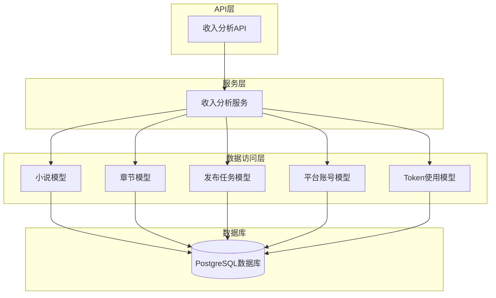
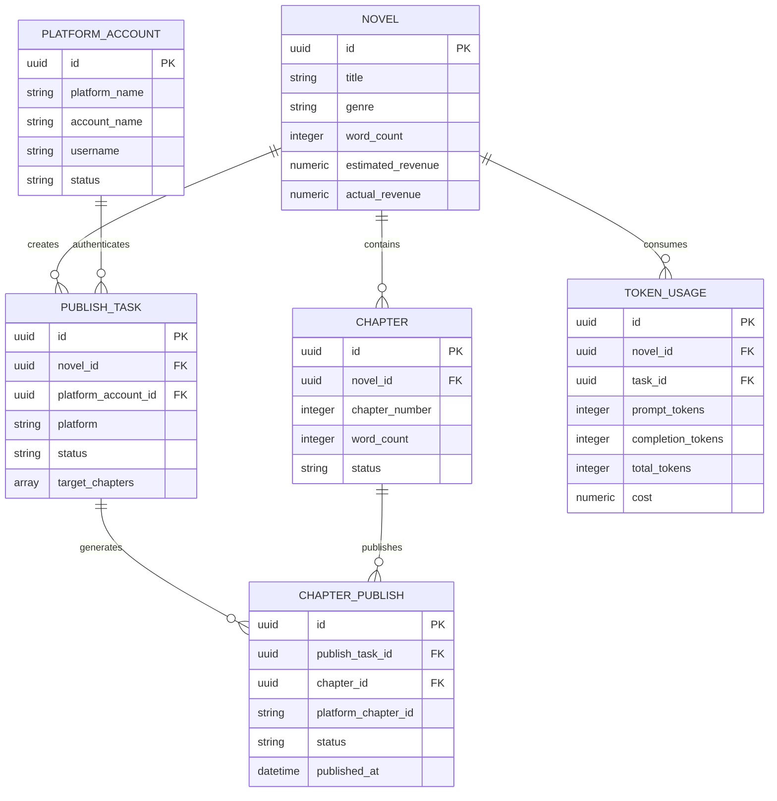
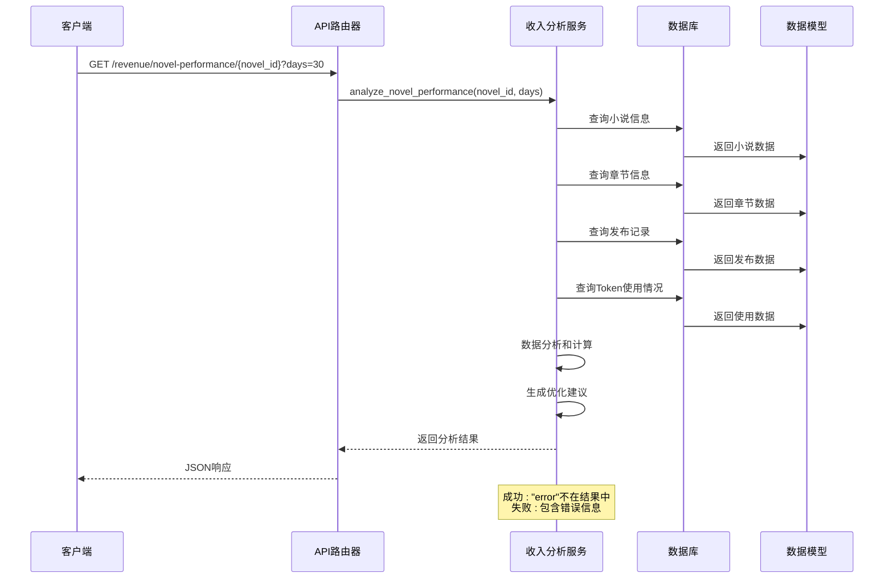
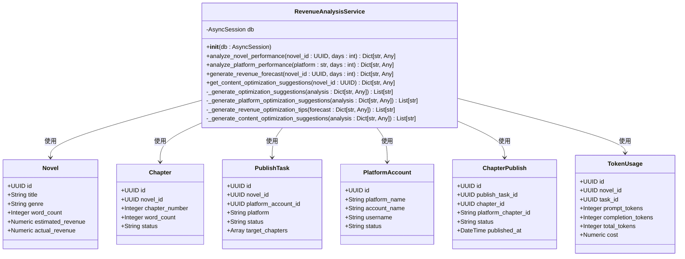
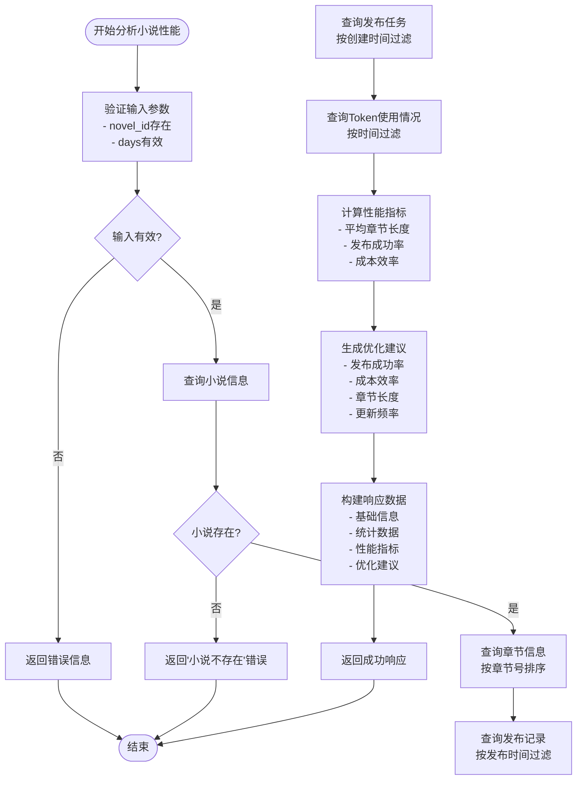
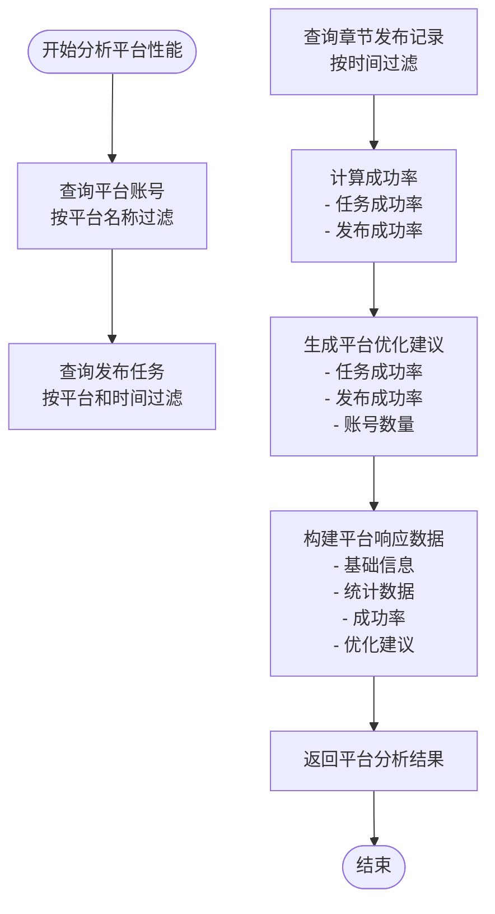
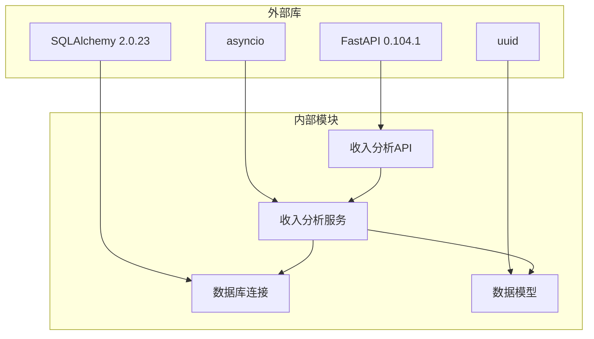
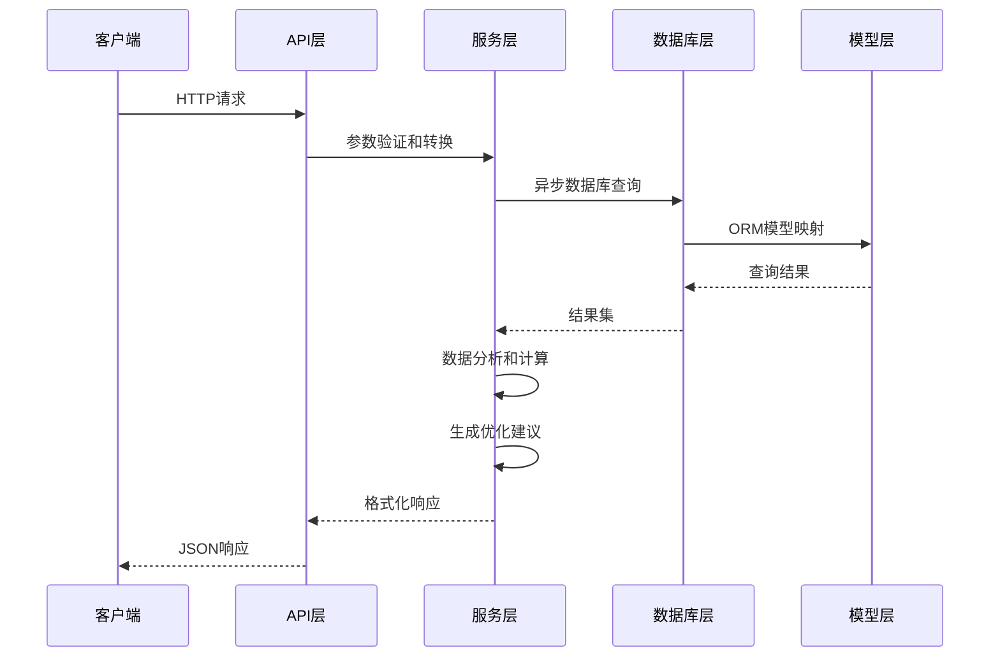

# 收入分析API

<cite>
**本文档引用的文件**
- [backend/api/v1/revenue.py](file://backend/api/v1/revenue.py)
- [backend/services/revenue_analysis_service.py](file://backend/services/revenue_analysis_service.py)
- [core/models/novel.py](file://core/models/novel.py)
- [core/models/chapter.py](file://core/models/chapter.py)
- [core/models/chapter_publish.py](file://core/models/chapter_publish.py)
- [core/models/platform_account.py](file://core/models/platform_account.py)
- [core/models/publish_task.py](file://core/models/publish_task.py)
- [core/models/token_usage.py](file://core/models/token_usage.py)
- [backend/main.py](file://backend/main.py)
</cite>

## 目录
1. [简介](#简介)
2. [项目结构](#项目结构)
3. [核心组件](#核心组件)
4. [架构概览](#架构概览)
5. [详细组件分析](#详细组件分析)
6. [依赖关系分析](#依赖关系分析)
7. [性能考虑](#性能考虑)
8. [故障排除指南](#故障排除指南)
9. [结论](#结论)

## 简介

收入分析API是小说生成系统中的核心财务分析模块，专注于提供全面的收入统计、分析和预测功能。该API通过整合小说创作、发布和收益相关的数据，为用户提供实时的财务洞察和业务决策支持。

当前实现主要包含以下核心功能：
- 小说性能分析：评估单个小说的创作和发布表现
- 平台性能分析：监控不同发布平台的运营状况
- 收益预测：基于历史数据生成未来收益预测
- 内容优化建议：提供创作和发布策略改进建议

## 项目结构

收入分析API位于后端服务的特定模块中，采用清晰的分层架构设计：



**图表来源**
- [backend/api/v1/revenue.py](file://backend/api/v1/revenue.py#L1-L81)
- [backend/services/revenue_analysis_service.py](file://backend/services/revenue_analysis_service.py#L20-L25)

**章节来源**
- [backend/api/v1/revenue.py](file://backend/api/v1/revenue.py#L1-L81)
- [backend/main.py](file://backend/main.py#L1-L53)

## 核心组件

### API路由器配置

收入分析API使用FastAPI框架构建，采用模块化的设计模式：

| 组件 | 描述 | URL路径 | HTTP方法 |
|------|------|---------|----------|
| 小说性能分析 | 分析单个小说的创作和发布表现 | `/revenue/novel-performance/{novel_id}` | GET |
| 平台性能分析 | 监控特定平台的运营状况 | `/revenue/platform-performance/{platform}` | GET |
| 收益预测 | 基于历史数据生成未来收益预测 | `/revenue/revenue-forecast/{novel_id}` | GET |
| 内容优化建议 | 提供创作和发布策略改进建议 | `/revenue/content-optimization/{novel_id}` | GET |

### 数据模型关系



**图表来源**
- [core/models/novel.py](file://core/models/novel.py#L37-L66)
- [core/models/chapter.py](file://core/models/chapter.py#L18-L45)
- [core/models/publish_task.py](file://core/models/publish_task.py#L29-L51)
- [core/models/platform_account.py](file://core/models/platform_account.py#L21-L38)
- [core/models/chapter_publish.py](file://core/models/chapter_publish.py#L21-L39)
- [core/models/token_usage.py](file://core/models/token_usage.py#L11-L25)

**章节来源**
- [core/models/novel.py](file://core/models/novel.py#L1-L66)
- [core/models/chapter.py](file://core/models/chapter.py#L1-L45)
- [core/models/publish_task.py](file://core/models/publish_task.py#L1-L51)
- [core/models/platform_account.py](file://core/models/platform_account.py#L1-L38)
- [core/models/chapter_publish.py](file://core/models/chapter_publish.py#L1-L39)
- [core/models/token_usage.py](file://core/models/token_usage.py#L1-L25)

## 架构概览

收入分析API采用经典的三层架构设计，确保了良好的可维护性和扩展性：



**图表来源**
- [backend/api/v1/revenue.py](file://backend/api/v1/revenue.py#L13-L28)
- [backend/services/revenue_analysis_service.py](file://backend/services/revenue_analysis_service.py#L26-L149)

## 详细组件分析

### 收入分析服务类

RevenueAnalysisService是整个收入分析API的核心组件，负责处理所有业务逻辑和数据计算：



**图表来源**
- [backend/services/revenue_analysis_service.py](file://backend/services/revenue_analysis_service.py#L20-L25)
- [core/models/novel.py](file://core/models/novel.py#L37-L66)
- [core/models/chapter.py](file://core/models/chapter.py#L18-L45)
- [core/models/publish_task.py](file://core/models/publish_task.py#L29-L51)
- [core/models/platform_account.py](file://core/models/platform_account.py#L21-L38)
- [core/models/chapter_publish.py](file://core/models/chapter_publish.py#L21-L39)
- [core/models/token_usage.py](file://core/models/token_usage.py#L11-L25)

#### 小说性能分析流程



**图表来源**
- [backend/services/revenue_analysis_service.py](file://backend/services/revenue_analysis_service.py#L26-L149)

#### 平台性能分析流程



**图表来源**
- [backend/services/revenue_analysis_service.py](file://backend/services/revenue_analysis_service.py#L151-L222)

**章节来源**
- [backend/services/revenue_analysis_service.py](file://backend/services/revenue_analysis_service.py#L1-L451)

### API端点详细说明

#### 小说性能分析端点

**端点**: `GET /revenue/novel-performance/{novel_id}`
**描述**: 分析指定小说在指定天数内的性能表现

**请求参数**:
- `novel_id` (路径参数): 小说唯一标识符 (UUID格式)
- `days` (查询参数): 分析天数，默认值为30天

**响应格式**:
```json
{
  "success": true,
  "data": {
    "novel_id": "字符串形式的UUID",
    "novel_title": "小说标题",
    "analysis_period": "最近30天",
    "total_chapters": 15,
    "total_word_count": 15000,
    "publishing_statistics": {
      "total_publish_attempts": 10,
      "successful_publishes": 8,
      "failed_publishes": 2,
      "platform_distribution": {
        "起点": 3,
        "番茄小说": 7
      }
    },
    "cost_analysis": {
      "total_tokens_used": 50000,
      "total_cost": 25.50,
      "cost_per_chapter": 1.70
    },
    "performance_metrics": {
      "average_chapter_length": 1000.0,
      "publishing_success_rate": 80.0,
      "cost_efficiency": 588.24
    },
    "optimization_suggestions": ["建议1", "建议2"]
  }
}
```

#### 平台性能分析端点

**端点**: `GET /revenue/platform-performance/{platform}`
**描述**: 分析指定平台在指定天数内的性能表现

**请求参数**:
- `platform` (路径参数): 平台名称 (如: "起点", "番茄小说")
- `days` (查询参数): 分析天数，默认值为30天

**响应格式**:
```json
{
  "success": true,
  "data": {
    "platform": "起点",
    "analysis_period": "最近30天",
    "total_accounts": 2,
    "total_publish_tasks": 25,
    "successful_tasks": 20,
    "failed_tasks": 5,
    "total_chapter_publishes": 45,
    "successful_chapter_publishes": 36,
    "failed_chapter_publishes": 9,
    "publish_success_rate": 80.0,
    "task_success_rate": 80.0,
    "optimization_suggestions": ["建议1", "建议2"]
  }
}
```

#### 收益预测端点

**端点**: `GET /revenue/revenue-forecast/{novel_id}`
**描述**: 基于历史数据生成小说未来收益预测

**请求参数**:
- `novel_id` (路径参数): 小说唯一标识符 (UUID格式)
- `days` (查询参数): 预测天数，默认值为30天

**响应格式**:
```json
{
  "success": true,
  "data": {
    "novel_id": "字符串形式的UUID",
    "novel_title": "小说标题",
    "forecast_period": "未来30天",
    "historical_data": {
      "total_chapters": 15,
      "total_word_count": 15000,
      "total_cost": 25.50,
      "publishing_success_rate": 80.0
    },
    "forecast": {
      "expected_chapters": 15,
      "expected_word_count": 15000,
      "expected_cost": 25.50,
      "expected_revenue": 0,
      "expected_roi": 0
    },
    "optimization_tips": ["建议1", "建议2"]
  }
}
```

#### 内容优化建议端点

**端点**: `GET /revenue/content-optimization/{novel_id}`
**描述**: 为指定小说提供内容优化建议

**请求参数**:
- `novel_id` (路径参数): 小说唯一标识符 (UUID格式)

**响应格式**:
```json
{
  "success": true,
  "data": {
    "novel_id": "字符串形式的UUID",
    "novel_title": "小说标题",
    "genre": "都市",
    "total_chapters": 15,
    "average_chapter_length": 1000.0,
    "optimization_suggestions": ["建议1", "建议2"]
  }
}
```

**章节来源**
- [backend/api/v1/revenue.py](file://backend/api/v1/revenue.py#L1-L81)

## 依赖关系分析

### 外部依赖

收入分析API依赖于以下关键组件：



**图表来源**
- [backend/api/v1/revenue.py](file://backend/api/v1/revenue.py#L1-L10)
- [backend/services/revenue_analysis_service.py](file://backend/services/revenue_analysis_service.py#L1-L17)

### 数据流依赖



**图表来源**
- [backend/api/v1/revenue.py](file://backend/api/v1/revenue.py#L13-L28)
- [backend/services/revenue_analysis_service.py](file://backend/services/revenue_analysis_service.py#L26-L149)

**章节来源**
- [backend/api/v1/revenue.py](file://backend/api/v1/revenue.py#L1-L81)
- [backend/services/revenue_analysis_service.py](file://backend/services/revenue_analysis_service.py#L1-L451)

## 性能考虑

### 数据库查询优化

1. **索引策略**: 建议在以下字段上创建索引以提高查询性能
   - `novels.id` (主键)
   - `chapters.novel_id` (外键)
   - `publish_tasks.novel_id` (外键)
   - `chapter_publishes.chapter_id` (外键)
   - `token_usages.novel_id` (外键)

2. **查询优化**: 使用批量查询减少数据库往返次数
   - 合并相关查询到单个事务中
   - 使用适当的WHERE子句过滤数据

3. **缓存策略**: 对于频繁访问的静态数据考虑实现缓存机制

### 异步处理

收入分析API使用异步编程模式，具有以下优势：
- 非阻塞I/O操作
- 更好的资源利用率
- 支持高并发请求

### 错误处理

系统实现了多层次的错误处理机制：
- 输入参数验证
- 数据库连接异常处理
- 业务逻辑异常捕获
- 友好的错误响应格式

## 故障排除指南

### 常见问题及解决方案

| 问题类型 | 症状 | 可能原因 | 解决方案 |
|----------|------|----------|----------|
| 数据库连接失败 | 请求超时或连接错误 | 数据库服务不可用 | 检查数据库连接配置和网络连通性 |
| 小说不存在 | 返回"小说不存在"错误 | novel_id无效或不存在 | 验证小说ID的有效性 |
| 查询性能慢 | API响应时间过长 | 缺少必要的数据库索引 | 为常用查询字段创建索引 |
| 内存使用过高 | 服务内存占用持续增长 | 大数据集处理不当 | 实现分页查询和数据清理机制 |

### 调试技巧

1. **日志分析**: 启用详细的日志记录以追踪问题
2. **性能监控**: 使用数据库性能监控工具识别慢查询
3. **单元测试**: 编写针对关键业务逻辑的测试用例
4. **API测试**: 使用Postman或curl测试API端点的正确性

**章节来源**
- [backend/services/revenue_analysis_service.py](file://backend/services/revenue_analysis_service.py#L48-L51)
- [backend/api/v1/revenue.py](file://backend/api/v1/revenue.py#L25-L27)

## 结论

收入分析API为小说生成系统提供了完整的财务分析能力，通过整合创作、发布和收益数据，为用户提供了深入的业务洞察。当前实现已经涵盖了核心的收入分析功能，包括小说性能分析、平台性能监控、收益预测和内容优化建议。

未来可以考虑的功能扩展：
1. 添加更多收入统计和图表数据端点
2. 实现财务报表导出功能
3. 增强预测算法的准确性
4. 添加实时数据更新机制
5. 扩展多平台收入对比功能

该API的设计遵循了良好的软件工程原则，具有清晰的分层架构、完善的错误处理机制和可扩展的代码结构，为后续的功能扩展奠定了坚实的基础。