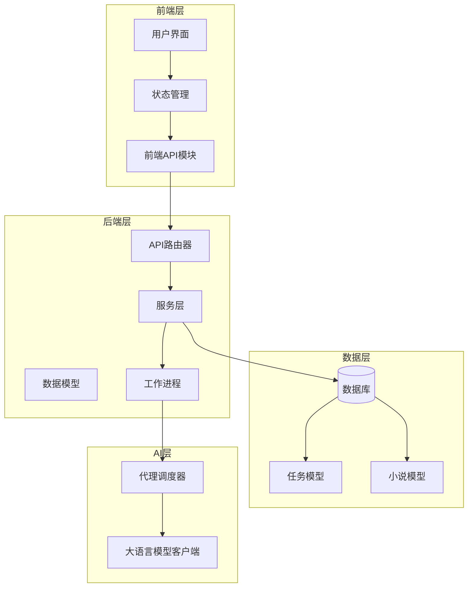
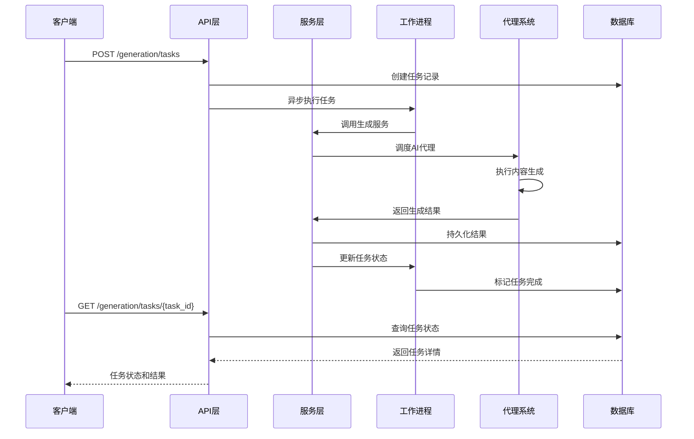
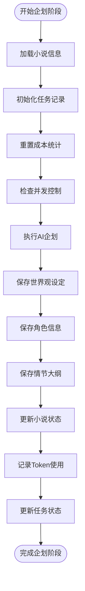
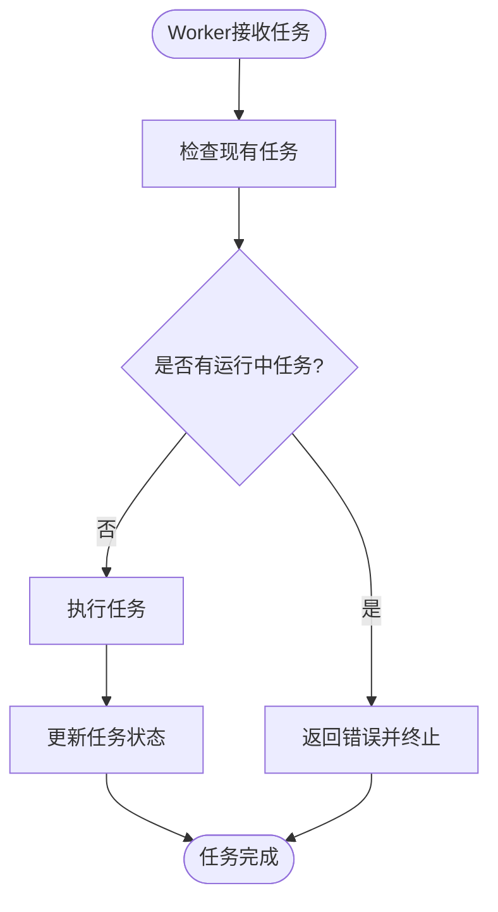
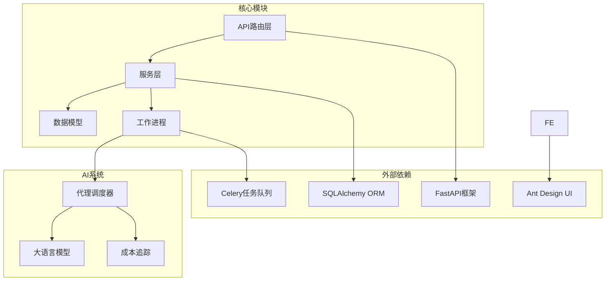

# 生成任务API

<cite>
**本文档引用的文件**
- [backend/api/v1/generation.py](file://backend/api/v1/generation.py)
- [backend/schemas/generation.py](file://backend/schemas/generation.py)
- [backend/services/generation_service.py](file://backend/services/generation_service.py)
- [core/models/generation_task.py](file://core/models/generation_task.py)
- [workers/generation_worker.py](file://workers/generation_worker.py)
- [frontend/src/api/generation.ts](file://frontend/src/api/generation.ts)
- [frontend/src/stores/useGenerationStore.ts](file://frontend/src/stores/useGenerationStore.ts)
- [frontend/src/utils/constants.ts](file://frontend/src/utils/constants.ts)
- [agents/agent_scheduler.py](file://agents/agent_scheduler.py)
- [llm/qwen_client.py](file://llm/qwen_client.py)
- [backend/main.py](file://backend/main.py)
</cite>

## 目录
1. [简介](#简介)
2. [项目结构](#项目结构)
3. [核心组件](#核心组件)
4. [架构概览](#架构概览)
5. [详细组件分析](#详细组件分析)
6. [依赖关系分析](#依赖关系分析)
7. [性能考虑](#性能考虑)
8. [故障排除指南](#故障排除指南)
9. [结论](#结论)
10. [附录](#附录)

## 简介
生成任务API是小说生成系统的核心接口，负责管理AI内容生成任务的完整生命周期。该API支持三种主要任务类型：企划阶段（世界观、角色、大纲）、单章写作和批量写作，为用户提供从创意构思到内容产出的全流程自动化服务。

**重要更新**：系统现已实现企划任务并发控制机制，在API层、服务层和Worker层都实现了防止重复规划任务的验证逻辑，增强了任务创建时的冲突检测和错误处理能力。

## 项目结构
生成任务API位于后端的API路由层，采用分层架构设计，确保业务逻辑与接口层的清晰分离。



**图表来源**
- [backend/api/v1/generation.py:20-20](file://backend/api/v1/generation.py#L20-L20)
- [backend/services/generation_service.py:27-35](file://backend/services/generation_service.py#L27-L35)
- [workers/generation_worker.py:12-19](file://workers/generation_worker.py#L12-L19)

**章节来源**
- [backend/main.py:8-33](file://backend/main.py#L8-L33)
- [backend/api/v1/generation.py:1-20](file://backend/api/v1/generation.py#L1-L20)

## 核心组件
生成任务API由多个核心组件构成，每个组件都有明确的职责和功能边界。

### 任务类型枚举
系统定义了四种主要的任务类型，每种类型对应不同的生成流程：

- **planning（企划阶段）**：执行世界观、角色、情节大纲的生成
- **writing（单章写作）**：生成单个章节的内容
- **batch_writing（批量写作）**：批量生成多个章节
- **editing（编辑任务）**：对现有内容进行编辑和优化

### 任务状态管理
任务状态采用五状态机设计，确保任务生命周期的完整追踪：

- **pending（等待中）**：任务已创建但尚未开始执行
- **running（运行中）**：任务正在执行过程中
- **completed（已完成）**：任务成功执行完毕
- **failed（失败）**：任务执行过程中发生错误
- **cancelled（已取消）**：用户主动取消的任务

### 数据模型结构
任务数据模型包含完整的元数据和结果存储能力：

- **基础信息**：任务ID、小说关联、类型标识
- **状态信息**：当前状态、开始/完成时间
- **配置信息**：输入参数、阶段标识
- **结果信息**：输出数据、错误详情、成本统计
- **统计信息**：Token使用量、费用计算

**章节来源**
- [core/models/generation_task.py:12-25](file://core/models/generation_task.py#L12-L25)
- [backend/schemas/generation.py:8-36](file://backend/schemas/generation.py#L8-L36)

## 架构概览
生成任务API采用异步架构设计，结合后台任务队列实现高并发处理能力。



**图表来源**
- [backend/api/v1/generation.py:23-103](file://backend/api/v1/generation.py#L23-L103)
- [backend/services/generation_service.py:36-204](file://backend/services/generation_service.py#L36-L204)
- [workers/generation_worker.py:21-62](file://workers/generation_worker.py#L21-L62)

## 详细组件分析

### API端点设计
生成任务API提供了四个核心端点，覆盖任务生命周期的各个阶段。

#### POST /generation/tasks - 创建生成任务
该端点负责创建新的生成任务，支持三种任务类型的差异化处理。

**企划任务并发控制**：
系统在API层实现了严格的企划任务并发控制机制，防止同一小说同时存在多个企划任务。

**请求参数规范**：
- `novel_id`：目标小说的唯一标识符
- `task_type`：任务类型（planning/writing/batch_writing）
- `phase`：可选的生成阶段标识
- `input_data`：任务特定的输入参数
- `from_chapter`：批量写作起始章节号
- `to_chapter`：批量写作结束章节号
- `volume_number`：卷号标识，默认为1

**并发控制验证**：
- 检查同一小说是否已有处于pending或running状态的企划任务
- 如发现重复任务，立即返回400错误并提示具体任务ID
- 确保每个小说在同一时间只能有一个活跃的企划任务

**批量写作参数验证**：
- 必须同时提供起始和结束章节号
- 起始章节号不能大于结束章节号
- 自动将章节范围注入到输入数据中

**响应数据结构**：
- 返回完整的任务对象，包含所有元数据
- 立即返回任务ID供后续查询使用

#### GET /generation/tasks - 获取任务列表
支持多维度的任务查询和过滤功能。

**查询参数**：
- `novel_id`：按小说ID筛选任务
- `status`：按任务状态过滤
- `page`：页码，默认1
- `page_size`：每页数量，默认10，最大100

**分页机制**：
- 支持大数据量的任务列表浏览
- 提供总记录数以便前端显示
- 按创建时间倒序排列

#### GET /generation/tasks/{task_id} - 查询任务详情
实时获取任务的最新状态和结果信息。

**响应内容**：
- 任务基础信息和状态
- 输入输出数据的完整描述
- Token使用量和成本统计
- 错误信息（如有）

#### POST /generation/tasks/{task_id}/cancel - 取消任务
提供任务取消功能，支持在执行过程中的中断操作。

**取消规则**：
- 仅对处于运行中状态的任务有效
- 终态任务（已完成/失败/已取消）不可取消
- 立即更新数据库状态并返回确认信息

**章节来源**
- [backend/api/v1/generation.py:23-171](file://backend/api/v1/generation.py#L23-L171)

### 服务层实现
服务层负责协调AI代理系统和数据库操作，确保任务的正确执行和数据持久化。

#### 企划阶段执行流程
企划阶段是整个生成流程的起点，负责构建完整的小说基础框架。



**图表来源**
- [backend/services/generation_service.py:36-196](file://backend/services/generation_service.py#L36-L196)

**并发控制增强**：
服务层实现了双重并发控制验证：
- 排除当前任务本身，避免自检导致的误判
- 在任务执行期间再次检查是否有其他任务开始
- 如发现并发冲突，立即抛出异常并终止执行

**执行特点**：
- 自动检测和处理LLM返回的非标准数据结构
- 将复杂的JSON数据映射到具体的数据模型
- 实现成本追踪和统计信息收集
- 更新相关实体的状态和统计数据

#### 单章写作执行流程
单章写作基于完整的小说上下文生成高质量的内容。

**上下文构建**：
- 整合世界观、角色、情节大纲等背景信息
- 包含前几章的内容摘要以保持连贯性
- 支持章节计划和质量评估指标

**内容生成**：
- 利用AI代理系统生成完整章节内容
- 计算字数统计和质量评分
- 保存章节草稿状态

#### 批量写作执行流程
批量写作支持连续章节的高效生成。

**批量处理策略**：
- 逐章执行写作任务
- 部分失败不影响整体进度
- 实时更新批量进度统计

**错误处理机制**：
- 单个章节失败不影响其他章节
- 记录详细的失败信息
- 提供部分成功的处理方案

**章节来源**
- [backend/services/generation_service.py:206-563](file://backend/services/generation_service.py#L206-L563)

### Worker层并发控制
Worker层实现了最终的并发控制保障，确保即使在分布式环境下也不会出现重复执行。

#### 任务执行流程


**图表来源**
- [workers/generation_worker.py:21-51](file://workers/generation_worker.py#L21-L51)

**Worker并发控制**：
- 在任务执行前再次检查数据库中的并发状态
- 使用相同的查询条件确保一致性
- 如发现冲突，立即返回错误信息
- 防止分布式环境下的竞态条件

**章节来源**
- [workers/generation_worker.py:21-51](file://workers/generation_worker.py#L21-L51)

### 前端集成
前端提供了完整的API集成和状态管理功能。

#### API客户端封装
前端API模块提供了简洁的函数式接口：

- `createGenerationTask()`：创建新任务
- `getGenerationTasks()`：获取任务列表
- `getGenerationTask()`：查询单个任务
- `cancelGenerationTask()`：取消任务

#### 状态管理
使用Zustand状态管理库实现全局状态同步：

- 自动刷新任务列表
- 实时更新单个任务状态
- 错误处理和状态恢复

#### 用户界面集成
前端组件使用统一的状态映射：

- 任务状态标签显示
- 彩色状态指示器
- 响应式布局适配

**章节来源**
- [frontend/src/api/generation.ts:1-35](file://frontend/src/api/generation.ts#L1-L35)
- [frontend/src/stores/useGenerationStore.ts:1-41](file://frontend/src/stores/useGenerationStore.ts#L1-L41)
- [frontend/src/utils/constants.ts:14-20](file://frontend/src/utils/constants.ts#L14-L20)

## 依赖关系分析



**图表来源**
- [backend/api/v1/generation.py:6-18](file://backend/api/v1/generation.py#L6-L18)
- [backend/services/generation_service.py:12-24](file://backend/services/generation_service.py#L12-L24)
- [workers/generation_worker.py:7-9](file://workers/generation_worker.py#L7-L9)

### 关键依赖关系
- **API层依赖**：FastAPI提供路由和中间件支持
- **服务层依赖**：SQLAlchemy处理数据库操作，Celery管理异步任务
- **AI层依赖**：代理调度器协调多个AI代理的工作
- **前端依赖**：Ant Design提供UI组件，Zustand管理应用状态

**章节来源**
- [backend/api/v1/generation.py:1-18](file://backend/api/v1/generation.py#L1-L18)
- [backend/services/generation_service.py:1-24](file://backend/services/generation_service.py#L1-L24)

## 性能考虑
生成任务API在设计时充分考虑了性能优化和扩展性需求。

### 异步处理架构
- **非阻塞I/O**：使用异步数据库连接避免阻塞
- **后台任务**：通过Celery实现任务的异步执行
- **并发控制**：在多层实现防止重复执行

### 缓存和优化策略
- **数据库查询优化**：使用selectinload减少N+1查询问题
- **批量操作**：批量写作场景下的批量数据库操作
- **内存管理**：及时清理临时数据和连接

### 扩展性设计
- **水平扩展**：Celery worker可以水平扩展
- **负载均衡**：多个worker实例分担任务负载
- **数据库连接池**：高效的数据库连接管理

## 故障排除指南

### 常见错误类型和解决方案

#### 任务创建错误
**小说不存在**：当指定的novel_id不存在时，API会返回404错误
**参数验证失败**：批量写作缺少必要参数或参数值无效时返回400错误
**企划任务并发冲突**：同一小说已有运行中的企划任务时返回400错误，包含具体任务ID

#### 任务执行错误
**AI服务异常**：LLM客户端实现指数退避重试机制
**数据库连接问题**：自动重连和事务回滚
**代理系统错误**：代理状态监控和自动恢复

#### 任务取消错误
**状态不支持**：对已完成或已取消的任务尝试取消会返回400错误
**并发冲突**：使用数据库事务确保状态一致性

### 并发控制机制
系统在三层实现了并发控制，确保任务执行的一致性和可靠性：

**API层并发控制**：
- 创建任务时检查数据库中的并发状态
- 防止重复创建相同类型的任务
- 提供详细的错误信息

**服务层并发控制**：
- 任务执行前再次验证并发状态
- 排除当前任务本身进行检查
- 防止服务层内部的并发冲突

**Worker层并发控制**：
- 分布式环境下的最终一致性保障
- 防止多个worker实例同时执行相同任务
- 提供统一的错误处理机制

### 监控和日志
系统提供了全面的监控和日志记录功能：

- **任务状态监控**：实时跟踪任务执行状态
- **成本统计**：详细的Token使用和费用记录
- **错误分析**：自动化的错误模式识别
- **性能指标**：任务执行时间和成功率统计

**章节来源**
- [agents/agent_scheduler.py:420-441](file://agents/agent_scheduler.py#L420-L441)
- [llm/qwen_client.py:140-161](file://llm/qwen_client.py#L140-L161)

## 结论
生成任务API为小说生成系统提供了完整、可靠的任务管理解决方案。通过清晰的架构设计、完善的错误处理机制和优秀的用户体验，该API能够满足从个人创作者到专业出版机构的各种需求。

**重要更新**：新增的企划任务并发控制机制显著提升了系统的稳定性和可靠性，确保每个小说在同一时间只能有一个活跃的企划任务，避免了资源竞争和数据不一致的问题。

系统的主要优势包括：
- **完整的生命周期管理**：从任务创建到结果获取的全流程支持
- **灵活的任务类型**：支持不同阶段和规模的生成需求
- **强大的并发控制**：多层并发保障机制确保任务执行的一致性
- **优秀的扩展性**：基于异步架构和分布式任务处理
- **优秀的用户体验**：直观的前端界面和实时状态反馈

## 附录

### API调用示例

#### 创建企划任务
```javascript
// 创建世界观、角色、大纲生成任务
const taskData = {
  novel_id: "123e4567-e89b-12d3-a456-426614174000",
  task_type: "planning",
  phase: "planning"
};

const response = await createGenerationTask(taskData);
console.log(`任务ID: ${response.id}`);
```

#### 创建单章写作任务
```javascript
// 创建单个章节的写作任务
const taskData = {
  novel_id: "123e4567-e89b-12d3-a456-426614174000",
  task_type: "writing",
  input_data: {
    chapter_number: 5,
    volume_number: 1
  }
};

const response = await createGenerationTask(taskData);
```

#### 创建批量写作任务
```javascript
// 创建批量章节写作任务
const taskData = {
  novel_id: "123e4567-e89b-12d3-a456-426614174000",
  task_type: "batch_writing",
  from_chapter: 1,
  to_chapter: 10,
  volume_number: 1
};

const response = await createGenerationTask(taskData);
```

#### 查询任务状态
```javascript
// 获取任务详细信息
const task = await getGenerationTask("task-id");
console.log(`任务状态: ${task.status}`);
console.log(`进度: ${task.output_data.progress || 'N/A'}`);
```

#### 取消进行中的任务
```javascript
// 取消正在执行的任务
try {
  const result = await cancelGenerationTask("task-id");
  console.log(result.message);
} catch (error) {
  console.error("取消失败:", error.message);
}
```

### 任务类型详细说明

#### 企划阶段（planning）
- **目标**：生成小说的基础框架
- **输出**：世界观设定、角色档案、情节大纲
- **适用场景**：新小说创作的初始阶段
- **并发控制**：同一小说只能有一个活跃的企划任务
- **典型参数**：小说题材、风格偏好、长度要求

#### 单章写作（writing）
- **目标**：生成单个章节的完整内容
- **输出**：章节标题、正文内容、质量评分
- **适用场景**：日常内容更新和定期创作
- **关键参数**：章节编号、卷号、上下文信息

#### 批量写作（batch_writing）
- **目标**：一次性生成多个章节
- **输出**：批量生成报告和统计信息
- **适用场景**：快速填充内容和集中创作
- **关键参数**：起始/结束章节号、卷号范围

### 状态枚举详解

#### 任务状态（TaskStatus）
- **pending**：任务已创建，等待执行
- **running**：任务正在执行中
- **completed**：任务成功完成
- **failed**：任务执行失败
- **cancelled**：任务被用户取消

#### 任务类型（TaskType）
- **planning**：企划阶段任务
- **writing**：写作任务
- **editing**：编辑任务
- **batch_writing**：批量写作任务

### 错误处理机制

#### 并发控制错误
系统实现了多层并发控制，防止重复规划任务的创建和执行：
- **API层**：创建任务时检查数据库状态
- **服务层**：任务执行前再次验证
- **Worker层**：分布式环境下的最终保障

#### 自动重试策略
系统实现了智能的错误重试机制：
- **指数退避**：每次重试间隔呈指数增长
- **最大重试次数**：防止无限重试造成资源浪费
- **错误分类**：区分可重试和不可重试错误

#### 监控和告警
- **实时监控**：任务执行状态的实时跟踪
- **性能监控**：执行时间和成功率统计
- **错误监控**：错误模式识别和趋势分析
- **告警机制**：异常情况的自动通知

**章节来源**
- [backend/api/v1/generation.py:48-64](file://backend/api/v1/generation.py#L48-L64)
- [backend/services/generation_service.py:87-100](file://backend/services/generation_service.py#L87-L100)
- [workers/generation_worker.py:29-42](file://workers/generation_worker.py#L29-L42)
- [llm/qwen_client.py:140-161](file://llm/qwen_client.py#L140-L161)