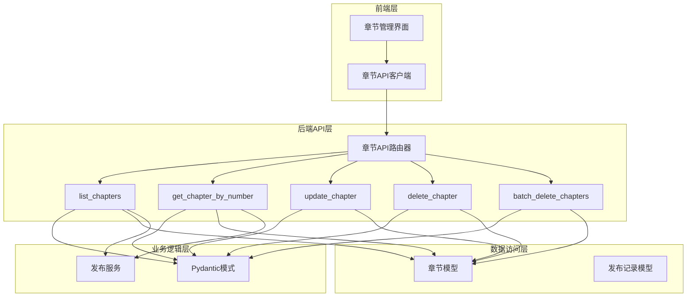
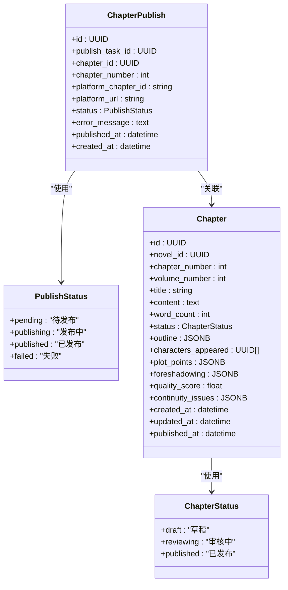
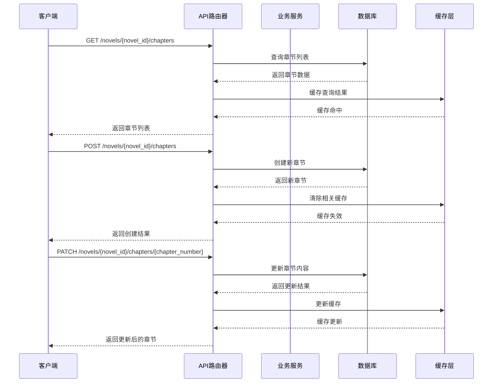
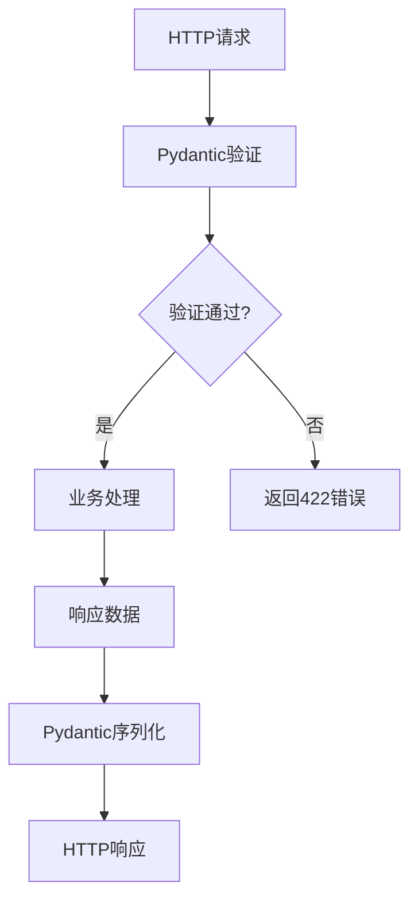
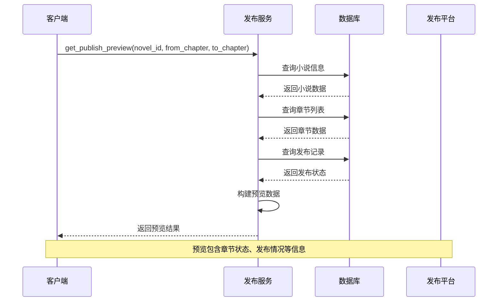
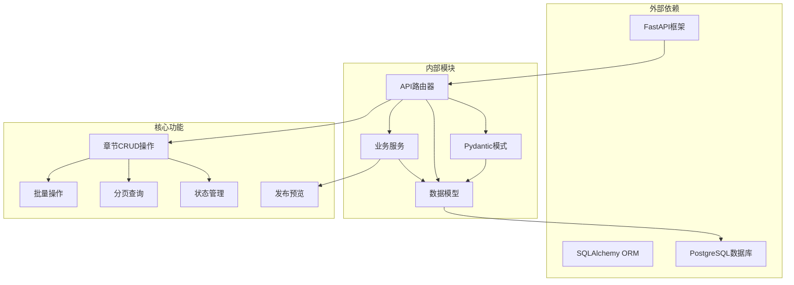

# 章节管理API

<cite>
**本文档引用的文件**
- [backend/api/v1/chapters.py](file://backend/api/v1/chapters.py)
- [core/models/chapter.py](file://core/models/chapter.py)
- [core/models/chapter_publish.py](file://core/models/chapter_publish.py)
- [backend/schemas/outline.py](file://backend/schemas/outline.py)
- [backend/services/publishing_service.py](file://backend/services/publishing_service.py)
- [frontend/src/api/chapters.ts](file://frontend/src/api/chapters.ts)
- [frontend/src/utils/constants.ts](file://frontend/src/utils/constants.ts)
</cite>

## 目录
1. [简介](#简介)
2. [项目结构](#项目结构)
3. [核心组件](#核心组件)
4. [架构概览](#架构概览)
5. [详细组件分析](#详细组件分析)
6. [依赖关系分析](#依赖关系分析)
7. [性能考虑](#性能考虑)
8. [故障排除指南](#故障排除指南)
9. [结论](#结论)

## 简介

章节管理API是小说创作系统的核心功能模块，提供了完整的章节生命周期管理能力。该API支持章节的创建、查询、更新、删除以及批量操作，涵盖了从草稿到发布的完整工作流程。系统采用FastAPI框架构建，基于异步数据库连接，确保了高并发场景下的性能表现。

章节管理功能包括：
- **章节内容管理**：支持章节标题、正文内容、字数统计等功能
- **发布状态控制**：草稿、审核中、已发布三种状态管理
- **章节排序功能**：按章节号进行有序排列
- **批量操作支持**：支持批量删除等批量处理功能
- **发布预览功能**：提供发布前的内容预览和状态检查

## 项目结构

章节管理API位于后端的API路由层，与数据模型和业务逻辑紧密集成：

**图表来源**
- [backend/api/v1/chapters.py](file://backend/api/v1/chapters.py#L26-L200)
- [backend/schemas/outline.py](file://backend/schemas/outline.py#L64-L99)
- [core/models/chapter.py](file://core/models/chapter.py#L18-L45)

**章节来源**
- [backend/api/v1/chapters.py](file://backend/api/v1/chapters.py#L1-L200)
- [backend/schemas/outline.py](file://backend/schemas/outline.py#L1-L99)

## 核心组件

### 章节状态枚举

系统定义了完整的章节状态管理体系，确保创作流程的规范性：

**图表来源**
- [core/models/chapter.py](file://core/models/chapter.py#L12-L16)
- [core/models/chapter_publish.py](file://core/models/chapter_publish.py#L13-L19)
- [core/models/chapter.py](file://core/models/chapter.py#L18-L45)
- [core/models/chapter_publish.py](file://core/models/chapter_publish.py#L21-L39)

### 数据模型设计

章节模型采用了丰富的字段设计，支持复杂的创作需求：

| 字段名 | 类型 | 描述 | 约束 |
|--------|------|------|------|
| id | UUID | 章节唯一标识 | 主键 |
| novel_id | UUID | 小说外键 | 外键约束 |
| chapter_number | Integer | 章节号 | 唯一索引 |
| volume_number | Integer | 卷号 | 默认1 |
| title | String | 章节标题 | 最大200字符 |
| content | Text | 章节内容 | 可为空 |
| word_count | Integer | 字数统计 | 默认0 |
| status | Enum | 章节状态 | draft/reviewing/published |
| outline | JSONB | 章节大纲 | 默认空对象 |
| characters_appeared | Array(UUID) | 出场角色 | 默认空数组 |
| plot_points | JSONB | 剧情要点 | 默认空数组 |
| foreshadowing | JSONB | 预示内容 | 默认空数组 |
| quality_score | Float | 质量评分 | 可为空 |
| continuity_issues | JSONB | 连贯性问题 | 默认空数组 |
| created_at | DateTime | 创建时间 | 自动设置 |
| updated_at | DateTime | 更新时间 | 自动更新 |
| published_at | DateTime | 发布时间 | 可为空 |

**章节来源**
- [core/models/chapter.py](file://core/models/chapter.py#L18-L45)

## 架构概览

章节管理API采用分层架构设计，确保了良好的可维护性和扩展性：

**图表来源**
- [backend/api/v1/chapters.py](file://backend/api/v1/chapters.py#L29-L167)
- [backend/schemas/outline.py](file://backend/schemas/outline.py#L64-L99)

## 详细组件分析

### API端点设计

章节管理API提供了完整的RESTful接口设计，遵循HTTP标准和最佳实践：

#### GET /novels/{novel_id}/chapters
**功能**：获取指定小说的章节列表（支持分页和筛选）

**路径参数**：
- novel_id: UUID - 小说唯一标识

**查询参数**：
- page: int - 页码，默认1，最小1
- page_size: int - 每页数量，默认20，范围1-100
- status: string - 章节状态筛选（draft/reviewing/published）

**响应**：ChapterListResponse
- items: 章节列表
- total: 总记录数
- page: 当前页码
- page_size: 每页大小

**章节来源**
- [backend/api/v1/chapters.py](file://backend/api/v1/chapters.py#L29-L76)
- [backend/schemas/outline.py](file://backend/schemas/outline.py#L95-L99)

#### GET /novels/{novel_id}/chapters/{chapter_number}
**功能**：根据章节号获取章节详情

**路径参数**：
- novel_id: UUID - 小说唯一标识
- chapter_number: int - 章节号

**响应**：ChapterResponse
- 包含章节的所有字段信息

**错误处理**：
- 404: 章节不存在时返回错误

**章节来源**
- [backend/api/v1/chapters.py](file://backend/api/v1/chapters.py#L79-L101)
- [backend/schemas/outline.py](file://backend/schemas/outline.py#L78-L92)

#### PATCH /novels/{novel_id}/chapters/{chapter_number}
**功能**：更新章节内容（支持部分更新）

**路径参数****：
- novel_id: UUID - 小说唯一标识
- chapter_number: int - 章节号

**请求体**：ChapterUpdate
- title: string - 章节标题（可选）
- content: string - 章节内容（可选）
- status: string - 章节状态（可选）

**响应**：ChapterResponse
- 更新后的章节信息

**自动功能**：
- 内容更新时自动计算字数
- 支持部分字段更新

**章节来源**
- [backend/api/v1/chapters.py](file://backend/api/v1/chapters.py#L104-L138)
- [backend/schemas/outline.py](file://backend/schemas/outline.py#L71-L76)

#### DELETE /novels/{novel_id}/chapters/{chapter_number}
**功能**：删除指定章节

**路径参数**：
- novel_id: UUID - 小说唯一标识
- chapter_number: int - 章节号

**响应**：204 No Content

**错误处理**：
- 404: 章节不存在时返回错误

**章节来源**
- [backend/api/v1/chapters.py](file://backend/api/v1/chapters.py#L141-L167)

#### POST /novels/{novel_id}/chapters/batch-delete
**功能**：批量删除章节

**路径参数**：
- novel_id: UUID - 小说唯一标识

**请求体**：BatchDeleteRequest
- chapter_numbers: int[] - 章节号列表

**响应**：204 No Content

**章节来源**
- [backend/api/v1/chapters.py](file://backend/api/v1/chapters.py#L170-L200)

### 数据验证和转换

系统使用Pydantic模型进行数据验证和序列化：

**图表来源**
- [backend/schemas/outline.py](file://backend/schemas/outline.py#L64-L99)

**章节来源**
- [backend/schemas/outline.py](file://backend/schemas/outline.py#L1-L99)

### 发布预览功能

发布服务提供了章节发布前的预览能力：

**图表来源**
- [backend/services/publishing_service.py](file://backend/services/publishing_service.py#L212-L275)

**章节来源**
- [backend/services/publishing_service.py](file://backend/services/publishing_service.py#L212-L275)

## 依赖关系分析

章节管理API的依赖关系体现了清晰的分层架构：

**图表来源**
- [backend/api/v1/chapters.py](file://backend/api/v1/chapters.py#L1-L200)
- [core/models/chapter.py](file://core/models/chapter.py#L1-L45)
- [backend/services/publishing_service.py](file://backend/services/publishing_service.py#L1-L275)

**章节来源**
- [backend/api/v1/chapters.py](file://backend/api/v1/chapters.py#L1-L200)
- [core/models/chapter.py](file://core/models/chapter.py#L1-L45)
- [backend/services/publishing_service.py](file://backend/services/publishing_service.py#L1-L275)

## 性能考虑

章节管理API在设计时充分考虑了性能优化：

### 查询优化
- 使用索引优化章节号查询
- 分页查询避免大数据集传输
- 条件筛选减少不必要的数据加载

### 缓存策略
- 列表查询结果缓存
- 章节详情缓存
- 发布状态缓存

### 异步处理
- 使用异步数据库连接
- 非阻塞I/O操作
- 并发请求处理

### 数据库优化
- 合理的数据类型选择
- 适当的索引设计
- 连接池管理

## 故障排除指南

### 常见错误处理

| 错误码 | 错误类型 | 可能原因 | 解决方案 |
|--------|----------|----------|----------|
| 404 | Not Found | 小说或章节不存在 | 检查ID有效性，确认资源存在 |
| 422 | Validation Error | 请求数据格式不正确 | 检查字段类型和格式要求 |
| 500 | Internal Server Error | 服务器内部错误 | 查看服务器日志，检查数据库连接 |

### 状态管理问题

**草稿状态问题**：
- 确保章节内容完整后再提交审核
- 检查字数统计是否正确更新

**发布状态异常**：
- 检查发布服务配置
- 验证平台账号有效性
- 查看发布记录状态

### 性能问题诊断

**查询缓慢**：
- 检查数据库索引是否完整
- 优化分页参数设置
- 分析查询执行计划

**内存泄漏**：
- 检查异步任务清理
- 验证数据库连接池配置
- 监控内存使用情况

**章节来源**
- [backend/api/v1/chapters.py](file://backend/api/v1/chapters.py#L49-L50)
- [backend/api/v1/chapters.py](file://backend/api/v1/chapters.py#L95-L99)

## 结论

章节管理API为小说创作系统提供了完整而强大的章节管理能力。通过清晰的API设计、完善的错误处理机制和高效的性能优化，该系统能够满足从小说到发布的完整创作流程需求。

主要优势包括：
- **完整的生命周期管理**：从草稿到发布的全流程支持
- **灵活的状态控制**：支持多种状态组合和转换
- **高效的数据处理**：异步架构确保高并发性能
- **丰富的功能特性**：支持分页、筛选、批量操作等高级功能
- **完善的错误处理**：提供详细的错误信息和处理建议

未来可以考虑的功能增强：
- 章节版本管理
- 内容审核流程
- 发布任务队列
- 实时协作功能