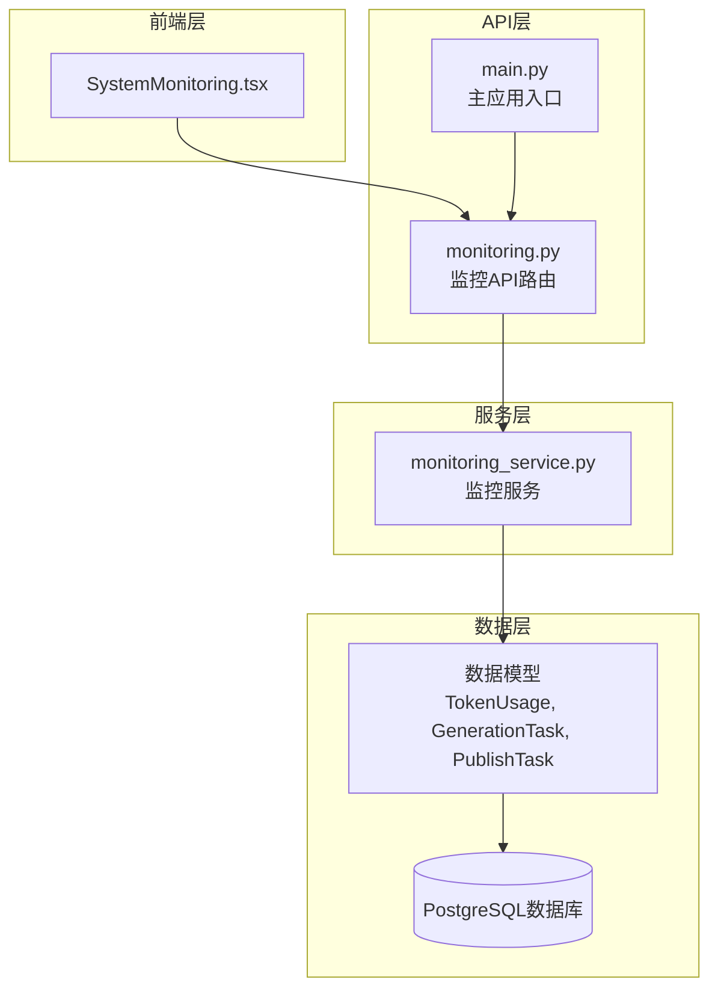
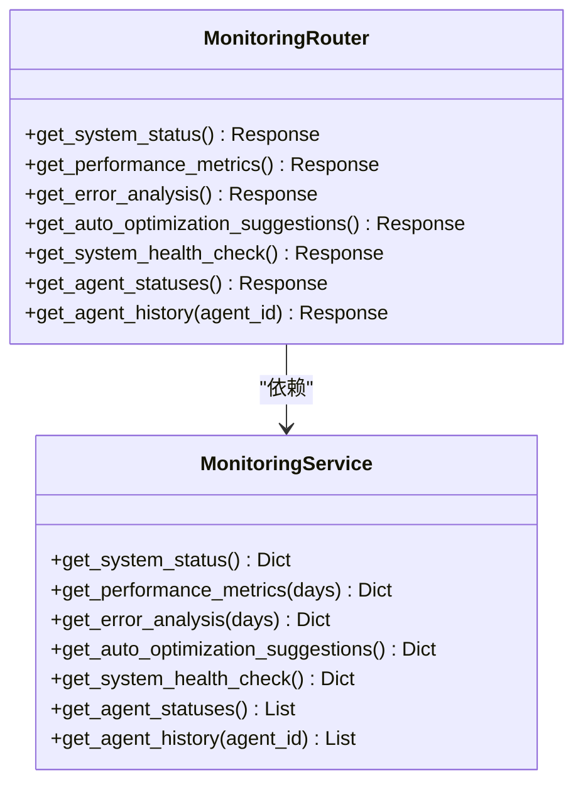
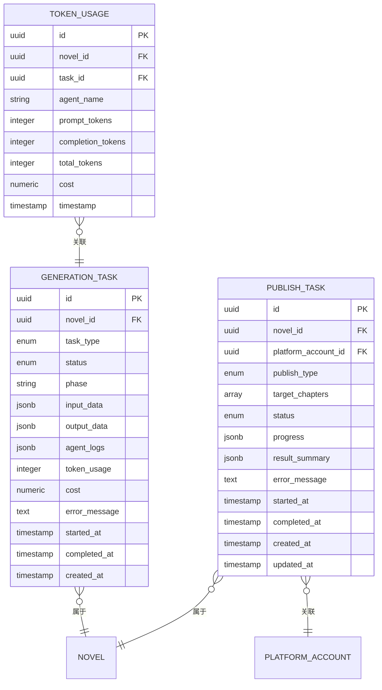
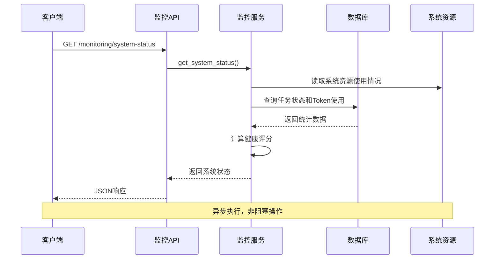
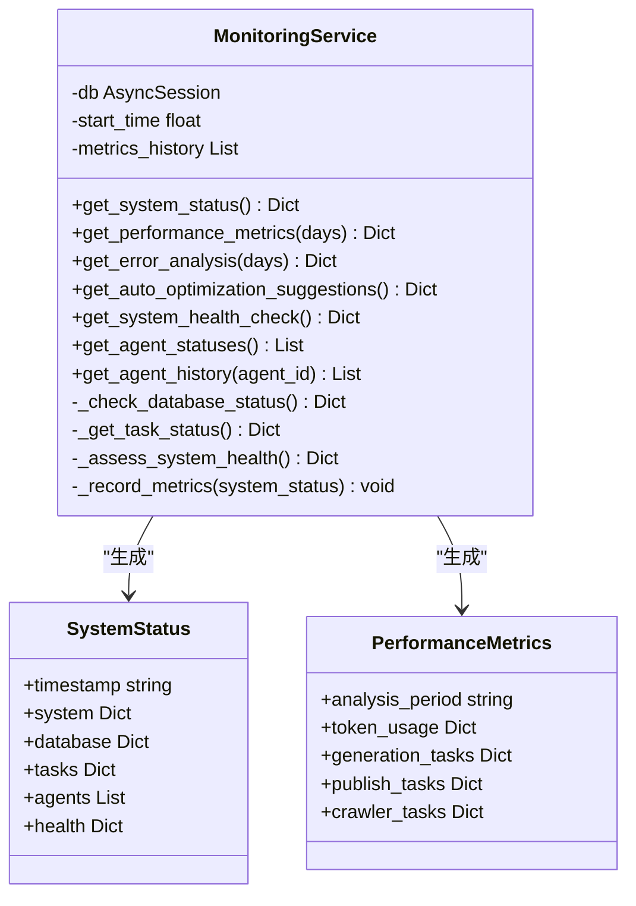
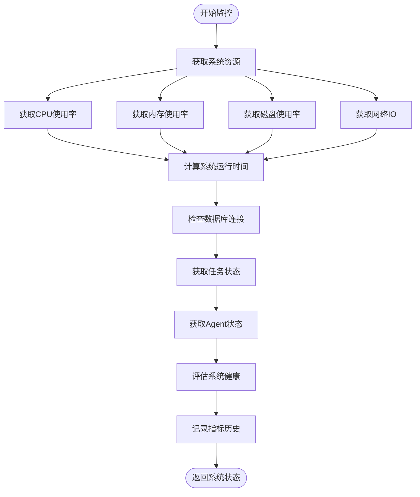
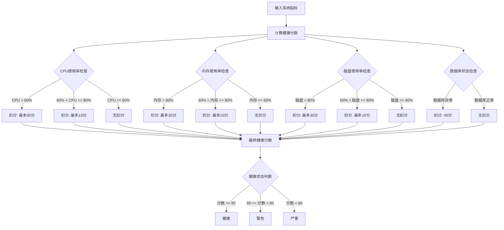
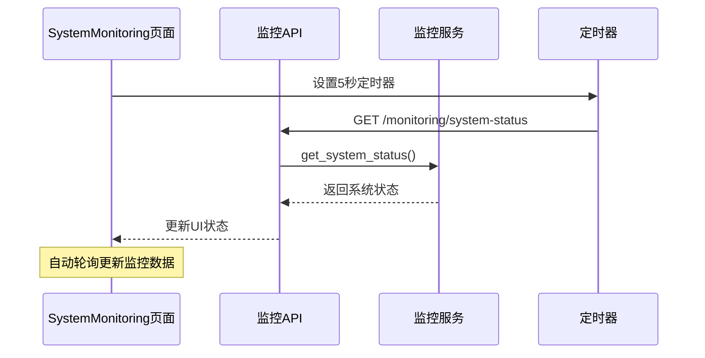
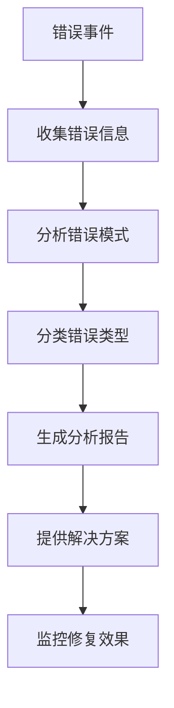

# 系统监控API

<cite>
**本文档引用的文件**
- [backend/api/v1/monitoring.py](file://backend/api/v1/monitoring.py)
- [backend/services/monitoring_service.py](file://backend/services/monitoring_service.py)
- [backend/api/v1/__init__.py](file://backend/api/v1/__init__.py)
- [backend/main.py](file://backend/main.py)
- [frontend/src/pages/SystemMonitoring.tsx](file://frontend/src/pages/SystemMonitoring.tsx)
- [core/models/token_usage.py](file://core/models/token_usage.py)
- [core/models/generation_task.py](file://core/models/generation_task.py)
- [core/models/publish_task.py](file://core/models/publish_task.py)
</cite>

## 目录
1. [简介](#简介)
2. [项目结构](#项目结构)
3. [核心组件](#核心组件)
4. [架构概览](#架构概览)
5. [详细组件分析](#详细组件分析)
6. [监控指标定义](#监控指标定义)
7. [API接口规范](#api接口规范)
8. [使用示例与最佳实践](#使用示例与最佳实践)
9. [故障排查指南](#故障排查指南)
10. [性能优化建议](#性能优化建议)
11. [结论](#结论)

## 简介

本系统监控API提供了全面的系统健康检查和性能监控能力，专为小说生成系统设计。该API支持实时系统状态监控、性能指标分析、错误诊断和自动调优建议等功能，帮助运维人员及时发现和解决系统问题。

系统监控API主要包含以下核心功能：
- 系统健康检查：实时监控CPU、内存、磁盘使用率和数据库连接状态
- 性能指标分析：统计Token使用量、任务成功率、错误分布等关键指标
- 错误诊断：分析最近的错误模式和趋势
- 自动调优：基于系统状态生成优化建议
- Agent状态监控：跟踪AI Agent的运行状态和历史任务

## 项目结构

系统监控API采用分层架构设计，主要由以下层次组成：



**图表来源**
- [backend/api/v1/monitoring.py](file://backend/api/v1/monitoring.py#L1-L100)
- [backend/services/monitoring_service.py](file://backend/services/monitoring_service.py#L1-L805)
- [backend/main.py](file://backend/main.py#L1-L53)

**章节来源**
- [backend/api/v1/monitoring.py](file://backend/api/v1/monitoring.py#L1-L100)
- [backend/services/monitoring_service.py](file://backend/services/monitoring_service.py#L1-L805)
- [backend/api/v1/__init__.py](file://backend/api/v1/__init__.py#L1-L29)

## 核心组件

### API路由器组件

监控API通过FastAPI路由器提供RESTful接口，采用模块化设计，每个监控功能对应独立的端点：



**图表来源**
- [backend/api/v1/monitoring.py](file://backend/api/v1/monitoring.py#L9-L100)
- [backend/services/monitoring_service.py](file://backend/services/monitoring_service.py#L63-L805)

### 数据模型组件

系统监控涉及多个核心数据模型，用于存储和分析监控数据：



**图表来源**
- [core/models/token_usage.py](file://core/models/token_usage.py#L11-L25)
- [core/models/generation_task.py](file://core/models/generation_task.py#L27-L47)
- [core/models/publish_task.py](file://core/models/publish_task.py#L29-L51)

**章节来源**
- [core/models/token_usage.py](file://core/models/token_usage.py#L1-L25)
- [core/models/generation_task.py](file://core/models/generation_task.py#L1-L47)
- [core/models/publish_task.py](file://core/models/publish_task.py#L1-L51)

## 架构概览

系统监控API采用分层架构，确保了良好的可维护性和扩展性：



**图表来源**
- [backend/api/v1/monitoring.py](file://backend/api/v1/monitoring.py#L12-L22)
- [backend/services/monitoring_service.py](file://backend/services/monitoring_service.py#L118-L176)

系统架构特点：
- **异步处理**：所有监控操作都是异步执行，避免阻塞主线程
- **资源监控**：直接读取系统资源使用情况，无需额外配置
- **数据库集成**：通过SQLAlchemy ORM访问数据库，支持复杂的聚合查询
- **健康评估**：内置智能健康评分算法，提供客观的系统状态判断

## 详细组件分析

### 监控服务组件

监控服务是整个系统的核心组件，负责收集、分析和处理各种监控数据：



**图表来源**
- [backend/services/monitoring_service.py](file://backend/services/monitoring_service.py#L63-L805)

#### 系统状态监控流程



**图表来源**
- [backend/services/monitoring_service.py](file://backend/services/monitoring_service.py#L118-L176)

**章节来源**
- [backend/services/monitoring_service.py](file://backend/services/monitoring_service.py#L63-L805)

### 健康评估算法

系统实现了智能的健康评估算法，综合考虑多个维度的指标：



**图表来源**
- [backend/services/monitoring_service.py](file://backend/services/monitoring_service.py#L486-L556)

## 监控指标定义

### 系统资源指标

系统监控API提供全面的系统资源使用情况监控：

| 指标类别 | 指标名称 | 单位 | 描述 | 阈值建议 |
|---------|---------|------|------|----------|
| CPU | cpu_percent | % | CPU使用率 | < 80% 正常，> 80% 需关注 |
| 内存 | memory.percent | % | 内存使用率 | < 80% 正常，> 80% 需关注 |
| 磁盘 | disk.percent | % | 磁盘使用率 | < 80% 正常，> 80% 需清理 |
| 网络 | network.bytes_sent | 字节 | 发送字节数 | 实时监控 |
| 网络 | network.bytes_recv | 字节 | 接收字节数 | 实时监控 |
| 系统 | uptime_seconds | 秒 | 系统运行时间 | 持续增长 |

### 性能指标

性能监控重点关注业务相关的指标：

| 指标类别 | 指标名称 | 单位 | 描述 | 阈值建议 |
|---------|---------|------|------|----------|
| Token使用 | token_usage.prompt_tokens | 个 | 提示Token使用量 | 控制增长趋势 |
| Token使用 | token_usage.completion_tokens | 个 | 补全Token使用量 | 控制增长趋势 |
| Token使用 | token_usage.total_tokens | 个 | 总Token使用量 | 控制成本 |
| Token使用 | token_usage.estimated_cost | 元 | 估算成本 | < 100元/周期 |
| 生成任务 | generation_tasks.total | 个 | 生成任务总数 | 持续增长 |
| 生成任务 | generation_tasks.completed | 个 | 成功完成任务数 | > 80% 成功率 |
| 生成任务 | generation_tasks.failed | 个 | 失败任务数 | < 20% 失败率 |
| 生成任务 | generation_tasks.success_rate | % | 生成任务成功率 | > 80% |
| 发布任务 | publish_tasks.total | 个 | 发布任务总数 | 持续增长 |
| 发布任务 | publish_tasks.completed | 个 | 成功完成任务数 | > 80% 成功率 |
| 发布任务 | publish_tasks.failed | 个 | 失败任务数 | < 20% 失败率 |
| 发布任务 | publish_tasks.success_rate | % | 发布任务成功率 | > 80% |

### Agent状态指标

AI Agent运行状态监控：

| 指标类别 | 指标名称 | 单位 | 描述 | 状态含义 |
|---------|---------|------|------|----------|
| Agent状态 | agents[].status | 状态码 | Agent运行状态 | idle/busy/error |
| Agent状态 | agents[].last_activity | 时间戳 | 最后活动时间 | 实时更新 |
| Agent状态 | agents[].current_task | 任务名 | 当前执行任务 | 可为空 |
| Agent状态 | agents[].error_message | 错误信息 | 错误描述 | 可为空 |

**章节来源**
- [backend/services/monitoring_service.py](file://backend/services/monitoring_service.py#L118-L176)
- [backend/services/monitoring_service.py](file://backend/services/monitoring_service.py#L178-L261)

## API接口规范

### 系统状态接口

**端点**: `GET /monitoring/system-status`

**功能**: 获取完整的系统状态信息，包括硬件资源、数据库状态、任务统计和Agent状态

**查询参数**: 无

**响应格式**:
```json
{
  "success": true,
  "data": {
    "timestamp": "2026-02-24T07:00:00",
    "system": {
      "uptime_seconds": 123456,
      "cpu_percent": 45.5,
      "memory": {
        "total": 16777216,
        "available": 8388608,
        "used": 8388608,
        "percent": 50.0
      },
      "disk": {
        "total": 1073741824,
        "used": 536870912,
        "free": 536870912,
        "percent": 50.0
      },
      "network": {
        "bytes_sent": 1048576,
        "bytes_recv": 2097152,
        "packets_sent": 1000,
        "packets_recv": 2000
      }
    },
    "database": {
      "status": "healthy",
      "message": "数据库连接正常"
    },
    "tasks": {
      "generation": {
        "total": 100,
        "pending": 10,
        "running": 5,
        "completed": 80,
        "failed": 5
      },
      "publish": {
        "total": 80,
        "pending": 8,
        "running": 4,
        "completed": 68,
        "failed": 4
      },
      "crawler": {
        "total": 0,
        "pending": 0,
        "running": 0,
        "completed": 0,
        "failed": 0
      }
    },
    "agents": [
      {
        "agent_id": "market_analyzer",
        "agent_name": "市场分析Agent",
        "status": "idle",
        "last_activity": "2026-02-24T07:00:00",
        "current_task": null,
        "error_message": null
      }
    ],
    "health": {
      "status": "healthy",
      "score": 95,
      "recommendations": []
    }
  }
}
```

### 性能指标接口

**端点**: `GET /monitoring/performance-metrics`

**功能**: 获取指定时间范围内的性能指标分析

**查询参数**:
- `days` (可选): 分析天数，默认值: 7

**响应格式**:
```json
{
  "success": true,
  "data": {
    "analysis_period": "最近7天",
    "token_usage": {
      "prompt_tokens": 10000,
      "completion_tokens": 15000,
      "total_tokens": 25000,
      "estimated_cost": 0.5
    },
    "generation_tasks": {
      "total": 100,
      "completed": 85,
      "failed": 15,
      "success_rate": 85.0
    },
    "publish_tasks": {
      "total": 80,
      "completed": 72,
      "failed": 8,
      "success_rate": 90.0
    },
    "crawler_tasks": {
      "total": 0,
      "completed": 0,
      "failed": 0,
      "success_rate": 0.0
    }
  }
}
```

### 错误分析接口

**端点**: `GET /monitoring/error-analysis`

**功能**: 获取指定时间范围内的错误分析报告

**查询参数**:
- `days` (可选): 分析天数，默认值: 7

**响应格式**:
```json
{
  "success": true,
  "data": {
    "analysis_period": "最近7天",
    "total_errors": 23,
    "error_distribution": {
      "generation": 12,
      "publish": 8,
      "crawler": 3
    },
    "recent_errors": [
      {
        "type": "generation",
        "task_id": "task_1234",
        "created_at": "2026-02-24T07:00:00",
        "error_message": "LLM API调用失败: Token配额不足..."
      }
    ],
    "error_patterns": [
      {
        "type": "generation",
        "pattern": "LLM API调用失败",
        "count": 8
      }
    ]
  }
}
```

### 自动调优建议接口

**端点**: `GET /monitoring/auto-optimization`

**功能**: 基于系统状态生成自动调优建议

**查询参数**: 无

**响应格式**:
```json
{
  "success": true,
  "data": {
    "timestamp": "2026-02-24T07:00:00",
    "system_suggestions": [
      "CPU使用率较高，建议优化任务并发数或增加CPU资源"
    ],
    "performance_suggestions": [
      "Token使用成本较高，建议优化提示词和生成参数以减少Token消耗"
    ],
    "error_suggestions": [
      "错误数量较多，建议检查系统配置和网络连接"
    ],
    "priority_suggestions": [
      "CPU使用率较高，建议优化任务并发数或增加CPU资源",
      "Token使用成本较高，建议优化提示词和生成参数以减少Token消耗"
    ]
  }
}
```

### 系统健康检查接口

**端点**: `GET /monitoring/health-check`

**功能**: 获取系统健康检查综合报告

**查询参数**: 无

**响应格式**:
```json
{
  "success": true,
  "data": {
    "timestamp": "2026-02-24T07:00:00",
    "status": "healthy",
    "score": 95,
    "details": {
      "system": {},
      "database": {},
      "tasks": {},
      "performance": {},
      "errors": {}
    },
    "recommendations": []
  }
}
```

### Agent状态接口

**端点**: `GET /monitoring/agent-status`

**功能**: 获取所有Agent的运行状态

**查询参数**: 无

**响应格式**:
```json
{
  "success": true,
  "data": [
    {
      "agent_id": "market_analyzer",
      "agent_name": "市场分析Agent",
      "status": "idle",
      "last_activity": "2026-02-24T07:00:00",
      "current_task": null,
      "error_message": null
    }
  ]
}
```

### Agent历史任务接口

**端点**: `GET /monitoring/agent-history/{agent_id}`

**功能**: 获取指定Agent的历史任务记录

**路径参数**:
- `agent_id`: Agent唯一标识符

**响应格式**:
```json
[
  {
    "task_id": "task_1234",
    "agent_name": "市场分析Agent",
    "task_type": "内容生成",
    "status": "completed",
    "start_time": "2026-02-24T07:00:00",
    "end_time": "2026-02-24T07:05:00",
    "duration": 300,
    "error_message": null
  }
]
```

**章节来源**
- [backend/api/v1/monitoring.py](file://backend/api/v1/monitoring.py#L12-L100)
- [backend/services/monitoring_service.py](file://backend/services/monitoring_service.py#L118-L407)

## 使用示例与最佳实践

### 前端集成示例

系统监控页面展示了如何集成监控API：



**图表来源**
- [frontend/src/pages/SystemMonitoring.tsx](file://frontend/src/pages/SystemMonitoring.tsx#L60-L109)

### 运维监控最佳实践

#### 实时监控配置

1. **基础监控**：每5秒轮询一次系统状态
2. **性能分析**：每日生成性能报告
3. **错误追踪**：实时监控错误发生频率
4. **健康检查**：每小时进行完整健康检查

#### 告警阈值设置

| 指标类型 | 正常阈值 | 警告阈值 | 严重阈值 |
|---------|---------|---------|---------|
| CPU使用率 | < 70% | 70%-85% | > 85% |
| 内存使用率 | < 70% | 70%-85% | > 85% |
| 磁盘使用率 | < 70% | 70%-85% | > 85% |
| 任务成功率 | > 90% | 80%-90% | < 80% |
| Token成本 | < 100元/周期 | 100-200元/周期 | > 200元/周期 |

#### 故障预防措施

1. **资源监控**：建立资源使用趋势分析
2. **任务监控**：监控任务队列长度和处理时间
3. **数据库监控**：定期检查连接池状态
4. **Agent监控**：监控Agent的活跃度和错误率

### 性能优化示例

#### 系统层面优化

1. **CPU优化**：调整任务并发数，优化算法效率
2. **内存优化**：实施缓存策略，优化内存使用模式
3. **磁盘优化**：定期清理日志文件，优化存储布局

#### 业务层面优化

1. **Token使用优化**：优化提示词设计，减少不必要的Token消耗
2. **任务调度优化**：合理安排任务优先级，避免资源竞争
3. **错误预防**：建立完善的错误处理机制

**章节来源**
- [frontend/src/pages/SystemMonitoring.tsx](file://frontend/src/pages/SystemMonitoring.tsx#L60-L411)
- [backend/services/monitoring_service.py](file://backend/services/monitoring_service.py#L558-L698)

## 故障排查指南

### 常见问题诊断

#### 系统资源问题

**症状**: 系统响应缓慢，任务处理延迟

**诊断步骤**:
1. 检查CPU使用率是否超过80%
2. 检查内存使用率是否超过80%
3. 检查磁盘使用率是否超过80%
4. 检查网络IO是否异常

**解决方案**:
- 增加服务器资源
- 优化任务调度算法
- 实施资源限制策略

#### 数据库连接问题

**症状**: API调用超时，数据库连接异常

**诊断步骤**:
1. 检查数据库连接状态
2. 检查连接池使用情况
3. 检查慢查询日志

**解决方案**:
- 重启数据库服务
- 调整连接池配置
- 优化数据库查询

#### Agent运行问题

**症状**: Agent长时间处于错误状态

**诊断步骤**:
1. 检查Agent日志
2. 检查Agent配置
3. 检查外部服务可用性

**解决方案**:
- 重启Agent进程
- 检查配置文件
- 修复外部服务连接

### 错误分析工具

系统提供了详细的错误分析功能：



**图表来源**
- [backend/services/monitoring_service.py](file://backend/services/monitoring_service.py#L263-L345)

**章节来源**
- [backend/services/monitoring_service.py](file://backend/services/monitoring_service.py#L263-L345)

## 性能优化建议

### 系统级优化

#### 资源优化策略

1. **CPU优化**
   - 实施任务优先级调度
   - 优化CPU密集型算法
   - 合理设置并发数

2. **内存优化**
   - 实施LRU缓存策略
   - 优化对象生命周期管理
   - 减少内存碎片

3. **磁盘优化**
   - 实施数据压缩策略
   - 优化I/O操作模式
   - 定期清理临时文件

#### 数据库优化

1. **查询优化**
   - 添加必要的索引
   - 优化复杂查询
   - 实施查询缓存

2. **连接优化**
   - 调整连接池大小
   - 实施连接复用
   - 监控连接使用率

### 业务级优化

#### 任务处理优化

1. **任务队列优化**
   - 实施任务优先级
   - 优化任务分片策略
   - 实施任务重试机制

2. **Agent优化**
   - 优化Agent间通信
   - 实施负载均衡
   - 监控Agent性能

#### 监控优化

1. **指标收集优化**
   - 实施采样策略
   - 优化指标存储
   - 实施指标聚合

2. **告警优化**
   - 实施智能告警
   - 优化告警频率
   - 实施告警升级机制

**章节来源**
- [backend/services/monitoring_service.py](file://backend/services/monitoring_service.py#L558-L698)

## 结论

系统监控API为小说生成系统提供了全面的监控解决方案，具有以下优势：

### 技术优势

1. **全面性**: 覆盖系统资源、业务指标、错误分析等多个维度
2. **实时性**: 支持实时监控和历史数据分析
3. **智能化**: 内置健康评估和自动调优建议
4. **可扩展性**: 模块化设计，易于扩展新的监控指标

### 应用价值

1. **运维效率提升**: 自动化的监控和告警机制
2. **故障快速定位**: 详细的错误分析和诊断工具
3. **性能持续优化**: 基于数据驱动的优化建议
4. **成本控制**: Token使用和成本监控

### 发展方向

1. **AI辅助监控**: 集成机器学习算法进行异常检测
2. **可视化增强**: 提供更丰富的图表和仪表板
3. **自动化运维**: 实现故障自动修复和资源自适应
4. **云原生支持**: 优化容器化部署和微服务架构

通过合理使用系统监控API，运维团队可以显著提升系统的稳定性和性能，为业务的持续发展提供可靠的技术保障。