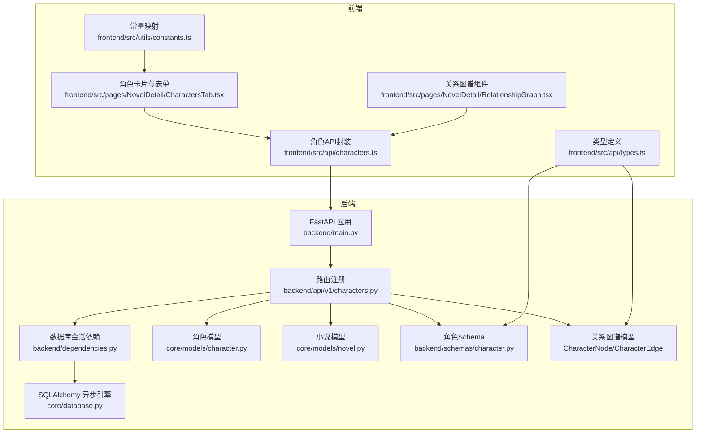
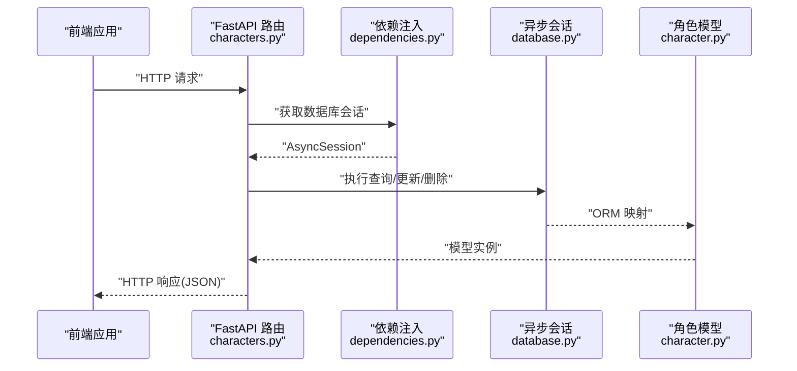
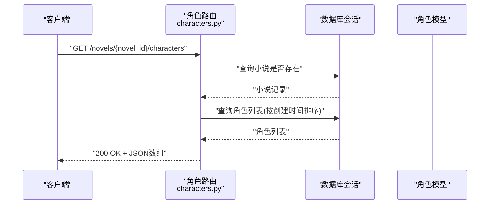
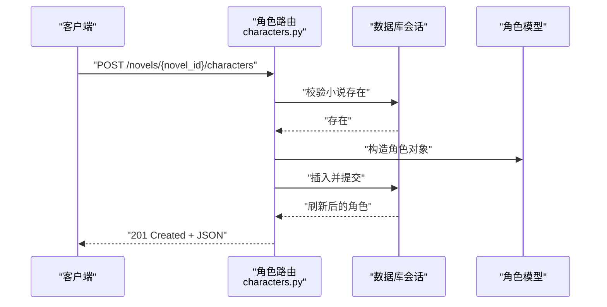
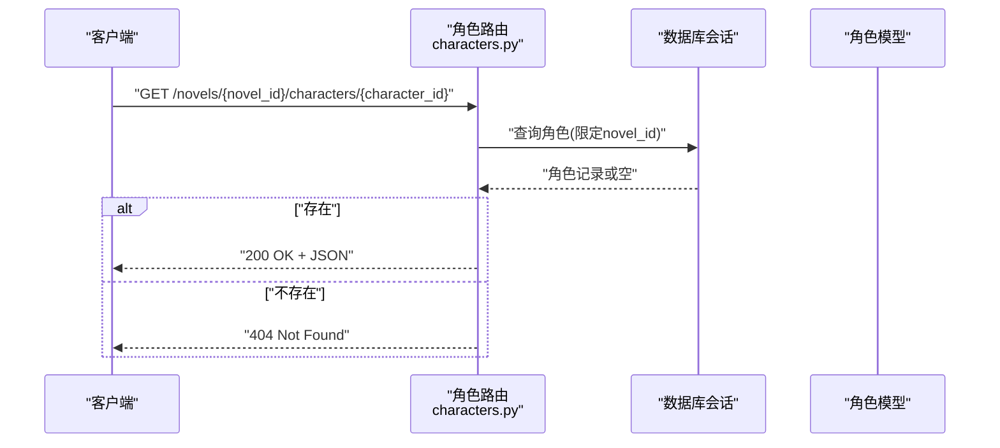
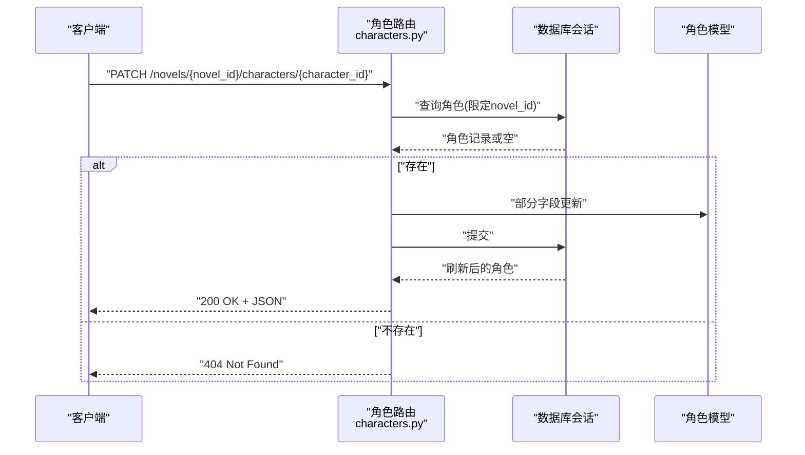
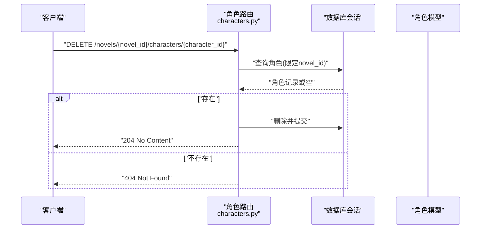
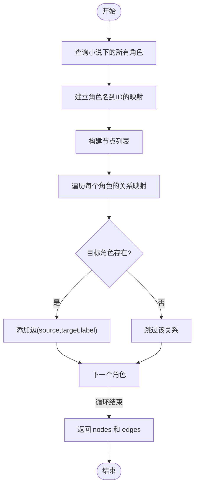
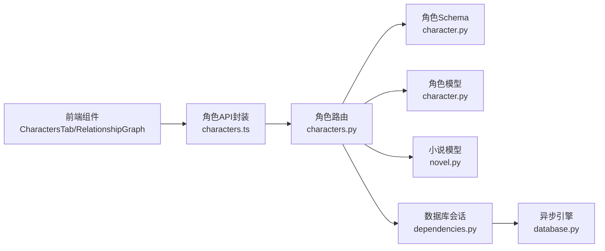

# 角色管理API

<cite>
**本文档引用的文件**
- [backend/api/v1/characters.py](file://backend/api/v1/characters.py)
- [backend/schemas/character.py](file://backend/schemas/character.py)
- [core/models/character.py](file://core/models/character.py)
- [core/models/novel.py](file://core/models/novel.py)
- [frontend/src/api/characters.ts](file://frontend/src/api/characters.ts)
- [frontend/src/pages/NovelDetail/CharactersTab.tsx](file://frontend/src/pages/NovelDetail/CharactersTab.tsx)
- [frontend/src/pages/NovelDetail/RelationshipGraph.tsx](file://frontend/src/pages/NovelDetail/RelationshipGraph.tsx)
- [frontend/src/api/types.ts](file://frontend/src/api/types.ts)
- [backend/dependencies.py](file://backend/dependencies.py)
- [core/database.py](file://core/database.py)
- [backend/main.py](file://backend/main.py)
- [frontend/src/utils/constants.ts](file://frontend/src/utils/constants.ts)
</cite>

## 更新摘要
**变更内容**
- 新增专门的关系图谱数据模型（CharacterNode、CharacterEdge、CharacterRelationshipResponse）
- 改进的关系图可视化能力，提供更规范的图论数据结构
- 增强的前端节点边渲染，支持更好的视觉效果和交互体验
- 优化的关系数据处理流程，提升性能和可维护性

## 目录
1. [简介](#简介)
2. [项目结构](#项目结构)
3. [核心组件](#核心组件)
4. [架构总览](#架构总览)
5. [详细组件分析](#详细组件分析)
6. [依赖分析](#依赖分析)
7. [性能考虑](#性能考虑)
8. [故障排除指南](#故障排除指南)
9. [结论](#结论)
10. [附录](#附录)

## 简介
本文件面向"角色管理API"的使用与维护，覆盖角色的完整CRUD操作及关系图谱功能，包括：
- GET /novels/{novel_id}/characters：获取指定小说的角色列表
- POST /novels/{novel_id}/characters：创建新角色
- GET /novels/{novel_id}/characters/{character_id}：获取角色详情
- PATCH /novels/{novel_id}/characters/{character_id}：更新角色信息
- DELETE /novels/{novel_id}/characters/{character_id}：删除角色
- GET /novels/{novel_id}/characters/relationships：获取角色关系图（节点与边）

**更新** 新增专门的关系图谱数据模型，提供更规范的图论数据结构，支持更好的可视化渲染和交互体验。

同时，文档详细说明角色属性字段、关系建模方式、前端集成点、错误处理策略，并提供典型应用场景与最佳实践。

## 项目结构
角色管理API位于后端模块化结构中，采用FastAPI + SQLAlchemy异步ORM，数据模型与Pydantic校验模型分离，前端通过HTTP客户端封装调用后端接口。

**图表来源**
- [backend/main.py](file://backend/main.py#L15-L32)
- [backend/api/v1/characters.py](file://backend/api/v1/characters.py#L21-L21)
- [backend/dependencies.py](file://backend/dependencies.py#L12-L19)
- [core/database.py](file://core/database.py#L25-L34)
- [core/models/character.py](file://core/models/character.py#L31-L53)
- [core/models/novel.py](file://core/models/novel.py#L37-L65)
- [backend/schemas/character.py](file://backend/schemas/character.py#L8-L76)
- [frontend/src/api/characters.ts](file://frontend/src/api/characters.ts#L1-L44)
- [frontend/src/pages/NovelDetail/CharactersTab.tsx](file://frontend/src/pages/NovelDetail/CharactersTab.tsx#L1-L298)
- [frontend/src/pages/NovelDetail/RelationshipGraph.tsx](file://frontend/src/pages/NovelDetail/RelationshipGraph.tsx#L1-L108)
- [frontend/src/api/types.ts](file://frontend/src/api/types.ts#L46-L94)
- [frontend/src/utils/constants.ts](file://frontend/src/utils/constants.ts#L22-L33)

**章节来源**
- [backend/api/v1/characters.py](file://backend/api/v1/characters.py#L1-L215)
- [backend/schemas/character.py](file://backend/schemas/character.py#L1-L123)
- [core/models/character.py](file://core/models/character.py#L1-L54)
- [core/models/novel.py](file://core/models/novel.py#L1-L66)
- [frontend/src/api/characters.ts](file://frontend/src/api/characters.ts#L1-L44)
- [frontend/src/pages/NovelDetail/CharactersTab.tsx](file://frontend/src/pages/NovelDetail/CharactersTab.tsx#L1-L298)
- [frontend/src/pages/NovelDetail/RelationshipGraph.tsx](file://frontend/src/pages/NovelDetail/RelationshipGraph.tsx#L1-L108)
- [frontend/src/api/types.ts](file://frontend/src/api/types.ts#L46-L94)
- [backend/dependencies.py](file://backend/dependencies.py#L1-L23)
- [core/database.py](file://core/database.py#L1-L35)
- [backend/main.py](file://backend/main.py#L1-L53)
- [frontend/src/utils/constants.ts](file://frontend/src/utils/constants.ts#L1-L39)

## 核心组件
- 角色CRUD路由：提供角色列表、创建、详情、更新、删除的REST接口，均绑定在 /novels/{novel_id}/characters 路径下。
- 关系图谱接口：返回角色节点与关系边，供前端可视化展示。
- **新增** 专门的关系图谱数据模型：CharacterNode、CharacterEdge、CharacterRelationshipResponse，提供规范的图论数据结构。
- 数据模型与枚举：角色类型、性别、状态等枚举统一定义于模型层。
- Pydantic Schema：严格定义请求与响应的数据结构，确保前后端契约一致。
- 前端集成：提供角色列表、详情、编辑、删除、关系图谱的UI与交互。

**更新** 新增专门的关系图谱数据模型，提供更规范的图论数据结构，支持更好的可视化渲染和交互体验。

**章节来源**
- [backend/api/v1/characters.py](file://backend/api/v1/characters.py#L24-L215)
- [backend/schemas/character.py](file://backend/schemas/character.py#L8-L123)
- [core/models/character.py](file://core/models/character.py#L12-L53)
- [frontend/src/api/characters.ts](file://frontend/src/api/characters.ts#L4-L43)
- [frontend/src/pages/NovelDetail/CharactersTab.tsx](file://frontend/src/pages/NovelDetail/CharactersTab.tsx#L19-L234)
- [frontend/src/pages/NovelDetail/RelationshipGraph.tsx](file://frontend/src/pages/NovelDetail/RelationshipGraph.tsx#L37-L107)

## 架构总览
后端采用FastAPI + SQLAlchemy异步ORM，路由层负责参数解析与权限校验，服务层负责业务逻辑，数据层负责持久化。前端通过HTTP客户端封装调用后端接口，关系图谱使用ReactFlow进行可视化渲染。

**图表来源**
- [backend/api/v1/characters.py](file://backend/api/v1/characters.py#L24-L215)
- [backend/dependencies.py](file://backend/dependencies.py#L12-L19)
- [core/database.py](file://core/database.py#L25-L34)
- [core/models/character.py](file://core/models/character.py#L31-L53)

## 详细组件分析

### 角色CRUD接口
- 路径与方法
  - GET /novels/{novel_id}/characters
  - POST /novels/{novel_id}/characters
  - GET /novels/{novel_id}/characters/{character_id}
  - PATCH /novels/{novel_id}/characters/{character_id}
  - DELETE /novels/{novel_id}/characters/{character_id}

- 功能要点
  - 所有接口均对 novel_id 进行存在性校验，确保角色属于有效的小说。
  - 列表接口按创建时间升序排列。
  - 更新接口支持部分字段更新（exclude_unset）。
  - 删除接口级联删除角色记录。

- 错误处理
  - 小说不存在时返回404。
  - 角色不存在时返回404。
  - 其他数据库异常由中间件捕获并返回标准错误。

**章节来源**
- [backend/api/v1/characters.py](file://backend/api/v1/characters.py#L24-L215)

### 角色关系图谱接口
- 路径与方法
  - GET /novels/{novel_id}/characters/relationships

- **更新** 返回结构
  - nodes：角色节点数组，包含 id、name、role_type 等
  - edges：关系边数组，包含 source、target、label

- **新增** 专门的关系图谱数据模型
  - CharacterNode：角色节点模型，包含角色ID、名称、类型
  - CharacterEdge：关系边模型，包含源角色ID、目标角色ID、关系标签
  - CharacterRelationshipResponse：关系图谱响应模型，包含节点和边列表

- 关系建模
  - 后端从每个角色的 relationships 字段读取目标角色名到关系类型的映射。
  - 使用角色名到UUID的映射构建边，仅当目标角色存在时才输出该边。
  - **改进** 使用专门的CharacterRelationshipResponse模型确保数据结构的一致性和完整性。
  - 前端接收nodes与edges后，使用Dagre布局算法进行自动布局。

- 前端集成
  - 前端组件基于 @xyflow/react 渲染关系图，支持缩放、平移、迷你地图等交互。
  - **改进** 节点样式根据角色类型映射颜色，边标注关系标签，支持更好的视觉效果。
  - 使用改进的节点边数据结构，提供更清晰的可视化展示。

**章节来源**
- [backend/api/v1/characters.py](file://backend/api/v1/characters.py#L77-L133)
- [backend/schemas/character.py](file://backend/schemas/character.py#L105-L123)
- [frontend/src/pages/NovelDetail/RelationshipGraph.tsx](file://frontend/src/pages/NovelDetail/RelationshipGraph.tsx#L37-L107)
- [frontend/src/utils/constants.ts](file://frontend/src/utils/constants.ts#L22-L27)

### 数据模型与字段说明
- 角色模型（核心字段）
  - id：UUID，主键
  - novel_id：UUID，外键，关联小说
  - name：字符串，角色名称
  - role_type：枚举，角色类型（主角/配角/反派/路人）
  - gender：枚举，性别
  - age：整数，年龄
  - appearance/personality/background/goals：文本，外貌/性格/背景/目标
  - abilities/growth_arc/relationships：JSONB，能力属性、成长轨迹、人物关系
  - status：枚举，角色状态（存活/死亡/未知）
  - first_appearance_chapter：整数，首次出场章节
  - avatar_url：字符串，头像URL
  - created_at/updated_at：时间戳

- 小说模型（关联关系）
  - characters：一对多，角色集合（级联删除）

- 枚举类型
  - 角色类型：protagonist/supporting/antagonist/minor
  - 性别：male/female/other
  - 角色状态：alive/dead/unknown

- **新增** 关系图谱数据模型
  - CharacterNode：规范的节点模型，包含id、name、role_type字段
  - CharacterEdge：规范的边模型，包含source、target、label字段
  - CharacterRelationshipResponse：规范的关系图谱响应模型

**章节来源**
- [core/models/character.py](file://core/models/character.py#L12-L53)
- [core/models/novel.py](file://core/models/novel.py#L37-L65)
- [backend/schemas/character.py](file://backend/schemas/character.py#L36-L55)
- [backend/schemas/character.py](file://backend/schemas/character.py#L105-L123)

### 前端集成与用户界面
- 角色列表与详情
  - CharactersTab 提供角色列表、新增、编辑、删除、详情抽屉。
  - 支持角色类型与性别的下拉选择，基础字段输入框。
  - 编辑模式下提交PATCH请求更新角色信息。

- **更新** 关系图谱
  - RelationshipGraph 组件加载关系数据并渲染图谱。
  - **改进** 使用改进的节点边数据结构，支持更好的视觉效果和交互体验。
  - 使用Dagre进行自动布局，边标注关系标签，节点按角色类型着色。
  - **新增** 支持节点边的样式定制，包括边框颜色、圆角、字体大小等。

- 类型定义
  - 前端类型与后端Schema一一对应，确保TS类型安全。
  - **新增** CharacterNode、CharacterEdge、CharacterRelationships类型定义。

**章节来源**
- [frontend/src/pages/NovelDetail/CharactersTab.tsx](file://frontend/src/pages/NovelDetail/CharactersTab.tsx#L19-L234)
- [frontend/src/pages/NovelDetail/RelationshipGraph.tsx](file://frontend/src/pages/NovelDetail/RelationshipGraph.tsx#L37-L107)
- [frontend/src/api/types.ts](file://frontend/src/api/types.ts#L46-L94)
- [frontend/src/utils/constants.ts](file://frontend/src/utils/constants.ts#L22-L33)

### API工作流序列图

#### 获取角色列表

**图表来源**
- [backend/api/v1/characters.py](file://backend/api/v1/characters.py#L24-L45)
- [core/models/novel.py](file://core/models/novel.py#L37-L65)
- [core/models/character.py](file://core/models/character.py#L31-L53)

#### 创建角色

**图表来源**
- [backend/api/v1/characters.py](file://backend/api/v1/characters.py#L50-L74)
- [core/models/novel.py](file://core/models/novel.py#L37-L65)
- [core/models/character.py](file://core/models/character.py#L31-L53)

#### 获取角色详情

**图表来源**
- [backend/api/v1/characters.py](file://backend/api/v1/characters.py#L136-L157)

#### 更新角色

**图表来源**
- [backend/api/v1/characters.py](file://backend/api/v1/characters.py#L160-L189)

#### 删除角色

**图表来源**
- [backend/api/v1/characters.py](file://backend/api/v1/characters.py#L192-L215)

### 关系图谱流程图

**图表来源**
- [backend/api/v1/characters.py](file://backend/api/v1/characters.py#L77-L133)

## 依赖分析
- 路由与依赖
  - 角色路由依赖数据库会话依赖注入，保证每个请求拥有独立的AsyncSession。
  - 数据库会话工厂在core/database.py中定义，使用异步引擎连接PostgreSQL。

- 模型与关系
  - 角色模型与小说模型之间存在一对多关系，删除小说时级联删除角色。
  - 角色模型内部以JSONB存储relationships、abilities、growth_arc等复杂字段。

- 前后端契约
  - 前端类型定义与后端Pydantic Schema保持一致，避免类型不匹配问题。
  - **新增** 关系图谱的节点与边结构与后端返回一致，便于前端直接消费。
  - **新增** 专门的关系图谱数据模型确保前后端数据结构的一致性。

**图表来源**
- [backend/api/v1/characters.py](file://backend/api/v1/characters.py#L11-L19)
- [backend/schemas/character.py](file://backend/schemas/character.py#L8-L123)
- [core/models/character.py](file://core/models/character.py#L31-L53)
- [core/models/novel.py](file://core/models/novel.py#L37-L65)
- [backend/dependencies.py](file://backend/dependencies.py#L12-L19)
- [core/database.py](file://core/database.py#L25-L34)
- [frontend/src/api/characters.ts](file://frontend/src/api/characters.ts#L1-L44)
- [frontend/src/pages/NovelDetail/CharactersTab.tsx](file://frontend/src/pages/NovelDetail/CharactersTab.tsx#L1-L298)
- [frontend/src/pages/NovelDetail/RelationshipGraph.tsx](file://frontend/src/pages/NovelDetail/RelationshipGraph.tsx#L1-L108)

**章节来源**
- [backend/api/v1/characters.py](file://backend/api/v1/characters.py#L11-L19)
- [backend/schemas/character.py](file://backend/schemas/character.py#L8-L123)
- [core/models/character.py](file://core/models/character.py#L31-L53)
- [core/models/novel.py](file://core/models/novel.py#L37-L65)
- [backend/dependencies.py](file://backend/dependencies.py#L12-L19)
- [core/database.py](file://core/database.py#L25-L34)
- [frontend/src/api/characters.ts](file://frontend/src/api/characters.ts#L1-L44)
- [frontend/src/pages/NovelDetail/CharactersTab.tsx](file://frontend/src/pages/NovelDetail/CharactersTab.tsx#L1-L298)
- [frontend/src/pages/NovelDetail/RelationshipGraph.tsx](file://frontend/src/pages/NovelDetail/RelationshipGraph.tsx#L1-L108)

## 性能考虑
- 查询优化
  - 列表接口按创建时间排序，适合分页扩展（当前未实现分页参数）。
  - 关系图谱接口一次性加载全部角色，角色数量较大时建议增加分页或增量加载。

- 数据库连接
  - 异步会话池配置可按需调整，确保高并发场景下的稳定性。

- 前端渲染
  - 关系图谱使用Dagre布局，节点与边较多时建议启用虚拟滚动或分批渲染。
  - **新增** 改进的节点边数据结构支持更好的渲染性能。

## 故障排除指南
- 常见错误与处理
  - 404 小说不存在：检查 novel_id 是否正确，确认小说记录存在。
  - 404 角色不存在：检查 character_id 与 novel_id 的组合是否匹配。
  - 数据库异常：查看后端日志，确认事务提交/回滚是否正常执行。

- 前端调试
  - 使用浏览器开发者工具查看网络请求与响应，确认接口路径与参数。
  - 在角色详情抽屉中核对字段显示是否符合预期。
  - **新增** 检查关系图谱数据结构是否符合CharacterRelationshipResponse模型。

**章节来源**
- [backend/api/v1/characters.py](file://backend/api/v1/characters.py#L37-L38)
- [backend/api/v1/characters.py](file://backend/api/v1/characters.py#L146-L147)
- [backend/api/v1/characters.py](file://backend/api/v1/characters.py#L198-L199)
- [backend/main.py](file://backend/main.py#L22-L29)

## 结论
角色管理API提供了完善的角色CRUD与关系图谱功能，结合前后端类型安全与清晰的路由设计，能够满足小说创作中角色信息管理与关系可视化的典型需求。**更新** 新增专门的关系图谱数据模型，提供更规范的图论数据结构，支持更好的可视化渲染和交互体验。后续可在关系图谱分页、批量操作、字段过滤等方面进一步增强。

## 附录

### 接口定义与示例

- 获取角色列表
  - 方法：GET
  - 路径：/novels/{novel_id}/characters
  - 成功响应：200 OK，返回角色数组
  - 失败响应：404 Not Found（小说不存在）

- 创建角色
  - 方法：POST
  - 路径：/novels/{novel_id}/characters
  - 请求体：角色创建Schema
  - 成功响应：201 Created，返回创建的角色
  - 失败响应：404 Not Found（小说不存在）

- 获取角色详情
  - 方法：GET
  - 路径：/novels/{novel_id}/characters/{character_id}
  - 成功响应：200 OK，返回角色详情
  - 失败响应：404 Not Found（角色不存在）

- 更新角色
  - 方法：PATCH
  - 路径：/novels/{novel_id}/characters/{character_id}
  - 请求体：角色更新Schema（支持部分字段）
  - 成功响应：200 OK，返回更新后的角色
  - 失败响应：404 Not Found（角色不存在）

- 删除角色
  - 方法：DELETE
  - 路径：/novels/{novel_id}/characters/{character_id}
  - 成功响应：204 No Content
  - 失败响应：404 Not Found（角色不存在）

- **新增** 获取角色关系图
  - 方法：GET
  - 路径：/novels/{novel_id}/characters/relationships
  - 成功响应：200 OK，返回 { nodes: [], edges: [] }
  - 失败响应：404 Not Found（小说不存在）
  - **更新** 返回结构：使用CharacterRelationshipResponse模型，包含规范的节点和边数据结构

### 字段说明与枚举

- 角色字段
  - id：UUID，主键
  - novel_id：UUID，所属小说
  - name：字符串，角色名称
  - role_type：枚举，角色类型
  - gender：枚举，性别
  - age：整数，年龄
  - appearance/personality/background/goals：文本
  - abilities/growth_arc/relationships：JSONB
  - status：枚举，角色状态
  - first_appearance_chapter：整数，首次出场章节
  - avatar_url：字符串，头像URL
  - created_at/updated_at：时间戳

- 枚举值
  - 角色类型：protagonist/supporting/antagonist/minor
  - 性别：male/female/other
  - 角色状态：alive/dead/unknown

- **新增** 关系图谱数据模型字段
  - CharacterNode：id（UUID）、name（字符串）、role_type（枚举）
  - CharacterEdge：source（UUID）、target（UUID）、label（字符串）
  - CharacterRelationshipResponse：nodes（CharacterNode数组）、edges（CharacterEdge数组）

### 实际应用场景
- 小说创作：快速录入角色基础信息与关系，自动生成关系图谱辅助构思。
- 世界构建：通过relationships字段表达复杂的人际网络，支撑剧情发展。
- 批量导入：可扩展批量创建接口，配合CSV/JSON模板导入角色数据。
- 权限控制：在路由层增加鉴权中间件，确保角色操作仅限作者或团队成员。
- **新增** 关系分析：利用改进的关系图谱数据结构，支持更复杂的关系分析和可视化需求。