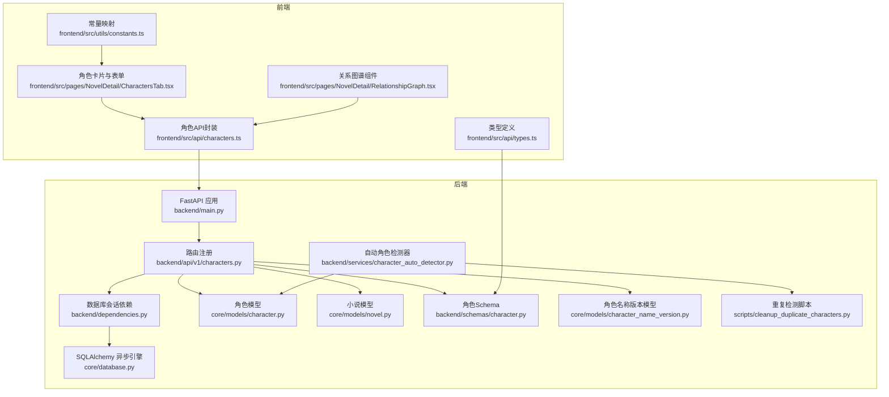
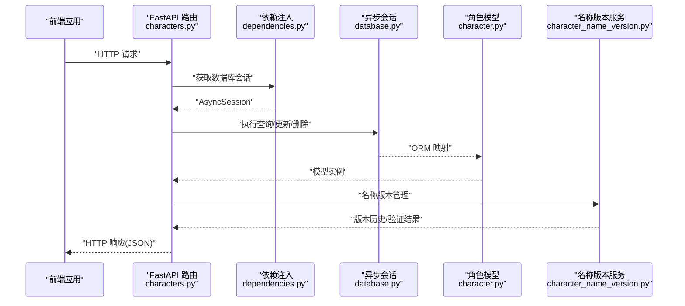
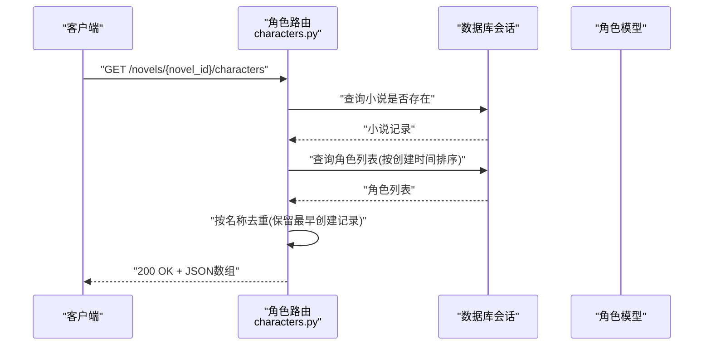
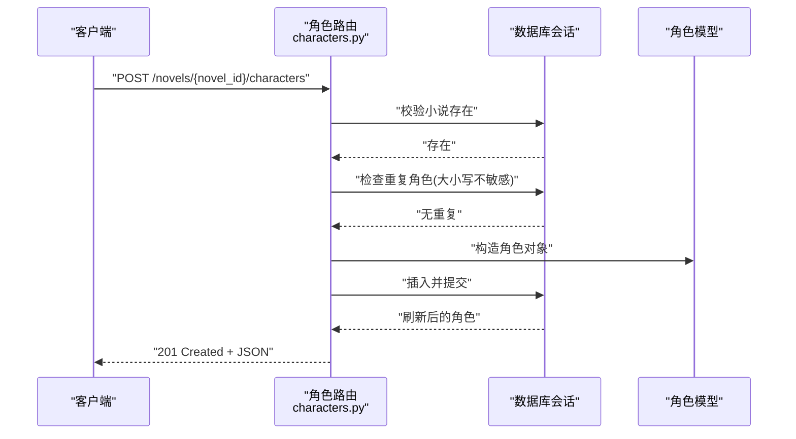
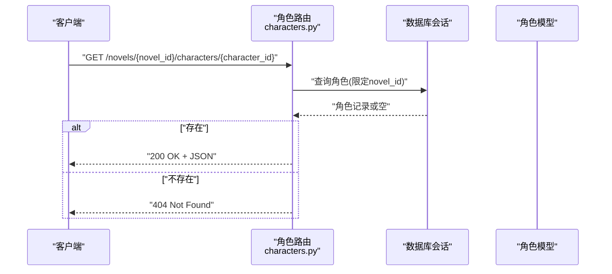
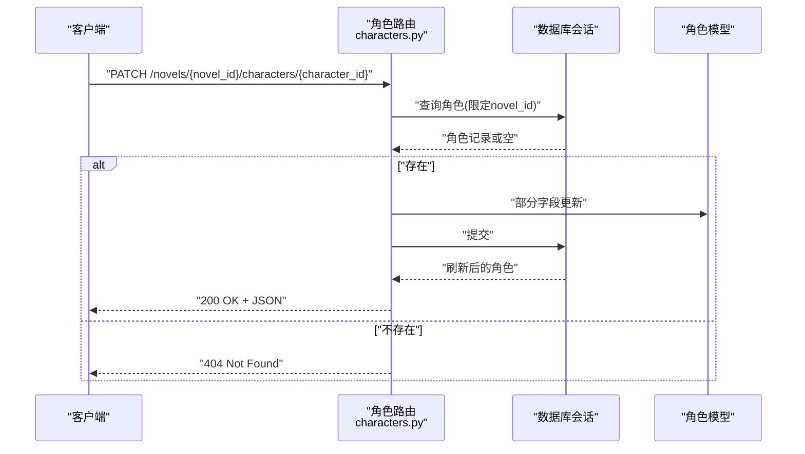
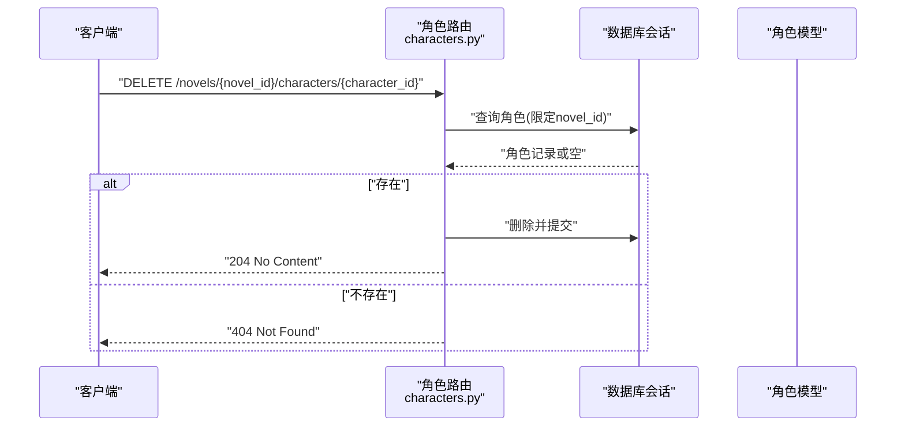
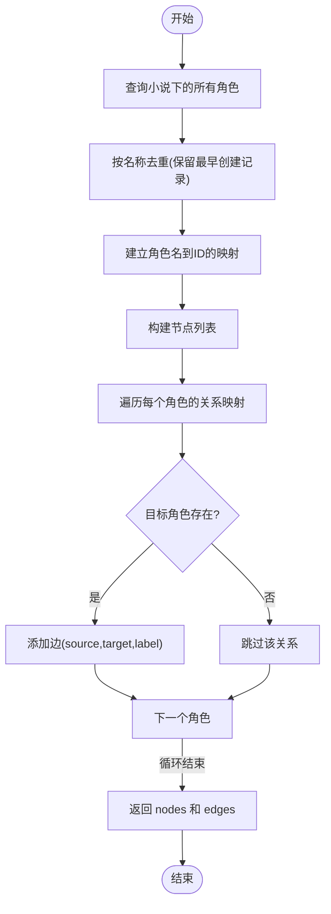
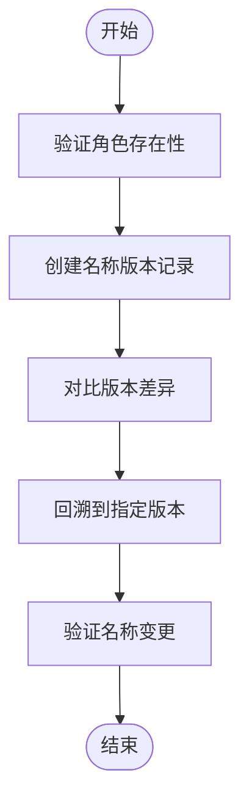
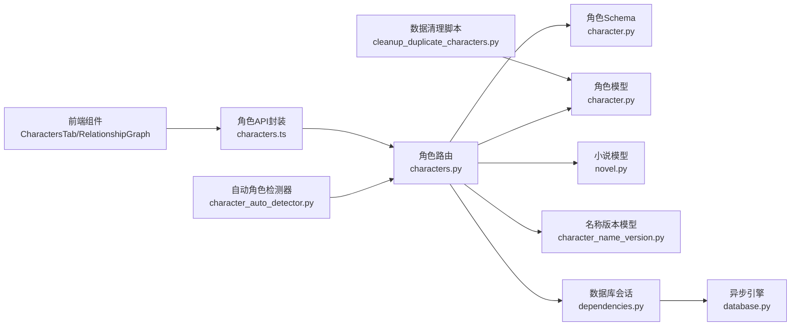

# 角色管理API

<cite>
**本文档引用的文件**
- [backend/api/v1/characters.py](file://backend/api/v1/characters.py)
- [backend/schemas/character.py](file://backend/schemas/character.py)
- [core/models/character.py](file://core/models/character.py)
- [core/models/novel.py](file://core/models/novel.py)
- [core/models/character_name_version.py](file://core/models/character_name_version.py)
- [backend/services/character_auto_detector.py](file://backend/services/character_auto_detector.py)
- [scripts/cleanup_duplicate_characters.py](file://scripts/cleanup_duplicate_characters.py)
- [frontend/src/api/characters.ts](file://frontend/src/api/characters.ts)
- [frontend/src/pages/NovelDetail/CharactersTab.tsx](file://frontend/src/pages/NovelDetail/CharactersTab.tsx)
- [frontend/src/pages/NovelDetail/RelationshipGraph.tsx](file://frontend/src/pages/NovelDetail/RelationshipGraph.tsx)
- [frontend/src/api/types.ts](file://frontend/src/api/types.ts)
- [backend/dependencies.py](file://backend/dependencies.py)
- [core/database.py](file://core/database.py)
- [backend/main.py](file://backend/main.py)
- [frontend/src/utils/constants.ts](file://frontend/src/utils/constants.ts)
- [backend/config.py](file://backend/config.py)
</cite>

## 更新摘要
**所做更改**
- 新增角色名称重复检测与预防机制章节
- 更新角色CRUD接口说明，增加严格重复预防功能
- 新增角色名称版本管理功能说明
- 更新关系图谱接口，增加去重处理逻辑
- 新增自动角色检测与清理脚本说明

## 目录
1. [简介](#简介)
2. [项目结构](#项目结构)
3. [核心组件](#核心组件)
4. [架构总览](#架构总览)
5. [详细组件分析](#详细组件分析)
6. [依赖分析](#依赖分析)
7. [性能考虑](#性能考虑)
8. [故障排除指南](#故障排除指南)
9. [结论](#结论)
10. [附录](#附录)

## 简介
本文件面向"角色管理API"的使用与维护，覆盖角色的完整CRUD操作及关系图谱功能，包括：
- GET /novels/{novel_id}/characters：获取指定小说的角色列表
- POST /novels/{novel_id}/characters：创建新角色
- GET /novels/{novel_id}/characters/{character_id}：获取角色详情
- PATCH /novels/{novel_id}/characters/{character_id}：更新角色信息
- DELETE /novels/{novel_id}/characters/{character_id}：删除角色
- GET /novels/{novel_id}/characters/relationships：获取角色关系图（节点与边）
- 角色名称版本管理：获取、创建、对比和回溯角色名称变更历史

同时，文档详细说明角色属性字段、关系建模方式、前端集成点、错误处理策略，并提供典型应用场景与最佳实践。

**更新** 新增严格重复预防机制、角色名称版本管理、自动角色检测与清理功能。

## 项目结构
角色管理API位于后端模块化结构中，采用FastAPI + SQLAlchemy异步ORM，数据模型与Pydantic校验模型分离，前端通过HTTP客户端封装调用后端接口。

**图表来源**
- [backend/main.py:15-32](file://backend/main.py#L15-L32)
- [backend/api/v1/characters.py:21-21](file://backend/api/v1/characters.py#L21-L21)
- [backend/dependencies.py:12-19](file://backend/dependencies.py#L12-L19)
- [core/database.py:25-34](file://core/database.py#L25-L34)
- [core/models/character.py:31-53](file://core/models/character.py#L31-L53)
- [core/models/novel.py:37-65](file://core/models/novel.py#L37-L65)
- [backend/schemas/character.py:8-76](file://backend/schemas/character.py#L8-L76)
- [core/models/character_name_version.py:12-26](file://core/models/character_name_version.py#L12-L26)
- [backend/services/character_auto_detector.py:24-44](file://backend/services/character_auto_detector.py#L24-L44)
- [scripts/cleanup_duplicate_characters.py:1-242](file://scripts/cleanup_duplicate_characters.py#L1-L242)
- [frontend/src/api/characters.ts:1-44](file://frontend/src/api/characters.ts#L1-L44)
- [frontend/src/pages/NovelDetail/CharactersTab.tsx:1-298](file://frontend/src/pages/NovelDetail/CharactersTab.tsx#L1-L298)
- [frontend/src/pages/NovelDetail/RelationshipGraph.tsx:1-108](file://frontend/src/pages/NovelDetail/RelationshipGraph.tsx#L1-L108)
- [frontend/src/api/types.ts:46-94](file://frontend/src/api/types.ts#L46-L94)
- [frontend/src/utils/constants.ts:22-33](file://frontend/src/utils/constants.ts#L22-L33)

**章节来源**
- [backend/api/v1/characters.py:1-439](file://backend/api/v1/characters.py#L1-L439)
- [backend/schemas/character.py:1-123](file://backend/schemas/character.py#L1-L123)
- [core/models/character.py:1-55](file://core/models/character.py#L1-L55)
- [core/models/novel.py:1-66](file://core/models/novel.py#L1-L66)
- [core/models/character_name_version.py:1-195](file://core/models/character_name_version.py#L1-L195)
- [backend/services/character_auto_detector.py:1-440](file://backend/services/character_auto_detector.py#L1-L440)
- [scripts/cleanup_duplicate_characters.py:1-242](file://scripts/cleanup_duplicate_characters.py#L1-L242)
- [frontend/src/api/characters.ts:1-44](file://frontend/src/api/characters.ts#L1-L44)
- [frontend/src/pages/NovelDetail/CharactersTab.tsx:1-328](file://frontend/src/pages/NovelDetail/CharactersTab.tsx#L1-L328)
- [frontend/src/pages/NovelDetail/RelationshipGraph.tsx:1-108](file://frontend/src/pages/NovelDetail/RelationshipGraph.tsx#L1-L108)
- [frontend/src/api/types.ts:46-94](file://frontend/src/api/types.ts#L46-L94)
- [backend/dependencies.py:1-23](file://backend/dependencies.py#L1-L23)
- [core/database.py:1-35](file://core/database.py#L1-L35)
- [backend/main.py:1-53](file://backend/main.py#L1-L53)
- [frontend/src/utils/constants.ts:1-39](file://frontend/src/utils/constants.ts#L1-L39)

## 核心组件
- 角色CRUD路由：提供角色列表、创建、详情、更新、删除的REST接口，均绑定在 /novels/{novel_id}/characters 路径下。
- 关系图谱接口：返回角色节点与关系边，供前端可视化展示。
- 名称重复检测：严格重复预防机制，支持大小写不敏感的名称检查。
- 名称版本管理：角色名称变更历史追踪、对比和回溯功能。
- 自动角色检测：基于LLM的自动角色提取、去重和注册功能。
- 数据清理脚本：批量查找和清理重复角色数据。
- 数据模型与枚举：角色类型、性别、状态等枚举统一定义于模型层。
- Pydantic Schema：严格定义请求与响应的数据结构，确保前后端契约一致。
- 前端集成：提供角色列表、详情、编辑、删除、关系图谱的UI与交互。

**更新** 新增名称重复检测、名称版本管理、自动角色检测和数据清理功能。

**章节来源**
- [backend/api/v1/characters.py:24-439](file://backend/api/v1/characters.py#L24-L439)
- [backend/schemas/character.py:8-123](file://backend/schemas/character.py#L8-L123)
- [core/models/character.py:12-55](file://core/models/character.py#L12-L55)
- [core/models/character_name_version.py:28-195](file://core/models/character_name_version.py#L28-L195)
- [backend/services/character_auto_detector.py:24-440](file://backend/services/character_auto_detector.py#L24-L440)
- [scripts/cleanup_duplicate_characters.py:1-242](file://scripts/cleanup_duplicate_characters.py#L1-L242)
- [frontend/src/api/characters.ts:4-43](file://frontend/src/api/characters.ts#L4-L43)
- [frontend/src/pages/NovelDetail/CharactersTab.tsx:19-328](file://frontend/src/pages/NovelDetail/CharactersTab.tsx#L19-L328)
- [frontend/src/pages/NovelDetail/RelationshipGraph.tsx:37-107](file://frontend/src/pages/NovelDetail/RelationshipGraph.tsx#L37-L107)

## 架构总览
后端采用FastAPI + SQLAlchemy异步ORM，路由层负责参数解析与权限校验，服务层负责业务逻辑，数据层负责持久化。前端通过HTTP客户端封装调用后端接口，关系图谱使用ReactFlow进行可视化渲染。

**图表来源**
- [backend/api/v1/characters.py:24-439](file://backend/api/v1/characters.py#L24-L439)
- [backend/dependencies.py:12-19](file://backend/dependencies.py#L12-L19)
- [core/database.py:25-34](file://core/database.py#L25-L34)
- [core/models/character.py:31-55](file://core/models/character.py#L31-L55)
- [core/models/character_name_version.py:28-195](file://core/models/character_name_version.py#L28-L195)

## 详细组件分析

### 角色CRUD接口
- 路径与方法
  - GET /novels/{novel_id}/characters
  - POST /novels/{novel_id}/characters
  - GET /novels/{novel_id}/characters/{character_id}
  - PATCH /novels/{novel_id}/characters/{character_id}
  - DELETE /novels/{novel_id}/characters/{character_id}

- 功能要点
  - 所有接口均对 novel_id 进行存在性校验，确保角色属于有效的小说。
  - 列表接口按创建时间升序排列，并进行名称去重处理。
  - 创建接口支持严格重复预防，大小写不敏感检查。
  - 更新接口支持部分字段更新（exclude_unset）。
  - 删除接口级联删除角色记录。

- 错误处理
  - 小说不存在时返回404。
  - 角色不存在时返回404。
  - 重复角色创建时返回409。
  - 其他数据库异常由中间件捕获并返回标准错误。

**更新** 新增严格重复预防机制，在创建角色时进行大小写不敏感的名称检查。

**章节来源**
- [backend/api/v1/characters.py:24-439](file://backend/api/v1/characters.py#L24-L439)

### 角色关系图谱接口
- 路径与方法
  - GET /novels/{novel_id}/characters/relationships

- 返回结构
  - nodes：角色节点数组，包含 id、name、role_type 等
  - edges：关系边数组，包含 source、target、label

- 关系建模
  - 后端从每个角色的 relationships 字段读取目标角色名到关系类型的映射。
  - 使用角色名到UUID的映射构建边，仅当目标角色存在时才输出该边。
  - 前端接收nodes与edges后，使用Dagre布局算法进行自动布局。

- 去重处理
  - 关系图谱接口同样进行名称去重，确保重复角色不会产生孤立节点。

**更新** 关系图谱接口增加了去重处理逻辑，防止重复角色产生孤立节点。

- 前端集成
  - 前端组件基于 @xyflow/react 渲染关系图，支持缩放、平移、迷你地图等交互。
  - 节点样式根据角色类型映射颜色，边标注关系标签。

**章节来源**
- [backend/api/v1/characters.py:100-165](file://backend/api/v1/characters.py#L100-L165)
- [frontend/src/pages/NovelDetail/RelationshipGraph.tsx:37-107](file://frontend/src/pages/NovelDetail/RelationshipGraph.tsx#L37-L107)
- [frontend/src/utils/constants.ts:22-27](file://frontend/src/utils/constants.ts#L22-L27)

### 角色名称版本管理
- 路径与方法
  - GET /novels/{novel_id}/characters/{character_id}/name-versions
  - POST /novels/{novel_id}/characters/{character_id}/name-versions
  - GET /novels/{novel_id}/characters/{character_id}/name-versions/compare
  - POST /novels/{novel_id}/characters/{character_id}/name-versions/revert
  - GET /novels/{novel_id}/characters/{character_id}/name-versions/validate

- 功能特性
  - 名称版本历史：记录角色每次名称变更的详细信息。
  - 版本对比：对比两个版本之间的差异。
  - 版本回溯：将角色名称恢复到历史版本。
  - 变更验证：验证新名称是否与历史版本冲突。

**新增** 角色名称版本管理功能，提供完整的名称变更追踪和管理能力。

**章节来源**
- [backend/api/v1/characters.py:249-439](file://backend/api/v1/characters.py#L249-L439)
- [core/models/character_name_version.py:28-195](file://core/models/character_name_version.py#L28-L195)

### 自动角色检测与清理
- 自动角色检测器
  - 基于LLM从章节内容中自动提取新角色
  - 四层去重过滤：精确匹配、子串包含、别名交叉检查、置信度阈值
  - 标准化名称处理：去除后缀、空格和标点符号
  - 竞态条件防护：创建前再次检查数据库

- 数据清理脚本
  - 查找所有重复角色（按小说ID和小写名称分组）
  - 合并关系数据到主记录
  - 更新章节引用中的角色ID
  - 批量删除重复记录

**新增** 自动角色检测和数据清理功能，确保角色数据的一致性和完整性。

**章节来源**
- [backend/services/character_auto_detector.py:24-440](file://backend/services/character_auto_detector.py#L24-L440)
- [scripts/cleanup_duplicate_characters.py:1-242](file://scripts/cleanup_duplicate_characters.py#L1-L242)

### 数据模型与字段说明
- 角色模型（核心字段）
  - id：UUID，主键
  - novel_id：UUID，外键，关联小说
  - name：字符串，角色名称
  - role_type：枚举，角色类型（主角/配角/反派/路人）
  - gender：枚举，性别
  - age：整数，年龄
  - appearance/personality/background/goals：文本，外貌/性格/背景/目标
  - abilities/growth_arc/relationships：JSONB，能力属性、成长轨迹、人物关系
  - status：枚举，角色状态（存活/死亡/未知）
  - first_appearance_chapter：整数，首次出场章节
  - avatar_url：字符串，头像URL
  - created_at/updated_at：时间戳

- 名称版本模型
  - id：UUID，主键
  - character_id：UUID，外键，关联角色
  - old_name/new_name：字符串，旧名称和新名称
  - changed_at：时间戳，变更时间
  - changed_by：字符串，变更操作人
  - reason：文本，变更原因
  - is_active：布尔值，是否为活跃版本

- 小说模型（关联关系）
  - characters：一对多，角色集合（级联删除）
  - name_versions：一对多，名称版本集合（级联删除）

- 枚举类型
  - 角色类型：protagonist/supporting/antagonist/minor
  - 性别：male/female/other
  - 角色状态：alive/dead/unknown

**更新** 新增名称版本模型和相关关联关系。

**章节来源**
- [core/models/character.py:12-55](file://core/models/character.py#L12-L55)
- [core/models/novel.py:37-65](file://core/models/novel.py#L37-L65)
- [core/models/character_name_version.py:12-26](file://core/models/character_name_version.py#L12-L26)
- [backend/schemas/character.py:36-55](file://backend/schemas/character.py#L36-L55)

### 前端集成与用户界面
- 角色列表与详情
  - CharactersTab 提供角色列表、新增、编辑、删除、详情抽屉。
  - 支持角色类型与性别的下拉选择，基础字段输入框。
  - 编辑模式下提交PATCH请求更新角色信息。

- 关系图谱
  - RelationshipGraph 组件加载关系数据并渲染图谱。
  - 使用Dagre进行自动布局，边标注关系标签，节点按角色类型着色。

- 名称版本管理
  - 支持查看角色名称变更历史
  - 提供版本对比和回溯功能
  - 验证新名称变更的合理性

**更新** 前端集成了名称版本管理功能，提供完整的角色名称变更追踪界面。

- 类型定义
  - 前端类型与后端Schema一一对应，确保TS类型安全。

**章节来源**
- [frontend/src/pages/NovelDetail/CharactersTab.tsx:19-328](file://frontend/src/pages/NovelDetail/CharactersTab.tsx#L19-L328)
- [frontend/src/pages/NovelDetail/RelationshipGraph.tsx:37-107](file://frontend/src/pages/NovelDetail/RelationshipGraph.tsx#L37-L107)
- [frontend/src/api/types.ts:46-94](file://frontend/src/api/types.ts#L46-L94)
- [frontend/src/utils/constants.ts:22-33](file://frontend/src/utils/constants.ts#L22-L33)

### API工作流序列图

#### 获取角色列表

**更新** 列表接口增加了名称去重处理逻辑。

**图表来源**
- [backend/api/v1/characters.py:25-57](file://backend/api/v1/characters.py#L25-L57)
- [core/models/novel.py:37-65](file://core/models/novel.py#L37-L65)
- [core/models/character.py:31-55](file://core/models/character.py#L31-L55)

#### 创建角色

**更新** 创建角色接口增加了严格的重复预防机制。

**图表来源**
- [backend/api/v1/characters.py:60-97](file://backend/api/v1/characters.py#L60-L97)
- [core/models/novel.py:37-65](file://core/models/novel.py#L37-L65)
- [core/models/character.py:31-55](file://core/models/character.py#L31-L55)

#### 获取角色详情

**图表来源**
- [backend/api/v1/characters.py:168-189](file://backend/api/v1/characters.py#L168-L189)

#### 更新角色

**图表来源**
- [backend/api/v1/characters.py:192-221](file://backend/api/v1/characters.py#L192-L221)

#### 删除角色

**图表来源**
- [backend/api/v1/characters.py:224-247](file://backend/api/v1/characters.py#L224-L247)

### 关系图谱流程图

**更新** 关系图谱流程增加了去重处理步骤。

**图表来源**
- [backend/api/v1/characters.py:100-165](file://backend/api/v1/characters.py#L100-L165)

### 名称版本管理流程图

**新增** 名称版本管理的完整流程。

**图表来源**
- [core/models/character_name_version.py:28-195](file://core/models/character_name_version.py#L28-L195)

## 依赖分析
- 路由与依赖
  - 角色路由依赖数据库会话依赖注入，保证每个请求拥有独立的AsyncSession。
  - 数据库会话工厂在core/database.py中定义，使用异步引擎连接PostgreSQL。

- 模型与关系
  - 角色模型与小说模型之间存在一对多关系，删除小说时级联删除角色。
  - 角色模型与名称版本模型之间存在一对多关系，删除角色时级联删除名称版本。
  - 角色模型内部以JSONB存储relationships、abilities、growth_arc等复杂字段。

- 服务层集成
  - 自动角色检测器依赖LLM客户端和提示管理器。
  - 名称版本服务提供完整的版本管理功能。
  - 数据清理脚本独立运行，不依赖Web服务。

- 前后端契约
  - 前端类型定义与后端Pydantic Schema保持一致，避免类型不匹配问题。
  - 关系图谱的节点与边结构与后端返回一致，便于前端直接消费。

**更新** 新增名称版本模型和服务层集成关系。

**图表来源**
- [backend/api/v1/characters.py:11-19](file://backend/api/v1/characters.py#L11-L19)
- [backend/schemas/character.py:8-123](file://backend/schemas/character.py#L8-L123)
- [core/models/character.py:31-55](file://core/models/character.py#L31-L55)
- [core/models/novel.py:37-65](file://core/models/novel.py#L37-L65)
- [core/models/character_name_version.py:12-26](file://core/models/character_name_version.py#L12-L26)
- [backend/dependencies.py:12-19](file://backend/dependencies.py#L12-L19)
- [core/database.py:25-34](file://core/database.py#L25-L34)
- [backend/services/character_auto_detector.py:24-44](file://backend/services/character_auto_detector.py#L24-L44)
- [scripts/cleanup_duplicate_characters.py:1-24](file://scripts/cleanup_duplicate_characters.py#L1-L24)
- [frontend/src/api/characters.ts:1-44](file://frontend/src/api/characters.ts#L1-L44)
- [frontend/src/pages/NovelDetail/CharactersTab.tsx:1-328](file://frontend/src/pages/NovelDetail/CharactersTab.tsx#L1-L328)
- [frontend/src/pages/NovelDetail/RelationshipGraph.tsx:1-108](file://frontend/src/pages/NovelDetail/RelationshipGraph.tsx#L1-L108)

**章节来源**
- [backend/api/v1/characters.py:11-19](file://backend/api/v1/characters.py#L11-L19)
- [backend/schemas/character.py:8-123](file://backend/schemas/character.py#L8-L123)
- [core/models/character.py:31-55](file://core/models/character.py#L31-L55)
- [core/models/novel.py:37-65](file://core/models/novel.py#L37-L65)
- [core/models/character_name_version.py:12-26](file://core/models/character_name_version.py#L12-L26)
- [backend/dependencies.py:12-19](file://backend/dependencies.py#L12-L19)
- [core/database.py:25-34](file://core/database.py#L25-L34)
- [backend/services/character_auto_detector.py:24-44](file://backend/services/character_auto_detector.py#L24-L44)
- [scripts/cleanup_duplicate_characters.py:1-24](file://scripts/cleanup_duplicate_characters.py#L1-L24)
- [frontend/src/api/characters.ts:1-44](file://frontend/src/api/characters.ts#L1-L44)
- [frontend/src/pages/NovelDetail/CharactersTab.tsx:1-328](file://frontend/src/pages/NovelDetail/CharactersTab.tsx#L1-L328)
- [frontend/src/pages/NovelDetail/RelationshipGraph.tsx:1-108](file://frontend/src/pages/NovelDetail/RelationshipGraph.tsx#L1-L108)

## 性能考虑
- 查询优化
  - 列表接口按创建时间排序，适合分页扩展（当前未实现分页参数）。
  - 关系图谱接口一次性加载全部角色，角色数量较大时建议增加分页或增量加载。
  - 名称去重操作在内存中进行，角色数量过多时可能影响性能。

- 数据库连接
  - 异步会话池配置可按需调整，确保高并发场景下的稳定性。
  - 名称版本查询支持限制返回数量，避免大量历史数据影响性能。

- 自动检测性能
  - LLM调用成本较高，可通过配置调整置信度阈值和内容长度。
  - 批量处理时注意数据库连接池的使用，避免资源耗尽。

- 前端渲染
  - 关系图谱使用Dagre布局，节点与边较多时建议启用虚拟滚动或分批渲染。
  - 名称版本历史列表支持分页加载，提升用户体验。

**更新** 新增名称版本管理和自动检测的性能考虑。

[本节为通用指导，无需列出具体文件来源]

## 故障排除指南
- 常见错误与处理
  - 404 小说不存在：检查 novel_id 是否正确，确认小说记录存在。
  - 404 角色不存在：检查 character_id 与 novel_id 的组合是否匹配。
  - 409 重复角色创建：检查角色名称是否已存在，使用大小写不敏感规则。
  - 数据库异常：查看后端日志，确认事务提交/回滚是否正常执行。

- 前端调试
  - 使用浏览器开发者工具查看网络请求与响应，确认接口路径与参数。
  - 在角色详情抽屉中核对字段显示是否符合预期。
  - 名称版本管理功能需要确保角色存在且有历史记录。

- 自动检测问题
  - LLM调用失败：检查API密钥和网络连接。
  - 置信度过低：调整配置中的置信度阈值。
  - 重复检测失效：检查去重脚本的执行情况。

**更新** 新增重复检测、名称版本管理和自动检测相关的故障排除指南。

- 数据清理问题
  - 重复数据未清理：检查数据库迁移是否完成。
  - 关系数据丢失：确认合并操作是否成功执行。
  - 章节引用错误：验证更新后的引用是否正确。

**章节来源**
- [backend/api/v1/characters.py:37-38](file://backend/api/v1/characters.py#L37-L38)
- [backend/api/v1/characters.py:86-90](file://backend/api/v1/characters.py#L86-L90)
- [backend/api/v1/characters.py:146-147](file://backend/api/v1/characters.py#L146-L147)
- [backend/api/v1/characters.py:198-199](file://backend/api/v1/characters.py#L198-L199)
- [backend/main.py:22-29](file://backend/main.py#L22-L29)

## 结论
角色管理API提供了完善的角色CRUD与关系图谱功能，结合前后端类型安全与清晰的路由设计，能够满足小说创作中角色信息管理与关系可视化的典型需求。新增的严格重复预防、名称版本管理和自动检测功能进一步提升了系统的可靠性和易用性。后续可在关系图谱分页、批量操作、字段过滤等方面进一步增强。

**更新** 新增的功能显著提升了角色管理的完整性和系统可靠性。

[本节为总结性内容，无需列出具体文件来源]

## 附录

### 接口定义与示例

- 获取角色列表
  - 方法：GET
  - 路径：/novels/{novel_id}/characters
  - 成功响应：200 OK，返回角色数组（已去重）
  - 失败响应：404 Not Found（小说不存在）

- 创建角色
  - 方法：POST
  - 路径：/novels/{novel_id}/characters
  - 请求体：角色创建Schema
  - 成功响应：201 Created，返回创建的角色
  - 失败响应：404 Not Found（小说不存在）、409 Conflict（重复角色）

- 获取角色详情
  - 方法：GET
  - 路径：/novels/{novel_id}/characters/{character_id}
  - 成功响应：200 OK，返回角色详情
  - 失败响应：404 Not Found（角色不存在）

- 更新角色
  - 方法：PATCH
  - 路径：/novels/{novel_id}/characters/{character_id}
  - 请求体：角色更新Schema（支持部分字段）
  - 成功响应：200 OK，返回更新后的角色
  - 失败响应：404 Not Found（角色不存在）

- 删除角色
  - 方法：DELETE
  - 路径：/novels/{novel_id}/characters/{character_id}
  - 成功响应：204 No Content
  - 失败响应：404 Not Found（角色不存在）

- 获取角色关系图
  - 方法：GET
  - 路径：/novels/{novel_id}/characters/relationships
  - 成功响应：200 OK，返回 { nodes: [], edges: [] }（已去重）
  - 失败响应：404 Not Found（小说不存在）

- 名称版本管理
  - 获取版本历史：GET /novels/{novel_id}/characters/{character_id}/name-versions
  - 创建版本记录：POST /novels/{novel_id}/characters/{character_id}/name-versions
  - 对比版本差异：GET /novels/{novel_id}/characters/{character_id}/name-versions/compare
  - 回溯到版本：POST /novels/{novel_id}/characters/{character_id}/name-versions/revert
  - 验证名称变更：GET /novels/{novel_id}/characters/{character_id}/name-versions/validate

**更新** 新增名称版本管理相关接口。

**章节来源**
- [backend/api/v1/characters.py:24-439](file://backend/api/v1/characters.py#L24-L439)
- [frontend/src/api/characters.ts:4-43](file://frontend/src/api/characters.ts#L4-L43)

### 字段说明与枚举

- 角色字段
  - id：UUID，主键
  - novel_id：UUID，所属小说
  - name：字符串，角色名称
  - role_type：枚举，角色类型
  - gender：枚举，性别
  - age：整数，年龄
  - appearance/personality/background/goals：文本
  - abilities/growth_arc/relationships：JSONB
  - status：枚举，角色状态
  - first_appearance_chapter：整数，首次出场章节
  - avatar_url：字符串，头像URL
  - created_at/updated_at：时间戳

- 名称版本字段
  - id：UUID，主键
  - character_id：UUID，关联角色
  - old_name/new_name：字符串，旧名称和新名称
  - changed_at：时间戳，变更时间
  - changed_by：字符串，变更操作人
  - reason：文本，变更原因
  - is_active：布尔值，是否为活跃版本

- 枚举值
  - 角色类型：protagonist/supporting/antagonist/minor
  - 性别：male/female/other
  - 角色状态：alive/dead/unknown

**更新** 新增名称版本字段说明。

**章节来源**
- [core/models/character.py:12-55](file://core/models/character.py#L12-L55)
- [core/models/character_name_version.py:12-26](file://core/models/character_name_version.py#L12-L26)
- [backend/schemas/character.py:36-55](file://backend/schemas/character.py#L36-L55)

### 实际应用场景
- 小说创作：快速录入角色基础信息与关系，自动生成关系图谱辅助构思。
- 世界构建：通过relationships字段表达复杂的人际网络，支撑剧情发展。
- 批量导入：可扩展批量创建接口，配合CSV/JSON模板导入角色数据。
- 权限控制：在路由层增加鉴权中间件，确保角色操作仅限作者或团队成员。
- 名称管理：利用名称版本功能追踪角色名称变更历史，支持回溯和对比。
- 数据维护：定期运行数据清理脚本，保持角色数据的准确性和一致性。
- 自动化：启用自动角色检测功能，从章节内容中智能提取新角色并去重。

**更新** 新增名称管理、数据维护和自动化的应用场景。

[本节为概念性内容，无需列出具体文件来源]